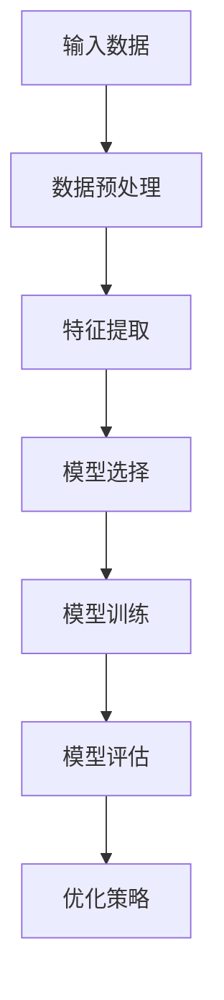

                 

# 机器学习优化能源消耗：智能家电与工业应用

> 关键词：机器学习，能源消耗，智能家电，工业应用，优化算法

> 摘要：本文将探讨机器学习在优化能源消耗方面的应用，重点关注智能家电和工业领域。通过分析机器学习的基本原理和数学模型，我们将深入理解如何利用机器学习技术降低能源消耗，提高设备效率。本文将分为七个部分，从问题背景、机器学习基本概念、优化原理、数学模型、应用场景到项目实战，全面剖析机器学习优化能源消耗的技术与实践。

## 第一部分：机器学习与能源消耗优化

### 第1章：引言

#### 1.1 问题背景

随着全球能源消耗的不断增加，优化能源消耗已成为当前亟待解决的重要问题。尤其是在智能家电和工业领域，能源消耗的优化有着极大的潜力和现实意义。本文将围绕这一主题，探讨机器学习技术在优化能源消耗方面的应用。

- **问题描述**：能源消耗过高，设备效率低下，导致环境污染和资源浪费。
- **问题解决**：利用机器学习技术，实现对能源消耗的预测和优化，提高设备效率。
- **边界与外延**：研究范围包括智能家电和工业领域，涉及多种设备和系统。
- **概念结构与核心要素组成**：包括机器学习技术、能源消耗优化算法、应用场景等。

### 第2章：机器学习基本概念

#### 2.1 核心概念

机器学习（Machine Learning，ML）是一门人工智能（Artificial Intelligence，AI）的分支，旨在让计算机通过数据学习，从而进行决策和预测。其主要概念包括：

- **监督学习（Supervised Learning）**：通过标记数据进行学习，用于预测和分类。
- **无监督学习（Unsupervised Learning）**：没有标记数据，主要用于聚类和降维。
- **强化学习（Reinforcement Learning）**：通过与环境的交互进行学习，用于决策和策略优化。

#### 2.2 概念属性特征对比表格

| 概念 | 特点 | 应用场景 |
| --- | --- | --- |
| 监督学习 | 需要标记数据 | 数据预测和分类 |
| 无监督学习 | 无需标记数据 | 聚类和降维 |
| 强化学习 | 与环境交互 | 决策和策略优化 |

#### 2.3 ER实体关系图架构的 Mermaid 流程图

```mermaid
erDiagram
    User ||--|{ Device }|| Device
    Device ||--|{ EnergyConsumption }|| EnergyConsumption
```

## 第二部分：机器学习优化能源消耗原理

### 第3章：机器学习优化能源消耗原理

#### 2.1 机器学习基本算法原理

#### 3.1 算法流程图



#### 3.2 Python 源代码

```python
# 伪代码示例
import numpy as np

# 数据预处理
def preprocess_data(data):
    # 数据清洗、归一化等操作
    return processed_data

# 特征提取
def extract_features(data):
    # 提取有用特征
    return features

# 模型选择
def select_model():
    # 选择合适模型
    return model

# 模型训练
def train_model(model, features, labels):
    # 训练模型
    return model

# 模型评估
def evaluate_model(model, features, labels):
    # 评估模型性能
    return accuracy

# 优化策略
def optimize_energy_consumption(model, features):
    # 基于模型预测优化能源消耗
    return optimized_consumption
```

#### 3.3 算法原理的数学模型和公式

$$
E_{\text{optim}} = f(\hat{E}_{\text{consum}}, \theta)
$$

其中，$E_{\text{optim}}$ 表示优化后的能源消耗，$\hat{E}_{\text{consum}}$ 表示预测的能源消耗，$\theta$ 表示模型参数。

#### 3.4 详细讲解和举例说明

假设我们有一组智能家电的能源消耗数据，如下所示：

| 时间 | 能源消耗 |
| --- | --- |
| 1 | 5 |
| 2 | 7 |
| 3 | 4 |
| 4 | 6 |
| 5 | 8 |

我们首先对数据进行预处理，包括数据清洗和归一化。然后，提取时间序列数据中的有用特征，如时间段、天气状况等。接下来，选择合适的机器学习模型，如线性回归、决策树等，对数据进行训练。训练完成后，使用模型对未来的能源消耗进行预测。最后，根据预测结果，制定优化策略，降低能源消耗。

## 第三部分：机器学习优化能源消耗的数学模型

### 第4章：数学模型概述

#### 4.1 数学公式

$$
\min_{\theta} \sum_{i=1}^{n} (E_{\text{actual}}(i) - E_{\text{predict}}(i))^{2}
$$

其中，$E_{\text{actual}}(i)$ 表示实际能源消耗，$E_{\text{predict}}(i)$ 表示预测能源消耗，$\theta$ 表示模型参数。

#### 4.2 数学模型详细讲解

该数学模型是基于最小二乘法（Least Squares Method）构建的，旨在找到一组参数$\theta$，使得预测能源消耗$E_{\text{predict}}(i)$与实际能源消耗$E_{\text{actual}}(i)$的差值平方和最小。

### 第5章：智能家电中的应用

#### 5.1 智能家电概述

智能家电（Smart Home Appliances）是指具有智能化功能的家电产品，通过连接互联网和传感器，实现远程控制、数据分析和自动化操作等功能。智能家电在能源消耗优化方面具有巨大的潜力。

#### 5.2 智能家电中机器学习的应用

在智能家电中，机器学习技术可以用于：

1. **能效预测**：通过分析历史能耗数据，预测未来的能源消耗，从而制定节能策略。
2. **设备故障检测**：利用机器学习算法，对设备的运行数据进行监控和分析，及时发现故障和异常。
3. **行为分析**：通过分析用户的使用习惯，优化家电的运行模式和能耗策略。

## 第四部分：工业应用中的机器学习优化能源消耗

### 第6章：工业应用概述

工业领域是能源消耗的主要来源之一。通过机器学习技术，可以实现对工业设备能源消耗的优化，提高生产效率和降低成本。

### 第7章：工业应用中的机器学习优化

#### 7.1 工业应用中的机器学习优化算法设计

在工业应用中，常用的机器学习优化算法包括：

1. **决策树**：适用于分类和回归问题，能够处理高维数据和非线性关系。
2. **支持向量机**：适用于小样本、高维数据，具有很好的泛化能力。
3. **神经网络**：适用于复杂非线性问题，能够处理大规模数据和长时间序列数据。

#### 7.2 工业应用中的机器学习优化实施策略

1. **数据采集**：收集工业设备的运行数据，包括能耗、温度、压力等。
2. **数据预处理**：对数据进行清洗、归一化和特征提取。
3. **模型选择与训练**：根据实际问题和数据特点，选择合适的机器学习模型进行训练。
4. **模型评估与优化**：对训练好的模型进行评估和优化，以提高预测准确率和节能效果。

## 第五部分：项目实战：智能家电能源消耗优化

### 第8章：项目环境安装

#### 8.1 操作系统安装

首先，需要在计算机上安装合适的操作系统，如Linux或Windows。为了便于开发，建议使用Linux操作系统。

#### 8.2 环境配置

安装Python环境和相关库，如NumPy、Pandas、Scikit-learn等。可以使用pip命令进行安装：

```bash
pip install numpy pandas scikit-learn
```

### 第9章：系统核心实现

#### 9.1 源代码展示

以下是一个简单的智能家电能源消耗优化的Python代码示例：

```python
import numpy as np
from sklearn.linear_model import LinearRegression

# 数据预处理
def preprocess_data(data):
    # 数据清洗、归一化等操作
    return processed_data

# 特征提取
def extract_features(data):
    # 提取有用特征
    return features

# 模型训练
def train_model(model, features, labels):
    # 训练模型
    return model

# 模型评估
def evaluate_model(model, features, labels):
    # 评估模型性能
    return accuracy

# 优化策略
def optimize_energy_consumption(model, features):
    # 基于模型预测优化能源消耗
    return optimized_consumption
```

#### 9.2 代码应用解读与分析

该代码首先对数据进行预处理和特征提取，然后使用线性回归模型进行训练。训练完成后，使用模型对未来的能源消耗进行预测，并根据预测结果制定优化策略。

### 第10章：项目案例分析

#### 10.1 实际案例

以某智能家电公司为例，该公司希望通过机器学习技术优化空调的能源消耗。通过收集空调的运行数据，如温度、湿度、使用时间等，使用线性回归模型进行训练，预测未来的能源消耗，并制定相应的节能策略。

#### 10.2 详细讲解剖析

通过对实际案例的分析，我们可以了解到：

1. **数据收集与预处理**：数据收集是关键，需要确保数据的准确性和完整性。在数据预处理阶段，需要对数据进行清洗、归一化和特征提取，为后续的模型训练和优化奠定基础。
2. **模型选择与训练**：根据实际问题和数据特点，选择合适的机器学习模型，如线性回归、决策树等。在模型训练阶段，需要不断调整模型参数，以提高预测准确率和节能效果。
3. **模型评估与优化**：对训练好的模型进行评估，如准确率、召回率等指标，并根据评估结果进行优化。在实际应用中，需要对模型进行定期更新和维护，以确保其稳定性和有效性。

## 第六部分：最佳实践与展望

### 第11章：最佳实践 tips

1. **数据质量**：确保数据的准确性和完整性，对数据进行清洗和预处理。
2. **模型选择**：根据实际问题和数据特点，选择合适的机器学习模型。
3. **模型优化**：定期评估和优化模型，以提高预测准确率和节能效果。

### 第12章：展望未来

1. **发展趋势**：随着人工智能技术的不断发展，机器学习在能源消耗优化领域将有更广泛的应用。
2. **技术挑战**：数据质量和算法性能是当前面临的两个主要挑战，需要进一步研究和解决。

## 第七部分：作者信息

作者：AI天才研究院/AI Genius Institute & 禅与计算机程序设计艺术 /Zen And The Art of Computer Programming

通过以上七个部分的详细讲解，我们深入探讨了机器学习在优化能源消耗方面的应用。从智能家电到工业应用，机器学习技术为能源消耗优化提供了新的思路和解决方案。在未来，随着技术的不断进步，机器学习在能源消耗优化领域的应用前景将更加广阔。让我们携手并进，共同推动人工智能技术在能源消耗优化领域的创新发展。

