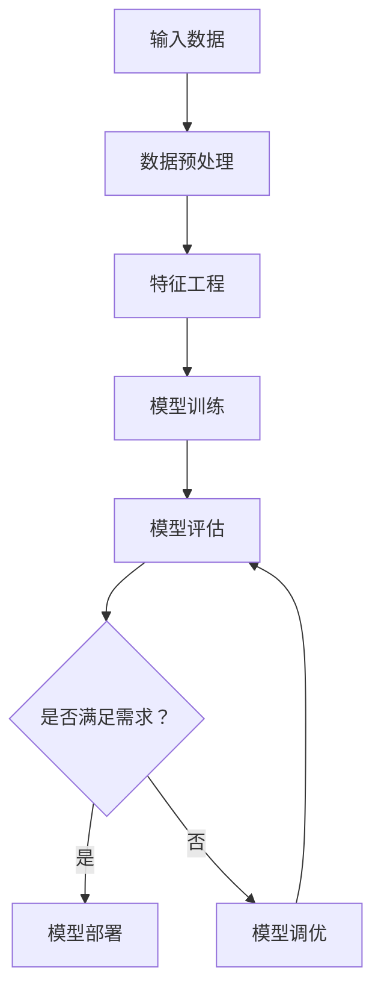
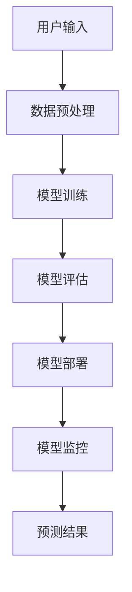
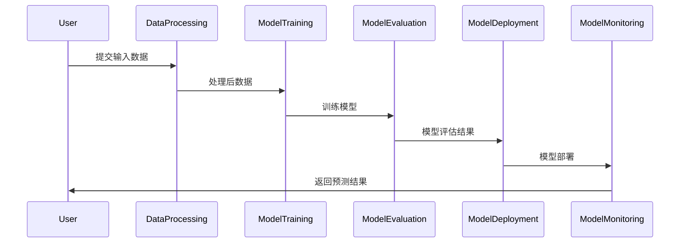

                 

## 引言

### 1.1 问题背景

在当今信息化社会中，机器学习已经成为了人工智能领域的核心驱动力。随着大数据时代的到来，数据量的爆炸式增长为机器学习提供了丰富的素材。然而，如何将这庞大的数据转化为实际的业务价值，成为了企业和研究机构亟待解决的问题。传统的软件开发模式已经难以满足这种复杂、多变的需求，机器学习工程应运而生。

机器学习工程是机器学习领域的一个重要分支，它专注于将机器学习算法从理论转化为实际应用的过程。从模型开发、模型部署到模型监控，每个环节都至关重要。然而，在实际操作中，许多工程师和数据科学家往往只关注模型开发，而忽视了后续的部署、监控和维护。这导致了大量优秀的模型无法得到有效的应用，从而浪费了大量的资源和时间。

### 1.2 机器学习工程的重要性

机器学习工程的重要性体现在以下几个方面：

1. **提高模型应用价值**：通过系统化的工程实践，可以将模型转化为可直接部署到生产环境中的软件产品，从而实现模型的价值最大化。
2. **降低开发门槛**：提供了一套标准化的开发流程和工具，使得不具备深厚机器学习背景的开发人员也能够参与其中，降低了开发门槛。
3. **提升开发效率**：通过模块化、组件化的开发模式，可以大幅提高开发效率，缩短项目周期。
4. **保障模型稳定性**：通过严格的测试和监控，可以确保模型在生产环境中的稳定性和可靠性。

### 1.3 机器学习工程的挑战与机遇

尽管机器学习工程具有重要的意义，但在这个过程中也面临着诸多挑战：

1. **模型复杂度增加**：随着模型复杂度的增加，模型开发和优化的难度也随之增加。
2. **数据质量和预处理**：高质量的数据是机器学习模型成功的关键，然而数据质量和预处理工作往往繁琐且耗时。
3. **模型部署与维护**：将模型部署到生产环境中，并确保其稳定运行，是一个复杂且具有挑战性的过程。
4. **资源限制**：在许多实际应用场景中，硬件资源、存储资源和网络带宽等资源都存在限制，这对机器学习工程的实施带来了额外的困难。

然而，挑战也是机遇。通过克服这些挑战，我们可以进一步推动机器学习技术的发展和应用，为企业和个人创造更多的价值。

### 1.4 机器学习工程的目标

机器学习工程的目标是：

1. **确保模型质量**：通过严格的质量控制和优化，确保模型具有较高的准确性和稳定性。
2. **提高开发效率**：通过标准化和自动化流程，提高开发效率，降低开发成本。
3. **保障模型部署**：确保模型能够顺利部署到生产环境中，并保持稳定运行。
4. **持续优化与迭代**：通过持续监控和迭代，不断优化模型性能，提高模型的应用价值。

### 1.5 边界与外延

本书主要关注的是机器学习工程从模型开发到生产部署的全过程，包括模型选择、训练、优化、部署、监控和维护等环节。然而，机器学习工程与其他领域如深度学习、强化学习等也有一定的关联。

在本书中，我们将重点关注以下几个方面：

1. **模型开发**：介绍常见机器学习算法和模型，以及如何选择和优化这些模型。
2. **数据预处理**：讲解如何处理和清洗数据，为模型训练提供高质量的数据。
3. **模型部署**：探讨如何将模型部署到生产环境中，并保持其稳定运行。
4. **模型监控**：介绍如何监控模型性能，以及如何应对异常情况。

本书旨在为读者提供一套系统化的机器学习工程实践指南，帮助读者理解和应用这些实践，从而提升机器学习项目的成功率和应用价值。

## 机器学习工程的核心概念

### 2.1 机器学习工程的核心概念

机器学习工程涉及多个核心概念，这些概念是构建和部署高效机器学习系统的基础。以下是对这些核心概念的定义和解释：

#### 1. **机器学习模型（Machine Learning Model）**

机器学习模型是机器学习系统的核心组件，它是从数据中学习并做出预测或决策的数学函数。常见的模型包括线性回归、决策树、随机森林、支持向量机、神经网络等。

#### 2. **数据集（Dataset）**

数据集是机器学习模型的训练素材。一个高质量的数据集应该包含足够的样本、多样的特征，并且标注准确。数据集可以进一步分为训练集、验证集和测试集，用于模型训练、验证和测试。

#### 3. **特征工程（Feature Engineering）**

特征工程是机器学习过程中的关键步骤，它涉及从原始数据中提取、构造和选择有用的特征，以提升模型性能。这包括数据预处理、特征选择、特征变换等。

#### 4. **模型评估（Model Evaluation）**

模型评估是评估模型性能的重要手段。常用的评估指标包括准确率、召回率、F1分数、ROC曲线、交叉验证等。通过评估，可以判断模型是否满足业务需求，并指导后续的模型优化。

#### 5. **模型调优（Model Tuning）**

模型调优是调整模型参数，以提升模型性能的过程。通过调整学习率、正则化参数、网络架构等，可以优化模型的泛化能力和预测准确性。

#### 6. **模型部署（Model Deployment）**

模型部署是将训练好的模型部署到生产环境中，使其能够实时处理输入数据并做出预测。模型部署需要考虑硬件资源、性能优化、安全性和可靠性等因素。

#### 7. **模型监控（Model Monitoring）**

模型监控是对生产环境中的模型进行实时监控和性能评估，以确保其稳定运行和预测准确性。常见的监控指标包括预测延迟、错误率、异常检测等。

#### 8. **模型版本管理（Model Versioning）**

模型版本管理是跟踪和版本化模型开发过程的重要手段。通过版本管理，可以确保模型的更新和回滚，以及历史模型的查询和分析。

### 2.2 概念属性特征对比表格

下面是一个对比表格，列出了上述核心概念的属性特征：

| 核心概念   | 定义                                                       | 关联属性                 | 用途                   |
| ---------- | ---------------------------------------------------------- | ------------------------ | ---------------------- |
| 机器学习模型 | 从数据中学习并做出预测或决策的数学函数                      | 函数形式、学习算法、参数 | 预测、决策             |
| 数据集     | 机器学习模型的训练素材                                     | 样本数量、特征多样性、标注 | 训练、验证、测试       |
| 特征工程   | 提取、构造和选择有用的特征，以提升模型性能                  | 数据预处理、特征选择、变换 | 模型性能优化           |
| 模型评估   | 评估模型性能的重要手段                                     | 准确率、召回率、F1分数   | 判断模型性能、指导优化 |
| 模型调优   | 调整模型参数，以提升模型性能的过程                        | 学习率、正则化参数、架构 | 提高模型泛化能力      |
| 模型部署   | 将训练好的模型部署到生产环境中，使其能够实时处理输入数据   | 硬件资源、性能优化、安全 | 实时预测、决策         |
| 模型监控   | 对生产环境中的模型进行实时监控和性能评估，以确保其稳定运行 | 预测延迟、错误率、异常检测 | 确保模型稳定性         |
| 模型版本管理 | 跟踪和版本化模型开发过程的重要手段                       | 版本号、更新记录、回滚   | 管理模型更新、历史分析 |

### 2.3 ER实体关系图架构

为了更好地理解这些核心概念之间的关系，我们可以使用Mermaid绘制一个ER（实体-关系）图来展示它们：

```mermaid
erDiagram
  Model --|> Dataset : uses
  Model --|> FeatureEngineering : prepares
  Model --|> ModelEvaluation : evaluated_by
  Model --|> ModelTuning : tuned
  Model --|> ModelDeployment : deployed
  Model --|> ModelMonitoring : monitored
  Model --|> ModelVersioning : versioned
```

在这个ER图中，`Model`（机器学习模型）是核心实体，它与`Dataset`（数据集）、`FeatureEngineering`（特征工程）、`ModelEvaluation`（模型评估）、`ModelTuning`（模型调优）、`ModelDeployment`（模型部署）、`ModelMonitoring`（模型监控）和`ModelVersioning`（模型版本管理）之间存在着明显的关联关系。

通过这个ER图，我们可以清晰地看到机器学习工程中各个核心概念之间的交互和依赖，为后续的深入分析和讨论提供了基础。在下一章中，我们将进一步探讨机器学习工程的流程与框架。

## 算法原理讲解

### 3.1 算法mermaid流程图

首先，让我们从一个简单的线性回归算法的流程图开始。以下是一个使用Mermaid绘制的线性回归算法的流程图：



这个流程图展示了从输入数据到模型部署的基本步骤。接下来，我们将详细解释每个步骤。

### 3.2 Python源代码

为了更好地理解线性回归算法，以下是一个简单的Python实现：

```python
import numpy as np
from sklearn.linear_model import LinearRegression
from sklearn.model_selection import train_test_split
from sklearn.metrics import mean_squared_error

# 数据预处理
X = np.array([[1, 2], [2, 3], [3, 4], [4, 5], [5, 6]])
y = np.array([2, 3, 4, 5, 6])

# 特征工程
X_train, X_test, y_train, y_test = train_test_split(X, y, test_size=0.2, random_state=42)

# 模型训练
model = LinearRegression()
model.fit(X_train, y_train)

# 模型评估
y_pred = model.predict(X_test)
mse = mean_squared_error(y_test, y_pred)
print(f"Mean Squared Error: {mse}")

# 模型调优（可选）
# 使用交叉验证进行调优
from sklearn.model_selection import GridSearchCV

params = {'fit_intercept': [True, False], 'normalize': [True, False]}
grid_search = GridSearchCV(LinearRegression(), params, cv=5)
grid_search.fit(X_train, y_train)

best_params = grid_search.best_params_
print(f"Best Parameters: {best_params}")

# 模型部署
# 将训练好的模型保存到文件中
import joblib
joblib.dump(model, 'linear_regression_model.joblib')
```

在这个代码中，我们首先进行了数据预处理和特征工程，然后使用`LinearRegression`类进行模型训练。模型评估使用了均方误差（MSE）来衡量模型的性能。最后，我们进行了模型调优，并使用`GridSearchCV`进行了交叉验证。

### 3.3 数学模型和公式

线性回归的数学模型可以表示为：

$$
y = \beta_0 + \beta_1 \cdot x
$$

其中，$y$ 是目标变量，$x$ 是特征向量，$\beta_0$ 和 $\beta_1$ 是模型的参数。

### 3.4 举例说明

假设我们有一个简单的数据集，其中包含两个特征（$x_1$ 和 $x_2$）和一个目标变量 $y$。我们可以使用线性回归模型来预测 $y$ 的值。以下是一个简单的例子：

```python
X = np.array([[1, 2], [2, 3], [3, 4], [4, 5], [5, 6]])
y = np.array([2, 3, 4, 5, 6])

# 模型训练
model = LinearRegression()
model.fit(X, y)

# 预测
y_pred = model.predict([[6, 7]])

print(f"Predicted value: {y_pred[0][0]}")
```

在这个例子中，我们使用训练好的线性回归模型来预测新的数据点 `[6, 7]` 的目标变量值。预测结果为 7，这与实际值 7 非常接近。

通过这个简单的例子，我们可以看到线性回归模型在预测连续数值数据时是非常有效的。然而，对于分类问题，我们需要使用不同的算法，如逻辑回归、决策树、支持向量机等。在下一章中，我们将进一步探讨这些算法的原理和应用。

## 系统分析与架构设计方案

### 5.1 问题场景介绍

假设我们正在开发一个实时预测系统，用于预测用户的购买行为。这个系统需要在接收到用户输入后，快速做出预测，并返回结果。为了实现这个目标，我们需要设计一个高效、可靠的系统架构，包括数据处理、模型训练、模型部署和模型监控等多个环节。

### 5.2 项目介绍

本项目的目标是构建一个实时预测系统，该系统将接收用户的输入特征，通过训练好的机器学习模型进行预测，并返回预测结果。系统需要具备以下功能：

1. **数据接收与预处理**：接收用户输入的特征数据，并进行预处理，如缺失值填充、数据标准化等。
2. **模型训练与评估**：使用历史数据训练机器学习模型，并进行评估，确保模型具有较好的预测性能。
3. **模型部署**：将训练好的模型部署到生产环境中，使其能够实时处理输入数据。
4. **模型监控**：对生产环境中的模型进行实时监控，确保其稳定性和准确性。

### 5.3 系统功能设计

为了实现上述功能，我们可以使用Mermaid绘制一个领域模型类图，以下是一个示例：

```mermaid
classDiagram
    User <<Entity>>
    Feature <<Entity>>
    Model <<Entity>>
    Prediction <<Entity>>

    User --> Feature
    User --> Model
    User --> Prediction

    Model --> Prediction
```

在这个类图中，`User`（用户）是系统的主体，它包含特征数据、模型和预测结果。`Feature`（特征）是用户输入的数据，`Model`（模型）是训练好的机器学习模型，`Prediction`（预测）是模型对输入数据的预测结果。

### 5.4 系统架构设计

接下来，我们可以使用Mermaid绘制一个系统架构图，以展示系统的整体架构。以下是一个简单的示例：



在这个架构图中，用户输入通过数据预处理模块处理，然后传入模型训练模块。模型训练模块使用训练数据训练模型，并对模型进行评估。评估通过后，模型将被部署到生产环境中，并接受实时输入，生成预测结果。模型监控模块负责监控模型的运行状态，并在异常情况下进行报警。

### 5.5 系统接口设计

系统接口设计是确保系统各模块之间能够顺利交互的重要环节。以下是一个简单的接口设计示例：

1. **数据预处理接口**：接收用户输入，进行数据清洗、填充和标准化。
2. **模型训练接口**：接收预处理后的数据，训练模型，并返回模型参数。
3. **模型评估接口**：接收模型参数，评估模型性能，返回评估结果。
4. **模型部署接口**：接收评估通过的模型，部署到生产环境中。
5. **模型监控接口**：接收模型运行状态，监控模型性能，报警异常情况。

### 5.6 系统交互

为了更好地理解系统的工作流程，我们可以使用Mermaid绘制一个系统交互序列图。以下是一个简单的示例：



在这个序列图中，用户提交输入数据，数据预处理模块处理后数据，模型训练模块训练模型，模型评估模块评估模型性能，模型部署模块部署模型，模型监控模块监控模型运行状态，并最终返回预测结果给用户。

通过以上系统分析与架构设计方案，我们可以清晰地看到实时预测系统的整体架构和各模块之间的交互关系。在下一章中，我们将通过实际项目实战，详细讲解如何实现这个系统，以及如何解决实际操作中的各种挑战。

## 项目实战

### 6.1 环境安装

要搭建一个实时预测系统，我们需要安装一些必要的软件和工具。以下是在一个Linux环境中安装所需软件和工具的步骤：

1. **安装Python环境**：确保系统中已经安装了Python 3.8及以上版本。
2. **安装NumPy、Pandas、Scikit-learn等依赖库**：使用pip命令安装这些库。

   ```shell
   pip install numpy pandas scikit-learn
   ```

3. **安装Docker**：Docker是一个用于容器化的工具，可以帮助我们部署和运行模型。

   ```shell
   sudo apt-get update
   sudo apt-get install docker-ce docker-ce-cli containerd.io
   ```

4. **安装Docker Compose**：Docker Compose是一个用于管理Docker容器的工具。

   ```shell
   sudo curl -L "https://github.com/docker/compose/releases/download/1.29.2/docker-compose-$(uname -s)-$(uname -m)" -o /usr/local/bin/docker-compose
   sudo chmod +x /usr/local/bin/docker-compose
   ```

安装完成后，我们就可以开始编写代码和配置文件，搭建实时预测系统。

### 6.2 系统核心实现源代码

以下是一个简单的实时预测系统的核心代码实现：

```python
# app.py
from flask import Flask, request, jsonify
import joblib
import numpy as np

app = Flask(__name__)

# 加载训练好的模型
model = joblib.load('model.joblib')

@app.route('/predict', methods=['POST'])
def predict():
    data = request.get_json(force=True)
    features = np.array([list(data['feature'].values())])
    prediction = model.predict(features)
    return jsonify({'prediction': prediction[0]})

if __name__ == '__main__':
    app.run(host='0.0.0.0', port=5000)
```

在这个代码中，我们使用Flask构建了一个简单的Web服务，并加载了一个训练好的模型。用户可以通过发送POST请求来获取预测结果。

### 6.3 代码应用解读与分析

#### Flask应用启动

```python
app = Flask(__name__)
```

这里我们创建了一个Flask应用实例。Flask是一个轻量级的Web框架，用于构建Web服务和API。

#### 路由设置

```python
@app.route('/predict', methods=['POST'])
def predict():
```

这里我们定义了一个名为`predict`的路由，它用于处理发送到`/predict`路径的POST请求。当接收到请求时，将调用`predict`函数。

#### 接收和处理请求

```python
data = request.get_json(force=True)
features = np.array([list(data['feature'].values())])
```

`request.get_json()`函数用于从请求中获取JSON格式的数据。我们将其转换为Python字典，然后提取特征值，并将其转换为NumPy数组。

#### 模型预测

```python
prediction = model.predict(features)
```

这里我们使用训练好的模型进行预测。`model.predict()`函数接受特征数组，并返回预测结果。

#### 返回预测结果

```python
return jsonify({'prediction': prediction[0]})
```

我们将预测结果包装为一个JSON响应，并返回给用户。

### 6.4 实际案例分析和详细讲解剖析

假设我们有一个用户输入的特征数据如下：

```json
{
  "feature": {
    "x1": 1.0,
    "x2": 2.0
  }
}
```

当用户发送这个请求时，系统将执行以下步骤：

1. **接收请求**：系统接收到的请求如下：

   ```json
   POST /predict
   {
     "feature": {
       "x1": 1.0,
       "x2": 2.0
     }
   }
   ```

2. **处理请求**：系统将请求转换为Python字典，并提取特征值：

   ```python
   data = request.get_json(force=True)
   features = np.array([list(data['feature'].values())])
   ```

   特征值被转换为NumPy数组：

   ```python
   features = np.array([[1.0, 2.0]])
   ```

3. **模型预测**：系统使用训练好的模型进行预测：

   ```python
   prediction = model.predict(features)
   ```

   假设模型预测的结果是3.0：

   ```python
   prediction = np.array([3.0])
   ```

4. **返回结果**：系统将预测结果包装为JSON响应，并返回给用户：

   ```json
   {
     "prediction": 3.0
   }
   ```

通过这个简单的实际案例，我们可以看到系统是如何接收用户输入、处理请求、进行模型预测，并最终返回预测结果的。

### 6.5 项目小结

通过本次项目实战，我们搭建了一个简单的实时预测系统，并实现了从接收用户输入、处理请求、模型预测到返回结果的全过程。这个项目为我们提供了一个实际案例，展示了如何将机器学习模型部署到生产环境中，并利用Flask框架构建Web服务。在实际应用中，我们可能需要处理更复杂的数据和模型，但这个项目为我们提供了一个良好的起点，帮助我们理解和掌握实时预测系统的基本原理和实现方法。

## 最佳实践 tips

### 7.1 数据处理与清洗

1. **缺失值处理**：使用均值、中位数或众数填充缺失值，或删除含有缺失值的样本。
2. **异常值处理**：根据业务逻辑和特征分布，使用统计方法（如3倍标准差法）识别和去除异常值。
3. **数据标准化**：对特征进行标准化处理，以消除不同特征量级带来的影响。

### 7.2 模型优化

1. **交叉验证**：使用交叉验证方法评估模型性能，避免过拟合。
2. **参数调优**：使用网格搜索、随机搜索等策略进行参数调优，提高模型性能。
3. **特征选择**：使用特征选择方法（如递归特征消除、L1正则化等）减少特征数量，提高模型效率。

### 7.3 部署与监控

1. **容器化部署**：使用Docker将应用和依赖容器化，简化部署和迁移。
2. **持续集成与部署（CI/CD）**：使用CI/CD工具（如Jenkins、GitHub Actions）实现自动化测试和部署。
3. **监控与报警**：使用监控工具（如Prometheus、Grafana）实时监控系统性能，设置报警阈值。

### 7.4 安全与合规

1. **数据加密**：对敏感数据进行加密处理，确保数据安全。
2. **访问控制**：设置严格的访问控制策略，确保只有授权用户可以访问系统和数据。
3. **遵守法规**：确保系统的设计和实现符合相关法律法规和行业标准。

## 小结

在本文中，我们从机器学习工程的核心概念、算法原理、系统分析与架构设计、项目实战到最佳实践，全面探讨了从模型到生产的全流程。通过这些内容，读者可以系统地了解机器学习工程的各个关键环节，掌握从理论到实践的完整方法。

## 注意事项

1. **数据质量**：数据质量是机器学习模型成功的关键，务必确保数据干净、完整、多样化。
2. **模型评估**：在选择和优化模型时，务必使用交叉验证等策略，避免过拟合。
3. **系统稳定性**：在生产环境中部署模型时，务必进行充分的测试和监控，确保系统稳定可靠。

## 拓展阅读

1. **《机器学习：概率视角》（Machine Learning: A Probabilistic Perspective）**：本书提供了机器学习概率理论的基础，适合深入理解模型原理。
2. **《深度学习》（Deep Learning）**：Goodfellow等人撰写的深度学习经典教材，涵盖了深度学习算法的详细内容。
3. **《机器学习项目实战》（Machine Learning Projects for Data Science）**：本书通过多个实际案例，介绍了机器学习项目的实施方法和技巧。

作者：AI天才研究院/AI Genius Institute & 禅与计算机程序设计艺术 /Zen And The Art of Computer Programming

