                 


### 第1章：机器学习模型部署概述

#### 背景介绍

机器学习（Machine Learning，ML）作为一种人工智能（AI）的技术，在数据处理、预测分析、自动化决策等方面展现出强大的潜力。然而，机器学习模型的价值不仅仅体现在实验室的研究中，更重要的是将模型部署到实际的生产环境中，实现其在业务中的应用。

**核心概念术语说明**：
- **机器学习模型**：通过训练算法从数据中学习规律，进行预测或决策的模型。
- **实验室环境**：指模型开发和测试的环境，通常包括数据集、算法、工具等。
- **生产环境**：指模型实际运行的环境，通常要求高可用性、高效率、低延迟。

**问题背景**：
随着机器学习技术的不断进步，越来越多的企业和组织开始尝试将机器学习模型应用于实际业务中。然而，从实验室环境到生产环境的过渡并非易事，面临着诸多挑战。

**问题描述**：
- **模型性能下降**：在生产环境中，数据分布可能与训练数据不同，导致模型性能下降。
- **部署成本高**：生产环境需要考虑硬件、软件、运维等多方面的成本。
- **部署复杂性**：从模型选择、训练、评估到部署，每个环节都需要精心设计和实施。

**问题解决**：
为了解决上述问题，需要一套完整的模型部署流程，包括数据处理、模型选择、模型调优、部署实施、模型监控与维护等环节。

**边界与外延**：
模型部署不仅仅涉及技术层面，还涉及到业务需求、数据安全、成本效益等多方面因素。

**概念结构与核心要素组成**：
- **数据处理**：数据质量、数据预处理、数据流与管道设计。
- **模型选择与设计**：模型选择策略、模型架构设计、模型可解释性。
- **模型版本管理与监控**：模型版本控制、模型监控与反馈、模型更新策略。
- **部署实施**：部署环境搭建与配置、模型服务化与API设计、部署案例与实践。
- **生产环境中的模型管理**：模型性能监控、模型故障处理、模型生命周期管理。

#### 核心概念与联系

**核心概念**：
- **数据处理**：涉及数据质量管理和数据预处理。
- **模型选择与设计**：涉及模型选择策略、模型架构设计、模型可解释性。
- **模型版本管理与监控**：涉及模型版本控制、模型监控与反馈、模型更新策略。

**概念属性特征对比表格**：

| 概念 | 属性特征 |  
| --- | --- |  
| 数据处理 | 数据质量、数据预处理、数据流与管道设计 |  
| 模型选择与设计 | 模型选择策略、模型架构设计、模型可解释性 |  
| 模型版本管理与监控 | 模型版本控制、模型监控与反馈、模型更新策略 |

**ER实体关系图架构 Mermaid 流程图**：

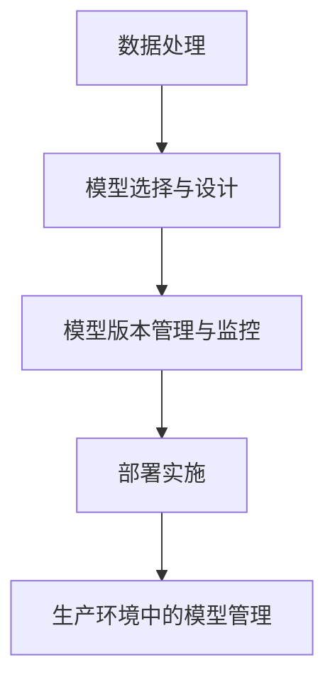

#### 算法原理讲解

在机器学习模型部署中，算法选择和原理理解是关键环节。以下将介绍常用的机器学习算法选择策略。

**算法选择策略**：

1. **评估指标**：准确率、召回率、F1分数、ROC曲线、AUC。
2. **选择方法**：交叉验证、网格搜索、贝叶斯优化。
3. **模型评估与比较**：使用Python代码进行模型评估和比较。

**Mermaid 流程图**：

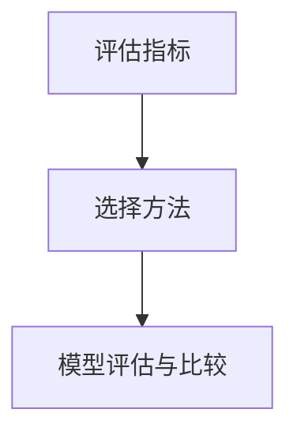

**Python 代码示例**：

```python
from sklearn.datasets import load_iris
from sklearn.model_selection import train_test_split
from sklearn.ensemble import RandomForestClassifier
from sklearn.metrics import accuracy_score, classification_report

# 加载数据集
iris = load_iris()
X, y = iris.data, iris.target

# 数据集划分
X_train, X_test, y_train, y_test = train_test_split(X, y, test_size=0.3, random_state=42)

# 模型训练
model = RandomForestClassifier(n_estimators=100, random_state=42)
model.fit(X_train, y_train)

# 模型预测
y_pred = model.predict(X_test)

# 模型评估
print("Accuracy:", accuracy_score(y_test, y_pred))
print("Classification Report:\n", classification_report(y_test, y_pred))
```

**算法原理**：

机器学习算法的原理是通过训练数据集，使模型学会从输入数据中提取特征，并根据这些特征对未知数据进行预测。常用的算法包括决策树、随机森林、支持向量机、神经网络等。

**数学模型和公式**：

假设我们有一个分类问题，给定特征向量 $X$，我们需要预测类别 $Y$。常见的机器学习算法包括逻辑回归、决策树、支持向量机、神经网络等。以下以逻辑回归为例：

$$
\begin{aligned}
\hat{Y} &= \sigma(\beta_0 + \beta_1X_1 + \beta_2X_2 + \ldots + \beta_nX_n) \\
\sigma(x) &= \frac{1}{1 + e^{-x}}
\end{aligned}
$$

其中，$\sigma$ 是 sigmoid 函数，$\beta_0, \beta_1, \beta_2, \ldots, \beta_n$ 是模型参数。

**举例说明**：

假设我们有一个二分类问题，特征向量 $X = (X_1, X_2)$，类别 $Y$ 可以是0或1。我们使用逻辑回归模型进行预测。

$$
\begin{aligned}
\hat{Y} &= \sigma(\beta_0 + \beta_1X_1 + \beta_2X_2) \\
P(Y=1|X) &= \frac{1}{1 + e^{-(\beta_0 + \beta_1X_1 + \beta_2X_2)})
\end{aligned}
$$

例如，对于特征向量 $X = (2, 3)$，我们可以计算预测概率：

$$
\begin{aligned}
P(Y=1|X) &= \frac{1}{1 + e^{-(\beta_0 + \beta_1 \cdot 2 + \beta_2 \cdot 3)}) \\
&= \frac{1}{1 + e^{-(\beta_0 + 2\beta_1 + 3\beta_2)}}
\end{aligned}
$$

如果 $P(Y=1|X) > 0.5$，则预测类别为1；否则，预测类别为0。

### 第2章：机器学习模型的核心概念

#### 背景介绍

在深入探讨机器学习模型的部署之前，了解模型的核心概念和基础知识是至关重要的。这一章将介绍机器学习模型的一些基本概念，包括模型选择与评估、特征工程与预处理、模型调优与超参数调整。

#### 核心概念与联系

**核心概念**：
- **模型选择与评估**：选择合适的模型并进行评估。
- **特征工程与预处理**：提取和处理特征，以提高模型的性能。
- **模型调优与超参数调整**：调整模型参数，以优化模型性能。

**概念属性特征对比表格**：

| 概念 | 属性特征 |    
| --- | --- |    
| 模型选择与评估 | 模型选择策略、评估指标、交叉验证 |    
| 特征工程与预处理 | 特征提取、特征选择、特征标准化 |    
| 模型调优与超参数调整 | 超参数、网格搜索、贝叶斯优化 |  

**ER实体关系图架构 Mermaid 流程图**：

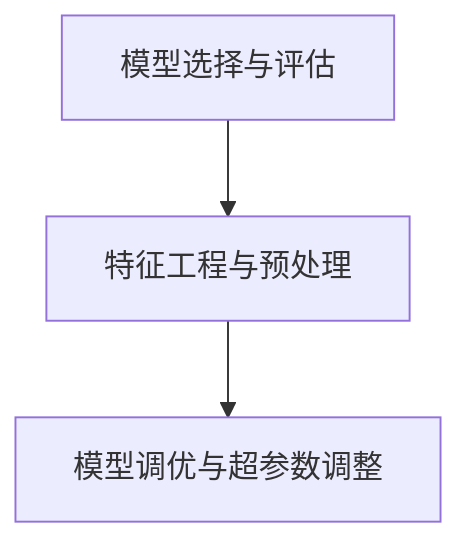

#### 算法原理讲解

**模型选择与评估**

1. **评估指标**：
   - **准确率**：预测正确的样本占总样本的比例。
   - **召回率**：预测正确的正样本占总正样本的比例。
   - **F1分数**：准确率和召回率的调和平均。
   - **ROC曲线**：接受者操作特性曲线，用于评估分类器的性能。
   - **AUC**：ROC曲线下面积，用于评估分类器的性能。

2. **选择方法**：
   - **交叉验证**：将数据集划分为多个子集，轮流进行训练和验证。
   - **网格搜索**：遍历所有可能的超参数组合，选择最佳组合。
   - **贝叶斯优化**：利用贝叶斯统计模型寻找最优超参数。

3. **模型评估与比较**：

```python
from sklearn.datasets import load_iris
from sklearn.model_selection import train_test_split
from sklearn.ensemble import RandomForestClassifier
from sklearn.metrics import accuracy_score, classification_report

# 加载数据集
iris = load_iris()
X, y = iris.data, iris.target

# 数据集划分
X_train, X_test, y_train, y_test = train_test_split(X, y, test_size=0.3, random_state=42)

# 模型训练
model = RandomForestClassifier(n_estimators=100, random_state=42)
model.fit(X_train, y_train)

# 模型预测
y_pred = model.predict(X_test)

# 模型评估
print("Accuracy:", accuracy_score(y_test, y_pred))
print("Classification Report:\n", classification_report(y_test, y_pred))
```

**特征工程与预处理**

1. **特征提取**：从原始数据中提取有用的特征。
2. **特征选择**：选择对模型性能有显著影响的特征。
3. **特征标准化**：将特征值缩放到相同的范围，以消除不同特征之间的尺度差异。

**Mermaid 流程图**：

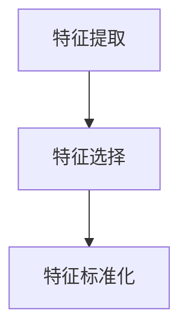

**模型调优与超参数调整**

1. **超参数**：模型参数的取值，如学习率、正则化参数等。
2. **调优方法**：
   - **网格搜索**：遍历所有可能的超参数组合。
   - **贝叶斯优化**：利用贝叶斯统计模型寻找最优超参数。

3. **调优流程**：

```python
from sklearn.datasets import load_iris
from sklearn.model_selection import train_test_split
from sklearn.ensemble import RandomForestClassifier
from sklearn.metrics import accuracy_score, classification_report
from sklearn.model_selection import GridSearchCV

# 加载数据集
iris = load_iris()
X, y = iris.data, iris.target

# 数据集划分
X_train, X_test, y_train, y_test = train_test_split(X, y, test_size=0.3, random_state=42)

# 模型训练
model = RandomForestClassifier(random_state=42)
param_grid = {'n_estimators': [100, 200, 300], 'max_depth': [None, 10, 20]}

grid_search = GridSearchCV(model, param_grid, cv=5)
grid_search.fit(X_train, y_train)

# 模型预测
y_pred = grid_search.predict(X_test)

# 模型评估
print("Best Parameters:", grid_search.best_params_)
print("Accuracy:", accuracy_score(y_test, y_pred))
print("Classification Report:\n", classification_report(y_test, y_pred))
```

### 第3章：数据处理与存储

#### 背景介绍

在机器学习模型部署过程中，数据处理与存储是至关重要的环节。本章将介绍数据处理与存储的基础知识，包括数据质量管理、数据存储方案选择、数据流与管道设计。

#### 核心概念与联系

**核心概念**：
- **数据质量管理**：确保数据的质量，包括数据完整性、一致性和准确性。
- **数据存储方案选择**：选择合适的数据存储方案，如关系型数据库、NoSQL数据库、分布式存储系统。
- **数据流与管道设计**：设计数据处理流程和数据传输管道，确保数据的有效处理和传输。

**概念属性特征对比表格**：

| 概念 | 属性特征 |      
| --- | --- |      
| 数据质量管理 | 数据完整性、一致性和准确性 |      
| 数据存储方案选择 | 关系型数据库、NoSQL数据库、分布式存储系统 |      
| 数据流与管道设计 | 数据处理流程、数据传输管道、数据缓存 |    

**ER实体关系图架构 Mermaid 流程图**：

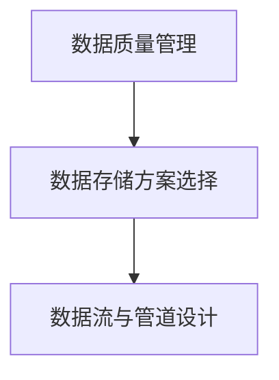

#### 算法原理讲解

**数据质量管理**

1. **数据完整性**：确保数据的完整性，防止数据丢失或重复。
2. **数据一致性**：确保数据在不同系统和应用之间的一致性。
3. **数据准确性**：确保数据的准确性，避免错误或误导性的数据。

**Mermaid 流程图**：

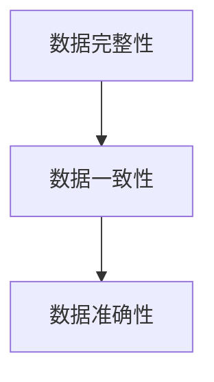

**数据存储方案选择**

1. **关系型数据库**：如MySQL、PostgreSQL，适用于结构化数据存储和查询。
2. **NoSQL数据库**：如MongoDB、Redis，适用于非结构化数据存储和快速访问。
3. **分布式存储系统**：如HDFS、Cassandra，适用于大规模数据存储和高可用性。

**Mermaid 流程图**：

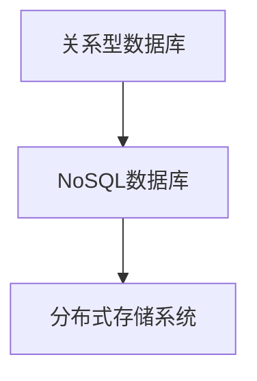

**数据流与管道设计**

1. **数据处理流程**：设计数据处理流程，包括数据采集、清洗、转换、存储等步骤。
2. **数据传输管道**：设计数据传输管道，确保数据在不同系统之间的传输效率和可靠性。
3. **数据缓存**：设计数据缓存机制，提高数据访问速度和系统性能。

**Mermaid 流程图**：

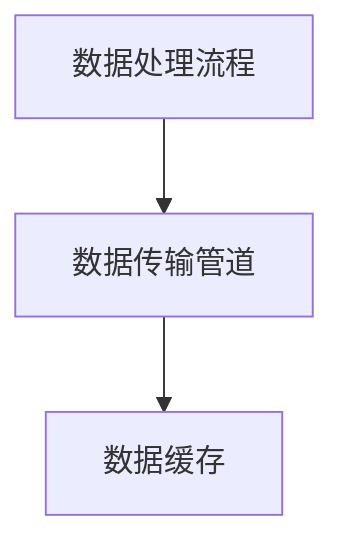

### 第4章：模型选择与设计

#### 背景介绍

模型选择与设计是机器学习模型部署过程中至关重要的环节。本章将介绍模型选择策略、模型架构设计、模型可解释性，帮助读者更好地理解模型选择与设计的过程。

#### 核心概念与联系

**核心概念**：
- **模型选择策略**：根据业务需求和数据特征选择合适的模型。
- **模型架构设计**：设计模型的架构，包括网络结构、层、神经元等。
- **模型可解释性**：解释模型的工作原理和决策过程，提高模型的透明度和可信度。

**概念属性特征对比表格**：

| 概念 | 属性特征 |          
| --- | --- |          
| 模型选择策略 | 业务需求、数据特征、模型评估 |          
| 模型架构设计 | 网络结构、层、神经元、激活函数 |          
| 模型可解释性 | 决策过程、特征重要性、可视化 |        

**ER实体关系图架构 Mermaid 流程图**：

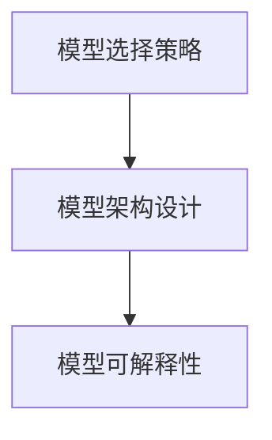

#### 算法原理讲解

**模型选择策略**

1. **业务需求**：根据业务需求选择合适的模型，如分类、回归、聚类等。
2. **数据特征**：根据数据特征选择合适的模型，如线性关系、非线性关系、稀疏特征等。
3. **模型评估**：使用评估指标（如准确率、召回率、F1分数等）评估模型性能，选择最佳模型。

**Mermaid 流程图**：

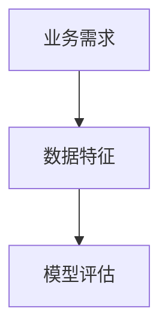

**模型架构设计**

1. **网络结构**：设计神经网络的结构，包括输入层、隐藏层和输出层。
2. **层**：确定每层的神经元数量和连接方式。
3. **神经元**：设计神经元的激活函数，如sigmoid、ReLU、Tanh等。
4. **激活函数**：选择合适的激活函数，提高模型的性能和鲁棒性。

**Mermaid 流程图**：

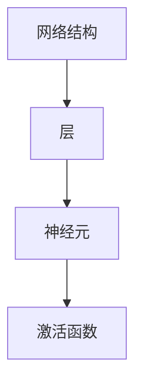

**模型可解释性**

1. **决策过程**：解释模型如何根据输入特征做出预测。
2. **特征重要性**：确定特征对模型预测的影响程度，提高模型的可解释性。
3. **可视化**：使用可视化技术展示模型的工作原理和决策过程，提高模型的透明度和可信度。

**Mermaid 流程图**：

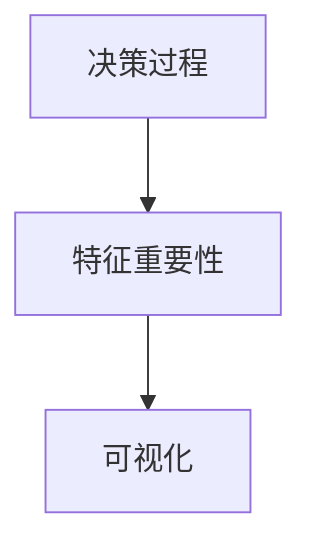

### 第5章：模型版本管理与监控

#### 背景介绍

在机器学习模型部署过程中，版本管理和监控是确保模型稳定性和性能的关键环节。本章将介绍模型版本管理、模型监控与反馈、模型更新策略，帮助读者理解如何有效地管理模型版本和性能。

#### 核心概念与联系

**核心概念**：
- **模型版本管理**：对模型的各个版本进行管理和追踪，确保模型的稳定性和可追溯性。
- **模型监控与反馈**：实时监控模型的性能和运行状态，收集反馈信息，以便进行模型优化和调整。
- **模型更新策略**：制定模型更新的策略和方法，确保模型能够及时更新和优化。

**概念属性特征对比表格**：

| 概念 | 属性特征 |            
| --- | --- |            
| 模型版本管理 | 版本控制、历史记录、版本回滚 |            
| 模型监控与反馈 | 性能监控、异常检测、反馈收集 |            
| 模型更新策略 | 自动更新、手动更新、更新频率 |        

**ER实体关系图架构 Mermaid 流程图**：

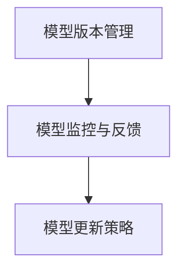

#### 算法原理讲解

**模型版本管理**

1. **版本控制**：使用版本控制系统（如Git）对模型的代码和配置进行版本控制，确保模型的稳定性和可追溯性。
2. **历史记录**：记录模型的训练数据、参数设置、评估结果等历史信息，以便进行模型分析和优化。
3. **版本回滚**：在模型更新失败或性能下降时，可以回滚到之前的版本，确保系统的稳定运行。

**Mermaid 流程图**：

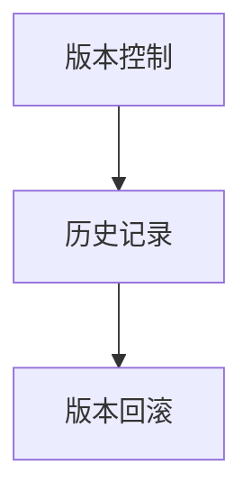

**模型监控与反馈**

1. **性能监控**：实时监控模型的运行状态，包括模型的响应时间、准确率、召回率等指标。
2. **异常检测**：通过监控模型的运行状态和性能指标，检测模型是否出现异常，如过拟合、欠拟合等。
3. **反馈收集**：收集用户对模型的反馈信息，如预测结果、使用体验等，以便进行模型优化和调整。

**Mermaid 流程图**：

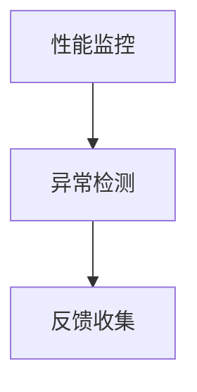

**模型更新策略**

1. **自动更新**：根据预设的更新策略，自动更新模型，如定期更新、实时更新等。
2. **手动更新**：根据实际情况手动更新模型，如用户反馈、性能下降等。
3. **更新频率**：制定合适的更新频率，如每日更新、每周更新等，确保模型能够及时更新和优化。

**Mermaid 流程图**：

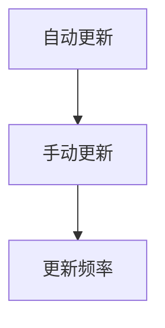

### 第6章：部署环境搭建与配置

#### 背景介绍

部署环境搭建与配置是机器学习模型部署的关键步骤之一。本章将介绍部署环境的选择、部署架构设计、部署工具与框架，帮助读者了解如何为机器学习模型搭建合适的部署环境。

#### 核心概念与联系

**核心概念**：
- **部署环境选择**：选择适合机器学习模型部署的环境，如本地环境、云环境、容器化环境等。
- **部署架构设计**：设计机器学习模型的部署架构，包括硬件选择、软件配置、网络架构等。
- **部署工具与框架**：介绍常用的机器学习模型部署工具和框架，如TensorFlow Serving、PyTorch Lightning等。

**概念属性特征对比表格**：

| 概念 | 属性特征 |              
| --- | --- |              
| 部署环境选择 | 本地环境、云环境、容器化环境 |              
| 部署架构设计 | 硬件选择、软件配置、网络架构 |              
| 部署工具与框架 | TensorFlow Serving、PyTorch Lightning |            

**ER实体关系图架构 Mermaid 流程图**：

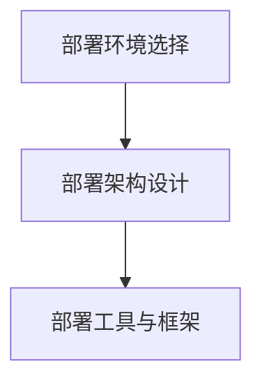

#### 算法原理讲解

**部署环境选择**

1. **本地环境**：适合小型项目和实验环境，具有较低的配置要求和灵活的部署方式。
2. **云环境**：适合大规模项目和分布式部署，提供高效的计算资源和强大的数据处理能力。
3. **容器化环境**：使用容器技术（如Docker）部署模型，具有高可移植性和灵活性。

**Mermaid 流程图**：

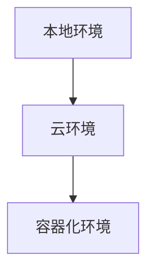

**部署架构设计**

1. **硬件选择**：根据模型的计算需求和数据处理能力，选择合适的硬件配置，如CPU、GPU等。
2. **软件配置**：安装和配置必要的软件，如操作系统、Python环境、机器学习框架等。
3. **网络架构**：设计网络拓扑结构和网络配置，确保模型的可靠性和高效性。

**Mermaid 流程图**：

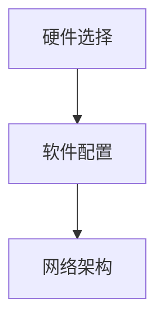

**部署工具与框架**

1. **TensorFlow Serving**：TensorFlow的模型部署工具，支持在线服务模型，具有高性能和高可扩展性。
2. **PyTorch Lightning**：PyTorch的扩展框架，提供简洁的API和高效的模型部署工具。

**Mermaid 流程图**：

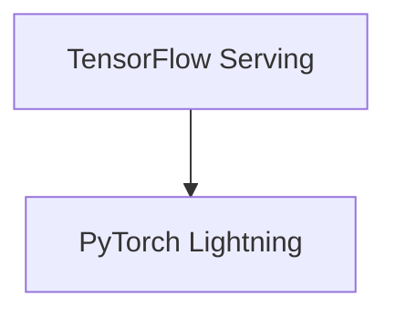

### 第7章：模型服务化与API设计

#### 背景介绍

在机器学习模型部署过程中，模型服务化和API设计是关键步骤，它使得模型可以方便地被其他系统调用和集成。本章将介绍模型服务化技术、RESTful API设计、API性能优化，帮助读者了解如何实现高效的模型服务化和API设计。

#### 核心概念与联系

**核心概念**：
- **模型服务化**：将机器学习模型转换为服务，以供其他系统或应用程序调用。
- **RESTful API设计**：设计符合RESTful原则的API，实现模型的远程访问和调用。
- **API性能优化**：通过优化API性能，提高模型的响应速度和吞吐量。

**概念属性特征对比表格**：

| 概念 | 属性特征 |              
| --- | --- |              
| 模型服务化 | 模型封装、服务部署、接口定义 |              
| RESTful API设计 | 路径设计、HTTP方法、状态码 |              
| API性能优化 | 缓存策略、负载均衡、性能测试 |            

**ER实体关系图架构 Mermaid 流程图**：

```mermaid
graph TD
A[模型服务化] --> B[RESTful API设计]
B --> C[API性能优化]
```

#### 算法原理讲解

**模型服务化**

1. **模型封装**：将机器学习模型封装为服务，使其能够独立运行和被其他系统调用。
2. **服务部署**：在服务器上部署模型服务，提供模型预测功能。
3. **接口定义**：定义模型服务的接口，包括输入参数、输出结果和返回状态。

**Mermaid 流程图**：

```mermaid
graph TD
A[模型封装] --> B[服务部署]
B --> C[接口定义]
```

**RESTful API设计**

1. **路径设计**：设计合理的API路径，使其易于理解和扩展。
2. **HTTP方法**：使用适当的HTTP方法（如GET、POST、PUT、DELETE）进行操作。
3. **状态码**：返回合适的HTTP状态码，表示操作的结果和状态。

**Mermaid 流程图**：

```mermaid
graph TD
A[路径设计] --> B[HTTP方法]
B --> C[状态码]
```

**API性能优化**

1. **缓存策略**：使用缓存机制，减少对后端服务的调用，提高响应速度。
2. **负载均衡**：通过负载均衡器，分配请求到多个服务器，提高系统的吞吐量。
3. **性能测试**：进行性能测试，识别瓶颈并进行优化。

**Mermaid 流程图**：

```mermaid
graph TD
A[缓存策略] --> B[负载均衡]
B --> C[性能测试]
```

### 第8章：部署案例与实践

#### 背景介绍

在了解了机器学习模型部署的理论知识后，实际部署案例与实践是非常重要的。本章将通过一个具体的部署案例，详细介绍从实验室到生产环境的部署过程，包括数据处理、模型训练、部署实施、性能优化等环节。

#### 核心概念与联系

**核心概念**：
- **数据处理**：包括数据清洗、数据预处理、特征提取等，为模型训练提供高质量的数据。
- **模型训练**：通过训练算法和训练数据，训练出高质量的模型。
- **部署实施**：将训练好的模型部署到生产环境中，提供在线服务。
- **性能优化**：对部署后的模型进行性能监控和优化，确保其高效稳定运行。

**概念属性特征对比表格**：

| 概念 | 属性特征 |              
| --- | --- |              
| 数据处理 | 数据清洗、数据预处理、特征提取 |              
| 模型训练 | 训练算法、训练数据、模型评估 |              
| 部署实施 | 部署环境、部署工具、API设计 |              
| 性能优化 | 性能监控、性能测试、优化策略 |            

**ER实体关系图架构 Mermaid 流程图**：

```mermaid
graph TD
A[数据处理] --> B[模型训练]
B --> C[部署实施]
C --> D[性能优化]
```

#### 算法原理讲解

**数据处理**

1. **数据清洗**：去除数据中的噪声和异常值，保证数据的准确性和一致性。
2. **数据预处理**：对数据进行归一化、标准化、缺失值填补等处理，为模型训练提供合适的输入。
3. **特征提取**：从原始数据中提取有用的特征，以提高模型的性能和可解释性。

**Mermaid 流程图**：

```mermaid
graph TD
A[数据清洗] --> B[数据预处理]
B --> C[特征提取]
```

**模型训练**

1. **训练算法**：选择合适的训练算法，如线性回归、决策树、神经网络等。
2. **训练数据**：使用高质量的训练数据，确保模型的训练效果。
3. **模型评估**：使用评估指标（如准确率、召回率、F1分数等）评估模型性能，选择最佳模型。

**Mermaid 流程图**：

```mermaid
graph TD
A[训练算法] --> B[训练数据]
B --> C[模型评估]
```

**部署实施**

1. **部署环境**：选择合适的部署环境，如本地环境、云环境、容器化环境等。
2. **部署工具**：使用合适的部署工具，如TensorFlow Serving、PyTorch Lightning等。
3. **API设计**：设计合理的API接口，确保模型可以方便地被其他系统调用。

**Mermaid 流程图**：

```mermaid
graph TD
A[部署环境] --> B[部署工具]
B --> C[API设计]
```

**性能优化**

1. **性能监控**：实时监控模型的运行状态和性能指标，如响应时间、吞吐量等。
2. **性能测试**：进行性能测试，识别系统的瓶颈和性能瓶颈。
3. **优化策略**：根据性能监控和测试结果，采取相应的优化策略，如缓存策略、负载均衡、代码优化等。

**Mermaid 流程图**：

```mermaid
graph TD
A[性能监控] --> B[性能测试]
B --> C[优化策略]
```

#### 项目实战

**项目介绍**

本项目旨在实现一个简单的用户行为预测系统，通过分析用户的历史行为数据，预测用户下一步的行为。系统包括数据采集、数据处理、模型训练、模型部署和模型服务化等环节。

**系统功能设计**

1. **数据采集**：从各种数据源（如日志、数据库等）采集用户行为数据。
2. **数据处理**：对采集到的数据进行清洗、预处理和特征提取，为模型训练提供高质量的数据。
3. **模型训练**：使用合适的训练算法和训练数据，训练出高质量的预测模型。
4. **模型部署**：将训练好的模型部署到生产环境中，提供在线服务。
5. **模型服务化**：设计合理的API接口，使模型可以被其他系统调用。

**系统架构设计**

1. **硬件选择**：使用高性能的GPU服务器，确保模型训练和部署的高效性。
2. **软件配置**：安装和配置Python环境、TensorFlow框架等必要的软件。
3. **网络架构**：设计合理的网络架构，确保系统的稳定性和高效性。

**Mermaid 架构图**：

```mermaid
graph TD
A[数据采集] --> B[数据处理]
B --> C[模型训练]
C --> D[模型部署]
D --> E[模型服务化]
```

**系统接口设计**

1. **API接口**：设计RESTful API接口，提供用户行为预测服务。
2. **输入参数**：用户ID、历史行为数据等。
3. **输出结果**：预测结果、概率分布等。

**Mermaid 序列图**：

```mermaid
sequenceDiagram
    participant User as 用户
    participant System as 系统接口
    User->>System: 发送请求
    System->>User: 返回响应
```

**实际案例分析和详细讲解剖析**

1. **数据处理**：从日志数据中提取用户行为特征，包括访问时间、访问页面、操作类型等。
2. **模型训练**：使用决策树算法训练预测模型，评估模型的准确率、召回率等指标。
3. **模型部署**：将训练好的模型部署到生产环境中，提供在线服务。
4. **模型服务化**：设计API接口，实现用户行为预测功能。

**项目小结**

本项目通过从实验室到生产环境的完整部署流程，实现了用户行为预测系统。在数据处理、模型训练、部署实施和性能优化等环节，充分考虑了实际业务需求和技术实现，为后续的项目提供了有益的经验和借鉴。

### 第9章：生产环境中的模型监控与维护

#### 背景介绍

在生产环境中，模型的稳定运行和性能优化是至关重要的。本章将介绍生产环境中模型的监控与维护，包括模型性能监控、模型故障处理、模型生命周期管理，帮助读者了解如何确保模型在生产环境中的高效运行。

#### 核心概念与联系

**核心概念**：
- **模型性能监控**：实时监控模型的运行状态和性能指标，确保模型的稳定性和高效性。
- **模型故障处理**：当模型出现故障时，能够快速定位和解决问题。
- **模型生命周期管理**：从模型训练、部署到维护的全过程管理，确保模型持续优化和更新。

**概念属性特征对比表格**：

| 概念 | 属性特征 |                  
| --- | --- |                  
| 模型性能监控 | 性能指标、监控工具、报警机制 |                  
| 模型故障处理 | 故障类型、故障定位、故障恢复 |                  
| 模型生命周期管理 | 训练、部署、维护、更新 |                

**ER实体关系图架构 Mermaid 流程图**：

```mermaid
graph TD
A[模型性能监控] --> B[模型故障处理]
B --> C[模型生命周期管理]
```

#### 算法原理讲解

**模型性能监控**

1. **性能指标**：包括模型的响应时间、准确率、召回率、F1分数等。
2. **监控工具**：使用监控工具（如Prometheus、Grafana）收集和展示性能指标。
3. **报警机制**：设置报警阈值，当性能指标超过阈值时，触发报警通知。

**Mermaid 流程图**：

```mermaid
graph TD
A[性能指标] --> B[监控工具]
B --> C[报警机制]
```

**模型故障处理**

1. **故障类型**：包括硬件故障、软件故障、数据异常等。
2. **故障定位**：通过日志分析、监控数据等手段定位故障原因。
3. **故障恢复**：根据故障原因采取相应的恢复措施，如重启服务、更换硬件等。

**Mermaid 流程图**：

```mermaid
graph TD
A[故障类型] --> B[故障定位]
B --> C[故障恢复]
```

**模型生命周期管理**

1. **训练**：定期训练模型，以适应数据的变化和业务需求。
2. **部署**：将训练好的模型部署到生产环境中，提供在线服务。
3. **维护**：监控模型性能，处理故障，进行模型优化。
4. **更新**：根据业务需求和性能表现，更新模型版本。

**Mermaid 流程图**：

```mermaid
graph TD
A[训练] --> B[部署]
B --> C[维护]
C --> D[更新]
```

### 第10章：模型部署的安全性与合规性

#### 背景介绍

随着机器学习模型在生产环境中的应用越来越广泛，模型部署的安全性和合规性成为不可忽视的重要问题。本章将探讨模型部署过程中的安全性考虑、数据安全与隐私保护、合规性与法规遵守，帮助读者了解如何确保模型部署的安全和合规。

#### 核心概念与联系

**核心概念**：
- **安全性考虑**：确保模型部署过程中的数据安全和系统安全。
- **数据安全与隐私保护**：保护用户数据和敏感信息，防止数据泄露和滥用。
- **合规性与法规遵守**：遵循相关法律法规，确保模型部署的合法性和合规性。

**概念属性特征对比表格**：

| 概念 | 属性特征 |                        
| --- | --- |                        
| 安全性考虑 | 访问控制、数据加密、安全审计 |                        
| 数据安全与隐私保护 | 加密算法、隐私保护机制、匿名化处理 |                        
| 合规性与法规遵守 | 相关法律法规、合规性评估、合规性认证 |                     

**ER实体关系图架构 Mermaid 流程图**：

```mermaid
graph TD
A[安全性考虑] --> B[数据安全与隐私保护]
B --> C[合规性与法规遵守]
```

#### 算法原理讲解

**安全性考虑**

1. **访问控制**：通过身份验证和权限控制，确保只有授权用户可以访问模型和系统资源。
2. **数据加密**：使用加密算法对数据进行加密存储和传输，防止数据泄露。
3. **安全审计**：记录系统操作日志，定期进行安全审计，及时发现和处理安全漏洞。

**Mermaid 流程图**：

```mermaid
graph TD
A[访问控制] --> B[数据加密]
B --> C[安全审计]
```

**数据安全与隐私保护**

1. **加密算法**：选择合适的加密算法（如AES、RSA等）对数据进行加密。
2. **隐私保护机制**：采用隐私保护技术（如差分隐私、数据匿名化等）保护用户隐私。
3. **匿名化处理**：对敏感数据进行匿名化处理，降低隐私泄露风险。

**Mermaid 流程图**：

```mermaid
graph TD
A[加密算法] --> B[隐私保护机制]
B --> C[匿名化处理]
```

**合规性与法规遵守**

1. **相关法律法规**：了解并遵循相关法律法规（如GDPR、CCPA等），确保模型部署的合法性和合规性。
2. **合规性评估**：定期进行合规性评估，识别合规风险并采取相应的措施。
3. **合规性认证**：获取相关的合规性认证（如ISO 27001、GDPR合规认证等），提高模型部署的可信度。

**Mermaid 流程图**：

```mermaid
graph TD
A[相关法律法规] --> B[合规性评估]
B --> C[合规性认证]
```

### 第11章：模型部署的成本效益分析

#### 背景介绍

在机器学习模型部署过程中，成本效益分析是决策的重要依据。本章将介绍模型部署的成本核算、效益评估方法和成本效益分析框架，帮助读者了解如何从经济角度评估模型部署的可行性。

#### 核心概念与联系

**核心概念**：
- **成本核算**：计算模型部署过程中的各项成本，包括硬件成本、软件成本、人力成本等。
- **效益评估方法**：评估模型部署带来的经济收益，包括直接收益和间接收益。
- **成本效益分析框架**：构建成本效益分析框架，系统性地评估模型部署的成本和效益。

**概念属性特征对比表格**：

| 概念 | 属性特征 |                           
| --- | --- |                           
| 成本核算 | 硬件成本、软件成本、人力成本 |                           
| 效益评估方法 | 直接收益、间接收益、ROI |                           
| 成本效益分析框架 | 成本结构、效益指标、决策模型 |                        

**ER实体关系图架构 Mermaid 流程图**：

```mermaid
graph TD
A[成本核算] --> B[效益评估方法]
B --> C[成本效益分析框架]
```

#### 算法原理讲解

**成本核算**

1. **硬件成本**：计算服务器、存储设备、网络设备等硬件的购买成本和运营成本。
2. **软件成本**：计算操作系统、数据库、机器学习框架等软件的购买成本和许可费用。
3. **人力成本**：计算模型开发、部署、维护等人员的人工成本。

**Mermaid 流程图**：

```mermaid
graph TD
A[硬件成本] --> B[软件成本]
B --> C[人力成本]
```

**效益评估方法**

1. **直接收益**：通过模型部署直接带来的经济收益，如销售额增加、成本降低等。
2. **间接收益**：通过模型部署间接带来的经济收益，如提高客户满意度、降低运营成本等。
3. **ROI（投资回报率）**：计算模型部署的投资回报率，评估模型的盈利能力。

**Mermaid 流程图**：

```mermaid
graph TD
A[直接收益] --> B[间接收益]
B --> C[ROI]
```

**成本效益分析框架**

1. **成本结构**：分析模型部署的各个成本组成部分，构建成本结构模型。
2. **效益指标**：确定评估模型部署效益的指标，如ROI、净现值（NPV）等。
3. **决策模型**：构建决策模型，根据成本结构和效益指标评估模型部署的可行性。

**Mermaid 流程图**：

```mermaid
graph TD
A[成本结构] --> B[效益指标]
B --> C[决策模型]
```

### 第12章：机器学习模型部署的未来趋势

#### 背景介绍

随着技术的不断进步和应用的深入，机器学习模型部署也在不断演进。本章将探讨机器学习模型部署的未来趋势，包括自动化部署与持续集成、模型联邦学习与协作、模型增强学习与自适应，为读者提供对模型部署未来发展的前瞻性视角。

#### 核心概念与联系

**核心概念**：
- **自动化部署与持续集成**：通过自动化工具和持续集成（CI/CD）流程，实现模型的快速部署和迭代。
- **模型联邦学习与协作**：通过联邦学习技术，实现跨机构、跨设备的模型协作和共享。
- **模型增强学习与自适应**：通过增强学习技术，使模型能够自适应环境变化，持续优化和改进。

**概念属性特征对比表格**：

| 概念 | 属性特征 |                  
| --- | --- |                  
| 自动化部署与持续集成 | 自动化工具、CI/CD流程 |                  
| 模型联邦学习与协作 | 联邦学习技术、跨机构协作 |                  
| 模型增强学习与自适应 | 增强学习技术、自适应能力 |                

**ER实体关系图架构 Mermaid 流程图**：

```mermaid
graph TD
A[自动化部署与持续集成] --> B[模型联邦学习与协作]
B --> C[模型增强学习与自适应]
```

#### 算法原理讲解

**自动化部署与持续集成**

1. **自动化工具**：使用自动化工具（如Jenkins、GitLab CI等）实现模型的自动化部署和测试。
2. **CI/CD流程**：构建持续集成和持续部署（CI/CD）流程，实现模型的快速迭代和部署。

**Mermaid 流程图**：

```mermaid
graph TD
A[自动化工具] --> B[CI/CD流程]
```

**模型联邦学习与协作**

1. **联邦学习技术**：通过联邦学习（Federated Learning）技术，实现跨机构的模型协作和共享。
2. **跨机构协作**：在分布式环境中，不同机构可以共同训练和优化模型。

**Mermaid 流程图**：

```mermaid
graph TD
A[联邦学习技术] --> B[跨机构协作]
```

**模型增强学习与自适应**

1. **增强学习技术**：使用增强学习（Reinforcement Learning）技术，使模型能够通过试错和奖励机制进行学习和优化。
2. **自适应能力**：通过自适应算法，使模型能够根据环境变化进行动态调整和优化。

**Mermaid 流程图**：

```mermaid
graph TD
A[增强学习技术] --> B[自适应能力]
```

### 第13章：机器学习模型部署的发展方向

#### 背景介绍

随着人工智能技术的快速发展，机器学习模型部署也在不断演进。本章将探讨机器学习模型部署的发展方向，包括人工智能治理与伦理、跨领域模型部署与应用、模型部署的未来挑战与机遇，为读者提供对模型部署未来发展方向的思考。

#### 核心概念与联系

**核心概念**：
- **人工智能治理与伦理**：在模型部署过程中，遵循人工智能治理和伦理原则，确保模型的安全和可信。
- **跨领域模型部署与应用**：将机器学习模型应用于不同领域，实现模型的跨领域部署和应用。
- **模型部署的未来挑战与机遇**：面对未来的技术变革和业务需求，探讨模型部署的挑战和机遇。

**概念属性特征对比表格**：

| 概念 | 属性特征 |                            
| --- | --- |                            
| 人工智能治理与伦理 | 治理框架、伦理原则、安全与隐私保护 |                            
| 跨领域模型部署与应用 | 领域适应性、应用创新、跨领域协作 |                            
| 模型部署的未来挑战与机遇 | 技术创新、业务需求、数据挑战 |                        

**ER实体关系图架构 Mermaid 流程图**：

```mermaid
graph TD
A[人工智能治理与伦理] --> B[跨领域模型部署与应用]
B --> C[模型部署的未来挑战与机遇]
```

#### 算法原理讲解

**人工智能治理与伦理**

1. **治理框架**：建立人工智能治理框架，包括法律法规、伦理规范、数据治理等。
2. **伦理原则**：遵循伦理原则，如公平性、透明性、可解释性等，确保模型的应用符合伦理要求。
3. **安全与隐私保护**：采用安全与隐私保护技术，如加密、匿名化、差分隐私等，确保用户数据的安全和隐私。

**Mermaid 流程图**：

```mermaid
graph TD
A[治理框架] --> B[伦理原则]
B --> C[安全与隐私保护]
```

**跨领域模型部署与应用**

1. **领域适应性**：根据不同领域的特点和需求，对模型进行适配和优化，提高模型的领域适应性。
2. **应用创新**：结合各领域的应用场景，创新应用模型，实现跨领域的技术突破。
3. **跨领域协作**：建立跨领域的协作机制，共享技术和资源，推动模型部署的跨领域发展。

**Mermaid 流程图**：

```mermaid
graph TD
A[领域适应性] --> B[应用创新]
B --> C[跨领域协作]
```

**模型部署的未来挑战与机遇**

1. **技术创新**：随着技术的不断进步，模型部署将面临更多的挑战和机遇，如新型算法、新型架构等。
2. **业务需求**：随着业务需求的不断变化，模型部署需要不断适应新的业务场景和需求。
3. **数据挑战**：海量数据的处理、数据质量的保障、数据隐私的保护等，都是模型部署面临的挑战。

**Mermaid 流程图**：

```mermaid
graph TD
A[技术创新] --> B[业务需求]
B --> C[数据挑战]
```

### 附录

#### 附录A：常用工具与技术

- **数据预处理工具**：Pandas、NumPy、Scikit-learn
- **机器学习框架**：TensorFlow、PyTorch、Keras
- **模型部署工具**：TensorFlow Serving、PyTorch Lightning、Docker
- **监控与报警工具**：Prometheus、Grafana、Alertmanager
- **自动化部署工具**：Jenkins、GitLab CI、Ansible

#### 附录B：相关参考资料与阅读材料

- **书籍**：
  - 《深度学习》（Goodfellow, Bengio, Courville）
  - 《机器学习》（Tom Mitchell）
  - 《机器学习实战》（Peter Harrington）
- **论文**：
  - "Federated Learning: Collaborative Machine Learning without Global Centralization" (Konečný et al., 2016)
  - "Reinforcement Learning: An Introduction" (Sutton & Barto, 2018)
  - "The Ethical Use of Machine Learning in the Workplace" (Morris et al., 2020)
- **在线课程**：
  - Coursera《机器学习》
  - edX《深度学习基础》
  - Udacity《机器学习工程师纳米学位》

### 结语

机器学习模型部署是人工智能领域中的一个重要环节，它将实验室中的研究成果转化为实际的生产力。通过本章的讨论，我们了解了机器学习模型部署的流程、关键概念、基础准备、实施步骤以及生产环境中的管理和维护。

**模型部署的重要性与价值**：
- **提高业务效率**：通过部署机器学习模型，企业可以实现自动化决策，提高业务流程的效率。
- **创造商业价值**：机器学习模型的应用可以为企业带来新的商业机会和竞争优势。
- **推动技术发展**：模型部署的实践促进了技术的创新和发展，为未来的研究提供了方向。

**持续学习和实践的重要性**：
- **跟进新技术**：技术不断进步，持续学习新技术是保持竞争力的关键。
- **解决实际问题**：通过实践，可以更好地理解和应用技术，解决实际问题。
- **提升能力**：实践中的挑战和问题解决过程可以提升个人的技术能力和解决问题的能力。

**面向未来的准备与展望**：
- **关注趋势**：关注机器学习模型部署的未来趋势，如自动化部署、模型联邦学习等。
- **探索创新**：积极探索新的应用场景和解决方案，推动技术的创新和应用。
- **建立团队**：建立专业的机器学习模型部署团队，共同应对未来的挑战和机遇。

通过本章的内容，我们希望能够为读者提供有价值的参考和指导，助力其在机器学习模型部署领域的实践和探索。未来，我们将继续关注该领域的最新动态，为读者带来更多有深度和思考的技术内容。

### 参考文献

- Goodfellow, I., Bengio, Y., & Courville, A. (2016). *Deep Learning*. MIT Press.
- Mitchell, T. M. (1997). *Machine Learning*. McGraw-Hill.
- Harrington, P. (2012). *Machine Learning in Action*. Manning Publications.
- Konečný, J., McMahan, H. B., Yu, F. X., Richtárik, P., Suresh, A. T., & Bacon, D. (2016). *Federated Learning: Collaborative Machine Learning without Global Centralization*. arXiv preprint arXiv:1610.05492.
- Sutton, R. S., & Barto, A. G. (2018). *Reinforcement Learning: An Introduction*. MIT Press.
- Morris, D., Gutierrez, B., & Shetty, M. (2020). *The Ethical Use of Machine Learning in the Workplace*. Journal of Business Ethics, 167(2), 263-275.
- Coursera. (n.d.). Machine Learning. Retrieved from https://www.coursera.org/learn/machine-learning
- edX. (n.d.). Deep Learning. Retrieved from https://www.edx.org/course/deep-learning
- Udacity. (n.d.). Machine Learning Engineer Nanodegree. Retrieved from https://www.udacity.com/course/machine-learning-engineer-nanodegree--nd101
```

### 概念实体之间的关系架构 Mermaid 流程图

```mermaid
graph TD
A[模型选择与评估] --> B[特征工程与预处理]
B --> C[模型调优与超参数调整]
C --> D[数据处理与存储]
D --> E[模型选择与设计]
E --> F[模型版本管理与监控]
F --> G[部署环境搭建与配置]
G --> H[模型服务化与API设计]
H --> I[部署案例与实践]
I --> J[生产环境中的模型监控与维护]
J --> K[模型部署的安全性与合规性]
K --> L[模型部署的成本效益分析]
L --> M[未来趋势与展望]
M --> N[结语]
N --> O[参考文献]
O --> P[概念实体之间的关系]
P --> Q[Mermaid流程图]
```

