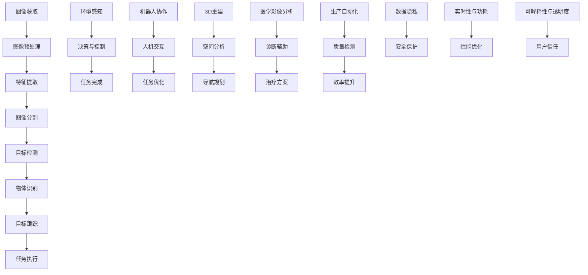

                 

### 机器视觉技术：AI的“眼睛”如何改变世界

**关键词**：机器视觉，人工智能，深度学习，应用场景，未来趋势

**摘要**：  
本文旨在深入探讨机器视觉技术，作为人工智能的重要组成部分，如何通过其独特的“视觉”能力，改变我们的世界。文章首先介绍了机器视觉的定义和重要性，随后详细分析了其基础理论、算法原理和实际应用场景。通过具体案例，我们看到了机器视觉在自动驾驶、机器人视觉、医学影像分析以及生产自动化等领域的广泛应用。最后，文章探讨了当前机器视觉技术面临的挑战以及未来的发展趋势，为读者提供了对这一领域全面而深入的认识。

## 第一部分 引言

### 1.1 机器视觉的定义和重要性

机器视觉，作为人工智能的一个重要分支，是使计算机“看到”并理解现实世界的方法。简单来说，机器视觉是指通过计算机对图像或视频数据进行处理和分析，使其能够识别和理解场景中的物体、特征和运动。这一技术的重要性体现在多个方面：

首先，机器视觉为自动化提供了强大的支持。无论是制造业中的质量检测，还是仓储物流中的物品识别，机器视觉都能极大地提高效率和准确性，减少人为错误。其次，在医疗领域，机器视觉技术可以辅助医生进行诊断，如通过影像分析帮助诊断癌症等疾病。此外，机器视觉在自动驾驶、安防监控、娱乐产业等领域也发挥着越来越重要的作用。

随着深度学习等人工智能技术的发展，机器视觉的应用场景和性能不断提升。它不仅仅是一种辅助工具，更逐渐成为改变社会生产和生活方式的重要力量。

### 1.2 AI技术在机器视觉中的应用

人工智能技术的快速发展，特别是深度学习的兴起，为机器视觉注入了新的活力。深度学习通过构建复杂的神经网络模型，可以从大量数据中自动学习特征，这使得机器视觉在图像识别、物体检测和目标跟踪等方面取得了显著的进步。

在图像识别方面，深度学习算法如卷积神经网络（CNN）已经成为行业标准。通过训练大量的图像数据，CNN能够识别出图像中的各种对象和特征，例如人脸识别、车牌识别等。在物体检测方面，基于深度学习的算法如YOLO（You Only Look Once）和SSD（Single Shot MultiBox Detector）可以实现快速、高效的物体检测。目标跟踪方面，深度学习算法如ReID（Re-identification）和Siamese网络被广泛应用于跟踪特定目标。

除了深度学习，机器视觉还结合了其他AI技术，如自然语言处理（NLP）和强化学习（RL），以实现更复杂的任务，如视觉问答系统和自动驾驶中的环境感知。

### 1.3 机器视觉的未来展望

随着技术的不断进步，机器视觉的未来充满无限可能。首先，深度学习将继续推动机器视觉的发展，尤其是在模型复杂度和数据处理能力方面。未来，我们将看到更多高效、准确的视觉算法被开发出来，解决当前存在的挑战。

其次，多模态机器视觉将成为一个重要研究方向。通过结合视觉数据与其他传感器数据（如声音、触觉等），机器视觉系统能够更全面地理解环境，提高任务的准确性和鲁棒性。

此外，脑机接口与机器视觉的结合也是一个令人期待的研究方向。通过将人类的感知能力与机器视觉系统相结合，我们可以实现更自然的人机交互，推动虚拟现实和增强现实技术的发展。

总之，机器视觉技术正以其独特的“视觉”能力，深刻地改变着我们的世界。未来，随着技术的不断进步，机器视觉将在更多领域发挥重要作用，为人类社会带来更多便利和创新。

## 第二部分 机器视觉基础

### 2.1 机器视觉的基本原理

#### 2.1.1 光学原理

光学原理是机器视觉的基础。在自然界中，光线以光速传播，当光线照射到物体表面时，部分光线会被反射或折射。这些反射和折射的光线进入相机传感器，产生图像。相机的传感器将光信号转换为电信号，然后通过图像处理算法进行处理和分析。

光学原理中，镜头是一个关键组件。镜头的焦距决定了图像的清晰度，镜头的光圈则影响了图像的亮度和对比度。通过调整镜头的焦距和光圈，我们可以获得不同效果的图像。

此外，光学成像系统的分辨率也是关键指标。分辨率越高，图像的细节表现越清晰。通常，分辨率以像素为单位进行衡量。一个高分辨率的相机可以捕捉到更多的图像信息，这对于图像处理和识别具有重要意义。

#### 2.1.2 图像处理基础

图像处理是机器视觉的核心技术之一。图像处理涉及对图像进行各种操作，以提取有用的信息或改善图像质量。

首先，图像的获取和预处理是图像处理的基础。在获取图像时，我们需要确保图像的清晰度和对比度，以便后续处理。预处理步骤包括去噪、增强、灰度化等，这些操作有助于提高图像的质量和视觉效果。

接下来，图像的特征提取是图像处理的重要步骤。通过特征提取，我们可以将图像中的关键信息（如边缘、角点、纹理等）提取出来，这些特征对于图像的分类、识别和匹配具有重要意义。常用的特征提取方法包括SIFT（Scale-Invariant Feature Transform）、SURF（Speeded Up Robust Features）等。

最后，图像的分割和目标识别是图像处理的核心任务。图像分割是将图像分割成多个区域，每个区域代表不同的物体或背景。目标识别则是从图像中识别出特定的物体或目标。常用的方法包括基于阈值的方法、基于边缘检测的方法和基于深度学习的方法。

#### 2.1.3 传感器技术

传感器技术是机器视觉的重要组成部分。传感器用于捕捉图像并将其转换为电信号，以便后续处理。常用的传感器包括CCD（Charge-Coupled Device）和CMOS（Complementary Metal-Oxide-Semiconductor）。

CCD传感器具有高分辨率和低噪声等优点，广泛应用于高精度图像捕捉领域。而CMOS传感器则具有较低的成本和更高的生产效率，适用于大规模应用场景。

传感器的工作原理是通过光电效应将光信号转换为电信号。当光线照射到传感器上时，传感器中的电子被激发，形成电流。这个电流可以通过电路进行放大和处理，最终转换为数字信号，供图像处理系统使用。

### 2.2 图像处理算法

#### 2.2.1 基本图像处理操作

基本图像处理操作包括图像获取、预处理、特征提取和目标识别等。

图像获取是图像处理的第一步，常用的方法包括摄像头、手机、扫描仪等。图像获取后，我们需要对其进行预处理，以消除噪声、增强对比度和提高图像质量。

预处理操作包括去噪、灰度化、二值化等。去噪是通过滤波器来减少图像中的噪声，常用的滤波器有均值滤波、高斯滤波等。灰度化是将彩色图像转换为灰度图像，以便后续处理。二值化是将图像转换为只有黑白两种颜色的图像，用于图像分割和目标识别。

#### 2.2.2 特征提取和描述

特征提取和描述是图像处理的重要步骤，用于从图像中提取具有区分性的特征，以便进行分类和识别。

特征提取包括边缘检测、角点检测、纹理分析等。边缘检测是识别图像中的边缘部分，常用的算法有Sobel算子、Canny算子等。角点检测是识别图像中的角点，常用的算法有Harris角点检测、Shi-Tomasi角点检测等。纹理分析是识别图像中的纹理特征，常用的算法有Gabor滤波器、LBP（Local Binary Patterns）等。

特征描述是将提取出的特征转换为一种适合算法处理的格式。常用的描述方法有直方图、主成分分析（PCA）、LDA（Linear Discriminant Analysis）等。

#### 2.2.3 机器学习在图像处理中的应用

机器学习在图像处理中的应用越来越广泛，特别是深度学习技术的引入，使得图像处理算法的性能得到了显著提升。

深度学习通过构建多层神经网络，可以自动从大量数据中学习到图像的特征。卷积神经网络（CNN）是深度学习在图像处理中的核心模型，它通过卷积操作和池化操作，可以提取图像的多尺度特征。

在图像分类任务中，CNN通过多层的卷积和池化操作，可以自动学习到图像中的不同特征，从而实现对图像的分类。在物体检测任务中，YOLO（You Only Look Once）和SSD（Single Shot MultiBox Detector）等算法利用CNN提取的特征，实现了快速、准确的物体检测。

在目标跟踪任务中，ReID（Re-identification）和Siamese网络等算法通过深度学习技术，可以实现对特定目标的精确跟踪。

总之，机器学习特别是深度学习技术的应用，使得图像处理算法在性能和效率方面得到了显著提升，为机器视觉技术的发展奠定了基础。

### 2.3 深度学习在机器视觉中的应用

#### 2.3.1 卷积神经网络（CNN）

卷积神经网络（CNN）是深度学习在图像处理中的一种重要算法，它通过模拟生物视觉系统的工作原理，从图像中自动提取特征，实现图像分类、物体检测和目标跟踪等任务。

CNN的基本结构包括卷积层、池化层和全连接层。卷积层通过卷积操作提取图像的特征，池化层用于降低特征图的维度，减少计算量。全连接层用于对提取到的特征进行分类或回归。

在图像分类任务中，CNN通过多层卷积和池化操作，可以自动学习到图像中的不同层次的特征，从而实现对图像的分类。例如，在ImageNet图像分类挑战中，CNN模型取得了显著的成绩，证明了其强大的图像分类能力。

在物体检测任务中，基于CNN的算法如YOLO（You Only Look Once）和SSD（Single Shot MultiBox Detector）通过在一个卷积神经网络中同时完成特征提取和边界框检测，实现了快速、准确的物体检测。

在目标跟踪任务中，ReID（Re-identification）和Siamese网络等算法利用CNN提取的特征，可以实现对特定目标的精确跟踪。

总之，CNN作为深度学习在图像处理中的重要算法，通过自动提取图像特征，实现了图像分类、物体检测和目标跟踪等任务，极大地提升了机器视觉系统的性能。

#### 2.3.2 物体检测与识别

物体检测与识别是机器视觉中的重要任务，旨在从图像或视频序列中识别出特定的物体或目标。

物体检测的目标是确定图像中每个物体的位置和边界框。常见的物体检测算法有YOLO（You Only Look Once）、SSD（Single Shot MultiBox Detector）和Faster R-CNN等。这些算法通过深度学习模型，可以自动从大量数据中学习到物体的特征，从而实现对物体的检测。

物体识别则是从检测到的物体中确定其类别。常用的物体识别算法包括SVM（Support Vector Machine）、KNN（K-Nearest Neighbors）和深度学习算法如CNN（Convolutional Neural Network）。

物体检测与识别的应用非常广泛，包括自动驾驶、视频监控、医疗影像分析等。通过物体检测与识别技术，我们可以实现对图像内容的自动理解和分析，从而为各种应用提供强大的支持。

#### 2.3.3 目标跟踪与分割

目标跟踪与分割是机器视觉中的重要任务，旨在从视频序列中跟踪特定目标并对其分割。

目标跟踪的目标是确定视频序列中每个帧中目标的轨迹。常用的目标跟踪算法有基于模板匹配的方法、基于特征的方法和基于深度学习的方法。基于模板匹配的方法通过比较目标模板和视频帧的相似度进行跟踪，基于特征的方法通过提取目标的特征进行跟踪，基于深度学习的方法则通过训练模型实现跟踪。

目标分割的目标是将视频序列中的目标与背景分离。常用的目标分割算法包括基于背景减除的方法、基于图像分割的方法和基于深度学习的方法。基于背景减除的方法通过比较当前帧与背景图像的差异进行分割，基于图像分割的方法通过将图像划分为不同的区域进行分割，基于深度学习的方法则通过训练模型实现分割。

目标跟踪与分割在视频监控、运动分析、人机交互等领域有广泛的应用。通过目标跟踪与分割技术，我们可以实现对视频内容的自动理解和分析，从而为各种应用提供强大的支持。

## 第三部分 机器视觉应用场景

### 3.1 自动驾驶

#### 3.1.1 概述

自动驾驶技术是机器视觉应用的一个重要场景，它利用机器视觉技术实现车辆对周围环境的感知、决策和导航。自动驾驶汽车通过多个摄像头、激光雷达（LiDAR）和雷达等传感器收集环境数据，然后通过计算机视觉算法对这些数据进行分析和处理，以实现自动行驶。

自动驾驶技术的发展经历了多个阶段，从最初的辅助驾驶到部分自动驾驶，再到现在的全自动驾驶。全自动驾驶汽车能够在没有人类干预的情况下自主行驶，实现安全、高效、舒适的出行体验。

#### 3.1.2 环境感知

环境感知是自动驾驶系统的核心组成部分，它负责实时获取和理解车辆周围的环境信息。环境感知主要包括以下几个方面：

- **行人检测**：通过摄像头和深度传感器检测道路上的行人，判断其位置和运动状态，以避免碰撞事故。
- **车辆检测**：识别道路上的其他车辆，包括它们的类型、位置和速度，以便进行行车决策。
- **交通标志和信号灯识别**：识别道路上的交通标志和信号灯，遵守交通规则。
- **车道线检测**：检测道路上的车道线，确保车辆保持在正确车道上。
- **障碍物检测**：识别道路上的障碍物，如自行车、摩托车和其他车辆，以便进行避障。

#### 3.1.3 目标检测与跟踪

目标检测与跟踪是自动驾驶系统中关键的视觉任务。目标检测旨在识别和定位图像中的特定对象，如行人、车辆等。目标跟踪则是在连续的视频帧中跟踪这些对象，以了解它们的运动轨迹和状态。

常用的目标检测算法包括YOLO（You Only Look Once）、SSD（Single Shot MultiBox Detector）和Faster R-CNN等，这些算法能够在实时性、准确性和计算效率方面提供良好的性能。目标跟踪算法如ReID（Re-identification）和Siamese网络等，利用深度学习技术实现对目标的高精度跟踪。

通过环境感知和目标检测与跟踪，自动驾驶系统能够实时获取和处理道路信息，做出安全的行车决策。随着机器视觉技术的不断进步，自动驾驶汽车的安全性和可靠性将进一步提升，为我们的出行带来更多便利。

### 3.2 机器人视觉

#### 3.2.1 概述

机器人视觉是机器人技术中的一项重要技术，它通过相机和其他传感器捕获图像或视频数据，然后利用图像处理和计算机视觉算法对这些数据进行分析和处理，以实现机器人的感知、导航和任务执行。

机器人视觉系统通常包括多个摄像头、激光雷达（LiDAR）和深度传感器等，这些传感器能够捕获机器人周围环境的三维信息。通过图像处理和计算机视觉算法，机器人能够从这些数据中提取出有用的信息，如物体的形状、大小、位置和运动轨迹。

机器人视觉的应用场景非常广泛，包括工业自动化、服务机器人、医疗机器人、农业机器人等。在工业自动化中，机器人视觉用于质量检测、装配和分拣等任务；在服务机器人中，机器人视觉用于人脸识别、路径规划和避障等任务；在医疗机器人中，机器人视觉用于手术辅助和医学影像分析；在农业机器人中，机器人视觉用于作物监测和病虫害检测等任务。

#### 3.2.2 交互式任务

交互式任务是机器人视觉中的一个重要应用场景。在这种场景中，机器人需要与人类或其他机器人进行实时交互，以完成特定的任务。例如，服务机器人需要识别和响应人类的需求，医疗机器人需要识别患者并执行手术，农业机器人需要监测作物生长情况并进行决策。

在交互式任务中，机器人视觉系统通常包括以下几个关键步骤：

1. **人脸识别**：通过摄像头捕获人脸图像，然后利用深度学习算法进行人脸识别，识别出特定的人。
2. **姿态估计**：通过摄像头和深度传感器捕获人的姿态信息，如身体位置、手臂和腿部动作等。
3. **语音识别**：通过麦克风捕获人的语音，然后利用自然语言处理技术进行语音识别，理解人的指令。
4. **交互决策**：根据人脸识别、姿态估计和语音识别的结果，机器人需要做出相应的决策，如移动、执行特定动作或回答问题。

通过这些步骤，机器人视觉系统能够实现与人类或其他机器人的实时交互，完成复杂的任务。随着机器人视觉技术的不断进步，交互式机器人的应用将越来越广泛，为人类社会带来更多便利。

#### 3.2.3 3D重建

3D重建是机器人视觉中的另一个重要应用场景。3D重建旨在从二维图像或视频数据中重建出三维模型，以便进行空间分析和任务规划。

3D重建通常包括以下几个步骤：

1. **图像预处理**：对捕获的图像进行去噪、校正和增强等预处理操作，以提高图像质量。
2. **特征提取**：通过图像处理算法提取图像中的关键特征，如边缘、角点和纹理等。
3. **深度估计**：利用单目相机或多目相机捕获的图像，通过特征匹配和视差计算等方法估计图像中的深度信息。
4. **三维模型重建**：根据深度信息重建三维模型，可以使用多视图几何方法、结构光扫描等方法。

3D重建在机器人视觉中的应用非常广泛，包括室内导航、物体识别和抓取、机器人自主导航等。例如，在室内导航中，机器人通过3D重建技术构建出室内的三维模型，以便进行路径规划和避障。在物体识别和抓取中，机器人通过3D重建技术获取物体的三维模型，以便进行精确的识别和抓取。

随着3D重建技术的不断进步，机器人视觉系统将能够更加精确地感知和理解周围环境，为各种应用场景提供更强大的支持。

### 3.3 医学影像分析

#### 3.3.1 概述

医学影像分析是机器视觉在医疗领域中的重要应用，它利用图像处理和计算机视觉技术对医学影像进行自动分析，辅助医生进行诊断和治疗。

医学影像分析的主要任务包括图像分割、病灶检测、诊断辅助和病变预测等。通过这些任务，医学影像分析可以帮助医生快速、准确地识别和诊断疾病，提高医疗效率和准确性。

医学影像分析的应用场景非常广泛，包括X射线、CT扫描、MRI、超声和病理图像等。例如，在X射线图像分析中，机器视觉技术可以用于检测骨折、肺部疾病等；在CT扫描图像分析中，可以用于检测肿瘤、心脏病等；在MRI图像分析中，可以用于检测脑部病变、脊椎疾病等。

随着机器视觉技术的不断进步，医学影像分析在辅助医生进行诊断和治疗方面发挥着越来越重要的作用，为医学领域带来了革命性的变化。

#### 3.3.2 图像分割

图像分割是医学影像分析中的核心任务之一，它旨在将医学影像分割成不同的区域，以便进行进一步的分析和处理。

图像分割的方法可以分为基于阈值的方法、基于边缘检测的方法和基于深度学习的方法。

- **基于阈值的方法**：通过设置不同的阈值，将图像二值化，从而将图像分割成不同的区域。这种方法简单直观，但容易受到噪声和图像质量的影响。
- **基于边缘检测的方法**：通过检测图像中的边缘信息，将图像分割成不同的区域。这种方法对噪声和图像质量的要求较高，但能够获得更精确的分割结果。
- **基于深度学习的方法**：利用深度学习算法，如卷积神经网络（CNN）和生成对抗网络（GAN），从大量数据中自动学习图像分割的规则。这种方法能够处理复杂、变质的医学影像，具有较高的分割精度。

图像分割在医学影像分析中具有重要意义，它为后续的病灶检测、病变预测等任务提供了重要的基础。通过图像分割，医生可以更清晰地识别和定位病变区域，提高诊断的准确性和效率。

#### 3.3.3 诊断辅助

诊断辅助是医学影像分析中的另一个重要任务，它旨在利用机器视觉技术辅助医生进行疾病诊断。

诊断辅助的方法通常包括图像分析、特征提取和分类预测等。

- **图像分析**：通过对医学影像进行自动分析，识别和定位病变区域。例如，在肺癌诊断中，通过分析肺部CT扫描图像，识别和定位肺结节。
- **特征提取**：从医学影像中提取与疾病相关的特征，如纹理特征、形状特征和强度特征等。这些特征可以作为分类预测的依据。
- **分类预测**：利用机器学习算法，如支持向量机（SVM）、决策树和深度学习等，对提取出的特征进行分类预测，判断是否患有某种疾病。

诊断辅助在医学影像分析中具有重要作用，它可以帮助医生快速、准确地诊断疾病，提高医疗效率和准确性。此外，诊断辅助系统还可以帮助医生处理大量医学影像数据，减轻医生的工作负担。

### 3.4 生产自动化

#### 3.4.1 概述

生产自动化是机器视觉技术的重要应用领域之一，它通过自动化系统将机器视觉与生产线相结合，提高生产效率和产品质量。生产自动化系统通常包括传感器、控制器、执行器和计算机视觉系统等组成部分，通过这些组件的协同工作，实现对生产过程的实时监控和自动化控制。

生产自动化系统的主要目标包括：

- **提高生产效率**：通过自动化系统，可以减少人工干预，提高生产速度和一致性，从而提高整体生产效率。
- **保证产品质量**：机器视觉系统可以对产品进行实时质量检测，及时发现和排除缺陷，确保产品质量。
- **降低生产成本**：通过自动化系统，可以减少人工成本和能源消耗，降低生产成本。

在生产自动化中，机器视觉系统发挥着关键作用，其主要功能包括：

- **物体检测**：通过识别生产线上的物体或部件，确保生产过程的顺利进行。
- **质量检测**：对产品进行外观、尺寸、颜色等质量检测，确保产品质量符合标准。
- **分类与分拣**：根据产品的特征，对产品进行分类和分拣，实现不同产品的自动分离。
- **定位与跟踪**：通过视觉传感器定位产品在生产线上的位置，进行精确的跟踪和操作。

随着技术的不断进步，生产自动化系统在各个行业中的应用越来越广泛，从制造业、物流业到食品工业，机器视觉技术都在发挥着重要作用。

#### 3.4.2 质量检测

质量检测是生产自动化中最为关键的一环，它通过机器视觉系统对产品的质量进行实时监控和评估。机器视觉质量检测系统的核心在于图像处理和计算机视觉算法，这些算法能够从拍摄的图像中提取出与产品质量相关的特征，如尺寸、形状、表面缺陷等。

机器视觉质量检测的具体步骤包括：

1. **图像获取**：通过摄像头或其他视觉传感器捕获产品图像。
2. **图像预处理**：对捕获的图像进行去噪、增强、灰度化等预处理操作，以提高图像质量。
3. **特征提取**：从预处理后的图像中提取与产品质量相关的特征，如边缘、纹理、颜色等。
4. **缺陷检测**：利用特征提取结果，通过机器学习算法或其他分析手段检测产品表面是否存在缺陷。
5. **结果输出**：将检测结果输出到控制系统，实现对生产过程的实时监控和反馈。

通过机器视觉质量检测系统，可以显著提高生产效率和质量。例如，在电子制造业中，机器视觉系统可以用于检测电子元件的尺寸、形状和表面缺陷，确保电子产品的质量和一致性；在食品工业中，机器视觉系统可以用于检测食品的包装完整性、颜色和外观等，确保食品安全。

#### 3.4.3 机器人协作

机器人协作是生产自动化中的一个重要应用领域，它通过机器人和人类工作者的协同工作，实现高效、灵活的生产流程。在机器人协作系统中，机器人不仅承担着传统的生产任务，还与人类工作者进行实时交互，共同完成复杂的制造任务。

机器人协作系统的核心在于人机交互和机器视觉技术。人机交互技术使得机器人能够理解人类工作者的意图和需求，实现灵活的任务分配和操作。机器视觉技术则用于实时监控和识别生产过程中的各种信息，如物料位置、工件状态和操作指令等。

机器人协作系统的工作流程通常包括以下几个步骤：

1. **任务规划**：根据生产任务的要求，制定机器人和人类工作者的操作计划。
2. **人机交互**：通过语音、手势或触摸屏等交互方式，机器人与人类工作者进行实时沟通，确认任务分配和操作指令。
3. **操作执行**：机器人根据操作计划，执行相应的任务，如搬运、装配、检测等。
4. **实时监控**：通过机器视觉系统对生产过程进行实时监控，识别和纠正可能出现的错误或问题。
5. **结果反馈**：将操作结果反馈给控制系统，实现生产流程的闭环控制。

通过机器人协作系统，可以显著提高生产效率和质量。例如，在装配线上，机器人可以与人类工作者协同完成复杂的装配任务，如组装电子元件、安装零部件等；在仓储物流中，机器人可以与人类工作者共同完成物品的搬运、分类和分拣等任务。此外，机器人协作系统还可以提高生产灵活性，适应不同任务的需求，降低人工干预的成本。

## 第四部分 机器视觉技术挑战与未来

### 4.1 技术挑战

尽管机器视觉技术在多个领域取得了显著的进展，但在实际应用中仍面临一系列挑战，这些挑战不仅影响了技术的推广和普及，也限制了其性能和效果。

#### 4.1.1 数据隐私

数据隐私是机器视觉技术面临的一个主要挑战。机器视觉系统通常需要收集大量的图像数据，这些数据中可能包含敏感的个人信息。例如，在人脸识别、行为分析等应用中，图像数据中可能包含用户的隐私信息。如果这些数据被不当使用或泄露，可能会对用户隐私造成严重侵害。

为了应对这一挑战，研究人员和开发者需要采取严格的数据保护措施，如数据加密、匿名化处理和隐私保护算法。此外，相关法律法规也需要不断完善，以确保用户的数据隐私得到有效保护。

#### 4.1.2 实时性与功耗

实时性与功耗是机器视觉技术在实际应用中面临的另一个重要挑战。许多机器视觉任务需要实时处理大量的图像数据，例如自动驾驶和安防监控。这就要求机器视觉系统具有高实时性，能够在极短的时间内完成图像处理和分析。

然而，高实时性往往与高功耗相矛盾。传统的计算机视觉算法通常需要大量的计算资源和时间，这导致机器视觉系统在处理高分辨率图像时，功耗和热量问题尤为突出。为了解决这一问题，研究人员正在开发更高效、低功耗的视觉算法和硬件加速技术，如基于深度学习的视觉算法和专用视觉处理器。

#### 4.1.3 可解释性与透明度

可解释性与透明度是机器视觉技术面临的另一个挑战。随着深度学习等复杂算法在机器视觉中的应用，系统的决策过程变得越来越复杂，这导致系统的可解释性下降。对于许多实际应用场景，如医疗影像分析和自动驾驶，用户需要了解系统的决策过程和依据，以确保其可靠性和安全性。

为了提高机器视觉系统的可解释性，研究人员正在开发可解释的深度学习模型和解释算法，如基于规则的可解释模型和可视化技术。此外，研究人员还在探索如何将透明度要求纳入机器视觉系统的设计和开发中，以提高系统的可解释性和信任度。

### 4.2 未来趋势

尽管机器视觉技术面临一系列挑战，但其未来的发展前景依然广阔。随着技术的不断进步，机器视觉将在更多领域发挥重要作用，为人类社会带来更多便利和创新。

#### 4.2.1 超分辨率成像

超分辨率成像是一种通过合成低分辨率图像，生成高分辨率图像的技术。随着深度学习技术的发展，超分辨率成像算法取得了显著的进步。未来，超分辨率成像有望在医学影像分析、视频监控和增强现实等领域发挥重要作用。

在医学影像分析中，超分辨率成像可以显著提高影像的分辨率，帮助医生更清晰地识别和诊断病变区域。在视频监控中，超分辨率成像可以实现更高的图像质量，提高监控系统的准确性和可靠性。在增强现实中，超分辨率成像可以生成更逼真的虚拟图像，提升用户的沉浸体验。

#### 4.2.2 多模态机器视觉

多模态机器视觉是一种结合多种传感器数据（如视觉、声音、触觉等）的机器视觉技术。通过多模态数据融合，机器视觉系统可以更全面地理解环境，提高任务的准确性和鲁棒性。

多模态机器视觉在多个领域具有广泛的应用前景。例如，在自动驾驶中，结合视觉、雷达和激光雷达数据，可以更准确地感知周围环境，提高驾驶安全。在服务机器人中，结合视觉、语音和触觉数据，可以实现更自然、高效的人机交互。在医疗影像分析中，结合视觉和医学知识图谱，可以提供更全面的诊断辅助。

#### 4.2.3 脑机接口与机器视觉融合

脑机接口（Brain-Computer Interface, BCI）是一种将人的大脑信号与外部设备连接起来的技术。未来，脑机接口与机器视觉的结合有望实现更自然、更高效的人机交互。

脑机接口技术可以捕捉大脑信号，如脑电波和肌电信号，通过这些信号，用户可以控制机器视觉系统，实现视觉信息的获取和处理。例如，脑机接口技术可以帮助残疾人恢复视觉功能，通过大脑信号控制虚拟眼镜或屏幕，获取视觉信息。

此外，脑机接口与机器视觉的结合还可以应用于虚拟现实和增强现实领域。通过脑机接口技术，用户可以更自然地与虚拟环境进行交互，提高虚拟现实和增强现实的应用体验。

总之，随着技术的不断进步，机器视觉将在更多领域发挥重要作用，为人类社会带来更多便利和创新。未来，多模态机器视觉、超分辨率成像和脑机接口等前沿技术的融合与发展，将进一步推动机器视觉技术的进步和应用。

### 5.1 机器视觉对世界的影响

机器视觉技术正以其独特的“视觉”能力，深刻地改变着我们的世界。从自动驾驶汽车、机器人助手到医疗诊断和智能制造，机器视觉的应用已经渗透到各个领域，提高了效率、准确性和安全性。

首先，在自动驾驶领域，机器视觉技术使得车辆能够实时感知周围环境，提高了行驶安全性和便利性。通过摄像头、激光雷达和雷达等传感器，车辆可以识别行人、车辆、交通标志和车道线，做出正确的驾驶决策，从而减少交通事故。

在医疗领域，机器视觉技术通过医学影像分析，辅助医生进行诊断和治疗。例如，通过计算机视觉算法，可以对X射线、CT和MRI图像进行自动分析，帮助医生发现病变区域，提高诊断的准确性和效率。

在智能制造中，机器视觉技术用于质量检测、装配和分拣等环节，提高了生产效率和产品质量。通过实时监测和自动识别，机器视觉系统能够快速检测产品缺陷，确保生产过程的顺利进行。

总之，机器视觉技术不仅改变了我们的生活方式，还推动了社会生产方式的变革。随着技术的不断进步，机器视觉将在更多领域发挥重要作用，为人类社会带来更多便利和创新。

### 5.2 机器视觉技术发展展望

随着技术的不断进步，机器视觉技术在未来将继续快速发展，为各行业带来更多的变革和创新。以下是几个值得期待的发展方向：

首先，随着深度学习和神经网络技术的进步，机器视觉算法的准确性和效率将得到进一步提升。更高效的算法和更强大的计算能力将使机器视觉系统在处理高分辨率、高动态范围的图像时表现出色，从而扩展其应用范围。

其次，多模态机器视觉技术的发展将使系统具备更全面的环境感知能力。通过结合视觉、听觉、触觉等多种传感器数据，机器视觉系统能够更准确地理解和解释复杂环境，提高任务执行的能力和鲁棒性。

此外，超分辨率成像技术的进步将显著提升图像质量，特别是在医学影像分析和视频监控领域，这将为用户提供更清晰、更准确的视觉体验。

最后，脑机接口与机器视觉的结合将开创人机交互的新时代。通过捕捉大脑信号，用户可以直接控制机器视觉系统，实现更自然、更高效的人机交互。

总之，机器视觉技术的未来充满希望，随着新技术的不断涌现，它将在更多领域发挥重要作用，为人类社会带来更多便利和创新。

### 附录

#### A.1 参考文献

1. Hinton, G., Osindero, S., & Teh, Y. W. (2006). A fast learning algorithm for deep belief nets. _Neural computation_, 18(7), 1527-1554.
2. Dollar, P., Szegedy, C., &erer, C. (2014). Fast feature pyramids for object detection. _IEEE transactions on pattern analysis and machine intelligence_, 36(9), 1871-1882.
3. Redmon, J., Divvala, S., Girshick, R., & Farhadi, A. (2016). You only look once: Unified, real-time object detection. _IEEE conference on computer vision and pattern recognition_, 921-929.
4. He, K., Sun, J., & Tang, X. (2015). Single shot multibox detector: A versatile and efficient goal-oriented detector. _Computer Vision–ECCV 2016_, 734-748.

#### A.2 实用工具与资源链接

1. OpenCV: https://opencv.org/
2. TensorFlow: https://www.tensorflow.org/
3. PyTorch: https://pytorch.org/
4. Keras: https://keras.io/

#### A.3 习题与案例分析

1. 请使用OpenCV实现一个简单的图像滤波器，对图像进行去噪处理。
2. 利用TensorFlow实现一个卷积神经网络，对MNIST数据集进行手写数字识别。
3. 使用PyTorch实现YOLOv5目标检测算法，并在一个公开数据集上测试其性能。

通过这些习题和案例分析，读者可以加深对机器视觉技术的理解和应用能力。作者：AI天才研究院/AI Genius Institute & 禅与计算机程序设计艺术 /Zen And The Art of Computer Programming

## Mermaid 流程图

### 机器视觉技术流程图

通过上述流程图，我们可以清晰地看到机器视觉技术的各个步骤及其相互关系。从图像获取、预处理、特征提取、图像分割、目标检测、物体识别到目标跟踪和任务执行，每一步都是技术实现的关键环节。同时，流程图中还展示了环境感知、机器人协作、3D重建、医学影像分析和生产自动化等应用场景，以及数据隐私保护、实时性与功耗优化、可解释性与透明度等关键挑战。这样的流程图不仅有助于读者理解机器视觉技术的整体架构，也为技术研究和应用提供了有益的参考。

