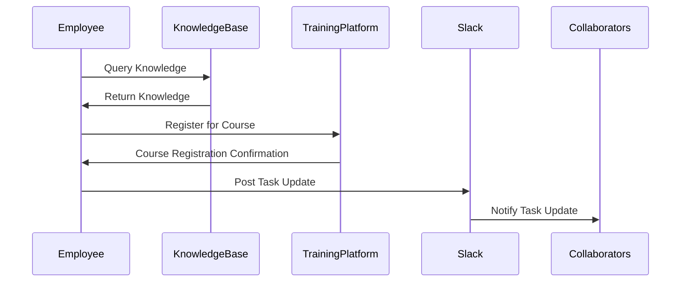
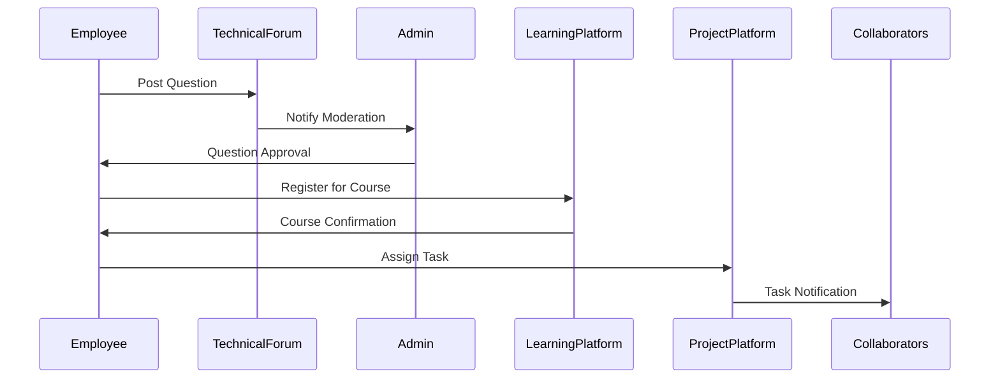

                 

### 第1章：学习型组织的核心概念

## 1.1 学习型组织的定义与特征

### 1.1.1 学习型组织的基本理念

学习型组织是一种以学习为核心的组织模式，它强调持续学习、知识共享和创新精神。学习型组织认为，学习是组织存在的根本目的，通过不断学习和知识创新，组织能够保持活力和竞争力。

#### 背景介绍

在当今快速变化的时代，企业面临的市场环境和竞争态势不断演变，传统的管理模式和组织结构逐渐显露出其局限性。学习型组织概念的提出，正是为了应对这种挑战。学习型组织旨在通过全员参与的学习机制，实现组织内部的持续变革和创新能力。

#### 问题背景

传统组织在面临以下问题时，往往难以通过现有结构和机制进行有效解决：

- **环境变化迅速**：市场环境的变化速度加快，企业需要更快地适应外部变化。
- **竞争激烈**：市场竞争日益激烈，企业需要不断创新以保持竞争优势。
- **员工流动性高**：员工的知识和技能更新速度跟不上市场变化，导致员工流失率上升。
- **知识孤岛**：不同部门或团队之间的知识交流不足，导致知识无法最大化利用。

#### 问题解决

学习型组织的理念通过以下方式解决上述问题：

- **持续学习**：通过建立持续学习的文化，让员工不断更新知识和技能，以适应快速变化的环境。
- **知识共享**：鼓励员工之间分享知识和经验，打破部门壁垒，实现知识的跨部门共享。
- **创新精神**：通过创新文化，激发员工的创造力，推动组织不断创新。
- **全员参与**：通过全员参与的学习机制，确保每个员工都能参与到组织的知识创新和学习过程中。

#### 边界与外延

学习型组织不仅仅是一种管理模式，更是一种组织文化和价值观。其核心在于构建一个持续学习、知识共享和创新的环境，以适应不断变化的外部环境。

#### 概念结构与核心要素组成

学习型组织的概念结构由以下几个核心要素组成：

- **共享式领导力**：领导者通过倡导和示范，推动组织内部的学习和知识共享。
- **学习共同体**：通过建立学习共同体，促进员工之间的知识交流和合作。
- **学习计划与执行**：制定并执行学习计划，确保组织内部的学习活动有序进行。

#### 对比表格

| 要素                | 传统组织           | 学习型组织               |
|-------------------|-------------------|------------------------|
| 学习理念            | 学历导向           | 持续学习导向             |
| 知识共享            | 部门壁垒           | 知识共享与跨部门合作     |
| 创新精神            | 按部就班           | 创新驱动与快速响应       |
| 员工参与            | 被动执行           | 全员参与与主动学习       |

#### ER实体关系图架构

```mermaid
erDiagram
  A 学习型组织 ||--|{ B 领导力 }|
  A 学习型组织 ||--|{ C 学习共同体 }|
  A 学习型组织 ||--|{ D 学习计划与执行 }|
```

### 1.1.2 学习型组织与传统组织的比较

#### 核心比较

- **目标导向**：学习型组织以实现长远目标为导向，注重持续学习和创新，以适应不断变化的外部环境。而传统组织往往以短期目标为导向，忽视了持续学习的重要性。
- **知识共享**：学习型组织鼓励知识共享，通过建立学习共同体，促进员工之间的知识交流和合作。传统组织则往往存在知识孤岛，部门之间的知识交流不畅。
- **员工参与**：学习型组织鼓励员工积极参与学习过程，发挥员工的主动性和创造性。传统组织则更多依赖领导层的决策，员工的参与度较低。
- **系统思考**：学习型组织采用系统思考的方法，从整体角度看待问题，注重组织内部的协调和合作。传统组织则往往局限于局部优化，缺乏全局观念。

#### 案例分析

**案例一：谷歌的学习型组织文化**

谷歌作为全球领先的技术公司，其学习型组织文化体现在多个方面：

- **员工培训**：谷歌提供丰富的培训资源，包括在线课程、内部研讨会和工作坊，鼓励员工不断学习新技能。
- **知识共享**：谷歌的内部平台“谷歌论坛”允许员工分享想法和经验，促进知识的跨部门传播。
- **创新氛围**：谷歌鼓励员工大胆创新，提供了“20%时间项目”政策，让员工有时间和资源去尝试新的项目。

**案例二：丰田的学习型组织文化**

丰田作为全球领先的汽车制造商，其学习型组织文化主要体现在以下几个方面：

- **持续改进**：丰田通过“持续改进”（Kaizen）方法，鼓励员工不断寻找改进空间，提高工作效率。
- **团队协作**：丰田强调团队合作，通过跨部门的项目，促进员工之间的知识共享和经验交流。
- **员工参与**：丰田重视员工意见，鼓励员工参与决策过程，提高员工的参与感和归属感。

#### 总结

学习型组织与传统组织在目标导向、知识共享、员工参与和系统思考等方面存在显著差异。通过构建学习型组织，企业能够更好地适应外部环境的变化，提高创新能力和竞争力。

## 1.2 学习型组织的关键要素

### 1.2.1 分享式领导力

#### 核心概念

分享式领导力是指领导者通过开放和透明的方式，与团队成员分享信息和权力，推动团队的学习和成长。这种领导风格强调领导者的角色是引导者而非指挥者，旨在激发团队成员的主动性和创造力。

#### 概念属性特征对比表格

| 要素               | 传统领导力         | 分享式领导力               |
|------------------|------------------|------------------------|
| 领导角色            | 指挥者           | 引导者                   |
| 信息共享            | 有限的信息共享     | 充分的信息共享           |
| 权力分配            | 集权式           | 分权式                   |
| 团队合作            | 强调个人绩效       | 强调团队合作             |
| 员工发展            | 被动式发展         | 主动式发展               |

#### ER实体关系图架构

```mermaid
erDiagram
  A 分享式领导力 ||--|{ B 团队合作 }|
  A 分享式领导力 ||--|{ C 员工发展 }|
```

### 1.2.2 学习共同体

#### 核心概念

学习共同体是指一群具有共同学习目标的人，通过相互协作、交流和分享，实现共同成长。学习共同体强调成员之间的互动和合作，旨在通过集体的力量提高学习效果。

#### 概念属性特征对比表格

| 要素               | 个人学习         | 学习共同体               |
|------------------|------------------|------------------------|
| 学习方式            | 独立学习         | 协作学习                 |
| 知识共享            | 自我积累         | 共享与传播               |
| 学习目标            | 个人目标         | 共同目标                 |
| 学习效果            | 单一评价         | 集体评价                 |

#### ER实体关系图架构

```mermaid
erDiagram
  A 学习共同体 ||--|{ B 知识共享 }|
  A 学习共同体 ||--|{ C 学习目标 }|
```

### 1.2.3 学习计划与执行

#### 核心概念

学习计划与执行是指组织通过制定详细的学习计划，并确保计划的实施，推动组织内部的学习活动。学习计划包括学习目标、学习内容、学习时间、学习资源等方面的安排。

#### 概念属性特征对比表格

| 要素               | 随意学习         | 有计划学习               |
|------------------|------------------|------------------------|
| 学习目标            | 不明确           | 明确具体                 |
| 学习内容            | 随意安排         | 有序组织                 |
| 学习时间            | 随意分配         | 规划合理                 |
| 学习资源            | 自主寻找         | 统一调配                 |

#### ER实体关系图架构

```mermaid
erDiagram
  A 学习计划与执行 ||--|{ B 学习目标 }|
  A 学习计划与执行 ||--|{ C 学习资源 }|
```

### 总结

学习型组织的成功离不开分享式领导力、学习共同体和学习计划与执行这三个关键要素。通过这三个要素的协同作用，组织能够构建一个持续学习、知识共享和创新的文化氛围，从而实现持续成长和竞争力提升。

## 1.3 学习型组织的优势

### 1.3.1 增强团队凝聚力

学习型组织通过鼓励团队成员之间的互动和合作，能够显著增强团队凝聚力。以下是一些具体的表现：

- **共享目标**：学习型组织中的成员拥有共同的学习目标，这种共同目标有助于增强团队成员之间的联系和认同感。
- **相互支持**：在学习型组织中，团队成员之间会相互支持和鼓励，共同面对挑战和困难，从而增强团队的凝聚力。
- **共同成长**：团队成员通过相互学习和分享知识，共同进步，这种共同成长的过程也会增强团队成员之间的凝聚力。

#### 实际案例

- **案例一：谷歌**：谷歌以其开放和协作的企业文化著称，员工之间通过团队项目和跨部门合作，建立了深厚的信任和合作基础，这种合作精神显著增强了团队的凝聚力。
- **案例二：丰田**：丰田通过持续改进和团队协作，使员工在共同目标下努力工作，增强了团队的凝聚力。

### 1.3.2 提高创新与适应能力

学习型组织通过持续学习和知识创新，能够显著提高组织的创新能力和适应能力。以下是一些具体的表现：

- **知识积累**：学习型组织通过知识共享和知识管理，不断积累宝贵的知识和经验，这些知识为创新提供了坚实的基础。
- **快速响应**：学习型组织能够快速获取和传递信息，迅速应对市场变化和外部挑战，提高组织的反应速度和灵活性。
- **创新驱动**：学习型组织鼓励创新思维和实践，通过不断尝试新方法和新产品，推动组织的持续创新。

#### 实际案例

- **案例一：苹果公司**：苹果公司通过其独特的学习型组织文化，持续推动技术创新，推出了如iPhone、iPad等一系列颠覆性产品，显著提高了其市场竞争力。
- **案例二：3M公司**：3M公司通过其“15%时间政策”，鼓励员工将15%的工作时间用于创新项目，这种创新氛围推动了公司持续创新，并带来了如Post-it便签等知名产品。

### 1.3.3 降低员工流失率

学习型组织通过营造一个积极、充满活力的学习环境，能够有效降低员工流失率。以下是一些具体的表现：

- **职业发展机会**：学习型组织为员工提供了丰富的学习和发展机会，员工能够不断提升自己的技能和知识，从而增强职业满足感。
- **工作满意度**：学习型组织鼓励员工参与决策和项目，使员工感到被重视和尊重，提高工作满意度。
- **员工忠诚度**：通过营造一个积极的组织氛围，学习型组织能够增强员工的忠诚度，减少因不满意度而离职的情况。

#### 实际案例

- **案例一：微软公司**：微软通过其持续学习和发展计划，为员工提供了广泛的职业发展机会，显著降低了员工流失率。
- **案例二：阿里巴巴**：阿里巴巴通过其“阿里学院”等内部培训项目，提高了员工的工作满意度和忠诚度，有效降低了员工流失率。

### 总结

学习型组织通过增强团队凝聚力、提高创新与适应能力和降低员工流失率，为组织的持续成长和竞争力提升提供了有力支持。通过构建学习型组织，企业能够更好地应对外部挑战，实现长期发展目标。

## 2.1 技术文化的定义与意义

### 2.1.1 技术文化的概念解析

技术文化是指在一个组织内部形成的，与技术创新、技术学习和技术应用相关的一系列价值观、规范和行为模式。技术文化不仅体现在技术团队的工作方式和技术成果上，还渗透到组织的决策过程、员工互动和企业战略中。

#### 背景介绍

随着信息技术的快速发展，技术已成为推动企业创新和发展的核心力量。技术文化作为一个组织的重要资产，能够显著影响组织的创新能力和市场竞争力。因此，理解技术文化的概念和内涵，对于构建一个具有竞争力的技术组织至关重要。

### 2.1.2 技术文化对组织发展的影响

技术文化对组织发展具有深远的影响，主要体现在以下几个方面：

#### 创新能力

技术文化鼓励创新思维和实践，通过建立一个支持创新的环境，激发员工的创造力和创新潜力。在一个技术文化浓厚的组织中，员工更倾向于尝试新的想法和技术，推动组织的技术创新。

#### 学习动力

技术文化强调持续学习和知识分享，为员工提供了不断进步和成长的机会。这种文化氛围能够激发员工的学习动力，提升员工的技术能力和知识水平，从而为组织的发展提供持续动力。

#### 决策质量

技术文化通过建立基于数据和事实的决策过程，提高组织的决策质量。在一个技术文化浓厚的组织中，决策者能够更加客观地评估各种方案，做出更加明智的决策。

#### 团队协作

技术文化鼓励团队协作和知识共享，打破部门壁垒，促进不同团队之间的协作和交流。这种协作文化能够提升团队的整体效能，推动组织的整体发展。

### 2.1.3 技术文化的构成要素

技术文化由多个要素构成，包括价值观、规范和行为模式。以下是对这些要素的详细解析：

#### 价值观

价值观是技术文化的核心，它包括对技术创新、知识分享和技术应用的共同认知和信仰。例如，一个技术文化浓厚的组织可能会强调创新、学习和协作的重要性。

#### 规范

规范是技术文化的重要组成部分，它规定了员工在技术应用和知识分享过程中应遵循的行为准则。例如，一个技术文化浓厚的组织可能会鼓励员工公开分享技术成果，并要求员工在项目中积极参与合作。

#### 行为模式

行为模式是技术文化在实际工作中的体现，它包括员工在技术应用和知识分享过程中的具体行为。例如，一个技术文化浓厚的组织中的员工可能会主动参与技术讨论，积极分享自己的经验和见解。

### 2.1.4 技术文化与组织文化的关联

技术文化是组织文化的一部分，它与组织文化相互影响、相互促进。一个组织文化的核心要素，如价值观、愿景和使命，会对技术文化产生重要影响。同时，技术文化也会反过来影响组织文化，推动组织文化的变革和提升。

#### 价值观的一致性

技术文化的价值观应与组织文化的价值观保持一致，这样才能形成合力，共同推动组织的发展。例如，如果一个组织的核心价值观是创新和卓越，那么技术文化也应该强调这些价值观，鼓励员工不断追求创新和卓越。

#### 愿景与使命的融合

技术文化的愿景和使命应与组织的愿景和使命相融合，这样才能确保技术文化为组织的发展服务。例如，如果一个组织的愿景是成为行业领导者，那么技术文化的愿景也应该围绕这个目标，推动组织在技术领域保持领先地位。

### 总结

技术文化是一个组织在技术创新、知识分享和技术应用方面的价值观、规范和行为模式的综合体现。它对组织的创新能力、学习动力、决策质量和团队协作具有深远的影响。通过构建一个积极、健康的技术文化，组织能够更好地适应外部环境的变化，实现持续发展和竞争优势。

### 2.2 技术文化的构建方法

#### 2.2.1 文化评估与定位

构建技术文化的第一步是对现有文化进行评估和定位。以下步骤可以帮助组织深入了解自身的文化现状：

- **文化问卷调研**：通过设计问卷，收集员工对组织文化的看法和反馈，了解员工对技术文化各个方面的认同程度。
- **访谈与观察**：与不同层级的员工进行访谈，观察日常工作中的行为和互动，深入了解文化现状。
- **数据分析**：对问卷和访谈结果进行统计分析，识别文化中的优点和不足，为下一步的改进提供依据。

#### 2.2.2 文化倡导与传播

在定位现有文化后，组织需要通过多种渠道倡导和传播技术文化，以促进员工的认同和实践。以下是一些具体的策略：

- **内部宣传**：通过内部网站、邮件、公告栏等渠道，发布关于技术文化的宣传材料，介绍其重要性和具体实践。
- **领导示范**：领导层应率先实践技术文化，通过示范行为，树立榜样，推动文化的落地。
- **培训与教育**：组织技术文化培训课程，帮助员工理解和掌握技术文化的核心要素和实践方法。

#### 2.2.3 文化实践与反馈

技术文化的构建是一个持续的过程，需要通过实践和反馈不断优化和完善。以下步骤可以帮助组织确保文化实践的顺利进行：

- **项目实践**：通过实际项目，让员工在实践中体验和践行技术文化，积累经验和技能。
- **反馈机制**：建立反馈渠道，收集员工在实践中的意见和建议，及时调整和改进文化实践。
- **绩效评估**：将技术文化实践纳入员工绩效评估体系，激励员工积极参与文化建设和实践。

### 2.2.4 技术文化在不同组织中的应用

技术文化在不同类型的组织中具有不同的应用特点和效果。以下是对几种典型组织类型中技术文化应用的讨论：

#### 创新型企业

对于创新型组织，技术文化是其核心竞争力之一。以下是一些具体应用策略：

- **鼓励创新思维**：通过设立创新奖项、开展创新竞赛，鼓励员工大胆提出新想法。
- **跨部门协作**：打破部门壁垒，推动跨部门项目，促进不同团队之间的知识共享和合作。
- **持续学习**：提供丰富的学习资源，鼓励员工参加外部培训和内部学习活动，不断提升技能。

#### 传统企业

对于传统企业，技术文化的构建需要更多的耐心和策略。以下是一些具体应用策略：

- **逐步转型**：逐步引入技术文化元素，避免突然改变导致员工的不适应。
- **员工参与**：鼓励员工参与技术文化建设的讨论和规划，提高员工的主人翁意识。
- **知识管理**：建立完善的知识管理体系，促进知识的积累和共享。

#### 政府机构和公共服务

对于政府机构和公共服务组织，技术文化更多地体现在提高工作效率和服务质量上。以下是一些具体应用策略：

- **数字化办公**：推广电子政务，提高办公效率和透明度。
- **数据驱动决策**：通过数据分析，提高决策的科学性和准确性。
- **公众参与**：通过线上平台，鼓励公众参与政策讨论和意见反馈，增强公共参与度。

### 总结

构建技术文化需要评估和定位现有文化、倡导和传播新文化、通过实践和反馈不断优化。不同类型的组织在应用技术文化时，需要根据自身的特点和需求，制定相应的策略和措施，确保技术文化的有效落地和实践。

## 2.3 学习策略的制定与实施

### 2.3.1 学习需求分析

学习需求的分析是学习策略制定的基础，通过分析员工的学习需求，可以确保学习计划的针对性和有效性。以下步骤有助于进行有效的学习需求分析：

- **问卷调查**：设计问卷，收集员工对现有技能的满意度、对新技能的需求以及对学习资源的看法。
- **员工访谈**：与不同层级的员工进行深入访谈，了解他们在工作中遇到的技能短板和知识盲区。
- **绩效评估**：通过员工的绩效评估结果，分析哪些技能和知识对提升绩效至关重要。
- **外部市场调研**：了解行业趋势和技术发展动态，识别员工需要学习的新技能和知识。

### 2.3.2 学习目标设定

在明确学习需求后，设定具体的学习目标是确保学习活动顺利进行的关键。以下是一些设定学习目标的建议：

- **SMART原则**：确保学习目标具有具体性（Specific）、可衡量性（Measurable）、可实现性（Achievable）、相关性（Relevant）和时限性（Time-bound）。
- **员工参与**：鼓励员工参与学习目标的设定，提高他们的学习积极性和责任感。
- **目标分类**：将学习目标分为短期目标和长期目标，短期目标应侧重于解决当前工作中的问题，长期目标则应关注未来技能的需求。
- **目标分解**：将总的学习目标分解为具体的子目标，便于监控和评估学习进度。

### 2.3.3 学习资源整合

整合学习资源是保证学习活动顺利进行的重要环节。以下是一些常用的学习资源整合方法：

- **内部资源**：利用组织的内部培训课程、内部文档、知识库等资源，为员工提供丰富的学习材料。
- **外部资源**：引入外部培训课程、线上学习平台、专业书籍和学术论文等资源，拓宽员工的学习渠道。
- **知识管理平台**：建立知识管理平台，集中存储和分享各种学习资源，提高资源的可获取性和利用率。
- **专家资源**：邀请行业专家和内部技术骨干进行讲座和分享，为员工提供高质量的指导和建议。

### 2.3.4 学习计划与实施

制定并实施学习计划是确保学习目标实现的关键步骤。以下是一个典型的学习计划制定与实施流程：

- **制定学习计划**：根据学习目标和资源情况，制定详细的学习计划，包括学习内容、时间安排、学习方式等。
- **计划审核**：对学习计划进行审核，确保其合理性和可行性，并根据需要调整计划。
- **学习活动安排**：根据学习计划，安排具体的培训、研讨会、项目实践等活动，确保学习活动有序进行。
- **监督与反馈**：在学习过程中，定期检查学习进度，收集员工反馈，及时调整学习计划，确保学习目标按期完成。

### 案例分析

#### 案例一：某互联网公司

某互联网公司通过以下策略制定和实施学习计划：

- **学习需求分析**：通过员工调查和绩效评估，识别了员工在编程技能、项目管理和技术创新方面的需求。
- **学习目标设定**：设定了短期目标（如掌握新编程语言）和长期目标（如提升创新能力）。
- **学习资源整合**：利用内部培训课程、线上学习平台和外部专家讲座等多渠道整合学习资源。
- **学习计划与实施**：制定了详细的学习计划，包括每周的编程练习、每月的项目讨论和每季度的创新竞赛。

#### 案例效果评估

- **员工技能提升**：通过学习计划的实施，员工在编程技能和项目管理方面有了显著提升。
- **创新氛围增强**：创新竞赛激发了员工的创新思维，公司推出了多个创新项目。
- **团队凝聚力提高**：通过共同的学习和实践，团队内部的协作和凝聚力得到了增强。

### 总结

通过有效的学习需求分析、目标设定、资源整合和计划实施，组织可以构建一个系统化、可持续的学习体系，促进员工的持续成长和组织的持续发展。

### 2.4 学习方法的多样化

#### 2.4.1 传统学习方式

传统学习方式主要包括课堂培训、阅读书籍、研讨会和工作坊等。这些方法具有以下特点：

- **课堂培训**：通过讲师的讲解和演示，传授知识技能，适合大规模培训。
- **阅读书籍**：通过阅读专业书籍和资料，获取深入的理论知识，适合自学。
- **研讨会**：通过小组讨论和互动，促进知识的交流和分享，适合深度学习和经验交流。
- **工作坊**：通过实际操作和项目实践，锻炼技能和解决问题的能力，适合技能提升。

#### 2.4.2 数字化学习方式

数字化学习方式利用信息技术，提供灵活、高效的学习体验。以下是一些常见的数字化学习方式：

- **在线课程**：通过互联网平台，提供灵活的学习时间和内容，适合个性化学习。
- **虚拟课堂**：通过视频直播或录播，实现远程教学，适合无法参加实体课堂的学员。
- **互动式学习**：通过在线问答、讨论区和模拟练习，增强学习的互动性和参与度。
- **虚拟实验室**：通过虚拟现实技术，提供模拟实验环境，适合实践技能的培养。

#### 2.4.3 混合学习模式

混合学习模式结合了传统学习和数字化学习的优势，通过多种学习方式的组合，实现最佳的学习效果。以下是一些混合学习模式的策略：

- **线上线下结合**：将在线学习和实体课堂相结合，提供灵活的学习方式，满足不同学员的需求。
- **课堂+实践**：在课堂上学习理论知识，通过项目实践巩固和提升技能。
- **团队协作+自主学习**：通过团队协作学习，增强沟通和合作能力，同时鼓励自主学习，提高个人技能。
- **理论+案例分析**：通过理论学习与实际案例分析相结合，提高对知识点的理解和应用能力。

#### 2.4.4 案例分析

**案例一：某科技公司**

某科技公司通过以下混合学习模式提升员工技能：

- **在线课程+虚拟课堂**：为员工提供在线编程课程，并通过虚拟课堂进行实时讲解和答疑。
- **项目实践+团队协作**：组织跨部门项目，让员工在实际项目中学习和应用知识，同时通过团队协作提升合作能力。
- **研讨会+案例分析**：定期举办研讨会，邀请外部专家进行讲座，并结合实际案例进行分析讨论。

**案例效果评估**

- **技能提升显著**：员工通过混合学习模式，在编程技能、项目管理和团队协作方面有了明显提升。
- **学习满意度高**：员工对混合学习模式的灵活性和互动性给予了高度评价，学习积极性显著提高。
- **创新氛围增强**：通过项目实践和案例分析，激发了员工的创新思维，推动了公司的技术进步。

### 总结

多样化学习方法能够满足不同员工的学习需求和风格，通过传统学习方式、数字化学习方式和混合学习模式的结合，组织可以构建一个高效、灵活的学习体系，促进员工的持续成长和组织的持续发展。

### 2.5 学习成果的转化与应用

#### 2.5.1 学习成果的评估

学习成果的评估是确保学习活动有效性的关键环节。以下是一些常用的评估方法：

- **测试与考试**：通过书面考试、在线测试等形式，评估员工对学习内容的掌握程度。
- **项目评估**：通过员工在项目中的实际表现，评估学习成果的应用能力。
- **行为观察**：通过观察员工在工作中的行为和互动，评估学习成果在日常实践中的应用情况。
- **员工反馈**：通过问卷调查、访谈等方式，收集员工对学习活动的反馈，了解学习效果。

#### 2.5.2 学习成果的共享与传播

学习成果的共享与传播是促进组织整体学习效果的重要环节。以下是一些共享与传播的方法：

- **内部知识库**：建立内部知识库，集中存储和分享学习成果，方便员工查阅和参考。
- **内部培训**：通过内部培训课程，将学习成果传授给其他员工，提高整体技能水平。
- **研讨会与讲座**：定期举办研讨会和讲座，邀请学习成果显著的员工分享经验，促进知识传播。
- **社交媒体**：利用社交媒体平台，如企业微信、企业微博等，分享学习心得和成果，增强互动和交流。

#### 2.5.3 学习成果的应用与实践

学习成果的应用与实践是将知识转化为实际能力和竞争力的关键。以下是一些应用与实践的方法：

- **项目实践**：通过实际项目，将学习成果应用到工作中，提高实践能力和解决问题的能力。
- **创新项目**：鼓励员工参与创新项目，将学习成果用于解决实际问题，推动组织的创新和发展。
- **问题解决**：在日常工作中，积极运用学习成果，解决遇到的问题，提高工作效率和效果。
- **团队协作**：通过团队协作，共同应用学习成果，提升团队的执行力和创新能力。

### 案例分析

**案例一：某互联网公司**

某互联网公司通过以下方法促进学习成果的转化与应用：

- **项目实践**：公司将学习成果应用于实际项目，如通过新学到的编程技术提升系统性能。
- **内部培训**：公司定期举办内部培训课程，让学习成果显著的员工分享经验，提升团队的整体技能水平。
- **创新项目**：公司鼓励员工参与创新项目，将学习成果用于解决行业难题，推动公司的技术进步。
- **员工反馈**：通过员工反馈，不断优化学习计划，确保学习内容与实际工作需求紧密相关。

**案例效果评估**

- **技能水平提升**：通过学习成果的转化与应用，员工的技能水平得到了显著提升，提高了工作效率和项目质量。
- **创新能力增强**：通过创新项目的实践，公司的创新能力得到了增强，推出了一系列具有竞争力的新产品。
- **团队协作提升**：通过团队协作，学习成果在项目中得到了有效应用，团队的整体执行力和创新能力得到了提升。

### 总结

通过评估、共享、传播和应用学习成果，组织能够确保学习活动的有效性，将知识转化为实际能力和竞争力，从而实现持续成长和竞争优势。

## 4.1 协作机制的设计与实施

### 4.1.1 协作文化营造

营造良好的协作文化是构建高效协作机制的基础。以下是一些策略：

- **领导示范**：领导层应以身作则，积极参与协作，通过实际行动树立协作榜样。
- **明确目标**：确保团队成员对协作目标有清晰的认识，共同为实现目标而努力。
- **互相尊重**：鼓励团队成员之间相互尊重，建立信任和合作的基础。
- **沟通渠道**：提供多种沟通渠道，如面对面会议、电子邮件、即时通讯工具等，确保信息流畅传递。

### 4.1.2 协作工具的选用

选用合适的协作工具是提升协作效率的关键。以下是一些常见的协作工具：

- **项目管理工具**：如Trello、JIRA等，用于任务分配、进度跟踪和团队协作。
- **文档共享平台**：如Google Docs、Microsoft Teams等，便于团队成员实时编辑和共享文档。
- **视频会议工具**：如Zoom、Microsoft Teams等，用于远程会议和视频沟通。
- **即时通讯工具**：如Slack、WhatsApp等，便于团队成员即时沟通和协作。

### 4.1.3 协作流程优化

优化协作流程可以提高团队的工作效率和协作效果。以下是一些优化策略：

- **标准化流程**：建立标准化协作流程，明确每个环节的职责和任务，确保协作的有序进行。
- **简化流程**：去除不必要的环节和步骤，减少协作中的障碍和重复劳动。
- **流程监控**：建立流程监控机制，及时发现问题并进行调整，确保流程的高效运行。
- **反馈机制**：建立反馈机制，鼓励团队成员提出改进意见，不断优化协作流程。

### 案例分析

**案例一：某科技公司**

某科技公司通过以下策略优化协作流程：

- **建立项目管理工具**：使用Trello进行任务分配和进度跟踪，确保每个任务的执行情况清晰可见。
- **文档共享平台**：使用Google Docs进行文档编辑和共享，提高文档协作的效率。
- **视频会议工具**：使用Zoom进行远程会议，确保团队成员之间的沟通畅通。
- **即时通讯工具**：使用Slack进行即时沟通，快速解决协作中的问题和疑问。

**案例效果评估**

- **任务完成率提升**：通过优化协作流程和使用协作工具，任务完成率显著提升，团队协作更加高效。
- **沟通效率提高**：多种沟通渠道的运用，确保团队成员之间的信息传递迅速，减少了沟通成本。
- **问题解决速度加快**：通过即时通讯工具和视频会议工具，团队成员能够快速响应和解决问题，提高了协作效率。

### 总结

通过营造协作文化、选用合适的协作工具和优化协作流程，组织能够提升团队协作效率，实现协作效果的提升，从而推动组织的持续成长和创新发展。

## 4.2 知识管理的重要性

### 4.2.1 知识管理的概念与内涵

知识管理是指通过系统的方法和工具，对组织的知识进行收集、整理、存储、共享和应用，以最大化知识的价值和利用率。知识管理不仅包括显性知识的收集和存储，还涉及隐性知识的挖掘和传递。

#### 背景介绍

在信息爆炸的时代，知识已成为组织的重要资产。有效的知识管理能够帮助组织快速获取和利用知识，提高创新能力和竞争力。因此，理解知识管理的概念和内涵对于构建一个高效的知识管理体系至关重要。

### 4.2.2 知识管理在组织中的作用

知识管理在组织中的作用主要体现在以下几个方面：

#### 提升创新能力

通过知识管理，组织能够快速获取和利用内外部的知识资源，激发创新思维和创造力。知识管理为员工提供了丰富的知识资源，使他们在解决问题时能够迅速找到相关的经验和最佳实践。

#### 增强协作效率

知识管理通过建立共享的知识库和协作平台，促进了员工之间的知识交流和共享。员工可以方便地获取他人的经验和知识，减少了重复劳动，提高了协作效率。

#### 提高决策质量

知识管理提供了丰富的信息资源，帮助决策者获取全面的、基于事实的决策依据。通过知识管理，决策者可以更准确地评估各种方案的利弊，做出更加明智的决策。

#### 减少培训成本

知识管理通过建立系统化的知识库，为员工提供了丰富的学习资源。员工可以通过在线学习平台和知识库进行自主学习和提升，减少了传统培训所需的成本和时间。

#### 保持知识传承

知识管理确保了组织知识的积累和传承。通过知识管理，组织能够将员工的隐性知识和经验转化为可共享的知识资源，使知识在组织内部得到传承和利用。

### 4.2.3 知识管理的方法与实践

知识管理的方法和实践包括以下几个方面：

#### 知识收集与整理

- **显性知识收集**：通过文档管理、数据库和在线知识库等工具，收集和整理组织内部的显性知识。
- **隐性知识挖掘**：通过访谈、工作坊和经验分享等形式，挖掘员工的隐性知识和经验。

#### 知识存储与共享

- **知识库建设**：建立集中化的知识库，存储和组织各类知识资源，便于员工查询和利用。
- **共享平台**：通过内部共享平台，促进知识的传播和共享，提高知识的利用率。

#### 知识应用与创新

- **知识地图**：绘制知识地图，明确知识的结构和发展路径，帮助员工快速找到所需知识。
- **知识应用指南**：制定知识应用指南，指导员工如何利用知识解决实际问题，提高知识的应用效果。
- **知识创新机制**：建立知识创新机制，鼓励员工在现有知识基础上进行创新，推动组织的持续创新。

### 案例分析

**案例一：某大型跨国公司**

某大型跨国公司通过以下方法实践知识管理：

- **知识库建设**：公司建立了集中化的知识库，涵盖了各类业务知识、技术文档和市场信息，为员工提供了丰富的知识资源。
- **内部共享平台**：公司搭建了内部共享平台，员工可以通过平台方便地分享知识和经验，促进了知识的传播和共享。
- **知识应用指南**：公司制定了知识应用指南，指导员工如何利用知识库中的资源解决实际问题，提高了工作效率和创新能力。

**案例效果评估**

- **知识利用率提高**：通过知识库和共享平台的建立，员工的知识利用率显著提高，减少了重复劳动和无效工作。
- **创新能力增强**：知识管理促进了知识的积累和创新，公司推出了多个创新项目，提升了市场竞争力。
- **员工满意度提升**：知识管理提供了丰富的学习资源，员工能够通过在线学习平台和知识库进行自主学习和提升，增强了职业满足感。

### 总结

知识管理在组织中具有重要作用，通过有效的知识管理，组织能够提升创新能力、增强协作效率、提高决策质量和减少培训成本，从而实现持续成长和竞争优势。

## 4.3 知识管理的方法与实践

### 4.3.1 知识获取与积累

知识获取与积累是知识管理的核心环节，以下是一些具体的方法和策略：

#### 知识收集

- **内部收集**：通过文档管理、数据库和在线知识库等工具，收集和整理组织内部的显性知识。
- **外部收集**：通过市场调研、行业报告、学术研究等途径，获取外部知识和信息。
- **员工经验分享**：通过内部论坛、经验分享会和访谈等形式，挖掘和收集员工的隐性知识和经验。

#### 知识存储

- **知识库建设**：建立集中化的知识库，分类存储各类知识资源，确保知识的系统化和可检索性。
- **数据库管理**：利用数据库技术，对知识进行结构化存储，提高数据的存储效率和查询速度。
- **数据备份与安全**：定期备份知识库数据，确保数据的安全和完整性。

#### 知识积累

- **知识更新**：定期更新知识库内容，确保知识的时效性和准确性。
- **知识沉淀**：通过项目总结、经验分享和知识提炼，将工作中的知识和经验转化为组织财富。
- **知识评估**：对知识库中的知识进行评估和分类，筛选出高质量的知识资源，提升知识库的价值。

### 4.3.2 知识共享与传播

知识共享与传播是知识管理的目的之一，以下是一些促进知识共享与传播的方法：

#### 共享平台

- **内部共享平台**：建立内部共享平台，如企业微信、内部博客等，为员工提供便捷的知识共享渠道。
- **知识共享论坛**：设立知识共享论坛，鼓励员工分享经验和见解，促进知识的跨部门传播。
- **知识分享会议**：定期举办知识分享会议，邀请员工分享学习心得和项目经验，激发知识共享氛围。

#### 知识传播

- **跨部门交流**：通过跨部门项目、研讨会和培训等形式，促进不同部门之间的知识交流和协作。
- **在线培训**：利用在线培训平台，提供知识分享课程，让员工随时随地进行学习。
- **知识传播工具**：利用知识地图、知识手册等工具，帮助员工快速获取所需知识。

### 4.3.3 知识应用与创新

知识应用与创新是知识管理的最终目标，以下是一些具体方法和策略：

#### 知识应用

- **问题解决**：通过知识库和共享平台，帮助员工解决工作中遇到的问题，提高工作效率。
- **项目支持**：在项目执行过程中，利用知识库中的经验和最佳实践，提高项目的成功率和效率。
- **决策支持**：利用知识库中的信息，为决策者提供数据支持和分析，提高决策的科学性和准确性。

#### 知识创新

- **创新激励**：建立创新激励机制，鼓励员工在现有知识基础上进行创新，推动组织的持续创新。
- **跨学科协作**：通过跨学科合作，整合不同领域的知识，促进知识创新和突破。
- **知识论坛**：设立知识论坛，鼓励员工进行知识探讨和思维碰撞，激发创新灵感。

### 案例分析

**案例一：某科技公司**

某科技公司通过以下方法实践知识管理：

- **知识库建设**：公司建立了集中化的知识库，涵盖了业务知识、技术文档和市场信息，为员工提供了丰富的知识资源。
- **知识共享平台**：公司搭建了内部共享平台，员工可以通过平台方便地分享知识和经验，促进了知识的传播和共享。
- **知识应用和创新**：公司通过在线培训课程和知识分享会议，提高了员工的知识应用能力，并激发了创新思维。

**案例效果评估**

- **知识利用率提高**：通过知识库和共享平台的建立，员工的知识利用率显著提高，减少了重复劳动和无效工作。
- **创新能力增强**：知识管理促进了知识的积累和创新，公司推出了多个创新项目，提升了市场竞争力。
- **员工满意度提升**：知识管理提供了丰富的学习资源，员工能够通过在线学习平台和知识库进行自主学习和提升，增强了职业满足感。

### 总结

通过有效的知识管理，组织能够实现知识的获取与积累、共享与传播、应用与创新，从而提升整体竞争力，实现持续成长。

## 5.1 技术文化实践案例

### 5.1.1 案例一：某互联网公司的技术文化构建

#### 项目介绍

某互联网公司致力于通过技术文化构建提升其核心竞争力。项目目标是打造一个以持续学习和创新为核心的技术文化，以应对快速变化的市场和技术环境。

#### 系统功能设计

在系统功能设计阶段，公司明确了以下几个核心功能模块：

- **技术知识库**：构建一个集中化的技术知识库，存储技术文档、最佳实践和案例分享，供员工查询和参考。
- **在线培训平台**：搭建一个在线培训平台，提供多种形式的培训课程，包括内部课程、外部课程和在线考试。
- **项目协作工具**：引入项目协作工具，如Trello和Slack，以便团队进行任务分配、进度跟踪和实时沟通。
- **创新激励机制**：建立创新激励机制，奖励在技术创新和项目实施中表现突出的员工。

#### 系统架构设计

系统架构设计包括以下几个关键组件：

- **前端界面**：采用React框架，实现用户友好的交互界面。
- **后端服务**：采用Node.js和MongoDB，提供数据存储和接口服务。
- **培训平台**：利用Canvas.js实现培训课程和在线考试功能。
- **协作工具**：集成Slack API，实现实时沟通和任务管理。

#### 系统接口设计

系统接口设计包括以下关键接口：

- **知识库接口**：提供RESTful API，供前端调用知识库数据。
- **培训平台接口**：提供在线课程管理和考试结果查询接口。
- **协作工具接口**：提供任务分配和进度跟踪接口。

#### 系统交互

系统交互设计通过Mermaid序列图表示，如下图：



### 5.1.2 案例二：某传统企业的技术文化转型

#### 项目介绍

某传统企业面临技术转型的挑战，希望通过构建技术文化提升其技术能力和市场竞争力。项目目标是建立以持续学习和创新为核心的技术文化，推动企业的技术升级和业务增长。

#### 系统功能设计

在系统功能设计阶段，企业明确了以下几个核心功能模块：

- **内部技术论坛**：建立内部技术论坛，鼓励员工分享技术见解和问题讨论，促进知识共享。
- **在线学习平台**：搭建在线学习平台，提供技术培训和技能提升课程。
- **项目协作平台**：引入项目协作工具，提升项目管理和团队协作效率。
- **技术评估系统**：建立技术评估系统，对员工的技术能力和项目成果进行评估。

#### 系统架构设计

系统架构设计包括以下几个关键组件：

- **前端界面**：采用Vue.js框架，实现用户友好的交互界面。
- **后端服务**：采用Spring Boot和MySQL，提供数据存储和接口服务。
- **技术论坛**：利用社区引擎，如Discourse，实现技术论坛功能。
- **在线学习平台**：集成Laravel框架，实现在线课程管理和学习跟踪。

#### 系统接口设计

系统接口设计包括以下关键接口：

- **技术论坛接口**：提供发帖、评论和话题查询接口。
- **在线学习平台接口**：提供课程注册、学习进度查询和考试结果查询接口。
- **项目协作平台接口**：提供任务分配、进度跟踪和文档共享接口。

#### 系统交互

系统交互设计通过Mermaid序列图表示，如下图：



### 案例效果评估

#### 案例一效果评估

- **知识共享显著提升**：通过技术知识库和在线培训平台的建立，员工的知识共享和交流显著增加，知识利用率提高。
- **创新能力增强**：在线培训课程和项目协作工具的引入，提升了员工的技术能力和团队协作效率，推动了企业的技术进步。
- **员工满意度提高**：丰富的学习和知识资源，以及创新激励机制，增强了员工的归属感和职业满足感。

#### 案例二效果评估

- **技术能力提升**：通过内部技术论坛和在线学习平台的建立，员工的技术能力和知识水平显著提升，为企业的技术转型提供了有力支持。
- **项目效率提高**：项目协作工具的引入，提升了项目管理和团队协作效率，项目成功率提高。
- **业务增长明显**：技术文化的构建推动了企业的技术升级和业务增长，市场份额和收入水平显著提升。

### 总结

通过技术文化的实践案例，我们可以看到，技术文化的构建对于提升组织的知识共享、创新能力和项目效率具有重要作用。这些案例的成功经验为其他组织提供了有益的借鉴和启示。

### 5.2 案例分析

#### 案例成功因素分析

**案例一：某互联网公司的技术文化构建**

1. **领导层的重视**：领导层对技术文化的构建给予高度重视，通过提供资源和政策支持，确保了项目的顺利进行。
2. **系统化的培训和知识管理**：公司建立了全面的培训体系和知识库，为员工提供了丰富的学习资源和知识分享平台。
3. **激励机制的有效性**：公司制定了创新激励机制，对在技术学习和创新方面表现突出的员工给予奖励，激发了员工的学习和创新能力。
4. **协作工具的引入**：通过引入项目协作工具，提高了团队协作效率，促进了知识的共享和传播。

**案例二：某传统企业的技术文化转型**

1. **内部论坛的建立**：内部技术论坛为员工提供了一个自由交流的平台，促进了知识的共享和技术的传播。
2. **在线学习平台的搭建**：在线学习平台的建立，为员工提供了便捷的学习途径，提高了员工的技术能力和知识水平。
3. **技术评估系统的实施**：技术评估系统对员工的技术能力和项目成果进行评估，为技术能力的提升提供了量化依据。
4. **项目协作工具的应用**：项目协作工具的应用，提高了项目管理的效率，促进了团队的协作和项目的顺利进行。

#### 案例失败原因探讨

**案例一：某互联网公司的技术文化构建**

1. **资源分配不足**：在技术文化构建过程中，可能由于资源分配不足，导致项目进展缓慢，影响了整体效果。
2. **缺乏持续激励**：如果激励机制不到位，可能导致员工的学习和创新积极性下降，影响技术文化的持续发展。
3. **培训内容不符合需求**：如果培训内容与员工实际需求不符，可能导致员工对培训的参与度不高，培训效果不佳。

**案例二：某传统企业的技术文化转型**

1. **文化适应性差**：传统企业在向技术文化转型时，可能由于文化适应性差，导致员工对新文化的接受度不高，影响转型效果。
2. **领导层支持不够**：如果领导层对技术文化转型的支持不够，可能导致项目推进过程中遇到阻力，影响转型进程。
3. **培训与实际应用脱节**：如果培训内容与实际工作需求脱节，可能导致员工难以将所学知识应用到实际工作中，影响技术能力的提升。

#### 案例对其他组织的启示

1. **领导层的重视**：领导层的高度重视是技术文化构建成功的关键，组织应确保领导层对技术文化的构建给予足够的关注和支持。
2. **系统化的培训和知识管理**：建立系统化的培训和知识管理体系，确保员工能够持续学习和提升技能，实现知识的共享和传播。
3. **激励机制的设计**：设计有效的激励机制，激发员工的学习和创新动力，推动技术文化的持续发展。
4. **协作工具的应用**：引入协作工具，提高团队协作效率，促进知识的共享和传播。

### 总结

通过案例分析，我们可以看到，技术文化的构建成功因素包括领导层的重视、系统化的培训和知识管理、有效的激励机制和协作工具的应用。同时，我们也了解到了一些失败原因，为其他组织提供了宝贵的经验和教训。其他组织在构建技术文化时，可以借鉴成功因素，避免失败原因，实现技术文化的成功构建。

## 6.1 技术创新的重要性

### 6.1.1 技术创新的定义与分类

技术创新是指通过引入新的技术、产品或服务，实现对现有技术、产品或服务的改进或替代，从而推动组织发展和技术进步的过程。根据创新的内容和程度，技术创新可以大致分为以下几类：

- **渐进性创新**：对现有产品或技术进行改良和优化，提高其性能、效率和用户体验。例如，手机制造商不断优化摄像头性能和电池寿命。
- **突破性创新**：引入全新的技术和产品，颠覆现有市场格局，带来革命性的变化。例如，iPhone的推出彻底改变了智能手机市场。
- **颠覆性创新**：通过技术创新，彻底改变行业规则和商业模式，对现有企业造成巨大冲击。例如，Netflix通过在线流媒体颠覆了传统电影和电视行业。

### 6.1.2 技术创新对组织发展的影响

技术创新对组织发展具有深远的影响，以下是一些关键方面：

#### 提升竞争力

技术创新能够提高组织的竞争力，使其在市场中占据有利位置。通过不断引入新技术和产品，组织可以满足客户需求，提高产品质量，降低成本，从而在激烈的市场竞争中脱颖而出。

#### 促进业务增长

技术创新能够推动组织业务的增长。例如，通过开发新产品或服务，组织可以开辟新的市场，吸引更多客户，实现业务规模扩大和收入增长。

#### 增强适应能力

技术创新使组织能够更好地适应外部环境的变化。在不断变化的市场和技术环境中，技术创新能力强的组织能够迅速调整战略和产品，保持竞争优势。

#### 提高员工素质

技术创新需要员工具备较高的技术能力和创新能力。通过技术创新，组织能够培养和提升员工的技能和素质，使其具备应对未来挑战的能力。

### 6.1.3 技术创新的重要性

技术创新的重要性体现在以下几个方面：

- **驱动经济增长**：技术创新是推动经济增长的重要引擎。通过创新，组织能够提高生产效率，创造更多就业机会，带动相关产业的发展。
- **提升国家竞争力**：技术创新是国家竞争力的重要体现。一个国家拥有强大的技术创新能力，能够在国际竞争中占据优势地位。
- **促进社会进步**：技术创新对社会进步具有重要作用。通过技术创新，组织可以解决社会问题，改善人们的生活质量，推动社会的发展。

### 6.1.4 技术创新的策略与方法

为了实现技术创新，组织需要制定有效的策略和方法。以下是一些常见的策略和方法：

- **研发投入**：增加研发投入，为技术创新提供充足的资金支持。例如，建立专门的研发部门，购买先进的研发设备和工具，吸引优秀的技术人才。
- **开放创新**：通过开放创新，与外部合作伙伴共同研发新技术和产品。例如，与大学、研究机构和企业建立合作关系，共享资源和知识。
- **创新文化建设**：建立创新文化，鼓励员工勇于尝试新想法和新技术。例如，举办创新竞赛，设立创新奖项，营造鼓励创新的氛围。
- **人才引进与培养**：引进和培养具有创新能力和技术专长的人才，为技术创新提供人才保障。例如，通过招聘、培训、激励等手段，吸引和留住优秀人才。

### 总结

技术创新是推动组织发展和经济增长的重要动力。通过不断引入新技术和产品，组织能够提升竞争力、促进业务增长、增强适应能力，并在国际竞争中占据优势地位。为了实现技术创新，组织需要制定有效的策略和方法，增加研发投入、开放创新、建立创新文化、引进和培养人才，以推动技术创新的实现。

## 6.2 技术创新的策略与方法

### 6.2.1 研发投入策略

研发投入是推动技术创新的基础，以下是一些具体的策略：

1. **制定明确的研发预算**：组织应根据战略目标和市场需求，制定合理的研发预算，确保资金投入的稳定性和可持续性。

2. **多元化研发投入**：除了传统的研究与开发（R&D）投入外，组织还可以考虑投资于前沿技术研究和探索，如人工智能、区块链等。

3. **合作研发**：通过与其他组织（如大学、研究机构、同行企业）建立合作研发关系，共享研发资源，降低研发成本，提高研发效率。

4. **激励机制**：设立研发激励机制，鼓励员工积极参与技术创新，如奖励研发成果、提供职业发展机会等。

### 6.2.2 开放创新模式

开放创新是指组织通过内外部的合作，共同开发新技术和产品。以下是一些开放创新模式：

1. **内部开放创新**：组织内部通过建立跨部门合作平台，促进不同团队之间的知识共享和协作。

2. **外部合作创新**：与外部合作伙伴（如供应商、客户、投资者）建立合作关系，共同开发新技术和产品。

3. **平台式创新**：建立开放的创新平台，如内部孵化器、创新实验室等，吸引外部创新资源和人才。

4. **众筹创新**：利用众筹平台，吸引公众参与技术创新，为创新项目提供资金支持和市场反馈。

### 6.2.3 创新型组织文化建设

创新型组织文化是推动技术创新的重要保障，以下是一些建设方法：

1. **创新价值观**：建立以创新为核心的企业价值观，如“创新是第一要务”、“鼓励尝试和失败”等。

2. **鼓励试错**：创造一个允许失败和错误的文化环境，鼓励员工勇于尝试新想法，从失败中学习和成长。

3. **知识共享**：鼓励员工分享知识和经验，建立内部知识库和交流平台，促进知识的传播和利用。

4. **员工参与**：鼓励员工参与创新决策和项目，提高员工的创新参与度和责任感。

### 6.2.4 技术创新的实践与案例分析

#### 案例一：谷歌的开放创新

谷歌以其开放的创新文化而著称，以下是其开放创新的一些实践：

- **内部创新项目**：谷歌的“20%时间项目”政策，允许员工用20%的时间探索新的项目和想法。
- **外部合作**：谷歌与多家大学和研究机构建立合作，共同开展前沿技术研究。
- **开放源代码**：谷歌积极推广其技术成果，通过开源项目，吸引了全球开发者的参与和贡献。

#### 案例效果评估

- **技术创新成果显著**：通过开放创新，谷歌推出了如Android、Chrome等具有影响力的产品，提升了其市场竞争力。
- **创新能力提升**：开放创新环境激发了谷歌员工的创新思维和创造力，促进了组织的持续创新。

#### 案例二：3M的持续改进

3M公司通过持续改进的方法，推动了技术创新和业务发展：

- **持续改进流程**：3M建立了持续改进的流程，鼓励员工不断寻找改进空间，提高工作效率。
- **创新奖励制度**：3M设立了创新奖励制度，对提出有效改进方案和个人给予奖励。
- **员工参与**：3M鼓励员工参与创新项目，提高了员工的工作积极性和创新热情。

#### 案例效果评估

- **工作效率提升**：通过持续改进，3M显著提高了生产效率和工作质量。
- **创新能力增强**：持续改进和创新奖励制度激发了员工的创新思维，推动了公司的技术创新和业务发展。

### 总结

通过有效的研发投入策略、开放创新模式和创新型组织文化建设，组织能够推动技术创新，提升竞争力，实现持续发展。谷歌和3M的案例展示了开放创新和持续改进的实际效果，为其他组织提供了有益的借鉴和启示。

## 6.3 持续成长的路径与策略

### 6.3.1 持续成长的目标与路径

持续成长的目标是组织在长期发展中不断提升其核心竞争力、创新能力和市场地位。为了实现这一目标，组织需要制定明确的路径和策略。以下是一个典型的持续成长路径：

1. **战略规划**：制定长期和短期的战略规划，明确组织的发展方向和关键里程碑。
2. **学习与培训**：持续投资于员工的学习和培训，提升其技能和知识水平。
3. **技术创新**：通过研发投入和开放创新，推动技术的持续创新和进步。
4. **知识管理**：建立有效的知识管理体系，促进知识的积累、共享和应用。
5. **文化塑造**：建立积极、健康的文化氛围，鼓励创新、学习和团队合作。

### 6.3.2 持续成长的关键因素

持续成长的关键因素包括以下几个方面：

1. **领导力**：领导者的远见卓识和正确决策对组织的持续成长至关重要。
2. **人才**：拥有高素质、创新能力的员工是组织持续成长的重要基础。
3. **文化**：积极、健康的文化氛围能够激发员工的潜能，推动组织的持续发展。
4. **技术**：持续的技术创新和进步是组织保持竞争力的重要手段。
5. **资源**：充足的资源和资金支持是实现持续成长的重要保障。

### 6.3.3 持续成长的策略与实践

为了实现持续成长，组织需要采取一系列具体的策略和实践。以下是一些关键策略：

1. **战略规划**：通过制定明确的战略规划，确保组织在发展过程中始终朝着既定目标前进。战略规划应包括市场定位、产品规划、技术创新、人才培养等方面的内容。

2. **学习与培训**：组织应定期为员工提供学习和培训机会，帮助他们提升技能和知识水平。培训内容应涵盖技术、管理、创新等方面，以满足组织发展的需求。

3. **技术创新**：通过增加研发投入、建立开放创新平台、吸引外部创新资源，组织可以推动技术创新和进步。技术创新应与市场需求相结合，确保技术创新能够转化为实际的产品和服务。

4. **知识管理**：建立有效的知识管理体系，包括知识收集、整理、存储、共享和应用等方面。知识管理应注重知识的积累和传承，确保知识在组织内部得到充分利用。

5. **文化塑造**：通过建立积极、健康的文化氛围，激发员工的创新潜力。文化塑造应注重价值观的传递、员工的参与和沟通，确保文化能够成为推动组织持续成长的重要动力。

### 6.3.4 学习型组织战略规划

学习型组织的战略规划应注重以下几个方面：

1. **明确学习目标**：制定清晰的学习目标，确保学习活动与组织战略目标相一致。
2. **建立学习机制**：建立有效的学习机制，包括学习计划、学习资源、学习评估等方面，确保学习活动的有序进行。
3. **推动知识共享**：鼓励员工之间的知识共享，建立知识库和共享平台，促进知识的传播和利用。
4. **培训与发展**：定期开展培训和发展活动，提高员工的专业能力和综合素质。
5. **文化宣传**：通过内部宣传和沟通，树立学习型组织的形象，营造积极的学习氛围。

### 总结

持续成长是组织在长期发展过程中追求的目标。通过制定明确的路径和策略，组织可以实现核心竞争力的不断提升，实现持续发展。学习型组织的战略规划是实现这一目标的重要途径，通过有效的学习机制和文化建设，组织能够实现知识的积累和创新，推动组织的持续成长。

## 附录 A：学习型组织与技术创新资源推荐

### 学习资源清单

1. **在线课程平台**：
   - Coursera
   - edX
   - Udemy
   - Pluralsight

2. **技术博客和论坛**：
   - Medium
   - Hacker News
   - Stack Overflow
   - GitHub

3. **专业书籍**：
   - 《第五项修炼：学习型组织的艺术》
   - 《创新者的窘境》
   - 《精益创业》
   - 《敏捷开发：实践指南》

### 技术创新工具介绍

1. **研发协作工具**：
   - JIRA
   - Trello
   - Confluence

2. **数据分析和可视化工具**：
   - Tableau
   - Power BI
   - QlikView

3. **人工智能和机器学习平台**：
   - TensorFlow
   - PyTorch
   - Azure Machine Learning

4. **容器化和自动化工具**：
   - Docker
   - Kubernetes
   - Jenkins

### 知识管理平台推荐

1. **知识库系统**：
   - Confluence
   - SharePoint
   - IBM Watson Knowledge Manager

2. **在线学习平台**：
   - Moodle
   - Blackboard
   - Canvas

3. **协作平台**：
   - Slack
   - Microsoft Teams
   - Google Workspace

这些资源可以帮助组织构建学习型组织，推动技术创新，实现持续成长。组织应根据自身需求选择合适的资源，并加以充分利用。

## 附录 B：学习型组织实践指南

### 实践步骤与方法

1. **组织评估**：
   - 进行文化评估，了解现有组织文化的特点及其对学习型组织构建的影响。
   - 通过员工问卷调查、访谈等方式，收集员工对学习型组织的看法和建议。

2. **制定战略**：
   - 结合组织愿景和目标，制定学习型组织的战略规划。
   - 明确学习目标、关键指标和实施步骤。

3. **领导力培养**：
   - 培养共享式领导力，鼓励领导者通过示范和激励推动学习型组织的构建。
   - 设立学习委员会，负责学习型组织的战略制定和执行。

4. **文化建设**：
   - 倡导学习价值观，营造积极的学习氛围。
   - 通过内部宣传、培训等方式，推广学习型组织文化。

5. **学习机制建立**：
   - 制定学习计划和培训方案，确保员工有充足的学习资源。
   - 建立知识共享平台，促进知识的传播和利用。

6. **协作机制优化**：
   - 优化协作流程，提高团队协作效率。
   - 利用协作工具，实现实时沟通和任务管理。

7. **绩效评估**：
   - 建立学习效果评估机制，定期检查学习目标和绩效。
   - 根据评估结果，调整学习计划和策略。

### 经验分享与讨论

1. **定期交流**：
   - 定期举办学习分享会，鼓励员工分享学习心得和经验。
   - 通过内部论坛、邮件列表等渠道，促进知识和经验的交流。

2. **案例学习**：
   - 分析其他成功的学习型组织案例，了解其经验和教训。
   - 结合自身实际情况，借鉴成功经验，避免失败原因。

3. **反思与改进**：
   - 定期进行组织反思，识别存在的问题和改进空间。
   - 通过持续的改进，不断提升学习型组织的效能。

### 总结

学习型组织的构建是一个持续的过程，需要组织从评估、战略制定、文化建设、学习机制建立、协作机制优化到绩效评估等各个方面进行系统性的规划和实践。通过经验分享和不断改进，组织可以逐步实现学习型组织的建设目标，推动组织的持续成长和创新发展。

