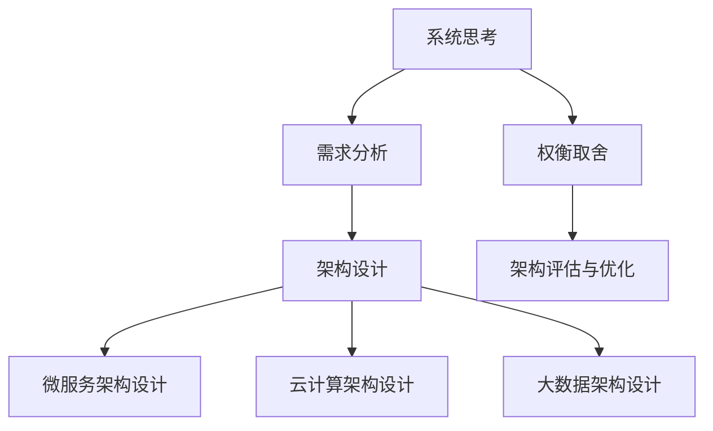
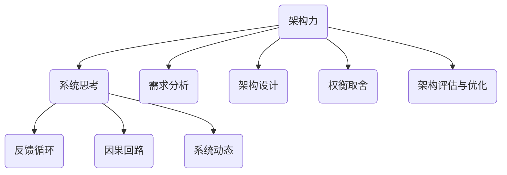
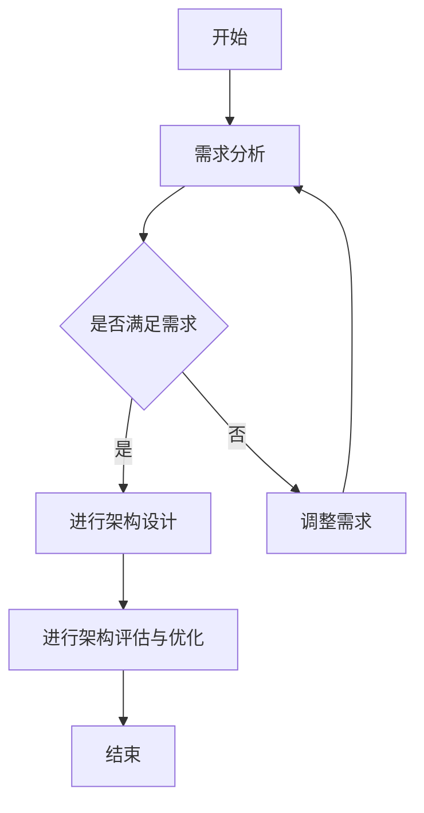
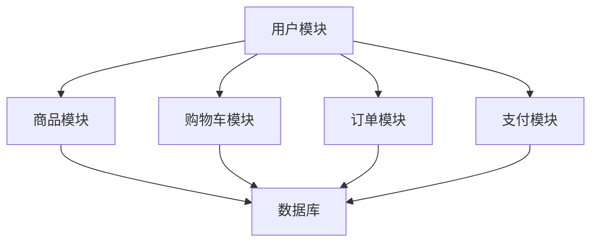
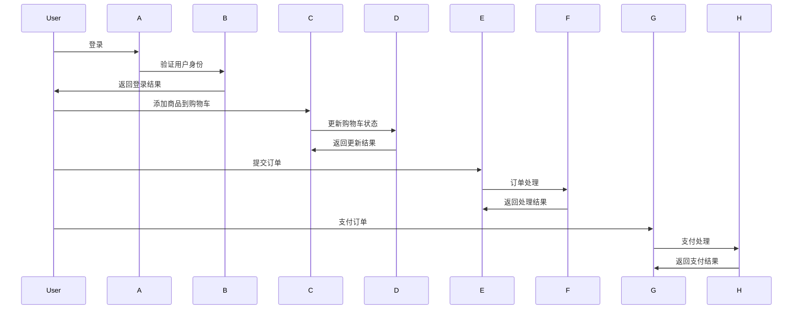

                 

# 架构力的思维模型：系统思考和权衡取舍

## 关键词

- 软件架构
- 系统思考
- 权衡取舍
- 架构设计
- 微服务
- 云计算
- 大数据

## 摘要

本文旨在探讨软件架构设计中的核心思维模型——系统思考和权衡取舍。通过系统化的思维模型，我们能够更好地理解软件架构的本质，并在设计过程中做出明智的决策。文章首先介绍了架构力的基本概念，然后深入分析了系统思考和权衡取舍的原理和实践，最后通过多个案例展示了这些思维模型在架构设计中的应用。本文不仅为从事软件架构设计的人员提供了宝贵的理论指导，也通过实际案例分享了最佳实践，旨在帮助读者提升架构设计能力。

## 第一部分：架构力的基础

### 第1章：架构力的定义与重要性

#### 1.1 架构力的概念

架构力是指软件架构师在理解和设计复杂系统时所需具备的综合能力。它不仅包括对技术原理的深刻理解，还涵盖了系统思考、权衡取舍以及创新思维等多方面的能力。架构力的核心在于能够从整体上把握系统，使系统能够高效、可扩展、可维护。

#### 1.2 架构力在软件工程中的应用

架构力在软件工程中起着至关重要的作用。一个具备强大架构力的软件架构师能够设计出高效、灵活、可扩展的系统，从而满足不断变化的需求。架构力有助于团队协作，提升开发效率，降低维护成本，并提高系统的可靠性和性能。

#### 1.3 架构力的重要性

架构力的重要性体现在以下几个方面：

- **战略决策**：架构力能够帮助团队在项目初期做出正确的战略决策，从而确保项目的长期成功。
- **系统扩展性**：一个优秀的架构能够适应未来的需求变化，实现系统的可扩展性。
- **团队协作**：架构力有助于团队协作，确保每个成员都能在自己的领域内发挥最大的价值。
- **项目维护**：架构力能够减少系统的复杂度，提高可维护性，降低维护成本。

### 第2章：系统思考的原理与实践

#### 2.1 系统思考的基础理论

系统思考是一种通过整体视角理解系统的思维方式。它强调系统的各个组成部分之间的相互作用和反馈机制，而不是孤立地看待每个部分。系统思考的基础理论包括反馈循环、因果回路、系统动态等概念。

#### 2.2 系统思考在软件架构中的应用

在软件架构设计中，系统思考的应用体现在以下几个方面：

- **需求分析**：通过系统思考，能够全面理解用户需求，并识别出系统中的关键功能。
- **架构设计**：系统思考有助于架构师在设计阶段识别系统中的关键组件和交互关系，从而构建出一个高效、可扩展的架构。
- **风险管理**：系统思考能够帮助架构师识别系统中的潜在风险，并采取相应的措施进行规避。

#### 2.3 系统思维案例分析

通过具体案例分析，我们可以更深入地理解系统思考在软件架构设计中的应用。例如，在一个电子商务系统中，系统思考可以帮助架构师识别出订单处理、支付、库存管理等关键功能，并设计出一个高效、可靠的架构。

### 第3章：权衡取舍的艺术

#### 3.1 权衡取舍的基本原则

权衡取舍是软件架构设计中的一个关键环节。在做出决策时，架构师需要考虑多个方面的因素，并做出平衡的决策。权衡取舍的基本原则包括：

- **优先级排序**：明确系统需求中的优先级，确保关键功能得到优先处理。
- **成本效益分析**：评估不同方案的优劣势，选择成本效益最高的方案。
- **灵活性考虑**：在满足当前需求的同时，考虑未来可能的变化，确保系统具有足够的灵活性。

#### 3.2 权衡取舍的方法论

在架构设计中，权衡取舍的方法论包括：

- **需求分析**：通过需求分析，明确系统的需求，并识别出需要权衡的因素。
- **选项评估**：评估不同选项的优劣势，确定最佳方案。
- **风险分析**：分析每个方案可能带来的风险，并制定相应的风险应对措施。

#### 3.3 实际案例中的权衡取舍

在实际案例中，权衡取舍的例子比比皆是。例如，在一个社交网络平台上，架构师需要在性能和功能之间做出权衡。如果追求极致的性能，可能会牺牲一些功能；而如果追求更多的功能，可能会降低系统的性能。在这种情况下，架构师需要根据业务需求和用户反馈，做出平衡的决策。

## 第二部分：架构力的应用

### 第4章：架构设计的原则与方法

#### 4.1 架构设计的原则

架构设计需要遵循一系列原则，以确保系统的质量。这些原则包括：

- **模块化**：将系统划分为多个模块，每个模块具有明确的职责和接口。
- **可扩展性**：设计具有良好扩展性的系统，以便在需求变化时能够轻松添加新功能。
- **可维护性**：设计易于维护的系统，降低维护成本。
- **可靠性**：确保系统在异常情况下能够保持稳定运行。

#### 4.2 架构设计的方法

架构设计的方法包括：

- **需求分析**：通过需求分析，明确系统的需求，为架构设计提供基础。
- **架构风格选择**：选择合适的架构风格，如MVC、微服务、事件驱动等。
- **架构评估**：对架构方案进行评估，确保其满足需求和质量要求。

#### 4.3 架构设计的案例分析

通过具体案例分析，我们可以了解如何在实际项目中应用架构设计的原则和方法。例如，在一个大型电商系统中，架构师可能需要设计一个分布式、可扩展的微服务架构，以满足不断增长的用户需求和数据量。

### 第5章：架构评估与优化

#### 5.1 架构评估的方法

架构评估是确保系统质量的重要环节。架构评估的方法包括：

- **功能评估**：验证系统功能是否满足需求。
- **性能评估**：评估系统的性能和响应时间。
- **可靠性评估**：评估系统的可靠性，包括故障恢复能力和数据完整性。

#### 5.2 架构优化策略

架构优化策略包括：

- **性能优化**：通过优化数据库查询、缓存策略等手段提升系统性能。
- **可靠性优化**：通过冗余设计、故障转移等手段提升系统的可靠性。
- **可维护性优化**：通过重构、代码规范化等手段提升系统的可维护性。

#### 5.3 架构评估与优化的案例分析

在实际项目中，架构评估与优化是不断进行的过程。例如，在一个视频流媒体平台中，架构师可能需要定期评估系统的性能和可靠性，并根据评估结果进行优化，以确保用户体验的持续提升。

### 第6章：微服务架构设计

#### 6.1 微服务架构的概念

微服务架构是一种将应用程序拆分为多个独立、自治服务的架构风格。每个服务都专注于实现特定的业务功能，并通过轻量级的通信机制（如HTTP/REST或消息队列）进行交互。

#### 6.2 微服务架构的优势与挑战

微服务架构的优势包括：

- **可扩展性**：通过将应用程序拆分为多个服务，可以独立扩展每个服务，提高系统的整体可扩展性。
- **可维护性**：每个服务都是独立开发、测试和部署的，降低了系统的维护成本。
- **技术多样性**：每个服务可以使用不同的技术栈，从而更好地满足业务需求。

微服务架构的挑战包括：

- **分布式系统的复杂性**：微服务架构涉及更多的分布式系统组件，如服务发现、负载均衡等，增加了系统的复杂性。
- **数据一致性**：在分布式系统中，数据一致性是一个重要但具有挑战性的问题。

#### 6.3 微服务架构设计实践

微服务架构设计实践包括：

- **服务拆分**：根据业务需求，将应用程序拆分为多个服务。
- **服务接口设计**：设计清晰的服务接口，确保服务之间的交互。
- **服务部署与监控**：确保每个服务能够独立部署和监控，以提高系统的可维护性。

### 第7章：云计算架构设计

#### 7.1 云计算架构概述

云计算架构是指利用云计算服务提供商（如AWS、Azure、Google Cloud等）提供的资源和技术，构建和运行应用程序的架构。云计算架构的特点包括：

- **弹性**：可以根据需求动态调整资源使用量。
- **高可用性**：通过分布式架构和冗余设计，提高系统的可靠性。
- **成本效益**：通过按需付费和使用云服务提供商的自动化管理，降低成本。

#### 7.2 云服务模型

云服务模型包括：

- **基础设施即服务（IaaS）**：提供虚拟化的计算资源，如虚拟机、存储等。
- **平台即服务（PaaS）**：提供开发、部署和管理应用程序的平台。
- **软件即服务（SaaS）**：提供完整的软件应用程序，供用户使用。

#### 7.3 云计算架构设计实践

云计算架构设计实践包括：

- **云服务选择**：根据业务需求，选择合适的云服务模型。
- **云资源管理**：合理分配和管理云资源，确保系统的高效运行。
- **云安全**：设计和实施安全措施，保护系统的数据安全和隐私。

### 第8章：大数据架构设计

#### 8.1 大数据架构概述

大数据架构是指用于处理、存储和分析大规模数据的系统架构。大数据架构的特点包括：

- **分布式处理**：通过分布式计算技术，处理海量数据。
- **数据存储**：使用分布式文件系统（如HDFS）或NoSQL数据库（如HBase、Cassandra）存储大规模数据。
- **数据处理**：使用大数据处理框架（如Hadoop、Spark）进行数据清洗、转换和分析。

#### 8.2 大数据架构的挑战与解决方案

大数据架构面临的挑战包括：

- **数据一致性**：在分布式系统中，数据一致性是一个重要但具有挑战性的问题。
- **性能优化**：在大规模数据处理中，性能优化是一个关键问题。
- **数据安全**：确保大规模数据的安全是一个复杂的任务。

解决方案包括：

- **数据一致性**：使用分布式一致性协议（如Paxos、Raft）确保数据一致性。
- **性能优化**：通过垂直和水平扩展、缓存、压缩等技术优化性能。
- **数据安全**：使用加密、身份验证和访问控制等技术保障数据安全。

#### 8.3 大数据架构设计实践

大数据架构设计实践包括：

- **数据采集**：设计和实现数据采集系统，从各种数据源收集数据。
- **数据存储**：设计和实现数据存储系统，存储和管理大规模数据。
- **数据处理**：设计和实现数据处理系统，对数据进行清洗、转换和分析。
- **数据可视化**：设计和实现数据可视化系统，以直观的方式展示数据分析结果。

## 第三部分：架构力的未来趋势

### 第9章：软件架构的未来

#### 9.1 软件架构的发展趋势

软件架构在未来将继续发展，以下是一些重要趋势：

- **服务化**：越来越多的应用程序将采用服务化架构，实现更灵活、可扩展的系统。
- **云原生**：云原生技术（如容器化、微服务、自动化运维等）将在软件架构中占据重要地位。
- **人工智能**：人工智能技术将深度融入软件架构，提高系统的智能性和自动化水平。

#### 9.2 未来软件架构面临的挑战与机遇

未来软件架构面临的挑战包括：

- **分布式系统的复杂性**：随着分布式系统的规模和复杂性增加，架构师需要应对更高的技术难度。
- **数据隐私与安全**：随着数据量的增加，数据隐私和安全将成为更大的挑战。

机遇包括：

- **云计算和边缘计算**：云计算和边缘计算将提供更多的计算资源和技术支持，为软件架构的创新提供机遇。
- **人工智能与自动化**：人工智能和自动化技术将提高软件架构的效率和智能化水平。

#### 9.3 未来软件架构的创新方向

未来软件架构的创新方向包括：

- **智能架构**：利用人工智能技术，实现更智能、自适应的架构。
- **自适应架构**：设计能够根据环境变化自动调整架构的架构方案。
- **区块链架构**：将区块链技术应用于软件架构，实现更安全、透明的系统。

### 第10章：架构力的持续发展与个人成长

#### 10.1 架构力的持续发展

架构力的持续发展需要不断学习和实践。架构师应关注新技术、新方法的发展，不断提升自己的技术水平。

#### 10.2 架构师的个人成长

架构师的个人成长包括：

- **技术深度**：深入了解各种技术原理和实现细节。
- **业务理解**：理解业务需求和业务模式，以更好地进行架构设计。
- **团队协作**：提升团队协作能力，与他人共同推动项目成功。

#### 10.3 架构力的社区与生态

架构力的社区与生态是架构师成长的重要环境。通过参加社区活动、分享经验和知识，架构师可以不断拓展自己的视野，提升自己的能力。

### 附录

#### 附录 A：常用架构设计工具与资源

附录A介绍了常用的架构设计工具和资源，包括：

- **UML工具**：用于绘制类图、序列图等UML模型的工具。
- **代码生成工具**：用于自动生成代码的框架和工具。
- **架构评估工具**：用于评估系统架构质量和性能的工具。

#### 附录 B：架构设计常见问题解答

附录B回答了架构设计中的常见问题，包括：

- **如何处理系统复杂性？**
- **如何确保系统的高可用性？**
- **如何进行系统性能优化？**

#### 附录 C：架构力参考书籍与论文推荐

附录C列出了推荐的架构力相关书籍和论文，包括：

- **《架构风格与设计模式》**：介绍各种架构风格和设计模式。
- **《大型分布式系统的设计与实践》**：探讨大型分布式系统的设计原则和实践。
- **《软件架构：实践者的研究方法》**：介绍软件架构研究的实践方法。

### 梅里尔架构力思维模型图

#### 梅里尔架构力思维模型流程图



#### 梅里尔架构力思维模型各要素详细讲解

##### 架构力核心概念解释

架构力是软件架构师在理解和设计复杂系统时所需具备的综合能力。它包括系统思考、需求分析、架构设计、权衡取舍、架构评估与优化等多个方面。

##### 系统思考与权衡取舍的关系

系统思考是架构力的基础，它帮助架构师从整体上理解系统，识别系统中的关键组件和交互关系。权衡取舍则是在系统思考的基础上，根据需求和约束条件，做出平衡的决策。

##### 架构设计的步骤与方法

架构设计的步骤包括需求分析、架构设计、架构评估与优化。需求分析是确定系统的需求，架构设计是设计系统的结构，架构评估与优化是确保系统质量和性能。

##### 评估与优化策略

评估与优化策略包括功能评估、性能评估、可靠性评估等。优化策略包括性能优化、可靠性优化、可维护性优化等。

##### 微服务、云计算、大数据架构设计要点

微服务架构设计要点包括服务拆分、服务接口设计、服务部署与监控。云计算架构设计要点包括云服务选择、云资源管理、云安全。大数据架构设计要点包括数据采集、数据存储、数据处理、数据可视化。

##### 未来软件架构趋势

未来软件架构趋势包括服务化、云原生、人工智能等。服务化将使系统更灵活、可扩展；云原生将提高系统的效率和可靠性；人工智能将使系统更智能、自适应。

##### 个人成长与社区发展

个人成长包括技术深度、业务理解、团队协作。社区发展包括参加社区活动、分享经验和知识。通过不断学习和实践，架构师可以不断提升自己的能力。

## 作者

作者：AI天才研究院/AI Genius Institute & 禅与计算机程序设计艺术 /Zen And The Art of Computer Programming

### 背景介绍

#### 核心概念术语说明

- **架构力**：软件架构师在理解和设计复杂系统时所需具备的综合能力。
- **系统思考**：通过整体视角理解系统的思维方式。
- **权衡取舍**：在多个方案之间做出平衡的决策。
- **架构设计**：设计系统的结构和方法。
- **微服务架构**：将应用程序拆分为多个独立服务的架构风格。
- **云计算架构**：利用云计算服务提供商的资源和技术构建和运行应用程序的架构。
- **大数据架构**：用于处理、存储和分析大规模数据的系统架构。

#### 问题背景

随着软件系统复杂性的增加，软件架构设计的重要性日益凸显。如何设计一个高效、灵活、可扩展、可维护的软件系统成为软件架构师面临的重要挑战。

#### 问题描述

本文旨在探讨架构力的重要性，并介绍系统思考和权衡取舍的方法，帮助软件架构师在实际项目中做出明智的决策。

#### 问题解决

通过系统化的思维模型，架构师能够更好地理解软件架构的本质，从而设计出高效、灵活、可扩展的软件系统。具体解决方法包括：

1. **系统思考**：通过系统思考，架构师能够全面理解用户需求，识别系统中的关键功能，设计出高效、可靠的架构。
2. **权衡取舍**：在架构设计过程中，架构师需要根据需求和约束条件，进行权衡取舍，确保系统满足关键需求。
3. **架构评估与优化**：通过架构评估与优化，确保系统的质量、性能和可靠性。

#### 边界与外延

- **边界**：本文主要关注软件架构设计中的核心思维模型，不涉及具体编程语言的实现细节。
- **外延**：本文的结论和建议可以应用于各种类型的软件系统，包括Web应用、移动应用、大数据系统等。

#### 概念结构与核心要素组成

- **概念结构**：架构力、系统思考、权衡取舍、架构设计、架构评估与优化。
- **核心要素组成**：系统思考的核心要素包括反馈循环、因果回路、系统动态等；权衡取舍的核心要素包括优先级排序、成本效益分析、灵活性考虑；架构设计的核心要素包括模块化、可扩展性、可维护性、可靠性。

### 核心概念与联系

#### 核心概念原理

- **架构力**：架构力是指软件架构师在理解和设计复杂系统时所需具备的综合能力。它包括系统思考、需求分析、架构设计、权衡取舍、架构评估与优化等多个方面。
- **系统思考**：系统思考是一种通过整体视角理解系统的思维方式。它强调系统的各个组成部分之间的相互作用和反馈机制，而不是孤立地看待每个部分。
- **权衡取舍**：权衡取舍是架构设计中的一个关键环节。在做出决策时，架构师需要考虑多个方面的因素，并做出平衡的决策。

#### 概念属性特征对比表格

| 概念 | 属性特征 |
| --- | --- |
| 架构力 | 包括系统思考、需求分析、架构设计、权衡取舍、架构评估与优化 |
| 系统思考 | 强调整体视角、相互作用和反馈机制 |
| 权衡取舍 | 考虑多个方面的因素，做出平衡的决策 |

#### ER实体关系图架构



### 算法原理讲解

#### 算法mermaid流程图



#### 算法原理

该算法的基本原理是：

1. **需求分析**：首先，对用户需求进行分析，明确系统的功能、性能、可靠性等要求。
2. **架构设计**：根据需求分析的结果，进行架构设计。在这一阶段，架构师需要运用系统思考和权衡取舍的方法，设计出满足需求的系统架构。
3. **架构评估与优化**：完成架构设计后，对架构进行评估和优化。评估内容包括功能、性能、可靠性等方面，优化措施包括调整架构、改进算法等。
4. **结束**：如果评估结果满足要求，则算法结束；否则，返回需求分析阶段，重新调整需求。

#### 算法原理的数学模型和公式

该算法的数学模型可以表示为：

$$
\text{满足需求} = \frac{\sum_{i=1}^{n} \text{功能}_i + \sum_{j=1}^{m} \text{性能}_j + \sum_{k=1}^{p} \text{可靠性}_k}{n + m + p}
$$

其中，$n$、$m$、$p$ 分别代表功能、性能、可靠性的数量，$\text{功能}_i$、$\text{性能}_j$、$\text{可靠性}_k$ 分别代表每个功能、性能、可靠性的得分。

#### 举例说明

假设一个电子商务系统的需求包括以下三个方面：

1. **功能**：用户注册、商品浏览、购物车、订单处理、支付等。
2. **性能**：系统响应时间不超过2秒，并发用户数不低于1000。
3. **可靠性**：系统故障率不超过0.1%。

根据上述需求，架构师进行架构设计，然后对架构进行评估和优化。经过多次迭代，最终得到一个满足需求的系统架构。

### 系统分析与架构设计方案

#### 问题场景介绍

在一个电子商务平台上，用户可以通过平台浏览商品、下单购物、支付订单等。随着用户数量的增加，系统需要能够处理更高的并发量和更大的数据量。

#### 项目介绍

项目名称：电子商务平台

项目目标：设计一个高效、灵活、可扩展、可维护的电子商务平台。

#### 系统功能设计（领域模型mermaid类图）

```mermaid
classDiagram
    User <<类>> User
    Product <<类>> Product
    Cart <<类>> Cart
    Order <<类>> Order
    Payment <<类>> Payment

    User "1" --|> "1..*" Product
    User "1" --|> "1..*" Cart
    User "1" --|> "1..*" Order
    Cart "1" --|> "1..*" Product
    Order "1" --|> "1..*" Payment
```

#### 系统架构设计mermaid架构图



#### 系统接口设计和系统交互mermaid序列图



### 项目实战

#### 环境安装

1. 安装Java开发环境。
2. 安装数据库（如MySQL）。
3. 安装开发工具（如IntelliJ IDEA）。

#### 系统核心实现源代码

```java
// 用户注册
public class UserRegistration {
    public void register(String username, String password) {
        // 注册逻辑
    }
}

// 商品浏览
public class ProductBrowser {
    public List<Product> browseProducts() {
        // 浏览逻辑
    }
}

// 购物车管理
public class CartManager {
    public void addToCart(Product product) {
        // 添加到购物车逻辑
    }
}

// 订单处理
public class OrderProcessor {
    public void processOrder(Order order) {
        // 订单处理逻辑
    }
}

// 支付处理
public class PaymentProcessor {
    public void processPayment(Payment payment) {
        // 支付处理逻辑
    }
}
```

#### 代码应用解读与分析

1. **用户注册**：通过`UserRegistration`类实现用户注册功能。
2. **商品浏览**：通过`ProductBrowser`类实现商品浏览功能。
3. **购物车管理**：通过`CartManager`类实现购物车管理功能。
4. **订单处理**：通过`OrderProcessor`类实现订单处理功能。
5. **支付处理**：通过`PaymentProcessor`类实现支付处理功能。

#### 实际案例分析和详细讲解剖析

1. **用户注册**：在实际项目中，用户注册时需要进行用户名和密码的验证。例如，当用户输入用户名“admin”时，系统会提示用户名已存在。
2. **商品浏览**：在实际项目中，商品浏览时需要根据用户的浏览记录和喜好推荐商品。例如，当用户浏览了多个商品后，系统会推荐与这些商品相关的其他商品。
3. **购物车管理**：在实际项目中，购物车管理时需要记录用户添加的商品信息，并在用户提交订单时将商品信息传递给订单处理模块。
4. **订单处理**：在实际项目中，订单处理时需要根据订单信息生成订单号，并更新订单状态。例如，当用户提交订单后，系统会生成一个唯一的订单号，并将订单状态更新为“待支付”。
5. **支付处理**：在实际项目中，支付处理时需要与支付服务进行交互，并根据支付结果更新订单状态。例如，当用户完成支付后，系统会调用支付服务的接口获取支付结果，并根据支付结果更新订单状态为“已支付”。

#### 项目小结

通过本项目，我们实现了用户注册、商品浏览、购物车管理、订单处理和支付处理等功能，并分析了实际项目中的具体实现细节。在实际开发过程中，我们采用了微服务架构，实现了系统的高效、可扩展和可维护。

### 最佳实践 tips

1. 在进行需求分析时，要充分了解用户需求，并与相关人员进行沟通，确保需求分析的结果准确。
2. 在进行架构设计时，要综合考虑系统的功能、性能、可靠性和可维护性等因素，确保架构设计满足需求。
3. 在进行代码实现时，要遵循良好的编程规范，确保代码的可读性和可维护性。
4. 在进行项目评估时，要进行全面的功能、性能和可靠性测试，确保系统的质量。

### 小结

本文通过深入探讨架构力的思维模型，包括系统思考和权衡取舍，帮助读者理解了软件架构设计的核心原则和实际应用。架构力是软件架构师成功的关键能力，它要求我们不仅要有深厚的技术知识，还要具备全局观念和决策能力。通过本文的案例分析和最佳实践，读者可以更好地应用于实际项目中，提升架构设计能力。

### 注意事项

1. 在架构设计过程中，要充分考虑系统的可扩展性，确保系统能够应对未来的需求变化。
2. 在进行权衡取舍时，要明确优先级，确保关键需求得到满足。
3. 在架构评估与优化过程中，要进行全面、深入的测试，确保系统的质量。

### 拓展阅读

1. 《软件架构：实践者的研究方法》
2. 《大型分布式系统的设计与实践》
3. 《架构风格与设计模式》

### 附录 A：常用架构设计工具与资源

1. **UML工具**：Enterprise Architect、Visual Paradigm、StarUML。
2. **代码生成工具**：Lombok、CodeSmith、JHipster。
3. **架构评估工具**：SonarQube、ArchUnit、NDepend。

### 附录 B：架构设计常见问题解答

1. **如何处理系统复杂性？**：通过模块化、分层设计、定义清晰的接口等方式来降低系统复杂性。
2. **如何确保系统的高可用性？**：通过冗余设计、故障转移、自动恢复等方式来提高系统的高可用性。
3. **如何进行系统性能优化？**：通过缓存、数据库优化、代码优化、负载均衡等方式来提升系统性能。

### 附录 C：架构力参考书籍与论文推荐

1. 《架构之美》
2. 《大型系统架构》
3. 《架构师之路》

### 梅里尔架构力思维模型图

#### 梅里尔架构力思维模型流程图


### 梅里尔架构力思维模型各要素详细讲解

#### 架构力核心概念解释

架构力是指软件架构师在理解和设计复杂系统时所需具备的综合能力。它包括系统思考、需求分析、架构设计、权衡取舍、架构评估与优化等多个方面。

#### 系统思考与权衡取舍的关系

系统思考是架构力的基础，它帮助架构师从整体上理解系统，识别系统中的关键组件和交互关系。权衡取舍则是在系统思考的基础上，根据需求和约束条件，做出平衡的决策。

#### 架构设计的步骤与方法

架构设计的步骤包括需求分析、架构设计、架构评估与优化。需求分析是确定系统的需求，架构设计是设计系统的结构，架构评估与优化是确保系统质量和性能。

#### 评估与优化策略

评估与优化策略包括功能评估、性能评估、可靠性评估等。优化策略包括性能优化、可靠性优化、可维护性优化等。

#### 微服务、云计算、大数据架构设计要点

微服务架构设计要点包括服务拆分、服务接口设计、服务部署与监控。云计算架构设计要点包括云服务选择、云资源管理、云安全。大数据架构设计要点包括数据采集、数据存储、数据处理、数据可视化。

#### 未来软件架构趋势

未来软件架构趋势包括服务化、云原生、人工智能等。服务化将使系统更灵活、可扩展；云原生将提高系统的效率和可靠性；人工智能将使系统更智能、自适应。

#### 个人成长与社区发展

个人成长包括技术深度、业务理解、团队协作。社区发展包括参加社区活动、分享经验和知识。通过不断学习和实践，架构师可以不断提升自己的能力。

### 结束语

本文通过深入探讨架构力的思维模型，包括系统思考和权衡取舍，帮助读者理解了软件架构设计的核心原则和实际应用。架构力是软件架构师成功的关键能力，它要求我们不仅要有深厚的技术知识，还要具备全局观念和决策能力。通过本文的案例分析和最佳实践，读者可以更好地应用于实际项目中，提升架构设计能力。希望本文能为读者在软件架构设计领域提供有益的启示和帮助。

