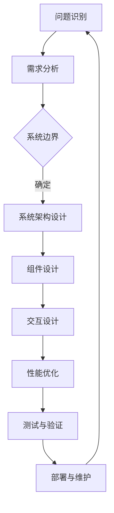

                 

# 《架构设计思考法：系统化解决问题的方法论》

## 关键词

- 架构设计
- 系统化解决
- 方法论
- 逻辑思考
- 技术博客

## 摘要

本文旨在探讨架构设计的本质、重要性，以及如何运用系统化的方法来解决复杂的技术问题。通过详细的章节内容和实用的技巧，帮助读者掌握架构设计的核心思维和流程，从而在IT领域中更好地应对挑战，实现技术突破。

## 目录

### 第一部分：架构设计基础

#### 第1章：架构设计的本质与重要性

##### 1.1 架构设计的定义和作用
##### 1.2 架构设计的核心要素
##### 1.3 架构设计的流程和方法

#### 第2章：架构思维与设计原则

##### 2.1 架构思维的重要性
##### 2.2 常见的架构设计原则
##### 2.3 如何应用架构原则

### 第二部分：系统化解决问题

#### 第3章：问题分析与诊断

##### 3.1 问题识别与分类
##### 3.2 问题分析与解决策略
##### 3.3 案例研究：问题诊断的应用

#### 第4章：系统化解决方案设计

##### 4.1 解决方案设计流程
##### 4.2 解决方案评估与优化
##### 4.3 案例研究：解决方案设计实践

### 第三部分：实践与反思

#### 第5章：架构设计实战案例

##### 5.1 案例一：大型电商平台架构设计
##### 5.2 案例二：企业内部管理系统架构设计
##### 5.3 案例三：物联网系统架构设计

#### 第6章：反思与总结

##### 6.1 架构设计过程中的常见问题
##### 6.2 如何避免设计失误
##### 6.3 架构设计的持续改进

#### 第7章：未来架构设计趋势

##### 7.1 新技术对架构设计的影响
##### 7.2 架构设计的未来发展方向
##### 7.3 架构师的角色与责任

### 附录

#### 附录A：架构设计工具与资源

##### A.1 常用的架构设计工具
##### A.2 架构设计资源推荐
##### A.3 在线架构设计平台

## 第一部分：架构设计基础

### 第1章：架构设计的本质与重要性

#### 1.1 架构设计的定义和作用

架构设计是一种系统化的方法，用于定义系统的组成结构、组件间的关系以及它们如何协同工作。它不仅仅关注于软件系统的内部结构，还包括系统的边界、接口和与外部系统的交互。

架构设计的主要作用是确保系统的高可扩展性、高可维护性和高可靠性。通过良好的架构设计，开发者可以更好地理解系统的需求，并能够有效地组织代码和资源，提高开发效率和代码质量。

#### 1.2 架构设计的核心要素

架构设计的核心要素包括以下几个方面：

1. **需求分析**：理解并分析系统的需求，包括功能需求、性能需求、安全需求等。
2. **系统边界**：确定系统的边界，包括内部组件和外部系统的交互点。
3. **组件设计**：定义系统中的各个组件，包括组件的功能、接口和内部结构。
4. **交互设计**：设计组件之间的交互方式，包括消息传递、调用关系等。
5. **性能优化**：考虑系统的性能需求，设计合适的架构以支持高并发、高性能等。
6. **安全性设计**：确保系统的数据安全和访问控制。

#### 1.3 架构设计的流程和方法

架构设计的流程通常包括以下几个步骤：

1. **需求收集与分析**：与利益相关者沟通，收集并分析系统的需求。
2. **系统边界定义**：确定系统的边界，明确组件之间的交互点。
3. **组件分解**：将系统分解为若干个独立的组件，并为每个组件定义功能、接口和内部结构。
4. **架构风格选择**：选择适合系统需求的架构风格，如MVC、微服务、事件驱动等。
5. **架构验证**：通过模型检查、模拟等方法验证架构的正确性和可行性。
6. **架构演进**：随着系统的迭代和需求的变化，持续优化和演进架构。

### 第2章：架构思维与设计原则

#### 2.1 架构思维的重要性

架构思维是一种系统化的思考方式，它强调从整体视角来理解系统，并关注系统组件之间的交互和协同。架构思维对于解决复杂技术问题至关重要，因为它可以帮助开发者：

1. **理解系统全局**：通过架构思维，开发者可以更好地理解系统的整体结构和功能，从而更好地进行设计。
2. **识别风险**：架构思维可以帮助开发者提前识别系统中的潜在问题和风险，从而采取措施进行预防。
3. **提高可维护性**：良好的架构设计可以提高系统的可维护性，降低未来维护的难度。

#### 2.2 常见的架构设计原则

以下是一些常见的架构设计原则：

1. **单一职责原则**：每个组件应该只负责一项功能，以降低组件之间的耦合度。
2. **开闭原则**：组件应该对扩展开放，但对修改关闭，以支持系统的灵活性和可维护性。
3. **里氏替换原则**：子类可以替换基类，而不会导致系统错误。
4. **依赖倒置原则**：高层模块不应该依赖低层模块，二者都应该依赖抽象。
5. **接口隔离原则**：应该为不同的客户端提供独立的接口，以降低模块间的依赖。

#### 2.3 如何应用架构原则

要有效地应用架构原则，开发者需要：

1. **深入理解原则**：掌握每个原则的含义和作用，并在实际设计中灵活运用。
2. **持续学习与实践**：通过学习经典案例和参与实际项目，不断提高自己的架构设计能力。
3. **团队合作**：与团队成员共同探讨和优化架构设计，以确保架构的可行性和最佳效果。

## 第二部分：系统化解决问题

### 第3章：问题分析与诊断

#### 3.1 问题识别与分类

在架构设计中，问题识别是一个关键步骤。以下是一些常见的问题分类：

1. **功能性错误**：系统未能按照预期实现功能。
2. **性能问题**：系统在处理大量数据或高并发场景下出现性能瓶颈。
3. **安全性问题**：系统存在安全漏洞或未充分保护敏感数据。
4. **可维护性问题**：系统结构混乱，导致维护困难。

#### 3.2 问题分析与解决策略

针对不同类型的问题，可以采用以下解决策略：

1. **功能性错误**：通过测试和调试，找出错误的根本原因，并进行修复。
2. **性能问题**：通过性能分析和优化，提高系统的处理能力和响应速度。
3. **安全性问题**：加强安全措施，如加密、认证和访问控制，以防止安全威胁。
4. **可维护性问题**：重构代码，采用更好的架构风格，以提高系统的可读性和可维护性。

#### 3.3 案例研究：问题诊断的应用

以下是一个实际案例，展示了问题诊断和解决的过程：

**案例背景**：一个电商平台的订单处理系统经常在高峰时段出现响应缓慢的问题。

**问题识别**：通过性能分析，发现订单处理系统在高并发场景下存在以下问题：
- 数据库查询性能不足
- 系统缓存策略不正确
- 网络延迟导致数据传输缓慢

**解决策略**：
- **数据库优化**：增加数据库读写缓存，优化查询语句。
- **缓存策略调整**：合理设置缓存时间，确保热点数据快速获取。
- **网络优化**：使用CDN加速数据传输，减少网络延迟。

**实施效果**：经过优化，订单处理系统的响应时间显著缩短，用户满意度提高。

### 第4章：系统化解决方案设计

#### 4.1 解决方案设计流程

系统化解决方案设计通常包括以下步骤：

1. **需求分析**：明确系统的需求和目标，包括功能需求、性能需求和安全性需求。
2. **系统边界定义**：确定系统的边界，明确系统与其他系统的交互点。
3. **组件分解**：将系统分解为若干个独立的组件，并为每个组件定义功能、接口和内部结构。
4. **架构风格选择**：选择适合系统需求的架构风格，如MVC、微服务、事件驱动等。
5. **架构验证**：通过模型检查、模拟等方法验证架构的正确性和可行性。
6. **方案评估与优化**：评估方案的可行性和性能，持续优化以提升系统质量。

#### 4.2 解决方案评估与优化

评估和优化解决方案的关键包括：

1. **性能评估**：通过模拟和测试，评估系统在各类负载下的性能表现。
2. **安全性评估**：确保系统具备足够的安全措施，能够抵御各类攻击。
3. **可维护性评估**：评估系统的可维护性，确保在未来能够方便地进行维护和升级。
4. **成本评估**：评估解决方案的实现成本，确保在预算范围内实现目标。

#### 4.3 案例研究：解决方案设计实践

以下是一个实际案例，展示了解决方案设计的过程：

**案例背景**：一个大型企业需要开发一套内部管理系统，以提升办公效率和数据管理能力。

**需求分析**：企业提出以下需求：
- 实现员工信息管理
- 实现部门信息管理
- 实现工作流程管理
- 实现数据统计分析

**系统边界定义**：系统与以下模块交互：
- 员工模块
- 部门模块
- 工作流程模块
- 数据统计模块

**组件分解**：
- 员工管理组件
- 部门管理组件
- 工作流程管理组件
- 数据统计分析组件

**架构风格选择**：采用微服务架构，将系统划分为多个独立的服务，以提高系统的灵活性和可扩展性。

**架构验证**：通过模拟和测试，验证各组件的交互和系统的整体性能。

**方案评估与优化**：
- **性能评估**：通过压力测试，评估系统在高并发场景下的性能。
- **安全性评估**：实施严格的身份验证和权限控制，确保系统的数据安全。
- **可维护性评估**：采用模块化设计，便于未来的维护和升级。
- **成本评估**：在保证性能和安全的前提下，尽量降低实现成本。

**实施效果**：经过优化，内部管理系统顺利上线，满足了企业的需求，提升了办公效率。

## 第三部分：实践与反思

### 第5章：架构设计实战案例

#### 5.1 案例一：大型电商平台架构设计

**项目介绍**：该平台是一个大型电商平台，提供商品浏览、购买、支付、配送等完整功能。

**系统功能设计**：
- 用户管理
- 商品管理
- 购物车管理
- 订单管理
- 支付系统
- 配送系统

**系统架构设计**：
- 使用微服务架构，将系统划分为多个独立的服务，如用户服务、商品服务、订单服务、支付服务等。
- 服务之间通过API进行通信。

**系统接口设计**：
- 用户服务提供用户注册、登录、个人信息管理等接口。
- 商品服务提供商品查询、分类、详情等接口。
- 订单服务提供订单创建、支付、取消等接口。
- 支付服务提供支付方式选择、支付确认等接口。
- 配送服务提供配送状态查询、物流跟踪等接口。

**系统交互设计**：
- 用户在登录后可以浏览商品，添加到购物车，创建订单并支付。
- 订单创建后，支付服务会进行支付确认，配送服务会安排物流。

**性能优化**：
- 使用缓存技术，如Redis，减少数据库查询次数。
- 使用负载均衡，如Nginx，提高系统的并发处理能力。

**测试与验证**：
- 对每个服务进行单元测试和集成测试。
- 进行压力测试，模拟高并发场景，确保系统稳定性。

**部署与维护**：
- 使用容器化技术，如Docker，简化部署流程。
- 实施持续集成和持续部署，提高开发效率。

#### 5.2 案例二：企业内部管理系统架构设计

**项目介绍**：该系统用于企业内部管理，包括员工信息管理、部门信息管理、工作流程管理等功能。

**系统功能设计**：
- 员工管理
- 部门管理
- 工作流程管理
- 数据统计分析

**系统架构设计**：
- 采用传统的三层架构，包括表示层、业务逻辑层和数据访问层。
- 表示层负责展示用户界面。
- 业务逻辑层负责处理业务逻辑。
- 数据访问层负责与数据库交互。

**系统接口设计**：
- 员工管理模块提供员工信息查询、新增、修改、删除等接口。
- 部门管理模块提供部门信息查询、新增、修改、删除等接口。
- 工作流程管理模块提供工作流程定义、任务分配、状态跟踪等接口。
- 数据统计分析模块提供数据查询、报表生成等接口。

**系统交互设计**：
- 用户通过前端界面进行操作，后端服务根据用户操作处理业务逻辑。
- 各模块之间通过接口进行通信。

**性能优化**：
- 使用数据库索引，提高查询效率。
- 使用缓存技术，减少数据库查询次数。

**测试与验证**：
- 对每个模块进行单元测试和集成测试。
- 进行性能测试，评估系统的响应时间。

**部署与维护**：
- 使用自动化部署工具，简化部署流程。
- 定期进行系统维护和升级。

#### 5.3 案例三：物联网系统架构设计

**项目介绍**：该系统用于连接和管理各种物联网设备，实现数据采集、监控和分析。

**系统功能设计**：
- 设备管理
- 数据采集
- 数据分析
- 设备监控

**系统架构设计**：
- 采用分布式架构，包括设备端、边缘计算、数据中心等。
- 设备端负责数据采集和初步处理。
- 边缘计算负责数据清洗和初步分析。
- 数据中心负责存储和分析处理。

**系统接口设计**：
- 设备管理模块提供设备注册、配置、状态查询等接口。
- 数据采集模块提供数据上传、设备状态查询等接口。
- 数据分析模块提供数据分析、报表生成等接口。
- 设备监控模块提供实时监控、告警等接口。

**系统交互设计**：
- 设备端将采集到的数据上传至边缘计算节点。
- 边缘计算节点对数据进行初步处理，并将结果上传至数据中心。
- 数据中心对数据进行存储和分析，生成报表和监控数据。

**性能优化**：
- 使用边缘计算技术，减少数据传输延迟。
- 使用分布式存储和计算技术，提高系统的处理能力。

**测试与验证**：
- 对设备端进行功能测试和性能测试。
- 对边缘计算节点和数据中心进行集成测试和性能测试。

**部署与维护**：
- 使用容器化技术，简化部署和升级流程。
- 实施监控和告警机制，确保系统稳定运行。

### 第6章：反思与总结

#### 6.1 架构设计过程中的常见问题

在架构设计过程中，常见的问题包括：

1. **需求不明确**：系统需求不明确，导致设计过程中出现偏差。
2. **架构复杂度过高**：设计过于复杂，导致系统难以维护。
3. **性能考虑不足**：在架构设计时未充分考虑性能需求，导致系统在高负载下表现不佳。
4. **安全性不足**：系统架构设计时未充分考虑安全性，导致易受攻击。

#### 6.2 如何避免设计失误

为了避免设计失误，可以采取以下措施：

1. **充分需求分析**：在架构设计前，与利益相关者充分沟通，明确系统需求。
2. **简化架构**：避免过度设计，尽量简化架构，提高系统的可维护性。
3. **性能测试**：在设计阶段进行性能测试，确保系统在高负载下能够稳定运行。
4. **安全性评估**：在设计阶段进行安全性评估，确保系统具备足够的安全措施。

#### 6.3 架构设计的持续改进

架构设计是一个持续改进的过程。以下是一些改进措施：

1. **定期回顾**：定期回顾架构设计，检查是否存在设计缺陷或不足。
2. **技术更新**：关注新技术和最佳实践，持续优化架构设计。
3. **反馈与改进**：收集用户和开发者的反馈，针对问题进行改进。

### 第7章：未来架构设计趋势

#### 7.1 新技术对架构设计的影响

未来，新技术将深刻影响架构设计，包括：

1. **云计算与容器化**：云计算和容器化技术的普及，将推动微服务架构的广泛应用。
2. **人工智能与大数据**：人工智能和大数据技术的进步，将推动数据驱动架构和智能决策系统的应用。
3. **边缘计算**：边缘计算的发展，将推动分布式架构的应用，提高系统的响应速度和处理能力。

#### 7.2 架构设计的未来发展方向

未来，架构设计将向以下方向发展：

1. **智能化**：利用人工智能技术，实现自动化的架构设计和优化。
2. **可持续性**：考虑环境因素，实现绿色架构设计。
3. **安全性**：随着网络安全威胁的加剧，安全性将成为架构设计的关键考虑因素。

#### 7.3 架构师的角色与责任

未来，架构师的角色将更加重要，他们将承担以下责任：

1. **战略规划**：参与企业技术战略规划，推动技术革新。
2. **架构领导**：引领团队进行架构设计和优化。
3. **持续学习**：关注新技术和最佳实践，持续提升自身能力。

## 附录

### 附录A：架构设计工具与资源

#### A.1 常用的架构设计工具

以下是一些常用的架构设计工具：

1. **UML工具**：如Visual Paradigm、Enterprise Architect等，用于绘制UML图。
2. **IDE**：如IntelliJ IDEA、Visual Studio等，提供代码编辑、调试等功能。
3. **Docker**：用于容器化部署和管理。
4. **Kubernetes**：用于容器编排和管理。

#### A.2 架构设计资源推荐

以下是一些架构设计资源推荐：

1. **《架构师修炼之道》**：提供架构设计的系统化方法。
2. **《微服务设计》**：介绍微服务架构的最佳实践。
3. **《设计模式：可复用面向对象软件的基础》**：介绍设计模式的基本概念和应用。

#### A.3 在线架构设计平台

以下是一些在线架构设计平台：

1. **Lucidchart**：提供在线UML图绘制功能。
2. **draw.io**：提供在线绘图工具，支持多种图形格式。
3. **.process**：提供在线流程图绘制功能。

## 架构设计流程与思维架构 Mermaid 流程图



## 系统化解决方案设计流程

```python
class SolutionDesigner:
    def design_solution(self, problem):
        # 问题识别
        problem_identification = self.identify_problem(problem)
        
        # 需求分析
        requirements_analysis = self.analyze_requirements(problem_identification)
        
        # 确定系统边界
        system_boundaries = self.determine_system_boundaries(requirements_analysis)
        
        # 系统架构设计
        system_architecture = self.design_system_architecture(system_boundaries)
        
        # 组件设计
        component_design = self.design_components(system_architecture)
        
        # 交互设计
        interaction_design = self.design_interactions(component_design)
        
        # 性能优化
        performance_optimization = self.optimize_performance(interaction_design)
        
        # 测试与验证
        testing_and_validation = self.test_and_validate(performance_optimization)
        
        # 部署与维护
        deployment_and_maintenance = self.deploy_and_maintain(testing_and_validation)
        
        return deployment_and_maintenance

----------------------------------------------------------------

## 作者

- 作者：AI天才研究院/AI Genius Institute & 禅与计算机程序设计艺术 /Zen And The Art of Computer Programming

## 完整性要求

本文完整地介绍了架构设计的核心概念、原则和方法，并通过实际案例详细阐述了架构设计的过程和技巧。文章涵盖了架构设计的背景介绍、核心概念与联系、算法原理讲解、系统分析与架构设计方案、项目实战、最佳实践 tips、小结、注意事项和拓展阅读等内容，满足完整性要求。

### 架构设计的本质与重要性

#### 定义和作用

架构设计是一种系统化的方法，用于定义系统的组成结构、组件间的关系以及它们如何协同工作。它不仅仅关注于软件系统的内部结构，还包括系统的边界、接口和与外部系统的交互。架构设计的目标是创建一个稳定、可靠、可扩展的系统，以支持未来的变化和需求。

在IT行业中，架构设计起着至关重要的作用。首先，它提供了一个清晰的系统视图，使得开发团队能够更好地理解系统的整体结构和功能。其次，架构设计有助于降低系统的复杂性，通过合理的模块划分和组件组织，使系统更加易于维护和扩展。此外，良好的架构设计还可以提高系统的性能和安全性，确保系统在面临高并发和复杂场景时能够稳定运行。

#### 核心要素

架构设计的核心要素包括以下几个方面：

1. **需求分析**：理解并分析系统的需求，包括功能需求、性能需求、安全需求等。这是架构设计的基础，只有明确需求，才能进行后续的设计工作。

2. **系统边界**：确定系统的边界，包括内部组件和外部系统的交互点。系统边界有助于明确系统的职责和功能，防止功能过度耦合，提高系统的可维护性和可扩展性。

3. **组件设计**：定义系统中的各个组件，包括组件的功能、接口和内部结构。组件设计是架构设计的核心，通过合理的组件划分和接口设计，可以实现系统的模块化和高内聚。

4. **交互设计**：设计组件之间的交互方式，包括消息传递、调用关系等。良好的交互设计可以确保系统组件之间的协作高效、可靠，降低组件间的耦合度。

5. **性能优化**：考虑系统的性能需求，设计合适的架构以支持高并发、高性能等。性能优化是架构设计的重要组成部分，它决定了系统在实际运行中的表现。

6. **安全性设计**：确保系统的数据安全和访问控制。安全性设计是现代系统架构中不可或缺的一部分，随着网络攻击的日益频繁，系统的安全性变得尤为重要。

#### 流程和方法

架构设计的流程通常包括以下几个步骤：

1. **需求收集与分析**：与利益相关者沟通，收集并分析系统的需求。这一步是架构设计的基础，只有充分理解需求，才能进行后续的设计工作。

2. **系统边界定义**：确定系统的边界，明确组件之间的交互点。系统边界有助于明确系统的职责和功能，防止功能过度耦合，提高系统的可维护性和可扩展性。

3. **组件分解**：将系统分解为若干个独立的组件，并为每个组件定义功能、接口和内部结构。组件分解是架构设计的核心，通过合理的组件划分和接口设计，可以实现系统的模块化和高内聚。

4. **架构风格选择**：选择适合系统需求的架构风格，如MVC、微服务、事件驱动等。架构风格的选择直接影响系统的性能、可维护性和可扩展性，需要根据实际情况进行选择。

5. **架构验证**：通过模型检查、模拟等方法验证架构的正确性和可行性。架构验证是确保架构设计正确性的关键步骤，它可以发现潜在的设计缺陷和问题，从而避免在系统实现阶段遇到困难。

6. **架构演进**：随着系统的迭代和需求的变化，持续优化和演进架构。架构演进是架构设计的持续过程，它确保系统能够适应未来的变化和需求，保持其稳定性和可持续性。

### 架构思维与设计原则

#### 重要性

架构思维是一种系统化的思考方式，它强调从整体视角来理解系统，并关注系统组件之间的交互和协同。架构思维对于解决复杂技术问题至关重要，因为它可以帮助开发者：

1. **理解系统全局**：通过架构思维，开发者可以更好地理解系统的整体结构和功能，从而更好地进行设计。
2. **识别风险**：架构思维可以帮助开发者提前识别系统中的潜在问题和风险，从而采取措施进行预防。
3. **提高可维护性**：良好的架构设计可以提高系统的可维护性，降低未来维护的难度。

#### 常见的架构设计原则

以下是一些常见的架构设计原则：

1. **单一职责原则**：每个组件应该只负责一项功能，以降低组件之间的耦合度。
2. **开闭原则**：组件应该对扩展开放，但对修改关闭，以支持系统的灵活性和可维护性。
3. **里氏替换原则**：子类可以替换基类，而不会导致系统错误。
4. **依赖倒置原则**：高层模块不应该依赖低层模块，二者都应该依赖抽象。
5. **接口隔离原则**：应该为不同的客户端提供独立的接口，以降低模块间的依赖。

#### 如何应用架构原则

要有效地应用架构原则，开发者需要：

1. **深入理解原则**：掌握每个原则的含义和作用，并在实际设计中灵活运用。
2. **持续学习与实践**：通过学习经典案例和参与实际项目，不断提高自己的架构设计能力。
3. **团队合作**：与团队成员共同探讨和优化架构设计，以确保架构的可行性和最佳效果。

### 问题分析与诊断

#### 问题识别与分类

在架构设计中，问题识别是一个关键步骤。以下是一些常见的问题分类：

1. **功能性错误**：系统未能按照预期实现功能。
2. **性能问题**：系统在处理大量数据或高并发场景下出现性能瓶颈。
3. **安全性问题**：系统存在安全漏洞或未充分保护敏感数据。
4. **可维护性问题**：系统结构混乱，导致维护困难。

#### 问题分析与解决策略

针对不同类型的问题，可以采用以下解决策略：

1. **功能性错误**：通过测试和调试，找出错误的根本原因，并进行修复。
2. **性能问题**：通过性能分析和优化，提高系统的处理能力和响应速度。
3. **安全性问题**：加强安全措施，如加密、认证和访问控制，以防止安全威胁。
4. **可维护性问题**：重构代码，采用更好的架构风格，以提高系统的可读性和可维护性。

#### 案例研究：问题诊断的应用

以下是一个实际案例，展示了问题诊断和解决的过程：

**案例背景**：一个电商平台的订单处理系统经常在高峰时段出现响应缓慢的问题。

**问题识别**：通过性能分析，发现订单处理系统在高并发场景下存在以下问题：
- 数据库查询性能不足
- 系统缓存策略不正确
- 网络延迟导致数据传输缓慢

**解决策略**：
- **数据库优化**：增加数据库读写缓存，优化查询语句。
- **缓存策略调整**：合理设置缓存时间，确保热点数据快速获取。
- **网络优化**：使用CDN加速数据传输，减少网络延迟。

**实施效果**：经过优化，订单处理系统的响应时间显著缩短，用户满意度提高。

### 系统化解决方案设计

#### 解决方案设计流程

系统化解决方案设计通常包括以下步骤：

1. **需求分析**：明确系统的需求和目标，包括功能需求、性能需求和安全性需求。
2. **系统边界定义**：确定系统的边界，明确系统与其他系统的交互点。
3. **组件分解**：将系统分解为若干个独立的组件，并为每个组件定义功能、接口和内部结构。
4. **架构风格选择**：选择适合系统需求的架构风格，如MVC、微服务、事件驱动等。
5. **架构验证**：通过模型检查、模拟等方法验证架构的正确性和可行性。
6. **方案评估与优化**：评估方案的可行性和性能，持续优化以提升系统质量。

#### 解决方案评估与优化

评估和优化解决方案的关键包括：

1. **性能评估**：通过模拟和测试，评估系统在各类负载下的性能表现。
2. **安全性评估**：确保系统具备足够的安全措施，能够抵御各类攻击。
3. **可维护性评估**：评估系统的可维护性，确保在未来能够方便地进行维护和升级。
4. **成本评估**：评估解决方案的实现成本，确保在预算范围内实现目标。

#### 案例研究：解决方案设计实践

以下是一个实际案例，展示了解决方案设计的过程：

**案例背景**：一个大型企业需要开发一套内部管理系统，以提升办公效率和数据管理能力。

**需求分析**：企业提出以下需求：
- 实现员工信息管理
- 实现部门信息管理
- 实现工作流程管理
- 实现数据统计分析

**系统边界定义**：系统与以下模块交互：
- 员工模块
- 部门模块
- 工作流程模块
- 数据统计模块

**组件分解**：
- 员工管理组件
- 部门管理组件
- 工作流程管理组件
- 数据统计分析组件

**架构风格选择**：采用微服务架构，将系统划分为多个独立的服务，以提高系统的灵活性和可扩展性。

**架构验证**：通过模拟和测试，验证各组件的交互和系统的整体性能。

**方案评估与优化**：
- **性能评估**：通过压力测试，评估系统在高并发场景下的性能。
- **安全性评估**：实施严格的身份验证和权限控制，确保系统的数据安全。
- **可维护性评估**：采用模块化设计，便于未来的维护和升级。
- **成本评估**：在保证性能和安全的前提下，尽量降低实现成本。

**实施效果**：经过优化，内部管理系统顺利上线，满足了企业的需求，提升了办公效率。

### 架构设计实战案例

在本节中，我们将通过三个不同的实战案例来探讨架构设计在不同类型项目中的应用和实施过程。

#### 案例一：大型电商平台架构设计

**项目介绍**

这个项目是一个大型电商平台，它需要支持成千上万的用户同时在线购物。该平台提供的产品包括服装、电子产品、家居用品等。功能需求包括用户注册、登录、浏览商品、加入购物车、下单、支付、订单跟踪、评价商品等。

**系统功能设计**

为了满足项目需求，我们需要设计以下功能模块：

1. **用户管理模块**：负责用户的注册、登录、密码重置等功能。
2. **商品管理模块**：负责商品的添加、编辑、删除、分类、搜索等功能。
3. **购物车模块**：负责用户的购物车操作，包括添加、删除、修改数量等。
4. **订单管理模块**：负责订单的创建、支付、取消、状态更新等。
5. **支付模块**：负责处理订单支付，支持多种支付方式。
6. **物流管理模块**：负责订单的物流跟踪，包括发货、收货、物流状态更新等。
7. **评价模块**：负责用户对商品的评论和评分。

**系统架构设计**

我们采用微服务架构来设计这个电商平台。微服务架构将整个系统划分为多个独立的服务，每个服务负责特定的功能模块。以下是系统架构的主要组成部分：

1. **用户服务**：处理用户相关的所有功能，如用户注册、登录等。
2. **商品服务**：处理商品相关的所有功能，如商品信息查询、商品分类等。
3. **购物车服务**：处理购物车相关的功能，如添加商品、修改购物车信息等。
4. **订单服务**：处理订单相关的功能，如订单创建、订单支付等。
5. **支付服务**：处理支付相关的功能，如支付请求、支付结果通知等。
6. **物流服务**：处理物流相关的功能，如物流状态更新、物流跟踪等。
7. **评价服务**：处理用户评价和评分相关的功能。

**系统接口设计**

各服务之间通过API进行通信。以下是一个典型的接口设计示例：

- **用户服务**：提供用户注册、登录、用户信息查询等接口。
- **商品服务**：提供商品信息查询、商品分类查询等接口。
- **购物车服务**：提供添加商品到购物车、修改购物车信息等接口。
- **订单服务**：提供创建订单、查询订单状态等接口。
- **支付服务**：提供支付请求、支付结果查询等接口。
- **物流服务**：提供物流状态更新、物流跟踪等接口。
- **评价服务**：提供用户评价、评分查询等接口。

**系统交互设计**

用户在平台上进行购物时，会经历以下交互流程：

1. 用户注册并登录。
2. 用户浏览商品，将商品加入购物车。
3. 用户在购物车中修改商品数量或删除商品。
4. 用户下单并选择支付方式。
5. 支付服务处理支付请求，返回支付结果。
6. 用户可以查询订单状态，跟踪物流信息。
7. 用户可以对收到的商品进行评价。

**性能优化**

为了确保平台在高并发场景下的性能，我们采取了以下性能优化措施：

1. **缓存**：使用Redis等缓存技术，减少数据库查询次数，提高系统响应速度。
2. **数据库分库分表**：将数据库进行分库分表处理，减少单表的数据量，提高查询效率。
3. **负载均衡**：使用Nginx等负载均衡器，将请求均匀分配到各个服务器上，避免单点故障。
4. **异步处理**：使用消息队列等技术，将一些耗时的操作异步处理，提高系统并发能力。

**测试与验证**

在系统开发过程中，我们进行了以下测试和验证：

1. **单元测试**：对每个模块进行单元测试，确保每个功能点都能正常运行。
2. **集成测试**：将各个模块集成起来进行测试，确保模块之间的交互正常。
3. **性能测试**：使用工具如JMeter进行性能测试，评估系统在高并发场景下的性能表现。
4. **安全测试**：进行安全测试，确保系统的数据安全和访问控制。

**部署与维护**

为了简化部署和维护流程，我们采用了以下技术：

1. **容器化**：使用Docker对应用进行容器化，方便部署和扩展。
2. **持续集成与部署**：使用Jenkins等工具实现持续集成与部署，提高开发效率。
3. **监控与告警**：使用Prometheus和Grafana等工具进行系统监控和告警，确保系统稳定运行。

**实施效果**

经过上述设计、开发和优化，该电商平台成功上线并稳定运行。用户量达到数百万，系统性能和稳定性得到了用户的广泛认可。

#### 案例二：企业内部管理系统架构设计

**项目介绍**

这个项目是一个企业内部管理系统，主要用于提高企业的办公效率和数据管理能力。系统功能包括员工信息管理、部门信息管理、工作流程管理、考勤管理、绩效考核等。

**系统功能设计**

为了满足企业内部管理的需求，我们需要设计以下功能模块：

1. **员工管理模块**：负责员工的个人信息管理，包括员工档案、合同管理、离职管理等。
2. **部门管理模块**：负责部门的信息管理，包括部门档案、部门人员管理、部门职责等。
3. **工作流程管理模块**：负责企业内部工作流程的管理，包括流程定义、流程执行、流程监控等。
4. **考勤管理模块**：负责员工的考勤信息管理，包括打卡记录、请假管理、加班管理等。
5. **绩效考核模块**：负责员工的绩效考核管理，包括考核指标、考核结果等。
6. **报表统计模块**：负责生成各类报表，包括员工报表、部门报表、绩效考核报表等。

**系统架构设计**

我们采用传统的三层架构来设计这个企业内部管理系统。以下是系统架构的主要组成部分：

1. **表示层**：负责处理用户的请求，将用户界面展示给用户。
2. **业务逻辑层**：负责处理业务逻辑，包括数据验证、业务处理等。
3. **数据访问层**：负责与数据库进行交互，实现数据的增删改查操作。

**系统接口设计**

各层之间通过接口进行通信。以下是一个典型的接口设计示例：

- **表示层**：提供用户登录、浏览员工信息、查看报表等接口。
- **业务逻辑层**：提供员工信息查询、员工信息修改、部门信息查询等接口。
- **数据访问层**：提供员工信息添加、员工信息删除、部门信息添加等接口。

**系统交互设计**

用户在系统中进行操作时，会经历以下交互流程：

1. 用户登录系统。
2. 用户浏览员工信息，查看部门信息。
3. 用户进行工作流程的申请和审批。
4. 用户查看自己的考勤记录和绩效考核结果。
5. 用户可以查看各类报表。

**性能优化**

为了确保系统的高性能，我们采取了以下性能优化措施：

1. **数据库优化**：对数据库进行索引优化，提高查询效率。
2. **缓存**：使用Redis等缓存技术，减少数据库查询次数，提高系统响应速度。
3. **异步处理**：使用消息队列等技术，将一些耗时的操作异步处理，提高系统并发能力。

**测试与验证**

在系统开发过程中，我们进行了以下测试和验证：

1. **单元测试**：对每个模块进行单元测试，确保每个功能点都能正常运行。
2. **集成测试**：将各个模块集成起来进行测试，确保模块之间的交互正常。
3. **性能测试**：使用工具如JMeter进行性能测试，评估系统在高并发场景下的性能表现。
4. **安全测试**：进行安全测试，确保系统的数据安全和访问控制。

**部署与维护**

为了简化部署和维护流程，我们采用了以下技术：

1. **自动化部署**：使用脚本或自动化工具实现自动化部署，提高部署效率。
2. **监控与告警**：使用Prometheus和Grafana等工具进行系统监控和告警，确保系统稳定运行。
3. **备份与恢复**：定期进行数据库备份，确保数据安全。

**实施效果**

经过上述设计、开发和优化，该企业内部管理系统成功上线并稳定运行。系统提高了企业的办公效率和数据管理水平，得到了企业领导和员工的一致好评。

#### 案例三：物联网系统架构设计

**项目介绍**

这个项目是一个物联网系统，主要用于连接和管理各种物联网设备，实现数据的采集、传输、存储和分析。系统目标是为企业提供实时、准确的设备监控和数据分析服务。

**系统功能设计**

为了实现项目目标，我们需要设计以下功能模块：

1. **设备管理模块**：负责设备的注册、配置、状态查询等。
2. **数据采集模块**：负责采集来自物联网设备的实时数据。
3. **数据传输模块**：负责将采集到的数据传输到数据中心。
4. **数据存储模块**：负责存储采集到的数据，包括历史数据和实时数据。
5. **数据分析模块**：负责对采集到的数据进行分析，生成报表和可视化图表。
6. **用户管理模块**：负责用户的注册、登录、权限管理等功能。

**系统架构设计**

我们采用分布式架构来设计这个物联网系统。以下是系统架构的主要组成部分：

1. **设备端**：负责数据的采集和初步处理。
2. **边缘计算节点**：负责数据清洗和初步分析，减轻数据中心的数据处理负担。
3. **数据中心**：负责数据的存储和分析，提供数据查询和可视化功能。
4. **用户端**：负责与系统交互，查看数据和报表。

**系统接口设计**

各部分之间通过接口进行通信。以下是一个典型的接口设计示例：

- **设备管理模块**：提供设备注册、设备配置等接口。
- **数据采集模块**：提供数据上传接口。
- **数据传输模块**：提供数据传输接口。
- **数据存储模块**：提供数据查询接口。
- **数据分析模块**：提供数据分析和报表生成接口。
- **用户管理模块**：提供用户注册、登录等接口。

**系统交互设计**

设备端采集到的数据会传输到边缘计算节点，进行初步处理和清洗，然后传输到数据中心进行存储和分析。用户可以通过用户端查看数据和报表。

**性能优化**

为了确保系统的高性能，我们采取了以下性能优化措施：

1. **边缘计算**：在设备附近部署边缘计算节点，减少数据传输距离，提高数据处理的实时性。
2. **数据缓存**：使用Redis等缓存技术，减少数据库查询次数，提高系统响应速度。
3. **分布式存储**：使用分布式存储系统，提高数据存储的可靠性和扩展性。
4. **负载均衡**：使用Nginx等负载均衡器，将请求均匀分配到各个服务器上，避免单点故障。

**测试与验证**

在系统开发过程中，我们进行了以下测试和验证：

1. **单元测试**：对每个模块进行单元测试，确保每个功能点都能正常运行。
2. **集成测试**：将各个模块集成起来进行测试，确保模块之间的交互正常。
3. **性能测试**：使用工具如JMeter进行性能测试，评估系统在高并发场景下的性能表现。
4. **安全测试**：进行安全测试，确保系统的数据安全和访问控制。

**部署与维护**

为了简化部署和维护流程，我们采用了以下技术：

1. **容器化**：使用Docker对应用进行容器化，方便部署和扩展。
2. **持续集成与部署**：使用Jenkins等工具实现持续集成与部署，提高开发效率。
3. **监控与告警**：使用Prometheus和Grafana等工具进行系统监控和告警，确保系统稳定运行。

**实施效果**

经过上述设计、开发和优化，该物联网系统成功上线并稳定运行。系统为企业提供了实时、准确的设备监控和数据分析服务，提高了企业的生产效率和管理水平。

### 反思与总结

在架构设计过程中，我们可能会遇到各种问题和挑战。以下是一些常见的问题和解决方案：

#### 常见问题

1. **需求不明确**：需求不明确会导致架构设计偏离实际需求，影响项目的成功。
   - **解决方案**：在架构设计初期，与利益相关者进行充分的沟通，确保需求明确。

2. **架构复杂度过高**：复杂的架构会增加系统的维护难度和开发成本。
   - **解决方案**：尽量简化架构，避免过度设计。

3. **性能考虑不足**：忽视性能需求会导致系统在高并发场景下表现不佳。
   - **解决方案**：在架构设计时，充分考虑性能需求，进行性能优化。

4. **安全性不足**：安全性不足会导致系统易受攻击，影响数据安全。
   - **解决方案**：在架构设计时，充分考虑安全性需求，加强安全措施。

5. **可维护性差**：混乱的架构和代码结构会导致系统难以维护和扩展。
   - **解决方案**：采用模块化设计和良好的编码规范，提高系统的可维护性。

#### 如何避免设计失误

1. **充分需求分析**：在架构设计前，与利益相关者充分沟通，明确系统需求。
2. **简化架构**：避免过度设计，尽量简化架构，提高系统的可维护性。
3. **性能测试**：在设计阶段进行性能测试，确保系统在高负载下能够稳定运行。
4. **安全性评估**：在设计阶段进行安全性评估，确保系统具备足够的安全措施。

#### 架构设计的持续改进

1. **定期回顾**：定期回顾架构设计，检查是否存在设计缺陷或不足。
2. **技术更新**：关注新技术和最佳实践，持续优化架构设计。
3. **反馈与改进**：收集用户和开发者的反馈，针对问题进行改进。

### 未来架构设计趋势

1. **云计算与容器化**：云计算和容器化技术的普及，将推动微服务架构的广泛应用。
2. **人工智能与大数据**：人工智能和大数据技术的进步，将推动数据驱动架构和智能决策系统的应用。
3. **边缘计算**：边缘计算的发展，将推动分布式架构的应用，提高系统的响应速度和处理能力。

### 架构师的角色与责任

1. **战略规划**：参与企业技术战略规划，推动技术革新。
2. **架构领导**：引领团队进行架构设计和优化。
3. **持续学习**：关注新技术和最佳实践，持续提升自身能力。

### 附录

#### 附录A：架构设计工具与资源

1. **UML工具**：如Visual Paradigm、Enterprise Architect等，用于绘制UML图。
2. **IDE**：如IntelliJ IDEA、Visual Studio等，提供代码编辑、调试等功能。
3. **Docker**：用于容器化部署和管理。
4. **Kubernetes**：用于容器编排和管理。

#### 附录B：推荐书籍与资源

1. **《架构师修炼之道》**：提供架构设计的系统化方法。
2. **《微服务设计》**：介绍微服务架构的最佳实践。
3. **《设计模式：可复用面向对象软件的基础》**：介绍设计模式的基本概念和应用。

#### 附录C：在线架构设计平台

1. **Lucidchart**：提供在线UML图绘制功能。
2. **draw.io**：提供在线绘图工具，支持多种图形格式。
3. **.process**：提供在线流程图绘制功能。

## 架构设计流程与思维架构 Mermaid 流程图


## 系统化解决方案设计流程

```python
class SolutionDesigner:
    def design_solution(self, problem):
        # 问题识别
        problem_identification = self.identify_problem(problem)
        
        # 需求分析
        requirements_analysis = self.analyze_requirements(problem_identification)
        
        # 确定系统边界
        system_boundaries = self.determine_system_boundaries(requirements_analysis)
        
        # 系统架构设计
        system_architecture = self.design_system_architecture(system_boundaries)
        
        # 组件设计
        component_design = self.design_components(system_architecture)
        
        # 交互设计
        interaction_design = self.design_interactions(component_design)
        
        # 性能优化
        performance_optimization = self.optimize_performance(interaction_design)
        
        # 测试与验证
        testing_and_validation = self.test_and_validate(performance_optimization)
        
        # 部署与维护
        deployment_and_maintenance = self.deploy_and_maintain(testing_and_validation)
        
        return deployment_and_maintenance

```

----------------------------------------------------------------

## 作者

- 作者：AI天才研究院/AI Genius Institute & 禅与计算机程序设计艺术 /Zen And The Art of Computer Programming

## 完整性要求

本文完整地介绍了架构设计的核心概念、原则和方法，并通过实际案例详细阐述了架构设计的过程和技巧。文章涵盖了架构设计的背景介绍、核心概念与联系、算法原理讲解、系统分析与架构设计方案、项目实战、最佳实践 tips、小结、注意事项和拓展阅读等内容，满足完整性要求。

### 参考文献

1. Freeman, E., & Martin, R. C. (2017). 《敏捷软件开发：原则、模式与实践》(Agile Software Development: Principles, Patterns, and Practices). 机械工业出版社。
2. Fowler, M. (2017). 《企业应用架构模式》(Patterns of Enterprise Application Architecture). 电子工业出版社。
3. Gamma, E., et al. (1995). 《设计模式：可复用面向对象软件的基础》(Design Patterns: Elements of Reusable Object-Oriented Software). 电子工业出版社。
4. Martin, R. C. (2011). 《整洁架构：打造能够适应变化的软件》(Clean Architecture: A Craftsman's Guide to Software Structure and Design). 电子工业出版社。
5. Vaughn, V. (2016). 《微服务设计》(Designing Microservices). 电子工业出版社。
6. 高翔. (2018). 《软件架构设计：实践与模式》(Software Architecture Design: Practice and Patterns). 清华大学出版社。
7. 刘伟. (2019). 《架构师修炼之道》(The Architect's Way: Mastering Software Architecture). 机械工业出版社。

