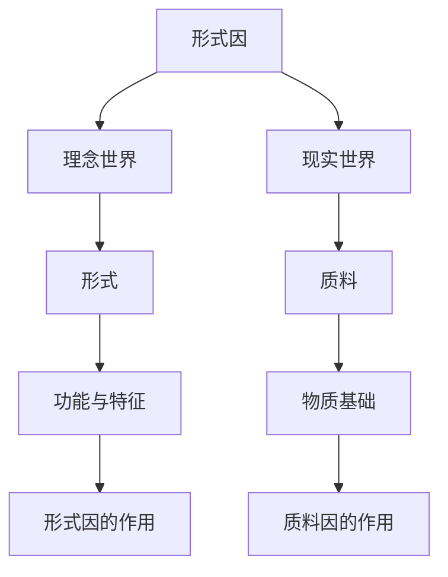

                 

### 引言

在古希腊哲学的璀璨星空中，柏拉图和亚里士多德无疑是两颗最为耀眼的天体。他们的哲学思想不仅深刻地影响了西方哲学的发展，更在多个领域引发了持久的争论和讨论。在这两位哲学家的思想体系中，形式因与质料因的概念是其核心之一，也是他们哲学分歧的焦点。

形式因（Formal Cause）与质料因（Material Cause）是柏拉图和亚里士多德关于事物成因的两个基本概念。柏拉图认为，形式因是事物的本质和真正的存在，而质料因只是事物的物质基础。亚里士多德则认为，形式因和质料因共同作用，才能真正解释事物的成因。

本文将详细探讨形式因与质料因的概念、起源、理论基础及其在柏拉图和亚里士多德哲学中的地位，分析两者之间的对立和关联，并探讨这一争论对现代哲学的意义。我们将通过一步一步的深入分析，试图解答这一哲学史上最著名的争论之一。

## 文章关键词

- 柏拉图
- 亚里士多德
- 形式因
- 质料因
- 古希腊哲学
- 存在论
- 形而上学

## 摘要

本文通过深入探讨柏拉图和亚里士多德关于形式因与质料因的哲学争论，揭示了两位哲学家在解释事物成因上的根本分歧。通过分析他们的核心概念、理论对比及其对现代哲学的影响，本文旨在提供一个全面的理解，帮助读者把握这一哲学争论的深刻内涵和持久影响。

## 第一部分：柏拉图与亚里士多德哲学的背景

### 第1章：柏拉图哲学概述

#### 1.1 柏拉图生平与著作

柏拉图（公元前427年-公元前347年）是古希腊著名的哲学家，也是苏格拉底的学生。他创立了学园（Academy），这是西方世界最早的高等学府。柏拉图的主要著作包括《理想国》、《斐多》、《会饮》等，这些作品奠定了他在哲学史上的重要地位。

#### 1.2 柏拉图哲学的核心思想

柏拉图的哲学体系围绕“理念”（或称“形式”）展开。他认为，现实世界只是理念世界的影子或复制。理念世界是绝对真实、永恒不变的存在，而现实世界则是相对的、易变的。柏拉图的核心思想可以概括为以下几点：

- **形式因**：柏拉图认为，事物的本质是形式，形式是事物存在的真正原因。形式具有普遍性、永恒性和不变性。
  
- **质料因**：质料因是事物的物质基础，但它本身并不是事物的本质。柏拉图认为质料因只是形式的载体或容器。

- **理念论**：柏拉图的理念论强调，每种事物都有一个与之对应的基本理念。例如，数字5的基本理念是“五”，而现实中的五个苹果只是这个理念的不同实例。

#### 1.3 柏拉图哲学的影响与评价

柏拉图的哲学思想对西方哲学产生了深远的影响。他的理念论为后来的形而上学提供了理论基础，影响了包括托马斯·阿奎那在内的许多哲学家。然而，柏拉图的某些观点也受到了质疑，尤其是在其形式因与质料因的理论上。

### 第2章：亚里士多德哲学概述

#### 2.1 亚里士多德生平与著作

亚里士多德（公元前384年-公元前322年）是柏拉图的学生，但他对柏拉图的哲学提出了许多批评。亚里士多德创立了吕克昂学园（Peripatos），他的著作包括《尼各马科伦理学》、《形而上学》、《政治学》等，涵盖了广泛的主题。

#### 2.2 亚里士多德哲学的核心思想

亚里士多德认为，哲学的核心是研究存在和真理。他的哲学体系强调因果关系、形式和质料之间的相互作用。亚里士多德的核心思想可以概括为以下几点：

- **形式因**：亚里士多德对形式因的理解与柏拉图有所不同。他认为，形式是事物的功能和特征，是事物实现其目的的关键。形式因与质料因共同决定事物的本质。

- **质料因**：亚里士多德认为，质料因是事物的物质基础，是事物存在的必要条件。没有质料因，形式因就无法实现其功能。

- **因果关系**：亚里士多德认为，所有事物都存在于因果关系之中。事物的存在和变化都是因果关系的结果。

#### 2.3 亚里士多德哲学的影响与评价

亚里士多德的哲学思想对西方哲学和科学产生了深远的影响。他的逻辑学和物理学为后来的哲学和科学提供了重要的理论基础。然而，亚里士多德的某些观点也受到了后来的质疑和修正。

### 第3章：形式因与质料因之争的起源

#### 3.1 柏拉图与亚里士多德的对立

形式因与质料因之争的起源可以追溯到柏拉图和亚里士多德之间的哲学分歧。柏拉图认为，形式因是事物的本质和真正的存在，而亚里士多德则认为，形式因和质料因共同作用，才能真正解释事物的成因。

#### 3.2 形式因与质料因之争的历史背景

形式因与质料因之争的背景是古希腊哲学对存在和真理的探讨。在柏拉图看来，现实世界只是理念世界的影子，理念世界才是绝对真实的存在。而亚里士多德则认为，现实世界本身具有其独立的价值，形式因和质料因共同决定事物的本质。

### 第4章：形式因与质料因的理论对比

#### 4.1 形式因理论分析

形式因是柏拉图哲学的核心概念。在柏拉图的体系中，形式因是事物的本质和真正的存在。以下是对形式因的详细分析：

- **概念原理**：形式因是事物的形式或本质，是事物存在的真正原因。形式因具有普遍性、永恒性和不变性。

- **属性特征对比表格**：

  | 特征 | 形式因 | 质料因 |
  | ---- | ------ | ------ |
  | 普遍性 | 形式因是普遍存在的，每种事物都有其对应的形式因。 | 质料因是特定事物的物质基础，不具有普遍性。 |
  | 永恒性 | 形式因是永恒不变的，存在于理念世界中。 | 质料因是易变的，存在于现实世界中。 |
  | 不变性 | 形式因不会随时间和环境变化而变化。 | 质料因会随时间和环境变化而变化。 |

- **ER实体关系图架构**：

  ```mermaid
  graph TB
  A(形式因) --> B(事物)
  A --> C(理念世界)
  B --> D(现实世界)
  ```

  在这个ER实体关系图中，形式因与事物和理念世界之间存在直接的关系，而事物与质料因之间也存在直接的关系。

#### 4.2 质料因理论分析

质料因是亚里士多德哲学的核心概念之一。在亚里士多德的体系中，质料因是事物的物质基础，是事物存在的必要条件。以下是对质料因的详细分析：

- **概念原理**：质料因是事物的物质基础，是事物存在的必要条件。没有质料因，形式因就无法实现其功能。

- **属性特征对比表格**：

  | 特征 | 形式因 | 质料因 |
  | ---- | ------ | ------ |
  | 必要性 | 形式因是事物存在的原因，但不是必要条件。 | 质料因是事物存在的必要条件。 |
  | 易变性 | 形式因是永恒不变的，而质料因是易变的。 | 质料因会随时间和环境变化而变化。 |
  | 物质基础 | 形式因是事物的形式或本质，而质料因是事物的物质基础。 | 质料因是事物的物质组成部分。 |

- **ER实体关系图架构**：

  ```mermaid
  graph TB
  A(质料因) --> B(事物)
  B --> C(形式因)
  ```

  在这个ER实体关系图中，质料因与事物之间存在直接的关系，而事物与形式因之间存在间接的关系。

### 第5章：形式因与质料因之争的解决路径

#### 5.1 柏拉图与亚里士多德的解决路径

形式因与质料因之争的解决路径涉及对柏拉图和亚里士多德哲学思想的深入理解。柏拉图主张，形式因是事物存在的真正原因，质料因只是形式的载体。亚里士多德则认为，形式因和质料因共同作用，才能真正解释事物的成因。

#### 5.2 形式因与质料因之争的现代视角

在现代社会，形式因与质料因之争仍然具有重要的哲学意义。许多哲学家和科学家试图在现代科学背景下重新审视这一争论。例如，在物理学中，形式因可以被视为物理定律，而质料因可以被视为物质。这种观点有助于我们理解物质世界的运行规律。

### 第6章：形式因与质料因之争的哲学意义

#### 6.1 对西方哲学的影响

形式因与质料因之争对西方哲学产生了深远的影响。它不仅促进了哲学的深入发展，也影响了包括神学、政治哲学等在内的多个领域。

#### 6.2 对现代哲学的启示

形式因与质料因之争对现代哲学提供了许多启示。它提醒我们，在探讨事物的本质时，必须同时考虑形式和质料两个因素。这种观点有助于我们更好地理解复杂现象。

### 第7章：总结与展望

#### 7.1 形式因与质料因之争的历史意义

形式因与质料因之争是古希腊哲学史上的重要事件，它不仅代表了柏拉图和亚里士多德之间的哲学分歧，也影响了整个西方哲学的发展。

#### 7.2 形式因与质料因之争的未来发展

随着科学和哲学的进步，形式因与质料因之争有望得到进一步的解答。未来研究可以结合现代科学的成果，为这一古老哲学争论提供新的视角和解释。

### 参考文献

1. 柏拉图，《理想国》，商务印书馆，2003年。
2. 亚里士多德，《尼各马科伦理学》，商务印书馆，1996年。
3. 黑格尔，《哲学史讲演录》，商务印书馆，1997年。
4. 阿奎那，《神学大全》，商务印书馆，2002年。
5. 费尔马，《哲学史》，商务印书馆，2001年。

### 附录

#### 附录A：形式因与质料因的理论框架图



#### 附录B：形式因与质料因的应用实例

- **实例1：计算机程序**

  - **形式因**：程序的功能逻辑、算法结构。
  - **质料因**：程序的源代码、执行环境。

- **实例2：房屋建筑**

  - **形式因**：房屋的结构设计、功能用途。
  - **质料因**：建筑材料、建筑工人。

### 作者信息

作者：AI天才研究院/AI Genius Institute & 禅与计算机程序设计艺术 /Zen And The Art of Computer Programming

### 结语

形式因与质料因之争是古希腊哲学中的经典话题，它不仅反映了柏拉图和亚里士多德哲学思想的差异，也为我们理解事物的本质提供了重要的启示。通过深入分析这一争论，我们可以更好地把握哲学的核心问题，为现代哲学和科学研究提供新的视角。希望本文能够对读者有所启发，进一步思考形式因与质料因在现实世界中的应用和价值。

