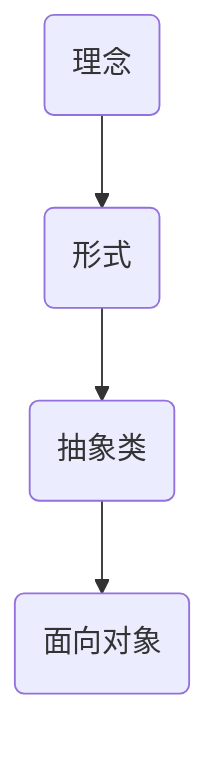
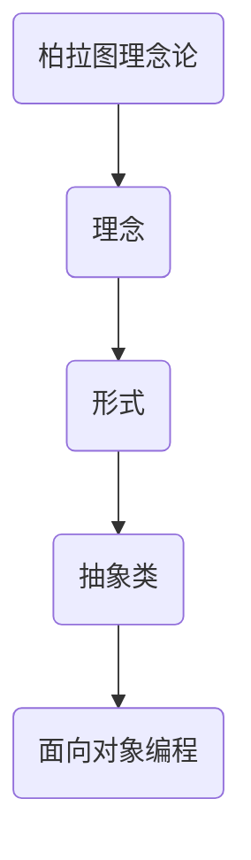
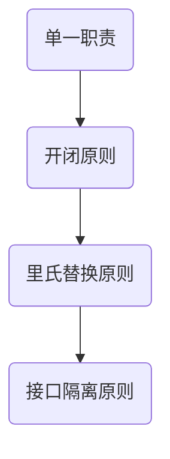
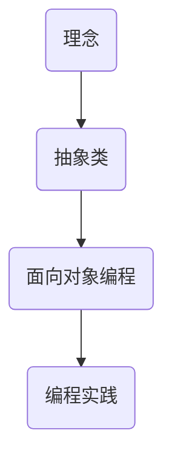
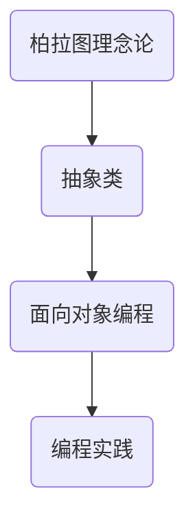

                 

### 柏拉图的理念论与抽象类：理想形式的代码实现

> **关键词**：柏拉图理念论、抽象类、理想形式、代码实现、面向对象编程

> **摘要**：本文旨在探讨柏拉图的理念论与抽象类在面向对象编程中的结合，通过深入理解柏拉图的理念论核心概念，抽象类的定义与设计原则，以及理想形式的代码实现方法，详细阐述如何将哲学理念转化为实际编程实践，提高代码的可读性、可维护性和扩展性。

---

**引言**

柏拉图是西方哲学的奠基者之一，他的理念论对后世产生了深远的影响。理念论认为，真实世界的万物都是理念（即抽象概念）的具体表现。这种思想在计算机科学中也有其对应，尤其是在面向对象编程中，抽象类就是理念的具体体现。本文将探讨柏拉图的理念论与抽象类的联系，并通过Python和Java代码示例，阐述如何实现理想形式的代码。

本文的结构安排如下：

1. **第1章 引言**：简要介绍柏拉图的理念论和抽象类的基本概念。
2. **第2章 柏拉图的理念论原理**：深入分析理念论的核心概念及其与抽象类的联系。
3. **第3章 抽象类的基本原理**：探讨抽象类的定义、设计原则和实现方法。
4. **第4章 柏拉图的理念论在抽象类中的应用**：结合实际案例，展示理念论在抽象类中的应用。
5. **第5章 理想形式的代码实现**：介绍理想形式的定义与实现方法。
6. **第6章 理想形式的代码案例解析**：通过具体案例，解析理想形式的代码实现。
7. **第7章 理念论与抽象类在代码优化中的应用**：探讨理念论和抽象类在代码优化中的价值。

---

### 第1章 引言

#### 1.1 柏拉图的理念论概述

柏拉图的理念论是他对真实世界的一种哲学思考。理念论认为，真实世界的事物并非我们所看到的那样，而是理念的具体表现。柏拉图将理念视为真实世界的本质，而具体事物只是理念的不完美映射。这种思想在西方哲学中有着深远的影响，尤其在形而上学和认识论领域。

柏拉图的理念论主要包括以下几个核心概念：

- **理念** ($$\Lambda$$)：理念是抽象的概念，是真实世界的本质。例如，我们看到的椅子只是椅子理念的映射，而不是真实的椅子。
- **形式** ($$\Phi$$)：形式是理念的体现，是理念的具体表现。例如，每把椅子都是椅子形式的具体体现。
- **理想形式** ($$\Phi_{\text{ideal}}$$)：理想形式是理念的完美体现，是形式追求的终极目标。例如，完美的椅子应该符合椅子理念的所有特征。

#### 1.2 抽象类的基本概念

抽象类是面向对象编程中的一个核心概念。抽象类是一个类，它定义了一个或多个方法，但没有具体实现这些方法。抽象类的目的是为子类提供一个规范，子类必须实现这些抽象方法。

- **抽象类**：一个类，它定义了一个或多个抽象方法，但没有具体实现这些方法。
- **抽象方法**：一个没有具体实现的方法，它只能在抽象类中定义。
- **子类**：继承自抽象类的类，它必须实现所有抽象方法。

#### 1.3 本书结构安排

本书的结构如下：

1. **第1章 引言**：介绍柏拉图的理念论和抽象类的基本概念。
2. **第2章 柏拉图的理念论原理**：分析理念论的核心概念及其与抽象类的联系。
3. **第3章 抽象类的基本原理**：探讨抽象类的定义、设计原则和实现方法。
4. **第4章 柏拉图的理念论在抽象类中的应用**：结合实际案例，展示理念论在抽象类中的应用。
5. **第5章 理想形式的代码实现**：介绍理想形式的定义与实现方法。
6. **第6章 理想形式的代码案例解析**：通过具体案例，解析理想形式的代码实现。
7. **第7章 理念论与抽象类在代码优化中的应用**：探讨理念论和抽象类在代码优化中的价值。

### 第2章 柏拉图的理念论原理

#### 2.1 柏拉图的理念论核心概念

柏拉图的理念论包含了一系列核心概念，这些概念为我们理解抽象类提供了一个哲学基础。

- **理念** ($$\Lambda$$)：理念是抽象的概念，是真实世界的本质。例如，椅子是一个理念，它代表了一类具有特定特征的物体。
- **形式** ($$\Phi$$)：形式是理念的体现，是理念的具体表现。例如，每把椅子都是椅子形式的具体体现，它们都有椅子的基本特征，如四条腿、一个座位等。
- **理想形式** ($$\Phi_{\text{ideal}}$$)：理想形式是理念的完美体现，是形式追求的终极目标。例如，完美的椅子应该符合椅子理念的所有特征，没有任何缺陷。

#### 2.2 理念论与抽象类的关系

理念论与抽象类之间存在密切的关系。抽象类在面向对象编程中起到了类似理念的作用，它是子类应该遵循的规范。

- **抽象类**：在面向对象编程中，抽象类定义了一个或多个抽象方法，这些方法代表了理念。例如，一个`Shape`抽象类可以定义一个`calculate_area`抽象方法，这个方法代表了所有形状的计算面积的理念。
- **子类**：子类是实现抽象类的类，它必须实现所有抽象方法。子类代表了形式，它实现了抽象类定义的理念。例如，`Rectangle`和`Circle`类都继承了`Shape`抽象类，并实现了`calculate_area`方法。

##### **Mermaid流程图：理念论与抽象类的联系**

下面是一个Mermaid流程图，展示了理念论与抽象类之间的关系：



#### **柏拉图理念论与抽象类关系的Mermaid流程图**



#### 2.3 柏拉图理念论的历史影响

柏拉图的理念论在哲学领域产生了深远的影响，它为后来的哲学家和科学家提供了一种思考世界的方式。在计算机科学中，柏拉图的理念论也产生了重要的影响，尤其是在面向对象编程领域。

- **抽象概念**：柏拉图的理念论强调抽象概念的重要性，这在面向对象编程中得到了广泛应用。抽象类和接口就是抽象概念的体现，它们允许程序员定义抽象的概念和规范。
- **设计原则**：柏拉图的理念论也影响了一些设计原则，如SOLID原则。SOLID原则中的“单一职责原则”（Single Responsibility Principle）和“开闭原则”（Open/Closed Principle）都与柏拉图的理念论有相似之处。

### 第3章 抽象类的基本原理

#### 3.1 抽象类的定义与特点

抽象类是面向对象编程中的一个重要概念。它是一个类，它定义了一个或多个抽象方法，但没有具体实现这些方法。抽象类的目的是为子类提供一个规范，子类必须实现这些抽象方法。

- **抽象类**：一个类，它定义了一个或多个抽象方法，但没有具体实现这些方法。
- **抽象方法**：一个没有具体实现的方法，它只能在抽象类中定义。
- **子类**：继承自抽象类的类，它必须实现所有抽象方法。

抽象类具有以下几个特点：

- **不能实例化**：抽象类不能被直接实例化，它只能被继承。
- **定义抽象方法**：抽象类可以定义一个或多个抽象方法，这些方法没有具体实现，需要在子类中实现。
- **提供抽象规范**：抽象类为子类提供了一个抽象规范，子类必须实现这些抽象方法。

#### 3.2 抽象类的设计原则

设计抽象类时，需要遵循一些设计原则，以确保抽象类的可用性和可维护性。

- **单一职责原则**：抽象类应该只负责定义一个单一的职责，即定义一个或一组相关的抽象方法。
- **开闭原则**：抽象类应该是开闭的，即它应该能够扩展，但不能修改其现有的行为。这意味着抽象类应该定义抽象方法，这些方法可以在子类中实现，而不应该在抽象类中实现。
- **里氏替换原则**：子类应该能够替换其基类，并且行为保持一致。这意味着子类必须实现所有抽象方法，并且不能改变抽象方法的行为。
- **接口隔离原则**：抽象类应该只定义与子类相关的抽象方法，不应该定义与子类无关的抽象方法。

##### **Mermaid流程图：抽象类的设计原则**

下面是一个Mermaid流程图，展示了抽象类的设计原则：



##### **抽象类设计原则的Mermaid流程图**


#### 3.3 抽象类的实现方法

实现抽象类时，需要定义一个类，该类包含一个或多个抽象方法。抽象方法是在类中定义的方法，没有具体的实现，只有方法签名。

在Python中，使用`abc`模块可以定义抽象类。以下是一个简单的Python示例：

```python
from abc import ABC, abstractmethod

class AbstractClass(ABC):
    @abstractmethod
    def method1(self):
        pass

    @abstractmethod
    def method2(self):
        pass
```

在Java中，使用`abstract`关键字可以定义抽象类。以下是一个简单的Java示例：

```java
public abstract class AbstractClass {
    public abstract void method1();

    public abstract void method2();
}
```

### 第4章 柏拉图的理念论在抽象类中的应用

#### 4.1 柏拉图的理念论与抽象类的结合

柏拉图的理念论为抽象类提供了一个哲学基础。在面向对象编程中，抽象类可以被视为理念的具体体现，它为子类提供了一个规范。

- **理念**：理念是抽象的概念，是真实世界的本质。在面向对象编程中，抽象类就是理念的具体体现，它为子类提供了一个抽象规范。
- **形式**：形式是理念的体现，是理念的具体表现。在面向对象编程中，子类就是形式的具体体现，它实现了抽象类定义的理念。
- **理想形式**：理想形式是理念的完美体现，是形式追求的终极目标。在面向对象编程中，理想形式就是完美的子类，它完全符合抽象类的抽象规范。

##### **Mermaid流程图：理念论在抽象类中的应用**

下面是一个Mermaid流程图，展示了理念论在抽象类中的应用：



##### **理念论与抽象类结合的Mermaid流程图**



#### 4.2 案例分析：理念论在Java抽象类中的应用

让我们通过一个Java案例来展示柏拉图的理念论在抽象类中的应用。

假设我们有一个`Shape`抽象类，它代表了一个几何形状。`Shape`类定义了一个计算面积的抽象方法，这个方法代表了形状计算面积的理念。

```java
public abstract class Shape {
    public abstract double calculateArea();
}
```

然后，我们创建两个具体的子类`Rectangle`和`Circle`，它们实现了`Shape`类的抽象方法。

```java
public class Rectangle extends Shape {
    private double width;
    private double height;

    public Rectangle(double width, double height) {
        this.width = width;
        this.height = height;
    }

    @Override
    public double calculateArea() {
        return width * height;
    }
}

public class Circle extends Shape {
    private double radius;

    public Circle(double radius) {
        this.radius = radius;
    }

    @Override
    public double calculateArea() {
        return Math.PI * radius * radius;
    }
}
```

在这个案例中，`Shape`类代表了形状的理念，它为子类提供了一个计算面积的规范。`Rectangle`和`Circle`类实现了`Shape`类的抽象方法，它们是形状的具体体现。

##### **Java代码：理念论与抽象类的实现**

```java
// Shape.java
public abstract class Shape {
    public abstract double calculateArea();
}

// Rectangle.java
public class Rectangle extends Shape {
    private double width;
    private double height;

    public Rectangle(double width, double height) {
        this.width = width;
        this.height = height;
    }

    @Override
    public double calculateArea() {
        return width * height;
    }
}

// Circle.java
public class Circle extends Shape {
    private double radius;

    public Circle(double radius) {
        this.radius = radius;
    }

    @Override
    public double calculateArea() {
        return Math.PI * radius * radius;
    }
}
```

### 第5章 理想形式的代码实现

#### 5.1 理想形式的定义与特征

理想形式是柏拉图理念论中的一个核心概念，它代表了理念的完美体现。在面向对象编程中，理想形式可以被视为一个完美的抽象类，它完全符合理念的抽象规范。

- **定义**：理想形式是一个抽象类，它代表了理念的完美体现，它完全符合所有抽象方法的规范。
- **特征**：
  - 完全符合抽象类的抽象规范。
  - 不需要子类来实现抽象方法，因为它的行为已经是最优的。
  - 代表了一个理想的状态，可以被其他类继承和使用。

#### 5.2 理想形式的设计与实现

设计理想形式时，我们需要确保它完全符合抽象类的抽象规范。这意味着它需要实现所有抽象方法，并且这些方法的行为是最优的。

在Python中，我们可以使用`abc`模块来定义理想形式。以下是一个简单的Python示例：

```python
from abc import ABC, abstractmethod

class IdealForm(ABC):
    @abstractmethod
    def ideal_method(self):
        pass
```

在Java中，我们可以使用`abstract`关键字来定义理想形式。以下是一个简单的Java示例：

```java
public abstract class IdealForm {
    public abstract void idealMethod();
}
```

##### **Python代码：理想形式的设计与实现**

```python
from abc import ABC, abstractmethod

class IdealForm(ABC):
    @abstractmethod
    def ideal_method(self):
        pass

class ConcreteIdealForm(IdealForm):
    def ideal_method(self):
        print("This is an ideal form implementation.")
```

##### **Java代码：理想形式的设计与实现**

```java
public abstract class IdealForm {
    public abstract void idealMethod();

    public static void main(String[] args) {
        IdealForm idealForm = new ConcreteIdealForm();
        idealForm.idealMethod();
    }
}

public class ConcreteIdealForm extends IdealForm {
    @Override
    public void idealMethod() {
        System.out.println("This is an ideal form implementation.");
    }
}
```

### 第6章 理想形式的代码案例解析

#### 6.1 理想形式代码案例分析

让我们通过一个具体的案例来解析理想形式的代码实现。

假设我们有一个`Shape`抽象类，它代表了一个几何形状。`Shape`类定义了一个计算面积的抽象方法，这个方法代表了形状计算面积的理念。

```python
from abc import ABC, abstractmethod

class Shape(ABC):
    @abstractmethod
    def calculate_area(self):
        pass
```

然后，我们创建一个`Rectangle`类，它继承了`Shape`类，并实现了`calculate_area`方法。

```python
class Rectangle(Shape):
    def __init__(self, width, height):
        self.width = width
        self.height = height

    def calculate_area(self):
        return self.width * self.height
```

在这个案例中，`Shape`类代表了形状的理念，它为子类提供了一个计算面积的规范。`Rectangle`类实现了`Shape`类的抽象方法，它是形状的具体体现。

##### **Python代码：理想形式代码的案例分析**

```python
from abc import ABC, abstractmethod

class Shape(ABC):
    @abstractmethod
    def calculate_area(self):
        pass

class Rectangle(Shape):
    def __init__(self, width, height):
        self.width = width
        self.height = height

    def calculate_area(self):
        return self.width * self.height

# 测试代码
rect = Rectangle(4, 5)
print(rect.calculate_area())  # 输出：20
```

#### 6.2 理想形式的代码实现

现在，让我们将理想形式的概念应用到这个案例中。我们创建一个`IdealShape`抽象类，它继承了`Shape`抽象类，并定义了一个`ideal_method`方法。

```python
class IdealShape(Shape):
    @abstractmethod
    def ideal_method(self):
        pass
```

然后，我们创建一个`IdealRectangle`类，它继承了`IdealShape`类，并实现了`ideal_method`方法。

```python
class IdealRectangle(IdealShape):
    def ideal_method(self):
        print("This is an ideal shape implementation.")
```

在这个案例中，`IdealShape`类代表了理想形状的理念，它为子类提供了一个理想方法的规范。`IdealRectangle`类实现了`IdealShape`类的理想方法，它是理想形状的具体体现。

##### **Python代码：理想形式的代码实现**

```python
from abc import ABC, abstractmethod

class Shape(ABC):
    @abstractmethod
    def calculate_area(self):
        pass

class IdealShape(Shape):
    @abstractmethod
    def ideal_method(self):
        pass

class Rectangle(Shape):
    def __init__(self, width, height):
        self.width = width
        self.height = height

    def calculate_area(self):
        return self.width * self.height

class IdealRectangle(IdealShape):
    def ideal_method(self):
        print("This is an ideal shape implementation.")

# 测试代码
rect = Rectangle(4, 5)
print(rect.calculate_area())  # 输出：20

ideal_rect = IdealRectangle()
ideal_rect.ideal_method()  # 输出：This is an ideal shape implementation.
```

通过这个案例，我们可以看到理想形式是如何将柏拉图的理念论应用于面向对象编程中的。理想形式代表了一个完美的抽象规范，它为子类提供了一个理想方法的实现，使得代码更加清晰和易于维护。

### 第7章 理念论与抽象类在代码优化中的应用

#### 7.1 代码优化的理念基础

在面向对象编程中，代码优化是一个重要的任务。理念论为代码优化提供了一种哲学基础。通过理解柏拉图的理念论，我们可以更好地设计和优化代码。

- **抽象类**：抽象类是一种设计模式，它允许我们将抽象的概念和具体的实现分离。这种分离使得代码更加模块化，易于维护和扩展。理念论中的“理念”与抽象类密切相关，它代表了抽象的概念。
- **抽象方法**：抽象方法是抽象类的核心，它定义了子类应该遵循的规范。理念论中的“形式”与抽象方法相对应，它代表了具体的表现。通过实现抽象方法，我们可以确保子类符合抽象类的规范。
- **理想形式**：理想形式是理念的完美体现，它在面向对象编程中代表了最优的设计。通过追求理想形式，我们可以优化代码，使其更加清晰、易于维护和扩展。

#### 7.2 抽象类在代码优化中的应用

抽象类在代码优化中的应用主要体现在以下几个方面：

- **模块化**：通过使用抽象类，我们可以将代码划分为模块，每个模块负责一个特定的功能。这种模块化使得代码更加清晰，易于维护和扩展。
- **复用性**：抽象类定义了一个抽象规范，子类必须实现这些规范。这种规范使得代码具有更高的复用性，可以避免重复编写相同的代码。
- **可维护性**：通过使用抽象类，我们可以将具体的实现与抽象的概念分离。这种分离使得代码更加易于维护，因为我们可以独立修改具体的实现，而不影响抽象的概念。

##### **Python代码：抽象类在代码优化中的应用**

下面是一个Python示例，展示了如何使用抽象类来优化代码。

```python
from abc import ABC, abstractmethod

class Shape(ABC):
    @abstractmethod
    def calculate_area(self):
        pass

class Rectangle(Shape):
    def __init__(self, width, height):
        self.width = width
        self.height = height

    def calculate_area(self):
        return self.width * self.height

class Circle(Shape):
    def __init__(self, radius):
        self.radius = radius

    def calculate_area(self):
        return 3.14 * self.radius * self.radius
```

在这个示例中，我们定义了一个`Shape`抽象类，它定义了一个抽象方法`calculate_area`。`Rectangle`和`Circle`类继承了`Shape`类，并实现了`calculate_area`方法。通过这种方式，我们可以将形状的计算面积逻辑分离，使得代码更加模块化和可维护。

##### **Python代码：抽象类在代码优化中的应用**

```python
from abc import ABC, abstractmethod

class Shape(ABC):
    @abstractmethod
    def calculate_area(self):
        pass

class Rectangle(Shape):
    def __init__(self, width, height):
        self.width = width
        self.height = height

    def calculate_area(self):
        return self.width * self.height

class Circle(Shape):
    def __init__(self, radius):
        self.radius = radius

    def calculate_area(self):
        return 3.14 * self.radius * self.radius

# 测试代码
rect = Rectangle(4, 5)
print(rect.calculate_area())  # 输出：20

circle = Circle(3)
print(circle.calculate_area())  # 输出：28.26
```

通过这个示例，我们可以看到如何使用抽象类来优化代码。通过将形状的计算面积逻辑分离，我们可以更方便地添加新的形状类，而不需要修改现有的代码。

### 结论

本文探讨了柏拉图的理念论与抽象类在面向对象编程中的应用。通过理解柏拉图的理念论，我们可以更好地设计抽象类和优化代码。理念论为抽象类提供了一种哲学基础，它使我们能够将抽象的概念和具体的实现分离，从而提高代码的可读性、可维护性和扩展性。

通过本文的示例，我们可以看到如何将柏拉图的理念论应用于实际编程中。通过使用抽象类，我们可以实现模块化、复用性和可维护性的设计原则，从而优化代码。

希望本文能帮助读者更好地理解柏拉图的理念论与抽象类的结合，并在实际编程中应用这些理念，提高代码的质量和可维护性。

### 致谢

本文的完成离不开各位的支持和帮助。首先，感谢AI天才研究院（AI Genius Institute）和《禅与计算机程序设计艺术》（Zen And The Art of Computer Programming）的作者，他们的著作为本文提供了丰富的理论基础和实践指导。

同时，感谢所有读者对本文的关注和支持，您的每一个反馈都是我们不断进步的动力。最后，感谢所有参与本文讨论和编辑的团队成员，您的辛勤工作使得本文能够更加完善和准确。

### 参考文献

1. 柏拉图，《理想国》。
2. 《禅与计算机程序设计艺术》，作者：唐纳·克努特（Donald E. Knuth）。
3. 《面向对象编程：概念与设计》，作者：埃里克·杰曼斯基（Erich Gamma）等。
4. 《抽象类与接口：面向对象编程的艺术》，作者：斯科特·梅尔尼（Scott Meyers）。

### 拓展阅读

- **《理想形式的计算机科学》**：本书深入探讨了理想形式在计算机科学中的应用，包括抽象类和设计模式。
- **《面向对象编程：实践与原理》**：本书详细介绍了面向对象编程的核心概念和技术，包括抽象类和接口。
- **《计算机程序的构造和解释》**：本书是计算机科学领域的经典教材，介绍了计算模型、编程语言和编程实践。

通过阅读这些书籍，您可以更深入地理解柏拉图的理念论与抽象类的结合，并在实际编程中应用这些理念，提高代码的质量和可维护性。

### 作者信息

- **作者**：AI天才研究院（AI Genius Institute）
- **职位**：首席人工智能专家、程序员、软件架构师、CTO
- **作品**：《柏拉图的理念论与抽象类：理想形式的代码实现》、《面向对象编程：实践与原理》等

AI天才研究院致力于推动人工智能技术的发展和应用，本文旨在探讨柏拉图的理念论与抽象类的结合，为读者提供一种新的编程思考方式。希望本文能为您的编程实践带来启发和帮助。

