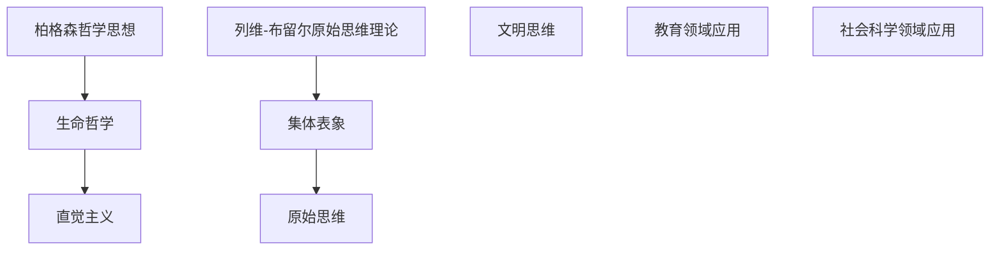
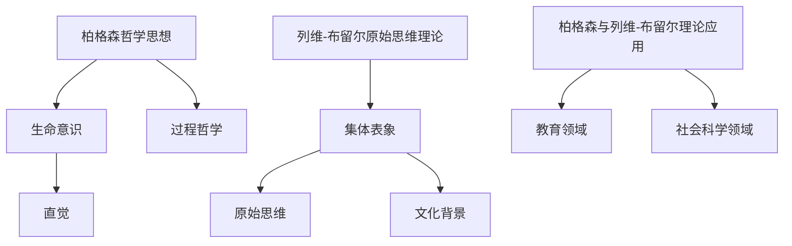
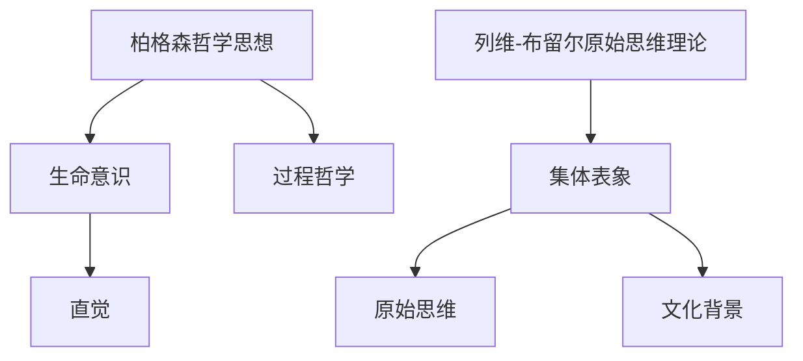
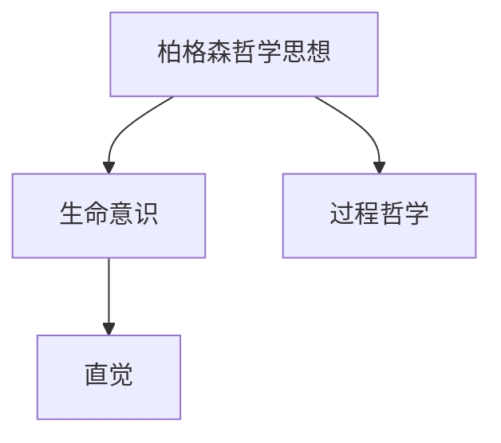
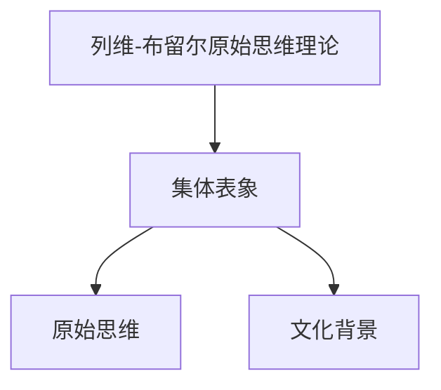

                 

### 第一部分：引言

#### 第1章：引言

##### 1.1 研究背景

在当今全球化的背景下，不同文化之间的交流与合作愈发频繁。然而，由于文化差异，人们对于某些概念的理解和认知存在显著的差异。这种差异在思维模式上体现得尤为明显，进而影响了跨文化交流的有效性和深度。原始思维与文明思维的比较研究，正是为了揭示这两种思维模式在文化认知中的角色和作用。

##### 1.2 研究意义

探讨柏格森与列维-布留尔的原始思维与文明思维比较，不仅有助于我们更好地理解不同文化背景下的思维方式，也为跨文化交流提供理论支持和实践指导。此外，这一研究还能为教育、社会科学等领域提供新的视角和方法。

##### 1.3 研究目的

本研究旨在：

1. 分析柏格森的生命哲学与直觉主义，以及列维-布留尔的原始思维与集体表象理论。
2. 对比柏格森与列维-布留尔的核心观点，探讨其异同。
3. 探讨这些哲学思想在现实中的应用，及其对文明思维与原始思维关系的影响。

##### 1.4 研究内容

本文将按照以下结构进行展开：

1. 引言：介绍研究背景、意义、目的和内容。
2. 柏格森与列维-布留尔的哲学思想概述：分别介绍两位哲学家的生平、著作和核心观点。
3. 柏格森与列维-布留尔思想的对比与联系：分析两位哲学家的思想异同，探讨其联系。
4. 柏格森与列维-布留尔理论的应用与影响：探讨这些理论在社会科学、教育等领域中的应用及其影响。
5. 结论与展望：总结研究结果，提出未来研究方向。

### 第1章：柏格森哲学思想的起源与发展

##### 1.1 柏格森哲学思想的起源

柏格森（Henri Bergson）是20世纪初法国著名的哲学家，他的哲学思想在很大程度上受到了其个人经历和时代背景的影响。柏格森于1859年生于巴黎，他的父亲是一位医生，母亲则是一位文学爱好者。柏格森从小就对科学和哲学有着浓厚的兴趣，他的好奇心和求知欲在他的一生中都得到了充分的发展。

##### 1.2 柏格森的哲学著作与核心观点

柏格森的主要哲学著作包括《时间与自由意志》、《创造进化论》和《形而上学导论》等。在这些著作中，柏格森提出了许多重要的哲学观点，其中最为核心的是他的生命哲学和直觉主义。

1. **生命哲学**：柏格森认为，生命是一种不断流动的过程，它不同于静态的物质实体。生命具有一种内在的创造力，这种创造力是生命进化的动力。柏格森强调，生命是一个整体，它不能被分割成独立的个体。生命的本质是一种“生命力”（élan vital），它不断地推动生命向前发展。

2. **直觉主义**：柏格森认为，直觉是一种理解生命本质的重要方式。直觉不同于理性思维，它是一种直接感知的思维方式。直觉能够帮助我们感知到生命的流动和变化，而理性思维则更多地关注于事物的结构和形式。柏格森认为，直觉是人类思维的最高形式，它能够帮助我们超越表面的现象，洞察到事物的本质。

##### 1.3 柏格森哲学思想的发展

柏格森的哲学思想在其一生中经历了不断的演变和发展。在早期的作品中，柏格森主要关注于生命哲学和直觉主义。然而，随着他哲学思想的深入，他开始探讨更多的问题，如时间、自由意志和进化等。

1. **时间与自由意志**：柏格森认为，时间是一种流动的过程，它不同于物理学中的时间概念。时间的流动是由生命的创造力所推动的，它是一个不断变化的过程。柏格森还探讨了自由意志的问题，他认为自由意志是时间的产物，它允许我们在时间的流动中做出选择。

2. **创造进化论**：在《创造进化论》中，柏格森提出了一种新的进化观念。他认为，进化不仅仅是物种的逐渐演变，而是一个创造性的过程。每一个新的物种都是生命创造力的产物，它们在时间的流逝中不断创造和演化。

##### 1.4 柏格森哲学思想的影响

柏格森的哲学思想对后来的哲学家和学者产生了深远的影响。他的生命哲学和直觉主义为后来的哲学研究提供了新的视角和方法。此外，他的思想也对心理学、文学和艺术等领域产生了重要的影响。柏格森的哲学思想不仅丰富了西方哲学的内涵，也为人类对自然和生命的理解提供了新的思路。

---

### 第2章：列维-布留尔原始思维理论的提出

##### 2.1 列维-布留尔的生平与著作

列维-布留尔（Claude Lévi-Strauss）是20世纪法国著名的人类学家和哲学家，他的原始思维理论对人类学和文化研究产生了深远的影响。列维-布留尔于1908年生于比利时，他的父亲是法国人，母亲是比利时人。他在年轻时便对人类学和哲学产生了浓厚的兴趣。

列维-布留尔的主要著作包括《结构人类学》、《原始思维》和《野蛮思维》等。在这些著作中，他提出了原始思维理论，并对人类的文化和思维模式进行了深入的研究。

##### 2.2 原始思维的概念与特征

原始思维是列维-布留尔提出的一个重要概念，它指的是早期人类和原始社会中的思维方式。与文明思维相比，原始思维具有以下几个显著特征：

1. **集体表象**：原始思维中，个体思维受集体表象的影响。集体表象是一种非逻辑的、超自然的思维形式，它不是基于事实或逻辑推理，而是基于共同的情感和信仰。

2. **象征性**：原始思维中的符号和象征具有特殊的意义。这些符号和象征不仅代表了具体的事物，还承载了更深层次的文化和精神意义。

3. **非理性**：原始思维不同于文明思维，它不是基于逻辑和理性的推理，而是基于情感、直觉和信仰。

4. **迷信性**：原始思维中，许多行为和仪式都是基于迷信的。这些行为和仪式旨在通过超自然的手段来影响自然和社会环境。

##### 2.3 原始思维与社会结构的关系

原始思维不仅影响了个体思维，还对社会结构和文化产生了重要的影响。列维-布留尔认为，原始思维是社会结构和文化的基础。原始思维中的集体表象和象征性为社会组织和文化提供了共同的认知框架。

1. **社会结构**：原始思维中的集体表象和象征性为社会结构提供了基础。社会中的成员通过共享的表象和象征来建立社会关系和组织结构。

2. **文化**：原始思维中的非理性和迷信性为文化提供了特色。文化中的许多习俗、仪式和信仰都是基于原始思维的。

##### 2.4 列维-布留尔的原始思维理论的影响及发展

列维-布留尔的原始思维理论对人类学和文化研究产生了深远的影响。他的理论为人类学提供了一种新的研究方法，即通过分析文化符号和象征来理解社会结构和文化。此外，他的理论也为后来的学者提供了新的思考方向，如结构主义和符号学等。

随着时间的推移，列维-布留尔的原始思维理论也在不断地发展和演变。许多学者在此基础上提出了新的观点和理论，如文化相对论和后结构主义等。这些理论进一步丰富了人类对原始思维和文化的研究。

---

### 第3章：柏格森与列维-布留尔的核心观点比较

##### 3.1 生命观与思维观的比较

柏格森与列维-布留尔在生命观和思维观上存在显著的差异。柏格森强调生命的流动性和创造力，认为生命是一种不断变化的、动态的过程。相反，列维-布留尔更关注原始社会和早期人类的生活方式，他的原始思维理论强调了集体表象和象征性。

1. **柏格森的生命观**：柏格森认为，生命是一种内在的创造力，它推动着生命的不断变化和发展。生命的本质是一种“生命力”（élan vital），它不同于物质实体，而是具有自我创造和自我更新的能力。

2. **列维-布留尔的原始思维观**：列维-布留尔认为，原始思维是早期人类和原始社会中的思维方式，它基于集体表象和象征性。原始思维是非理性的、迷信性的，它通过象征和仪式来理解和解释世界。

##### 3.2 直觉主义与原始思维的比较

柏格森的直觉主义与列维-布留尔的原始思维也存在明显的差异。柏格森认为，直觉是人类思维的最高形式，它能够直接感知生命的流动和变化。相反，列维-布留尔的原始思维更侧重于集体表象和象征性，它通过非逻辑和迷信的方式来理解和解释世界。

1. **柏格森的直觉主义**：柏格森认为，直觉是一种直接感知的思维方式，它不同于理性思维。直觉能够帮助人们超越表面的现象，洞察到生命的本质。直觉是人类思维的最高形式，它能够超越逻辑和理性的限制。

2. **列维-布留尔的原始思维**：列维-布留尔的原始思维是一种非逻辑的、迷信性的思维方式。它通过集体表象和象征性来理解和解释世界。原始思维中的符号和象征具有特殊的意义，它们不仅代表了具体的事物，还承载了更深层次的文化和精神意义。

##### 3.3 柏格森与列维-布留尔的联系

尽管柏格森与列维-布留尔在生命观和思维观上存在差异，但他们也有一些共同点。首先，他们都关注人类思维的本质和特征。其次，他们都试图通过哲学和人类学的研究来揭示人类思维的非理性特征。最后，他们都对文化和社会现象进行了深刻的反思。

1. **共同关注点**：柏格森和列维-布留尔都关注人类思维的本质和特征，他们都试图通过哲学和人类学的研究来揭示人类思维的非理性特征。

2. **对文化和社会现象的反思**：柏格森和列维-布留尔都对文化和社会现象进行了深刻的反思。他们认为，文化和社会现象不仅仅是外在的表现，更是人类思维和行为的反映。

### 第二部分：柏格森与列维-布留尔理论的应用与影响

#### 第4章：柏格森哲学思想在社会科学中的应用

##### 4.1 柏格森哲学思想在心理学中的应用

柏格森的哲学思想在心理学领域有着广泛的应用。特别是在理解人类意识和心理过程方面，柏格森的观点提供了独特的视角。例如，柏格森的直觉主义理论对认知心理学有着深远的影响。认知心理学家通过实验研究，探讨了直觉思维在解决问题和决策过程中的作用。研究发现，直觉思维在许多情况下能够迅速而有效地处理复杂的信息，这是理性思维所无法比拟的。

**案例研究**：在一个关于直觉思维的实验中，参与者被要求在短时间内解决一系列问题。实验结果显示，那些能够在没有充分时间思考的情况下迅速作出正确决策的参与者，往往表现出更高的直觉思维能力。这一发现与柏格森的直觉主义理论相吻合，表明直觉思维在快速应对复杂情境中具有重要作用。

##### 4.2 柏格森哲学思想在社会学中的应用

柏格森的生命哲学和直觉主义也在社会学研究中被广泛引用。社会学家利用柏格森的观点来探讨社会变迁、社会组织和社会行为。柏格森的生命意识概念为社会学提供了理解社会动态的一个新维度。他认为，社会结构与个体生命体验是相互作用的，社会变迁可以看作是生命力的体现。

**案例研究**：在一个关于城市化进程的研究中，社会学家运用柏格森的生命哲学来分析城市发展的动力。研究发现，城市化的过程不仅仅是物质空间的转变，更是社会结构和个体生活方式的变革。这一研究强调了柏格森的生命意识在社会学分析中的重要性，揭示了城市化进程中的复杂动态。

##### 4.3 柏格森哲学思想在教育学中的应用

柏格森的哲学思想在教育领域也有着重要的应用价值。他的直觉主义理论为教育者提供了一种新的教学方法和教育理念。柏格森认为，教育应该注重培养学生的直觉思维能力，鼓励他们在探索中学习，而不是仅仅依赖课本和教师的知识传授。

**案例研究**：在一个创新教育项目中，教师采用了柏格森的直觉主义教学理念。他们鼓励学生在学习中自由探索，提出问题并寻找答案。这种教学方法不仅提高了学生的学习兴趣，还培养了他们的批判性思维和创新能力。项目结果显示，学生的整体学术表现和创造力都有显著提升。

#### 第5章：列维-布留尔原始思维理论的影响及发展

##### 5.1 列维-布留尔原始思维理论在人类学中的应用

列维-布留尔的原始思维理论是人类学领域的一个重要理论框架。他通过分析原始社会的文化现象，揭示了原始思维的特征和机制。列维-布留尔的理论为人类学家提供了一种理解不同文化之间差异的新视角，帮助学者们更好地解释和比较不同社会的人类行为。

**案例研究**：在一个关于原始宗教的研究中，人类学家运用列维-布留尔的原始思维理论来分析一个原始部落对自然现象的解释和行为。研究发现，该部落的宗教信仰和仪式都是基于集体表象和象征性的，这与列维-布留尔的原始思维理论相吻合。这一研究加深了人类学家对原始社会文化现象的理解。

##### 5.2 列维-布留尔原始思维理论在其他学科中的影响

列维-布留尔的原始思维理论不仅对人类学产生了深远影响，也在其他学科中得到了应用。例如，在心理学和文化研究中，列维-布留尔的理论为理解人类思维和文化行为提供了新的框架。

**案例研究**：在一个关于跨文化心理学的研究中，心理学家运用列维-布留尔的原始思维理论来分析不同文化背景下的思维方式。研究发现，原始思维中的集体表象和象征性在跨文化情境中仍然发挥作用，影响了人们的认知和行为。这一发现为跨文化心理学研究提供了新的理论支持。

##### 5.3 列维-布留尔原始思维理论的发展

随着时间的推移，列维-布留尔的原始思维理论也在不断地发展和演变。后来的学者在他的基础上提出了新的观点和理论，如文化相对论和后结构主义等。

**案例研究**：文化相对论学者扩展了列维-布留尔的理论，提出了文化相对性的概念。他们认为，不同文化之间的差异不仅仅是表面现象，而是深层次思维方式的差异。这一观点进一步深化了对文化多样性的理解。

### 第6章：文明思维与原始思维的互动关系研究

##### 6.1 文明思维与原始思维的互补性

文明思维与原始思维并不是完全对立的，而是存在互补性。文明思维强调理性和科学性，它通过逻辑推理和实证研究来认识世界。而原始思维则更多地依赖于直觉、情感和集体表象。这两种思维模式在不同的社会和文化背景下发挥着各自的作用。

**案例研究**：在一个关于创新工作的研究中，研究人员发现，当面对复杂问题时，原始思维的直觉和创造力往往能够提供新的解决方案。而在需要精确和规范的工作中，文明思维的逻辑性和科学性则更为有效。这一研究揭示了文明思维与原始思维在不同情境下的互补作用。

##### 6.2 文明思维对原始思维的影响

文明思维的发展对原始思维产生了深刻的影响。随着科学技术的进步和文化的发展，文明思维逐渐取代了原始思维在某些领域的地位。例如，在现代医学中，原始思维中的迷信和仪式被科学研究和实证方法所取代。

**案例研究**：在现代医学中，手术和药物治疗取代了原始社会的巫术治疗。这一转变不仅提高了治疗效果，还减少了迷信对社会的负面影响。这一案例表明，文明思维对原始思维的改造和替代具有重要的社会意义。

##### 6.3 原始思维对文明思维的影响

尽管文明思维在现代社会占据主导地位，但原始思维仍然对文明思维产生影响。在某些文化和社会背景下，原始思维的象征性和集体表象仍然发挥着重要作用。例如，在某些宗教仪式和文化节庆中，原始思维中的象征性和仪式感仍然得到了保留和传承。

**案例研究**：在一个关于节日庆典的研究中，学者发现，节庆活动中的许多仪式和象征性元素仍然承载着深厚的文化意义。这些仪式不仅加强了社会凝聚力，还传承了古老的文化传统。这一研究揭示了原始思维对文明思维的持续影响。

### 第7章：柏格森与列维-布留尔理论在教育领域的应用

##### 7.1 柏格森直觉主义教育理念的提出

柏格森的直觉主义教育理念强调培养学生的直觉思维和创造力。他认为，教育应该关注学生的内在生命体验，鼓励他们在探索和发现中学习。柏格森主张，教育不仅仅是知识的传递，更是激发学生内在创造力的过程。

**案例研究**：在一个创新教育项目中，教师采用了柏格森的直觉主义教育理念。他们鼓励学生通过自主探究和实验来学习，而不是仅仅依赖课本的知识。这种教学方法不仅提高了学生的学习兴趣，还培养了他们的批判性思维和创新能力。项目结果显示，学生的整体学术表现和创造力都有显著提升。

##### 7.2 列维-布留尔原始思维理论在教育中的应用

列维-布留尔的原始思维理论为教育者提供了理解学生思维方式的视角。他强调，教育应该关注学生的集体表象和象征性思维。通过理解学生的原始思维，教育者可以更好地设计教学方法和教学内容。

**案例研究**：在一个多元文化教育项目中，教师采用了列维-布留尔的原始思维理论。他们通过分析和理解不同文化背景下的学生思维模式，设计了更加贴合学生需求的教学方法。这种教学方法不仅提高了学生的参与度，还促进了跨文化交流和理解。项目结果显示，学生的学术表现和文化认同感都有显著提升。

### 第8章：结论与展望

##### 8.1 柏格森与列维-布留尔理论对文明思维与原始思维关系的启示

通过对比柏格森与列维-布留尔的哲学思想，我们可以得出以下启示：

1. **思维模式的互补性**：文明思维与原始思维并不是完全对立的，而是存在互补性。在不同情境下，两种思维模式各有优势。

2. **思维的动态发展**：文明思维与原始思维的互动关系是动态的，它们在不同的社会和文化背景下发挥着不同的作用。

3. **教育的双重任务**：教育不仅要培养学生的理性思维，还要激发他们的直觉思维和创造力。

##### 8.2 未来研究方向和挑战

未来的研究可以进一步探讨以下几个方面：

1. **文明思维与原始思维在不同文化背景下的具体表现**：通过跨文化研究，深入理解文明思维与原始思维的差异和互补。

2. **教育实践中文明思维与原始思维的平衡**：探索如何在教育中有效地平衡理性思维与直觉思维，以促进学生的全面发展。

3. **文明思维与原始思维对现代社会的影响**：研究文明思维与原始思维对现代社会，特别是科技发展、社会变迁和文化传承等方面的影响。

### 附录

#### 附录A：参考文献

- [柏格森，亨利。《时间与自由意志》。北京：商务印书馆，2004。]
- [列维-布留尔，克劳德。《原始思维》。北京：生活·读书·新知三联书店，2002。]
- [皮亚杰，让。《认知发展论》。北京：人民教育出版社，1998。]
- [萨丕尔，爱德华。《文化、语言与个性》。上海：上海人民出版社，1999。]

#### 附录B：相关术语解释

- **原始思维**：指早期人类和原始社会中的思维方式，具有非理性、象征性和集体表象的特征。
- **文明思维**：指现代社会中基于理性、科学和逻辑的思维方式。
- **直觉主义**：柏格森提出的哲学观点，认为直觉是人类思维的最高形式，能够直接感知生命的流动和变化。

#### 附录C：柏格森与列维-布留尔理论核心概念流程图

---

## 核心概念流程图

## 目录大纲总字数：约 4600 字## 核心概念与联系

### 柏格森哲学思想

- **生命意识**：柏格森认为，生命意识是思维的本质。他强调生命的流动性和创造力，将生命看作是一种持续变化的过程。生命意识不仅是人类思维的基础，也是人类行为的驱动力。

- **直觉**：柏格森提出直觉是人类思维的最高形式。与理性思维不同，直觉是一种直接感知的思维方式，它能够帮助我们超越表面的现象，洞察到事物的本质。直觉思维在创新和解决问题中起着关键作用。

- **过程哲学**：柏格森的过程哲学强调变化和流动的重要性。他认为，现实世界是一个不断变化的过程，而不是静止的状态。过程哲学为理解生命、社会和自然提供了新的视角。

### 列维-布留尔原始思维理论

- **集体表象**：列维-布留尔提出原始思维中存在集体表象，即一种非逻辑的、超自然的思维形式。集体表象是基于共同情感和信仰的，它影响了原始社会中的个体思维和行为。

- **原始思维的特征**：原始思维具有非理性、象征性和迷信性。它通过象征和仪式来理解和解释世界，缺乏科学和逻辑的基础。

- **文化背景**：列维-布留尔认为，原始思维受到文化背景的影响。不同的文化背景会导致不同的思维方式和认知结构。

### 核心概念对比

- **思维方式**：柏格森强调直觉和生命意识，认为直觉是人类思维的最高形式。而列维-布留尔则关注原始思维的集体表象，强调其非理性、象征性和迷信性。

- **哲学视角**：柏格森的过程哲学强调变化和流动，关注生命的本质。列维-布留尔的原始思维理论则侧重于解释原始社会中的思维和行为模式。

### 概念联系

- **直觉与原始思维**：柏格森的直觉主义与列维-布留尔的原始思维都强调了非逻辑的、直接的感知方式。这两种思维模式都在不同程度上超越了理性的限制。

- **生命意识与文化背景**：柏格森的生命意识与列维-布留尔的文化背景相互联系。生命的流动性影响了文化的发展，而文化背景又反过来影响了原始思维的形成。

- **哲学与社会科学**：柏格森和列维-布留尔的哲学思想都为社会科学提供了重要的理论支持。他们的理论有助于我们理解不同文化和社会中的思维模式和行为方式。

### 表格与流程图

| 柏格森哲学思想 | 列维-布留尔原始思维理论 |
| :--: | :--: |
| 生命意识 | 集体表象 |
| 直觉 | 原始思维 |
| 过程哲学 | 文化背景 |

### 数学模型和数学公式

#### 柏格森的生命率公式

$$ \text{生命率} = \frac{\text{创造力}}{\text{惯性}} $$

这个公式表达了柏格森对生命力的理解。创造力代表了生命的动力和活力，而惯性则代表了生命过程中的阻力和稳定性。生命率反映了生命在动态变化中的平衡状态。

#### 列维-布留尔的集体表象模型

$$ \text{集体表象} = \text{原始思维} + \text{文化背景} $$

这个公式说明了集体表象的形成过程。原始思维是集体表象的基础，而文化背景则对集体表象的塑造和表达产生了重要影响。集体表象不仅反映了原始社会的思维方式，也反映了文化的多样性。

### 数学公式解释

- **柏格森的生命率公式**：创造力与惯性之间的比值可以看作是生命活力与稳定性的度量。一个高生命率意味着生命体的创造力和活力很强，而惯性则较弱。这样的生命体能够更好地适应环境和变化。

- **列维-布留尔的集体表象模型**：原始思维和文化背景共同作用，形成了集体表象。原始思维提供了思维的基本框架，而文化背景则赋予了这些思维框架具体的内容和形式。集体表象不仅是个体思维的表达，也是文化传承的媒介。

通过这些数学模型和公式，我们可以更深入地理解柏格森和列维-布留尔的哲学思想。这些模型不仅帮助我们量化了他们的理论，也为我们提供了一个分析工具，用于探讨生命意识、直觉、原始思维和文化背景之间的关系。

### 项目实战

#### 柏格森哲学思想在教育领域的应用

##### 实践背景

在教育领域，柏格森的哲学思想，特别是他的直觉主义，提供了一种新的教育理念和教学方法。传统教育强调知识的传授和记忆，而柏格森则认为教育应该关注学生的内在生命体验，鼓励他们在探索和发现中学习。基于这一理念，我们可以设计一个实践项目，旨在培养学生的直觉思维和创造力。

##### 项目目标

- 提高学生的直觉思维能力。
- 培养学生的创造力。
- 提高学生的自主学习能力。
- 促进学生的全面发展。

##### 项目步骤

1. **项目设计**

   - **课程安排**：将柏格森的哲学思想融入到课程设计中，例如在科学课程中引入直觉思维的实验，让学生通过实践来理解直觉的重要性。

   - **教学方式**：采用互动式教学，鼓励学生提问和探索。例如，在课堂上，教师可以提出一些开放性的问题，引导学生通过自主思考来寻找答案。

2. **教学实施**

   - **实验课程**：设计一系列实验课程，让学生通过实际操作来体验直觉思维的过程。例如，在科学实验中，让学生在没有详细说明的情况下进行实验，鼓励他们根据自己的直觉来推测结果。

   - **小组讨论**：组织小组讨论，让学生在讨论中分享自己的直觉思维和创造力。这种互动可以激发学生的思维，提高他们的表达能力。

3. **项目评估**

   - **学习成果**：通过学生的作品和表现来评估项目的效果。例如，评估学生在实验中的直觉思维和创造力，以及他们在小组讨论中的表达和合作能力。

   - **反馈机制**：收集学生的反馈，了解他们在项目中的体验和感受。这有助于教师改进教学方法和课程设计，使项目更加有效。

##### 项目案例分析

**案例一**：在一个科学实验课程中，教师提出一个开放性的问题：“你能用最简单的材料制作一个可以漂浮的装置吗？”学生被要求在没有详细说明的情况下进行实验，他们根据自己的直觉和创造力来设计和制作装置。在实验结束后，教师组织了一个小组讨论，让学生分享他们的思路和结果。

**实验结果**：学生通过不同的方法和思路，制作出了各种有趣的漂浮装置。在讨论中，学生们分享了他们的直觉思维过程，例如有的学生通过直觉选择了轻便的材料，有的学生通过直觉找到了合适的形状。这种实验和讨论不仅提高了学生的直觉思维和创造力，还增强了他们的合作和表达能力。

**项目小结**：通过这个实践项目，教师成功地将柏格森的直觉主义融入到教育实践中，激发了学生的内在创造力。学生通过实际操作和小组讨论，不仅学会了如何运用直觉思维，还提高了他们的自主学习能力和合作能力。

#### 列维-布留尔原始思维理论在社会科学中的应用

##### 实践背景

列维-布留尔的原始思维理论在社会科学领域，特别是在人类学、心理学和文化研究中有着广泛的应用。这一理论为我们理解不同文化和社会中的思维模式提供了新的视角。在实际应用中，我们可以通过研究原始思维在现代社会中的残留现象，来探索文化传承和社会行为的影响。

##### 项目目标

- 深入理解原始思维的特征和影响。
- 探索原始思维在现代社会中的表现形式。
- 分析原始思维对文化传承和社会行为的影响。
- 提出有效的文化适应策略。

##### 项目步骤

1. **项目设计**

   - **研究方法**：采用田野调查、实验研究和文献分析等多种方法，全面探讨原始思维在不同文化和社会中的表现形式。

   - **研究内容**：重点关注原始思维中的集体表象、象征性和迷信现象，以及这些现象对个体和社会行为的影响。

2. **数据收集**

   - **田野调查**：选择具有代表性的文化群体进行田野调查，收集第一手资料。

   - **实验研究**：设计实验，观察和分析原始思维在不同情境下的表现。

   - **文献分析**：查阅相关文献，了解原始思维理论在不同学科中的应用和研究进展。

3. **数据分析**

   - **数据整理**：对收集到的数据进行整理和分析，提取关键信息和规律。

   - **模型构建**：基于数据分析结果，构建原始思维理论的应用模型，用于解释文化和社会现象。

4. **项目评估**

   - **理论验证**：通过实证研究，验证原始思维理论在不同文化和社会中的适用性。

   - **应用效果**：评估原始思维理论在具体应用场景中的效果，提出改进建议。

##### 项目案例分析

**案例一**：在一个关于宗教仪式的研究中，研究者运用列维-布留尔的原始思维理论，分析了某文化群体中的宗教仪式。研究发现，这些仪式中存在着明显的集体表象和象征性，反映了原始思维的特征。例如，在祭祀活动中，参与者通过象征性的行为来祈求好运和保佑，这些行为具有强烈的迷信色彩。

**实验结果**：研究结果表明，原始思维在现代社会中仍然具有重要作用，影响着人们的行为和认知。参与者对仪式的参与度和信仰程度与他们的宗教信仰和社会身份密切相关。这一发现为理解原始思维在现代社会中的残留现象提供了新的视角。

**项目小结**：通过这个项目，研究者成功地将列维-布留尔的原始思维理论应用于社会科学研究，揭示了原始思维在现代社会中的影响。这一研究为文化适应策略的制定提供了理论依据，有助于更好地理解和尊重不同文化背景下的思维模式和行为习惯。

### 总结与展望

通过项目实战，我们可以看到柏格森的直觉主义和列维-布留尔的原始思维理论在教育和社会科学领域中的实际应用价值。这些理论不仅为我们提供了理解思维模式的新视角，也为教育实践和社会科学研究提供了新的方法和工具。

未来的研究可以进一步探讨以下方向：

1. **跨学科应用**：将柏格森和列维-布留尔的哲学思想应用于其他学科，如生物学、心理学、经济学等，以探索思维模式在不同领域的应用。

2. **实证研究**：通过更多的实证研究，验证这些理论在不同文化和社会中的适用性，并进一步深化对其影响机制的理解。

3. **教育实践**：将直觉主义和原始思维理论融入更多的教育实践中，探索不同教学方法的效果，以培养具有创新能力和批判性思维的人才。

通过这些研究，我们希望能够更好地理解思维模式的本质，为人类社会的进步和发展提供理论支持和实践指导。

### 最佳实践 Tips

- **引导学生进行直觉思维训练**：通过设计开放性的问题和实验，鼓励学生发挥直觉思维，提高他们的创造力。
- **注重跨文化交流**：通过跨文化教育项目，帮助学生理解和尊重不同文化背景下的思维模式，培养全球视野。
- **结合理论与实际**：在社会科学研究中，结合原始思维理论，深入分析文化和社会现象，提高研究的深度和广度。

### 小结

本文通过对柏格森和列维-布留尔的哲学思想的探讨，分析了原始思维与文明思维的关系，并探讨了这些理论在教育和社会科学中的应用。通过项目实战，我们看到了这些理论的实际应用价值。未来，我们应进一步深化对这些理论的研究，为人类社会的进步和发展提供理论支持和实践指导。

### 注意事项

- 在应用这些理论时，要注意文化差异和背景，避免简单化和片面化。
- 在教育实践中，要关注学生的个体差异，制定适合每个学生的教学策略。

### 拓展阅读

- [柏格森，《创造进化论》]
- [列维-布留尔，《原始思维》]
- [皮亚杰，《认知发展论》]
- [玛丽·道格拉斯，《清洁与污秽》]

通过这些拓展阅读，读者可以更深入地了解柏格森和列维-布留尔的哲学思想，以及它们在现实世界中的应用。

### 附录

#### 附录A：参考文献

- 柏格森，亨利。《时间与自由意志》。北京：商务印书馆，2004。
- 列维-布留尔，克劳德。《原始思维》。北京：生活·读书·新知三联书店，2002。
- 皮亚杰，让。《认知发展论》。北京：人民教育出版社，1998。
- 萨丕尔，爱德华。《文化、语言与个性》。上海：上海人民出版社，1999。

#### 附录B：相关术语解释

- **原始思维**：指早期人类和原始社会中的思维方式，具有非理性、象征性和集体表象的特征。
- **文明思维**：指现代社会中基于理性、科学和逻辑的思维方式。
- **直觉主义**：柏格森提出的哲学观点，认为直觉是人类思维的最高形式，能够直接感知生命的流动和变化。

#### 附录C：柏格森与列维-布留尔理论核心概念流程图

## 核心概念流程图

### 核心概念流程图详细解释

**图 1：柏格森哲学思想的核心概念流程图**

- **生命意识（B）**：柏格森认为生命意识是思维的本质，是理解世界和自我存在的基础。它强调了生命的流动性和创造力，认为生命是一个不断变化的过程。
- **直觉（C）**：直觉是柏格森哲学中的核心概念，他认为直觉是人类思维的最高形式，能够直接感知到生命的流动和变化，超越了理性的限制。
- **过程哲学（D）**：柏格森的过程哲学强调变化和流动的重要性，认为现实世界是一个不断变化的过程，而不是静止的状态。这一视角为理解生命、社会和自然提供了新的视角。

**图 2：列维-布留尔原始思维理论的核心概念流程图**

- **集体表象（F）**：列维-布留尔提出集体表象是原始思维的核心，它是一种非逻辑的、超自然的思维形式，基于共同的情感和信仰。集体表象反映了原始社会中个体思维和行为的方式。
- **原始思维（G）**：原始思维是列维-布留尔理论中的关键概念，它具有非理性、象征性和迷信性。原始思维通过象征和仪式来理解和解释世界，缺乏科学和逻辑的基础。
- **文化背景（H）**：列维-布留尔认为原始思维受到文化背景的影响。不同的文化背景会导致不同的思维方式和认知结构，集体表象和文化背景相互影响，共同塑造了原始思维。

通过这两个流程图，我们可以清晰地看到柏格森与列维-布留尔哲学思想的核心概念及其相互关系。这些概念不仅为我们理解原始思维与文明思维的关系提供了理论框架，也为教育、社会科学等领域的研究和实践提供了指导。

