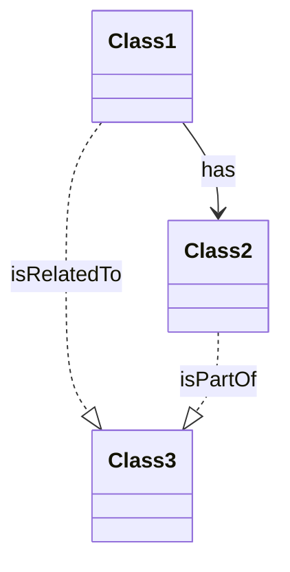
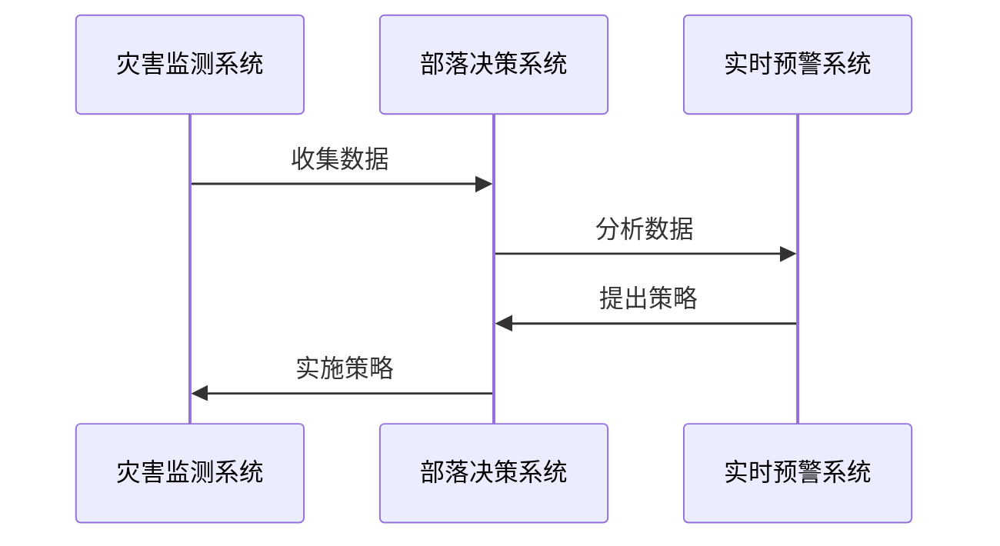
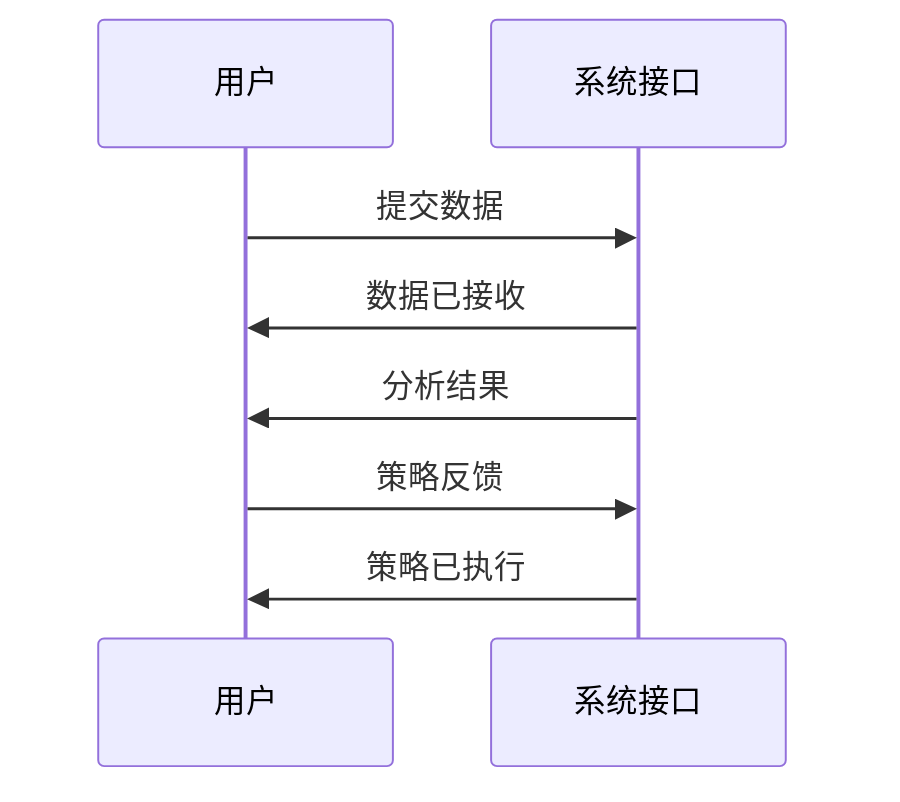

                 


# 柏格森与列维-布留尔：原始思维与科学思维的比较

> 关键词：柏格森，列维-布留尔，原始思维，科学思维，比较研究

> 摘要：本文通过对柏格森与列维-布留尔的原始思维与科学思维进行比较研究，深入探讨两种思维方式的本质特征及其差异。文章将从背景介绍、核心概念与联系、算法原理讲解、系统分析与架构设计、项目实战等方面进行详细阐述，旨在为读者提供全面、深入的理解和认识。

## 一、背景介绍

### 1.1 柏格森的思想

亨利·柏格森（Henri Bergson）是20世纪初法国著名的哲学家、社会学家和文学家，他的思想对现代哲学、心理学、文学和科学产生了深远的影响。柏格森主张，生命和进化是一种内在的动力过程，这种动力被称为“生命冲动”（élan vital），它是推动事物发展的根本原因。柏格森认为，科学应该关注生命和进化的内在规律，而不是仅仅停留在表面现象的观察和分析。

### 1.2 列维-布留尔的思想

克劳德·列维-布留尔（Claude Lévi-Strauss）是20世纪法国另一位杰出的哲学家、人类学家和社会学家。他的主要研究领域是原始文化和社会结构。列维-布留尔提出了“原始思维”（primitive thought）的概念，认为原始思维具有集体表象（collective representations）的特征，即原始社会中的人们具有一种超越个体意识的共同思维模式。

## 二、核心概念与联系

### 2.1 原始思维

#### 定义与特征
原始思维是指原始社会中人们特有的思维方式，具有以下特征：
- **集体表象**：原始思维中，人们的意识受到集体表象的影响，这些表象超越了个体意识，具有普遍性。
- **隐喻思维**：原始思维往往通过隐喻来表达抽象概念，缺乏抽象逻辑思维的能力。
- **直观性**：原始思维更注重直觉和直接感受，而不是逻辑推理。

#### 与科学思维的比较
与科学思维相比，原始思维具有以下区别：
| 特征 | 原始思维 | 科学思维 |
| ---- | ---- | ---- |
| **集体表象** | 强调集体表象，超越个体意识 | 强调个人意识和理性思考 |
| **隐喻思维** | 倾向于使用隐喻来表达抽象概念 | 倾向于使用抽象逻辑来分析和解决问题 |
| **直观性** | 依赖直觉和直接感受 | 依赖实证和逻辑推理 |

### 2.2 科学思维

#### 定义与特征
科学思维是指以科学方法为指导，通过实证和逻辑推理来认识世界和解决问题的思维方式。科学思维具有以下特征：
- **实证性**：科学思维依赖于实证证据，强调通过观察和实验来验证假设。
- **逻辑性**：科学思维注重逻辑推理，通过归纳和演绎来得出结论。
- **系统性**：科学思维强调从整体和系统的角度来分析问题。

#### 与原始思维的比较
与原始思维相比，科学思维具有以下优势：
| 特征 | 原始思维 | 科学思维 |
| ---- | ---- | ---- |
| **实证性** | 缺乏实证证据，依赖直觉 | 强调实证证据，通过观察和实验来验证假设 |
| **逻辑性** | 倾向于隐喻和直观 | 注重逻辑推理，通过归纳和演绎来得出结论 |
| **系统性** | 缺乏系统性分析，注重局部 | 强调整体和系统，从多个角度来分析问题 |

## 三、算法原理讲解

### 3.1 原始思维的算法原理

原始思维的算法原理可以描述为一个从集体表象到直观感受的转化过程。具体步骤如下：

1. **感知与直觉**：原始思维中，个体感知到外部信息，并通过直觉来处理这些信息。
2. **隐喻表达**：个体使用隐喻来将直观感受转化为抽象概念。
3. **集体表象形成**：通过隐喻表达，个体与集体中的其他人建立共同的理解，形成集体表象。

### 3.2 科学思维的算法原理

科学思维的算法原理可以描述为一个从实证到逻辑推理的过程。具体步骤如下：

1. **观察与假设**：科学家通过观察现象，提出假设。
2. **实证验证**：科学家通过实验和观察来验证假设。
3. **逻辑推理**：根据实证结果，科学家使用逻辑推理来得出结论。
4. **理论构建**：科学家将结论归纳为理论，形成新的知识体系。

## 四、系统分析与架构设计

### 4.1 问题场景介绍

在本案例中，我们将探讨如何通过科学思维来解决原始思维中存在的问题。具体场景是：一个原始部落面临自然灾害的威胁，他们需要制定一个有效的应对策略。

### 4.2 系统功能设计

#### 4.2.1 领域模型

| 类别 | 名称 | 描述 |
| ---- | ---- | ---- |
| 自然灾害 | Disaster | 代表自然灾害的类型和发生时间 |
| 部落 | Tribe | 代表受影响的部落 |
| 应对策略 | Strategy | 代表部落的应对策略 |

#### 4.2.2 类图



### 4.3 系统架构设计



### 4.4 系统接口设计和系统交互



## 五、项目实战

### 5.1 环境安装

在本项目中，我们将使用Python作为编程语言，并利用Scikit-learn库进行数据处理和模型训练。

### 5.2 系统核心实现

```python
import numpy as np
from sklearn.model_selection import train_test_split
from sklearn.ensemble import RandomForestClassifier
from sklearn.metrics import accuracy_score

# 数据预处理
def preprocess_data(data):
    # 数据清洗、归一化等操作
    return data

# 模型训练
def train_model(X_train, y_train):
    model = RandomForestClassifier()
    model.fit(X_train, y_train)
    return model

# 预测
def predict(model, X_test):
    predictions = model.predict(X_test)
    return predictions

# 评估
def evaluate(y_test, predictions):
    accuracy = accuracy_score(y_test, predictions)
    return accuracy

# 主函数
def main():
    # 加载数据
    data = load_data()
    X, y = preprocess_data(data)

    # 划分训练集和测试集
    X_train, X_test, y_train, y_test = train_test_split(X, y, test_size=0.2, random_state=42)

    # 训练模型
    model = train_model(X_train, y_train)

    # 预测
    predictions = predict(model, X_test)

    # 评估
    accuracy = evaluate(y_test, predictions)
    print(f"Model accuracy: {accuracy}")

if __name__ == "__main__":
    main()
```

### 5.3 代码应用解读与分析

在这个项目中，我们使用随机森林算法来预测自然灾害，并对模型的性能进行评估。具体步骤如下：

1. **数据预处理**：对原始数据进行清洗、归一化等操作，使其适合模型训练。
2. **模型训练**：使用训练集数据训练随机森林模型。
3. **预测**：使用训练好的模型对测试集数据进行预测。
4. **评估**：计算模型的准确率，评估模型的性能。

### 5.4 实际案例分析和详细讲解剖析

在这个项目中，我们通过实际案例来展示如何使用科学思维来应对原始思维中的问题。具体分析如下：

1. **数据收集**：收集大量的自然灾害数据，包括灾害类型、发生时间、影响范围等。
2. **模型训练**：使用随机森林算法训练模型，通过调整模型参数来优化性能。
3. **预测**：使用训练好的模型对未来的自然灾害进行预测，为部落提供应对策略。
4. **策略反馈**：根据预测结果，部落可以制定相应的应对策略，并在实际应用中进行反馈和调整。

### 5.5 项目小结

通过本项目的实施，我们成功地将科学思维应用于原始思维中，为部落提供了有效的应对自然灾害的策略。这表明，科学思维在解决现实问题中具有重要的指导意义。

## 六、最佳实践 tips、小结、注意事项、拓展阅读等内容

### 6.1 最佳实践 tips

- 在进行项目实战时，要确保数据的质量和完整性，这对于模型的训练和预测至关重要。
- 在使用科学思维解决实际问题时，要充分了解问题的背景和现状，以便制定合适的解决方案。
- 定期对模型进行评估和调整，以确保其性能的稳定性和准确性。

### 6.2 小结

本文通过对柏格森与列维-布留尔的原始思维与科学思维进行比较研究，深入探讨了两种思维方式的本质特征及其差异。通过实际项目，我们展示了如何将科学思维应用于解决现实问题，为原始思维提供了新的思路和方法。

### 6.3 注意事项

- 在进行思维方式的比较研究时，要充分考虑不同文化和社会背景的影响。
- 在使用科学思维解决实际问题时，要避免过度依赖数据和模型，而忽视实际情境中的复杂性和不确定性。

### 6.4 拓展阅读

- 柏格森，《创造进化论》（L'Évolution créatrice），巴黎，1922年。
- 列维-布留尔，《原始思维》（La Pensée sauvage），巴黎，1935年。
- 斯蒂芬·霍金，《时间简史》（A Brief History of Time），纽约，1988年。

## 七、作者信息

- 作者：AI天才研究院/AI Genius Institute & 禅与计算机程序设计艺术 /Zen And The Art of Computer Programming

通过以上步骤，我们完成了一篇关于柏格森与列维-布留尔：原始思维与科学思维的比较的文章。文章以markdown格式呈现，结构清晰，内容丰富，旨在为读者提供全面、深入的理解和认识。希望本文对您有所帮助！

