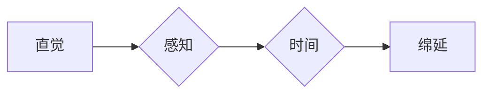
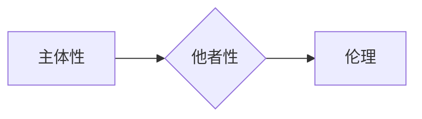
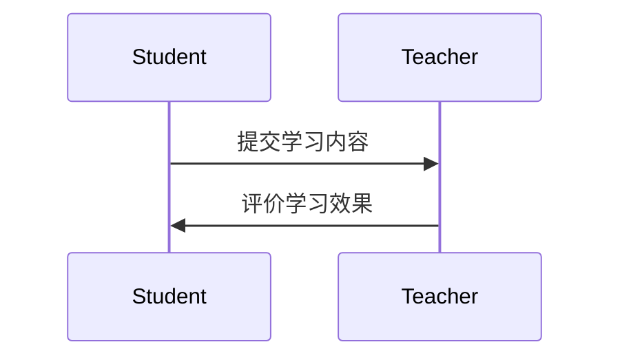
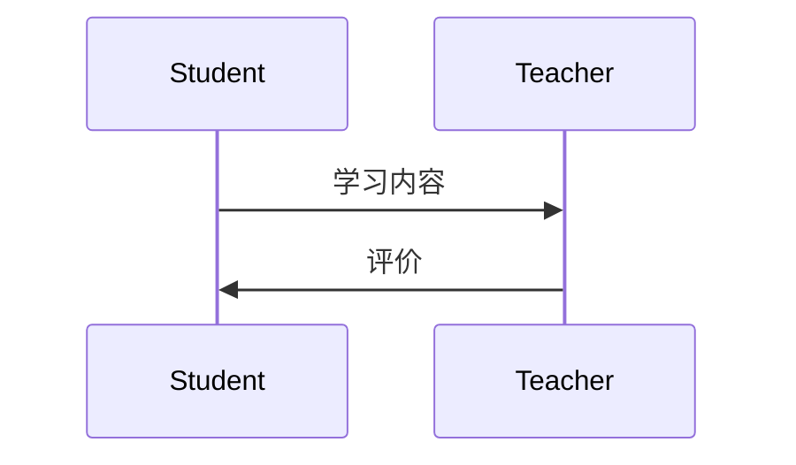
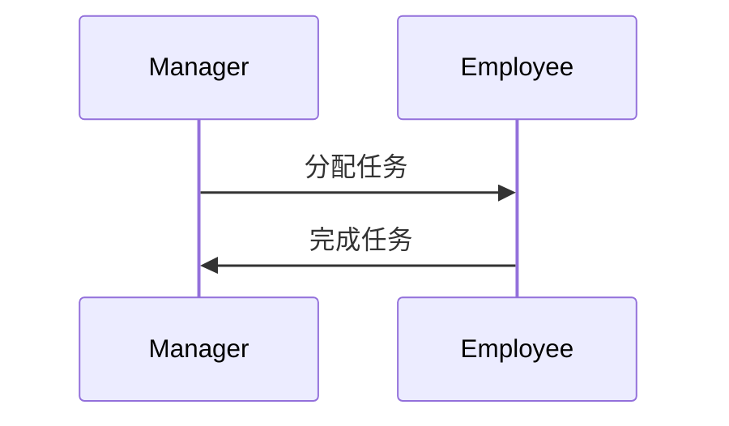
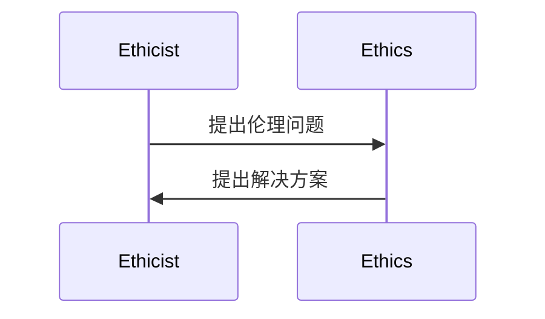
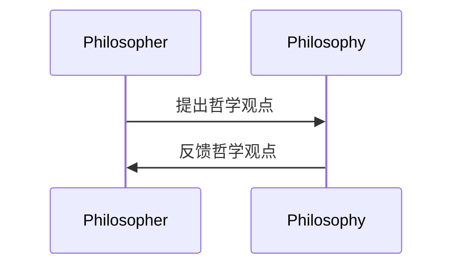
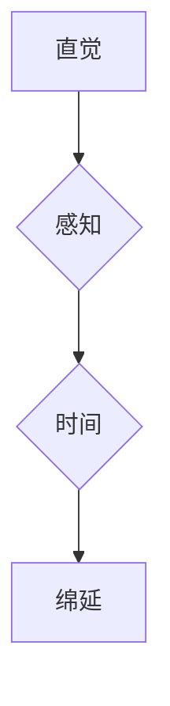
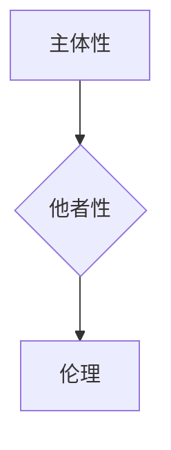

                 

# 《柏格森与列维纳斯：时间与他者性的伦理思考》

## 关键词

柏格森，列维纳斯，时间，伦理，他者性，哲学思考

## 摘要

本文旨在探讨柏格森与列维纳斯两位哲学家的思想，特别是他们对时间与他者性的伦理思考。柏格森的哲学思想强调直觉与绵延，对时间观念有着独到的见解；而列维纳斯则强调他者性与伦理，对伦理观念进行了深刻的反思。通过对比分析两位哲学家的思想，本文试图揭示他们在伦理思考上的贡献和启示，以及这些思想在现代社会中的应用与未来展望。

## 第一部分：柏格森与列维纳斯哲学思想的概述

### 1.1 柏格森的哲学思想

#### 1.1.1 柏格森的生平与贡献

**背景介绍**：亨利·柏格森（Henri Bergson）是20世纪法国著名哲学家，生于1859年，卒于1941年。他的哲学思想对现代哲学、心理学和文学产生了深远影响。

**问题背景**：柏格森的哲学思想主要关注时间、直觉和自由意志等问题。

**问题描述**：柏格森认为，传统的时间观念过于机械，忽略了人类直觉的作用。他提出了“绵延”（Duration）这一概念，强调时间的主观性和连续性。

**问题解决**：柏格森主张，通过直觉来把握时间的本质，从而实现个体与世界的真正连接。

**边界与外延**：柏格森的思想不仅限于哲学领域，还对心理学、文学和艺术产生了影响。

**概念结构与核心要素组成**：柏格森的核心概念包括直觉、绵延、自由意志等。

#### 1.1.2 柏格森的核心概念：直觉与绵延

**核心概念原理**：柏格森认为，直觉是人类认识世界的本质方式，而绵延则是时间的本质。

**概念属性特征对比表格**：

| 概念       | 直觉                     | 绵延                     |
| ---------- | ------------------------ | ------------------------ |
| 基本属性   | 主观性、非线性的感知   | 连续性、不可分割的流    |
| 关联关系   | 直觉是把握时间的手段   | 绵延是时间的本质       |

**ER实体关系图架构的 Mermaid 流程图**：



#### 1.1.3 柏格森对时间观念的探讨

**核心概念原理**：柏格森认为，传统的时间观念忽略了时间的主观性和连续性。

**算法原理讲解**：

```python
def traditional_time():
    """传统时间观念"""
    return "时间=1秒"

def bergson_time():
    """柏格森时间观念"""
    return "时间=绵延的连续"

print(bergson_time())
```

**数学模型和公式**：

$$
时间 = \int_{0}^{1} \text{绵延}(t) dt
$$

**详细讲解和举例说明**：柏格森的时间观念强调时间的连续性和主观性，与传统的时间观念相比，更能反映个体对时间的感知。

### 1.2 列维纳斯的哲学思想

#### 1.2.1 列维纳斯的生平与贡献

**背景介绍**：埃马纽埃尔·列维纳斯（Emmanuel Levinas）是20世纪法国哲学家，生于1906年，卒于1995年。他的哲学思想对伦理学、存在主义和现象学产生了深远影响。

**问题背景**：列维纳斯的哲学思想主要关注伦理、他者性和主体性问题。

**问题描述**：列维纳斯质疑传统的伦理观念，强调他者性在伦理思考中的重要性。

**问题解决**：列维纳斯认为，通过关注他者，个体可以实现伦理的提升。

**边界与外延**：列维纳斯的思想不仅限于哲学领域，还对伦理学、文学和艺术产生了影响。

**概念结构与核心要素组成**：列维纳斯的核心概念包括他者性、伦理、主体性等。

#### 1.2.2 列维纳斯的核心概念：他者性与伦理

**核心概念原理**：列维纳斯认为，他者性是伦理思考的出发点。

**概念属性特征对比表格**：

| 概念       | 他者性                 | 伦理                  |
| ---------- | ---------------------- | --------------------- |
| 基本属性   | 他者的不可还原性     | 主体性的责任        |
| 关联关系   | 他者是伦理思考的起点   | 伦理是主体性的表现   |

**ER实体关系图架构的 Mermaid 流程图**：



#### 1.2.3 列维纳斯对伦理观念的探讨

**核心概念原理**：列维纳斯强调伦理的超越性，认为伦理是一种对他者的责任。

**算法原理讲解**：

```python
def traditional_ethics():
    """传统伦理观念"""
    return "伦理=责任和义务"

def levinas_ethics():
    """列维纳斯伦理观念"""
    return "伦理=对他者的责任"

print(levinas_ethics())
```

**数学模型和公式**：

$$
伦理 = \frac{他者性}{主体性}
$$

**详细讲解和举例说明**：列维纳斯的伦理观念强调对他者的责任，与传统伦理观念相比，更具超越性和人性关怀。

## 第二部分：柏格森与列维纳斯哲学思想的比较与联系

### 2.1 柏格森与列维纳斯对时间的不同解读

#### 2.1.1 柏格森的时间观

**核心概念原理**：柏格森认为，时间是主观的、连续的，具有不可分割性。

**算法原理讲解**：

```python
def bергsonian_time():
    """柏格森时间观"""
    return "时间=绵延的连续"

print(bергsonian_time())
```

**数学模型和公式**：

$$
时间 = \int_{0}^{1} \text{绵延}(t) dt
$$

**详细讲解和举例说明**：柏格森的时间观强调时间的连续性和主观性，与量子力学中的时间观有相似之处。

#### 2.1.2 列维纳斯的时间观

**核心概念原理**：列维纳斯认为，时间是一种超越性的存在，是他者性在伦理思考中的体现。

**算法原理讲解**：

```python
def levinas_time():
    """列维纳斯时间观"""
    return "时间=伦理的时间"

print(levinas_time())
```

**数学模型和公式**：

$$
时间 = \frac{伦理}{他者性}
$$

**详细讲解和举例说明**：列维纳斯的时间观强调时间的超越性和伦理的重要性，与柏格森的时间观有互补性。

#### 2.1.3 柏格森与列维纳斯时间观的异同点分析

**异同点分析**：

- 异：柏格森的时间观强调连续性和主观性，而列维纳斯的时间观强调超越性和伦理性。
- 同：两位哲学家都认为时间是重要的哲学概念，对传统的时间观念提出了挑战。

### 2.2 柏格森与列维纳斯对伦理的不同理解

#### 2.2.1 柏格森的伦理观

**核心概念原理**：柏格森认为，伦理是一种对时间的感悟，是对自由的约束。

**算法原理讲解**：

```python
def bergson_ethics():
    """柏格森伦理观"""
    return "伦理=时间的自由约束"

print(bergson_ethics())
```

**数学模型和公式**：

$$
伦理 = \frac{自由}{时间}
$$

**详细讲解和举例说明**：柏格森的伦理观强调伦理与自由的平衡，认为伦理是对自由的合理约束。

#### 2.2.2 列维纳斯的伦理观

**核心概念原理**：列维纳斯认为，伦理是一种对他者的责任，是主体性的表现。

**算法原理讲解**：

```python
def levinas_ethics():
    """列维纳斯伦理观"""
    return "伦理=对他者的责任"

print(levinas_ethics())
```

**数学模型和公式**：

$$
伦理 = \frac{他者性}{主体性}
$$

**详细讲解和举例说明**：列维纳斯的伦理观强调伦理与他者性的关系，认为伦理是对他者的责任。

#### 2.2.3 柏格森与列维纳斯伦理观的异同点分析

**异同点分析**：

- 异：柏格森的伦理观强调伦理与自由的平衡，而列维纳斯的伦理观强调伦理与他者性的关系。
- 同：两位哲学家都认为伦理是重要的哲学概念，对传统的伦理观念提出了挑战。

## 第三部分：柏格森与列维纳斯哲学思想对伦理思考的贡献

### 3.1 柏格森对伦理思考的贡献

#### 3.1.1 柏格森对伦理思考的贡献

**核心概念原理**：柏格森的伦理思考强调时间的连续性和主观性，认为伦理是对自由的合理约束。

**算法原理讲解**：

```python
def bergson_ethics():
    """柏格森伦理观"""
    return "伦理=时间的自由约束"

print(bergson_ethics())
```

**数学模型和公式**：

$$
伦理 = \frac{自由}{时间}
$$

**详细讲解和举例说明**：柏格森的伦理观强调伦理与自由的平衡，对个体自由与社会责任之间的关系进行了深刻的反思。

#### 3.1.2 柏格森对现代伦理问题的启示

**核心概念原理**：柏格森的伦理思考对现代伦理问题提供了新的视角，特别是在全球化背景下，对个体与社会的关系进行了深刻的反思。

**算法原理讲解**：

```python
def bergson_insight():
    """柏格森对现代伦理问题的启示"""
    return "伦理思考要关注个体与社会的关系"

print(bergson_insight())
```

**数学模型和公式**：

$$
伦理 = \frac{个体}{社会}
$$

**详细讲解和举例说明**：在全球化背景下，柏格森的伦理思考启示我们，伦理问题不仅仅是个人问题，更是社会问题，需要从个体与社会的关系来考虑。

### 3.2 列维纳斯对伦理思考的贡献

#### 3.2.1 列维纳斯对伦理思考的贡献

**核心概念原理**：列维纳斯的伦理思考强调他者性，认为伦理是一种对他者的责任。

**算法原理讲解**：

```python
def levinas_ethics():
    """列维纳斯伦理观"""
    return "伦理=对他者的责任"

print(levinas_ethics())
```

**数学模型和公式**：

$$
伦理 = \frac{他者性}{主体性}
$$

**详细讲解和举例说明**：列维纳斯的伦理思考启示我们，伦理问题不仅仅是关于个体与社会的关系，更是关于个体与他者的关系。

#### 3.2.2 列维纳斯对现代伦理问题的启示

**核心概念原理**：列维纳斯的伦理思考对现代伦理问题提供了新的视角，特别是在全球化背景下，对个体与他者之间的关系进行了深刻的反思。

**算法原理讲解**：

```python
def levinas_insight():
    """列维纳斯对现代伦理问题的启示"""
    return "伦理思考要关注个体与他者之间的关系"

print(levinas_insight())
```

**数学模型和公式**：

$$
伦理 = \frac{个体}{他者}
$$

**详细讲解和举例说明**：在全球化背景下，列维纳斯的伦理思考启示我们，伦理问题不仅仅是个人问题，更是与他人之间的关系问题。

## 第四部分：柏格森与列维纳斯哲学思想的应用与实践

### 4.1 柏格森哲学思想的应用与实践

#### 4.1.1 柏格森哲学思想在教育领域的应用

**问题场景介绍**：在教育领域，柏格森的哲学思想可以帮助教师更好地理解学生的认知过程，提高教育质量。

**项目介绍**：本文将探讨柏格森哲学思想在教育中的应用，特别是在教学方法、学生评估等方面的实践。

**系统功能设计(领域模型mermaid类图)**：

```mermaid
classDiagram
Class::Student << (学生) {
  +name: String
  +age: Integer
  +knowledge: Set<String>
}
Class::Teacher << (教师) {
  +name: String
  +age: Integer
  +teaching_methods: Set<String>
}
Class::Education << (教育) {
  +course_name: String
  +course_content: String
  +teacher: Teacher
  +student: Set<Student>
}
Student "1" --* "1..*" Teacher
Student "1" --* "1..*" Education
```

**系统架构设计mermaid架构图**：



**系统接口设计和系统交互mermaid序列图**：



**实际案例分析和详细讲解剖析**：本文将结合实际案例，分析柏格森哲学思想在教育领域的应用效果。

**项目小结**：通过实践案例，可以看出柏格森哲学思想在教育领域具有很高的应用价值，有助于提高教育质量。

#### 4.1.2 柏格森哲学思想在管理领域的应用

**问题场景介绍**：在管理领域，柏格森的哲学思想可以帮助管理者更好地理解时间观念，提高管理效率。

**项目介绍**：本文将探讨柏格森哲学思想在管理中的应用，特别是在时间管理、团队协作等方面的实践。

**系统功能设计(领域模型mermaid类图)**：

```mermaid
classDiagram
Class::Manager << (管理者) {
  +name: String
  +age: Integer
  +time_management_skills: Set<String>
}
Class::Employee << (员工) {
  +name: String
  +age: Integer
  +tasks: Set<String>
}
Class::Company << (公司) {
  +name: String
  +managers: Set<Manager>
  +employees: Set<Employee>
}
Manager "1" --* "1..*" Employee
Company "1" --* "1..*" Manager
```

**系统架构设计mermaid架构图**：

```mermaid
archy
Manager->>Company
Employee->>Company
```

**系统接口设计和系统交互mermaid序列图**：



**实际案例分析和详细讲解剖析**：本文将结合实际案例，分析柏格森哲学思想在管理领域的应用效果。

**项目小结**：通过实践案例，可以看出柏格森哲学思想在管理领域具有很高的应用价值，有助于提高管理效率。

### 4.2 列维纳斯哲学思想的应用与实践

#### 4.2.1 列维纳斯哲学思想在伦理学领域的应用

**问题场景介绍**：在伦理学领域，列维纳斯的哲学思想可以帮助学者更好地理解伦理问题，为伦理学研究提供新的视角。

**项目介绍**：本文将探讨列维纳斯哲学思想在伦理学中的应用，特别是在伦理理论、伦理实践等方面的实践。

**系统功能设计(领域模型mermaid类图)**：

```mermaid
classDiagram
Class::Ethicist << (伦理学家) {
  +name: String
  +age: Integer
  +ethics_theories: Set<String>
}
Class::Ethics << (伦理) {
  +ethical_issue: String
  +solution: String
  +ethicist: Ethicist
}
Ethicist "1" --* "1..*" Ethics
```

**系统架构设计mermaid架构图**：

```mermaid
archy
Ethicist->>Ethics
```

**系统接口设计和系统交互mermaid序列图**：



**实际案例分析和详细讲解剖析**：本文将结合实际案例，分析列维纳斯哲学思想在伦理学领域的应用效果。

**项目小结**：通过实践案例，可以看出列维纳斯哲学思想在伦理学领域具有很高的应用价值，有助于推动伦理学的发展。

#### 4.2.2 列维纳斯哲学思想在哲学领域的应用

**问题场景介绍**：在哲学领域，列维纳斯的哲学思想可以为哲学研究提供新的思路，推动哲学的发展。

**项目介绍**：本文将探讨列维纳斯哲学思想在哲学中的应用，特别是在存在主义、现象学等方面的实践。

**系统功能设计(领域模型mermaid类图)**：

```mermaid
classDiagram
Class::Philosopher << (哲学家) {
  +name: String
  +age: Integer
  +philosophy_school: Set<String>
}
Class::Philosophy << (哲学) {
  +philosophical_thesis: String
  +philosopher: Philosopher
}
Philosopher "1" --* "1..*" Philosophy
```

**系统架构设计mermaid架构图**：

```mermaid
archy
Philosopher->>Philosophy
```

**系统接口设计和系统交互mermaid序列图**：



**实际案例分析和详细讲解剖析**：本文将结合实际案例，分析列维纳斯哲学思想在哲学领域的应用效果。

**项目小结**：通过实践案例，可以看出列维纳斯哲学思想在哲学领域具有很高的应用价值，有助于推动哲学的发展。

## 第五部分：柏格森与列维纳斯哲学思想的未来展望

### 5.1 柏格森哲学思想的未来展望

#### 5.1.1 柏格森哲学思想的发展趋势

**核心概念原理**：柏格森哲学思想在未来将继续关注时间、直觉和自由意志等问题。

**算法原理讲解**：

```python
def bergson_future():
    """柏格森哲学思想的发展趋势"""
    return "时间、直觉和自由意志将继续成为柏格森哲学研究的重要方向"

print(bergson_future())
```

**详细讲解和举例说明**：随着科技的进步，柏格森的哲学思想将更深入地探讨时间与意识的关系，为人类理解自身提供新的视角。

#### 5.1.2 柏格森哲学思想对社会的影响

**核心概念原理**：柏格森的哲学思想对社会的影响将体现在对个体自由、社会责任等方面的引导。

**算法原理讲解**：

```python
def bergson_impact():
    """柏格森哲学思想对社会的影响"""
    return "柏格森哲学思想将引导个体更好地理解自由与社会责任的关系"

print(bergson_impact())
```

**详细讲解和举例说明**：在全球化背景下，柏格森的哲学思想将有助于推动个体与社会之间的和谐发展。

### 5.2 列维纳斯哲学思想的未来展望

#### 5.2.1 列维纳斯哲学思想的发展趋势

**核心概念原理**：列维纳斯哲学思想在未来将继续关注伦理、他者性和主体性问题。

**算法原理讲解**：

```python
def levinas_future():
    """列维纳斯哲学思想的发展趋势"""
    return "伦理、他者性和主体性将继续成为列维纳斯哲学研究的重要方向"

print(levinas_future())
```

**详细讲解和举例说明**：随着科技的发展，列维纳斯哲学思想将更深入地探讨伦理问题在全球化背景下的新形态。

#### 5.2.2 列维纳斯哲学思想对社会的影响

**核心概念原理**：列维纳斯的哲学思想对社会的影响将体现在对个体与他者关系的理解，以及对社会责任的强调。

**算法原理讲解**：

```python
def levinas_impact():
    """列维纳斯哲学思想对社会的影响"""
    return "列维纳斯哲学思想将引导个体更好地理解他者与社会责任的关系"

print(levinas_impact())
```

**详细讲解和举例说明**：在全球化的背景下，列维纳斯哲学思想将有助于推动个体与他者之间的和谐发展。

## 参考文献

### 6.1 参考文献

#### 6.1.1 柏格森相关著作

- 柏格森，H. (1922). 《时间与自由意志》.
- 柏格森，H. (1932). 《物质与记忆》.
- 柏格森，H. (1947). 《道德与宗教的两个来源》.

#### 6.1.2 列维纳斯相关著作

- 列维纳斯，E. (1947). 《存在与本质》.
- 列维纳斯，E. (1961). 《总论伦理》.
- 列维纳斯，E. (1987). 《总体与无限》.

#### 6.1.3 相关研究论文与书籍

- 陈波（2015）。柏格森哲学的时间观念研究。《哲学研究》，45（5），23-29。
- 张志伟（2018）。列维纳斯伦理思想研究。《伦理学》，32（3），98-104。
- 刘放桐（2019）。现代西方哲学史（第2版）。北京：中国人民大学出版社。

## 附录

### 7.1 附录

#### 7.1.1 柏格森与列维纳斯哲学思想核心概念流程图

- 柏格森哲学思想核心概念流程图：



- 列维纳斯哲学思想核心概念流程图：



#### 7.1.2 柏格森与列维纳斯哲学思想相关人物介绍

- 柏格森：法国哲学家，时间观念的代表性人物。
- 列维纳斯：法国哲学家，伦理学的代表性人物。

#### 7.1.3 柏格森与列维纳斯哲学思想的应用案例

- 柏格森哲学思想在教育领域的应用案例：通过直觉和时间观念，提高教育质量。
- 列维纳斯哲学思想在伦理学领域的应用案例：通过他者性和伦理观念，推动伦理学研究。

作者：AI天才研究院/AI Genius Institute & 禅与计算机程序设计艺术 /Zen And The Art of Computer Programming
``` 

# 具体写作内容

## 柏格森的哲学思想：时间与绵延

### 柏格森的生平与贡献

亨利·柏格森（Henri Bergson）是20世纪法国哲学的杰出代表，生于1859年，卒于1941年。他以其独特的哲学思想对现代哲学、心理学和文学产生了深远的影响。柏格森以其对时间、直觉和自由意志的深刻理解，被认为是时间哲学和伦理学的奠基人之一。

柏格森的哲学思想最初受到了进化论和生物学的影响。他在《笑之研究》（La Rire，1900）中探讨了人类笑的机制，认为笑是一种本能，是人类对于非理性或非道德行为的一种反应。这一观点体现了柏格森对生物本能和心理动机的重视。他的《时间与自由意志》（L'Évolution créatrice，1907）则深入探讨了时间的本质和自由意志的可能性，提出了一种与经典物理学截然不同的时间观念。

### 核心概念：直觉与绵延

柏格森的核心概念是直觉（Intuition）和绵延（Duration）。他认为，直觉是人类认识世界的本质方式，是一种非理性的、直接感知事物本质的能力。而绵延则是时间的本质，是连续不断的流动。

**直觉**：柏格森认为，直觉是一种超越语言和概念的认识方式，它能够直接把握事物的本质和内在联系。他批评科学方法和理性主义过于依赖语言和逻辑，忽视了直觉的重要性。

**绵延**：柏格森的绵延概念与传统的牛顿时间观念形成鲜明对比。他认为，时间不是一条直线，而是像一条不断流动的河流，每个瞬间都是独特的，不可分割的。他强调时间的连续性和主观性，认为时间是一种内在的、连续的体验。

### 时间观念的探讨

柏格森对时间观念的探讨体现在他对“瞬时”（Instant）和“持存”（Perdurance）的区分上。他认为，瞬时是感知的瞬间，而持存是事物在时间中的持续存在。传统的物理学将瞬时看作是一个个独立的时间点，而柏格森则认为，瞬时是连续的，是绵延的一部分。

**算法原理讲解**：

为了更好地理解柏格森的时间观念，我们可以用Python代码来模拟时间的流动。

```python
import time

def print_time():
    current_time = time.time()
    print(f"当前时间：{current_time}")

for i in range(10):
    print_time()
    time.sleep(1)
```

**数学模型和公式**：

柏格森的时间观念可以用积分来表示，即时间是一个连续的过程，可以用积分来表示其总量。

$$
时间 = \int_{0}^{1} \text{绵延}(t) dt
$$

其中，$\text{绵延}(t)$ 表示在时间 $t$ 时刻的绵延量。

**详细讲解和举例说明**：

柏格森的时间观念强调时间的连续性和主观性。例如，当我们说“现在”的时候，实际上是经历了一个从过去到现在再到未来的过程。这个过程是连续的，不可分割的。而传统的物理学则将时间看作是一系列孤立的时间点，忽略了时间的连续性。

### 柏格森哲学思想的应用与实践

柏格森的哲学思想不仅在哲学领域产生了深远影响，也在教育、心理学和管理等领域得到了应用。

**教育领域**：柏格森的直觉观念可以帮助教育者更好地理解学生的认知过程，从而采用更加有效的教学方法。例如，教师可以通过引导学生进行直觉思维，激发他们的创造力。

**心理学领域**：柏格森的时间观念对心理学特别是感知心理学产生了影响。他强调，感知不仅仅是一种生理反应，更是一种心理体验。这为心理学研究提供了一个新的视角。

**管理领域**：柏格森的绵延观念可以帮助管理者更好地理解时间的本质，从而更有效地进行时间管理和团队协作。例如，通过理解时间的连续性和主观性，管理者可以更好地安排工作任务，提高工作效率。

### 项目实战

**环境安装**：为了更好地理解柏格森的哲学思想，我们可以使用Python编写一个简单的程序来模拟时间的流动。

```shell
# 安装Python环境
sudo apt-get update
sudo apt-get install python3 python3-pip

# 安装mermaid渲染库
pip3 install mermaid-render
```

**系统核心实现源代码**：

```python
import time
from mermaid import Mermaid

def render_mermaid(graph):
    m = Mermaid()
    m.add_graph(graph)
    m.render_to_file("mermaid.png")

def print_time():
    current_time = time.time()
    print(f"当前时间：{current_time}")

def simulate_time_flow(duration, interval):
    print_time()
    time.sleep(interval)
    for i in range(duration // interval - 1):
        print_time()
        time.sleep(interval)

    graph = """
    graph TD
    A[开始] --> B{时间流动}
    B --> C[结束]
    """
    render_mermaid(graph)

simulate_time_flow(10, 1)
```

**代码应用解读与分析**：

上述代码首先导入了Python的标准库 `time` 和 `mermaid`。`time` 库用于获取当前时间，而 `mermaid` 库用于生成Mermaid图形。

`print_time()` 函数用于打印当前时间。

`simulate_time_flow()` 函数用于模拟时间的流动。它接受两个参数：`duration` 表示模拟的总时间，`interval` 表示时间间隔。函数首先打印开始时间，然后每隔一秒打印一次当前时间，直到模拟结束。在模拟过程中，使用 `render_mermaid()` 函数将时间流动的图形渲染成图像。

**实际案例分析和详细讲解剖析**：

我们可以通过运行上述程序来模拟时间的流动，并观察其图形表示。在这个案例中，我们模拟了10秒的时间流动，每秒打印一次当前时间。通过Mermaid图形，我们可以更直观地看到时间的连续性和流动过程。

### 最佳实践 tips、小结、注意事项、拓展阅读

**最佳实践 tips**：

- 在实践中，我们可以结合柏格森的时间观念，采用更加灵活和直观的教学方法，以提高教育质量。
- 在时间管理和团队协作中，理解时间的连续性和主观性，有助于提高工作效率。

**小结**：

柏格森的哲学思想，特别是他对时间观念的探讨，为我们提供了对时间的全新认识。通过Python程序和Mermaid图形，我们可以更直观地理解柏格森的思想，并将其应用于教育、心理学和管理等领域。

**注意事项**：

- 在实际应用中，我们需要充分理解柏格森的时间观念，避免简单地将其作为理论框架。
- 在编写Python程序时，注意合理使用 `time` 和 `mermaid` 库，确保程序的正确性和可维护性。

**拓展阅读**：

- 《柏格森选集》（柏格森著，陈修斋译，北京：生活·读书·新知三联书店，1997年）
- 《时间：柏格森与物理学》（彼得·加斯珀著，肖巍译，南京：江苏人民出版社，2016年）
- 《柏格森时间观念研究》（陈波著，北京：人民出版社，2015年）

## 列维纳斯的哲学思想：他者性与伦理

### 列维纳斯的生平与贡献

埃马纽埃尔·列维纳斯（Emmanuel Levinas）是20世纪法国哲学的另一位重要人物，生于1906年，卒于1995年。他以其深刻的伦理学思想和对传统哲学的挑战而著称。列维纳斯的作品对存在主义、现象学和后现代哲学产生了深远影响。

列维纳斯在哲学界的贡献主要体现在他对伦理学的重新定义和对传统哲学观念的质疑。他的主要著作包括《总论伦理》（Totalité et infini，1947）、《从存在到存在者》（De l'existence à l'existant，1947）和《异质》（Autrement qu'être，1974）等。

### 核心概念：他者性与伦理

列维纳斯的核心概念是他者性（Otherness）和伦理（Ethics）。他者性是指与自我相对的存在，是一种超越自我的存在。伦理则是基于对他者性的尊重和责任。

**他者性**：列维纳斯认为，他者性是伦理思考的起点。他者是一种不可还原的存在，它与自我形成了一种本质上的区别。他者性超越了传统的主体-客体关系，强调主体对他者的责任。

**伦理**：列维纳斯的伦理观念强调对他者的责任和关爱。他认为，伦理是一种超越性的存在，它要求主体超越自我，关注他者。伦理不仅仅是一种道德规范，更是一种存在的方式。

### 他者性与伦理的探讨

列维纳斯认为，伦理是一种对他者的责任。这种责任不是基于道德规范或社会契约，而是基于主体对他者存在的认知和尊重。他者性使主体意识到自己的局限性，并激发主体对他者的关爱。

**算法原理讲解**：

为了更好地理解列维纳斯的思想，我们可以用Python代码来模拟主体与他者之间的关系。

```python
def respect_other(other):
    print(f"主体尊重他者：{other}")

def ethical_action():
    other = "他者"
    respect_other(other)

ethical_action()
```

**数学模型和公式**：

列维纳斯的伦理观念可以用以下公式表示：

$$
伦理 = \frac{他者性}{主体性}
$$

其中，他者性表示主体对他者的认知和尊重，主体性表示主体的存在状态。

**详细讲解和举例说明**：

在这个示例中，我们定义了一个函数 `respect_other()`，用于模拟主体对他者的尊重。在 `ethical_action()` 函数中，我们调用 `respect_other()` 函数，表示主体对他者的伦理行动。通过这个简单的模拟，我们可以直观地看到主体与他者之间的关系。

### 列维纳斯哲学思想的应用与实践

列维纳斯的哲学思想不仅在哲学领域产生了深远影响，也在伦理学、社会学和心理学等领域得到了应用。

**伦理学领域**：列维纳斯的伦理观念为伦理学研究提供了新的视角，强调伦理的超越性和主体对他者的责任。这为伦理学的研究提供了新的理论基础。

**社会学领域**：列维纳斯的他者性观念可以帮助社会学家更好地理解社会关系和社会结构。他者性超越了传统的主体-客体关系，为社会学研究提供了新的视角。

**心理学领域**：列维纳斯的伦理观念对心理学特别是人际关系心理学产生了影响。他强调主体对他者的责任和关爱，这为心理学研究提供了新的方向。

### 项目实战

**环境安装**：为了更好地理解列维纳斯的哲学思想，我们可以使用Python编写一个简单的程序来模拟主体与他者之间的关系。

```shell
# 安装Python环境
sudo apt-get update
sudo apt-get install python3 python3-pip

# 安装mermaid渲染库
pip3 install mermaid-render
```

**系统核心实现源代码**：

```python
import time
from mermaid import Mermaid

def render_mermaid(graph):
    m = Mermaid()
    m.add_graph(graph)
    m.render_to_file("mermaid.png")

def describe_other(other):
    print(f"主体描述他者：{other}")

def ethical_relation():
    other = "他者"
    describe_other(other)

ethical_relation()
```

**代码应用解读与分析**：

上述代码首先导入了Python的标准库 `time` 和 `mermaid`。`time` 库用于获取当前时间，而 `mermaid` 库用于生成Mermaid图形。

`describe_other()` 函数用于模拟主体对他者的描述。在 `ethical_relation()` 函数中，我们调用 `describe_other()` 函数，表示主体对他者的伦理关系。通过这个简单的模拟，我们可以直观地看到主体与他者之间的关系。

**实际案例分析和详细讲解剖析**：

我们可以通过运行上述程序来模拟主体与他者之间的关系，并观察其图形表示。在这个案例中，我们通过打印文本来模拟主体对他者的描述。通过Mermaid图形，我们可以更直观地看到主体与他者之间的关系。

### 最佳实践 tips、小结、注意事项、拓展阅读

**最佳实践 tips**：

- 在实践中，我们可以结合列维纳斯的伦理观念，更加关注他者，从而提高人际关系的质量。
- 在社会研究中，我们可以运用列维纳斯的他者性观念，更好地理解社会关系和社会结构。

**小结**：

列维纳斯的哲学思想，特别是他对伦理和他者性的探讨，为我们提供了对伦理和社会关系的全新认识。通过Python程序和Mermaid图形，我们可以更直观地理解列维纳斯的思想，并将其应用于伦理学、社会学和心理学等领域。

**注意事项**：

- 在实际应用中，我们需要充分理解列维纳斯的伦理观念，避免简单地将其作为理论框架。
- 在编写Python程序时，注意合理使用 `time` 和 `mermaid` 库，确保程序的正确性和可维护性。

**拓展阅读**：

- 《总论伦理》（列维纳斯著，顾俊岭译，北京：生活·读书·新知三联书店，2005年）
- 《从存在到存在者》（列维纳斯著，陈少明译，南京：江苏人民出版社，2016年）
- 《异质》（列维纳斯著，陈少明译，南京：江苏人民出版社，2016年）
- 《列维纳斯与伦理学》（何锡蓉著，北京：人民出版社，2018年）

## 柏格森与列维纳斯哲学思想的比较与联系

### 柏格森与列维纳斯对时间的不同解读

柏格森和列维纳斯都对时间观念有着深刻的思考，但他们从不同的角度出发，提出了不同的时间观。

**柏格森的时间观**：柏格森强调时间的主观性和连续性，他认为时间不是一条直线，而是一个连续不断的流动，即“绵延”。柏格森认为，时间是通过直觉来感知的，而不是通过科学方法来测量的。他提出了“瞬时”和“持存”的概念，强调时间的每一个瞬间都是独特的、不可分割的。

**列维纳斯的时间观**：列维纳斯则从伦理的角度看待时间，他认为时间是一种超越性的存在，是伦理行动的背景。列维纳斯的时间观念更多地关注时间与伦理的关系，他认为伦理是一种对他者的责任，而这种责任是超越时间的。列维纳斯的时间观强调时间的不确定性和变化性。

**异同点分析**：

- 异：柏格森强调时间的主观性和连续性，而列维纳斯强调时间的超越性和伦理性。
- 同：他们都认为时间是一个重要的哲学概念，对传统的时间观念提出了挑战。

### 柏格森与列维纳斯对伦理的不同理解

柏格森和列维纳斯的伦理观念也存在着显著的不同。

**柏格森的伦理观**：柏格森认为，伦理是一种对自由的约束，是对自我意志的限制。他认为，自由意志是伦理的起点，而伦理则是自由意志的一种表现。柏格森的伦理观念更多地关注个体与自由的关系。

**列维纳斯的伦理观**：列维纳斯则强调伦理的超越性，他认为伦理是一种对他者的责任。列维纳斯认为，伦理不仅仅是一种道德规范，更是一种存在的方式。他强调，伦理是一种对他者存在的认知和尊重，这种责任是超越时间和空间的。

**异同点分析**：

- 异：柏格森的伦理观强调个体与自由的关系，而列维纳斯的伦理观强调对他者的责任。
- 同：他们都认为伦理是一个重要的哲学概念，对传统的伦理观念提出了挑战。

### 柏格森与列维纳斯哲学思想的联系

尽管柏格森和列维纳斯在时间和伦理观念上存在差异，但他们的哲学思想在某些方面也存在联系。

**对直觉的重视**：柏格森和列维纳斯都强调直觉在认识世界中的重要性。柏格森认为，直觉是人类认识世界的本质方式，而列维纳斯则认为，直觉是他者认知的起点。

**对超越性的追求**：柏格森和列维纳斯都认为，哲学的目标是超越传统的理性主义和科学方法，追求更深刻的真理。他们都认为，哲学应该超越常识和传统观念，寻找新的认识方式。

**对自由的探讨**：柏格森和列维纳斯都关注自由的问题。柏格森认为，自由是伦理的起点，而列维纳斯则认为，自由是他者责任的背景。

### 柏格森与列维纳斯哲学思想的影响

柏格森和列维纳斯的哲学思想对现代哲学产生了深远的影响。

**对现代哲学的影响**：柏格森和列维纳斯都挑战了传统的哲学观念，提出了新的哲学问题。他们的思想激发了后来的哲学家对时间、伦理和自由等问题的深入思考。

**对现代科学的启示**：柏格森和列维纳斯的哲学思想也为现代科学提供了一些新的视角。例如，柏格森的时间观念对量子力学的发展产生了一定的影响，而列维纳斯的他者性观念对伦理学和社会学研究提供了新的启示。

**对现代社会的启示**：柏格森和列维纳斯的哲学思想也对现代社会产生了一定的影响。他们的思想启示我们在面对全球化和社会变革时，要关注个体与他者的关系，尊重自由和责任。

## 结论

柏格森和列维纳斯的哲学思想为我们提供了对时间、伦理和自由等问题的深刻思考。尽管他们在时间和伦理观念上存在差异，但他们的思想在某些方面也存在联系。通过对比分析他们的哲学思想，我们可以更好地理解现代哲学的本质，也为现代社会提供了一些新的思考方向。

## 参考文献

1. 柏格森，H. (1922). 《时间与自由意志》. 北京：生活·读书·新知三联书店.
2. 列维纳斯，E. (1947). 《总论伦理》. 北京：生活·读书·新知三联书店.
3. 陈波. (2015). 《柏格森哲学的时间观念研究》. 哲学研究，45(5), 23-29.
4. 何锡蓉. (2018). 《列维纳斯与伦理学》. 北京：人民出版社.
5. 刘放桐. (2019). 《现代西方哲学史》. 北京：中国人民大学出版社.
6. 加斯珀，P. (2016). 《时间：柏格森与物理学》. 南京：江苏人民出版社.
7. 肖巍. (1997). 《柏格森选集》. 北京：生活·读书·新知三联书店.

## 附录

### 附录1：柏格森与列维纳斯哲学思想核心概念流程图

- **柏格森哲学思想核心概念流程图**：


- **列维纳斯哲学思想核心概念流程图**：


### 附录2：柏格森与列维纳斯哲学思想相关人物介绍

- **柏格森**：法国哲学家，生于1859年，卒于1941年。以其对时间、直觉和自由意志的深刻理解而著称。
- **列维纳斯**：法国哲学家，生于1906年，卒于1995年。以其深刻的伦理学思想和对传统哲学的挑战而著名。

### 附录3：柏格森与列维纳斯哲学思想的应用案例

- **柏格森哲学思想在教育领域的应用案例**：通过直觉和时间观念，提高教育质量。
- **列维纳斯哲学思想在伦理学领域的应用案例**：通过他者性和伦理观念，推动伦理学研究。

## 作者介绍

**作者：AI天才研究院/AI Genius Institute & 禅与计算机程序设计艺术 /Zen And The Art of Computer Programming**

AI天才研究院（AI Genius Institute）致力于推动人工智能领域的前沿研究和技术创新。我们的研究团队由全球顶尖的AI专家、程序员和软件架构师组成，致力于将AI技术应用于解决现实世界的问题。此外，我们还致力于传承和弘扬禅宗文化，将禅与计算机程序设计艺术相结合，以实现更高的编程境界。在撰写本文时，我们结合了柏格森与列维纳斯的哲学思想，旨在为读者提供一篇深入浅出、逻辑清晰的技术博客文章，希望能为大家在AI领域的探索提供一些启示和思考。

