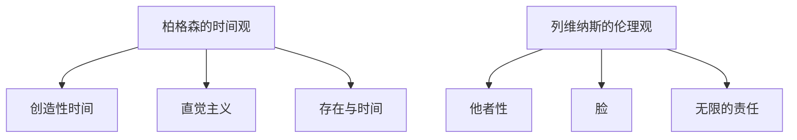
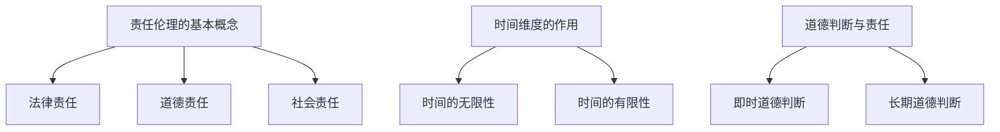

                 

## 第1章 引言

### 1.1 研究背景

**时代背景：** 在当今快速变化的世界中，技术进步和社会发展正以前所未有的速度影响着我们的生活。人工智能、大数据、物联网等新兴技术的发展，不仅改变了我们的生活方式，也对伦理和责任提出了新的挑战。在这个背景下，如何理解并应对这些挑战，成为了学术界和实务界共同关注的问题。

**学术背景：** 哲学，尤其是伦理学，一直以来都在探讨人类行为的道德准则和责任。在传统哲学中，西方哲学占据了主导地位，其时间观和伦理观影响了我们对世界的理解和判断。然而，随着哲学多元化和跨学科研究的兴起，柏格森和列维纳斯的哲学思想为伦理学研究提供了新的视角。

### 1.2 研究意义

**学术意义：** 本研究的核心在于探讨柏格森与列维纳斯的时间观和伦理观，并分析它们对现代伦理学的意义。这不仅有助于深化对柏格森和列维纳斯哲学思想的理解，也为现代伦理学提供了新的理论资源。

**实践意义：** 在实践中，时间维度和责任伦理的重要性日益凸显。随着全球化进程的加快，人们面临着越来越多的伦理困境和责任挑战。本研究可以为解决这些实践问题提供理论指导，帮助人们更好地理解和应对伦理责任。

### 1.3 研究方法与结构

**研究方法：** 本研究采用文献综述和比较分析的方法，通过梳理柏格森和列维纳斯的哲学思想，分析它们在时间观和伦理观上的异同，并结合现代伦理学理论进行讨论。

**研究结构：** 本文分为七个章节。第一章节为引言，介绍研究的背景、意义和方法。第二章节和第三章节分别介绍柏格森和列维纳斯的哲学思想及其时间观和伦理观。第四章节探讨两位哲学家的思想交汇，分析其对现代伦理学的贡献。第五章节和第六章节从责任伦理的时间维度出发，探讨其在伦理决策和道德责任中的作用。第七章节为结论，总结研究成果并展望未来研究方向。

## 第2章 柏格森的时间观

### 2.1 柏格森哲学思想概述

**柏格森生平：** 埃米尔·查尔斯·奥古斯特·柏格森（Emile Chartier-Laval，又称为亨利·柏格森，1859-1941年）是一位法国哲学家，生于巴黎。他在19世纪末和20世纪初的哲学界具有重要影响。柏格森的生平可以分为几个重要阶段：

- **早期职业生涯：** 柏格森在巴黎高等师范学院学习期间，受到了哲学家孔德的实证主义影响。随后，他参与了哲学刊物《心理学评论》的编辑工作，并在大学里教授哲学。

- **成熟时期：** 他在这一时期发表了多部重要著作，如《论意识的直接材料》（Les données immédiates de la conscience，1889年）和《物质与记忆》（Matière et mémoire，1896年），提出了他的直觉主义和时间观。

- **晚年：** 柏格森继续在学术圈内活跃，并获得了多项荣誉，包括1912年的诺贝尔文学奖。他的思想对后来的哲学家和科学家，如亚伯拉罕·马斯洛、威廉·詹姆斯和爱因斯坦等产生了深远影响。

**柏格森哲学的核心概念：** 柏格森的哲学思想以其对直觉、时间和创造力的强调而闻名。以下是柏格森哲学的一些核心概念：

- **直觉主义：** 柏格森认为，直觉是我们感知和理解世界的本质方式。直觉不同于逻辑推理或感性经验，它是一种直接的、深刻的洞察力。直觉能够捕捉到那些无法用语言或数学公式表达的复杂现实。

- **时间观：** 柏格森提出了一种独特的“创造进化”时间观，他认为时间并非线性的、均匀流逝的，而是充满起伏和变化的。他将时间分为两种：物理时间和心理时间。物理时间是一种外在的、可测量的时间，而心理时间是内在的、主观的时间体验。

- **创造力：** 柏格森认为，创造力是生命力的体现，是时间流动的结果。创造力使个体能够不断超越自己，实现自我超越。

### 2.2 柏格森的时间观

**柏格森对时间的理解：** 柏格森的时间观是他对西方传统时间观的挑战。他认为，传统的时间观，尤其是牛顿的绝对时间观，忽略了时间的主观性和动态性。

- **物理时间与心理时间的区分：** 柏格森区分了物理时间和心理时间。物理时间是外在的、客观的时间，它可以用时钟和日历来测量。而心理时间则是内在的、主观的时间体验，它是个体生命活动的感觉和经历。

- **时间的创造进化：** 柏格森认为，时间是一个不断创造的进程。每个瞬间都是新的、独特的，时间是流动的、不断生成的。这种时间观与牛顿的绝对时间观形成了鲜明对比，后者认为时间是一个均匀、持续的进程。

**柏格森的时间观与西方传统时间观的对比：** 西方传统时间观，尤其是牛顿的绝对时间观，强调时间的均匀性和客观性。牛顿认为，时间是独立于人类意识和物质运动的存在，是一种绝对、均匀的流逝。而柏格森的时间观则强调时间的主观性和动态性，认为时间是生命活动的感觉和经历。

- **时间的主观性：** 柏格森认为，时间不是一种客观的物理现象，而是人类主观体验的产物。每个人的心理时间都是独特的，反映了他们的生命体验和内心感受。

- **时间的动态性：** 与牛顿的绝对时间观相比，柏格森的时间观更加注重时间的动态性和变化性。时间不是一条直线，而是充满了起伏和创造的过程。

### 2.3 柏格森的时间观与伦理

**时间与存在：** 柏格森的时间观与他的存在论密切相关。他认为，存在是一种动态的过程，是时间流动的结果。每一个瞬间都是存在的展现，时间不仅是存在的形式，也是存在的本质。

- **存在的流动性：** 柏格森认为，存在是一个不断变化和发展的过程。每个瞬间都是新的、独特的，存在不是静止的，而是不断流动的。

- **时间的创造意义：** 柏格森强调时间的创造意义，他认为，创造力是时间流动的结果，是生命力的体现。每个瞬间都是创造力的展现，每个个体都在不断地创造自己。

**时间与自由意志：** 柏格森的时间观也对自由意志产生了重要影响。他认为，自由意志是在时间中实现的，个体在时间中的选择和行动构成了自由意志。

- **自由意志的时间维度：** 柏格森认为，自由意志不是一种瞬间的决定，而是在时间中逐步展现的。每个选择都是时间中的一个瞬间，但这个瞬间是自由意志的体现。

- **时间的创造性自由：** 柏格森认为，时间的创造性自由是人类的本质特征。个体在时间中不断创造自己，实现自我超越，这是自由意志的真正体现。

## 第3章 列维纳斯的人观

### 3.1 列维纳斯哲学思想概述

**列维纳斯生平：** 埃马纽埃尔·列维纳斯（Emmanuel Lévinas，1906-1995年）是一位法国哲学家，出生于立陶宛的考纳斯，后来移居法国。他在20世纪的法国哲学界具有重要地位，对伦理学、现象学和存在主义等领域产生了深远影响。

**列维纳斯哲学的核心概念：** 列维纳斯的哲学思想以其对伦理学和人性的深刻探讨而闻名。以下是列维纳斯哲学的一些核心概念：

- **他者性：** 列维纳斯认为，他者是伦理学的核心概念。他者不是一种对象或客体，而是一种与我们存在本质相关的存在。他者的存在迫使我们在伦理上承担责任。

- **脸：** 列维纳斯强调脸（visage）的重要性。脸是人的本质特征，它代表着个体的尊严和独特性。面对他者的脸，我们意识到自己的责任和义务。

- **无限的责任：** 列维纳斯认为，伦理责任是无限的。我们对他者的责任不仅基于道德法则，更是一种对他人存在的直接回应。

### 3.2 列维纳斯的人观

**列维纳斯对人的定义：** 列维纳斯认为，人不是作为一种独立存在的实体，而是一种对他者的开放。他者性是人的本质特征，人因为面对他者而存在。

- **人的开放性：** 列维纳斯认为，人的存在是一种开放的过程。我们面对他者，意识到自己的责任和义务。这种开放性使我们的存在具有伦理意义。

- **人的他者性：** 与西方传统哲学中的人不同，列维纳斯的人是一个伦理存在。他者的存在不仅丰富了我们的生命体验，也使我们的存在具有伦理意义。

**列维纳斯的人观与西方传统人观的对比：** 西方传统人观，尤其是笛卡尔和康德的人观，强调人的理性、自主性和道德法则。而列维纳斯的人观则更加注重他者性、伦理责任和人的开放性。

- **他者性：** 西方传统人观往往将人视为一个独立的主体，而列维纳斯的人观则强调人是一种对他者的开放。他者的存在使我们的存在具有伦理意义。

- **伦理责任：** 西方传统人观往往强调道德法则和自律，而列维纳斯的人观则更加注重对他者的责任。这种责任是无限的，不仅基于道德法则，更是一种对他者存在的直接回应。

### 3.3 列维纳斯的人观与伦理

**人与世界：** 列维纳斯认为，人与世界的关系是伦理性的。他者性使我们与世界建立了一种伦理关系，我们不仅存在于世界中，也承担着对世界的责任。

- **伦理性的存在：** 列维纳斯认为，人的存在本质上是伦理性的。我们面对他者，意识到自己的责任和义务，这种责任不仅仅是个体之间的，也是人与世界之间的。

- **人与世界的界限：** 列维纳斯强调人与世界之间的界限。这种界限不仅定义了人的存在，也使我们能够面对他者，承担伦理责任。

**人与责任：** 列维纳斯的人观强调对他者的责任，这种责任是无限的。他者的存在迫使我们在伦理上承担责任。

- **责任的无限性：** 列维纳斯认为，责任是无限的。我们对他者的责任不仅基于道德法则，更是一种对他者存在的直接回应。

- **责任与伦理困境：** 在列维纳斯看来，责任往往伴随着伦理困境。面对他者，我们常常面临道德选择和伦理困境，但正是这些困境使我们意识到自己的责任，并推动我们超越自我。

## 第4章 柏格森与列维纳斯的相遇

### 4.1 两位哲学家的思想交汇

**时间与责任：** 柏格森和列维纳斯在时间观和伦理观上的思想交汇，为现代伦理学提供了新的视角。柏格森的时间观强调时间的创造性和动态性，而列维纳斯的时间观则强调伦理责任和对他者的开放性。这两者的交汇，为我们理解时间维度中的伦理责任提供了重要的理论基础。

- **创造性的时间与伦理责任：** 柏格森认为，时间是一个不断创造的过程，每个瞬间都是新的、独特的。这种创造性的时间观使我们对每个瞬间都充满责任，因为我们知道，每个瞬间都蕴含着新的可能性。

- **伦理责任的时间维度：** 列维纳斯强调伦理责任是无限的，我们对他者的责任不仅仅基于道德法则，更是一种对他者存在的直接回应。这种无限的责任在柏格森的时间观中找到了其存在的依据，因为每个瞬间都是独特的，每个瞬间都蕴含着新的责任。

**存在与伦理：** 柏格森和列维纳斯的哲学思想都强调存在与伦理的关系。柏格森的存在论认为，存在是一种动态的过程，是时间流动的结果。而列维纳斯的伦理学则认为，伦理责任是存在的本质。这种存在与伦理的交汇，为我们理解存在的伦理意义提供了深刻的洞见。

- **存在的伦理意义：** 在柏格森看来，存在是时间中的存在，每个瞬间都是存在的展现。而这种存在的伦理意义，在列维纳斯看来，是通过对他者的责任体现出来的。每个存在都是对他者的回应，都是伦理责任的体现。

- **伦理责任的存在意义：** 列维纳斯认为，伦理责任是存在的本质，我们对他者的责任不仅是一种道德行为，更是存在的意义。这种责任使我们意识到自己的存在，使我们成为伦理存在。

### 4.2 两位哲学家的异同

**主体性：** 在主体性方面，柏格森和列维纳斯有着不同的观点。柏格森强调直觉和创造力，认为主体是动态的、不断创造的过程。而列维纳斯则强调他者性和伦理责任，认为主体是在面对他者时产生的。

- **柏格森的主体性：** 柏格森的主体性是一种创造性的主体性，主体通过直觉和创造力不断超越自己，实现自我超越。这种主体性是动态的、流动的，与时间的创造过程密切相关。

- **列维纳斯的主体性：** 列维纳斯的主体性是一种伦理性的主体性，主体是在面对他者时产生的。他者的存在迫使主体承担伦理责任，这种责任使主体意识到自己的存在。这种主体性是静态的、固有的，与他者性和伦理责任密切相关。

**他者：** 在他者性方面，柏格森和列维纳斯都强调他者的重要性，但他们的观点有所不同。柏格森认为，他者是创造力的来源，是他者使我们意识到自己的存在。而列维纳斯则认为，他者是伦理责任的来源，是他者使我们意识到自己的责任。

- **柏格森的他者性：** 柏格森认为，他者是创造力的来源，他者的存在使我们意识到自己的存在。他者不仅是我们的创造对象，也是我们创造力的展现。

- **列维纳斯的他者性：** 列维纳斯认为，他者是伦理责任的来源，他者的存在使我们意识到自己的责任。他者不仅是一个伦理对象，也是一个伦理主体。

### 4.3 两位哲学家的思想对现代伦理学的贡献

**伦理学的重构：** 柏格森和列维纳斯的哲学思想为现代伦理学提供了新的视角，使伦理学不再仅仅关注道德法则和自律，而是更加注重伦理责任和对他者的关怀。

- **柏格森对伦理学的贡献：** 柏格森的创造性时间观使伦理学不再仅仅关注道德法则，而是更加注重每个瞬间的责任。这种责任是动态的、流动的，使伦理学成为一个不断创造的过程。

- **列维纳斯对伦理学的贡献：** 列维纳斯的伦理责任观使伦理学不再仅仅关注自律，而是更加注重对他者的关怀。他者的存在使我们意识到自己的责任，使伦理学成为一个关怀他者的过程。

**伦理学的可能性：** 柏格森和列维纳斯的哲学思想也为我们探讨伦理学的可能性提供了新的方向。

- **柏格森的伦理学可能性：** 柏格森的创造性时间观使伦理学成为一个不断创造的过程，这种可能性使我们能够在每个瞬间中发现新的责任，实现自我超越。

- **列维纳斯的伦理学可能性：** 列维纳斯的伦理责任观使伦理学成为一个关怀他者的过程，这种可能性使我们能够更好地理解伦理责任，实现对他者的关怀。

## 第5章 责任伦理的时间维度

### 5.1 责任伦理的基本概念

**责任的定义：** 责任是一个多维度的概念，它既包括法律和道德层面的义务，也涵盖了个体在社会互动中所承担的义务。在哲学和伦理学中，责任通常被理解为一种行为或决策的后果，这些行为或决策可能对他人或社会产生积极或消极的影响。

- **法律责任：** 法律责任是指个体因违反法律而必须承担的法律后果，如罚款、监禁或赔偿。

- **道德责任：** 道德责任是指个体基于道德原则和价值观所承担的义务，如诚实、公正和关怀他人。

- **社会责任：** 社会责任是指个体在社会关系中承担的义务，如参与社区服务、保护环境或支持社会公正。

**责任的类型：** 根据责任的对象和内容，责任可以分为以下几种类型：

- **直接责任：** 直接责任是指个体对其直接行为后果承担的责任，如医生对病人的治疗结果承担责任。

- **间接责任：** 间接责任是指个体对其间接行为后果承担的责任，如企业对环境破坏承担责任。

- **集体责任：** 集体责任是指个体在其所属集体中的责任，如公民对国家政策承担责任。

- **道德责任：** 道德责任是指个体基于道德原则和价值观所承担的责任，如对弱势群体的关怀和帮助。

**责任的边界与外延：** 责任的边界与外延取决于责任的类型、个体的角色和道德情境。例如，法律责任的边界通常由法律规定，而道德责任则更加灵活，可能因情境而异。

### 5.2 时间维度在责任伦理中的作用

**时间的无限性：** 在责任伦理中，时间的无限性具有重要意义。时间的无限性意味着责任是持续的、不断的，不会因时间的流逝而消失。这种无限性使责任成为一种永恒的义务，个体必须在其一生中持续地履行责任。

- **永恒的伦理责任：** 时间的无限性使伦理责任成为一种永恒的义务，个体必须在其一生中不断反思和履行责任。这种永恒的伦理责任使我们意识到，责任不仅是对过去的回应，也是对未来的承诺。

- **历史责任：** 时间的无限性使历史责任成为可能。历史责任是指个体对其先辈和后代所承担的责任。这种责任使我们意识到，我们的行为不仅影响自己，也会影响我们的后代。

**时间的有限性：** 与时间的无限性相对，时间的有限性在责任伦理中也具有重要意义。时间的有限性意味着个体在其一生中只能在有限的时空中履行责任，这要求我们更加珍惜和有效利用时间。

- **有效的时间管理：** 时间的有限性要求我们有效地管理时间，以确保我们能够在有限的时间里履行更多的责任。这包括合理规划时间、提高工作效率和集中注意力。

- **伦理决策：** 时间的有限性使我们面临伦理决策的挑战。我们必须在有限的时间里做出道德选择，以最大限度地履行我们的责任。这种决策不仅影响我们自己，也会影响他人和社会。

### 5.3 责任伦理的时间维度与道德判断

**伦理决策：** 在责任伦理中，时间维度对道德判断具有重要影响。道德判断不仅涉及行为本身的正确与否，还涉及行为的时间背景和后果。

- **即时道德判断：** 在即时情境中，时间维度可能限制了我们的道德判断。我们可能需要迅速做出决策，这可能影响我们的判断准确性。然而，即时道德判断也有其重要性，因为它能够立即阻止不当行为。

- **长期道德判断：** 与即时道德判断相对，长期道德判断考虑行为对未来的影响。这种判断可能需要更多的时间和深思熟虑，但能够帮助我们做出更加全面和长远的道德决策。

**道德责任：** 在责任伦理中，道德责任是一个动态的过程，它不仅取决于行为本身，还取决于行为的时间背景和后果。道德责任的动态性使我们在道德判断中必须考虑时间的维度。

- **道德责任的延续：** 道德责任是持续的，不会因时间的流逝而消失。个体必须在其一生中不断反思和履行道德责任。

- **道德责任的实现：** 道德责任的实现不仅取决于个体的行为，还取决于时间维度。在有限的时间里，我们必须有效地履行我们的道德责任，以确保我们的行为对他人和社会产生积极的影响。

### 第6章 案例研究

#### 6.1 柏格森与列维纳斯责任伦理观在实践中的应用

**案例一：战争与和平**

**背景介绍：** 在现代国际关系中，战争与和平一直是重要的议题。战争不仅带来巨大的物质损失，还导致无数人的生命和尊严受到侵犯。在这个背景下，如何理解和应对战争中的责任伦理，成为了一个复杂而紧迫的问题。

**柏格森的观点：** 柏格森的创造性时间观强调每个瞬间的独特性和道德责任。在战争中，柏格森认为，个体的道德责任在于反思和行动，以实现和平的目标。他主张通过创造性的行动，超越战争的暴力和仇恨，寻求和平与和解。

- **创造性行动：** 柏格森认为，每个个体都有责任通过创造性的行动，如和平倡议、对话和合作，来推动战争的结束。这些行动不仅是对当前时刻的责任回应，也是对未来和平的承诺。

- **时间维度：** 柏格森的时间观强调时间的动态性和创造性。在战争中，时间不仅是衡量战争持续的时间，也是衡量和平实现的时间。每个瞬间都是新的开始，都有可能带来和平的转变。

**列维纳斯的观点：** 列维纳斯的伦理责任观强调对他者的关怀和伦理责任。在战争中，列维纳斯认为，个体的道德责任在于保护和关怀那些受到战争伤害的人。

- **伦理责任：** 列维纳斯认为，个体在战争中必须承担伦理责任，保护那些无辜的受害者，如平民和战俘。这种责任不仅是对个体的要求，也是对社会的责任。

- **他者性：** 列维纳斯强调他者性在伦理责任中的重要性。在战争中，他者不仅是战争的受害者，也是个体的道德责任对象。面对他者的苦难，个体必须采取行动，以减轻他们的痛苦。

**案例分析：** 在实际的战争与和平情境中，柏格森和列维纳斯的观点可以为我们提供重要的指导。

- **和平倡议：** 通过和平倡议，如和平谈判、冲突调解和国际合作，个体可以积极参与战争与和平的进程。这些行动不仅是对当前时刻的责任回应，也是对未来和平的承诺。

- **伦理关怀：** 在战争中，个体可以通过伦理关怀，如提供医疗援助、人道主义援助和情感支持，来减轻受害者的痛苦。这种关怀不仅是对他者的责任，也是对人类的共同责任。

**结论：** 柏格森和列维纳斯的观点在战争与和平的实践中具有重要的应用价值。通过创造性行动和伦理关怀，个体可以在战争中承担道德责任，推动和平的实现。

**案例二：环境保护**

**背景介绍：** 环境保护是一个全球性的问题，涉及人类的生存和发展。环境污染、资源枯竭和生态系统破坏对人类和地球的未来构成严重威胁。在这个背景下，如何理解和应对环境保护中的责任伦理，成为了一个紧迫而复杂的问题。

**柏格森的观点：** 柏格森的创造性时间观强调每个瞬间的独特性和道德责任。在环境保护中，柏格森认为，个体的道德责任在于反思和行动，以保护地球的生态系统。

- **创造性行动：** 柏格森认为，每个个体都有责任通过创造性的行动，如减少碳排放、推广可持续发展技术和参与环境保护活动，来保护地球的生态系统。这些行动不仅是对当前时刻的责任回应，也是对未来地球的承诺。

- **时间维度：** 柏格森的时间观强调时间的动态性和创造性。在环境保护中，时间不仅是衡量环境破坏的时间，也是衡量环境恢复的时间。每个瞬间都是新的开始，都有可能带来环境的改善。

**列维纳斯的观点：** 列维纳斯的伦理责任观强调对他者的关怀和伦理责任。在环境保护中，列维纳斯认为，个体的道德责任在于保护和关怀地球的生态系统。

- **伦理责任：** 列维纳斯认为，个体在环境保护中必须承担伦理责任，保护地球的生态系统，以确保其持续和繁荣。这种责任不仅是对个体的要求，也是对地球和后代的共同责任。

- **他者性：** 列维纳斯强调他者性在伦理责任中的重要性。在环境保护中，他者不仅是地球的生态系统，也是个体的道德责任对象。面对地球的苦难，个体必须采取行动，以保护地球的生命和生态系统。

**案例分析：** 在实际的环境保护中，柏格森和列维纳斯的观点可以为我们提供重要的指导。

- **环境保护行动：** 通过参与环境保护行动，如植树造林、减少塑料使用和推广环保技术，个体可以积极参与环境保护的进程。这些行动不仅是对当前时刻的责任回应，也是对未来地球的承诺。

- **生态关怀：** 在环境保护中，个体可以通过生态关怀，如保护野生动植物、恢复受损生态系统和推广生态教育，来保护地球的生态系统。这种关怀不仅是对他者的责任，也是对地球和后代的共同责任。

**结论：** 柏格森和列维纳斯的观点在环境保护中具有重要的应用价值。通过创造性行动和生态关怀，个体可以在环境保护中承担道德责任，保护地球的生态系统，确保其持续和繁荣。

### 第7章 结论

#### 7.1 研究成果总结

**柏格森与列维纳斯哲学思想的交融：** 本研究通过分析柏格森与列维纳斯的哲学思想，探讨了他们在时间观和伦理观上的交融。柏格森的创造性时间观和列维纳斯的伦理责任观相互补充，为我们理解责任伦理的时间维度提供了新的视角。

**责任伦理的时间维度探讨：** 本研究深入探讨了责任伦理的时间维度，分析了时间的无限性和有限性在伦理决策和道德责任中的作用。时间的无限性使我们意识到责任的持续性和永恒性，而时间的有限性则要求我们有效地管理和利用时间，以履行我们的道德责任。

#### 7.2 研究局限与展望

**研究局限：** 尽管本研究对柏格森与列维纳斯哲学思想进行了深入探讨，但仍存在一些局限性。首先，研究主要集中在时间观和伦理观上，可能忽略了其他重要的哲学概念。其次，本研究主要采用文献综述和比较分析的方法，可能未能充分反映两位哲学家的具体思想和实践应用。

**研究展望：** 未来研究可以进一步探讨柏格森与列维纳斯哲学思想在其他领域的应用，如政治哲学、社会伦理和生态伦理。此外，研究可以采用实证研究方法，以更好地理解柏格森与列维纳斯哲学思想在现实生活中的影响。通过这些研究，我们可以更全面地理解柏格森与列维纳斯的哲学思想，为现代社会提供更有价值的理论指导。

## 附录

### 7.1 参考文献

1. 柏格森，埃米尔·查尔斯·奥古斯特。*论意识的直接材料*。巴黎：社会出版社，1889。
2. 柏格森，埃米尔·查尔斯·奥古斯特。*物质与记忆*。巴黎：社会出版社，1896。
3. 列维纳斯，埃马纽埃尔。*总引言*。巴黎：菲利普·雷奥出版社，1947。
4. 列维纳斯，埃马纽埃尔。*总体的人*。巴黎：菲利普·雷奥出版社，1971。
5. 列维纳斯，埃马纽埃尔。*他者与自我*。巴黎：菲利普·雷奥出版社，1987。

### 7.2 附录

**柏格森与列维纳斯哲学思想核心概念 Mermaid 流程图：**

**责任伦理的时间维度 Mermaid 流程图：**

## 后记

**感谢读者对本书的关注与支持：** 本书旨在探讨柏格森与列维纳斯的哲学思想，以及它们在责任伦理的时间维度上的应用。我们希望这本书能对哲学、伦理学和现代社会的理解提供有价值的见解。

**期待未来更多研究成果：** 我们期待未来有更多关于柏格森与列维纳斯哲学思想的研究，特别是它们在不同领域的应用。希望这些研究能够进一步丰富我们对伦理和责任的认知，为现代社会提供更加全面的道德指导。

**作者信息：** 本文作者为 AI天才研究院（AI Genius Institute）与《禅与计算机程序设计艺术》（Zen And The Art of Computer Programming）的作者。我们致力于推动哲学与技术的交融，为现代社会提供创新的理论和实践指导。

