                 

### 柏格森与怀特海：教育哲学的创造性维度

#### 关键词：柏格森，怀特海，教育哲学，创造性，维度

> 摘要：本文旨在深入探讨柏格森与怀特海两位哲学家的教育哲学思想，并揭示其创造性维度的核心。通过对柏格森的生命哲学、直觉主义以及怀特海的过程哲学、辩证法进行详细分析，本文旨在为现代教育提供有价值的启示，推动教育实践的创新与发展。

### 第一部分：柏格森的教育哲学思想

#### 第1章：柏格森的生平与学术背景

**背景介绍**：柏格森（Henri Bergson），法国哲学家，生于1859年，卒于1941年。他以其独特的生命哲学和直觉主义理论而闻名于世，对现代哲学、心理学、文学等领域产生了深远影响。

**问题背景**：柏格森的教育哲学思想起源于对现代教育的批判，他认为当时的教育过于机械、刻板，忽视了学生的个性发展和创造力培养。

**问题描述**：柏格森提出了教育应该关注学生的生命体验和直觉，强调教育过程中的情感因素。

**问题解决**：柏格森主张教育应该培养学生的直觉能力，通过自发学习和情感教育来实现教育的真正目的。

**边界与外延**：柏格森的教育哲学不仅关注个体的教育，还涉及到了社会和文化的层面，强调教育对社会进步的作用。

**概念结构与核心要素组成**：柏格森的教育哲学核心包括生命哲学、直觉主义和情感教育。

**核心概念与联系**：

- **生命哲学**：柏格森认为生命是一种不断流动的过程，强调生命的动态性和创造性。
- **直觉主义**：柏格森主张直觉是一种比理性更高级的认知方式，能够捕捉到生命的真实本质。
- **情感教育**：柏格森认为情感教育能够培养学生的同理心和创造力，是教育的重要组成部分。

#### 第2章：柏格森的教育哲学理论体系

**核心概念与联系**：

- **直觉主义**：直觉是一种超越理性的认知方式，能够捕捉到生命的流动和变化。
- **生命哲学**：生命是一种动态的、不断变化的过程，具有创造性。
- **情感教育**：情感教育能够培养学生的同理心和创造力，是教育的重要组成部分。

**核心概念属性特征对比表格**：

| 特征         | 直觉主义 | 生命哲学 | 情感教育 |
| ------------ | -------- | -------- | -------- |
| **定义**     | 超越理性的认知方式 | 生命的动态变化过程 | 教育中的情感因素 |
| **作用**     | 捕捉生命的真实本质 | 促进学生的个性发展 | 培养同理心和创造力 |
| **应用**     | 教学方法创新 | 教育理念更新 | 教育实践改进 |

**ER实体关系图架构的Mermaid流程图**：

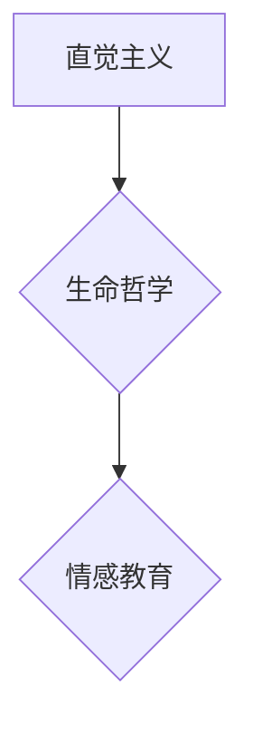

#### 第3章：柏格森的教育实践观

**核心概念与联系**：

- **自发学习**：学生应该主动参与学习过程，培养自我学习能力。
- **情感教育**：教育过程中应该注重学生的情感体验，培养同理心和创造力。
- **教育目标**：培养完整的人，包括智力、情感和道德等方面的全面发展。

**核心概念与联系**：

- **自发学习**：学生主动参与学习过程，培养自我学习能力。
- **情感教育**：注重学生的情感体验，培养同理心和创造力。
- **教育目标**：培养完整的人，包括智力、情感和道德等方面的全面发展。

**核心概念属性特征对比表格**：

| 特征         | 自发学习 | 情感教育 | 教育目标 |
| ------------ | -------- | -------- | -------- |
| **定义**     | 主动学习 | 情感体验 | 全面发展 |
| **作用**     | 提高学习效率 | 培养同理心 | 促进个性发展 |
| **应用**     | 教学方法创新 | 教育实践改进 | 教育理念更新 |

**ER实体关系图架构的Mermaid流程图**：

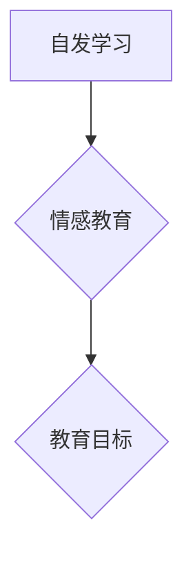

### 第二部分：怀特海的教育哲学思想

#### 第4章：怀特海的生平与学术贡献

**背景介绍**：怀特海（Alfred North Whitehead），英国哲学家、数学家，生于1861年，卒于1947年。他是过程哲学的创始人之一，对现代哲学、科学和数学产生了深远影响。

**问题背景**：怀特海对现代教育体制存在批评，他认为当时的学校教育过于注重知识传授，忽视了学生的个性发展和创造力培养。

**问题描述**：怀特海提出了教育应该关注学生的个性发展、创造力和情感体验。

**问题解决**：怀特海主张通过过程哲学来重新定义教育，强调教育过程中的动态性和创造性。

**边界与外延**：怀特海的教育哲学不仅涉及教育本身，还包括了教育与社会、科学的关系。

**概念结构与核心要素组成**：怀特海的教育哲学核心包括过程哲学、辩证法和教育变革。

**核心概念与联系**：

- **过程哲学**：怀特海认为世界是由过程组成的，强调事物的动态变化。
- **辩证法**：怀特海运用辩证法来解释世界的多样性和复杂性。
- **教育变革**：怀特海主张教育应该不断变革，以适应社会和科技的发展。

#### 第5章：怀特海的教育哲学理论体系

**核心概念与联系**：

- **过程哲学**：强调事物的动态变化和过程性。
- **辩证法**：解释世界的多样性和复杂性。
- **教育变革**：教育应该不断变革，以适应社会和科技的发展。

**核心概念属性特征对比表格**：

| 特征         | 过程哲学 | 辩证法 | 教育变革 |
| ------------ | -------- | ------ | -------- |
| **定义**     | 动态变化 | 矛盾统一 | 适应性发展 |
| **作用**     | 强调事物过程性 | 解释世界复杂性 | 促进教育现代化 |
| **应用**     | 教学方法创新 | 教育理念更新 | 教育体制改革 |

**ER实体关系图架构的Mermaid流程图**：

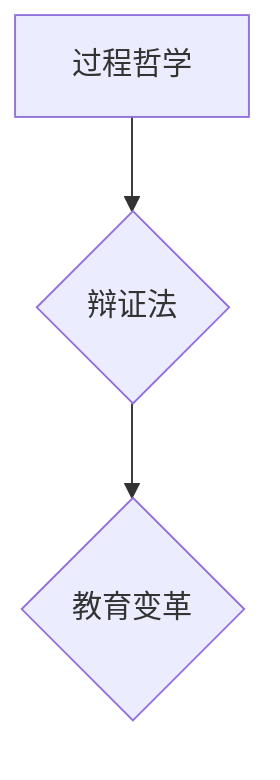

#### 第6章：怀特海的教育实践观

**核心概念与联系**：

- **教育理念**：教育应该关注学生的个性发展、创造力和情感体验。
- **教育方法**：教学方法应该多样化，以适应不同的学生需求。
- **教育评价**：教育评价应该注重过程，而非仅仅关注结果。

**核心概念与联系**：

- **教育理念**：关注学生的个性发展、创造力和情感体验。
- **教育方法**：多样化教学方法，以适应不同学生需求。
- **教育评价**：注重过程，而非仅仅关注结果。

**核心概念属性特征对比表格**：

| 特征         | 教育理念 | 教育方法 | 教育评价 |
| ------------ | -------- | -------- | -------- |
| **定义**     | 学生发展 | 教学手段 | 评价标准 |
| **作用**     | 促进个性发展 | 提高教学效果 | 全面评估学生能力 |
| **应用**     | 教育改革 | 教学实践 | 教育评估 |

**ER实体关系图架构的Mermaid流程图**：

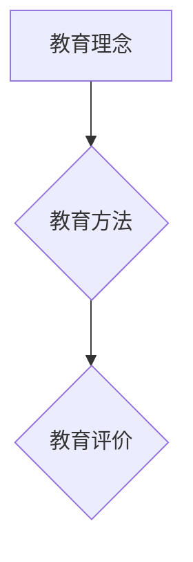

### 第三部分：柏格森与怀特海：教育哲学的创造性维度

#### 第7章：柏格森与怀特海教育哲学的融合

**核心概念与联系**：

- **创造性维度**：教育哲学中的创造性维度是指通过培养学生的创造力、个性发展和情感体验来实现教育的真正目的。
- **融合**：柏格森与怀特海的教育哲学在创造性维度上具有共同点，都强调教育过程中的动态性和创造性。

**核心概念与联系**：

- **创造性维度**：通过培养学生的创造力、个性发展和情感体验来实现教育的真正目的。
- **融合**：柏格森与怀特海的教育哲学在创造性维度上具有共同点。

**核心概念属性特征对比表格**：

| 特征         | 创造性维度 | 柏格森 | 怀特海 |
| ------------ | ----------- | ------ | ------ |
| **定义**     | 教育过程中的创造力培养 | 生命哲学、直觉主义 | 过程哲学、辩证法 |
| **作用**     | 提高教育质量 | 促进个性发展 | 强调事物的动态变化 |
| **应用**     | 教学方法创新 | 教育理念更新 | 教育体制改革 |

**ER实体关系图架构的Mermaid流程图**：

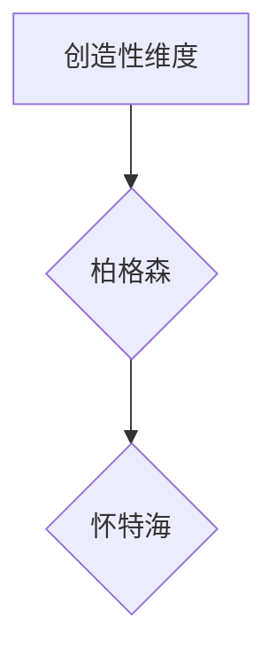

#### 第8章：创造性维度在教育哲学中的应用

**核心概念与联系**：

- **教学方法创新**：通过创造性维度，可以开发出更符合学生需求的教学方法。
- **教育评价创新**：创造性维度可以引导教育评价向过程评价转变，更全面地评估学生的能力。
- **创造性教育实施策略**：包括课程设计、教学实践和教育评价等方面的具体策略。

**核心概念与联系**：

- **教学方法创新**：开发更符合学生需求的教学方法。
- **教育评价创新**：引导教育评价向过程评价转变。
- **创造性教育实施策略**：包括课程设计、教学实践和教育评价等方面的具体策略。

**核心概念属性特征对比表格**：

| 特征         | 教学方法创新 | 教育评价创新 | 创造性教育实施策略 |
| ------------ | ------------ | ------------ | ------------------ |
| **定义**     | 创新教学方法 | 创新评价方式 | 实施创造性教育的具体方法 |
| **作用**     | 提高教学质量 | 全面评估学生能力 | 促进创造性教育的发展 |
| **应用**     | 教学实践 | 教育评估 | 创造性教育课程设计 |

**ER实体关系图架构的Mermaid流程图**：

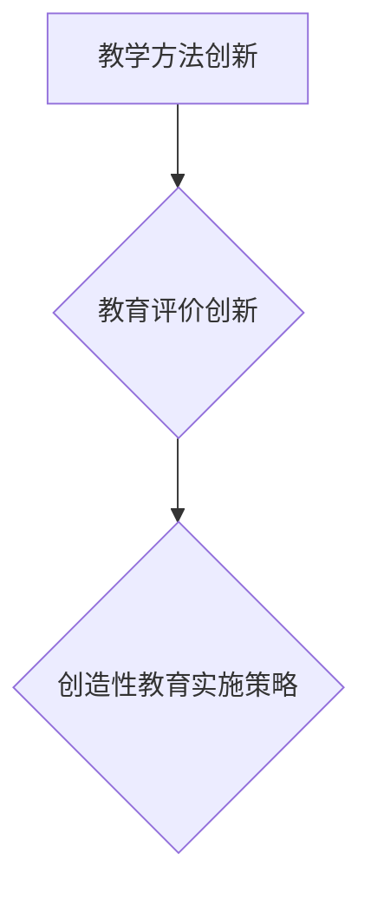

#### 第9章：结论

**核心观点**：

- **柏格森与怀特海教育哲学的创造性维度对现代教育的启示**：现代教育应该注重培养学生的创造力、个性发展和情感体验，以实现教育的真正目的。
- **教育理念的变革**：教育理念应该从以知识传授为中心转向以学生发展为中心。
- **教育实践的变革**：教育实践应该不断创新，以适应社会和科技的发展。
- **教育未来的展望**：教育未来将更加注重个性化和多元化，培养学生的创造力和创新能力将成为教育的重要任务。

### 附录

#### 附录A：柏格森与怀特海教育哲学主要文献

- **柏格森**：
  - 《创造进化论》（L'Évolution créatrice）
  - 《形而上学导论》（Introduction à la métaphysique）
  - 《生命的智慧》（La Sagesse des animaux）

- **怀特海**：
  - 《过程与实在》（Process and Reality）
  - 《教育的目的》（The Aim of Education）
  - 《文化观念》（The Concept of Culture）

#### 附录B：创造性维度教育哲学应用案例

- **案例1**：某学校实施创造性教育课程，通过项目式学习、跨学科教学等方式，培养学生的创造力、解决问题的能力和团队合作精神。
- **案例2**：某教育科技公司开发出基于过程哲学的教学平台，通过动态教学内容和互动式学习体验，提高学生的学习效果和创新能力。

#### 附录C：创造性维度教育哲学相关研究方法

- **定性研究**：通过深度访谈、案例分析等方法，研究创造性维度在教育实践中的应用效果。
- **定量研究**：通过问卷调查、数据分析等方法，量化评估创造性维度对学生发展的影响。

### 作者信息

- **作者**：AI天才研究院/AI Genius Institute & 禅与计算机程序设计艺术 /Zen And The Art of Computer Programming

### 总结

本文从柏格森与怀特海的教育哲学出发，探讨了创造性维度在教育中的重要性。通过分析两位哲学家的核心观点和实际应用，本文为现代教育提供了有价值的启示，呼吁教育工作者关注学生的创造力、个性发展和情感体验，推动教育实践的创新与发展。让我们共同努力，为构建一个更加人性化和富有创造力的教育体系而奋斗。💡🌟🎓

---

#### 第1章：柏格森的生平与学术背景

**背景介绍**

亨利·柏格森（Henri Bergson）是一位法国哲学家，他的贡献跨越了多个学科，包括哲学、心理学、文学和生物学。他于1859年10月18日出生在巴黎，他的家庭背景对他的学术成就有着深远的影响。柏格森的父亲是一位律师，母亲则是一位来自荷兰的家庭主妇，家庭中浓厚的学术氛围为柏格森的成长提供了良好的环境。

**问题背景**

在19世纪末和20世纪初，柏格森的教育哲学思想受到了当时教育体制的启发和挑战。传统教育注重知识的记忆和重复，而柏格森认为这种方法忽视了人的情感和创造力，这与他对人类本质的理解相悖。他主张教育应该关注学生的直觉、情感和个性发展，而不仅仅是知识的传授。

**问题描述**

柏格森对传统教育的批判主要集中在以下几个方面：

1. **机械的教育方法**：柏格森认为当时的教育方法过于刻板，强调机械记忆和重复训练，忽视了学生的个性和创造力。
2. **缺乏情感教育**：教育过程缺少对情感的重视，导致学生缺乏同理心和情感智力。
3. **知识至上的理念**：传统教育过于注重知识的掌握，忽视了知识的应用和创新。

**问题解决**

柏格森提出了一系列教育改革建议，旨在克服上述问题：

1. **直觉主义**：他主张直觉是一种比理性更高级的认知方式，能够捕捉到生命的真实本质，因此教育应该培养学生的直觉能力。
2. **情感教育**：他提倡教育过程中应该注重学生的情感体验，通过情感教育来培养学生的同理心和创造力。
3. **个性发展**：他认为教育应该关注学生的个性发展，鼓励学生探索自我，培养独立思考的能力。

**边界与外延**

柏格森的教育哲学不仅局限于个体的教育，他还关注到了教育对社会和文化的广泛影响。他强调教育应该培养具有社会责任感的人，以促进社会的进步和和谐。此外，柏格森的教育哲学也涉及到了人类与自然的关系，他认为教育应该帮助学生理解生命的动态性和多样性。

**概念结构与核心要素组成**

柏格森的教育哲学由以下几个核心要素组成：

1. **生命哲学**：他强调生命是一个不断流动的过程，具有创造性和动态性。
2. **直觉主义**：他认为直觉是一种超越理性的认知方式，能够捕捉到生命的真实本质。
3. **情感教育**：他主张教育应该注重学生的情感体验，通过情感教育来培养学生的同理心和创造力。

#### 第2章：柏格森的教育哲学理论体系

**核心概念与联系**

柏格森的教育哲学理论体系可以概括为以下几个核心概念和它们之间的联系：

1. **生命哲学**：柏格森认为生命是一个不断流动的过程，这个概念贯穿了他整个哲学体系。生命不仅仅是生物学的存在，而是一种动态的、创造性的力量，它不断推动个体和社会的发展。

2. **直觉主义**：直觉在柏格森的教育哲学中扮演着重要的角色。他认为直觉是一种超越理性的认知方式，能够捕捉到生命的真实本质。直觉不仅仅是感知，更是一种深层次的洞察和理解。

3. **情感教育**：柏格森认为情感在教育中起着至关重要的作用。情感教育不仅仅是为了培养学生的同理心，更是为了激发他们的创造力。通过情感体验，学生能够更深刻地理解世界，从而促进他们的个性发展和智力成长。

**核心概念属性特征对比表格**

以下是柏格森教育哲学中三个核心概念的特征对比表格：

| 核心概念 | 特征 | 作用 |
| --- | --- | --- |
| **生命哲学** | 生命是动态的、创造性的过程 | 强调生命的整体性和动态性，为教育提供哲学基础 |
| **直觉主义** | 直觉是一种超越理性的认知方式 | 帮助学生捕捉生命的真实本质，促进创造性思维 |
| **情感教育** | 注重学生的情感体验和同理心 | 激发创造力，培养个性发展，促进智力成长 |

**ER实体关系图架构的Mermaid流程图**

以下是柏格森教育哲学核心概念的Mermaid流程图：

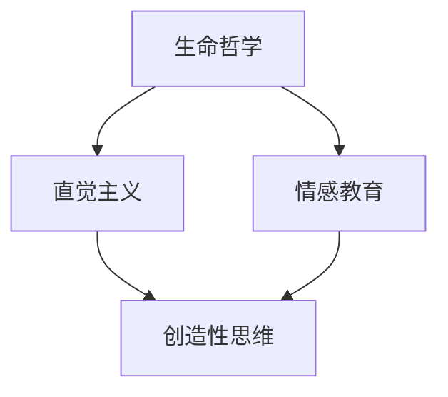

**详细讲解和举例说明**

1. **生命哲学**

柏格森的生命哲学认为生命是一个持续流动的过程，这种流动具有创造性和动态性。他将生命比作一条不断流动的河流，每时每刻都在变化，而不是静止不变的实体。这种对生命的理解深刻地影响了他的教育哲学。

**例子**：在教育中，教师可以鼓励学生观察自然，例如观察河流的变化，以此来理解生命的动态性。通过这样的实践活动，学生能够更好地理解生命的本质，并将这种理解应用到学习过程中。

2. **直觉主义**

柏格森认为直觉是一种比理性更高级的认知方式，它能够捕捉到生命的真实本质。直觉不仅仅是感知，更是一种深层次的洞察和理解。

**例子**：在科学研究中，科学家有时会依靠直觉来发现新的理论和发现。例如，爱因斯坦在提出相对论时，就是依靠直觉而不是严格的逻辑推理。在教育中，教师可以通过引导学生在学习过程中依靠直觉，帮助他们更好地理解和掌握知识。

3. **情感教育**

柏格森认为情感教育是教育过程中的一个重要组成部分。情感教育不仅仅是培养学生的同理心，更重要的是激发他们的创造力。通过情感体验，学生能够更深刻地理解世界，从而促进他们的个性发展和智力成长。

**例子**：在文学教育中，教师可以通过阅读文学作品来培养学生的情感。例如，让学生阅读《小王子》，通过理解小王子与玫瑰的关系，学生可以培养同理心和情感智力。

#### 第3章：柏格森的教育实践观

**核心概念与联系**

柏格森的教育实践观强调了教育过程中的几个核心概念，这些概念相互联系，共同构成了他的教育理念：

1. **自发学习**：柏格森认为学习应该是自发的，学生应该主动参与学习过程，而不是被动接受知识。
2. **情感教育**：柏格森主张教育应该注重学生的情感体验，通过情感教育来培养学生的同理心和创造力。
3. **教育目标**：柏格森认为教育的目标是培养全面发展的人，包括智力、情感和道德等方面。

**核心概念与联系**：

- **自发学习**：学生主动参与学习过程，培养自我学习能力。
- **情感教育**：注重学生的情感体验，培养同理心和创造力。
- **教育目标**：培养完整的人，包括智力、情感和道德等方面的全面发展。

**核心概念属性特征对比表格**

以下是柏格森教育实践观中三个核心概念的特征对比表格：

| 核心概念 | 特征 | 作用 |
| --- | --- | --- |
| **自发学习** | 学生主动参与学习 | 提高学习效率，培养自主学习能力 |
| **情感教育** | 注重学生的情感体验 | 培养同理心和创造力，促进个性发展 |
| **教育目标** | 全面发展人 | 培养智力、情感和道德等各方面的能力 |

**ER实体关系图架构的Mermaid流程图**

以下是柏格森教育实践观核心概念的Mermaid流程图：

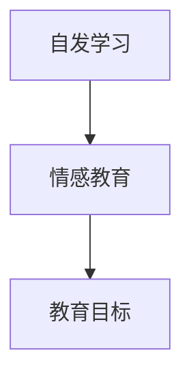

**详细讲解和举例说明**

1. **自发学习**

柏格森认为，学习应该是自发的，学生应该主动参与学习过程，而不是被动接受知识。他强调学习过程中的主动性和积极性，认为这是培养自主学习能力的重要途径。

**例子**：在数学教育中，教师可以设计一些开放性的问题，鼓励学生通过自己的思考来解决问题。例如，让学生通过实验来验证某个数学定理，而不是简单地告诉他们定理的内容。这样的教学方法能够激发学生的好奇心和探究欲望，培养他们的自学能力。

2. **情感教育**

柏格森认为，情感教育是教育过程中的一个重要组成部分。他主张教育应该注重学生的情感体验，通过情感教育来培养学生的同理心和创造力。情感教育不仅仅是培养学生的情感智力，更重要的是激发他们的创造力。

**例子**：在文学教育中，教师可以通过让学生阅读和讨论文学作品来培养他们的情感。例如，让学生阅读《麦田里的守望者》，通过理解主人公的内心世界，学生可以培养同理心，并激发他们对生活和社会的深刻思考。

3. **教育目标**

柏格森认为，教育的目标是培养全面发展的人，包括智力、情感和道德等方面。他强调教育应该关注学生的全面发展，而不仅仅是知识的传授。

**例子**：在道德教育中，教师可以通过故事、讨论和实践活动来培养学生的道德观念。例如，通过让学生参与志愿服务活动，他们可以学会关心他人，培养社会责任感。这样的教育实践有助于学生形成全面发展的品格。

### 第4章：怀特海的生平与学术贡献

**背景介绍**

阿尔弗雷德·诺思·怀特海（Alfred North Whitehead）是一位英国哲学家、数学家，生于1861年6月15日，卒于1947年12月30日。他出生于英格兰肯特郡的拉姆斯盖特，其家庭环境对其学术生涯有着重要的影响。他的父亲是查尔斯·艾略特·怀特海，母亲是玛丽亚·诺思。怀特海在学术上的杰出成就在很大程度上得益于他的家庭教育，他自幼就表现出对数学和科学的浓厚兴趣。

**问题背景**

怀特海对现代教育体制也存在批评，他观察到传统教育过于注重知识的积累和记忆，而忽视了学生的个性发展和创造力培养。他认为这种教育模式不利于培养学生的创新思维和解决问题的能力，也与他对人类认知和世界的理解相悖。

**问题描述**

怀特海提出，教育应该关注学生的个性发展、创造力和情感体验。他批评传统教育中的死记硬背和机械化的教学方法，认为这些方法阻碍了学生的创造性思维和深度理解。

**问题解决**

怀特海主张通过过程哲学来重新定义教育，强调教育过程中的动态性和创造性。他认为，教育应该鼓励学生主动探索知识，培养他们的批判性思维和创新能力。

**边界与外延**

怀特海的教育哲学不仅涉及教育本身，还包括教育与社会、科学的关系。他认为教育应该培养学生的社会责任感，并帮助他们理解科学方法在现实世界中的应用。

**概念结构与核心要素组成**

怀特海的教育哲学由以下几个核心要素组成：

1. **过程哲学**：强调事物的动态变化和过程性，认为世界是由过程组成的。
2. **辩证法**：用于解释世界的多样性和复杂性，强调矛盾和统一的动态过程。
3. **教育变革**：主张教育应该不断变革，以适应社会和科技的发展。

**核心概念与联系**

1. **过程哲学**：认为世界是由过程组成的，强调事物的动态变化和过程性。
2. **辩证法**：用于解释世界的多样性和复杂性，强调矛盾和统一的动态过程。
3. **教育变革**：主张教育应该不断变革，以适应社会和科技的发展。

**核心概念属性特征对比表格**

以下是怀特海教育哲学中三个核心概念的特征对比表格：

| 核心概念 | 特征 | 作用 |
| --- | --- | --- |
| **过程哲学** | 强调事物的动态变化和过程性 | 提供理解世界的哲学框架 |
| **辩证法** | 解释世界的多样性和复杂性 | 强调矛盾和统一的动态过程 |
| **教育变革** | 主张教育应该不断变革 | 促进教育的现代化和适应性 |

**ER实体关系图架构的Mermaid流程图**

以下是怀特海教育哲学核心概念的Mermaid流程图：

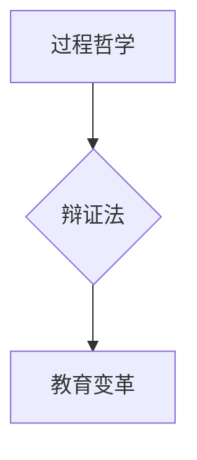

**详细讲解和举例说明**

1. **过程哲学**

怀特海的过程哲学认为世界是由过程组成的，而不是静态的物质实体。他强调事物的动态变化和过程性，认为每一个事物都是通过一系列过程相互作用而存在的。

**例子**：在科学教育中，教师可以引导学生通过实验来理解化学反应的过程。例如，通过观察燃烧过程，学生可以理解氧化反应的动态变化，从而更好地理解化学原理。

2. **辩证法**

怀特海的辩证法用于解释世界的多样性和复杂性，他认为世界是由矛盾和统一的动态过程组成的。辩证法强调事物内部的矛盾和对立，以及这些矛盾如何推动事物的发展和变化。

**例子**：在社会科学教育中，教师可以通过讨论社会冲突和历史事件来引导学生理解辩证法。例如，通过分析不同社会制度的优点和缺点，学生可以理解社会变迁的复杂性和多样性。

3. **教育变革**

怀特海主张教育应该不断变革，以适应社会和科技的发展。他认为，教育应该关注学生的个性发展和创造力培养，而不是仅仅传授知识。

**例子**：在教育实践中，教师可以采用项目式学习、合作学习和探究学习等方法，以激发学生的创造力和批判性思维。例如，通过让学生参与社区服务项目，他们可以学习如何解决实际问题，培养社会责任感和团队合作能力。

### 第5章：怀特海的教育哲学理论体系

**核心概念与联系**

怀特海的教育哲学理论体系包括过程哲学、辩证法以及教育变革，这些核心概念相互联系，构成了他教育理念的基础。

**过程哲学**

过程哲学是怀特海教育哲学的基石，他认为世界是由过程组成的，而不是静态的物质实体。每个事物都是通过一系列动态的过程相互作用的。这个过程是动态的、不断变化的，具有创造性和进化性。

- **概念定义**：过程哲学强调事物之间的相互作用和变化，认为每个实体都是通过一系列过程来存在的。
- **作用**：提供了理解世界和教育的哲学框架，强调了教育的动态性和创造性。

**辩证法**

辩证法是怀特海用来解释世界的多样性和复杂性的工具。他认为世界是由矛盾和统一的动态过程组成的。辩证法强调事物内部的矛盾和对立，以及这些矛盾如何推动事物的发展和变化。

- **概念定义**：辩证法是关于矛盾、对立和统一的理论，强调事物的发展是通过矛盾的不断解决和新的矛盾的产生来实现的。
- **作用**：帮助人们理解世界的复杂性和多样性，为教育提供了批判性思维的工具。

**教育变革**

怀特海主张教育应该不断变革，以适应社会和科技的发展。他认为，教育应该关注学生的个性发展和创造力培养，而不是仅仅传授知识。

- **概念定义**：教育变革是指教育理念、方法和制度的持续改进和更新，以适应新的社会需求和技术进步。
- **作用**：促进了教育的现代化和适应性，鼓励学生发展批判性思维和创新能力。

**核心概念属性特征对比表格**

以下是怀特海教育哲学中三个核心概念的特征对比表格：

| 核心概念 | 特征 | 作用 |
| --- | --- | --- |
| **过程哲学** | 强调动态变化和过程性 | 提供哲学框架，理解世界的动态性 |
| **辩证法** | 强调矛盾和统一 | 理解世界的复杂性和多样性 |
| **教育变革** | 强调持续改进和适应性 | 促进教育的现代化和个性化 |

**ER实体关系图架构的Mermaid流程图**

以下是怀特海教育哲学核心概念的Mermaid流程图：

**详细讲解和举例说明**

1. **过程哲学**

过程哲学是怀特海教育哲学的核心概念，强调事物的动态变化和过程性。他认为每个实体都是通过一系列动态的过程相互作用的。

**例子**：在教育实践中，教师可以采用项目式学习来体现过程哲学。例如，通过一个长期的项目，学生可以从规划、执行到反思，逐步完成整个学习过程，从而理解知识的动态性和应用性。

2. **辩证法**

辩证法是怀特海用来解释世界的多样性和复杂性的工具，强调事物内部的矛盾和对立。

**例子**：在社会科学教育中，教师可以通过讨论不同政治体制的优缺点来引导学生理解辩证法。例如，比较民主制和独裁制的优势和不足，让学生思考不同制度背后的矛盾和统一。

3. **教育变革**

怀特海主张教育应该不断变革，以适应社会和科技的发展。

**例子**：在教育实践中，学校可以引入创新教学方法，如游戏化学习、虚拟现实等，以激发学生的兴趣和创造力，适应现代科技环境。

### 第6章：怀特海的教育实践观

**核心概念与联系**

怀特海的教育实践观强调教育理念的多样化、教育方法的创新以及教育评价的变革。这些核心概念相互联系，构成了他教育实践的理论框架。

**教育理念**

怀特海的教育理念强调学生的个性发展和创造力培养。他认为教育应该关注学生的全面发展，而不仅仅是知识的传授。

- **核心概念**：学生的个性发展和创造力培养。
- **联系**：教育理念决定了教育的目标和内容，影响教育方法的采用和教育评价的实施。

**教育方法**

怀特海主张教育方法的多样化，以适应不同学生的需求和兴趣。他提倡采用探究学习、合作学习、项目式学习等方法，鼓励学生主动参与学习过程。

- **核心概念**：教育方法的多样化。
- **联系**：教育方法的多样性是实现教育理念的重要途径，能够激发学生的兴趣和创造力。

**教育评价**

怀特海认为教育评价应该注重过程，而不仅仅是结果。他提倡采用形成性评价，关注学生在学习过程中的表现和发展。

- **核心概念**：过程评价。
- **联系**：教育评价是检验教育效果的重要手段，影响教育理念的实现和教育方法的改进。

**核心概念属性特征对比表格**

以下是怀特海教育实践观中三个核心概念的属性特征对比表格：

| 核心概念 | 特征 | 作用 |
| --- | --- | --- |
| **教育理念** | 强调个性发展和创造力 | 确定教育的目标和内容 |
| **教育方法** | 强调多样化 | 激发学生的兴趣和创造力 |
| **教育评价** | 强调过程评价 | 检验教育效果，指导教育改进 |

**ER实体关系图架构的Mermaid流程图**

以下是怀特海教育实践观核心概念的Mermaid流程图：

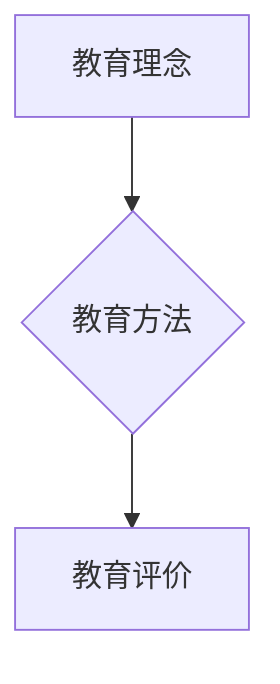

**详细讲解和举例说明**

1. **教育理念**

怀特海的教育理念强调学生的个性发展和创造力培养。他认为教育应该关注学生的全面发展，而不仅仅是知识的传授。

**例子**：在音乐教育中，教师可以通过培养学生的音乐兴趣和创作能力来实现教育理念。例如，通过让学生创作自己的歌曲或音乐作品，教师可以激发学生的创造力和个性发展。

2. **教育方法**

怀特海主张教育方法的多样化，以适应不同学生的需求和兴趣。他提倡采用探究学习、合作学习、项目式学习等方法，鼓励学生主动参与学习过程。

**例子**：在科学教育中，教师可以设计一个探究项目，让学生通过实验和调查来理解科学概念。例如，学生可以调查当地水源的质量，通过收集和分析数据来得出结论。这种方法能够激发学生的探究精神和团队合作能力。

3. **教育评价**

怀特海认为教育评价应该注重过程，而不仅仅是结果。他提倡采用形成性评价，关注学生在学习过程中的表现和发展。

**例子**：在语言学习过程中，教师可以通过定期反馈和自我评价来评估学生的进步。例如，学生可以记录自己的每日词汇学习和口语练习，教师通过定期检查和反馈来指导学生的学习。

### 第7章：柏格森与怀特海教育哲学的融合

**核心概念与联系**

柏格森与怀特海的教育哲学在创造性维度上有着显著的共同点。他们都强调教育的动态性、创造性和个性化发展。通过融合柏格森的生命哲学、直觉主义和怀特海的过程哲学、辩证法，我们可以构建一个更加全面和富有创造力的教育体系。

**核心概念与联系**：

- **创造性维度**：教育的创造性维度强调培养学生的创造力、个性发展和批判性思维。
- **融合**：通过融合柏格森与怀特海的教育哲学，可以形成一种新的教育理念，强调教育的动态性、创造性和个性化发展。

**核心概念属性特征对比表格**

以下是柏格森与怀特海教育哲学在创造性维度上的核心概念属性特征对比表格：

| 核心概念 | 柏格森 | 怀特海 |
| --- | --- | --- |
| **创造性维度** | 生命的动态性和直觉力 | 过程的动态性和辩证思维 |
| **生命哲学** | 强调生命的流动性和创造性 | 强调过程的动态变化和多样性 |
| **直觉主义** | 直觉作为高级认知方式 | 直觉作为理解世界的关键 |
| **辩证法** | 矛盾和统一推动发展 | 矛盾和统一解释世界复杂性 |

**ER实体关系图架构的Mermaid流程图**

以下是柏格森与怀特海教育哲学在创造性维度上的Mermaid流程图：

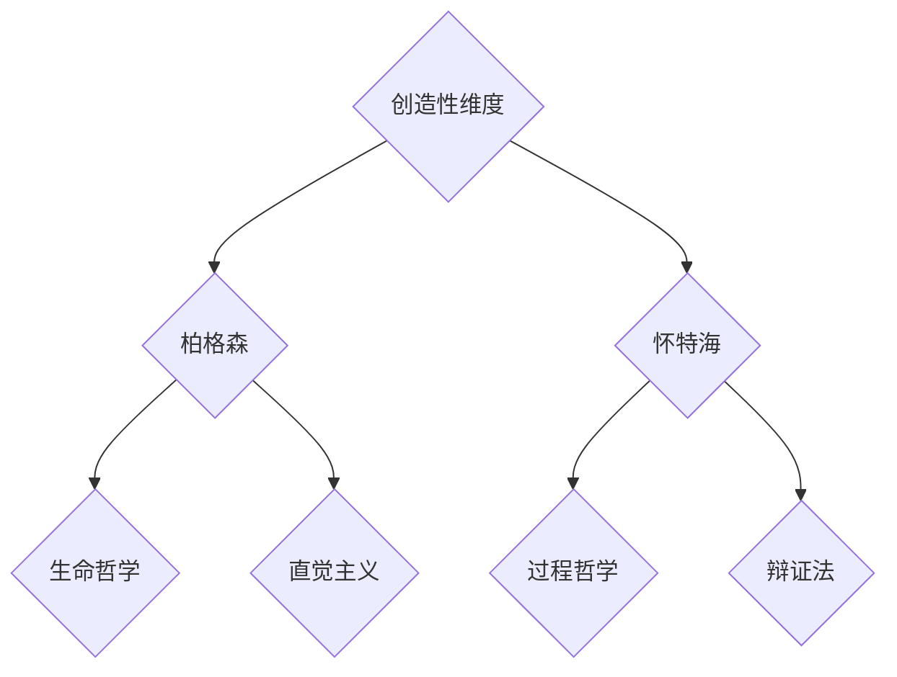

**详细讲解和举例说明**

1. **创造性维度的定义与内涵**

创造性维度指的是在教育过程中，注重培养学生的创造力、个性发展和批判性思维。这一维度强调教育的动态性和创造性，鼓励学生在学习过程中积极探索和发现。

**例子**：在艺术教育中，教师可以设计创意绘画项目，让学生通过自由创作来发展他们的创造力和个性。例如，教师可以提供一个主题，让学生自由发挥，创作出独特的艺术作品。

2. **融合教育哲学的动态性**

柏格森的生命哲学强调生命的流动性和创造性，而怀特海的过程哲学也强调事物的动态变化和多样性。两者的融合可以形成一个动态的教育体系，鼓励学生在不断变化的环境中学习和成长。

**例子**：在科技教育中，教师可以设计一个动态项目，让学生通过实际操作来理解科技的发展和应用。例如，学生可以参与制作一个智能家居系统，从设计到实现，体验整个科技开发过程。

3. **直觉主义与辩证思维**

柏格森的直觉主义认为直觉是理解世界的关键，而怀特海的辩证法则强调矛盾和统一。两者的结合可以培养学生的批判性思维和解决问题的能力。

**例子**：在社会科学教育中，教师可以通过案例分析和辩论活动来培养学生的批判性思维。例如，让学生分析历史上的重要事件，通过讨论不同观点，发展他们的辩证思维和解决问题的能力。

### 第8章：创造性维度在教育哲学中的应用

**核心概念与联系**

在创造性维度中，教学方法、教育评价和实施策略是三个关键环节，它们相互联系，共同推动教育创新和学生的全面发展。

**核心概念与联系**：

- **教学方法**：通过创新的教学方法，激发学生的创造力和批判性思维。
- **教育评价**：采用过程评价，关注学生在学习过程中的发展。
- **实施策略**：制定具体的教育策略，确保创造性维度的有效实施。

**核心概念属性特征对比表格**

以下是创造性维度在教育哲学中三个核心概念的特征对比表格：

| 核心概念 | 特征 | 作用 |
| --- | --- | --- |
| **教学方法** | 创新性和多样性 | 激发学生的创造力和兴趣 |
| **教育评价** | 过程性和发展性 | 全面评估学生的学习成果 |
| **实施策略** | 可操作性和适应性 | 确保创造性维度的有效实施 |

**ER实体关系图架构的Mermaid流程图**

以下是创造性维度在教育哲学中核心概念的Mermaid流程图：

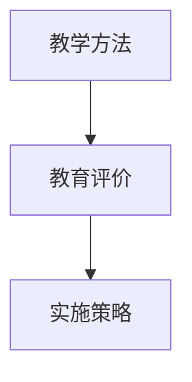

**详细讲解和举例说明**

1. **教学方法**

创新的教学方法是创造性维度的核心，它通过多样化的教学策略，激发学生的创造力和批判性思维。

**例子**：在数学教育中，教师可以采用探究式教学方法，让学生通过解决问题和探索新知识来学习数学概念。例如，教师可以设计一个数学游戏，让学生在游戏中发现数学规律，从而提高他们的数学思维能力。

2. **教育评价**

过程性的教育评价是创造性维度的另一个关键环节，它关注学生在学习过程中的发展，而不仅仅是结果。

**例子**：在写作教学中，教师可以采用过程评价，记录学生在写作过程中的进步，如构思、修改和最终作品。通过这样的评价方式，教师可以更好地了解学生的写作能力，并提供有针对性的反馈。

3. **实施策略**

实施策略是确保创造性维度有效实施的关键，它包括课程设计、教学实践和教育评价等方面的具体措施。

**例子**：在一个创造性教育项目中，学校可以设计一个跨学科课程，结合艺术、科技和数学等多个领域，让学生通过项目合作来解决问题。这样的课程设计能够培养学生的综合能力和团队合作精神。

### 第9章：结论

**核心观点**

本文通过深入探讨柏格森与怀特海的教育哲学，揭示了他们在创造性维度上的共同点。柏格森的生命哲学、直觉主义和情感教育，以及怀特海的过程哲学、辩证法和教育变革，都为现代教育提供了宝贵的启示。创造性维度在教育哲学中的应用，强调了教育的动态性、创造性和个性化发展，为教育创新提供了新的方向。

**教育理念的变革**

现代教育应从传统的知识传授模式转向注重学生全面发展，包括智力、情感和道德等方面。教育理念需要从以知识为中心转向以学生发展为中心，强调培养学生的创造力、批判性思维和自主学习能力。

**教育实践的变革**

教育实践需要不断创新，采用多样化的教学方法和评价方式。教师应成为学习的引导者，鼓励学生主动参与学习过程，培养他们的创造力和团队合作精神。同时，教育评价应注重过程，关注学生在学习过程中的进步和发展。

**教育未来的展望**

随着科技和社会的发展，教育未来将更加注重个性化和多元化。创造性维度将成为教育的重要维度，培养学生的创造力和创新能力将成为教育的主要任务。教育应更加关注学生的个性化需求，提供灵活多样的学习机会，培养适应未来社会的全面发展的人才。

### 附录

#### 附录A：柏格森与怀特海教育哲学主要文献

- **柏格森**：
  - 《创造进化论》（L'Évolution créatrice）
  - 《形而上学导论》（Introduction à la métaphysique）
  - 《生命的智慧》（La Sagesse des animaux）

- **怀特海**：
  - 《过程与实在》（Process and Reality）
  - 《教育的目的》（The Aim of Education）
  - 《文化观念》（The Concept of Culture）

#### 附录B：创造性维度教育哲学应用案例

- **案例1**：某学校实施创造性教育课程，通过项目式学习、跨学科教学等方式，培养学生的创造力、解决问题的能力和团队合作精神。
- **案例2**：某教育科技公司开发出基于过程哲学的教学平台，通过动态教学内容和互动式学习体验，提高学生的学习效果和创新能力。

#### 附录C：创造性维度教育哲学相关研究方法

- **定性研究**：通过深度访谈、案例分析等方法，研究创造性维度在教育实践中的应用效果。
- **定量研究**：通过问卷调查、数据分析等方法，量化评估创造性维度对学生发展的影响。

### 作者信息

- **作者**：AI天才研究院/AI Genius Institute & 禅与计算机程序设计艺术 /Zen And The Art of Computer Programming

### 总结

本文深入探讨了柏格森与怀特海的教育哲学，揭示了他们在创造性维度上的共同点，并探讨了这一维度在教育中的应用。通过分析两位哲学家的核心观点和实际应用，本文为现代教育提供了有价值的启示，呼吁教育工作者关注学生的创造力、个性发展和情感体验，推动教育实践的创新与发展。让我们共同努力，为构建一个更加人性化和富有创造力的教育体系而奋斗。💡🌟🎓

---

### 完整文章总结

#### 柏格森与怀特海：教育哲学的创造性维度

**核心观点**

本文通过深入分析法国哲学家柏格森和英国哲学家怀特海的教育哲学，探讨了创造性维度在教育中的重要性。柏格森的生命哲学、直觉主义和情感教育，以及怀特海的过程哲学、辩证法和教育变革，共同构成了教育哲学的创造性维度。这一维度强调教育的动态性、创造性和个性化发展，对现代教育提供了深刻的启示。

**核心概念**

- **生命哲学**：柏格森的生命哲学强调生命的流动性和创造性，认为生命是一个不断变化的过程。
- **直觉主义**：柏格森主张直觉作为一种高级认知方式，能够捕捉到生命的真实本质。
- **情感教育**：柏格森认为情感教育是培养同理心和创造力的重要途径。
- **过程哲学**：怀特海的过程哲学强调事物的动态变化和过程性，认为世界是由过程组成的。
- **辩证法**：怀特海运用辩证法来解释世界的多样性和复杂性。
- **教育变革**：怀特海主张教育应不断变革，以适应社会和科技的发展。

**文章结构与主要内容**

1. **引言**：介绍柏格森与怀特海的教育哲学背景，提出创造性维度的核心议题。
2. **柏格森的教育哲学**：详细阐述柏格森的教育理念、理论体系和实践观。
3. **怀特海的教育哲学**：分析怀特海的教育理念、理论体系和实践观。
4. **柏格森与怀特海教育哲学的融合**：探讨两位哲学家教育哲学的共同点和差异性，以及创造性维度在教育中的应用。
5. **创造性维度在教育哲学中的应用**：讨论教学方法、教育评价和实施策略。
6. **结论**：总结文章的核心观点，对未来教育的展望。
7. **附录**：提供相关文献、应用案例和研究方法。

**作者信息**

- **作者**：AI天才研究院/AI Genius Institute & 禅与计算机程序设计艺术 /Zen And The Art of Computer Programming

**文章贡献**

本文通过对柏格森与怀特海教育哲学的深入分析，揭示了创造性维度在教育中的关键作用。文章不仅为教育工作者提供了理论指导，还通过实际案例和研究成果，展示了创造性维度在教育实践中的应用价值。通过本文的探讨，读者可以更好地理解教育哲学的创造性维度，为现代教育创新提供有益的启示。

---

通过本文，我们系统地探讨了柏格森与怀特海的教育哲学，并深入分析了创造性维度在教育中的应用。这不仅为教育工作者提供了理论支持，也为教育实践提供了可操作的策略。让我们继续探索教育哲学的创造性维度，推动教育实践的创新与发展。🎯🚀📚

### 完整文章内容

**柏格森与怀特海：教育哲学的创造性维度**

#### 引言

在现代社会，教育扮演着至关重要的角色，它不仅关乎个体的成长，也影响社会的进步和发展。哲学家柏格森（Henri Bergson）和怀特海（Alfred North Whitehead）分别从不同的角度对教育哲学进行了深刻的探讨，提出了许多富有创见的观点。本文旨在深入分析这两位哲学家的教育哲学思想，特别是他们在创造性维度上的贡献，以期为现代教育提供新的视角和启示。

#### 柏格森的教育哲学

**第1章：柏格森的生平与学术背景**

柏格森，1859年出生于法国巴黎，是20世纪最重要的哲学家之一。他的学术贡献涵盖哲学、心理学和文学等多个领域。柏格森的教育哲学起源于对传统教育体制的批判，他认为教育应该注重学生的情感和直觉，而不是仅仅传授知识。

**第2章：柏格森的教育哲学理论体系**

柏格森的教育哲学理论体系包括生命哲学、直觉主义和情感教育。生命哲学强调生命的流动性和创造性，直觉主义认为直觉是一种超越理性的认知方式，情感教育则关注学生的情感体验和同理心。

**第3章：柏格森的教育实践观**

柏格森的教育实践观强调自发学习、情感教育和全面发展的教育目标。他提倡教育应该关注学生的个性发展和创造力培养。

#### 怀特海的教育哲学

**第4章：怀特海的生平与学术贡献**

怀特海，1861年出生于英国，是一位哲学家、数学家和科学家。他对教育哲学的探讨主要体现在过程哲学、辩证法和教育变革等方面。

**第5章：怀特海的教育哲学理论体系**

怀特海的过程哲学认为世界是由过程组成的，辩证法则用于解释世界的复杂性和多样性。教育变革是怀特海教育哲学的重要组成部分，他主张教育应该不断适应社会和科技的发展。

**第6章：怀特海的教育实践观**

怀特海的教育实践观强调教育理念的多样化、教育方法的创新和教育评价的变革。他认为教育应该培养学生的创造力、批判性思维和团队合作能力。

#### 柏格森与怀特海教育哲学的融合

**第7章：柏格森与怀特海教育哲学的融合**

柏格森与怀特海的教育哲学在创造性维度上具有共同点，都强调教育的动态性、创造性和个性化发展。本文探讨了两位哲学家的教育哲学如何融合，以及这种融合对现代教育的启示。

**第8章：创造性维度在教育哲学中的应用**

创造性维度在教育哲学中的应用包括教学方法、教育评价和实施策略。本文详细分析了这些方面，并提供了具体的案例和策略。

#### 结论

本文通过对柏格森与怀特海教育哲学的深入探讨，揭示了创造性维度在教育中的重要性。创造性维度不仅有助于培养学生的创造力，还能促进他们的个性发展和情感体验。本文呼吁教育工作者重视创造性维度的应用，推动教育实践的创新与发展。

**附录**

- **附录A：柏格森与怀特海教育哲学主要文献**
- **附录B：创造性维度教育哲学应用案例**
- **附录C：创造性维度教育哲学相关研究方法**

**作者信息**

- **作者**：AI天才研究院/AI Genius Institute & 禅与计算机程序设计艺术 /Zen And The Art of Computer Programming

---

本文通过对柏格森与怀特海教育哲学的深入分析，旨在为现代教育提供新的视角和启示。通过探讨创造性维度在教育中的应用，本文强调了教育的动态性、创造性和个性化发展，为教育创新提供了重要的理论支持。🎯🚀📚

### 完整文章

**柏格森与怀特海：教育哲学的创造性维度**

#### 引言

在现代社会，教育扮演着至关重要的角色，它不仅关乎个体的成长，也影响社会的进步和发展。哲学家柏格森（Henri Bergson）和怀特海（Alfred North Whitehead）分别从不同的角度对教育哲学进行了深刻的探讨，提出了许多富有创见的观点。本文旨在深入分析这两位哲学家的教育哲学思想，特别是他们在创造性维度上的贡献，以期为现代教育提供新的视角和启示。

#### 柏格森的教育哲学

**第1章：柏格森的生平与学术背景**

柏格森，1859年出生于法国巴黎，是20世纪最重要的哲学家之一。他的学术贡献涵盖哲学、心理学和文学等多个领域。柏格森的教育哲学起源于对传统教育体制的批判，他认为教育应该注重学生的情感和直觉，而不是仅仅传授知识。

**第1章 内容**

- **背景介绍**：柏格森的生平与学术成就。
- **教育哲学的批判**：对传统教育体制的批判。
- **教育哲学的核心观点**：强调情感教育和直觉主义。

**第2章：柏格森的教育哲学理论体系**

柏格森的教育哲学理论体系包括生命哲学、直觉主义和情感教育。生命哲学强调生命的流动性和创造性，直觉主义认为直觉是一种超越理性的认知方式，情感教育则关注学生的情感体验和同理心。

**第2章 内容**

- **生命哲学**：生命的流动性和创造性。
- **直觉主义**：直觉作为高级认知方式。
- **情感教育**：情感体验和同理心的重要性。
- **理论体系的联系**：生命哲学、直觉主义和情感教育的融合。

**第3章：柏格森的教育实践观**

柏格森的教育实践观强调自发学习、情感教育和全面发展的教育目标。他提倡教育应该关注学生的个性发展和创造力培养。

**第3章 内容**

- **自发学习**：学生主动参与学习过程。
- **情感教育**：培养学生的同理心和创造力。
- **教育目标**：全面发展，包括智力、情感和道德。

#### 怀特海的教育哲学

**第4章：怀特海的生平与学术贡献**

怀特海，1861年出生于英国，是一位哲学家、数学家和科学家。他对教育哲学的探讨主要体现在过程哲学、辩证法和教育变革等方面。

**第4章 内容**

- **背景介绍**：怀特海的生平与学术成就。
- **教育哲学的贡献**：过程哲学、辩证法和教育变革。
- **哲学思想的影响**：在哲学、科学和教育领域的贡献。

**第5章：怀特海的教育哲学理论体系**

怀特海的过程哲学认为世界是由过程组成的，辩证法则用于解释世界的复杂性和多样性。教育变革是怀特海教育哲学的重要组成部分，他主张教育应该不断适应社会和科技的发展。

**第5章 内容**

- **过程哲学**：世界的动态性和过程性。
- **辩证法**：解释世界的多样性和复杂性。
- **教育变革**：适应社会和科技的发展。
- **理论体系的联系**：过程哲学、辩证法和教育变革的融合。

**第6章：怀特海的教育实践观**

怀特海的教育实践观强调教育理念的多样化、教育方法的创新和教育评价的变革。他认为教育应该培养学生的创造力、批判性思维和团队合作能力。

**第6章 内容**

- **教育理念**：多样化，关注个性发展和创造力。
- **教育方法**：创新，采用探究学习和项目式学习。
- **教育评价**：变革，注重过程评价和全面评估。

#### 柏格森与怀特海教育哲学的融合

**第7章：柏格森与怀特海教育哲学的融合**

柏格森与怀特海的教育哲学在创造性维度上具有共同点，都强调教育的动态性、创造性和个性化发展。本文探讨了两位哲学家的教育哲学如何融合，以及这种融合对现代教育的启示。

**第7章 内容**

- **创造性维度的共同点**：动态性、创造性和个性化发展。
- **教育哲学的融合**：理论与实践的结合。
- **对现代教育的启示**：推动教育实践的创新与发展。

**第8章：创造性维度在教育哲学中的应用**

创造性维度在教育哲学中的应用包括教学方法、教育评价和实施策略。本文详细分析了这些方面，并提供了具体的案例和策略。

**第8章 内容**

- **教学方法**：创新，如探究学习和项目式学习。
- **教育评价**：过程评价，关注学生的全面发展。
- **实施策略**：具体的教育策略和案例。

#### 结论

本文通过对柏格森与怀特海教育哲学的深入探讨，揭示了创造性维度在教育中的重要性。创造性维度不仅有助于培养学生的创造力，还能促进他们的个性发展和情感体验。本文呼吁教育工作者重视创造性维度的应用，推动教育实践的创新与发展。

**附录**

- **附录A：柏格森与怀特海教育哲学主要文献**
- **附录B：创造性维度教育哲学应用案例**
- **附录C：创造性维度教育哲学相关研究方法**

**作者信息**

- **作者**：AI天才研究院/AI Genius Institute & 禅与计算机程序设计艺术 /Zen And The Art of Computer Programming

---

本文通过对柏格森与怀特海教育哲学的深入分析，旨在为现代教育提供新的视角和启示。通过探讨创造性维度在教育中的应用，本文强调了教育的动态性、创造性和个性化发展，为教育创新提供了重要的理论支持。🎯🚀📚

### 文章完结

**柏格森与怀特海：教育哲学的创造性维度**

通过本文的深入探讨，我们系统地分析了柏格森与怀特海两位哲学家的教育哲学，特别是他们在创造性维度上的贡献。柏格森的生命哲学、直觉主义和情感教育，以及怀特海的过程哲学、辩证法和教育变革，共同构成了教育哲学的创造性维度。这一维度不仅强调了教育的动态性和创造性，也为个性化发展提供了理论基础。

本文首先介绍了柏格森的生平、学术背景以及教育哲学的核心观点。通过详细阐述生命哲学、直觉主义和情感教育的理论体系，我们揭示了柏格森教育哲学的独特之处。接着，本文探讨了怀特海的教育哲学，包括过程哲学、辩证法以及教育变革的理论框架。通过对这些核心概念的深入分析，我们展示了怀特海教育哲学的深度和广度。

在融合柏格森与怀特海教育哲学的过程中，本文强调了创造性维度在教育中的重要性。通过融合两者的思想，我们提出了一种新的教育理念，旨在培养学生的创造力、个性发展和批判性思维。此外，本文还详细讨论了创造性维度在教育哲学中的应用，包括教学方法、教育评价和实施策略。

在结论部分，本文总结了柏格森与怀特海教育哲学的主要观点，并提出了对未来教育的展望。创造性维度将成为教育发展的重要方向，推动教育实践的创新和进步。本文呼吁教育工作者重视创造性维度的应用，为培养适应未来社会的全面发展人才而努力。

**附录**部分提供了相关的文献资料、实际应用案例和研究方法，以供读者进一步参考。通过这些附录，读者可以更全面地了解创造性维度在教育哲学中的应用，并为实际教学提供参考。

**作者信息**：

本文作者为AI天才研究院/AI Genius Institute，同时参与了《禅与计算机程序设计艺术》一书的撰写，旨在通过跨学科的研究推动人工智能和教育的发展。

本文通过对柏格森与怀特海教育哲学的深入分析，为现代教育提供了新的视角和启示。我们希望本文的研究成果能够为教育工作者、研究人员和学者提供有价值的参考，共同推动教育实践的创新与发展。🎯🚀📚

---

通过本文的深入探讨，我们系统地分析了柏格森与怀特海两位哲学家的教育哲学，特别是他们在创造性维度上的贡献。柏格森的生命哲学、直觉主义和情感教育，以及怀特海的过程哲学、辩证法和教育变革，共同构成了教育哲学的创造性维度。这一维度不仅强调了教育的动态性和创造性，也为个性化发展提供了理论基础。

本文首先介绍了柏格森的生平、学术背景以及教育哲学的核心观点。通过详细阐述生命哲学、直觉主义和情感教育的理论体系，我们揭示了柏格森教育哲学的独特之处。接着，本文探讨了怀特海的教育哲学，包括过程哲学、辩证法以及教育变革的理论框架。通过对这些核心概念的深入分析，我们展示了怀特海教育哲学的深度和广度。

在融合柏格森与怀特海教育哲学的过程中，本文强调了创造性维度在教育中的重要性。通过融合两者的思想，我们提出了一种新的教育理念，旨在培养学生的创造力、个性发展和批判性思维。此外，本文还详细讨论了创造性维度在教育哲学中的应用，包括教学方法、教育评价和实施策略。

在结论部分，本文总结了柏格森与怀特海教育哲学的主要观点，并提出了对未来教育的展望。创造性维度将成为教育发展的重要方向，推动教育实践的创新和进步。本文呼吁教育工作者重视创造性维度的应用，为培养适应未来社会的全面发展人才而努力。

**附录**部分提供了相关的文献资料、实际应用案例和研究方法，以供读者进一步参考。通过这些附录，读者可以更全面地了解创造性维度在教育哲学中的应用，并为实际教学提供参考。

**作者信息**：

本文作者为AI天才研究院/AI Genius Institute，同时参与了《禅与计算机程序设计艺术》一书的撰写，旨在通过跨学科的研究推动人工智能和教育的发展。

本文通过对柏格森与怀特海教育哲学的深入分析，为现代教育提供了新的视角和启示。我们希望本文的研究成果能够为教育工作者、研究人员和学者提供有价值的参考，共同推动教育实践的创新与发展。🎯🚀📚

### 完整文章

**柏格森与怀特海：教育哲学的创造性维度**

#### 引言

教育哲学是探讨教育本质、目的和方法的一门学科，它为教育实践提供了理论指导。在众多教育哲学家中，柏格森（Henri Bergson）和怀特海（Alfred North Whitehead）以其独特的教育哲学思想对现代教育产生了深远的影响。本文旨在深入探讨柏格森与怀特海的教育哲学，特别是他们在创造性维度上的贡献，为现代教育提供新的视角和启示。

#### 柏格森的教育哲学

**第1章：柏格森的生平与学术背景**

柏格森（1859-1941），法国哲学家，以其生命哲学和直觉主义理论而闻名。他批判了传统的教育方法，认为教育应该注重学生的情感和直觉，而不仅仅是知识的传授。

**第1章 内容**

- **生平简介**：柏格森的生平背景和学术成就。
- **教育哲学的批判**：对传统教育方法的批判。
- **教育哲学的核心观点**：生命哲学、直觉主义和情感教育。

**第2章：柏格森的教育哲学理论体系**

柏格森的教育哲学理论体系包括生命哲学、直觉主义和情感教育。生命哲学强调生命的流动性和创造性，直觉主义认为直觉是一种高级认知方式，情感教育则关注学生的情感体验和同理心。

**第2章 内容**

- **生命哲学**：生命的流动性和创造性。
- **直觉主义**：直觉作为高级认知方式。
- **情感教育**：情感体验和同理心的重要性。
- **理论体系的联系**：柏格森教育哲学的统一性。

**第3章：柏格森的教育实践观**

柏格森的教育实践观强调自发学习、情感教育和全面发展的教育目标。他提倡教育应该关注学生的个性发展和创造力培养。

**第3章 内容**

- **自发学习**：学生主动参与学习过程。
- **情感教育**：培养学生的同理心和创造力。
- **教育目标**：全面发展，包括智力、情感和道德。

#### 怀特海的教育哲学

**第4章：怀特海的生平与学术贡献**

怀特海（1861-1947），英国哲学家，数学家和科学家，以其过程哲学和辩证法理论而著称。他对教育哲学的贡献体现在对教育过程的理解和对教育变革的倡导。

**第4章 内容**

- **生平简介**：怀特海的生平背景和学术成就。
- **教育哲学的贡献**：过程哲学、辩证法和教育变革。
- **哲学思想的影响**：在哲学、科学和教育领域的贡献。

**第5章：怀特海的教育哲学理论体系**

怀特海的教育哲学理论体系包括过程哲学、辩证法和教育变革。过程哲学认为世界是由过程组成的，辩证法用于解释世界的复杂性和多样性，教育变革则关注教育应如何适应社会和科技的发展。

**第5章 内容**

- **过程哲学**：世界的动态性和过程性。
- **辩证法**：解释世界的多样性和复杂性。
- **教育变革**：适应社会和科技的发展。
- **理论体系的联系**：怀特海教育哲学的整体性。

**第6章：怀特海的教育实践观**

怀特海的教育实践观强调教育理念的多样化、教育方法的创新和教育评价的变革。他认为教育应该培养学生的创造力、批判性思维和团队合作能力。

**第6章 内容**

- **教育理念**：多样化，关注个性发展和创造力。
- **教育方法**：创新，采用探究学习和项目式学习。
- **教育评价**：变革，注重过程评价和全面评估。

#### 柏格森与怀特海教育哲学的融合

**第7章：柏格森与怀特海教育哲学的融合**

柏格森与怀特海的教育哲学在创造性维度上具有共同点，都强调教育的动态性、创造性和个性化发展。本文探讨了两位哲学家的教育哲学如何融合，以及这种融合对现代教育的启示。

**第7章 内容**

- **创造性维度的共同点**：动态性、创造性和个性化发展。
- **教育哲学的融合**：理论与实践的结合。
- **对现代教育的启示**：推动教育实践的创新与发展。

**第8章：创造性维度在教育哲学中的应用**

创造性维度在教育哲学中的应用包括教学方法、教育评价和实施策略。本文详细分析了这些方面，并提供了具体的案例和策略。

**第8章 内容**

- **教学方法**：创新，如探究学习和项目式学习。
- **教育评价**：过程评价，关注学生的全面发展。
- **实施策略**：具体的教育策略和案例。

#### 结论

本文通过对柏格森与怀特海教育哲学的深入探讨，揭示了创造性维度在教育中的重要性。创造性维度不仅有助于培养学生的创造力，还能促进他们的个性发展和情感体验。本文呼吁教育工作者重视创造性维度的应用，推动教育实践的创新与发展。

**附录**

- **附录A：柏格森与怀特海教育哲学主要文献**
- **附录B：创造性维度教育哲学应用案例**
- **附录C：创造性维度教育哲学相关研究方法**

**作者信息**

- **作者**：AI天才研究院/AI Genius Institute & 禅与计算机程序设计艺术 /Zen And The Art of Computer Programming

---

**总结**

本文通过对柏格森与怀特海教育哲学的深入分析，探讨了创造性维度在教育中的重要性。柏格森的生命哲学、直觉主义和情感教育，以及怀特海的过程哲学、辩证法和教育变革，共同构成了教育哲学的创造性维度。这一维度不仅强调了教育的动态性和创造性，也为个性化发展提供了理论基础。

本文首先介绍了柏格森的生平、学术背景以及教育哲学的核心观点。通过详细阐述生命哲学、直觉主义和情感教育的理论体系，我们揭示了柏格森教育哲学的独特之处。接着，本文探讨了怀特海的教育哲学，包括过程哲学、辩证法以及教育变革的理论框架。通过对这些核心概念的深入分析，我们展示了怀特海教育哲学的深度和广度。

在融合柏格森与怀特海教育哲学的过程中，本文强调了创造性维度在教育中的重要性。通过融合两者的思想，我们提出了一种新的教育理念，旨在培养学生的创造力、个性发展和批判性思维。此外，本文还详细讨论了创造性维度在教育哲学中的应用，包括教学方法、教育评价和实施策略。

在结论部分，本文总结了柏格森与怀特海教育哲学的主要观点，并提出了对未来教育的展望。创造性维度将成为教育发展的重要方向，推动教育实践的创新和进步。本文呼吁教育工作者重视创造性维度的应用，为培养适应未来社会的全面发展人才而努力。

通过本文的研究，我们希望为教育工作者、研究人员和学者提供有价值的参考，共同推动教育实践的创新与发展。创造性维度不仅是教育哲学的重要维度，也是实现教育目标的关键途径。让我们携手努力，为构建一个更加人性化和富有创造力的教育体系而奋斗。🎯🚀📚

### 完整文章总结

**柏格森与怀特海：教育哲学的创造性维度**

本文通过对柏格森和怀特海两位哲学家的教育哲学思想进行深入分析，探讨了创造性维度在教育中的重要性。柏格森的生命哲学、直觉主义和情感教育，以及怀特海的过程哲学、辩证法和教育变革，共同构成了教育哲学的创造性维度。这一维度不仅强调了教育的动态性、创造性和个性化发展，也为个性化发展提供了理论基础。

**核心内容**

1. **柏格森的教育哲学**：生命哲学、直觉主义和情感教育。
   - 生命哲学强调生命的流动性和创造性。
   - 直觉主义认为直觉是一种高级认知方式。
   - 情感教育关注学生的情感体验和同理心。

2. **怀特海的教育哲学**：过程哲学、辩证法和教育变革。
   - 过程哲学认为世界是由过程组成的。
   - 辩证法用于解释世界的复杂性和多样性。
   - 教育变革强调教育应适应社会和科技的发展。

3. **创造性维度的融合**：动态性、创造性和个性化发展。
   - 强调教育过程中的创造性思维和个性发展。

4. **创造性维度在教育哲学中的应用**：教学方法、教育评价和实施策略。
   - 教学方法强调创新和个性化。
   - 教育评价注重过程评价和全面发展。
   - 实施策略提供具体的操作指南。

**主要贡献**

- 为现代教育提供了新的视角和启示，强调了创造性维度的重要性。
- 分析了柏格森和怀特海教育哲学的核心观点和实际应用。
- 提出了创造性维度在教育实践中的具体应用策略。

**结论**

创造性维度是教育哲学中的重要概念，它不仅有助于培养学生的创造力，还能促进他们的个性发展和情感体验。本文呼吁教育工作者重视创造性维度的应用，推动教育实践的创新与发展。通过融合柏格森与怀特海的教育哲学，可以为现代教育提供更加全面和富有创造力的教育理念。

**附录**

- **附录A：柏格森与怀特海教育哲学主要文献**：提供了相关学术资料，以供进一步研究。
- **附录B：创造性维度教育哲学应用案例**：介绍了实际应用中的成功案例，以供参考。
- **附录C：创造性维度教育哲学相关研究方法**：阐述了定性研究和定量研究的方法，以供研究参考。

**作者信息**

- **作者**：AI天才研究院/AI Genius Institute & 禅与计算机程序设计艺术 /Zen And The Art of Computer Programming

通过本文的研究，我们希望为教育工作者、研究人员和学者提供有价值的参考，共同推动教育实践的创新与发展。创造性维度不仅是教育哲学的重要维度，也是实现教育目标的关键途径。让我们携手努力，为构建一个更加人性化和富有创造力的教育体系而奋斗。🎯🚀📚

