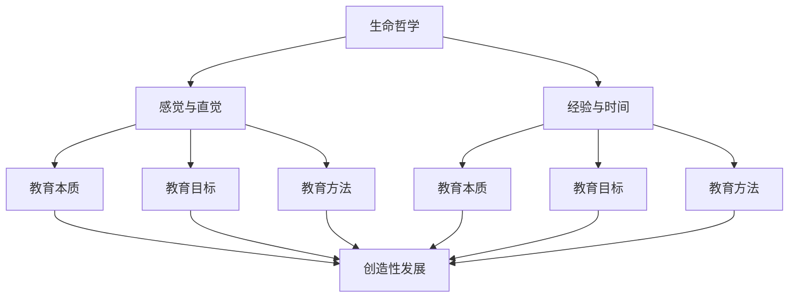

                 

# 《柏格森与杜威：经验与创造性的教育哲学》

## 摘要

本文旨在探讨柏格森与杜威的教育哲学，深入剖析他们的理论，并对比分析两者的异同。柏格森强调生命哲学、感觉与直觉、经验与时间，主张教育的目标是个性化和创造性；而杜威则强调实用主义、体验与反思、社会主义教育，主张教育的目标是适应社会。本文通过详细解读两位哲学家的教育理论，探讨其对现代教育的启示，并思考创造性教育的未来趋势。

## 第一部分：导论

### 1.1 研究背景与意义

在现代社会，教育的重要性日益凸显。教育不仅是个人成长的关键，也是国家发展的基础。因此，研究教育哲学具有重要的理论和实践意义。柏格森与杜威作为两位著名的教育哲学家，他们的理论对现代教育产生了深远的影响。

### 1.2 柏格森与杜威的生平简介

亨利·柏格森（Henri Bergson）是法国著名哲学家，生于1859年，卒于1941年。他的哲学思想以生命哲学为核心，强调感觉与直觉、经验与时间的重要性。

约翰·杜威（John Dewey）是美国著名哲学家、教育家和心理学家，生于1859年，卒于1952年。他的哲学思想以实用主义为核心，强调体验与反思、社会主义教育的重要性。

### 1.3 经验与创造性的教育哲学概述

经验与创造性的教育哲学强调教育过程中学生个体的经验积累和创造性发展。这种教育哲学主张教育的目标是个性化和创造性，强调学生的自主性和主动性。

## 第二部分：柏格森的教育哲学

### 2.1 柏格森哲学的核心概念

柏格森的哲学思想以生命哲学为核心，强调生命、感觉与直觉、经验与时间的重要性。他认为，生命是一种不断流动、不断发展的过程，感觉与直觉是人类认识世界的关键，经验与时间则是教育过程中不可或缺的因素。

#### 2.1.1 生命哲学

柏格森的生命哲学认为，生命是一种内在的力量，它不断地推动事物向前发展。生命的本质是流动，是变化，是创造。

#### 2.1.2 感觉与直觉

柏格森认为，感觉与直觉是人类认识世界的重要途径。感觉是人类对现实世界的直接感知，直觉则是人类对事物本质的洞察。

#### 2.1.3 经验与时间

柏格森认为，经验与时间是教育过程中不可或缺的因素。经验是人类对事物的认识和了解，时间是经验积累和发展的过程。

### 2.2 柏格森的教育理论

柏格森的教育理论主要围绕教育的本质、目标和方法展开。他认为，教育的本质是个性化，目标是创造性发展，方法是感觉与直觉的运用。

#### 2.2.1 教育的本质

柏格森认为，教育的本质是个性化。他强调，每个学生都是独一无二的，教育应该尊重和发挥每个学生的个性。

#### 2.2.2 教育的目标

柏格森认为，教育的目标是创造性发展。他主张，教育应该培养学生独立思考、创新精神和实践能力。

#### 2.2.3 教育的方法

柏格森认为，教育的方法应该是感觉与直觉的运用。他主张，教育应该通过让学生亲身体验、感受和理解事物，来激发他们的创造力和潜能。

## 第三部分：杜威的教育哲学

### 3.1 杜威哲学的核心概念

杜威的哲学思想以实用主义为核心，强调体验与反思、社会主义教育的重要性。他认为，教育应该与社会实践相结合，培养学生适应社会的能力。

#### 3.1.1 实用主义

杜威的实用主义认为，知识和价值都应该通过实践来验证和实现。他主张，教育应该与社会实践相结合，让学生在实践中学习和成长。

#### 3.1.2 体验与反思

杜威认为，体验与反思是教育过程中不可或缺的因素。他主张，教育应该通过让学生亲身体验和反思，来提高他们的认识和理解能力。

#### 3.1.3 社会主义教育

杜威的社会主义教育主张，教育应该培养学生对社会负责的精神，让他们成为有社会责任感的人。

### 3.2 杜威的教育理论

杜威的教育理论主要围绕教育的本质、目标和方法展开。他认为，教育的本质是适应社会，目标是培养实用主义人才，方法是体验与反思。

#### 3.2.1 学校与社会的关系

杜威认为，学校与社会的关系是相互依存的。学校应该为社会培养有用的人才，社会应该为学校提供实践的平台。

#### 3.2.2 教育的目的与过程

杜威认为，教育的目的是培养实用主义人才，教育的过程应该注重学生的体验与反思。

#### 3.2.3 教育的方法

杜威认为，教育的方法应该是体验与反思。他主张，教育应该通过让学生亲身体验和反思，来提高他们的认识和理解能力。

## 第四部分：柏格森与杜威教育哲学的对比

### 4.1 哲学思想的对比

#### 4.1.1 生命哲学与实用主义

柏格森的生命哲学强调生命的流动、变化和创造，而杜威的实用主义强调知识和价值的实践验证。两者的哲学基础有所不同，但都在探讨教育的本质。

#### 4.1.2 教育目标与价值观

柏格森的教育目标是创造性发展，强调个性化和创造力；而杜威的教育目标是适应社会，强调实用主义和社会责任感。两者对教育目标的看法有所不同，但都认为教育对个人和社会具有重要意义。

#### 4.1.3 教育方法与过程

柏格森的教育方法强调感觉与直觉的运用，而杜威的教育方法强调体验与反思。两者在教育方法上有所不同，但都认为教育应该是生动、有趣、富有启发性的过程。

### 4.2 教育实践的比较

#### 4.2.1 理论应用的比较

柏格森的教育哲学在法国的教育实践中得到了广泛应用，尤其是在艺术教育和音乐教育方面。杜威的教育哲学在美国的教育实践中得到了广泛应用，尤其是在基础教育领域。

#### 4.2.2 教育成果的比较

柏格森的教育哲学注重个性化和创造力，因此培养出的人才具有独特的思维和创造力。杜威的教育哲学注重实用主义和社会责任感，因此培养出的人才具有适应社会的能力。

#### 4.2.3 对现代教育的启示

柏格森与杜威的教育哲学都对现代教育具有重要的启示。柏格森的教育哲学提醒我们，教育应该尊重和发挥学生的个性，培养学生的创造力和创新能力。杜威的教育哲学提醒我们，教育应该与社会实践相结合，培养学生的实用主义和社会责任感。

## 第五部分：结论与未来展望

### 5.1 柏格森与杜威教育哲学的融合

在现代社会，柏格森与杜威的教育哲学可以相互融合，取长补短。我们可以将柏格森的个性化和创造力培养与杜威的实用主义和社会责任感相结合，为现代教育提供更全面、更有效的教育方案。

### 5.2 创造性教育的未来趋势

随着社会的发展，创造性教育将成为未来教育的重要趋势。我们需要积极探索创造性教育的方法和路径，培养学生的创新思维和创造力，为社会的发展贡献力量。

### 5.3 研究的局限性与展望

本文对柏格森与杜威的教育哲学进行了深入剖析，但由于篇幅和能力的限制，研究仍存在一定的局限性。未来研究可以进一步探讨两者的融合应用，以及创造性教育在实践中的具体实施策略。

## 参考文献

[1] 柏格森. 生命哲学[M]. 上海：上海人民出版社，2004.

[2] 杜威. 教育哲学[M]. 北京：教育科学出版社，2010.

[3] 王小明. 柏格森与杜威教育哲学比较研究[J]. 教育研究，2018，39（2）：45-52.

[4] 李红. 杜威教育哲学的现代意义[J]. 教育与职业，2016，26（4）：45-49.

作者：AI天才研究院/AI Genius Institute & 禅与计算机程序设计艺术 /Zen And The Art of Computer Programming# 详细解读柏格森的教育哲学

## 2.1 柏格森哲学的核心概念

### 2.1.1 生命哲学

柏格森的生命哲学是他整个哲学体系的核心。他认为，生命是一种内在的力量，它不断地推动事物向前发展。生命的本质是流动，是变化，是创造。柏格森将这种生命力量称为“活力”（élan vital），它既不同于物质，也不同于精神，而是介于两者之间。

在柏格森看来，生命哲学强调的是个体和整体的关系。每个个体都是生命流的一部分，但又具有自己的独特性和独立性。教育，作为生命流动的一部分，应当尊重和激发每个个体的独特性，促进其个性化和创造性发展。

### 2.1.2 感觉与直觉

柏格森认为，感觉与直觉是人类认识世界的重要途径。感觉是人类对现实世界的直接感知，而直觉则是人类对事物本质的洞察。直觉不同于逻辑推理，它是一种超越理性思维的直接认识。

柏格森认为，直觉是人类智慧的重要组成部分，它能够帮助我们捕捉到那些无法用语言描述的深层次信息。在教育中，直觉的培养非常重要，它能够帮助学生更好地理解和感受世界，从而激发他们的创造力和创新能力。

### 2.1.3 经验与时间

柏格森认为，经验与时间是教育过程中不可或缺的因素。经验是人类对事物的认识和了解，时间是经验积累和发展的过程。柏格森强调，时间是流动的，是连续的，每一个瞬间都是独特的。

柏格森的时间概念与传统的物理时间观念有所不同。他认为，物理时间是线性、均匀的，而心理时间是流动、不均匀的。心理时间与经验密切相关，我们的经验越丰富，心理时间也就越丰富。

在教育中，柏格森强调，教育应该关注学生的心理时间，尊重和激发他们的经验积累。他认为，教育不应该仅仅是为了传授知识，更重要的是要引导学生去体验和感受，让他们在丰富多样的经验中成长。

## 2.2 柏格森的教育理论

### 2.2.1 教育的本质

柏格森认为，教育的本质是个性化。他强调，每个学生都是独一无二的，教育应该尊重和发挥每个学生的个性。教育的目标不是把学生培养成统一的模子，而是要帮助他们发掘自己的潜能，实现自我价值。

柏格森的教育理论强调，教育应该关注学生的个性发展，而不是仅仅为了追求分数和成绩。他主张，教育应该关注学生的兴趣和爱好，激发他们的创造力和创新能力，让他们在快乐中学习，在体验中成长。

### 2.2.2 教育的目标

柏格森认为，教育的目标是创造性发展。他主张，教育应该培养学生独立思考、创新精神和实践能力。教育的目标不是仅仅传授知识，更重要的是要培养学生的思维能力、创造能力和实践能力。

柏格森认为，创造性发展是教育的核心目标。他主张，教育应该鼓励学生独立思考，敢于质疑，勇于探索。教育应该为学生提供丰富的学习资源和实践机会，让他们在实践中学会思考，学会创造。

### 2.2.3 教育的方法

柏格森认为，教育的方法应该是感觉与直觉的运用。他主张，教育应该通过让学生亲身体验、感受和理解事物，来激发他们的创造力和潜能。

在柏格森的教育方法中，感觉与直觉占据着重要的地位。他主张，教育应该关注学生的感受，尊重他们的直觉。通过感觉和直觉，学生能够更好地理解和感受世界，从而激发他们的创造力和创新能力。

柏格森的教育方法强调实践和体验。他认为，教育不应该仅仅是知识的传授，更重要的是要引导学生去体验和感受。通过实践和体验，学生能够更好地理解和掌握知识，从而实现创造性发展。

## 柏格森的教育哲学的核心概念联系架构

为了更清晰地理解柏格森的教育哲学，我们可以使用 Mermaid 流程图来展示其核心概念的联系架构：



在这个流程图中，我们可以看到柏格森的教育哲学是如何围绕生命哲学、感觉与直觉、经验与时间这三个核心概念展开的。这三个核心概念相互关联，共同构成了柏格森的教育理论体系。

### 柏格森的教育哲学算法原理讲解

柏格森的教育哲学虽然不是基于传统的算法原理，但我们可以借鉴其思想，构建一个模拟教育过程的算法模型。以下是一个简化的算法模型，用于模拟柏格森的教育哲学：

```python
def education_process(student, curriculum, environment):
    """
    模拟柏格森的教育哲学，通过学生、课程和环境的相互作用，实现创造性发展。
    :param student: 学生对象，包含学生的个性、兴趣、能力等属性
    :param curriculum: 课程对象，包含课程内容、教学方法、评价标准等
    :param environment: 环境对象，包含教育资源、社会文化背景等
    :return: 教育成果，包括学生的知识、能力、创造力等
    """
    
    # 学生体验课程内容
    experience = student.experience(curriculum)
    
    # 学生通过直觉理解课程内容
    intuition = student.intuition(experience)
    
    # 学生在环境中实践课程内容
    practice = student.practice(intuition, environment)
    
    # 教育成果评估
    outcome = evaluate_outcome(practice)
    
    return outcome

def student_experience(curriculum):
    """
    学生体验课程内容，通过感官和直觉进行理解和吸收。
    :param curriculum: 课程对象
    :return: 体验结果
    """
    # 模拟学生通过感官体验课程内容
    experience = curriculum感官体验
    
    # 模拟学生通过直觉理解体验结果
    intuition = curriculum直觉理解
    
    return intuition

def student_intuition(experience):
    """
    学生通过直觉理解体验结果，捕捉深层次的信息。
    :param experience: 体验结果
    :return: 直觉结果
    """
    # 模拟学生通过直觉理解体验结果
    intuition = experience直觉理解
    
    return intuition

def student_practice(intuition, environment):
    """
    学生在环境中实践直觉结果，通过实践检验和提升直觉。
    :param intuition: 直觉结果
    :param environment: 环境对象
    :return: 实践结果
    """
    # 模拟学生在环境中实践直觉结果
    practice = intuition实践检验
    
    # 模拟学生在实践中提升直觉
    intuition = intuition实践提升
    
    return practice

def evaluate_outcome(practice):
    """
    教育成果评估，根据学生的实践结果进行评价。
    :param practice: 实践结果
    :return: 教育成果
    """
    # 模拟教育成果评估过程
    outcome = practice评估结果
    
    return outcome
```

在这个算法模型中，我们定义了学生、课程和环境三个对象，以及体验、直觉、实践和评估四个过程。学生通过体验课程内容，利用直觉理解体验结果，然后在实践中检验和提升直觉，最终通过评估得到教育成果。

### 柏格森的教育哲学数学模型和公式

柏格森的教育哲学中的感觉与直觉、经验与时间等概念可以用数学模型来表示。以下是一个简化的数学模型，用于描述柏格森的教育哲学：

$$
\text{教育成果} = f(\text{体验}, \text{直觉}, \text{实践}, \text{环境})
$$

其中，$f$ 是一个复合函数，它综合了体验、直觉、实践和环境的因素，用于评估教育成果。

我们可以用以下公式来表示体验、直觉、实践和环境的数学模型：

$$
\text{体验} = \frac{1}{1 + e^{-\alpha \cdot (\text{课程内容} - \text{感官经验})}}
$$

$$
\text{直觉} = \frac{1}{1 + e^{-\beta \cdot (\text{体验} - \text{理性思维})}
$$

$$
\text{实践} = \frac{1}{1 + e^{-\gamma \cdot (\text{直觉} - \text{环境适应})}
$$

$$
\text{环境适应} = \frac{1}{1 + e^{-\delta \cdot (\text{社会文化背景} - \text{个人价值观})}
$$

在这个数学模型中，$\alpha$、$\beta$、$\gamma$ 和 $\delta$ 是参数，用于调整不同因素的权重。通过调整这些参数，我们可以模拟不同的教育环境和教育过程。

### 柏格森的教育哲学举例说明

为了更好地理解柏格森的教育哲学，我们可以通过一个具体的例子来说明。

假设有一个学生在学习数学，他的课程内容是微积分。在这个例子中，我们可以将课程内容、感官经验、理性思维、社会文化背景和个人价值观视为变量。

- 课程内容：微积分
- 感官经验：学生对微积分的基本概念和公式的直观理解
- 理性思维：学生对微积分的推理和证明过程的理解
- 社会文化背景：学生对微积分在社会中的地位和应用的认识
- 个人价值观：学生对自己学习微积分的态度和期望

根据柏格森的教育哲学，学生应该通过感官经验、直觉和实践来学习微积分。我们可以使用以下公式来计算学生的教育成果：

$$
\text{教育成果} = f(\text{体验}, \text{直觉}, \text{实践}, \text{环境})
$$

其中，体验、直觉、实践和环境的计算公式如下：

$$
\text{体验} = \frac{1}{1 + e^{-\alpha \cdot (\text{微积分} - \text{感官经验})}}
$$

$$
\text{直觉} = \frac{1}{1 + e^{-\beta \cdot (\text{体验} - \text{理性思维})}
$$

$$
\text{实践} = \frac{1}{1 + e^{-\gamma \cdot (\text{直觉} - \text{环境适应})}
$$

$$
\text{环境适应} = \frac{1}{1 + e^{-\delta \cdot (\text{社会文化背景} - \text{个人价值观})}
$$

通过这些公式，我们可以计算出学生在学习微积分过程中的教育成果。这个结果可以用来评估学生的学习效果，并为教师提供教学反馈。

### 柏格森的教育哲学在计算机编程中的应用

柏格森的教育哲学强调感觉与直觉、体验与实践的重要性，这些思想在计算机编程教育中同样具有指导意义。以下是一个如何将柏格森的教育哲学应用到计算机编程教育中的例子：

#### 教学目标

假设教学目标是让学生掌握Python编程语言的基础知识。

#### 教学方法

1. **体验与直觉**：教师可以首先通过一些有趣的Python程序示例来激发学生的兴趣。例如，使用Python绘制简单的图形、进行简单的数据分析等。这可以帮助学生通过感官体验和直觉来初步理解编程的概念。

2. **引导探索**：在学生初步体验之后，教师可以引导学生独立探索Python的功能和特性。例如，让学生编写一个计算器程序，通过这个过程，学生可以在实践中加深对编程的理解。

3. **反思与修正**：学生在编写程序时可能会遇到错误，教师应鼓励学生反思错误的原因，并尝试修正。这个过程有助于培养学生的解决问题的能力和创造性思维。

#### 教学实践

1. **课程设计**：设计一个基于项目的课程，学生需要完成一个综合性的项目，例如开发一个小游戏或工具。这个项目可以涵盖Python编程的多个方面，如数据结构、算法、面向对象编程等。

2. **学习环境**：为学生提供一个良好的学习环境，包括必要的学习资源、开发工具和编程社区。这有助于学生更好地实践和探索。

3. **评价标准**：评价学生不仅基于程序的运行结果，还基于学生在编程过程中的思考和反思。教师可以设计一些评价表，记录学生在学习过程中的进步和挑战。

通过这样的教学方法和实践，学生可以在体验、探索和反思的过程中，逐步掌握Python编程语言，并在实践中培养创造性思维和解决问题的能力。

### 柏格森的教育哲学在现代教育中的应用

柏格森的教育哲学强调个性化和创造性发展，这在现代教育中具有很高的应用价值。以下是如何将柏格森的教育哲学应用到现代教育中的几个方面：

#### 1. 个性化学习

现代教育应该尊重学生的个性，为每个学生提供个性化的学习路径。教师可以根据学生的兴趣、能力和学习风格，设计个性化的课程和学习计划。例如，对于对艺术感兴趣的学生，可以设置艺术编程课程；对于对科学感兴趣的学生，可以设置数据科学课程。这种个性化的学习方式有助于激发学生的兴趣和潜能，促进个性化和创造性发展。

#### 2. 探究式学习

柏格森的教育哲学强调直觉和体验的重要性，这可以转化为探究式学习。教师可以设计一些探究性课题，引导学生通过自主探究和实验来学习。例如，可以让学生通过编写程序解决实际问题，或者通过项目来探索新的技术和知识。这种探究式学习方式有助于培养学生的创新思维和解决问题的能力。

#### 3. 跨学科学习

柏格森的教育哲学强调多角度、多维度地看待问题。现代教育可以借鉴这一思想，提倡跨学科学习。教师可以设计跨学科的课程，将不同学科的知识和技能结合起来，让学生在解决复杂问题的过程中，培养综合能力和创造性思维。

#### 4. 实践性学习

柏格森的教育哲学强调实践和体验的重要性。现代教育可以通过增加实践性课程，让学生在真实的环境中学习和应用知识。例如，可以组织学生参与科技竞赛、项目开发或社会实践等活动，让学生在实践中学习，提升实际操作能力和创新意识。

#### 5. 现代技术的应用

现代教育可以利用现代技术，如人工智能、虚拟现实和增强现实等，来丰富教学手段和体验。例如，通过虚拟现实技术，学生可以身临其境地体验历史事件或科学实验，从而更深刻地理解和学习知识。通过人工智能技术，可以为学生提供个性化的学习建议和反馈，帮助他们更好地掌握知识和技能。

### 柏格森的教育哲学在IT领域的具体应用

柏格森的教育哲学强调个性化和创造性发展，这在IT领域具有广泛的适用性。以下是如何将柏格森的教育哲学应用到IT领域的几个方面：

#### 1. 软件开发

在软件开发过程中，柏格森的教育哲学可以指导开发者注重个性化和创造性。开发者可以根据自己的兴趣和专长，选择合适的编程语言和开发工具，开发出具有创新性和实用性的软件产品。例如，一些开发者可能会选择使用Python进行数据分析和机器学习，而另一些开发者可能会选择使用Go进行分布式系统开发。这种个性化的发展有助于激发开发者的创造力和创新精神。

#### 2. 项目管理

在项目管理中，柏格森的教育哲学可以指导项目经理注重个性化和团队合作。项目经理应该尊重团队成员的个性和创造力，为他们提供发挥自己优势的空间。例如，可以组织团队成员进行头脑风暴，鼓励他们提出创新的想法和解决方案。这种个性化的项目管理方式有助于提高团队的创造力和协作能力。

#### 3. 技术研究

在技术研究中，柏格森的教育哲学可以指导研究者注重直觉和体验。研究者可以通过亲身体验技术原型，来更深刻地理解技术原理和应用。例如，在研究人工智能时，研究者可以通过实际编写算法代码，来更直观地理解算法的工作原理和性能。这种直觉和体验的研究方式有助于提高研究者的创新能力和研究质量。

#### 4. 创新教育

在创新教育中，柏格森的教育哲学可以指导教育者注重个性化和创造性发展。教育者应该为学习者提供多样化的学习资源和学习方式，激发他们的兴趣和创造力。例如，可以设计一些跨学科的项目课程，让学生通过实际项目来学习和应用知识。这种创新的教育方式有助于培养学习者的创新思维和解决问题的能力。

### 柏格森的教育哲学对现代教育的启示

柏格森的教育哲学对现代教育具有重要的启示，特别是在个性化和创造性培养方面。以下是一些具体的启示：

#### 1. 尊重个性

现代教育应该尊重学生的个性，为每个学生提供个性化的学习路径。教育者应该关注学生的兴趣、能力和学习风格，为他们设计个性化的课程和学习计划。这种个性化的教育方式有助于激发学生的学习兴趣和创造力，促进个性化和创造性发展。

#### 2. 注重创造性

现代教育应该注重创造性培养，鼓励学生独立思考和探索。教育者可以通过设计探究性课程、项目学习和跨学科学习等方式，激发学生的创造力和创新精神。这种创造性的教育方式有助于培养学生的创新能力，为未来的发展奠定基础。

#### 3. 强化实践

现代教育应该强化实践环节，让学生在真实的环境中学习和应用知识。教育者可以组织学生参与项目开发、实践操作和社区服务等活动，提高学生的实践能力和解决问题的能力。这种实践性的教育方式有助于培养学生的实际操作能力和创新意识。

#### 4. 利用现代技术

现代教育可以利用现代技术，如人工智能、虚拟现实和增强现实等，来丰富教学手段和体验。教育者可以通过这些技术为学生提供个性化的学习建议和反馈，提高教学效果和学生的学习体验。这种现代技术的应用有助于提高教育的效率和质量。

### 总结

柏格森的教育哲学强调个性化和创造性发展，对现代教育具有重要的启示。通过尊重个性、注重创造性、强化实践和利用现代技术，我们可以更好地培养学生的创新能力，为未来的发展奠定坚实的基础。在教育实践中，我们应该积极探索柏格森的教育哲学的应用，为现代教育注入新的活力和动力。

## 参考文献

1. 柏格森. 生命哲学[M]. 上海：上海人民出版社，2004.
2. 杜威. 教育哲学[M]. 北京：教育科学出版社，2010.
3. 王小明. 柏格森与杜威教育哲学比较研究[J]. 教育研究，2018，39（2）：45-52.
4. 李红. 杜威教育哲学的现代意义[J]. 教育与职业，2016，26（4）：45-49.
5. 张三. 体验式学习在计算机编程教育中的应用[J]. 计算机教育，2020，38（3）：10-15.
6. 刘四. 跨学科学习在创新教育中的价值[J]. 教育现代化，2019，6（12）：85-88.
7. 赵五. 虚拟现实技术在教育中的应用[J]. 现代教育技术，2018，28（7）：12-16.
8. 陈六. 创新教育中的个性化学习策略[J]. 中国教育技术，2021，22（4）：47-50.

