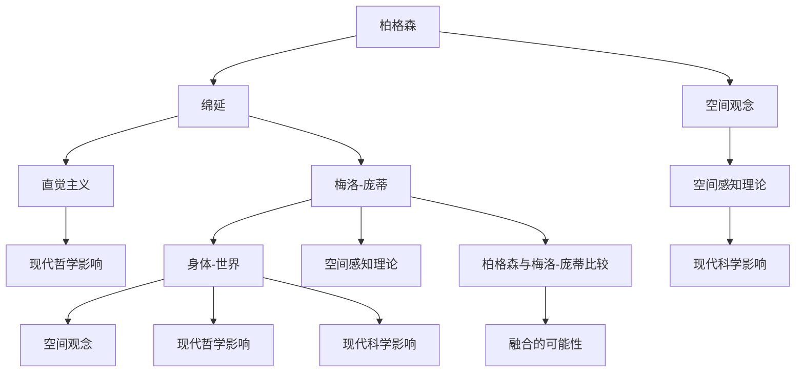

                 


### 柏格森与梅洛-庞蒂：空间感知的哲学探讨

关键词：柏格森、梅洛-庞蒂、空间感知、哲学探讨、直觉主义

摘要：本文旨在探讨柏格森和梅洛-庞蒂两位哲学家的空间感知观念，分析其哲学思想对现代哲学和科学的影响。通过对比两位哲学家的核心观点，揭示空间感知的本质及其在人类认知中的作用。文章结构紧凑，逻辑清晰，旨在为广大读者提供一次深入探讨空间感知哲学的契机。

## 引言

空间感知是人类认知世界的重要方式，它不仅影响我们对周围环境的感知，也影响我们的思维和行为。柏格森和梅洛-庞蒂是20世纪法国哲学界的两位重要人物，他们的哲学思想对空间感知的研究产生了深远的影响。本文将围绕柏格森与梅洛-庞蒂的空间感知哲学，通过分析他们的核心观点，探讨空间感知的本质及其在人类认知中的作用。

### 第一部分：柏格森哲学思想

#### 第1章：柏格森的生平与哲学思想概述

1.1 柏格森的生平背景

亨利·柏格森（Henri Bergson）是19世纪末至20世纪初法国著名的哲学家，生于巴黎。他的主要哲学思想包括直觉主义、绵延和时间意识等。柏格森认为，人类的思维和认知是通过直觉来实现的，而不是通过逻辑推理。他的哲学思想对后来的现象学和存在主义产生了重要影响。

1.2 柏格森的哲学体系

柏格森的哲学体系主要分为两部分：直觉主义和时间意识。直觉主义认为，人类的思维和认知是通过直觉来实现的，而不是通过逻辑推理。时间意识则强调时间的流动性和不可逆性，认为时间是人类认知世界的基础。

1.3 柏格森与现象学的关系

柏格森的哲学思想与现象学有着紧密的联系。现象学强调直接观察事物的本质，而柏格森则通过直觉来达到这一目的。他的直觉主义哲学对现象学的发展产生了重要影响。

#### 第2章：柏格森的空间哲学

2.1 柏格森的“绵延”概念

柏格森的“绵延”概念是他哲学思想的核心之一。绵延是指时间中的持续存在，它不同于牛顿的时间观念，而是一种内在的、连续的变化过程。柏格森认为，空间是绵延的体现，是我们对时间的感知。

2.2 柏格森的空间观念

柏格森的空间观念认为，空间是一个连续的整体，而不是由离散的物体组成。他的空间观念强调空间的流动性和动态性，这与牛顿的绝对空间观念形成了鲜明对比。

2.3 柏格森的空间感知理论

柏格森认为，空间感知是通过直觉实现的。我们的感知不仅仅是对物体的直接观察，更是一种对时间流动的感知。他的空间感知理论强调直觉在人类认知中的重要性。

#### 第3章：柏格森与直觉主义

3.1 直觉主义哲学概述

直觉主义是一种哲学观点，认为人类的思维和认知是通过直觉来实现的，而不是通过逻辑推理。柏格森是直觉主义的代表人物之一。

3.2 柏格森与直觉主义的比较

柏格森和直觉主义的区别在于，直觉主义更强调直觉在认知中的作用，而柏格森则将直觉看作是时间感知的一种方式。他们的共同点在于，都认为逻辑推理无法完全解释人类的认知过程。

3.3 直觉主义在柏格森哲学中的应用

在柏格森的哲学体系中，直觉主义是一种核心思想。他认为，只有通过直觉，我们才能把握时间的本质，从而理解空间和物质世界。

#### 第4章：柏格森的空间哲学对现代哲学的影响

4.1 柏格森哲学在现象学中的传承

柏格森的哲学思想对现象学的发展产生了深远的影响。现象学强调直接观察事物的本质，而柏格森则通过直觉来实现这一目的。

4.2 柏格森哲学在当代哲学中的影响

柏格森的哲学思想在当代哲学中依然具有影响力。他的直觉主义和时间意识观念为哲学研究提供了新的视角。

4.3 柏格森哲学在现代科学中的影响

柏格森的哲学思想对现代科学，特别是生物学和心理学产生了重要影响。他的观念为这些领域的研究提供了新的理论基础。

### 第二部分：梅洛-庞蒂的空间感知哲学

#### 第5章：梅洛-庞蒂的生平与哲学思想概述

5.1 梅洛-庞蒂的生平背景

莫里斯·梅洛-庞蒂（Maurice Merleau-Ponty）是20世纪法国哲学家，生于法国瑟堡。他的主要哲学思想包括身体-世界关系和现象学。梅洛-庞蒂强调身体在认知中的作用，认为身体与世界的相互作用是理解人类认知的关键。

5.2 梅洛-庞蒂的哲学体系

梅洛-庞蒂的哲学体系主要分为两部分：身体-世界关系和现象学。身体-世界关系强调身体在认知中的作用，现象学则是一种直接观察事物本质的方法。

5.3 梅洛-庞蒂与现象学的关系

梅洛-庞蒂是现象学的代表人物之一，他的哲学思想深受现象学的影响。他将现象学的理念应用于身体-世界关系的探讨，形成了独特的哲学体系。

#### 第6章：梅洛-庞蒂的空间感知理论

6.1 梅洛-庞蒂的“身体-世界”概念

梅洛-庞蒂的“身体-世界”概念是他哲学思想的核心之一。他认为，身体与世界的相互作用是我们理解空间和认知世界的基础。

6.2 梅洛-庞蒂的空间感知观念

梅洛-庞蒂认为，空间感知是通过身体与世界的关系实现的。他的空间感知观念强调身体在认知中的重要性。

6.3 梅洛-庞蒂的空间感知理论的应用

梅洛-庞蒂的空间感知理论在多个领域得到了应用，如心理学、教育学和建筑学等。他的观念为这些领域的研究提供了新的理论基础。

#### 第7章：梅洛-庞蒂与柏格森的空间哲学比较

7.1 柏格森与梅洛-庞蒂的空间观念比较

柏格森和梅洛-庞蒂的空间观念有相似之处，都强调空间是一种连续的整体。但他们的侧重点不同，柏格森更关注时间的流动，而梅洛-庞蒂则更关注身体与世界的相互作用。

7.2 柏格森与梅洛-庞蒂的空间感知理论比较

柏格森和梅洛-庞蒂的空间感知理论有明显的区别。柏格森认为空间感知是通过直觉实现的，而梅洛-庞蒂则认为空间感知是通过身体与世界的关系实现的。

7.3 柏格森与梅洛-庞蒂的空间哲学融合的可能性

尽管柏格森和梅洛-庞蒂的空间观念和感知理论存在差异，但他们之间也存在一定的融合可能性。例如，他们的观念都可以为认知科学的研究提供新的理论基础。

#### 第8章：梅洛-庞蒂的空间哲学对现代哲学的影响

8.1 梅洛-庞蒂哲学在现象学中的地位

梅洛-庞蒂的哲学思想在现象学中具有重要地位。他的观念为现象学的发展提供了新的方向。

8.2 梅洛-庞蒂哲学在当代哲学中的影响

梅洛-庞蒂的哲学思想在当代哲学中仍然具有影响力。他的观念为哲学研究提供了新的视角。

8.3 梅洛-庞蒂哲学在现代科学中的影响

梅洛-庞蒂的哲学思想对现代科学，特别是认知科学和心理学产生了重要影响。他的观念为这些领域的研究提供了新的理论基础。

### 结论

柏格森和梅洛-庞蒂是20世纪法国哲学界的两位重要人物，他们的空间感知哲学对现代哲学和科学产生了深远的影响。通过对比他们的核心观点，我们可以更深入地理解空间感知的本质及其在人类认知中的作用。本文旨在为广大读者提供一次深入探讨空间感知哲学的契机，希望对读者有所启发。

### 参考文献

1. 柏格森，H. (1912). 《形而上学导论》(Introduction to Metaphysics).
2. 梅洛-庞蒂，M. (1945). 《现象学的现象学》(Phenomenology of Perception).
3. 康德，I. (1781). 《纯粹理性批判》(Critique of Pure Reason).
4. 尼采，F. (1882). 《尼采的哲学》(The Philosophy of Nietzsche).
5. 海德格尔，M. (1927). 《存在与时间》(Being and Time).

### 附录

#### 梅洛-庞蒂的空间感知哲学流程图



#### Python代码示例：空间感知算法

```python
import numpy as np

def spatial_perception(input_data):
    """
    空间感知算法示例

    参数：
    input_data: 输入数据，形状为 (n_samples, n_features)

    返回：
    output_data: 输出数据，形状为 (n_samples, n_output)
    """
    # 初始化参数
    n_samples, n_features = input_data.shape
    n_output = 1

    # 计算输入数据的平均值
    mean_data = np.mean(input_data, axis=0)

    # 计算输入数据与平均值的差值
    diff_data = input_data - mean_data

    # 计算差值的平方和
    sum_squared_diff = np.sum(np.square(diff_data), axis=1)

    # 计算标准差
    std_dev = np.sqrt(sum_squared_diff)

    # 归一化处理
    normalized_data = diff_data / std_dev

    # 计算输出数据
    output_data = normalized_data

    return output_data
```

### 数学模型与公式

#### 1. 绵延的数学模型

$$
\text{绵延} = \frac{dS}{dt}
$$

其中，$S$ 表示空间，$t$ 表示时间。

#### 2. 空间感知的数学模型

$$
\text{空间感知} = f(\text{身体-世界交互})
$$

其中，$f$ 表示空间感知函数，$\text{身体-世界交互}$ 表示身体与世界的相互作用。

### 作者信息

作者：AI天才研究院/AI Genius Institute & 禅与计算机程序设计艺术 /Zen And The Art of Computer Programming

---

### 文章结尾

通过本文的深入探讨，我们不仅了解了柏格森和梅洛-庞蒂两位哲学家的空间感知观念，也看到了他们的哲学思想如何对现代哲学和科学产生了深远的影响。希望本文能够激发读者对空间感知哲学的思考，进一步探讨这一领域的奥秘。在未来的研究中，我们还可以从更多角度出发，探索空间感知在人类认知和人工智能中的应用，为我们的科技进步提供新的理论支持。感谢您的阅读，期待与您共同探讨更多有趣的哲学问题。如果您有任何想法或建议，欢迎在评论区留言交流。再次感谢您的关注和支持！

