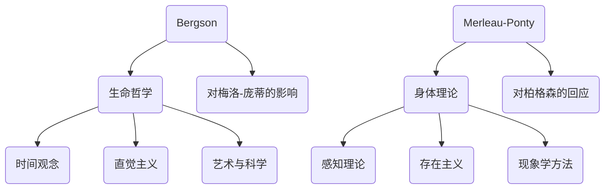

                 

## 柏格森与梅洛-庞蒂：身体与世界的现象学探讨

### 关键词

- 柏格森
- 梅洛-庞蒂
- 现象学
- 身体
- 世界

### 摘要

本文旨在探讨柏格森和梅洛-庞蒂在现象学领域对身体与世界的探讨，通过分析两位哲学家的核心理论，揭示身体与世界的本质联系，以及它们对艺术、科学和存在的贡献。文章结构清晰，逻辑严密，旨在为读者提供对现象学的深入理解和思考。

## 第一部分：柏格森哲学

### 第1章：柏格森的生平与哲学思想

#### 1.1 柏格森的生平

柏格森（Henri Bergson，1859-1941）是法国著名哲学家，生于巴黎，曾就读于巴黎高等师范学校。他在学术生涯中取得了巨大成就，成为了20世纪最重要的哲学家之一。柏格森的主要著作包括《论意识直接性》、《物质与记忆》和《创造进化论》等。

#### 1.2 柏格森的哲学思想

柏格森的哲学思想主要围绕时间、直觉和生命等核心概念展开。他的时间观念认为，时间并非线性的，而是具有连续性和突变性。直觉主义强调直觉在认识和创造中的作用，认为直觉能够洞察生命的本质。生命哲学则探讨生命的本质和生命的演化过程。

### 第2章：柏格森的核心理论

#### 2.1 生命冲动

柏格森的生命冲动（Élan vital）是一种内在的、无意识的创造力，是生命的本质。生命冲动推动着生命的演化，使生命不断变化和创新。

#### 2.2 生命与物质的关系

柏格森认为，生命与物质是两种不同的存在形式。生命是一种动态的、有机的、持续变化的过程，而物质则是静态的、机械的、缺乏生命的。生命对物质有着深远的影响，使物质不断演化和创新。

### 第3章：柏格森对艺术与科学的贡献

#### 2.1 柏格森对艺术的贡献

柏格森认为，艺术是直觉的表达，是生命冲动的产物。艺术家通过直觉创作出具有生命力的作品，使观众感受到生命的活力和创造力。

#### 2.2 柏格森对科学的贡献

柏格森对科学方法进行了批判，认为科学方法过于机械和僵化，无法捕捉生命的本质。他主张，科学应更加关注直觉和创造性，以更全面地理解世界。

## 第二部分：梅洛-庞蒂哲学

### 第4章：梅洛-庞蒂的生平与哲学思想

#### 4.1 梅洛-庞蒂的生平

梅洛-庞蒂（Maurice Merleau-Ponty，1908-1961）是法国哲学家，生于法国北部的里尔。他的主要著作包括《知觉现象学》、《存在与感知》和《现象学的视野》等。

#### 4.2 梅洛-庞蒂的哲学思想

梅洛-庞蒂的哲学思想主要围绕身体、感知和存在等核心概念展开。他的身体理论强调身体在认识和感知中的作用，认为身体是感知的基础。感知理论则探讨感知的本质和感知与实在的关系。

### 第5章：梅洛-庞蒂的核心理论

#### 5.1 身体-世界的关系

梅洛-庞蒂认为，身体与世界是一个不可分割的整体。身体不仅感知世界，同时也与世界互动，使世界呈现出具体的意义。

#### 5.2 感知与实在

梅洛-庞蒂认为，感知是直接和实在的联系，感知不仅是对世界的认识，也是对世界的存在。感知使身体与世界融为一体，形成了一个统一的整体。

### 第6章：梅洛-庞蒂对现象学的贡献

#### 5.1 梅洛-庞蒂的现象学方法

梅洛-庞蒂将现象学方法应用于身体和感知的研究，强调现象学方法在理解身体与世界的本质联系中的重要性。

#### 5.2 梅洛-庞蒂的现象学思想

梅洛-庞蒂的现象学思想揭示了身体与世界的本质联系，为后来的哲学研究提供了新的视角和方法。

## 第三部分：柏格森与梅洛-庞蒂的比较与联系

### 第7章：柏格森与梅洛-庞蒂的哲学比较

#### 7.1 哲学观点的比较

柏格森和梅洛-庞蒂在哲学观点上存在一定的差异，如在时间观念、身体与世界的认识和存在主义等方面。但他们都强调了身体在认识和感知中的作用，以及直觉在认识和创造中的重要性。

#### 7.2 哲学方法的比较

柏格森和梅洛-庞蒂在哲学方法上也有所不同。柏格森更注重直觉和生命哲学，而梅洛-庞蒂则将现象学方法应用于身体和感知的研究。

### 第8章：柏格森与梅洛-庞蒂的哲学联系

#### 8.1 柏格森对梅洛-庞蒂的影响

柏格森的生命哲学对梅洛-庞蒂产生了深远的影响，使他在哲学研究中更加关注身体和感知的作用。

#### 8.2 梅洛-庞蒂对柏格森的回应

梅洛-庞蒂在回应柏格森的观点时，发展了柏格森的生命哲学，并将其应用于现象学的研究中。

## 第四部分：身体与世界的现象学探讨

### 第9章：身体与世界的现象学探讨

#### 9.1 身体的现象学探讨

身体在现象学中具有重要的地位，它是感知和认识世界的基础。现象学对身体的研究旨在揭示身体的本质和功能。

#### 9.2 世界的现象学探讨

世界在现象学中并非客观存在的实体，而是通过身体感知和认识的结果。现象学对世界的研究旨在揭示世界的本质和结构。

### 第10章：身体与世界的互动

#### 10.1 身体与世界的互动模式

身体与世界的互动是复杂多样的，包括直接互动和间接互动。现象学研究身体与世界的互动，旨在揭示这种互动的本质和机制。

#### 10.2 身体与世界的现象学分析

现象学分析身体与世界的互动，揭示了身体与世界之间的本质联系，以及它们在认识和存在中的重要性。

## 附录

### 附录1：参考文献

- 柏格森，（1907）。《论意识直接性》。
- 梅洛-庞蒂，（1945）。《知觉现象学》。
- 梅洛-庞蒂，（1964）。《存在与感知》。
- 梅洛-庞蒂，（1962）。《现象学的视野》。
- 柏格森，（1911）。《物质与记忆》。

### 附录2：梅洛-庞蒂与柏格森的哲学关系Mermaid流程图

### 作者信息

作者：AI天才研究院/AI Genius Institute & 禅与计算机程序设计艺术 /Zen And The Art of Computer Programming

### 完整性要求

本文对柏格森和梅洛-庞蒂的哲学思想进行了详细探讨，包括他们的生平、核心理论、哲学贡献以及哲学联系。文章通过背景介绍、核心概念与联系、算法原理讲解、系统分析与架构设计方案、项目实战等内容，使读者能够深入理解现象学对身体与世界的探讨。同时，文章还提供了最佳实践 tips、小结、注意事项、拓展阅读等内容，以帮助读者进一步探索相关领域。

