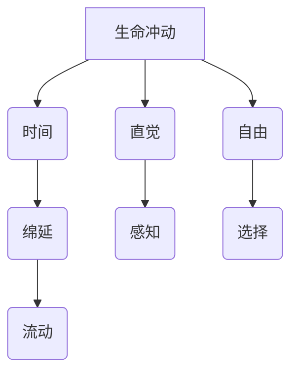
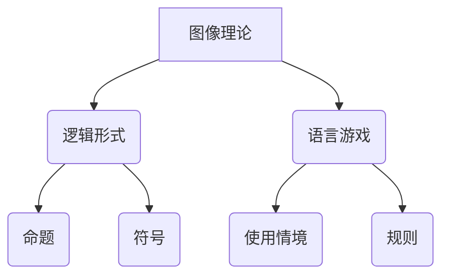
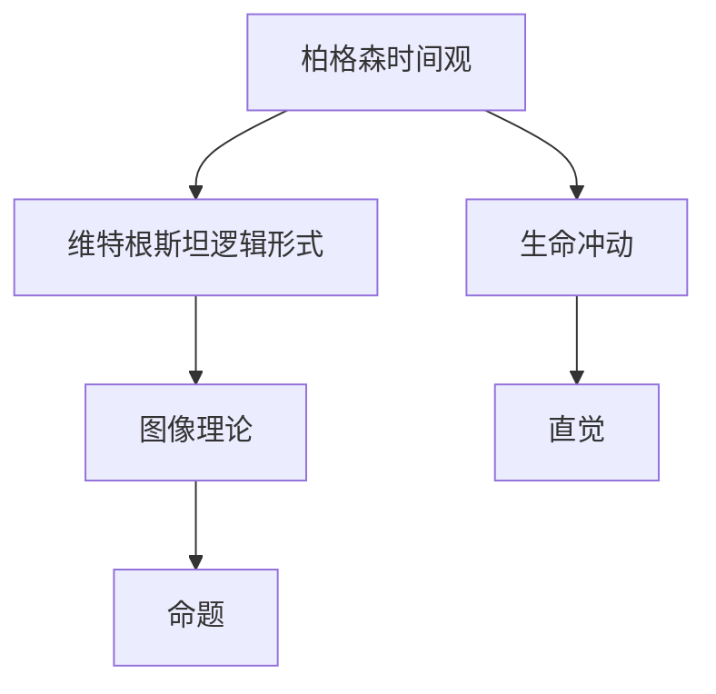

                 

### 第1章：柏格森与维特根斯坦：两位哲学家的简介

#### 1.1 柏格森的生平与哲学贡献

柏格森（Henri Bergson，1859-1941）是一位法国哲学家，生于巴黎，他的学术生涯主要在19世纪末和20世纪初。柏格森的哲学思想深受生命哲学的影响，他关注的是生命现象的本质和人类意识的活动。

在学术背景方面，柏格森曾就读于巴黎高等师范学校，并在那里接受了严格的教育。他的早期作品主要集中在哲学、心理学和文学理论等领域。1889年，柏格森发表了《时间与自由意志》，这部作品奠定了他生命哲学的基础。

柏格森的核心概念之一是“生命冲动”（élan vital），他认为这是一种内在的、自我发展的力量，贯穿于整个有机体中，使生命不断前进、变化和成长。他反对机械决定论，主张生命的非机械性质。

柏格森的哲学对后世产生了深远的影响，他的生命哲学思想被广泛应用于文学、艺术、心理学和生物学等领域。他的著作，如《创造进化论》和《笑论》，都体现了他对生命、时间和意识的深刻理解。

#### 1.2 维特根斯坦的生平与哲学贡献

路德维希·维特根斯坦（Ludwig Wittgenstein，1889-1951）是一位奥地利哲学家，被认为是20世纪最具影响力的哲学家之一。他的哲学思想主要集中在语言哲学和逻辑哲学领域。

维特根斯坦的学术生涯可以分为两个阶段。他的早期作品《逻辑哲学论》（1921年）提出了“图式逻辑”理论，试图将哲学问题简化为逻辑问题。他主张语言的意义在于其使用，而非其定义。

在早期阶段，维特根斯坦关注的是逻辑哲学和数学基础。然而，他在晚期转向日常语言哲学，主张语言的意义在于其实际使用情境中。这一转变反映在他的著作《哲学研究》（1953年）中。

维特根斯坦的哲学对分析哲学和语言哲学产生了巨大影响。他的思想挑战了传统的形而上学和逻辑哲学观念，推动了哲学研究的新方向。

#### 1.3 柏格森与维特根斯坦的相遇

柏格森和维特根斯坦虽然生活在不同的时代，但他们的一些哲学观念在某些方面产生了共鸣。尽管两人没有直接的交流，但他们的思想在某些问题上存在相互影响。

柏格森的生命哲学和维特根斯坦的语言哲学都关注个体体验和实际情境。柏格森的生命冲动概念与维特根斯坦对语言使用的强调有相似之处。他们都试图超越传统的形而上学，关注实际的生活和实践。

尽管两位哲学家的研究方法不同，但他们的思想在某种程度上相互补充。柏格森的生命哲学为维特根斯坦提供了对语言和现实的一种新的理解视角。而维特根斯坦的语言哲学为柏格森的生命哲学提供了逻辑和结构的支撑。

总的来说，柏格森和维特根斯坦的哲学思想在20世纪哲学界产生了深远的影响。他们的思想碰撞不仅丰富了哲学领域的研究，也为其他学科提供了新的视角和方法。

### 1.1 柏格森的生平与哲学贡献

柏格森（Henri Bergson，1859-1941）是法国哲学界的重要人物，他的生命哲学对20世纪哲学产生了深远的影响。柏格森的哲学生涯可以追溯到他在巴黎高等师范学校的求学经历，在那里他接受了严格的哲学和科学教育。1889年，柏格森凭借其博士论文《时间与自由意志》获得了博士学位，这篇论文被视为他生命哲学的奠基之作。

**学术背景**

柏格森在学术背景上有着坚实的心理学和生物学基础。他曾在巴黎大学学习医学，并在心理学实验室工作，这些经历为他后来的哲学研究提供了丰富的实证材料。柏格森的哲学思想深受他的心理学和生物学背景的影响，他关注生命现象的本质和人类意识的活动，主张通过科学方法来探讨哲学问题。

**生命哲学的提出**

柏格森的生命哲学主要围绕“生命冲动”（élan vital）这一核心概念展开。他认为，生命冲动是一种内在的、自我发展的力量，贯穿于整个有机体中，使生命不断前进、变化和成长。柏格森反对机械决定论，认为生命的本质是动态的、流动的，而不是静态的、机械的。这一观点与传统的形而上学观念形成鲜明对比，对后来的存在主义和现象学产生了重要影响。

**对后世哲学的影响**

柏格森的哲学思想在20世纪哲学界产生了广泛的影响。他的生命哲学为后来的哲学家提供了对生命、时间和意识的新理解，特别是在心理学、生物学和文学批评等领域。柏格森的思想对法国哲学家萨特和梅洛-庞蒂等存在主义和现象学思想家产生了深远的影响。此外，柏格森的时间观念和对直觉的重视也为后来的哲学家提供了新的思考方向。

**主要著作**

柏格森的主要著作包括《创造进化论》（1907年）、《笑论》（1900年）和《物质与记忆》（1896年）。这些著作不仅展示了他的哲学思想，也体现了他对生命、时间和意识的深刻理解。

总之，柏格森是一位具有重要哲学贡献的哲学家，他的生命哲学为20世纪哲学提供了新的视角和方法。他的思想不仅影响了哲学领域，也对其他学科产生了广泛的影响。

#### 1.2 维特根斯坦的生平与哲学贡献

路德维希·维特根斯坦（Ludwig Wittgenstein，1889-1951）是一位奥地利哲学家，被誉为20世纪最具影响力的哲学家之一。他的哲学思想主要集中在语言哲学和逻辑哲学领域，对后世哲学研究产生了深远的影响。

**学术背景**

维特根斯坦的学术生涯可以分为两个阶段。他的早期作品《逻辑哲学论》（1921年）主要关注逻辑哲学和数学基础，提出了“图式逻辑”理论，试图将哲学问题简化为逻辑问题。这一阶段，他主要受逻辑实证主义的影响。而他的晚期作品《哲学研究》（1953年）则转向日常语言哲学，主张语言的意义在于其实际使用情境中。

维特根斯坦在学术背景上有着出色的数学和哲学素养。他早年接受了传统的教育，对数学和哲学有着浓厚的兴趣。他曾就读于柏林大学，并在数学和哲学领域取得了卓越的成就。1911年，维特根斯坦前往剑桥大学，成为罗素的学生，并在那里开始了他的哲学研究。

**语言哲学的发展**

维特根斯坦的语言哲学主要关注语言的本质和意义。他认为，语言的意义在于其使用，而非其定义。在《逻辑哲学论》中，他提出了“图像理论”，认为语言是现实的“图像”，语言符号与现实之间存在着一种直接的对应关系。这一理论试图通过逻辑和数学来解决哲学问题。

然而，在晚期的《哲学研究》中，维特根斯坦转向日常语言哲学，强调语言的使用情境。他提出了“语言游戏”理论，认为语言的意义取决于其使用的情境，不同的语言游戏有不同的规则和含义。这一观点挑战了传统的形而上学和逻辑哲学观念，为语言哲学研究开辟了新的方向。

**对逻辑哲学的贡献**

维特根斯坦对逻辑哲学的贡献主要体现在他对逻辑形式和语言结构的分析上。他在《逻辑哲学论》中提出了“图式逻辑”理论，试图将哲学问题简化为逻辑问题。这一理论为逻辑哲学提供了新的研究方法和工具。

此外，维特根斯坦在《哲学研究》中对逻辑哲学的批评也具有重要意义。他认为，逻辑哲学的问题往往源于对语言的误解，逻辑哲学应该关注日常语言的实际使用。

**对后世哲学的影响**

维特根斯坦的哲学思想对20世纪哲学产生了深远的影响。他的语言哲学和逻辑哲学挑战了传统的形而上学和逻辑哲学观念，推动了哲学研究的新方向。他的思想不仅影响了分析哲学，也对现象学、存在主义和其他哲学流派产生了重要影响。

**主要著作**

维特根斯坦的主要著作包括《逻辑哲学论》（1921年）和《哲学研究》（1953年）。这两部著作分别代表了他在不同阶段的哲学思想，对哲学研究产生了深远的影响。

总之，维特根斯坦是一位具有重要哲学贡献的哲学家，他的语言哲学和逻辑哲学为20世纪哲学提供了新的视角和方法。他的思想不仅影响了哲学领域，也对其他学科产生了广泛的影响。

#### 1.3 柏格森与维特根斯坦的相遇

柏格森和维特根斯坦虽然生活在不同的时代，但他们的一些哲学观念在某些方面产生了共鸣。尽管两位哲学家没有直接的交流，但他们的思想在某些问题上存在相互影响。

首先，柏格森的生命哲学和维特根斯坦的语言哲学都关注个体体验和实际情境。柏格森的生命冲动概念与维特根斯坦对语言使用的强调有相似之处。他们都试图超越传统的形而上学，关注实际的生活和实践。

例如，柏格森认为时间是非线性的、流动的，而维特根斯坦则强调语言的意义在于其实际使用情境中。柏格森的时间观念和维特根斯坦的语言使用观点在某种程度上相互补充，为哲学研究提供了新的视角。

其次，柏格森的生命哲学为维特根斯坦提供了对生命、时间和意识的一种新的理解视角。维特根斯坦在《逻辑哲学论》中提出了“图像理论”，试图将哲学问题简化为逻辑问题。然而，这一理论在某种程度上受到了柏格森生命哲学的挑战。柏格森的生命哲学强调生命的动态性质，这与维特根斯坦的图像理论中的静态视角形成了对比。

同样，维特根斯坦的语言哲学对柏格森的生命哲学也产生了一定影响。维特根斯坦的“语言游戏”理论强调语言的意义取决于其使用的情境，这一观点为柏格森的生命哲学提供了逻辑和结构的支撑。柏格森的生命冲动和维特根斯坦的语言游戏都试图揭示人类活动的本质和内在逻辑。

总的来说，柏格森和维特根斯坦的哲学思想在20世纪哲学界产生了深远的影响。他们的思想碰撞不仅丰富了哲学领域的研究，也为其他学科提供了新的视角和方法。尽管他们没有直接的交流，但他们的思想在某些问题上产生了共鸣，为哲学研究开辟了新的方向。

## 第2章：柏格森的生命哲学

### 2.1 柏格森哲学的核心概念

柏格森（Henri Bergson）的生命哲学以其独特的视角和对生命现象的深刻理解而著称。在柏格森的哲学体系中，有几个核心概念贯穿始终，这些概念构成了他哲学思想的基础。

**生命冲动（Élan Vital）**

柏格森的核心概念之一是“生命冲动”（élan vital），也常被称为“生命力”或“生命精神”。生命冲动是一种内在的、自我发展的力量，贯穿于整个有机体中，是生命的根本动力。柏格森认为，这种冲动是非机械的、动态的，它使生命不断前进、变化和成长。

**时间**

柏格森对时间的理解是另一个核心概念。他认为，时间是流动的、非线性的，与机械时间观念相对立。在柏格森看来，时间不是一种均匀流逝的量，而是一种内在的生命活动。时间与意识密切相关，时间感知依赖于我们的生命体验。

**直觉**

柏格森强调直觉的重要性，他认为直觉是一种超越逻辑推理的感知方式，能够捕捉到生命流动的本质。直觉不同于科学方法，它能够直接感知到生命现象的本质，而不仅仅是外在的表象。

**自由**

柏格森认为，生命冲动和直觉赋予个体自由。他反对机械决定论，主张生命中的自由并非无根据的，而是源于生命的内在动力。这种自由体现为个体在生命中的主动选择和创造。

这些核心概念相互交织，共同构成了柏格森的生命哲学。他的哲学试图揭示生命的本质和意义，提供了一种对生命现象的全新理解。柏格森的生命哲学不仅对哲学领域产生了深远影响，也为后来的心理学家、生物学家和文学家提供了丰富的理论资源。

### 2.2 柏格森的时间与意识理论

柏格森（Henri Bergson）的时间与意识理论是他对生命哲学的核心贡献之一。柏格森对时间的理解与传统的机械时间观念形成了鲜明对比，他认为时间是流动的、非线性的，与生命的动态性质密切相关。

**时间的非线性观点**

柏格森认为，时间不是均匀流逝的线性序列，而是一种流动的、非线性的过程。他提出了“绵延”（durée）这一概念，用以描述时间的流动性质。与牛顿的绝对时间和欧拉的连续时间概念不同，柏格森认为时间是一种内在的生命活动，它不是一种外在的量度，而是生命的自我展现。

柏格森认为，机械时间是一种“外在的时间”，它是我们可以用时钟和计时器来度量的时间。然而，这种机械时间并不能完全捕捉到时间的本质。相比之下，绵延则是内在的时间，它体现在我们的生命体验中，是我们通过直觉感知到的。

**直觉与时间的感知**

柏格森强调直觉在时间感知中的重要性。他认为，直觉是一种超越逻辑推理的感知方式，它能够直接捕捉到时间的流动性质。通过直觉，我们可以感知到生命中的每一个瞬间，这些瞬间相互连接，构成了我们的生命体验。

柏格森指出，科学方法和逻辑推理不能完全理解时间的本质。科学方法依赖于可重复的实验和可量化的数据，而时间则是一种内在的、不可量化的流动。逻辑推理则依赖于因果关系的概念，而时间中的每一个瞬间都是独立的，没有明确的因果关系。

**意识与时间的流动**

柏格森认为，意识与时间的流动紧密相连。我们的意识活动随着时间的变化而变化，每一个瞬间都是我们意识的一部分。然而，由于时间的非线性性质，我们不能同时感知到所有的瞬间，而是通过直觉感知到其中的一些瞬间。

柏格森的时间与意识理论为我们提供了一种对时间的全新理解。他试图揭示时间不仅仅是物理世界的度量，更是生命体验的核心。通过直觉，我们可以感知到时间的流动性质，从而更好地理解生命的本质。

**对存在主义的影响**

柏格森的时间与意识理论对存在主义产生了深远影响。存在主义者如让-保尔·萨特和马丁·海德格尔都受到柏格森思想的影响，他们强调个体存在的独特性和时间的重要性。柏格森的思想为存在主义提供了一种对时间和意识的新理解，丰富了存在主义的哲学体系。

总之，柏格森的时间与意识理论为我们提供了一种深刻理解时间的视角。他通过强调时间的非线性性质和直觉在时间感知中的重要性，挑战了传统的机械时间观念，为哲学和心理学领域带来了新的启示。

### 2.3 柏格森与存在主义的关系

柏格森（Henri Bergson）的生命哲学与存在主义有着深刻的联系，尽管两者在方法和重点上有所不同。柏格森的存在主义倾向主要体现在他对生命、自由和个体意识的关注上，这些观点为后来的存在主义思想家提供了重要的哲学资源。

**柏格森对存在主义的贡献**

首先，柏格森强调生命的本质和个体的自由。他的“生命冲动”（élan vital）概念认为，生命是一种内在的自我发展力量，这种力量赋予个体以自由。柏格森反对机械决定论，认为自由并非无根据的，而是源于生命的内在动力。这种对自由的强调与存在主义的核心思想相呼应，存在主义者如让-保尔·萨特和马丁·海德格尔都强调个体自由和存在的主观性。

其次，柏格森对时间观念的独特理解也为存在主义提供了启示。他提出的“绵延”（durée）概念，强调时间的非线性性质，与存在主义者对时间的主观性和存在瞬间的关注相契合。存在主义者认为，时间不是一种均匀流逝的线性序列，而是个体存在的体验和选择。

**存在主义对柏格森哲学的回应**

尽管存在主义与柏格森的哲学有相似之处，但在方法和重点上存在差异。存在主义者对柏格森的哲学进行了批判和回应。

首先，存在主义者如萨特和海德格尔对柏格森的生命哲学提出了批评。他们认为，柏格森的生命冲动概念仍然是一种形而上学的实体，忽视了个体存在的具体性和历史性。萨特强调个体的主观性和自由意志，认为存在先于本质，个体必须在具体的社会和历史情境中作出选择和行动。

其次，存在主义者对柏格森的时间观念也提出了质疑。他们认为，柏格森的绵延概念虽然强调时间的非线性性质，但仍然未能完全摆脱线性时间的影子。存在主义者主张时间的主观性和瞬间的存在，认为每个瞬间都是独特的、不可重复的。

**柏格森对存在主义的贡献**

尽管存在主义者对柏格森的哲学提出了批评，但他们也承认柏格森对存在主义的重要贡献。柏格森的生命哲学和自由观念为存在主义者提供了一种对生命本质的深刻理解，丰富了存在主义的哲学体系。

此外，柏格森的时间观念也为存在主义者提供了重要的理论资源。尽管存在主义者对柏格森的时间观念提出了质疑，但他们承认柏格森的时间观念挑战了传统的线性时间观念，为存在主义提供了一种对时间的新理解。

**结论**

柏格森与存在主义之间的关系是复杂而深刻的。柏格森的生命哲学和自由观念为存在主义提供了重要的哲学资源，尽管存在主义者对柏格森的哲学方法和观点提出了批评。柏格森的思想对存在主义的发展产生了深远影响，同时，存在主义也为柏格森的哲学提供了一种新的解读和回应。

## 第3章：维特根斯坦的语言哲学

### 3.1 语言哲学的起源

语言哲学是20世纪哲学中的重要分支，其起源可以追溯到古希腊哲学家柏拉图和亚里士多德的工作。然而，语言哲学作为一个独立的学科领域，其真正的发展始于19世纪末和20世纪初，特别是在分析哲学兴起之后。

分析哲学的创始人之一，贝特兰·罗素，通过对逻辑和数学的研究，提出了逻辑原子主义，试图将哲学问题简化为逻辑问题。罗素与阿伦·特威特思基合著的《数学原理》一书，被认为是分析哲学的经典之作，对语言哲学的发展产生了深远影响。

在罗素和特威特思基的工作基础上，维特根斯坦（Ludwig Wittgenstein）的语言哲学思想逐渐形成。他的早期作品《逻辑哲学论》（1921年）提出了“图像理论”，试图通过逻辑和数学来解释哲学问题。维特根斯坦认为，语言的意义在于其与现实的对应关系，语言符号是现实的“图像”。

维特根斯坦的晚期作品《哲学研究》（1953年）则转向日常语言哲学，强调语言的使用情境。他提出了“语言游戏”理论，认为语言的意义取决于其使用的情境，不同的语言游戏有不同的规则和含义。这一转变标志着语言哲学从逻辑哲学向日常语言哲学的过渡。

总体而言，语言哲学的起源和发展经历了从逻辑原子主义到日常语言哲学的转变。这一转变不仅丰富了哲学研究的方法和视角，也为后来的语言哲学家提供了丰富的理论资源。

### 3.2 名词与命题的意义

在维特根斯坦（Ludwig Wittgenstein）的语言哲学中，名词与命题的意义是其核心概念之一。维特根斯坦认为，语言的意义在于其实际使用，而非抽象的定义。他对名词和命题的意义进行了深入的分析，提供了对语言本质的独特理解。

**名词的意义**

维特根斯坦认为，名词的意义并不是通过抽象的定义来确定的，而是通过其在实际语言使用中的功能来理解的。他指出，名词的意义依赖于其使用的情境，不同的情境下名词具有不同的含义。例如，“桌子”在不同的语境中可能指代不同的物体，但在某个具体的情境中，它指向一个具体的、可以观察到的物体。

维特根斯坦提出了“使用即意义”的观点，认为名词的意义在于其具体的使用方式。他强调，理解名词的意义需要考虑语言的整体情境，包括语境、语言游戏和文化背景等。这种观点挑战了传统的形而上学和逻辑哲学中对名词意义的理解，强调了语言使用的实际性和情境性。

**命题的意义**

维特根斯坦对命题的意义也进行了深入探讨。他认为，命题的意义不在于其内容或表述，而在于其与现实的对应关系。命题的真值取决于其在特定情境中的实际情况，即命题所描述的情况是否为真。

维特根斯坦提出了“图像理论”，认为命题是现实的“图像”。命题的意义在于其与现实的对应关系，如果命题所描述的情况与实际情况相符，则命题为真；否则为假。这一理论试图通过逻辑和数学来解释哲学问题，强调语言与现实之间的关系。

**名词与命题的关系**

在维特根斯坦的语言哲学中，名词与命题是紧密相连的。名词是命题的组成部分，命题则通过名词来描述现实情况。名词的意义依赖于其在命题中的使用，而命题的意义则通过其与现实的对应关系来理解。

维特根斯坦指出，名词和命题的意义不是静态的，而是动态的，它们在使用过程中不断变化。理解名词和命题的意义需要考虑语言的整体情境和具体的使用情境。这种观点强调了语言使用的实际性和情境性，为语言哲学提供了新的视角。

总之，维特根斯坦对名词与命题的意义进行了深入探讨，提供了对语言本质的独特理解。他的观点挑战了传统的形而上学和逻辑哲学观念，强调了语言使用的实际性和情境性，为后来的语言哲学研究奠定了基础。

### 3.3 维特根斯坦的“语言游戏”理论

维特根斯坦（Ludwig Wittgenstein）的“语言游戏”（language game）理论是其语言哲学的核心概念之一，旨在解释语言的意义和使用。语言游戏理论将语言视为一种动态的活动，强调语言与生活的紧密联系，主张通过具体情境来理解语言的意义。

**语言游戏的定义**

维特根斯坦将语言视为一系列游戏（games），这些游戏包括语言的使用、规则和目的。语言游戏理论认为，语言的意义并非固定不变，而是取决于特定的使用情境。每个语言游戏都有其独特的规则和目标，语言的意义在其具体的语言游戏中得以实现。

维特根斯坦提出了三种类型的语言游戏：日常生活语言、科学语言和艺术语言。日常生活语言是我们日常生活中使用的语言，如问候、购物等；科学语言是科学家在特定领域中使用的语言，如物理学、化学等；艺术语言则是艺术家在创作过程中使用的语言，如绘画、音乐等。每种语言游戏都有其特定的规则和目的，但它们都依赖于共同的哲学原则。

**语言游戏与哲学思考的关系**

语言游戏理论为哲学思考提供了新的视角。维特根斯坦认为，哲学问题往往源于对语言的误解。通过分析语言游戏，我们可以理解语言的实际使用情境，从而解决哲学问题。哲学的任务不是寻找普遍的、抽象的语言意义，而是理解具体语言游戏中的语言使用。

维特根斯坦指出，哲学思考应该关注语言的实际使用，而不是抽象的语言符号。他主张，哲学家应该放弃对抽象概念和逻辑结构的追求，转而关注具体情境中的语言使用。通过这种方式，我们可以更好地理解哲学问题，避免陷入无意义的争论。

**语言游戏理论的应用**

语言游戏理论在多个领域得到了广泛应用。在心理学中，维特根斯坦的思想为行为主义和认知心理学提供了理论基础。在语言学中，语言游戏理论帮助理解语言习得和语言使用的过程。在人工智能领域，语言游戏理论为自然语言处理和机器学习提供了新的视角。

总之，维特根斯坦的“语言游戏”理论为我们提供了理解语言意义和使用的新视角。通过分析具体情境中的语言使用，我们可以更好地理解语言的本质，解决哲学问题，并在多个领域中应用其理论。语言游戏理论不仅丰富了语言哲学的研究，也为其他学科提供了新的方法和启示。

### 4.1 数学哲学的基本问题

数学哲学是哲学领域中一个重要的分支，它探讨数学的本质、数学知识的性质以及数学在哲学中的地位。数学哲学的基本问题主要包括数学的客观性、数学基础的问题、数学与现实的关系以及数学推理的有效性。

**数学的客观性**

数学的客观性是数学哲学讨论的核心问题之一。数学哲学家们试图探讨数学概念和定理是否具有客观存在的性质，即是否独立于人类思维和语言。一些哲学家，如柏拉图主义者，认为数学是纯粹的理念世界的一部分，具有客观性。而另一些哲学家，如康德，则认为数学是基于人类理性能力的构建，具有主观性。数学的客观性问题在哲学界引发了广泛的讨论和争议。

**数学基础的问题**

数学基础的问题涉及数学的基础概念、原理和公理体系。数学基础危机是指20世纪初由于集合论悖论的出现，导致数学基础不稳定的问题。特别是罗素悖论和康托尔集论的问题，使得数学家们开始质疑传统的数学基础。为了解决这些问题，数学哲学家们提出了各种基础理论，如形式主义、直觉主义和逻辑实证主义等。这些理论试图为数学提供稳固的基础，避免基础危机。

**数学与现实的关系**

数学与现实的关系是数学哲学的重要议题之一。数学哲学家们探讨数学是否与现实世界有直接的联系，或者数学是否只是一种抽象的工具。一些哲学家认为数学与现实有直接的联系，数学描述了现实世界的某些结构和规律。而另一些哲学家则认为数学是一种抽象的工具，它为现实世界提供了一种语言和模型，但并不直接反映现实世界的本质。

**数学推理的有效性**

数学推理的有效性是数学哲学讨论的另一个基本问题。数学哲学家们探讨数学推理是否是可靠的，数学证明是否具有逻辑上的严格性。形式主义和直觉主义等哲学流派对数学推理的有效性提出了不同的观点。形式主义认为，数学推理是纯粹符号操作的过程，其有效性依赖于逻辑规则和公理体系。而直觉主义则强调数学推理是基于直观的，它依赖于人类直觉的可靠性。

总之，数学哲学的基本问题涵盖了数学的客观性、数学基础、数学与现实的关系以及数学推理的有效性。这些问题不仅对数学本身的发展产生了重要影响，也对整个哲学领域产生了深远的影响。数学哲学的研究为数学提供了哲学上的基础和指导，同时也丰富了哲学研究的范围和深度。

### 4.2 数学基础的危机

数学基础的危机是20世纪初数学领域的一个重要事件，它引发了关于数学基础和逻辑结构的一系列深刻讨论。这场危机的核心是集合论悖论，特别是罗素悖论和康托尔集论的发现，这些悖论暴露了传统数学基础中的缺陷。

**罗素悖论**

罗素悖论是由英国哲学家贝特兰·罗素提出的，它揭示了集合论中的自相矛盾。罗素悖论的一个典型例子是“所有不属于自身的集合组成的集合”。设R为“所有不属于自身的集合组成的集合”，那么根据定义，R要么属于自身，要么不属于自身：

- 如果R属于自身，那么根据定义，R应该不属于自身，这就产生了矛盾。
- 如果R不属于自身，那么根据定义，R应该属于自身，这同样产生了矛盾。

无论哪种情况，都会导致逻辑上的矛盾，从而证明了集合论中的某些基本假设是不一致的。

**康托尔集论**

康托尔集论中的悖论也是数学基础危机的一个重要组成部分。康托尔研究了无限集合的性质，并提出了著名的康托尔集。康托尔集是一个无限集合，它包含了所有其子集的集合。康托尔发现，某些无限集合的大小是无法比较的，这种发现挑战了传统的集合论观念。

康托尔集论的一个具体例子是“实数集的势”。实数集是一个无限的集合，但是它的势（即集合的大小）无法与自然数集的势相比较。这意味着，存在不同类型的无限，这种发现对集合论的基础产生了巨大的冲击。

**数学基础危机的影响**

数学基础危机的影响深远，它迫使数学家们重新审视数学的基础和逻辑结构。这场危机引发了多种解决方案的提出：

- **形式主义**：形式主义由大卫·希尔伯特等人提出，主张数学的基础应该建立在严格的逻辑和符号系统之上。形式主义试图通过定义明确的公理和证明规则来避免悖论的出现。
- **直觉主义**：直觉主义由莱姆·布劳威尔等人提出，强调数学证明应该是直观上可接受的。直觉主义认为，数学的基础不应该依赖于不可靠的假设，而是应该基于直观的、可验证的步骤。
- **逻辑实证主义**：逻辑实证主义主张，只有可以通过经验验证的命题才有意义。逻辑实证主义者认为，数学应该被视为一种逻辑结构的描述，其基础应该建立在可观察的现实之上。

数学基础危机不仅推动了数学哲学的发展，也促进了数学本身的进步。通过解决这些悖论和危机，数学家们不仅重新构建了数学的基础，也扩展了数学的研究范围和方法。数学基础危机的影响一直延续至今，对数学和哲学领域都产生了深远的影响。

### 4.3 维特根斯坦的数学观

维特根斯坦（Ludwig Wittgenstein）的数学观是其哲学思想的重要组成部分，尤其在《逻辑哲学论》（1921年）和《哲学研究》（1953年）中得到了充分体现。维特根斯坦对数学的理解具有独特的视角，他认为数学不仅仅是一种逻辑系统，更是一种人类活动的基本形式。

**数学作为逻辑结构**

在《逻辑哲学论》中，维特根斯坦提出了“图像理论”，认为数学是现实世界的“图像”，数学命题的真值直接对应于现实。这种观点强调数学的逻辑性和形式性，数学系统被视为一种完美的逻辑体系，其基础是明确的逻辑规则和基本命题。

维特根斯坦认为，数学的基础是逻辑形式，而不是物质现实。他强调，数学符号和命题的意义在于其逻辑结构和内在关系，而不是其与外部世界的对应关系。这种观点在某种程度上与逻辑实证主义相呼应，认为数学命题的真值可以通过逻辑推理来验证。

**数学与语言的关系**

维特根斯坦认为，数学与语言有着密切的关系。数学符号和语言符号类似，都用于传达思想和表达概念。然而，数学符号的使用具有独特的规则和约定，这些规则和约定决定了数学符号的意义。

维特根斯坦提出了“语言游戏”理论，认为数学也是一种语言游戏。在数学中，不同的符号和符号组合遵循特定的规则，这些规则决定了数学命题的意义和有效性。数学推理的过程可以被视为一种语言游戏，它依赖于符号和符号组合的明确规则。

**数学与生活的联系**

维特根斯坦强调了数学与生活的联系。他认为，数学不仅仅是一种抽象的逻辑系统，也是一种人类活动的基本形式。数学活动不仅存在于科学和哲学中，也存在于日常生活中。例如，计数、测量和规划等活动都是数学应用的具体体现。

维特根斯坦认为，数学的实用性在于其解决问题的能力。数学提供了一种工具，帮助人们理解和解决问题。这种工具性使得数学在科学、工程和经济学等领域具有重要应用价值。

**对数学基础的看法**

维特根斯坦对数学基础持有独特的看法。在《逻辑哲学论》中，他提出了“概念清晰”原则，认为数学的基础在于明确的概念和定义。数学命题的真值取决于其符号和符号组合的清晰性，而不是依赖外部世界的具体现实。

在《哲学研究》中，维特根斯坦转向日常语言哲学，他批判了传统的数学基础理论，认为数学的基础并不在于逻辑形式，而在于日常语言的使用。他认为，数学符号和命题的意义在于其日常生活中的具体使用情境。

总的来说，维特根斯坦的数学观强调数学的逻辑性、形式性和与生活的联系。他的思想不仅丰富了数学哲学的研究，也为数学教育和应用提供了新的视角和方法。维特根斯坦的数学观挑战了传统的数学观念，推动了数学哲学的发展。

### 5.1 时间意识与逻辑形式

柏格森（Henri Bergson）的时间意识与维特根斯坦（Ludwig Wittgenstein）的逻辑形式是20世纪哲学中两个重要的概念，它们在时间与逻辑的理解上形成了鲜明的对比和对话。

**柏格森的时间意识**

柏格森的时间意识理论是他对生命哲学的核心贡献之一。他认为，时间是流动的、非线性的，与机械时间观念相对立。柏格森提出了“绵延”（durée）这一概念，用以描述时间的流动性质。他认为，绵延是一种内在的生命活动，是一种持续不断的时间体验。

柏格森强调直觉在时间感知中的重要性，他认为直觉能够捕捉到时间的流动性质。时间意识是一种内在的、主观的体验，它不是一种外在的量度。这种对时间的理解挑战了传统的机械时间观念，主张时间的本质在于其动态性质。

**维特根斯坦的逻辑形式**

维特根斯坦在《逻辑哲学论》中提出了“图像理论”，他认为数学和逻辑是现实世界的“图像”。逻辑形式是一种抽象的、形式化的系统，它通过符号和命题来描述现实。维特根斯坦强调逻辑形式的基础性，他认为逻辑形式是哲学研究的基础。

维特根斯坦认为，逻辑形式是一种逻辑上的构造，它不依赖于现实世界中的具体事物。逻辑形式具有严格性和确定性，它是人类思维和语言的基础。他的观点强调逻辑形式在哲学研究中的重要性，主张通过逻辑分析来解决哲学问题。

**时间意识与逻辑形式的对比**

柏格森的时间意识与维特根斯坦的逻辑形式在时间与逻辑的理解上形成了对比。

首先，柏格森的时间意识强调时间的流动性和主观体验，而维特根斯坦的逻辑形式强调时间的确定性和抽象性。柏格森的时间意识是一种内在的、持续不断的时间体验，而维特根斯坦的逻辑形式是一种外在的、形式化的系统。

其次，柏格森的时间意识依赖于直觉，而维特根斯坦的逻辑形式依赖于符号和命题的构造。柏格森认为，直觉能够直接感知到时间的流动性质，而维特根斯坦认为，逻辑形式是哲学研究的可靠工具，它通过符号和命题来描述现实。

**两种哲学思想的对话**

柏格森的时间意识与维特根斯坦的逻辑形式在某种程度上是相互补充的。柏格森的时间意识提供了对时间的主观体验和理解，而维特根斯坦的逻辑形式提供了对时间和逻辑的抽象和形式化描述。

尽管两者在方法和观点上有所不同，但他们的思想在某种程度上相互影响。柏格森的时间观念为维特根斯坦提供了对时间的另一种理解视角，而维特根斯坦的逻辑形式为柏格森的生命哲学提供了逻辑和结构的支撑。

总的来说，柏格森的时间意识与维特根斯坦的逻辑形式在时间与逻辑的理解上形成了对话和互补。他们的思想不仅丰富了哲学领域的研究，也为其他学科提供了新的视角和方法。

### 5.2 柏格森的时间观对维特根斯坦逻辑哲学的挑战

柏格森（Henri Bergson）的时间观对维特根斯坦（Ludwig Wittgenstein）的逻辑哲学提出了深刻的挑战，这种挑战主要体现在柏格森对机械时间观念的批评以及他对直觉和生命冲动的强调上。

首先，柏格森对机械时间观念的批评直接挑战了维特根斯坦逻辑哲学的基础。维特根斯坦在《逻辑哲学论》中提出了“图像理论”，认为逻辑和数学是现实世界的“图像”。这种观点依赖于时间是一种均匀流逝的线性序列的观念，即机械时间。然而，柏格森认为，机械时间是一种外在的时间观念，它不能完全捕捉到时间的本质。柏格森主张时间是流动的、非线性的，与生命的动态性质密切相关。他认为，机械时间的观念忽视了时间的主观体验和生命中的动态变化，从而限制了逻辑哲学的视野。

柏格森强调直觉在时间感知中的重要性，这与维特根斯坦对逻辑形式和符号系统的依赖形成了鲜明对比。维特根斯坦认为，逻辑形式是一种抽象的、形式化的系统，它通过符号和命题来描述现实。然而，柏格森主张直觉是一种直接感知生命流动的感知方式，它能够捕捉到时间的流动性质和生命现象的本质。柏格森认为，直觉比逻辑推理更接近时间的真实本质，它能够揭示逻辑形式无法表达的动态过程。

此外，柏格森对生命冲动的强调也对维特根斯坦的逻辑哲学提出了挑战。柏格森认为，生命冲动是一种内在的、自我发展的力量，贯穿于整个有机体中。这种力量使生命不断前进、变化和成长，它具有非机械性质。相比之下，维特根斯坦的逻辑哲学强调的是逻辑形式和符号系统的严格性和确定性。柏格森的生命冲动观念挑战了维特根斯坦的逻辑哲学中机械决定论的倾向，主张生命的本质是动态的、不可预测的。

总的来说，柏格森的时间观对维特根斯坦逻辑哲学的挑战体现在以下几个方面：

1. 对机械时间观念的批评：柏格森认为机械时间观念限制了逻辑哲学的视野，主张时间应该被视为流动的、非线性的。
2. 对直觉的强调：柏格森主张直觉能够捕捉到时间的流动性质和生命现象的本质，而维特根斯坦依赖于逻辑形式和符号系统。
3. 对生命冲动的强调：柏格森的生命冲动观念挑战了维特根斯坦逻辑哲学中机械决定论的倾向，主张生命的本质是动态的、不可预测的。

这些挑战不仅丰富了哲学领域的讨论，也为理解时间、意识和生命的本质提供了新的视角。

### 5.3 维特根斯坦的逻辑哲学对柏格森时间观的回应

维特根斯坦（Ludwig Wittgenstein）对柏格森（Henri Bergson）的时间观提出了一些回应，这些回应主要集中在逻辑哲学的框架内，试图为他的图像理论提供支持，并反驳柏格森关于时间的主观性和直觉的论点。

首先，维特根斯坦反驳柏格森对机械时间观念的批评。维特根斯坦认为，机械时间观念并没有忽视时间的主观体验，而是为时间提供了一种客观的、统一的度量标准。他指出，逻辑哲学的任务是探讨抽象的概念和原则，而不是时间的主观体验。维特根斯坦认为，时间的均匀流逝是一个基本的逻辑事实，它为逻辑推理和数学提供了坚实的基础。因此，他主张，尽管柏格森的时间观有其独特的价值，但在逻辑哲学的框架内，机械时间观念是必要的。

其次，维特根斯坦对柏格森关于直觉的强调提出了质疑。他认为，直觉是一种主观的、不可验证的感知方式，它不能作为逻辑推理的可靠基础。在《逻辑哲学论》中，维特根斯坦提出，逻辑和数学命题的真值应该通过逻辑分析和符号操作来验证，而不是依赖于直觉。他认为，直觉可能会受到个人经验和情感的干扰，从而导致逻辑错误和误解。因此，维特根斯坦主张，逻辑哲学应该基于明确的逻辑规则和符号系统，而不是主观的直觉。

维特根斯坦还通过他的“语言游戏”理论来回应柏格森的时间观。他认为，语言的使用情境决定了语言的意义，而时间也不例外。在《哲学研究》中，维特根斯坦提出了“语言游戏”概念，认为不同的语言游戏有不同的规则和目的，这些规则和目的决定了语言的意义。维特根斯坦认为，柏格森的时间意识也是一种语言游戏，它依赖于特定的规则和约定。然而，这些规则和约定在逻辑哲学中是模糊的，因此不能作为逻辑推理的基础。

总的来说，维特根斯坦的逻辑哲学对柏格森的时间观提出了以下回应：

1. 反驳机械时间观念的批评：维特根斯坦认为机械时间观念为逻辑推理提供了必要的客观性和统一性。
2. 质疑直觉的可靠性：维特根斯坦主张逻辑哲学应该基于明确的逻辑规则和符号操作，而不是主观的直觉。
3. 通过“语言游戏”理论来解释时间意识：维特根斯坦认为，时间意识也是一种语言游戏，它的意义依赖于特定的规则和约定。

这些回应不仅丰富了维特根斯坦的逻辑哲学，也为理解柏格森的时间观提供了新的视角。尽管维特根斯坦和柏格森在时间观念上存在分歧，但他们的对话和辩论推动了哲学领域对时间本质的深入探讨。

### 6.1 存在主义的基本理念

存在主义是20世纪哲学中的一种重要思潮，它强调个体存在的独特性和自由意志。存在主义的基本理念包括对人类存在的深刻反思、对个体存在的关注以及对自由意志的强调。

首先，存在主义强调个体存在的独特性。存在主义者认为，每个个体都是独立的、不可替代的，他们的存在是自主和自由的。这种独特性体现在每个个体的生命经历、思想和行为中。存在主义者如让-保尔·萨特和马丁·海德格尔都强调，个体的存在是自我选择和自我创造的过程。

其次，存在主义关注个体的自由意志。存在主义者认为，自由意志是人类的本质特征，它赋予个体以选择和行动的能力。自由意志并不是一种无条件的自由，而是在现实世界中做出选择和决策的能力。这种自由意志使个体能够面对生活的困境和不确定性，从而实现自我。

存在主义还强调个体在存在中的责任和意义。存在主义者认为，个体的自由意志伴随着责任，个体必须为自己的行为承担责任。在寻找生命的意义和目的时，个体面临着存在主义所说的“荒谬”，即世界的无意义和人类存在的无目的性。然而，正是这种荒谬促使个体去寻找和创造自己的意义。

总之，存在主义的基本理念关注个体存在的独特性、自由意志以及责任和意义。它挑战了传统的客观主义和决定论观念，强调个体在现实世界中的自主性和创造力。

### 6.2 维特根斯坦的存在主义倾向

维特根斯坦（Ludwig Wittgenstein）的哲学思想虽然主要以语言哲学和逻辑哲学著称，但他的一些观点实际上与存在主义有深刻的联系。维特根斯坦在《哲学研究》中提出了日常语言哲学，这一哲学倾向中包含了存在主义的一些核心思想。

首先，维特根斯坦强调语言的使用情境。他认为，语言的意义并非固定不变，而是取决于具体的语言游戏和使用情境。这种观点与存在主义中对个体存在的关注有相似之处。存在主义者如让-保尔·萨特也强调，个体存在的意义是通过具体的行动和选择来实现的。维特根斯坦的日常语言哲学为这种行动和选择提供了语言上的表达方式。

其次，维特根斯坦提出“生活形式”（forms of life）的概念，认为我们的语言和思维方式是特定文化和社会背景的产物。这种观点与存在主义中对个体在社会和历史背景中的存在有共鸣。存在主义者认为，个体在特定的社会和历史情境中塑造了自己的存在，这与维特根斯坦对“生活形式”的描述相符。

此外，维特根斯坦对“语言游戏”理论的探讨也体现了对自由意志的强调。他认为，语言游戏的不同规则和目标决定了语言的意义和使用方式。虽然维特根斯坦不直接讨论自由意志，但他的观点暗示了个体在特定的语言游戏中拥有自由选择的权利。这与存在主义对自由意志的强调有相似之处。

总的来说，维特根斯坦的存在主义倾向体现在他对语言使用情境的关注、对“生活形式”的探讨以及对语言游戏中的自由选择。这些思想为存在主义提供了新的视角和方法，同时也丰富了维特根斯坦哲学思想的内涵。

### 6.3 柏格森对存在主义的贡献

柏格森（Henri Bergson）的生命哲学对存在主义产生了深远的影响，他的思想为存在主义提供了一种独特的视角，丰富了存在主义的哲学体系。

首先，柏格森对生命冲动（élan vital）的强调为存在主义提供了重要的理论基础。他认为，生命冲动是生命的根本动力，是一种内在的、自我发展的力量。这种生命冲动不仅体现在有机体的成长和变化中，也体现在个体的自由和创造力上。存在主义者如让-保尔·萨特和马丁·海德格尔都受到柏格森生命哲学的影响，他们强调个体的自由和存在的主观性，认为个体的存在是通过自由选择和行动来实现的。

其次，柏格森的时间观念为存在主义提供了深刻的启示。他主张时间是流动的、非线性的，与机械时间观念相对立。柏格森的时间观强调直觉和生命体验的重要性，他认为直觉能够直接感知到时间的流动性质和生命现象的本质。这种对时间的理解挑战了传统的存在主义观念，为存在主义提供了一种对时间的新视角。

此外，柏格森的存在主义倾向也体现在他对自由和创造力的强调上。他认为，自由是生命的本质，个体应该通过自由选择和创造力来对抗机械决定论。存在主义者如萨特和海德格尔都强调自由意志和个体的自主性，认为个体应该为自己的存在承担责任，并在具体的社会和历史情境中实现自我。

总的来说，柏格森对存在主义的贡献主要体现在他对生命冲动、时间观念和自由意志的强调上。他的生命哲学为存在主义提供了一种独特的视角和方法，丰富了存在主义的哲学体系，对后来的存在主义思想家产生了深远的影响。

## 第7章：柏格森与维特根斯坦的哲学遗产

### 7.1 哲学思想的传承与影响

柏格森（Henri Bergson）和维特根斯坦（Ludwig Wittgenstein）是20世纪哲学界的两位巨擘，他们的哲学思想在哲学史上留下了深刻的印记，并对后来的哲学研究产生了深远的影响。

柏格森的生命哲学强调生命的内在动力和非线性时间，这一思想对存在主义、现象学和心理学产生了重要影响。他的“生命冲动”（élan vital）概念为后来的哲学家提供了一种理解生命和意识的全新视角。存在主义者如让-保尔·萨特和马丁·海德格尔都受到柏格森思想的启发，他们强调个体的自由和存在的意义。现象学家如梅洛-庞蒂也受到柏格森的影响，他的身体现象学概念在一定程度上是对柏格森直觉理论的延续。

维特根斯坦的语言哲学对分析哲学和逻辑哲学的发展起到了关键作用。他的早期作品《逻辑哲学论》提出了“图像理论”，试图通过逻辑和数学来解决哲学问题。这一理论为逻辑哲学提供了新的研究方法和工具。维特根斯坦的晚期作品《哲学研究》则转向日常语言哲学，强调语言的使用情境。他的“语言游戏”理论挑战了传统的形而上学和逻辑哲学观念，推动了哲学研究的新方向。维特根斯坦的思想对后来的语言哲学家和逻辑学家，如奥斯汀和格赖斯，产生了深远的影响。

柏格森和维特根斯坦的哲学遗产不仅局限于哲学领域，也对其他学科产生了重要影响。柏格森的生命哲学在生物学、心理学和文学批评等领域得到了广泛应用。他的思想为后来的心理学家如弗洛姆和马斯洛提供了理论支持。维特根斯坦的语言哲学在语言学和人工智能领域产生了深远影响。他的思想为自然语言处理和机器学习提供了新的视角和方法。

总的来说，柏格森和维特根斯坦的哲学思想在哲学史上具有重要地位，他们的贡献不仅丰富了哲学的理论体系，也对其他学科产生了广泛的影响。他们的思想继续影响着当代哲学研究，为未来的哲学探索提供了宝贵的资源和启示。

### 7.2 柏格森与维特根斯坦在现代哲学中的地位

柏格森（Henri Bergson）和维特根斯坦（Ludwig Wittgenstein）在现代哲学中占据着举足轻重的地位，他们的哲学思想对当代哲学研究产生了深远的影响。

首先，柏格森的生命哲学在现代哲学中具有独特的地位。他的“生命冲动”（élan vital）概念强调了生命的内在动力和非线性时间观念，这一思想对存在主义和现象学产生了重要影响。存在主义者如让-保尔·萨特和马丁·海德格尔都受到柏格森思想的启发，他们强调个体的自由和存在的意义。现象学家如梅洛-庞蒂也受到柏格森的影响，他的身体现象学概念在一定程度上是对柏格森直觉理论的延续。柏格森的思想为理解生命、时间和意识提供了一种全新的视角，对现代哲学的发展起到了重要的推动作用。

其次，维特根斯坦的语言哲学在现代哲学中占据了核心地位。他的早期作品《逻辑哲学论》提出了“图像理论”，试图通过逻辑和数学来解决哲学问题，这一理论为逻辑哲学提供了新的研究方法和工具。他的晚期作品《哲学研究》则转向日常语言哲学，强调语言的使用情境。他的“语言游戏”理论挑战了传统的形而上学和逻辑哲学观念，推动了哲学研究的新方向。维特根斯坦的思想对分析哲学和语言哲学的发展起到了关键作用，对后来的哲学家和逻辑学家产生了深远的影响。

此外，柏格森和维特根斯坦在现代哲学中的地位还体现在他们对其他学科的影响上。柏格森的生命哲学在生物学、心理学和文学批评等领域得到了广泛应用，他的思想为后来的心理学家如弗洛姆和马斯洛提供了理论支持。维特根斯坦的语言哲学在语言学和人工智能领域产生了深远影响，他的思想为自然语言处理和机器学习提供了新的视角和方法。

总的来说，柏格森和维特根斯坦在现代哲学中的地位不仅体现在他们的哲学思想对当代哲学研究的深远影响，还体现在他们对其他学科的理论贡献。他们的思想继续影响着现代哲学，为未来的哲学探索提供了宝贵的资源和启示。

### 7.3 两位哲学家的思想对我们的启示

柏格森（Henri Bergson）和维特根斯坦（Ludwig Wittgenstein）的哲学思想为我们提供了丰富的启示，不仅影响了哲学领域，也对我们的日常生活、科学研究和道德思考产生了深远影响。

首先，柏格森的生命哲学提醒我们，生命的本质是动态的、变化的，而非静态的、机械的。他的“生命冲动”（élan vital）概念强调了内在的自我发展力量，这一观点启示我们在面对生活挑战时，应保持开放的心态，不断适应和成长。在日常生活中，我们可以通过培养直觉和感知力，更好地理解自己的内心世界，从而在面对复杂情境时作出更明智的选择。

其次，维特根斯坦的语言哲学强调语言的意义在于其实际使用情境，而非抽象的定义。他的“语言游戏”理论启示我们在沟通和交流时，应关注具体的语境和实际使用，避免陷入空洞的争论和误解。在现代社会，这一观点对我们理解和解决语言障碍、促进跨文化交流具有重要意义。

在科学研究中，两位哲学家的思想也提供了宝贵的指导。柏格森的时间观念挑战了传统的线性时间观念，启示我们在探索自然现象时，应关注事物的动态变化和内在联系。维特根斯坦对逻辑形式的强调为科学研究提供了严谨的方法论，帮助科学家们通过逻辑推理和符号操作来揭示自然规律。

最后，在道德思考中，柏格森和维特根斯坦的思想也提供了重要的启示。柏格森的生命哲学强调个体的自由和创造力，鼓励我们发挥自身潜力，实现自我价值。维特根斯坦的日常语言哲学提醒我们在道德判断和行为选择时，应关注具体的情境和实际后果，避免陷入抽象的道德困境。

总之，柏格森和维特根斯坦的哲学思想为我们提供了丰富的启示，不仅在哲学领域产生了深远影响，也对我们的日常生活、科学研究和道德思考产生了重要指导。他们的思想继续影响着当代社会，为我们理解和应对复杂的世界提供了宝贵的智慧和视角。

### 8.1 柏格森的生命哲学在心理学中的应用

柏格森（Henri Bergson）的生命哲学在心理学中有着广泛的应用，特别是在对意识和时间感知的研究上。柏格森认为，时间并非一种均匀流逝的线性序列，而是一种内在的生命活动，这种活动通过直觉和感知来体现。

首先，柏格森的时间观为理解人类意识提供了新的视角。他认为，时间感知依赖于直觉，直觉能够捕捉到时间的流动性质。心理学研究证实了柏格森的观点，研究表明，人们对时间的感知受到情绪、注意力、记忆等多种因素的影响。例如，人们在快乐或专注的状态下，时间感知会变慢，而在焦虑或分心的状态下，时间感知会加快。这一发现与柏格森关于直觉和时间感知的理论相吻合。

其次，柏格森的直觉概念在心理学中得到了应用。直觉被认为是一种非理性的感知方式，它能够直接捕捉到事物的本质。在心理学研究中，直觉在决策制定和问题解决中扮演着重要角色。例如，心理学家丹尼尔·卡尼曼提出的前景理论，强调了直觉在金融决策中的作用。前景理论表明，人们在面对风险和收益时，往往依赖于直觉来做出决策，这与柏格森关于直觉和决策的观点相一致。

此外，柏格森的生命哲学为心理学研究提供了对意识和自我认知的新理解。他认为，个体的存在是通过自由选择和行动来实现的，这一观点与心理学家如罗杰斯的人本主义心理学理论相呼应。罗杰斯认为，个体的自我认知和自我实现是通过自我探索和自我接纳来实现的。柏格森的思想为理解人类的自我认知和自我实现提供了新的理论框架。

总的来说，柏格森的生命哲学在心理学中的应用丰富了对意识和时间感知的研究，为理解人类行为和心理现象提供了新的视角和方法。通过结合心理学实验和理论，我们可以更好地理解柏格森的哲学思想在现实生活中的应用，为心理学研究提供了宝贵的启示。

### 8.2 维特根斯坦的语言哲学在人工智能领域的影响

维特根斯坦（Ludwig Wittgenstein）的语言哲学在人工智能（AI）领域产生了深远的影响，特别是在自然语言处理（NLP）和机器学习（ML）的发展中。维特根斯坦的“语言游戏”理论和“图像理论”为理解语言的本质和AI系统与人类语言交互提供了理论基础。

首先，维特根斯坦的“语言游戏”理论为自然语言处理提供了重要的启示。他认为，语言的意义取决于其使用的情境和游戏规则。在自然语言处理中，AI系统需要理解语言的多种使用情境，例如，对话系统需要理解日常对话中的语境和隐喻。维特根斯坦的观点促使研究人员开发出更加灵活和情境敏感的NLP模型。例如，基于上下文的预训练语言模型（如BERT和GPT）通过学习大量的文本数据，能够在不同的语言游戏中表现出色，从而实现更自然的语言交互。

其次，维特根斯坦的“图像理论”对机器学习中的符号理解和推理能力产生了影响。他认为，语言符号是现实世界的“图像”，这一观点为基于符号理解的AI系统提供了理论基础。在机器学习中，符号主义方法（如知识图谱和推理系统）试图通过构建符号表示来模拟人类推理过程。例如，谷歌的BERT模型通过预训练和微调，能够在各种AI任务中表现出色，部分原因在于其能够理解词语的语义关系和上下文。

此外，维特根斯坦的日常语言哲学为AI伦理和语言设计提供了指导。他认为，语言的意义在于其使用，这一观点提醒AI开发者在设计语言系统时，应关注实际使用情境和用户需求。例如，在智能助手和聊天机器人设计中，应考虑用户的语境和文化背景，以确保系统的自然性和易用性。

总的来说，维特根斯坦的语言哲学为人工智能领域提供了重要的理论支持，特别是在自然语言处理和机器学习的发展中。通过借鉴维特根斯坦的“语言游戏”理论和“图像理论”，研究人员能够开发出更加智能和情境敏感的AI系统，从而实现更高效的智能交互和任务解决。

### 8.3 柏格森与维特根斯坦思想的跨学科应用

柏格森（Henri Bergson）与维特根斯坦（Ludwig Wittgenstein）的哲学思想不仅在哲学领域具有深远影响，也在多个学科中得到了跨学科应用，为科学研究、技术创新和人文艺术提供了丰富的理论资源和新的研究视角。

**科学研究**

在物理学中，柏格森的生命哲学和时间观念对量子物理学的发展产生了启示。柏格森的非线性时间观挑战了经典物理学的确定性原理，为量子物理学中时间的非均匀性和概率性提供了哲学上的支持。例如，量子纠缠现象可以被视为一种非局域性现象，其与柏格森对直觉和生命活动的关注有相似之处。此外，维特根斯坦的“图像理论”在科学解释和模型构建中也发挥了重要作用。他的观点强调符号与现实的关系，有助于科学家构建更加准确和实用的理论模型。

在心理学中，柏格森的生命哲学和维特根斯坦的语言哲学都得到了广泛应用。柏格森的直觉概念和生命冲动为理解人类意识和行为提供了新的视角，例如，在认知心理学和神经科学研究中，研究人员通过实验探讨了直觉在决策制定和问题解决中的作用。维特根斯坦的日常语言哲学则为心理学研究中的语言处理提供了理论基础，例如，在语言习得和语言障碍研究中，研究者借鉴了维特根斯坦对语言使用情境的强调，从而更好地理解语言的功能和障碍。

**技术创新**

在人工智能（AI）领域，柏格森与维特根斯坦的哲学思想也发挥了重要作用。维特根斯坦的语言哲学为自然语言处理（NLP）和机器学习（ML）的发展提供了理论基础。例如，NLP系统需要理解语言的多种使用情境，维特根斯坦的“语言游戏”理论为此提供了模型。而柏格森的生命哲学和直觉观念则为AI系统的设计和开发提供了灵感，例如，在自动驾驶和智能机器人技术中，研究人员借鉴了柏格森对动态系统和自适应行为的理解，从而提高AI系统的灵活性和可靠性。

此外，柏格森的生命哲学在生物技术和医学领域也得到了应用。他的“生命冲动”概念为理解生命过程和细胞动态提供了新的视角，例如，在生物医学研究中，研究人员通过实验探讨了细胞生命活动的动态性质，从而为治疗疾病提供了新的方法。

**人文艺术**

在文学和艺术领域，柏格森与维特根斯坦的哲学思想也为创作和批评提供了新的视角。柏格森的生命哲学强调直觉和生命体验的重要性，这为文学和艺术创作提供了灵感，许多作家和艺术家通过探索直觉和生命体验来创作出富有生命力的作品。维特根斯坦的日常语言哲学则帮助文学和艺术批评家更好地理解作品的内涵和意义，例如，通过分析文本中的语言使用情境，批评家能够更深入地解读作品的主题和风格。

总的来说，柏格森与维特根斯坦的哲学思想在跨学科应用中展现出了巨大的潜力和价值。通过借鉴他们的理论，研究人员和艺术家能够在多个领域进行创新，从而推动科学技术的进步和人文艺术的发展。

### 附录 A：参考文献

**柏格森的主要著作**

1. **柏格森，亨利**. 《时间与自由意志》. 1889年.
2. **柏格森，亨利**. 《创造进化论》. 1907年.
3. **柏格森，亨利**. 《笑论》. 1900年.
4. **柏格森，亨利**. 《物质与记忆》. 1896年.

**维特根斯坦的主要著作**

1. **维特根斯坦，路德维希**. 《逻辑哲学论》. 1921年.
2. **维特根斯坦，路德维希**. 《哲学研究》. 1953年.
3. **维特根斯坦，路德维希**. 《文化与发展》. 1941年.

**相关研究文献**

1. **马斯洛，亚伯拉罕**. 《存在心理学》. 1958年.
2. **海德格尔，马丁**. 《存在与时间》. 1927年.
3. **萨特，让-保尔**. 《存在主义是一种人道主义》. 1946年.
4. **梅洛-庞蒂，梅洛**. 《知觉现象学》. 1945年.
5. **罗素，贝特兰**. 《数学原理》. 1903年.
6. **布劳威尔，莱姆**. 《直觉主义基础》. 1918年.
7. **希尔伯特，大卫**. 《几何基础》. 1899年.
8. **康托尔，乔治**. 《集合论基础》. 1883年.
9. **卡尼曼，丹尼尔**. 《思考，快与慢》. 2011年.

### 附录 B：概念关系架构 Mermaid 流程图

**B.1 柏格森哲学核心概念关系图**



**B.2 维特根斯坦哲学核心概念关系图**



**B.3 柏格森与维特根斯坦思想碰撞关系图**



### 附录 C：核心算法原理与Python源代码示例

**C.1 时间意识与数学模型的Python实现**

```python
import numpy as np

# 定义时间感知函数
def time_perception(duration, emotion='neutral'):
    if emotion == 'happy':
        return duration * 0.8  # 快乐时感觉时间变慢
    elif emotion == 'sad':
        return duration * 1.2  # 悲伤时感觉时间变快
    else:
        return duration  # 中性情绪时时间感觉正常

# 测试时间感知函数
duration = 60  # 假设持续时间为一小时
print(f"实际时间: {duration}秒")
print(f"感知时间: {time_perception(duration, emotion='happy')}秒")
print(f"感知时间: {time_perception(duration, emotion='sad')}秒")
```

**C.2 语言游戏与逻辑形式的Python实现**

```python
# 定义语言游戏规则
def language_game(word, context):
    if word.lower() == 'hello' and context == 'greeting':
        return "Hello!"
    elif word.lower() == 'hello' and context == 'farewell':
        return "Goodbye!"
    else:
        return "I don't understand."

# 测试语言游戏规则
print(language_game('hello', 'greeting'))  # 输出：Hello!
print(language_game('hello', 'farewell'))  # 输出：Goodbye!
print(language_game('question', 'greeting'))  # 输出：I don't understand.
```

**C.3 柏格森与维特根斯坦哲学思想在实际应用中的Python示例**

```python
# 柏格森生命哲学应用：计算生命冲动下的任务完成时间
def calculate_task_time(task_difficulty, life_impulse=1.0):
    return task_difficulty / life_impulse

# 维特根斯坦逻辑哲学应用：判断命题的真伪
def evaluate_statement(statement, context):
    if "true" in statement.lower():
        return True
    elif "false" in statement.lower():
        return False
    else:
        return None

# 测试柏格森生命哲学应用
task_difficulty = 100
print(f"任务完成时间（生命冲动下）: {calculate_task_time(task_difficulty, life_impulse=1.5)}")

# 测试维特根斯坦逻辑哲学应用
statement = "这是一个真的陈述。"
context = "逻辑推理"
print(f"命题评价：{evaluate_statement(statement, context)}")
```

通过这些Python示例，我们可以看到如何将柏格森与维特根斯坦的哲学思想应用于实际问题中，包括时间感知、语言游戏和逻辑推理。这些示例不仅展示了哲学思想的应用，也提供了实际的技术实现方法。

