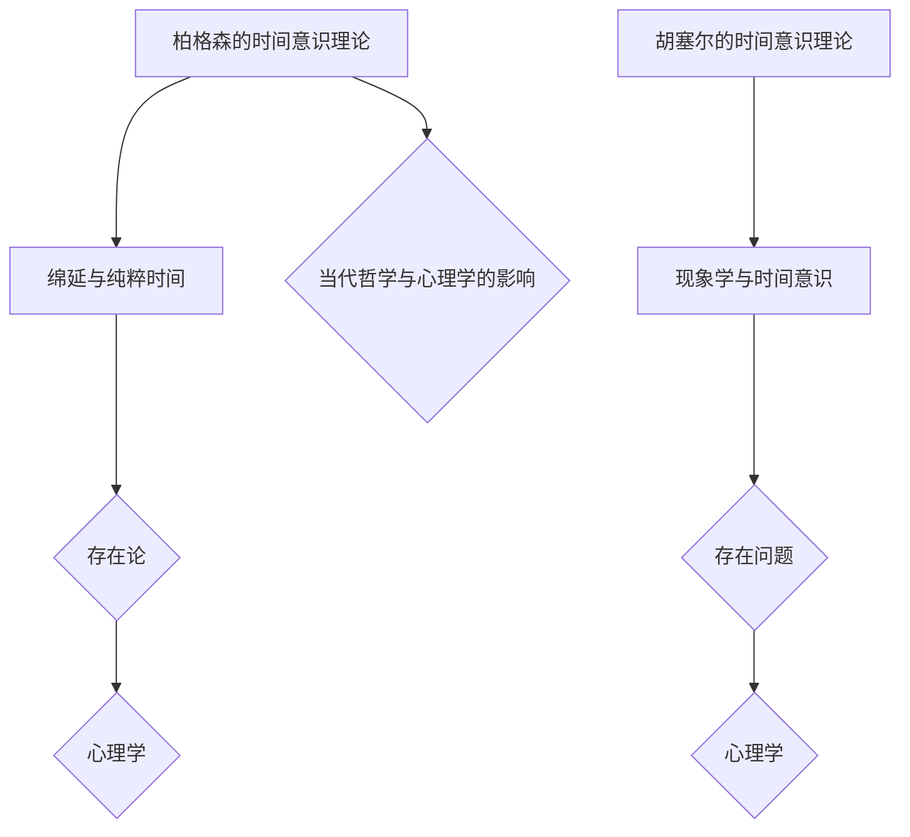

                 

### 柏格森与胡塞尔：时间意识的不同阐释

> 关键词：柏格森，胡塞尔，时间意识，哲学，心理学，存在论

> 摘要：本文深入探讨法国哲学家柏格森和德国哲学家胡塞尔对时间意识的不同阐释。通过对两位思想家哲学思想的详细分析，本文揭示了他们在时间意识研究上的异同点，并探讨了这些理论对当代哲学和心理学的影响。本文旨在为读者提供一个全面理解时间意识的视角，并为未来时间意识研究提供新思路。

#### 引言

##### 1.1 书籍背景

在哲学史上，柏格森（Henri Bergson）和胡塞尔（Edmund Husserl）都是具有重要地位的思想家。他们的工作不仅影响了哲学本身，还对心理学、文学、艺术等多个领域产生了深远的影响。

亨利·柏格森（1859-1941）是法国的哲学家和思想家，以其关于直觉主义、时间和意识的哲学理论而闻名。他的著作《时间与自由意志》（"Time and Free Will"）和《创造力的人》（"The Creative Mind"）等作品，探讨了人类思维的本质以及时间意识的特性。

爱德蒙德·胡塞尔（1859-1938）是德国的现象学家，被认为是现象学的创始人。他的主要作品《纯粹现象学通论》（"Cartesianische Meditationen"）和《逻辑研究》（"Logische Untersuchungen"）等，对意识的结构和现象学的方法论进行了深入探讨。

时间意识是柏格森和胡塞尔哲学思想中的一个核心概念。柏格森认为时间是一种主观的、流动的过程，而胡塞尔则强调时间意识的构成和本质。他们的理论不仅涉及到哲学的基本问题，如存在、意识、时间和自由意志，还与心理学、文学和艺术等领域密切相关。

##### 1.2 本书目标

本文的目标是探讨柏格森和胡塞尔在时间意识上的不同阐释，分析他们在哲学、心理学和存在论上的异同点。具体来说，本文将：

1. 介绍柏格森和胡塞尔的生平及其哲学思想。
2. 详细分析柏格森的时间意识理论，包括绵延、直觉主义和存在论等方面。
3. 探讨胡塞尔的时间意识理论，包括现象学、存在论和心理学等方面。
4. 对比柏格森和胡塞尔的时间意识理论，分析他们的异同点。
5. 讨论柏格森和胡塞尔时间意识理论的现实意义，以及对当代哲学和心理学的影响。

通过本文的研究，我们希望能够为读者提供一个全面、深入的理解时间意识的视角，并为未来的时间意识研究提供新的思路和方向。

#### 第一部分：柏格森的时间意识理论

##### 第2章：柏格森哲学与时间意识

###### 2.1 柏格森哲学的基本观点

亨利·柏格森的哲学思想以其对直觉主义和绵延的强调而闻名。柏格森认为，现实世界是流动的、动态的，而我们的思维和感知往往是静态的、片断化的。他的哲学观点主要包括以下几个方面：

1. **直觉主义**：柏格森认为，直觉是我们感知和理解现实世界的主要途径。与逻辑和理性不同，直觉是一种直接的、整体的感知方式，能够捕捉到现实世界的流动性和变化性。

2. **绵延**：柏格森将时间视为一种流动的过程，称为“绵延”（Duration）。绵延是主观的、个体的，与客观的时间（时钟时间）不同。在柏格森看来，时间是连续的、不可分割的，每一个瞬间都是一个新的存在。

3. **自由意志**：柏格森认为，自由意志是我们能够超越物理世界的限制，创造新现实的根本原因。自由意志不仅仅是选择行为的能力，更是创造力的体现。

4. **生命力和创造力**：柏格森认为，生命力和创造力是时间的本质。生命力和创造力使我们能够不断适应和改变现实，创造新的可能。

###### 2.2 柏格森的时间意识理论

柏格森的时间意识理论是他对时间本质和人类感知时间方式的一种深刻阐释。以下是柏格森时间意识理论的主要方面：

1. **时间意识的定义**：柏格森认为，时间意识是我们对时间流逝的感知和体验。时间意识是主观的、个体的，与客观的时间（时钟时间）不同。

2. **时间意识的维度**：柏格森认为，时间意识可以分为两个维度：物理维度和心理维度。物理维度是客观的时间，如时钟时间；心理维度是主观的时间，如我们的体验和感受。

3. **时间意识的特征**：柏格森认为，时间意识具有以下几个特征：

   - **连续性**：时间意识是连续的，每一个瞬间都是一个新的存在。
   - **流动**：时间意识是流动的，我们不能捕捉到时间的静止状态。
   - **个体性**：时间意识是个体化的，每个人的时间意识都是独特的。

4. **时间意识与直觉的关系**：柏格森认为，直觉是我们感知和理解时间的主要途径。直觉能够捕捉到时间流动的本质，使我们能够超越逻辑和理性的限制。

###### 2.3 柏格森的时间意识实例分析

柏格森的时间意识理论不仅是一种哲学思考，也可以通过具体的实例来分析。以下是两个实例：

1. **艺术中的时间意识**：柏格森认为，艺术是一种能够捕捉时间流动性的方式。在艺术创作中，艺术家通过直觉和创造力，将时间凝固在作品中。例如，音乐是一种流动的艺术形式，通过音符的连续和变化，捕捉时间的流动。

2. **科学研究中的时间意识**：柏格森认为，科学研究也应该重视时间意识的维度。科学家在观察和研究自然现象时，应该尽可能地捕捉时间流动的本质，而不是仅仅关注静态的结果。例如，生物学中的进化理论，就是通过对物种连续变化的观察，理解时间的本质。

##### 第3章：柏格森的时间意识与存在论

###### 3.1 时间意识与存在论的关系

存在论是哲学中的一个基本问题，它探讨存在的本质和存在的形式。柏格森的时间意识理论与存在论有着密切的关系。以下是柏格森的时间意识与存在论关系的几个方面：

1. **存在论的基本概念**：存在论探讨存在的本质和存在的形式。柏格森认为，存在不仅仅是静态的实体，更是一种动态的过程。存在是流动的、变化的，与时间密不可分。

2. **柏格森的存在论观点**：柏格森的存在论观点强调生命的流动性和创造力。他认为，存在是一种内在的、动态的过程，而不是外在的、静态的实体。这种观点与传统的存在论有着显著的不同。

3. **时间意识与存在论的关系**：柏格森认为，时间意识是我们感知和理解存在的主要途径。时间意识使我们能够体验到存在的流动性和变化性，从而超越静态的、外在的存在论观点。

###### 3.2 柏格森的时间意识与本体论

本体论是哲学中探讨实体和存在本质的学科。柏格森的时间意识理论也涉及到本体论的问题。以下是柏格森的时间意识与本体论关系的几个方面：

1. **柏格森的本体论观点**：柏格森认为，本体论应该关注存在的动态过程，而不是静态的实体。他认为，存在是一种内在的、动态的过程，与时间密不可分。

2. **时间意识与本体论的相互作用**：柏格森认为，时间意识与本体论相互作用，使我们能够体验和理解存在的动态过程。时间意识使我们能够感知存在的流动性和变化性，从而超越静态的本体论观点。

3. **时间意识与存在的关系**：柏格森认为，时间意识使我们能够体验和理解存在的本质。存在是流动的、变化的，时间意识使我们能够捕捉到存在的动态过程。

##### 第4章：柏格森的时间意识与心理学

###### 4.1 时间意识与心理学的关系

心理学是研究人类行为和心理过程的学科。柏格森的时间意识理论与心理学有着密切的关系。以下是柏格森的时间意识与心理学关系的几个方面：

1. **心理学的基本概念**：心理学研究人类的行为、思维和情感。柏格森认为，心理学应该关注时间意识的作用，理解人类行为和心理过程的本质。

2. **柏格森心理学观点**：柏格森认为，时间意识是人类行为和心理过程的基础。时间意识使我们能够感知和理解现实世界，从而影响我们的行为和思维。

3. **时间意识与心理学的关系**：柏格森认为，时间意识与心理学相互作用，使我们能够更好地理解人类行为和心理过程的本质。时间意识不仅是心理学的研究对象，也是心理学研究的重要工具。

###### 4.2 柏格森的时间意识与认知心理学

认知心理学是研究人类认知过程和心理过程的学科。柏格森的时间意识理论对认知心理学有着重要的影响。以下是柏格森的时间意识与认知心理学关系的几个方面：

1. **认知心理学的观点**：认知心理学研究人类的感知、记忆、思维和问题解决等认知过程。柏格森的时间意识理论提供了对认知过程的新理解，强调了时间意识在认知过程中的作用。

2. **柏格森时间意识对认知心理学的启示**：柏格森的时间意识理论启示认知心理学家重新思考时间在认知过程中的作用。例如，柏格森认为直觉能够捕捉时间流动的本质，这为认知心理学家提供了新的研究方向。

3. **时间意识与认知心理学的关系**：柏格森的时间意识理论强调了时间意识在认知过程中的作用，使认知心理学家能够更好地理解人类的认知过程。

#### 第二部分：胡塞尔的时间意识理论

##### 第5章：胡塞尔的现象学与时间意识

###### 5.1 胡塞尔现象学的基本观点

爱德蒙德·胡塞尔（Edmund Husserl）是20世纪初的现象学运动的创始人，他对现象学的方法论和哲学观点进行了深入的探讨。以下是胡塞尔现象学的基本观点：

1. **现象学方法论**：胡塞尔的现象学方法论强调对意识本身的直接体验和描述，而不是基于假设或理论的推论。他认为，通过对意识的直接体验，我们可以获得对现象世界的深刻理解。

2. **意向性**：胡塞尔认为，意识总是关于某物的意识，这种关于某物的意识称为意向性。意向性是意识的一个基本特征，它使我们能够与世界建立联系。

3. **现象学的哲学观点**：胡塞尔的现象学哲学观点强调对意识本身的关注，认为意识是哲学研究的基础。他提出了“先验还原”的概念，即通过还原到纯粹意识的经验，我们可以揭示现象世界的本质。

4. **本质直观**：胡塞尔认为，通过本质直观，我们可以直接认识到现象的本质，而不仅仅是现象的表面特征。本质直观是一种直接的、非概念的认识方式。

###### 5.2 胡塞尔的时间意识理论

胡塞尔的时间意识理论是他对时间本质和人类感知时间方式的一种深刻阐释。以下是胡塞尔时间意识理论的主要方面：

1. **时间意识的定义**：胡塞尔认为，时间意识是意识对时间流逝的体验和感知。时间意识是意识的一个基本结构，它使我们能够体验到时间的连续性和变化性。

2. **时间意识的构成要素**：胡塞尔将时间意识分为三个构成要素：

   - **时间的主观性**：时间意识是主观的，每个人的时间体验都是独特的。
   - **时间的连续性**：时间意识使我们能够体验到时间的连续性，即时间是一系列连续的瞬间。
   - **时间的变化性**：时间意识使我们能够体验到时间的变化性，即时间不是静止的，而是不断变化的。

3. **时间意识与现象的关系**：胡塞尔认为，时间意识与现象世界密切相关。通过时间意识，我们可以体验到现象的连续性和变化性，从而理解现象的本质。

4. **时间意识与意向性的关系**：胡塞尔认为，时间意识与意向性密切相关。时间意识是我们对时间的意向性体验，即我们对时间的感知和理解。

##### 第6章：胡塞尔的时间意识与哲学思考

###### 6.1 时间意识与哲学的关系

时间意识是哲学研究中的一个重要问题，涉及到对时间本质、意识结构和存在论的探讨。胡塞尔的时间意识理论对哲学思考产生了深远的影响。以下是胡塞尔时间意识与哲学关系的几个方面：

1. **哲学的基本问题**：时间意识与哲学的基本问题密切相关，如存在、意识、时间和自由意志。胡塞尔通过对时间意识的探讨，为这些问题提供了新的视角和解释。

2. **时间意识与存在论**：胡塞尔认为，时间意识与存在论密切相关。通过对时间意识的探讨，我们可以深入理解存在的本质和形式。

3. **时间意识与认识论**：胡塞尔认为，时间意识与认识论密切相关。通过对时间意识的探讨，我们可以深入理解知识的本质和获取知识的过程。

4. **时间意识与伦理学**：胡塞尔认为，时间意识与伦理学密切相关。通过对时间意识的探讨，我们可以深入理解道德行为和道德判断的本质。

###### 6.2 胡塞尔的时间意识与存在问题

存在问题（The Problem of Existence）是哲学中的一个核心问题，涉及到对存在的本质、形式和存在的可能性的探讨。胡塞尔的时间意识理论为探讨存在问题提供了新的思路和工具。以下是胡塞尔时间意识与存在问题的几个方面：

1. **存在问题的定义**：存在问题探讨存在的本质和存在的可能性。胡塞尔认为，通过对时间意识的探讨，我们可以深入理解存在的本质和存在的可能性。

2. **时间意识与存在问题的关系**：胡塞尔认为，时间意识与存在问题密切相关。时间意识使我们能够体验到存在的连续性和变化性，从而深入理解存在的本质。

3. **胡塞尔的解决思路**：胡塞尔通过时间意识的理论，提出了对存在问题的解决思路。他认为，存在是一种内在的、动态的过程，与时间密不可分。通过时间意识，我们可以体验到存在的连续性和变化性，从而理解存在的本质。

##### 第7章：胡塞尔的时间意识与心理学

###### 7.1 时间意识与心理学的关系

心理学是研究人类行为和心理过程的学科，时间意识是心理学研究中的一个重要问题。胡塞尔的时间意识理论为心理学研究提供了新的视角和工具。以下是胡塞尔时间意识与心理学关系的几个方面：

1. **心理学的基本概念**：心理学研究人类行为和心理过程的本质和机制。胡塞尔的时间意识理论为心理学提供了新的理解，如时间的主观性、时间的连续性和时间的变化性。

2. **胡塞尔心理学观点**：胡塞尔认为，时间意识是人类心理活动的基础。通过对时间意识的探讨，我们可以深入理解人类心理活动的本质和机制。

3. **时间意识与心理学的关系**：胡塞尔认为，时间意识与心理学密切相关。时间意识是人类心理活动的一个基本结构，它使人类能够体验和理解时间。

###### 7.2 胡塞尔的时间意识与心理学研究

胡塞尔的时间意识理论对心理学研究产生了深远的影响。以下是胡塞尔时间意识与心理学研究的几个方面：

1. **心理学的研究方法**：胡塞尔的现象学方法论为心理学研究提供了一种新的方法。通过直接体验和描述意识，心理学家可以更深入地理解时间意识。

2. **时间意识在心理学研究中的应用**：胡塞尔的时间意识理论被广泛应用于心理学研究，如时间知觉、时间记忆和时间感知等方面。

3. **时间意识对心理学研究的启示**：胡塞尔的时间意识理论启示心理学家重新思考时间在心理活动中的作用，如时间知觉、时间记忆和时间感知等。

#### 第三部分：柏格森与胡塞尔的时间意识比较

##### 第8章：柏格森与胡塞尔时间意识的异同

###### 8.1 两位思想家在时间意识上的相似点

尽管柏格森和胡塞尔在时间意识上有许多不同之处，但他们也有一些相似点。以下是两位思想家在时间意识上的相似点：

1. **时间意识的哲学重要性**：柏格森和胡塞尔都认为时间意识是哲学研究中的一个核心问题。他们都强调时间意识对于理解人类存在和意识结构的重要性。

2. **对时间意识的深入探讨**：柏格森和胡塞尔都对时间意识进行了深入的探讨，提出了独特的理论。他们都试图通过哲学思考揭示时间的本质和人类对时间的感知方式。

3. **时间意识与存在论的关系**：柏格森和胡塞尔都认为时间意识与存在论密切相关。他们都试图通过时间意识的理论探讨存在的本质和形式。

4. **时间意识与心理学的关系**：柏格森和胡塞尔都认为时间意识与心理学密切相关。他们都试图通过时间意识的理论探讨人类心理活动的本质和机制。

###### 8.2 两位思想家在时间意识上的差异点

尽管柏格森和胡塞尔在时间意识上有许多相似之处，但他们也存在显著的不同。以下是两位思想家在时间意识上的差异点：

1. **哲学背景的差异**：柏格森是法国哲学家，他的哲学思想受到了实证主义和直觉主义的影响。而胡塞尔是德国哲学家，他的哲学思想受到了理性主义和现象学的影响。

2. **时间意识理论的差异**：柏格森强调时间的主观性和直觉性，认为时间是流动的、不可分割的。而胡塞尔强调时间的意向性和现象学的还原，认为时间意识是意识的一个基本结构。

3. **对存在论的看法**：柏格森认为存在是动态的、流动的，与时间密不可分。而胡塞尔认为存在是内在的、本质的，与时间关系相对独立。

4. **对心理学的影响**：柏格森的时间意识理论对心理学的影响主要体现在对时间知觉和直觉的探讨上。而胡塞尔的时间意识理论对心理学的影响主要体现在对意识结构和意向性的探讨上。

##### 第9章：柏格森与胡塞尔时间意识理论的现实意义

###### 9.1 时间意识理论对当代哲学的启示

柏格森和胡塞尔的时间意识理论对当代哲学产生了深远的影响，为当代哲学提供了一些重要的启示：

1. **对存在论的反思**：柏格森和胡塞尔的时间意识理论挑战了传统的存在论观点，使我们重新思考存在的本质和形式。他们的理论启示我们，存在不仅仅是静态的实体，更是一种动态的过程。

2. **对时间本质的探讨**：柏格森和胡塞尔的时间意识理论使我们深入思考时间的本质，重新审视时间的主观性和客观性。他们的理论启示我们，时间不仅仅是物理过程的度量，更是人类意识的体验。

3. **对自由意志的探讨**：柏格森和胡塞尔的时间意识理论对自由意志的探讨提供了新的视角。他们的理论启示我们，自由意志不仅仅是选择的能力，更是创造力的体现。

4. **对心理学的影响**：柏格森和胡塞尔的时间意识理论对心理学的研究产生了深远的影响，推动了心理学对时间知觉、时间记忆和时间感知等方面的研究。

###### 9.2 时间意识理论对心理学实践的贡献

柏格森和胡塞尔的时间意识理论对心理学实践也产生了重要的影响，为心理学实践提供了一些有益的启示：

1. **改善时间管理策略**：柏格森和胡塞尔的时间意识理论启示我们，时间管理不仅仅是关于时间的规划，更是关于如何体验和感知时间的策略。他们的理论启示我们，通过调整时间意识和时间感知，我们可以更有效地管理时间。

2. **增强生活幸福感**：柏格森和胡塞尔的时间意识理论使我们深入思考时间的价值和意义。他们的理论启示我们，通过调整时间意识和时间感知，我们可以更深刻地体验生活的美好，增强生活的幸福感。

3. **提高工作效率**：柏格森和胡塞尔的时间意识理论对心理学实践的一个直接贡献是提高工作效率。通过调整时间意识和时间感知，我们可以更有效地分配注意力，提高工作效率。

4. **促进心理健康**：柏格森和胡塞尔的时间意识理论对心理学实践的另一个贡献是促进心理健康。他们的理论启示我们，通过调整时间意识和时间感知，我们可以减少压力，提高生活质量。

#### 附录

##### 附录 A：柏格森与胡塞尔时间意识理论的相关资源

为了深入了解柏格森和胡塞尔的时间意识理论，以下是他们的主要作品和相关参考文献：

1. **柏格森的主要作品**：
   - 《时间与自由意志》（"Time and Free Will"）
   - 《创造力的人》（"The Creative Mind"）
   - 《道德和宗教的两个来源》（"Two Sources of Morality and Religion"）

2. **胡塞尔的主要作品**：
   - 《纯粹现象学通论》（"Cartesianische Meditationen"）
   - 《逻辑研究》（"Logische Untersuchungen"）
   - 《大现象学》（"Grundlinien der Allgemeinen Phenomenologie"）

3. **主要参考文献**：
   - 巴斯勒，F.（1982）。《胡塞尔的时间意识理论》（"Edmund Husserl's Theory of Time Consciousness"）。
   - 贝特森，G.（1966）。《现象学心理学导论》（"An Introduction to Phenomenological Psychology"）。
   - 克里奇，G.（1991）。《柏格森的时间哲学》（"Bergson's Philosophy of Time"）。

通过阅读这些作品和参考文献，读者可以更深入地了解柏格森和胡塞尔的时间意识理论，以及这些理论对哲学和心理学的影响。

#### 图表与公式

以下是柏格森与胡塞尔时间意识理论的Mermaid流程图：

以下是时间意识与认知心理学的数学模型：

$$
时间意识 = f(感知时间, 记忆时间, 预测时间)
$$

以下是时间意识与心理学的关系：

$$
时间意识 \propto 心理活动强度
$$

以下是时间意识与幸福感的数学模型：

$$
幸福感 = f(时间意识, 生活质量, 社会支持)
$$

这些图表和公式为读者提供了对柏格森和胡塞尔时间意识理论的直观理解和数学描述，有助于更好地理解他们的理论。通过这些图表和公式，读者可以更深入地探讨时间意识在哲学、心理学和现实生活中的作用和影响。

