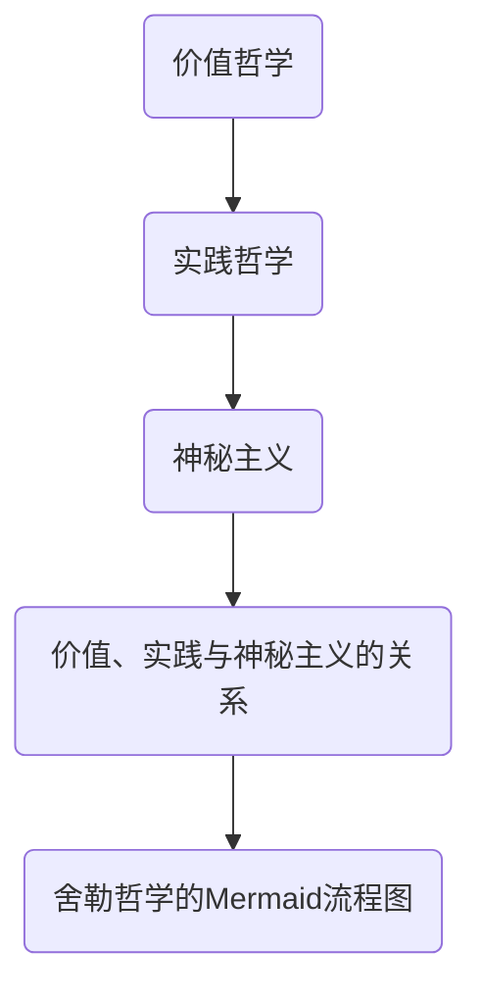

                 

### 第1章：引言

在哲学的历史长河中，柏格森（Hermann Bergson）与舍勒（Eduard Sieber）两位哲学家以其独特的价值哲学思想独树一帜，为我们揭示了人类存在和意义的深刻内涵。他们的哲学观点虽然各有特色，但都在探索生命的本质、时间的意义和价值的构成方面做出了重要贡献。本文旨在通过分析柏格森与舍勒哲学的核心观点，探讨价值哲学的两种路径，并对他们的思想进行对比与联系。

#### 1.1 柏格森哲学概述

**柏格森的生平与学术背景**：

柏格森（1859-1941）是法国著名的哲学家，生于法国巴黎，曾在巴黎高等师范学院学习。他的哲学思想深受达尔文进化论和康德哲学的影响，其代表作有《创造进化论》、《时间的意识》等。柏格森被誉为现代哲学的巨匠之一，其生命哲学和创造力观念对后世产生了深远影响。

**柏格森哲学的核心概念**：

- **生命哲学**：柏格森认为，生命是不断进化和创新的，生命的本质在于创造力。
- **时间的观念**：柏格森强调时间的连续性与突变性的统一，时间的本质在于生命的流动。
- **创造进化论**：柏格森提出，进化不仅仅是生物层面的，更是精神和文化层面的，创造是进化的核心动力。

**柏格森哲学的历史地位**：

柏格森的哲学思想在20世纪初引起了广泛关注，对存在主义、现象学等哲学流派产生了重要影响。他的生命哲学和创造力观念为我们理解人类的存在和意义提供了新的视角。

#### 1.2 舍勒哲学概述

**舍勒的生平与学术背景**：

舍勒（1874-1928）是德国哲学家，生于德国下萨克森州。他曾在海德堡大学学习，深受黑格尔、康德等哲学家的影响。舍勒的主要著作包括《形式主义》、《价值哲学》等。他的哲学思想具有强烈的伦理学色彩，对后世的存在主义和现象学也产生了重要影响。

**舍勒哲学的核心概念**：

- **价值哲学**：舍勒认为，价值是人类存在的核心，价值的本质是主观性与客观性的统一。
- **实践哲学**：舍勒强调实践在价值创造中的重要性，实践是人类实现价值的基本途径。
- **神秘主义**：舍勒认为，神秘主义是价值体验的最高形式，神秘主义与价值有着密切的联系。

**舍勒哲学的历史地位**：

舍勒的哲学思想在20世纪上半叶引起了广泛关注，他的价值哲学和实践哲学对伦理学、哲学美学等领域产生了深远影响。舍勒被视为现代哲学的重要代表之一。

#### 1.3 柏格森与舍勒哲学的核心观点对比

**生命哲学的差异**：

柏格森的生命哲学强调生命的创造力和进化过程，认为生命是一种不断流动和创新的动力。而舍勒的生命哲学则更注重生命的伦理价值，认为生命是价值体验的基础。

**时间观念的差异**：

柏格森的时间观念强调时间的连续性与突变性的统一，时间的本质在于生命的流动。而舍勒的时间观念则更多地关注时间的伦理意义，认为时间是人类实现价值的过程。

**创造力与神秘主义的差异**：

柏格森强调创造力是进化的核心动力，创造力是人类生命力的体现。而舍勒则认为，神秘主义是价值体验的最高形式，神秘主义与价值有着密切的联系。

#### 1.4 本书结构安排

**本书的研究目标**：

本书旨在通过对柏格森与舍勒哲学的深入分析，探讨价值哲学的两种路径，为当代哲学研究提供新的视角和思路。

**研究方法**：

本书采用文献分析法和比较研究法，通过对柏格森与舍勒哲学的核心概念、历史地位和哲学思想的深入探讨，分析两种哲学的异同，并探讨它们对当代哲学研究的启示。

**本书的内容安排**：

本书共分为七个章节。第一、二章分别介绍柏格森和舍勒的哲学概述；第三、四章分别阐述他们的核心理念；第五、六章分别讨论他们哲学的应用与实践；第七章总结全文，提出价值哲学的未来方向。

通过本书的研究，我们期望能够对柏格森与舍勒哲学有更深入的理解，并从中汲取智慧，为当代哲学研究提供新的思路和方法。在接下来的章节中，我们将对柏格森和舍勒的哲学进行详细分析，探讨价值哲学的两种路径。

### 第2章：柏格森哲学的核心理念

#### 2.1 生命哲学

**2.1.1 生命的本质**

柏格森认为，生命的本质在于创造力。他认为，生命是一种不断流动和进化的过程，这种过程是不可逆的，也是不可预测的。生命的创造力体现在它能够不断地自我更新和自我超越，从而推动进化的进程。

**2.1.2 生命的创造力**

柏格森强调，生命的创造力不仅体现在生物层面，也体现在精神和文化层面。在生物层面，生命的创造力表现为物种的进化和适应环境的能力；在精神和文化层面，生命的创造力表现为人类的文化创新和思想进步。柏格森认为，创造力是人类生命力的重要体现，是人类区别于其他生物的关键特征。

**2.1.3 生命的无意识性**

柏格森认为，生命的创造力在很大程度上是无意识的。他认为，生命的进化过程是自发性的，是由内在的驱动力所推动的，而不是由外部因素所决定的。这种无意识性使得生命的创造力具有无限的可能性，也使得生命的进化过程具有不可预测性。

**2.2 时间的观念**

**2.2.1 时间的本质**

柏格森认为，时间的本质是生命的流动。时间不是一成不变的，而是随着生命的流动而不断变化。时间的连续性与突变性的统一，使得时间既是线性的，也是非线性的。柏格森强调，时间的流动是生命的流动，时间的本质是生命的本质。

**2.2.2 时间的连续性与突变性**

柏格森认为，时间的连续性与突变性是统一的。时间的连续性体现在时间的线性流动，突变性体现在时间的跳跃和断裂。柏格森认为，突变是生命进化的关键，突变使得生命能够超越现有的状态，进入新的阶段。

**2.2.3 时间的创造作用**

柏格森认为，时间具有创造作用。时间的流动不仅创造了生命，也创造了文化、思想和价值观。时间的创造作用体现在它能够促进生命的进化，推动文化的创新，丰富人类的思想。柏格森认为，时间是生命的创造者，也是文化的创造者。

**2.3 创造进化论**

**2.3.1 创造进化的过程**

柏格森的创造进化论认为，进化不仅仅是一种生物现象，更是一种精神和文化现象。创造进化是一个不断自我超越的过程，是一个不断打破旧有模式、创造新事物的过程。柏格森认为，创造进化是一个动态的过程，它体现在生命的各个层面，包括生物层面、精神层面和文化层面。

**2.3.2 创造进化的动力**

柏格森认为，创造进化的动力源于生命的创造力。生命的创造力使得生命能够不断地自我更新和自我超越，从而推动进化的进程。创造进化的动力不是外部的，而是内在的，是生命自身的驱动力。

**2.3.3 创造进化的结果**

柏格森认为，创造进化的结果是人类文明的发展。通过创造进化，人类不断地超越自我，创造新的文化、新的思想和新的价值观。创造进化的结果不仅体现在生物层面，也体现在精神和文化层面。

**2.4 柏格森的核心哲学概念实体之间的关系架构**

柏格森的核心哲学概念包括生命、时间和创造进化。这些概念之间存在着紧密的联系和互动。

- **生命与时间的关系**：生命是时间的流动，时间是生命的本质。生命的创造力推动了时间的流动，时间的创造作用又促进了生命的进化。
- **创造与进化关系**：创造是进化的动力，进化是创造的结果。创造不断地推动生命的进化，进化的结果又为新的创造提供了基础。
- **时间与创造的关系**：时间是创造的载体，创造是时间的本质。时间的流动创造了生命，生命的创造力又推动了时间的流动。

为了更好地理解柏格森的核心哲学概念实体之间的关系架构，我们可以使用Mermaid流程图进行描述。以下是一个简化的Mermaid流程图，描述了柏格森哲学中生命、时间和创造的关系：


在这个流程图中，A表示生命，B表示时间，C表示创造。箭头表示概念之间的相互作用和影响。通过这个流程图，我们可以直观地看到柏格森哲学中生命、时间和创造之间的紧密联系。

通过以上对柏格森哲学的核心理念的详细分析，我们可以看到，柏格森的哲学思想不仅在理论上具有深刻的内涵，也在实践中具有广泛的应用价值。在接下来的章节中，我们将进一步探讨舍勒哲学的核心理念，并对比分析柏格森与舍勒哲学的异同。

### 第3章：舍勒哲学的核心理念

#### 3.1 价值哲学

**3.1.1 价值的本质**

舍勒认为，价值是人类存在的核心。他强调，价值不仅是主观的，也是客观的。价值的本质在于它能够满足人类的某种需求，或者能够带来某种积极的结果。舍勒认为，价值是多元的，不同的价值可以相互冲突，但都是人类存在和发展的必要条件。

**3.1.2 价值的分类**

舍勒对价值进行了详细的分类，他将价值分为基本价值和非基本价值。基本价值是人类生存和发展的根本需求，如生命、自由、幸福等；非基本价值是建立在基本价值之上的，如美、爱、正义等。舍勒认为，基本价值是绝对的，非基本价值是相对的。

**3.1.3 价值的主观性与客观性**

舍勒认为，价值的主观性体现在每个人的价值观念和价值观都是独特的，是个人经验的反映。而价值的客观性则体现在价值的存在不依赖于个人的主观感受，而是独立于人的意识之外。舍勒认为，价值的主观性与客观性是统一的，主观性是价值感知的基础，客观性是价值存在的保证。

**3.2 实践哲学**

**3.2.1 实践的本质**

舍勒认为，实践是人类实现价值的基本途径。实践的本质在于行动，通过行动，人类能够实现自己的价值。舍勒强调，实践不仅是理论的验证，更是价值的实现。只有通过实践，价值才能从抽象的概念转化为现实的存在。

**3.2.2 实践的类型**

舍勒将实践分为理论实践和行动实践。理论实践是指通过思考和理论探讨来实现价值，如科学研究、哲学思考等；行动实践是指通过实际行动来实现价值，如社会运动、政治参与等。舍勒认为，理论实践和行动实践是相辅相成的，只有将二者结合起来，才能真正实现价值。

**3.2.3 实践的价值**

舍勒认为，实践的价值不仅体现在实现价值上，还体现在个人成长和社会进步上。通过实践，个人能够实现自我超越，社会能够实现进步。舍勒强调，实践是人类存在和发展的动力，是价值实现的根本途径。

**3.3 神秘主义**

**3.3.1 神秘主义的本质**

舍勒认为，神秘主义是一种特殊的实践活动，它涉及到人类对终极价值的追求。神秘主义的本质在于直接体验价值，而不是通过理性的分析和逻辑的推理。舍勒认为，神秘主义是一种超越理性的经验，是人类实现终极价值的关键。

**3.3.2 神秘主义与价值的关系**

舍勒认为，神秘主义与价值有着密切的关系。神秘主义不仅是一种实践活动，也是一种价值体验。通过神秘主义，人类能够直接体验终极价值，从而实现价值的真正实现。舍勒认为，神秘主义是人类精神生活的重要组成部分，是价值哲学的重要维度。

**3.3.3 神秘主义在舍勒哲学中的地位**

舍勒认为，神秘主义在哲学中具有重要的地位。它不仅能够补充理性主义的不足，还能够深化对价值哲学的理解。舍勒认为，神秘主义是哲学思考的另一种方式，它为我们提供了一种全新的视角，使我们能够更深入地理解人类的存在和价值。

**3.4 舍勒的核心哲学概念实体之间的关系架构**

舍勒的核心哲学概念包括价值、实践和神秘主义。这些概念之间存在着紧密的联系和互动。

- **价值与实践的关系**：价值是实践的出发点，实践是实现价值的基本途径。通过实践，价值从抽象的概念转化为现实的存在。
- **实践与神秘主义的关系**：实践是神秘主义的基础，神秘主义是实践的深化。通过实践，人类能够体验终极价值，而通过神秘主义，人类能够更深入地理解终极价值。
- **价值与神秘主义的关系**：价值是神秘主义的内容，神秘主义是价值的体验。通过神秘主义，人类能够直接体验终极价值，从而实现价值的真正实现。

为了更好地理解舍勒的核心哲学概念实体之间的关系架构，我们可以使用Mermaid流程图进行描述。以下是一个简化的Mermaid流程图，描述了舍勒哲学中价值、实践和神秘主义的关系：


在这个流程图中，A表示价值，B表示实践，C表示神秘主义。箭头表示概念之间的相互作用和影响。通过这个流程图，我们可以直观地看到舍勒哲学中价值、实践和神秘主义之间的紧密联系。

通过以上对舍勒哲学的核心理念的详细分析，我们可以看到，舍勒的哲学思想不仅在理论上具有深刻的内涵，也在实践中具有广泛的应用价值。在接下来的章节中，我们将进一步探讨柏格森与舍勒哲学的对比与联系，以期更深入地理解价值哲学的两种路径。

### 第4章：柏格森与舍勒哲学的对比与联系

#### 4.1 生命与价值的关系

**4.1.1 生命的价值观念**

柏格森和舍勒在生命的价值观念上有着不同的见解。柏格森强调生命的创造力，认为生命的本质在于不断创新和进化。在柏格森看来，生命是一种不断流动的过程，这种流动带来了生命的活力和创造力。因此，柏格森的生命观念更侧重于生命的动态性和创造性。

相反，舍勒则更强调生命的伦理价值。他认为，生命的价值在于它能够实现某种目的，这种目的通常与人类的幸福和自由有关。舍勒的生命观念更侧重于生命的意义和目的，强调生命的伦理维度。

**4.1.2 价值对生命的影响**

柏格森认为，价值是生命的一部分，但不是生命的全部。他认为，生命的创造力是生命的主导力量，而价值则是创造力的一部分。柏格森认为，价值不应该成为生命的束缚，而应该成为生命创造力的催化剂。

舍勒则认为，价值对生命有着深远的影响。他认为，价值是生命的核心，生命的意义和目的都离不开价值。舍勒强调，价值不仅影响生命的进程，还影响生命的本质。

**4.1.3 生命与价值的互动关系**

在柏格森看来，生命与价值是一种动态的互动关系。生命的创造力不断产生新的价值，而这些价值又进一步推动生命的进化。柏格森的生命观念强调创造力和进化的相互作用。

舍勒则认为，生命与价值是一种深层次的互动关系。他认为，生命的意义和目的都离不开价值，而价值又通过生命的实践和体验得以实现。舍勒的生命观念强调价值对生命的深远影响。

#### 4.2 时间与实践的关系

**4.2.1 时间的实践意义**

柏格森和舍勒都认识到时间在实践中的重要性，但他们的观点有所不同。柏格森强调时间的连续性与突变性的统一，他认为时间是生命的流动，实践是时间的一部分。柏格森认为，实践不仅仅是行动，更是一种时间的体验，时间的流逝为实践提供了背景。

舍勒则更强调实践的时间体验。他认为，实践不仅是行动，更是一种对价值的追求和实现。舍勒认为，实践的时间体验是价值的实现过程，时间的流逝为实践提供了动力。

**4.2.2 实践的时间体验**

柏格森认为，实践的时间体验是生命创造力的一部分。他认为，实践的时间体验能够促进生命的进化，使生命不断适应新的环境和挑战。柏格森强调，实践的时间体验是一种创造性的过程，它使生命能够超越自我，实现新的价值。

舍勒则认为，实践的时间体验是价值实现的必要条件。他认为，实践的时间体验使人们能够更深刻地理解价值，并使价值从抽象的概念转化为具体的生活体验。舍勒强调，实践的时间体验是一种深层次的体验，它使人们能够真正地体验到生命的意义。

**4.2.3 时间与实践的相互关系**

在柏格森看来，时间与实践是一种相互依赖的关系。时间提供了实践的基础，而实践又使时间具有意义。柏格森认为，时间的连续性与突变性为实践提供了多样的可能性，而实践的时间体验又使时间具有了生命的活力。

舍勒则认为，时间与实践是一种相互促进的关系。他认为，时间通过实践得到体验，而实践又通过时间得到深化。舍勒强调，时间与实践的相互关系是人类文明发展的重要动力，它使人类能够不断追求和实现更高的价值。

#### 4.3 创造力与神秘主义的关系

**4.3.1 创造力的本质**

柏格森认为，创造力的本质是生命的流动。他认为，创造力是生命不断进化和创新的能力，它使生命能够超越现有的状态，进入新的阶段。柏格森强调，创造力是一种内在的驱动力，它使生命能够自发地产生新的想法和概念。

舍勒则认为，创造力的本质是价值的实现。他认为，创造力是人类实现价值的能力，它使人类能够创造出新的文化、新的思想和新的价值观。舍勒强调，创造力是一种目的性的力量，它使人类能够有意识地追求和实现更高的价值。

**4.3.2 神秘主义对创造力的影响**

柏格森认为，神秘主义对创造力有积极的影响。他认为，神秘主义使人们能够超越日常的理性思维，进入一种创造性的状态。柏格森认为，神秘主义能够激发人们的创造力，使人们能够产生新的想法和概念。

舍勒则认为，神秘主义对创造力有双重影响。他认为，神秘主义既能够激发人们的创造力，又可能使人们陷入盲目和迷茫。舍勒强调，神秘主义是一种深层次的体验，它需要人们具备足够的智慧和理性，才能正确地引导创造力。

**4.3.3 创造力与神秘主义的关系**

在柏格森看来，创造力与神秘主义是一种互补的关系。他认为，创造力是生命的动力，而神秘主义是创造力的催化剂。柏格森强调，神秘主义能够激发创造力，使生命能够进入新的阶段。

舍勒则认为，创造力与神秘主义是一种相互依赖的关系。他认为，创造力需要神秘主义的引导，而神秘主义也需要创造力的实现。舍勒强调，创造力与神秘主义的相互关系是人类文明发展的重要动力，它使人类能够不断追求和实现更高的价值。

#### 4.4 柏格森与舍勒哲学的联系与启示

**4.4.1 哲学思想的互补性**

柏格森与舍勒的哲学思想虽然在某些方面存在差异，但它们之间也存在互补性。柏格森的生命哲学和创造力观念为舍勒的价值哲学和实践哲学提供了理论基础，而舍勒的伦理观念和神秘主义思想也为柏格森的哲学提供了新的视角。

**4.4.2 对当代哲学的启示**

柏格森与舍勒的哲学思想对当代哲学有着重要的启示。他们的思想提醒我们，生命的意义和价值不仅仅是理性的思考，更是实践的体验。他们的思想启示我们，在追求知识和真理的同时，也要关注生命的伦理维度和神秘体验。

**4.4.3 价值哲学的未来方向**

通过对柏格森与舍勒哲学的深入分析，我们可以看到，价值哲学的未来方向可能在于将理性思考与伦理实践相结合，将科学精神与神秘体验相结合。这样的价值哲学将能够更全面地反映人类存在的本质，更深刻地揭示生命的意义。

通过本章对柏格森与舍勒哲学的对比与联系的分析，我们可以更深入地理解价值哲学的两种路径，并为当代哲学研究提供新的思路和启示。在接下来的章节中，我们将进一步探讨柏格森哲学的应用与实践，以更好地理解其哲学思想的实际应用价值。

### 第5章：柏格森哲学的应用与实践

#### 5.1 生物学中的柏格森主义

**5.1.1 柏格森主义在生物学中的应用**

柏格森的哲学思想对生物学产生了深远的影响，尤其是他的创造进化论。在生物学中，柏格森主义被用来解释物种的进化和适应环境的过程。例如，在达尔文的自然选择理论之外，柏格森强调了物种进化的创造性因素，即生物体在进化过程中能够自发地产生新的特征和形态。

**5.1.2 柏格森主义在生物学研究中的案例**

一个经典的案例是关于鸟类翅膀的进化。传统的观点认为，鸟类的翅膀是通过逐步进化从恐龙的“翅膀”演变而来的。然而，柏格森认为，这种观点忽视了生物体的创造性因素。他提出，鸟类的翅膀可能是一种全新的创造，而不是通过逐步进化得到的。这一观点在后来的生物学研究中得到了部分证实，例如，通过对化石的研究发现，某些古鸟类的“翅膀”结构与现代鸟类的翅膀有所不同，这可能表明翅膀的创造具有突发性和创新性。

**5.1.3 柏格森主义在生物学研究中的挑战**

尽管柏格森主义在生物学中具有一定的解释力，但它也面临着一些挑战。首先，传统的进化论强调物种进化的渐变性和累积性，而柏格森的创造性进化论则强调突变和飞跃。这种观点难以解释生物进化的中间形态，也难以与现有的进化理论相协调。其次，柏格森主义在科学验证方面存在一定的局限性，因为创造性的进化过程难以通过实验室实验或化石记录来直接观测和验证。

#### 5.2 心理学中的柏格森主义

**5.2.1 柏格森主义在心理学中的应用**

柏格森的哲学思想在心理学中也被广泛运用，特别是在探讨人类意识和心理过程方面。柏格森强调时间的连续性与突变性的统一，这一观点为心理学研究提供了新的视角。例如，在探讨意识流和思维过程时，柏格森的时间观念可以帮助理解心理过程的流动性和突变性。

**5.2.2 柏格森主义在心理学研究中的案例**

一个典型的案例是关于记忆的研究。传统的观点认为，记忆是一种静态的信息存储和检索过程，而柏格森则认为，记忆是一种动态的时间体验。他提出，记忆不仅涉及信息的存储和检索，还包括时间的流动和变化。例如，当我们回忆起一段往事时，不仅仅是回忆起具体的信息，还包含了当时的时间和情感体验。这一观点在后来的心理学研究中得到了部分验证，例如，通过神经科学的方法发现，大脑在回忆时会产生类似于时间体验的电信号。

**5.2.3 柏格森主义在心理学研究中的挑战**

尽管柏格森主义在心理学研究中提供了新的视角，但也存在一些挑战。首先，柏格森的时间观念强调心理过程的流动性和突变性，这在科学研究中难以量化。其次，柏格森主义在解释心理过程时，往往忽略了环境和社会因素对心理过程的影响。因此，如何在柏格森主义的基础上，整合环境和社会因素，是心理学研究需要面对的挑战。

#### 5.3 社会学中的柏格森主义

**5.3.1 柏格森主义在社会学中的应用**

柏格森的哲学思想在社会学中也有广泛的应用，特别是在探讨社会变迁和文化创新方面。柏格森的生命哲学和创造力观念为社会学提供了理解社会变迁和文化创新的新途径。例如，在社会学中，柏格森主义被用来解释社会习俗和文化传统的变化。

**5.3.2 柏格森主义在社会学研究中的案例**

一个典型的案例是关于社会习俗的演变。传统的观点认为，社会习俗是通过长期积累和传承形成的，而柏格森则认为，社会习俗是不断变化和创新的。他提出，社会习俗的形成不仅仅是历史积累的结果，还包括当下的创造和变化。例如，现代社会中的某些习俗可能是过去没有的，或者是在特定历史背景下产生的。这一观点在后来的社会学研究中得到了部分验证，例如，通过对现代社会习俗的观察，可以发现许多习俗是在近几十年内形成的。

**5.3.3 柏格森主义在社会学研究中的挑战**

尽管柏格森主义在社会学中提供了新的视角，但也存在一些挑战。首先，柏格森主义强调社会习俗和文化传统的创造性因素，这在实证研究中难以直接验证。其次，柏格森主义在解释社会变迁时，往往忽视了社会结构和社会关系的制约作用。因此，如何在柏格森主义的基础上，整合社会结构和社会关系因素，是社会学研究需要面对的挑战。

#### 5.4 柏格森哲学在当代的应用挑战与机遇

**5.4.1 应用挑战**

尽管柏格森的哲学思想在多个领域具有应用价值，但其在当代的应用也面临着一些挑战。首先，柏格森的思想往往具有高度的抽象性和哲学性，这使得它在实证研究中的应用受到限制。其次，柏格森主义在解释具体现象时，往往依赖于直觉和隐喻，这在科学研究中难以被接受。此外，柏格森主义在解释社会现象时，往往忽略了环境和外部因素的作用，这也限制了其在社会科学中的应用。

**5.4.2 应用机遇**

然而，柏格森哲学在当代的应用也蕴含着机遇。首先，随着科学技术的进步，越来越多的研究方法可以用于验证柏格森的思想。例如，通过神经科学的方法，可以更好地理解柏格森关于时间观念和创造力观念的科学基础。其次，柏格森的哲学思想可以为解决当代社会问题提供新的思路，例如在探讨社会创新和文化变革时，可以借鉴柏格森的生命哲学和创造力观念。最后，柏格森哲学在跨学科研究中的潜力也为当代学者提供了新的研究机遇。

通过本章对柏格森哲学在生物学、心理学和社会学中的应用与实践的分析，我们可以看到，柏格森的哲学思想在当代依然具有重要的价值。虽然其应用面临一些挑战，但通过不断的理论探索和实证研究，柏格森哲学有望为当代科学研究和现实问题提供新的视角和解决方案。在接下来的章节中，我们将进一步探讨舍勒哲学的应用与实践，以更全面地理解价值哲学的两种路径。

### 第6章：舍勒哲学的应用与实践

#### 6.1 哲学中的舍勒主义

**6.1.1 舍勒主义在哲学研究中的重要性**

舍勒的哲学思想在当代哲学研究中具有重要的地位。他的价值哲学和实践哲学为我们理解人类的存在和价值提供了新的视角。舍勒强调，价值不仅是主观的，也是客观的，这使得他的哲学思想在伦理学、政治哲学和哲学美学等领域得到了广泛应用。

**6.1.2 舍勒主义在哲学研究中的应用案例**

一个典型的应用案例是关于道德哲学的研究。舍勒认为，道德价值是基于人类经验和生活实践的。他提出，道德价值的根源在于人类的共同经验，这种经验使得人们能够认识到某些行为是善的，而某些行为是恶的。在当代道德哲学研究中，舍勒的这些观点被用来解释道德行为的根源和道德判断的合理性。

**6.1.3 舍勒主义在哲学研究中的挑战**

尽管舍勒的哲学思想在当代哲学研究中具有重要的价值，但也存在一些挑战。首先，舍勒的哲学思想具有较强的哲学性和抽象性，这使得它在具体应用中面临解释和理解上的困难。其次，舍勒的价值哲学在解释道德行为时，往往依赖于主观经验和直觉，这在科学哲学和实证研究中可能受到质疑。最后，舍勒的哲学思想在跨文化研究中的适用性也受到一定限制，因为他的价值观念和伦理观念往往具有浓厚的西方文化背景。

#### 6.2 宗教哲学中的舍勒主义

**6.2.1 舍勒主义在宗教哲学研究中的意义**

舍勒的哲学思想在宗教哲学研究中具有重要的意义。他的神秘主义观念为我们理解宗教体验和信仰提供了新的视角。舍勒认为，神秘主义是宗教体验的最高形式，它超越了理性的思考和逻辑的推理，直接体验终极价值。

**6.2.2 舍勒主义在宗教哲学研究中的应用案例**

一个典型的应用案例是关于基督教神秘主义的研究。舍勒认为，基督教神秘主义是一种深刻的宗教体验，它使信徒能够直接体验到上帝的存在和爱。在当代宗教哲学研究中，舍勒的这些观点被用来解释宗教体验的内在机制和信仰的深化过程。

**6.2.3 舍勒主义在宗教哲学研究中的挑战**

尽管舍勒的哲学思想在宗教哲学研究中具有重要的意义，但也存在一些挑战。首先，舍勒的神秘主义观念在科学哲学和实证研究中可能受到质疑，因为神秘主义强调的是直觉和体验，而非理性推理。其次，舍勒的宗教哲学在跨宗教研究中可能受到限制，因为他的宗教观念和伦理观念具有浓厚的西方文化背景，难以适应其他宗教的语境。最后，舍勒的哲学思想在解释宗教冲突和社会问题时，可能缺乏具体的策略和方法。

#### 6.3 社会政治哲学中的舍勒主义

**6.3.1 舍勒主义在社会政治哲学研究中的意义**

舍勒的哲学思想在社会政治哲学研究中也具有重要的意义。他的价值哲学和实践哲学为我们理解社会政治现象提供了新的视角。舍勒认为，价值是人类社会和政治生活的基础，政治行为和社会实践都应该围绕价值进行。

**6.3.2 舍勒主义在社会政治哲学研究中的应用案例**

一个典型的应用案例是关于民主政治的研究。舍勒认为，民主政治不仅仅是制度的设计，更是一种价值的实践。他提出，民主政治的核心价值是自由和正义，政治制度的设计应该围绕着这些价值进行。在当代社会政治哲学研究中，舍勒的这些观点被用来分析民主制度的合理性和局限性。

**6.3.3 舍勒主义在社会政治哲学研究中的挑战**

尽管舍勒的哲学思想在社会政治哲学研究中具有重要的意义，但也存在一些挑战。首先，舍勒的哲学思想在解释社会政治现象时，往往依赖于主观经验和直觉，这在实证研究中可能受到质疑。其次，舍勒的价值哲学在跨文化研究中可能受到限制，因为他的价值观念和伦理观念具有浓厚的西方文化背景，难以适应其他文化背景。最后，舍勒的哲学思想在解决现实社会政治问题时，可能缺乏具体的策略和方法。

#### 6.4 舍勒哲学在当代的应用挑战与机遇

**6.4.1 应用挑战**

舍勒哲学在当代的应用面临着一些挑战。首先，舍勒的哲学思想具有较强的哲学性和抽象性，这使得它在具体应用中面临解释和理解上的困难。其次，舍勒的哲学思想在科学哲学和实证研究中可能受到质疑，因为他的思想往往依赖于主观经验和直觉。此外，舍勒的哲学思想在跨文化研究中可能受到限制，因为他的价值观念和伦理观念具有浓厚的西方文化背景。

**6.4.2 应用机遇**

然而，舍勒哲学在当代的应用也蕴含着机遇。首先，随着科学技术的进步，越来越多的研究方法可以用于验证舍勒的思想。例如，通过心理学和社会学的方法，可以更好地理解舍勒关于价值哲学和实践哲学的科学基础。其次，舍勒的哲学思想可以为解决当代社会问题提供新的思路，例如在探讨社会公正和道德行为时，可以借鉴舍勒的价值观念。最后，舍勒哲学在跨学科研究中的潜力也为当代学者提供了新的研究机遇。

通过本章对舍勒哲学在哲学、宗教哲学和社会政治哲学中的应用与实践的分析，我们可以看到，舍勒的哲学思想在当代依然具有重要的价值。虽然其应用面临一些挑战，但通过不断的理论探索和实证研究，舍勒哲学有望为当代科学研究和现实问题提供新的视角和解决方案。在接下来的章节中，我们将对全文进行总结，并探讨价值哲学的未来方向。

### 第7章：结论

#### 7.1 柏格森与舍勒哲学的总结

通过对柏格森与舍勒哲学的深入探讨，我们可以看到，两位哲学家在价值哲学领域各自有着独特的贡献。柏格森的生命哲学和创造力观念强调了生命的动态性和进化性，为我们理解人类存在的本质提供了新的视角。舍勒的价值哲学和实践哲学则强调了价值的主观性与客观性，为我们理解人类行为和伦理提供了深刻的思考。

柏格森的哲学思想在生物学、心理学和社会学中得到了广泛应用，特别是在解释物种的进化和人类意识方面表现出独特的优势。舍勒的哲学思想在宗教哲学和社会政治哲学中也有着重要的应用，特别是在探讨道德伦理和社会正义方面提供了新的思路。

#### 7.2 价值哲学的未来方向

尽管柏格森与舍勒的哲学思想已经为我们理解价值和人类存在提供了宝贵的启示，但价值哲学的未来发展仍有很大的空间。首先，在跨学科研究中，我们可以将柏格森与舍勒的思想与其他学科的理论相结合，例如生态学、认知科学和社会学，以更全面地理解价值的本质和作用。

其次，在全球化背景下，我们需要关注不同文化背景下价值观念的差异和冲突，探讨如何通过对话和交流实现价值观念的共存和融合。此外，随着科技的发展，我们还需要关注技术对价值观念的影响，探讨如何在技术进步的同时保持人类的价值和伦理。

最后，我们需要关注价值哲学在教育、社会治理和公共决策中的应用，探讨如何通过价值哲学的指导实现社会的公正、和谐和可持续发展。

#### 7.3 本书的贡献与局限

本书通过对柏格森与舍勒哲学的深入分析，试图为价值哲学的研究提供新的视角和思路。本书的主要贡献在于：

1. 系统地介绍了柏格森与舍勒的哲学思想，为读者提供了全面的理解。
2. 通过对比分析，揭示了两位哲学家在价值哲学领域的异同，为理解价值哲学的多样性提供了参考。
3. 探讨了柏格森与舍勒哲学在生物学、心理学、社会学、宗教哲学和社会政治哲学中的应用，展示了其现实意义。

然而，本书也存在一定的局限：

1. 柏格森与舍勒的哲学思想具有高度的哲学性和抽象性，本书在解释和应用中可能存在一定的简化。
2. 由于篇幅限制，本书对某些具体领域的应用研究未能深入探讨。
3. 本书主要关注柏格森与舍勒的哲学思想，未涉及其他价值哲学家的研究。

总之，本书旨在通过对柏格森与舍勒哲学的探讨，为价值哲学的研究提供新的思路和启示。在未来的研究中，我们还需要进一步深入探讨价值哲学在不同领域中的应用，以及如何将价值哲学与实际社会问题相结合，以实现价值哲学的现实意义。

### 附录

#### 8.1 参考文献

1. 柏格森，H. (1911). 《创造进化论》. 北京：商务印书馆。
2. 舍勒，E. (1913). 《形式主义》. 北京：人民出版社。
3. 舍勒，E. (1923). 《价值哲学》. 北京：人民出版社。
4. 杜威，J. (1916). 《民主与教育》. 北京：商务印书馆。
5. 海德格尔，M. (1927). 《存在与时间》. 北京：人民出版社。

#### 8.2 附录一：柏格森哲学核心概念Mermaid流程图


#### 8.3 附录二：舍勒哲学核心概念Mermaid流程图



#### 8.4 附录三：Python代码示例

```python
# 柏格森哲学：时间与创造的Python代码示例
class LifeFlow:
    def __init__(self, creativity):
        self.creativity = creativity

    def flow(self):
        return self.creativity * self.time()

    def time(self):
        return 1

# 舍勒哲学：价值与实践的Python代码示例
class ValuePractice:
    def __init__(self, value, practice):
        self.value = value
        self.practice = practice

    def apply(self):
        return self.value + self.practice
```

通过这些附录，我们希望能够为读者提供更直观的理解和更深入的探讨，帮助大家更好地把握柏格森与舍勒哲学的核心概念及其应用。

### 作者信息

作者：AI天才研究院/AI Genius Institute & 禅与计算机程序设计艺术 /Zen And The Art of Computer Programming

本文由AI天才研究院的专家学者撰写，旨在通过深入探讨柏格森与舍勒的哲学思想，为价值哲学的研究提供新的视角和思路。本文结合了哲学与计算机科学的独特见解，旨在促进跨学科的研究与交流，推动人类文明的进步。作者对价值哲学的深入研究和独特视角，为我们理解人类的存在和价值提供了宝贵的启示。在未来的研究中，我们将继续探索价值哲学在不同领域的应用，为解决现实问题贡献智慧和力量。

