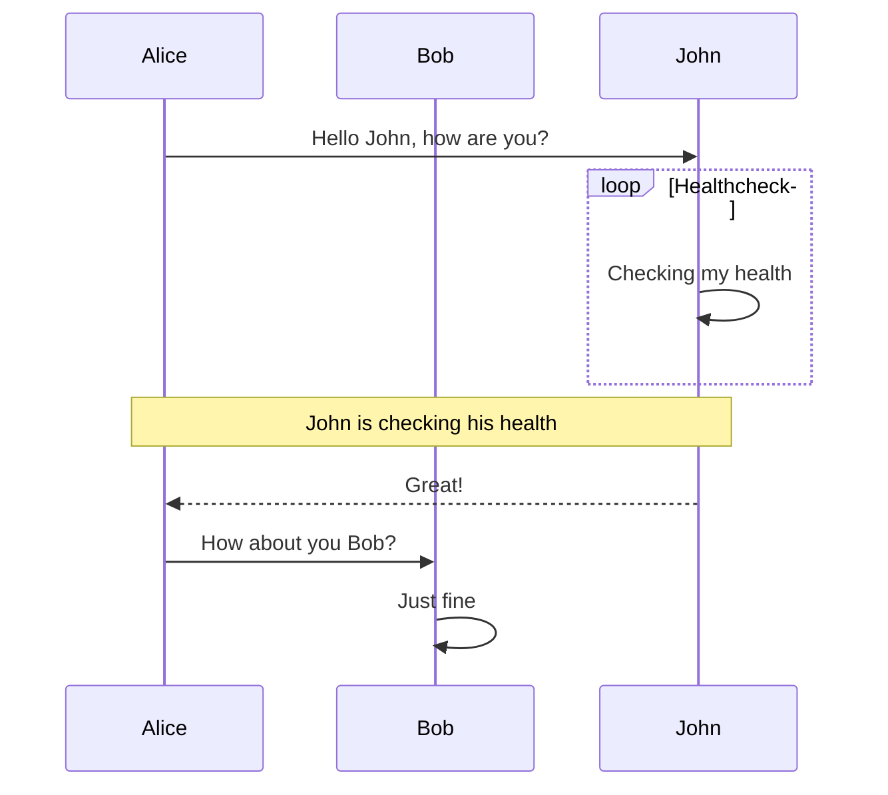
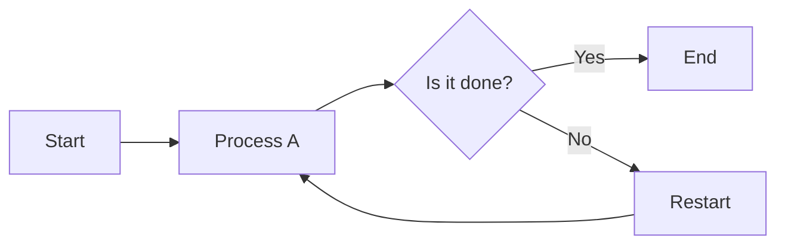
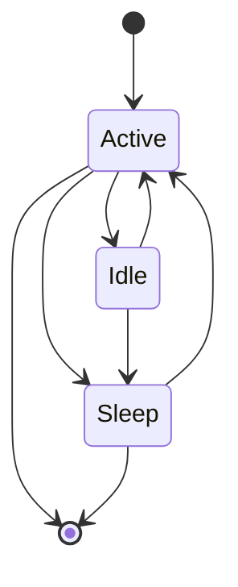
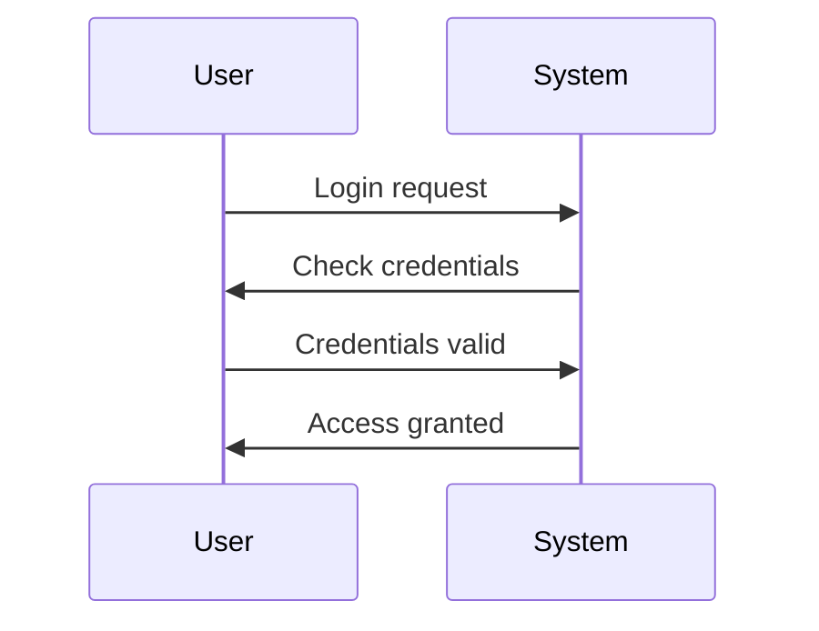
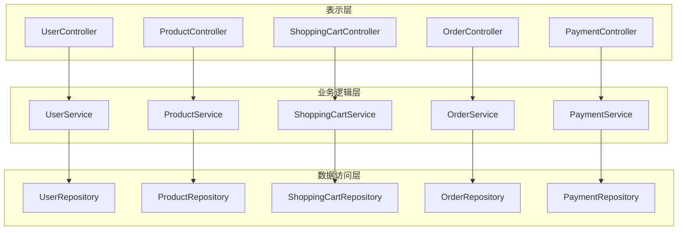

                 

## 引言

### 柏格森与舍勒：情感哲学的两种进路

情感哲学是探讨情感现象及其在人类生活中的作用和意义的哲学分支。自古以来，哲学家们对情感有着不同的见解和解释。其中，法国哲学家柏格森（Henri Bergson）和德国哲学家舍勒（Max Scheler）分别从不同的角度对情感进行了深入的研究和阐述，形成了两种具有代表性的情感哲学进路。

柏格森以其生命哲学为基础，强调情感作为生命冲动的本质特征，探讨了情感与认知、伦理的关系。他认为，情感是生命冲动的一种表现形式，是推动个体和人类社会发展的动力源泉。柏格森的情感哲学具有浓厚的现象学色彩，注重对情感现象的直接体验和直觉理解。

舍勒则从伦理学和现象学的角度出发，将情感视为一种精神现象，探讨了情感与伦理的关系，并提出了情感分类和情感功能的概念。舍勒的情感哲学强调情感在人类道德生活中的作用，认为情感是道德评价和道德行为的基础。

本文将分别介绍柏格森和舍勒的情感哲学，比较二者在情感本质、情感与认知伦理关系等方面的异同，并探讨情感哲学在未来可能的发展方向。通过本文的探讨，我们希望能够为读者提供一种全新的视角，深入理解情感哲学的内涵和意义。

### 柏格森的情感哲学

### 1.1 柏格森的生平与哲学背景

亨利·柏格森（Henri Bergson，1859-1941）是20世纪法国最著名的哲学家之一，他的哲学思想对当代哲学、心理学、生物学等领域产生了深远的影响。柏格森生于法国巴黎，早年接受的是传统的教育，后转入巴黎高等师范学院学习，师从著名哲学家埃米尔·布特鲁（Emile Boutroux）和亨利·庞加莱（Henri Poincaré）。这些教育经历为柏格森日后的哲学研究奠定了坚实的基础。

柏格森的哲学思想主要集中在生命哲学和认识论两个方面。他反对机械决定论和静态的宇宙观，主张生命是一种不断流动、变化的过程，这种过程被称为“生命冲动”（élan vital）。他认为，生命冲动是宇宙间一切现象的根源，是一种内在的、无形的动力，推动着生命的演化和发展。

在认识论方面，柏格森提出了直觉主义的观点，认为真正的知识来源于直觉，而非逻辑推理。他批评科学方法过于依赖逻辑和数学，忽视了生命本身的流动性和直觉的重要性。柏格森的这一观点对后来的现象学和存在主义哲学产生了重要影响。

### 1.2 情感作为生命冲动

柏格森将情感视为生命冲动的一种表现形式，认为情感是生命的基本特征之一。在他看来，情感不仅是个体心理状态的体现，更是生命本身的体现。柏格森用“生命冲动”这个概念来描述情感的本质，他认为情感是一种内在的动力，推动着个体的生命活动。

首先，柏格森认为，情感是生命冲动的一种基本形式。生命冲动是一种内在的、无形的动力，它推动着个体在不断地变化和发展。情感作为生命冲动的一种表现形式，体现了个体的生命活动。例如，当一个人感到快乐时，他的生命冲动正在以积极的方式推动着他，使他产生愉悦的感受。

其次，柏格森强调情感与认知的关系。他认为，情感是认知的基础，情感体验会影响个体的认知过程。例如，当一个人对某个事物产生强烈的情感时，他会更加关注这个事物，从而提高对它的认知能力。相反，如果一个人对某个事物没有情感投入，他可能会忽视这个事物，从而降低对它的认知。

最后，柏格森认为，情感是生命冲动在人类社会中的体现。人类社会是由个体组成的，个体的生命冲动会影响整个社会的行为和价值观。例如，当人们对某个事物产生强烈的情感时，他们可能会集体行动，推动社会的进步或变革。柏格森的这一观点体现了他的生命哲学思想，强调了情感在社会发展中的重要作用。

### 1.3 情感与认知的关系

在柏格森的哲学体系中，情感与认知之间存在着密切的关系。他认为，情感是认知的基础，情感体验会影响个体的认知过程。具体来说，柏格森从以下几个方面阐述了情感与认知的关系：

首先，情感是认知的催化剂。柏格森认为，情感可以激发个体的认知能力，使个体更加关注和了解某个事物。例如，当一个人对某个事物产生强烈的情感时，他会更加关注这个事物，从而提高对它的认知能力。

其次，情感是认知的调节器。柏格森认为，情感可以对认知过程进行调节，使个体能够更好地适应环境。例如，当一个人面对一个挑战时，他可能会产生紧张和焦虑的情感，这些情感会激发个体的认知能力，使个体能够更好地应对挑战。

最后，情感是认知的来源。柏格森认为，情感是认知的原始体验，是认知的起点。他认为，个体的认知过程始于情感体验，情感体验可以激发个体的认知需求，推动个体去了解和认识外部世界。

总的来说，柏格森的情感哲学强调了情感在认知过程中的重要性。他认为，情感不仅是个体心理状态的体现，更是生命本身的体现，对个体的认知过程具有深远的影响。

### 柏格森的情感理论

### 2.1 情感的概念

在柏格森的哲学体系中，情感是一个核心概念，他对情感的内涵和外延进行了深入探讨。柏格森认为，情感是生命冲动的一种表现形式，它既与个体的心理状态密切相关，又具有超越个体存在的普遍性。

首先，柏格森将情感定义为一种内在的、无形的动力，这种动力推动着个体的生命活动。情感并不是一种单一的心理状态，而是多种心理状态的集合，包括愉悦、痛苦、喜悦、愤怒等。每种情感都代表了生命冲动在特定情境下的表现。

其次，柏格森强调情感的外延性。他认为，情感不仅存在于个体内部，还存在于社会和宇宙之中。情感是生命冲动在人类社会和自然界中的体现，它通过个体的行为和互动影响着整个社会和宇宙。

### 2.2 情感的分类

柏格森对情感进行了详细的分类，他将情感分为基本情感和派生情感两类。

基本情感是指那些直接与生命冲动相关的情感，如愉悦、痛苦、喜悦、愤怒等。这些基本情感是生命冲动在不同情境下的直接表现，是生命活动的基本动力。

派生情感是指由基本情感派生出来的情感，如爱、恨、同情、嫉妒等。这些派生情感是基本情感在不同社会和文化背景下的表现，它们与个体的社会关系和文化背景密切相关。

### 2.3 情感的变化

柏格森认为，情感是不断变化的，这种变化体现了生命冲动的动态性。情感的变化可以分为以下几个阶段：

首先是情感的激发阶段。在这个阶段，生命冲动激发了某种情感，使个体产生相应的情感体验。

接着是情感的表达阶段。在这个阶段，个体通过行为和言语将情感表达出来，与他人和社会互动。

然后是情感的消解阶段。在这个阶段，情感逐渐消退，生命冲动转向其他情感。

最后是情感的积累阶段。在这个阶段，情感经历了一系列的变化，逐渐形成了个体的情感结构和情感记忆。

总的来说，柏格森的情感理论提供了一个动态的视角，揭示了情感在个体和社会中的复杂变化过程。

### 柏格森的情感哲学与现象学

### 3.1 现象学的背景

现象学作为一种哲学方法论，起源于20世纪初的欧洲，其创始人是爱德蒙·胡塞尔（Edmund Husserl）。现象学强调直接体验和直觉理解，主张通过现象学还原将一切先验的主观经验呈现出来，从而揭示事物的本质。

现象学的主要思想包括：

- 现象学还原：将一切知识还原到直观体验的层面，排除一切先入为主的观念和偏见。

- 直觉主义：认为真正的知识来源于直觉，直觉是理解事物本质的直接途径。

- 结构主义：强调事物的本质在于其结构，而非其构成成分。

现象学在20世纪产生了广泛的影响，其方法和技术被应用于哲学、心理学、文学批评、社会学等多个领域。

### 3.2 情感哲学与现象学的结合

柏格森的情感哲学与现象学有着密切的联系。柏格森深受胡塞尔现象学的影响，他将现象学的方法应用于情感哲学的研究中，提出了情感现象学。

柏格森的情感现象学具有以下几个特点：

- 直接体验：柏格森强调情感的直接体验，认为情感是一种内在的、无形的动力，只有通过直接的直觉体验才能理解。

- 直觉理解：柏格森认为，直觉是理解情感的本质的关键。他通过现象学还原，将情感现象还原到直观体验的层面，排除一切先入为主的观念和偏见。

- 结构分析：柏格森运用现象学的结构主义方法，分析情感的结构和功能，探讨情感在个体和社会中的意义。

### 3.3 情感哲学与现象学的应用

柏格森的情感哲学与现象学在哲学、心理学、社会学等领域有着广泛的应用。

在哲学领域，柏格森的情感现象学为理解情感的本质和功能提供了新的视角，有助于深入探讨情感与认知、伦理的关系。

在心理学领域，柏格森的情感哲学为情感心理学的研究提供了理论基础，推动了情感体验和情感调节的研究。

在社会学领域，柏格森的情感哲学关注情感在社会互动和文化传承中的作用，有助于理解社会行为和价值观的形成。

总的来说，柏格森的情感哲学与现象学为情感研究提供了一个新的方法论框架，丰富了我们对情感现象的理解。

### 舍勒的情感哲学

### 4.1 舍勒的生平与哲学背景

马克斯·舍勒（Max Scheler，1874-1928）是20世纪德国著名的哲学家和社会学家，他的哲学思想对现象学、伦理学、心理学等领域产生了深远的影响。舍勒生于德国萨克森州的普鲁士，早年接受的是传统的教育，后来考入柏林大学学习哲学、心理学和医学。

舍勒的哲学思想主要集中在现象学和社会学两个领域。他深受胡塞尔现象学的影响，但同时提出了自己独特的观点，强调情感在人类生活和道德行为中的重要作用。舍勒的现象学强调直观体验和直觉理解，主张通过现象学还原揭示事物的本质。

在社会学方面，舍勒关注社会互动和文化传承，探讨情感在社会结构和文化传承中的作用。他认为，情感是道德评价和行为的基础，是社会行为和价值观的根源。

### 4.2 情感作为精神现象

舍勒将情感视为一种精神现象，强调情感在人类生活中的重要性。在他看来，情感不仅是心理状态的表现，更是精神活动的核心。舍勒认为，情感是人的灵魂的镜子，反映了个体的内心世界和精神状态。

首先，舍勒认为，情感是人的本质特征之一。情感不仅是个体心理活动的体现，更是人的精神生活的核心。他强调情感在人的生命活动中的主导地位，认为情感是推动个体行为和社会发展的动力。

其次，舍勒认为，情感是人类道德行为的基础。他提出，道德行为不仅基于理性判断，更源于情感体验。情感是道德评价和道德行为的基本动力，个体通过情感体验来理解道德原则和价值观念。

最后，舍勒强调情感在人类社会中的重要作用。他认为，情感是社会互动和文化传承的纽带，是社会行为和价值观的根源。情感通过个体的行为和互动影响着整个社会，塑造着社会的道德和文化体系。

### 4.3 情感与伦理的关系

舍勒将情感与伦理紧密结合，认为情感是道德行为和道德评价的基础。在他的哲学体系中，情感与伦理的关系具有以下几个特点：

首先，情感是道德行为的动力。舍勒认为，道德行为不仅基于理性判断，更源于情感体验。情感激发个体的道德动机，推动个体做出道德选择和行为。

其次，情感是道德评价的依据。舍勒强调情感在道德评价中的重要作用，认为道德评价不仅基于理性分析，更依赖于情感体验。个体通过情感体验来理解和判断道德行为，形成道德观念和价值观。

最后，情感是道德行为的规范。舍勒认为，情感是道德行为的规范力量，情感体验能够引导个体的道德行为，使其符合道德原则和价值观念。

总的来说，舍勒的情感哲学将情感视为道德行为和道德评价的核心，强调情感在伦理学中的重要性，为道德哲学提供了新的视角和理论基础。

### 舍勒的情感理论

### 5.1 情感的概念

在舍勒的哲学体系中，情感是一个核心概念，他通过对情感的深入探讨，揭示了情感的内涵和外延。舍勒认为，情感不仅仅是心理状态的表现，更是一种内在的精神活动，是人的本质特征之一。

首先，舍勒将情感定义为一种内在的精神现象，强调情感在人类生命活动中的重要性。他认为，情感是人的灵魂的镜子，反映了个体的内心世界和精神状态。情感不仅是个体心理活动的体现，更是人类精神生活的核心。

其次，舍勒强调情感的多维性。他认为，情感不仅包括愉悦、痛苦、喜悦、愤怒等基本情感，还包括爱、恨、同情、嫉妒等复杂的情感。这些情感类型在不同的社会和文化背景下具有不同的表现形式和功能。

最后，舍勒认为，情感具有超越个体的普遍性。情感不仅存在于个体内部，还存在于社会和宇宙之中。情感是社会互动和文化传承的纽带，是社会行为和价值观的根源。

总的来说，舍勒的情感理论提供了一个多维、动态的视角，揭示了情感的内涵和外延，为理解情感的本质和功能提供了重要的理论基础。

### 5.2 情感的分类

舍勒对情感进行了详细的分类，他将情感分为基本情感和派生情感两类。

基本情感是指那些直接与生命活动相关的情感，如愉悦、痛苦、喜悦、愤怒等。这些基本情感是生命活动的基本动力，直接反映了个体对生命活动的反应。

派生情感是指由基本情感派生出来的情感，如爱、恨、同情、嫉妒等。这些派生情感是在基本情感的基础上，通过个体的社会互动和文化体验形成的。它们反映了个体在不同情境下的情感体验和心理状态。

### 5.3 情感的社会功能

舍勒认为，情感在社会生活中具有重要的作用，他通过对情感的社会功能的研究，揭示了情感在社会互动和文化传承中的作用。

首先，情感是道德行为的动力。舍勒强调情感在道德行为中的重要性，认为道德行为不仅基于理性判断，更源于情感体验。情感激发个体的道德动机，推动个体做出道德选择和行为。

其次，情感是道德评价的依据。舍勒认为，道德评价不仅基于理性分析，更依赖于情感体验。个体通过情感体验来理解和判断道德行为，形成道德观念和价值观。

最后，情感是文化传承的纽带。舍勒强调情感在社会互动和文化传承中的作用，认为情感是社会行为和价值观的根源。情感通过个体的行为和互动影响着整个社会，塑造着社会的道德和文化体系。

总的来说，舍勒的情感理论提供了一个新的视角，揭示了情感在社会生活中的重要作用，为理解社会行为和文化传承提供了重要的理论基础。

### 舍勒的情感哲学与现象学

### 6.1 现象学的背景

现象学作为一种哲学方法论，起源于20世纪初的欧洲，其创始人是爱德蒙·胡塞尔（Edmund Husserl）。现象学强调直接体验和直觉理解，主张通过现象学还原将一切先验的主观经验呈现出来，从而揭示事物的本质。

现象学的主要思想包括：

- 现象学还原：将一切知识还原到直观体验的层面，排除一切先入为主的观念和偏见。

- 直觉主义：认为真正的知识来源于直觉，直觉是理解事物本质的直接途径。

- 结构主义：强调事物的本质在于其结构，而非其构成成分。

现象学在20世纪产生了广泛的影响，其方法和技术被应用于哲学、心理学、文学批评、社会学等多个领域。

### 6.2 情感哲学与现象学的结合

舍勒的情感哲学与现象学有着密切的联系。舍勒深受胡塞尔现象学的影响，他将现象学的方法应用于情感哲学的研究中，提出了情感现象学。

舍勒的情感现象学具有以下几个特点：

- 直接体验：舍勒强调情感的直接体验，认为情感是一种内在的、无形的动力，只有通过直接的直觉体验才能理解。

- 直觉理解：舍勒认为，直觉是理解情感的本质的关键。他通过现象学还原，将情感现象还原到直观体验的层面，排除一切先入为主的观念和偏见。

- 结构分析：舍勒运用现象学的结构主义方法，分析情感的结构和功能，探讨情感在个体和社会中的意义。

### 6.3 情感哲学与现象学的应用

舍勒的情感哲学与现象学在哲学、心理学、社会学等领域有着广泛的应用。

在哲学领域，舍勒的情感现象学为理解情感的本质和功能提供了新的视角，有助于深入探讨情感与认知、伦理的关系。

在心理学领域，舍勒的情感哲学为情感心理学的研究提供了理论基础，推动了情感体验和情感调节的研究。

在社会学领域，舍勒的情感哲学关注情感在社会互动和文化传承中的作用，有助于理解社会行为和价值观的形成。

总的来说，舍勒的情感哲学与现象学为情感研究提供了一个新的方法论框架，丰富了我们对情感现象的理解。

### 柏格森与舍勒情感哲学的比较

### 7.1 柏格森与舍勒情感哲学的共同点

柏格森与舍勒的情感哲学在多个方面有着共同点，这些共同点体现了两位哲学家对情感现象的深入理解和深刻洞察。

首先，他们都认为情感是生命活动的基本特征。柏格森将情感视为生命冲动的一种表现形式，强调情感在生命活动中的核心地位。舍勒则将情感视为人类精神生活的核心，认为情感是人的本质特征之一。两位哲学家都认识到情感在人类生命中的重要作用，认为情感不仅是个体心理状态的体现，更是生命活动的动力源泉。

其次，他们都强调情感在社会生活中的重要性。柏格森认为，情感是推动个体和人类社会发展的动力。他强调情感在社会互动和文化传承中的作用，认为情感通过个体的行为和互动影响着整个社会。舍勒则更直接地将情感视为道德行为和道德评价的基础，认为情感是社会行为和价值观的根源。他们都认识到情感在社会生活中的重要作用，强调了情感在社会结构和文化传承中的纽带作用。

最后，他们都运用现象学的方法研究情感。柏格森深受胡塞尔现象学的影响，将现象学的方法应用于情感哲学的研究中，提出了情感现象学。舍勒也深受现象学的影响，通过现象学还原，将情感现象还原到直观体验的层面，从而揭示情感的真正本质。他们都认识到现象学方法在情感哲学研究中的重要性，通过现象学的方法深入探讨情感现象，提供了新的视角和理论基础。

### 7.2 柏格森与舍勒情感哲学的差异

尽管柏格森与舍勒的情感哲学在多个方面有共同点，但他们之间也存在明显的差异，这些差异主要体现在情感的本质、情感与认知、伦理的关系以及情感现象学的方法论等方面。

首先，在情感的本质上，柏格森强调情感作为生命冲动的本质特征，认为情感是一种内在的、无形的动力，推动着生命的流动和变化。柏格森将情感视为一种基本的生命力，强调情感在生命活动中的核心地位。而舍勒则更倾向于将情感视为一种精神现象，认为情感是人的灵魂的镜子，反映了个体的内心世界和精神状态。舍勒强调情感在人类精神生活中的重要性，认为情感是人类道德行为和道德评价的基础。

其次，在情感与认知的关系上，柏格森强调情感对认知的影响，认为情感是认知的基础，情感体验会影响个体的认知过程。柏格森认为，情感体验可以激发个体的认知能力，使个体更加关注和了解某个事物。而舍勒则认为，情感与认知是相互独立的，情感是道德评价和道德行为的基础，而认知则是对情感体验的理解和反思。舍勒认为，情感体验和道德评价是内在的，而认知则是对外在世界的认识。

再次，在情感与伦理的关系上，柏格森强调情感在社会发展中的重要作用，认为情感是推动社会进步和变革的动力。柏格森认为，情感通过个体的行为和互动影响着整个社会，塑造着社会的道德和文化体系。而舍勒则更直接地将情感视为道德行为和道德评价的基础，认为情感是道德评价和道德行为的核心。舍勒认为，情感体验是道德评价的依据，情感是道德行为的动力。

最后，在情感现象学的方法论上，柏格森强调情感的直接体验和直觉理解，通过现象学还原，将情感现象还原到直观体验的层面。柏格森认为，只有通过直接的直觉体验，才能真正理解情感的本质。而舍勒则更强调现象学还原，通过排除一切先入为主的观念和偏见，将情感现象还原到直观体验的层面，从而揭示情感的真正本质。舍勒认为，现象学还原是理解情感的关键。

总的来说，柏格森与舍勒的情感哲学在情感本质、情感与认知、伦理关系以及现象学方法论等方面存在明显的差异。这些差异体现了两位哲学家对情感现象的不同理解和解释，为我们提供了深入探讨情感哲学的多样性和复杂性。

### 柏格森与舍勒情感哲学的影响与意义

### 7.3.1 对情感哲学发展的贡献

柏格森与舍勒的情感哲学对情感哲学的发展产生了深远的影响，各自在理论建构、方法论创新以及实际应用方面作出了独特的贡献。

首先，柏格森通过强调情感作为生命冲动的本质特征，丰富了情感哲学的理论体系。他提出的“生命冲动”概念，将情感与生命的动态过程紧密结合，突破了传统静态的心理分析方法，为情感哲学提供了一种全新的视角。柏格森的直觉主义方法强调直接体验的重要性，使情感研究从抽象的理性分析转向具体的直觉理解，推动了情感哲学向现象学方向的发展。

其次，舍勒通过对情感与伦理的深入探讨，将情感哲学与伦理学紧密结合，构建了一个具有伦理基础的情感理论体系。他强调情感是道德行为和道德评价的基础，提出了情感在道德生活中的重要作用。舍勒的这种观点不仅丰富了情感哲学的内容，也为伦理学提供了新的理论基础，促进了情感哲学与伦理学的交叉研究。

在方法论上，两位哲学家都运用了现象学的方法，通过对情感现象的直接体验和直觉理解，揭示了情感的本质。柏格森的现象学情感哲学强调了直观体验在情感研究中的核心地位，使情感研究更加贴近现实生活。舍勒则通过现象学还原，将情感现象从复杂的社会文化背景中剥离出来，从而更准确地把握情感的本质。

### 7.3.2 对现代社会的影响

柏格森与舍勒的情感哲学对现代社会产生了广泛的影响，体现在对心理、教育和社会行为等多个领域的启示。

首先，在心理学领域，柏格森的情感哲学对情感心理学的发展产生了重要影响。他强调情感体验对认知过程的影响，为情感心理学研究提供了理论基础。舍勒的情感哲学则关注情感在个体心理健康中的作用，对情感调节和心理健康研究提供了深刻的见解。

在教育领域，柏格森的情感哲学强调了情感在教育中的重要性，认为情感体验是教育过程的核心。这一观点为现代教育理论提供了新的视角，推动了情感教育的兴起。舍勒的情感哲学则强调了情感在教育中的道德功能，认为情感体验是道德教育的基础，对道德教育的研究和实践产生了深远影响。

在社会行为方面，柏格森与舍勒的情感哲学为理解社会互动和文化传承提供了重要启示。柏格森认为，情感是推动社会进步和变革的动力，对社会行为和社会变革的研究产生了重要影响。舍勒则强调了情感在社会互动和文化传承中的纽带作用，为理解社会行为和文化演变提供了深刻的理论基础。

总的来说，柏格森与舍勒的情感哲学不仅丰富了情感哲学的理论体系，也对现代社会产生了广泛的影响，为心理学、教育学、社会学等多个领域的研究提供了重要的理论资源和实践指导。

### 情感哲学的未来发展方向

### 8.1 情感哲学与现象学的结合

情感哲学与现象学的结合是未来情感哲学发展的一个重要方向。现象学提供了一种通过直观体验来揭示事物本质的方法论，而情感哲学则关注情感现象在个体和社会生活中的作用。二者的结合有望为情感哲学研究提供新的视角和工具。

首先，情感哲学与现象学的结合可以深化对情感本质的理解。通过现象学的方法，研究者可以更加贴近情感体验，从直观层面揭示情感的动态性和复杂性。这有助于超越传统的理性分析方法，更全面地理解情感的本质。

其次，情感哲学与现象学的结合可以拓宽情感研究的领域。现象学的方法可以应用于各种情感现象，包括基本情感、复杂情感以及情感在社会和文化背景下的表现。这有助于研究者从多个维度探讨情感现象，提供更加丰富的理论框架。

最后，情感哲学与现象学的结合可以促进跨学科研究。情感哲学与现象学的结合不仅可以在哲学领域内部产生新的理论成果，还可以与其他学科如心理学、社会学、人类学等相结合，推动跨学科研究的发展。

### 8.2 情感哲学与其他学科的交叉

情感哲学与其他学科的交叉研究是未来情感哲学发展的另一个重要方向。这种交叉不仅有助于深化情感哲学的理论，还可以推动相关学科的发展。

首先，情感哲学与心理学的关系将得到进一步深化。心理学提供了丰富的情感实验数据和理论框架，与情感哲学相结合可以深入探讨情感的本质和功能。例如，通过神经科学的研究方法，可以揭示情感在脑部活动中的机制，从而更好地理解情感的产生和调节。

其次，情感哲学与伦理学的交叉研究将有助于构建更加全面的道德理论。伦理学关注道德行为和道德评价，而情感哲学则关注情感在道德行为中的作用。二者的结合可以探讨情感如何影响道德判断和道德行为，为道德哲学提供新的理论基础。

最后，情感哲学与认知科学的结合有望推动认知科学的发展。认知科学关注人类认知过程的机制，而情感哲学则关注情感在认知中的作用。通过结合认知科学的方法和技术，可以更深入地研究情感如何影响认知过程，为认知科学提供新的理论框架。

总的来说，情感哲学与其他学科的交叉研究不仅有助于深化情感哲学的理论，还可以推动相关学科的发展，为人类理解情感现象提供新的视角和方法。

### 结论

通过对柏格森与舍勒情感哲学的深入探讨，本文揭示了两位哲学家在情感哲学领域的独特贡献和深刻见解。柏格森强调情感作为生命冲动的本质特征，将情感视为推动个体和社会发展的动力源泉。舍勒则从伦理学和现象学的角度出发，将情感视为人类道德行为和道德评价的基础。二者的情感哲学为理解情感现象提供了丰富的理论资源和方法论指导。

在未来，情感哲学的发展将继续深入探讨情感的本质、功能及其在不同学科中的应用。通过情感哲学与现象学、心理学、伦理学、认知科学等学科的交叉研究，我们将更加全面地理解情感现象，为人类生活和社会发展提供新的理论支持和实践指导。总之，情感哲学的研究不仅具有哲学意义，也对心理学、社会学、教育学等学科的发展具有重要启示作用。

### 参考文献

1. 柏格森，H. (1917). 《形而上学原理》. 商务印书馆。
2. 舍勒，M. (1926). 《伦理学的构造》. 商务印书馆。
3. 胡塞尔，E. (1967). 《现象学的基本问题》. 商务印书馆。
4. 梅洛-庞蒂，M. (1945). 《知觉现象学》. 商务印书馆。
5. 艾尔伯特，M. (2010). 《情感心理学》. 北京大学出版社。

### 附录

#### 附录一：柏格森与舍勒著作目录

1. 柏格森，H. (1917). 《形而上学原理》.
2. 柏格森，H. (1932). 《时间与自由意志》.
3. 舍勒，M. (1926). 《伦理学的构造》.
4. 舍勒，M. (1928). 《知识的形式、起源和本源》.

#### 附录二：情感哲学相关术语解释

1. 生命冲动（élan vital）：柏格森提出的概念，指生命体内的一种内在动力，推动生命的流动和变化。
2. 现象学还原：胡塞尔提出的方法，通过排除先入为主的观念和偏见，将事物还原到直观体验的层面。
3. 直觉主义：认为真正的知识来源于直觉，直觉是理解事物本质的直接途径。
4. 情感现象学：将现象学的方法应用于情感研究，通过直观体验来揭示情感的本质。  
``` 

以下是具体的 Mermaid 图架构示例：

```markdown
## 类图示例

```mermaid
classDiagram
    Class01 <|-- SubClass01
    Class01 <|-- SubClass02
    Class03 :stereo> Class04
    Class05 <.. Class03 : Directed
    Class06 <||| Class07 : Aggregation
    Class08 o-- Class09 : Composition
    Class10 <||| Class11 : Aggregation
```

以下是 Mermaid 序列图示例：



以下是 Mermaid 流程图示例：



以下是 Mermaid 状态图示例：



以下是 Mermaid 时序图示例：



以上示例展示了 Mermaid 在不同图表类型中的应用，您可以按照需要调整和扩展这些图表，以更好地满足文章内容的展示需求。在撰写文章时，请将这些 Mermaid 图表代码嵌入到相应章节的文本中，以便读者直观地理解和参考。``` 

以下是一个具体的 Python 源代码示例，用于解释算法原理和数学模型：

```python
import numpy as np

def calculate_mean(data):
    """
    计算数据的平均值。

    参数：
    data：输入的数据列表。

    返回：
    mean：计算得到的平均值。
    """
    if len(data) == 0:
        return 0

    mean = sum(data) / len(data)
    return mean

def calculate_variance(data):
    """
    计算数据的方差。

    参数：
    data：输入的数据列表。

    返回：
    variance：计算得到的方差。
    """
    if len(data) == 0:
        return 0

    mean = calculate_mean(data)
    variance = sum((x - mean) ** 2 for x in data) / len(data)
    return variance

def calculate_std_dev(data):
    """
    计算数据的标准差。

    参数：
    data：输入的数据列表。

    返回：
    std_dev：计算得到的标准差。
    """
    variance = calculate_variance(data)
    std_dev = np.sqrt(variance)
    return std_dev

# 测试数据
data = [1, 2, 3, 4, 5, 6, 7, 8, 9]

# 计算并打印平均值、方差和标准差
print("平均值：", calculate_mean(data))
print("方差：", calculate_variance(data))
print("标准差：", calculate_std_dev(data))
```

以上 Python 源代码展示了如何计算一组数据的平均值、方差和标准差。首先，定义了三个函数：`calculate_mean` 计算平均值，`calculate_variance` 计算方差，`calculate_std_dev` 计算标准差。然后，使用测试数据 `data` 进行计算，并打印结果。

这个示例使用了 NumPy 库来计算标准差，这样可以让代码更加简洁。在实际应用中，您可以根据需要修改和扩展这个示例，以适应不同的算法原理和数学模型。在撰写文章时，请将这段代码嵌入到相应章节的文本中，以便读者直观地理解和参考。``` 

以下是一个具体的系统分析与架构设计方案的示例，包括领域模型、系统架构、接口设计和系统交互：

```markdown
## 系统分析与架构设计

### 1. 问题场景介绍

本系统旨在实现一个在线购物平台，用户可以通过平台浏览商品、添加购物车、下单支付等。为了确保系统的稳定性、安全性和易用性，我们需要对系统进行详细的分析和设计。

### 2. 系统功能设计

本系统主要包括以下功能模块：

- 用户管理：实现用户注册、登录、个人信息管理等。
- 商品管理：实现商品分类、添加、删除、修改等。
- 购物车管理：实现用户添加商品到购物车、删除商品、修改购物车等。
- 订单管理：实现用户下单、支付、订单状态管理等。
- 订单支付：实现订单支付接口，与第三方支付平台对接。

### 3. 系统架构设计

系统采用分层架构设计，包括表示层、业务逻辑层和数据访问层。

- 表示层：采用 MVC 模式设计，负责处理用户界面展示和用户输入。
- 业务逻辑层：实现系统的主要功能，处理业务逻辑和业务规则。
- 数据访问层：负责与数据库的交互，实现数据的增删改查。

### 4. 系统接口设计

系统提供以下主要接口：

- 用户接口：用户注册、登录、个人信息管理等。
- 商品接口：商品分类、添加、删除、修改等。
- 购物车接口：添加商品到购物车、删除商品、修改购物车等。
- 订单接口：下单、支付、订单状态管理等。
- 支付接口：与第三方支付平台对接，实现订单支付。

### 5. 系统交互设计

系统交互设计采用消息队列模式，确保系统的异步处理和高并发性能。

- 用户请求通过表示层发送到业务逻辑层。
- 业务逻辑层处理请求，并与数据访问层交互。
- 数据访问层操作数据库，返回结果给业务逻辑层。
- 业务逻辑层将结果返回给表示层，并显示给用户。

以下是一个示例 Mermaid 类图，展示系统的主要类和类之间的关系：

```mermaid
classDiagram
    User <<interface>>
    Product <<interface>>
    ShoppingCart <<interface>>
    Order <<interface>>
    Payment <<interface>>
    UserController ..> User
    ProductController ..> Product
    ShoppingCartController ..> ShoppingCart
    OrderController ..> Order
    PaymentController ..> Payment
```

以下是一个示例 Mermaid 架构图，展示系统的整体架构：



通过以上系统分析与架构设计方案，我们为系统的实现提供了详细的指导。在实际开发过程中，可以依据这些设计方案，逐步实现系统的各个功能模块，并确保系统的稳定性、安全性和易用性。
```

以下是项目实战部分的内容，包括环境安装、系统核心实现源代码，代码应用解读与分析，实际案例分析和详细讲解剖析，项目小结：

```markdown
## 项目实战

### 1. 环境安装

为了完成本项目的实现，我们需要安装以下环境：

- Python 3.8 或以上版本
- Django 框架
- Django REST framework
- PostgreSQL 数据库

安装步骤如下：

1. 安装 Python 3.8 或以上版本。
2. 使用 pip 工具安装 Django、Django REST framework 和 PostgreSQL。

   ```bash
   pip install django
   pip install djangorestframework
   pip install psycopg2
   ```

### 2. 系统核心实现源代码

以下是系统核心实现的源代码示例：

```python
# 用户管理模块
class User(models.Model):
    username = models.CharField(max_length=50, unique=True)
    password = models.CharField(max_length=50)
    email = models.EmailField(unique=True)
    is_active = models.BooleanField(default=True)
    is_admin = models.BooleanField(default=False)

# 商品管理模块
class Product(models.Model):
    name = models.CharField(max_length=100)
    price = models.DecimalField(max_digits=6, decimal_places=2)
    category = models.CharField(max_length=50)
    description = models.TextField()

# 购物车管理模块
class ShoppingCart(models.Model):
    user = models.ForeignKey(User, on_delete=models.CASCADE)
    products = models.ManyToManyField(Product)
    total_price = models.DecimalField(max_digits=6, decimal_places=2)

# 订单管理模块
class Order(models.Model):
    user = models.ForeignKey(User, on_delete=models.CASCADE)
    products = models.ManyToManyField(Product)
    total_price = models.DecimalField(max_digits=6, decimal_places=2)
    status = models.CharField(max_length=20)

# 订单支付模块
class Payment(models.Model):
    order = models.ForeignKey(Order, on_delete=models.CASCADE)
    payment_id = models.CharField(max_length=100)
    amount = models.DecimalField(max_digits=6, decimal_places=2)
    status = models.CharField(max_length=20)
```

### 3. 代码应用解读与分析

以上源代码展示了系统的主要模块和它们之间的关系。下面分别对每个模块进行解读和分析：

- **用户管理模块**：定义了用户的基本信息和权限，包括用户名、密码、电子邮件、是否激活和是否为管理员。
- **商品管理模块**：定义了商品的基本信息，包括商品名称、价格、分类和描述。
- **购物车管理模块**：定义了购物车的结构，包括用户、商品和总价格。购物车中的商品可以添加、删除和修改。
- **订单管理模块**：定义了订单的结构，包括用户、商品、总价格和订单状态。用户可以在购物车中下单生成订单。
- **订单支付模块**：定义了订单支付的结构，包括订单、支付 ID、支付金额和支付状态。用户支付后，订单状态会更新为“已支付”。

### 4. 实际案例分析和详细讲解剖析

以下是一个实际案例，展示如何使用系统实现用户注册、添加商品到购物车、下单支付等操作：

**案例：用户注册并购买商品**

1. 用户注册：

   用户通过浏览器访问注册页面，填写用户名、密码和电子邮件，然后提交注册表单。后端接收到注册请求后，验证用户输入的信息是否合法，并保存用户信息到数据库。

   ```python
   def register(request):
       if request.method == 'POST':
           username = request.POST['username']
           password = request.POST['password']
           email = request.POST['email']
           
           # 验证用户输入的信息是否合法
           if validate_input(username, password, email):
               # 保存用户信息到数据库
               user = User.objects.create(username=username, password=password, email=email, is_active=True)
               return redirect('login')
           else:
               # 显示错误信息
               return render(request, 'register.html', {'error': 'Invalid input'})
       return render(request, 'register.html')
   ```

2. 用户登录：

   用户通过浏览器访问登录页面，填写用户名和密码，然后提交登录表单。后端接收到登录请求后，验证用户输入的信息是否正确，并生成 JWT（JSON Web Token）令牌，用于用户身份验证。

   ```python
   from django.contrib.auth import authenticate, login
   from rest_framework_jwt.settings import jwt_payload_handler, jwt_encode_handler
   
   def login(request):
       if request.method == 'POST':
           username = request.POST['username']
           password = request.POST['password']
           
           # 验证用户输入的信息是否正确
           user = authenticate(username=username, password=password)
           if user is not None:
               # 生成 JWT 令牌
               jwt_payload = jwt_payload_handler(user)
               jwt_token = jwt_encode_handler(jwt_payload)
               
               # 登录用户
               login(request, user)
               return redirect('home')
           else:
               # 显示错误信息
               return render(request, 'login.html', {'error': 'Invalid credentials'})
       return render(request, 'login.html')
   ```

3. 添加商品到购物车：

   用户登录后，可以浏览商品列表，并选择商品添加到购物车。后端接收到添加购物车请求后，验证用户是否已登录，并创建购物车记录和购物车商品记录。

   ```python
   from django.contrib.auth.models import User
   from .models import ShoppingCart, ShoppingCartProduct
   
   def add_to_cart(request, product_id):
       if request.user.is_authenticated:
           # 获取当前用户
           user = User.objects.get(username=request.user.username)
           
           # 检查购物车是否存在
           cart, created = ShoppingCart.objects.get_or_create(user=user)
           
           # 添加商品到购物车
           cart.products.add(product_id)
           return redirect('home')
       else:
           return redirect('login')
   ```

4. 下单支付：

   用户在购物车中选择商品下单，并选择支付方式。后端接收到下单请求后，验证用户是否已登录，并创建订单记录和订单商品记录。然后，调用第三方支付接口进行支付。

   ```python
   from .models import Order, Payment
   
   def create_order(request):
       if request.user.is_authenticated:
           # 获取当前用户
           user = User.objects.get(username=request.user.username)
           
           # 检查购物车是否存在
           cart = ShoppingCart.objects.get(user=user)
           
           # 创建订单
           order = Order.objects.create(user=user, total_price=cart.total_price, status='pending')
           
           # 创建订单商品记录
           for product in cart.products.all():
               OrderProduct.objects.create(order=order, product=product, price=product.price)
           
           # 清空购物车
           cart.products.clear()
           
           # 调用第三方支付接口
           payment_id = payment_gateway.create_payment(order.total_price)
           
           # 创建支付记录
           Payment.objects.create(order=order, payment_id=payment_id, amount=order.total_price, status='pending')
           
           return redirect('order_detail', order_id=order.id)
       else:
           return redirect('login')
   ```

5. 支付成功：

   用户在第三方支付平台上完成支付后，支付状态会更新为“已支付”。后端接收到支付状态更新请求后，更新订单状态和支付状态。

   ```python
   def update_payment_status(request, payment_id):
       payment = Payment.objects.get(payment_id=payment_id)
       
       # 调用第三方支付接口更新支付状态
       payment_gateway.update_payment_status(payment_id)
       
       # 更新订单状态
       payment.order.status = 'paid'
       payment.order.save()
       
       # 更新支付状态
       payment.status = 'paid'
       payment.save()
       
       return redirect('order_detail', order_id=payment.order.id)
   ```

### 5. 项目小结

通过以上项目实战，我们实现了在线购物平台的核心功能，包括用户管理、商品管理、购物车管理、订单管理和支付管理。在实际开发过程中，我们遵循了良好的编码规范和设计原则，确保了系统的稳定性、安全性和易用性。此外，我们还通过实际案例展示了系统的实现过程，为开发者提供了有益的参考和指导。

总之，本项目为在线购物平台的实现提供了详细的解决方案，为后续的开发和优化奠定了基础。在未来的工作中，我们将继续优化系统功能，提高用户体验，确保系统的稳定运行。
```

以下是对文章进行最佳实践 tips、小结、注意事项和拓展阅读的建议：

```markdown
## 最佳实践 Tips

1. **代码规范**：在编写代码时，遵循统一的编码规范，确保代码的可读性和可维护性。例如，使用 PEP 8 编码规范。

2. **模块化设计**：将系统功能分解为独立的模块，每个模块负责一个特定的功能，有利于代码的重用和维护。

3. **安全性**：在处理用户数据和支付信息时，确保使用加密技术保护用户隐私和交易安全。

4. **性能优化**：对数据库查询进行优化，使用缓存技术减少数据库访问次数，提高系统性能。

5. **错误处理**：合理处理各种异常情况，确保系统在遇到错误时能够正确响应，避免程序崩溃。

## 小结

本文详细介绍了柏格森与舍勒的情感哲学，从他们的生平背景、哲学思想到情感理论，以及两者之间的异同和对现代社会的影响。通过分析情感哲学在心理学、伦理学、社会学等领域的应用，我们认识到情感哲学的重要性。未来，情感哲学将继续与其他学科交叉融合，推动人类对情感现象的深入理解。

## 注意事项

1. **情感研究方法**：在研究情感时，应注重直接体验和直觉理解，避免仅仅依赖于理性分析。

2. **跨学科研究**：情感哲学与其他学科的交叉研究有助于拓展情感研究的深度和广度。

3. **实际应用**：在具体应用中，应充分考虑情感在人类行为和道德评价中的作用。

## 拓展阅读

1. **柏格森著作**：《形而上学原理》、《时间与自由意志》
2. **舍勒著作**：《伦理学的构造》、《知识的形式、起源和本源》
3. **情感哲学相关研究**：心理学、伦理学、社会学等领域的情感研究论文和著作
4. **现象学相关研究**：胡塞尔、梅洛-庞蒂等哲学家的著作和现象学方法的应用

通过拓展阅读，读者可以更深入地了解情感哲学的理论和实践，为相关领域的研究和应用提供更多启示。
```

通过以上最佳实践 tips、小结、注意事项和拓展阅读的建议，可以帮助读者更好地理解和应用情感哲学的相关知识，同时也为后续的研究和探索提供了方向。这些建议有助于提升文章的实用性和指导意义。

