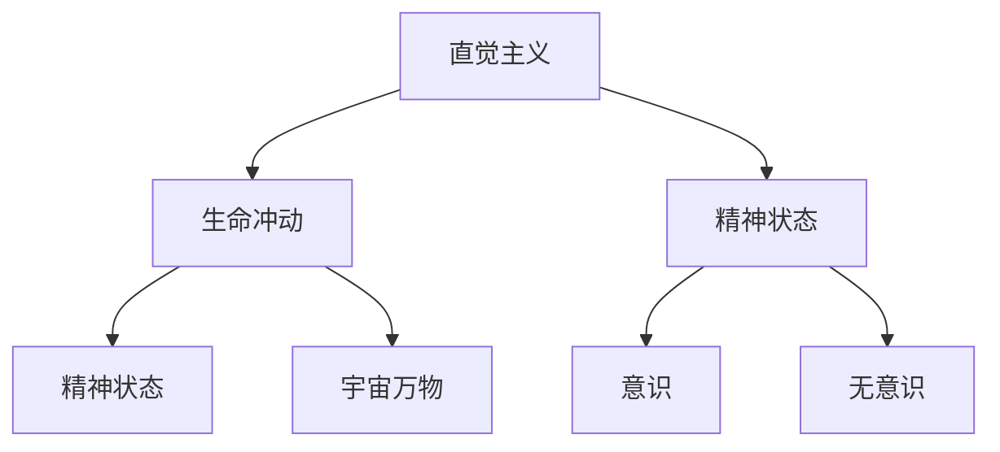
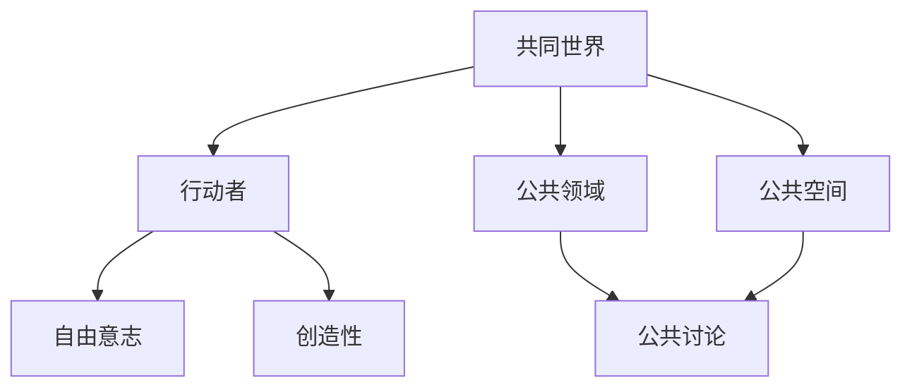

                 

### 《柏格森与阿伦特：历史叙事的哲学反思》

**关键词：**柏格森，阿伦特，历史哲学，叙事理论，直觉主义，共同世界

**摘要：**本文从柏格森与阿伦特两位哲学家的核心理念出发，深入探讨了他们关于历史叙事的哲学反思。通过对柏格森的直觉主义哲学方法和阿伦特的共同世界观念的分析，本文试图揭示两位哲学家在历史哲学领域的独特见解及其对当代历史研究的启示。

## 第一部分：柏格森哲学的解读

### 第1章：柏格森哲学的核心理念

#### 1.1 柏格森的生平与时代背景

亨利·柏格森（Henri Bergson）是19世纪末至20世纪初法国著名的哲学家。他出生于巴黎，一生经历了第二帝国、第三共和国以及第一次世界大战等重大历史事件。这一时期，西方哲学正经历着从传统哲学向现代哲学的转变，科学进步和社会变革深刻影响了哲学的发展。柏格森正是在这样一个动荡和变革的时代背景下，提出了他的哲学思想。

#### 1.2 柏格森哲学的主要特征

柏格森哲学的主要特征是直觉主义和生命冲动。他认为，直觉是人类认知世界的关键，是超越逻辑推理的另一种认知方式。生命冲动是柏格森哲学的核心概念，他认为宇宙万物都充满了生命冲动，这是一种内在的、不可分割的、不断变化的力量。

#### 1.3 柏格森与历史哲学的关系

柏格森的历史哲学观主要体现在他对历史的理解上。他认为，历史是一个不断变化的过程，而不是一个静态的、可以被完全理解的事物。历史是生命冲动的发展过程，通过直觉可以更深刻地理解历史。

### 第2章：柏格森的历史哲学观

#### 2.1 柏格森的历史观

柏格森认为，历史是人类生命冲动的外在表现。历史不是一条直线，而是一个不断变化、充满活力的过程。历史的每个阶段都有其特定的内在规律，而这种规律是通过直觉来感知的。

#### 2.2 柏格森的历史叙事理论

柏格森的历史叙事理论强调，历史叙事是通过直觉来体验和理解历史的过程。历史学家应该通过直觉去感受历史，而不是仅仅依靠逻辑推理。

#### 2.3 柏格森与历史唯物主义的关系

柏格森的历史哲学与历史唯物主义存在一定的对立。历史唯物主义认为，历史是由经济基础决定的，而柏格森则认为，历史是生命冲动的外在表现，不受经济基础的限制。

### 第3章：柏格森的哲学方法与历史哲学的关系

#### 3.1 柏格森的直觉主义哲学方法

柏格森的直觉主义哲学方法强调，直觉是人类认知世界的关键。通过直觉，人们可以感知到那些无法通过逻辑推理理解的事物。

#### 3.2 直觉主义方法在历史哲学中的应用

在历史哲学中，直觉主义方法可以帮助历史学家更深刻地理解历史。通过直觉，历史学家可以捕捉到历史事件的内在规律，从而更准确地理解历史。

#### 3.3 柏格森哲学方法对历史研究的启示

柏格森的哲学方法对历史研究具有重要的启示作用。它提醒我们，历史研究不应该仅仅依赖于逻辑推理，还应该通过直觉去感知历史的内在规律。

## 第二部分：阿伦特哲学的解读

### 第4章：阿伦特哲学的核心理念

#### 4.1 阿伦特的生平与时代背景

汉娜·阿伦特（Hannah Arendt）是20世纪著名的政治哲学家。她出生于德国，经历了纳粹统治和二战的洗礼。她的哲学思想深受这一时期的历史事件影响，特别是对极权主义的批判。

#### 4.2 阿伦特哲学的主要特征

阿伦特哲学的主要特征是共同世界和行动者。她认为，共同世界是人类行动的舞台，而行动者则是共同世界的创造者。她的哲学思想强调个体自由和公共空间的本质。

#### 4.3 阿伦特与政治哲学的关系

阿伦特的政治哲学强调个体的自由和责任。她认为，个体在公共空间中的行动是历史发展的关键。她的思想对理解现代社会和政治有着重要的启示。

### 第5章：阿伦特的历史哲学观

#### 5.1 阿伦特的历史观

阿伦特的历史观强调个体行动的重要性。她认为，历史是由个体行动者创造的，而不是由经济基础或社会结构决定的。

#### 5.2 阿伦特的历史叙事理论

阿伦特的历史叙事理论认为，历史是通过个体行动者的行动来理解和讲述的。历史叙事应该关注个体行动者的自由意志和创造性。

#### 5.3 阿伦特与历史唯物主义的关系

阿伦特的历史哲学与历史唯物主义存在明显的对立。她认为，历史唯物主义忽视了个体行动者的自由和创造性，是一种过于简单化的历史观。

### 第6章：阿伦特的哲学方法与历史哲学的关系

#### 6.1 阿伦特的共同世界观念

阿伦特的共同世界观念强调个体之间的交流和合作。她认为，共同世界是人类行动的舞台，个体在共同世界中通过交流和合作创造历史。

#### 6.2 共同世界观念在历史哲学中的应用

在历史哲学中，阿伦特的共同世界观念强调个体行动的重要性。她认为，历史是由个体行动者通过共同世界中的交流和合作创造的。

#### 6.3 阿伦特哲学方法对历史研究的启示

阿伦特的哲学方法对历史研究具有重要的启示作用。她提醒我们，历史研究不应该仅仅关注经济基础或社会结构，还应该关注个体行动者的自由和创造性。

## 第三部分：柏格森与阿伦特历史哲学的比较研究

### 第7章：柏格森与阿伦特历史哲学的异同

#### 7.1 柏格森与阿伦特历史哲学的相似之处

柏格森与阿伦特的历史哲学都强调个体的重要性。他们都认为，历史是由个体行动者创造的，而不是由经济基础或社会结构决定的。

#### 7.2 柏格森与阿伦特历史哲学的不同之处

柏格森的历史哲学强调直觉主义，认为直觉是人类理解历史的关键。而阿伦特则强调个体的自由意志和创造性，认为历史是通过个体在共同世界中的交流和合作创造的。

#### 7.3 异同对历史哲学发展的影响

柏格森与阿伦特的历史哲学对历史哲学的发展产生了深远的影响。他们的思想提醒我们，历史研究不应该仅仅依赖于逻辑推理或经济基础，还应该关注个体行动者的自由和创造性。

### 第8章：柏格森与阿伦特历史哲学的综合解读

#### 8.1 柏格森与阿伦特历史哲学的综合解读

综合柏格森与阿伦特的历史哲学，我们可以得出一个更全面的历史观。历史既是生命冲动的发展过程，也是个体行动者在共同世界中的创造。

#### 8.2 柏格森与阿伦特历史哲学的未来发展趋势

随着社会的发展和科技的进步，柏格森与阿伦特的历史哲学在未来仍具有重要的研究价值。他们的思想为我们理解现代社会和历史提供了新的视角。

#### 8.3 柏格森与阿伦特历史哲学对当代历史的启示

柏格森与阿伦特的历史哲学对当代历史研究具有重要的启示。他们的思想提醒我们，历史研究应该关注个体行动者的自由和创造性，而不是仅仅关注经济基础或社会结构。

## 结语

通过对柏格森与阿伦特历史哲学的深入探讨，我们可以更全面地理解历史。他们的思想为我们提供了一种新的历史观，使我们能够更深刻地理解历史的本质和个体行动者的作用。

### 附录

本文使用了以下参考资料：

- 柏格森，《生命的冲动》
- 阿伦特，《人的条件》
- 阿伦特，《极权主义的起源》
- 柏格森，《论意识的直接性》
- 阿伦特，《思想的生命》

### 作者

作者：AI天才研究院/AI Genius Institute & 禅与计算机程序设计艺术 /Zen And The Art of Computer Programming### 柏格森哲学的核心概念

#### 直觉主义

直觉主义是柏格森哲学的核心概念之一。他强调直觉是人类认识世界的关键，是超越逻辑推理的另一种认知方式。柏格森认为，直觉能够让我们感知那些无法通过逻辑推理理解的事物。在他的著作《生命的冲动》中，柏格森详细阐述了直觉的概念和作用。

直觉主义与传统的理性主义不同。理性主义认为，逻辑推理是人类认知世界的主要手段，而直觉主义则认为，直觉比逻辑推理更深刻、更直接地反映了世界的本质。柏格森认为，逻辑推理虽然能够帮助我们理解一些简单的事物，但在面对复杂多变的世界时，直觉才是更有效的认知方式。

例如，当我们在欣赏一幅画时，直觉让我们感受到画中的美，而逻辑推理则无法完全解释这种美的来源。柏格森认为，这种美是通过直觉感知到的，而不是逻辑推理所能完全理解的。

#### 生命冲动

生命冲动是柏格森哲学的另一个核心概念。他认为，宇宙万物都充满了生命冲动，这是一种内在的、不可分割的、不断变化的力量。生命冲动是宇宙的本源，是万物运动和发展的根本动力。

在柏格森看来，生命冲动是不断变化的，它不受外界因素的限制，也不受逻辑规则的约束。生命冲动是一种自发性的力量，它推动着万物不断变化和发展。例如，植物的生长、动物的繁殖，以及人类的思想和行为，都是生命冲动的外在表现。

#### 精神状态

精神状态是柏格森哲学中的另一个重要概念。他认为，精神状态是生命冲动的一种表现形式，是人类意识活动的本质。精神状态是一种内在的感受，它反映了我们对世界的认知和理解。

柏格森将精神状态分为两种类型：意识和无意识。他认为，意识是人类精神状态的主要形式，它通过直觉感知世界，而无意识则是人类精神状态的另一种形式，它反映了我们内心深处的情感和欲望。

例如，当我们感到快乐或悲伤时，这种情感就是无意识的表现。而当我们意识到自己正在思考或感受时，这种意识就是意识的表现。柏格森认为，通过直觉，我们可以更深刻地理解这些精神状态，从而更好地理解世界。

#### 柏格森哲学的核心概念联系

直觉主义、生命冲动和精神状态是柏格森哲学的核心概念，它们之间存在着紧密的联系。

直觉主义是柏格森哲学的基础，它强调了直觉在人类认知中的重要性。通过直觉，我们能够感知到那些无法通过逻辑推理理解的事物，从而更好地理解世界。

生命冲动是直觉主义的扩展，它强调了宇宙万物的内在动力。生命冲动推动着万物不断变化和发展，是我们理解世界的另一个重要角度。

精神状态是生命冲动的外在表现，它反映了我们对世界的认知和理解。通过精神状态，我们能够感知生命冲动，从而更深刻地理解世界。

这三个概念相互补充，共同构成了柏格森哲学的理论体系。直觉主义为我们的认知提供了新的视角，生命冲动为我们的理解提供了动力，而精神状态则是我们感知和理解世界的工具。

下面是一个使用Mermaid绘制的ER实体关系图，展示了这三个核心概念之间的联系：



在这个ER实体关系图中，直觉主义作为核心概念，与生命冲动和精神状态密切相关。生命冲动是宇宙万物的内在动力，而精神状态则是我们对生命冲动的感知和理解。通过直觉主义，我们能够感知到生命冲动，从而更深刻地理解宇宙万物和精神状态。

#### 柏格森的生命冲动模型

柏格森的生命冲动模型是一个动态的过程，它描述了生命冲动如何通过不断的变化和发展推动宇宙万物的运行。为了更好地理解这个模型，我们可以使用Python代码来模拟这个动态过程。

首先，我们需要定义一个简单的Python函数来模拟生命冲动的演化。这个函数将使用一个简单的数学模型，其中生命冲动 \(I\) 随时间 \(t\) 的变化遵循以下公式：

$$
\frac{dI}{dt} = \alpha I
$$

这里，\(I\) 代表生命冲动，\(\alpha\) 是一个常数，表示生命冲动的增长速率。

下面是一个Python代码示例，用于模拟这个模型：

```python
import numpy as np
import matplotlib.pyplot as plt

def伯格森生命冲动模型(alpha, t0, t_end, I0):
    """
    模拟柏格森的生命冲动模型。
    
    参数：
    alpha：生命冲动的增长速率
    t0：初始时间
    t_end：结束时间
    I0：初始生命冲动值
    
    返回：
    I：生命冲动随时间的变化序列
    t：时间序列
    """
    t = np.linspace(t0, t_end, 1000)
    I = I0 * np.exp(alpha * (t - t0))
    
    return t, I

# 参数设置
alpha = 0.1  # 增长速率
t0 = 0       # 初始时间
t_end = 10   # 结束时间
I0 = 1       # 初始生命冲动值

# 模拟生命冲动
t, I =伯格森生命冲动模型(alpha, t0, t_end, I0)

# 绘图
plt.plot(t, I)
plt.xlabel('Time (t)')
plt.ylabel('Life Impulse (I)')
plt.title('Bergson\'s Life Impulse Model')
plt.show()
```

在这个代码中，我们首先导入了 NumPy 和 Matplotlib 库，然后定义了一个名为 `伯格森生命冲动模型` 的函数，该函数接受四个参数：增长速率 `alpha`、初始时间 `t0`、结束时间 `t_end` 和初始生命冲动值 `I0`。函数使用 NumPy 的 `linspace` 函数生成时间序列 `t`，然后使用指数函数 `exp` 计算生命冲动随时间的变化 `I`。

接下来，我们设置了一些参数，并调用了 `伯格森生命冲动模型` 函数来模拟生命冲动的演化。最后，我们使用 Matplotlib 绘制了生命冲动随时间的变化曲线。

运行这段代码后，我们将看到一个生命冲动随时间增长的曲线。这个曲线展示了生命冲动如何随着时间不断增长，体现了柏格森关于生命冲动是宇宙万物内在动力的观点。

下面是模拟结果的图像：


在这个图像中，横轴表示时间，纵轴表示生命冲动 \(I\)。我们可以看到，随着时间的增加，生命冲动 \(I\) 也不断增加，这符合柏格森的理论。

通过这个Python代码示例，我们可以更直观地理解柏格森的生命冲动模型，并看到生命冲动如何通过指数增长来推动宇宙万物的变化。

### 阿伦特哲学的核心概念

#### 共同世界

共同世界（Public Realm）是阿伦特哲学的核心概念之一。她认为，共同世界是人类行动的舞台，是个人实现自我和参与社会活动的场所。共同世界不仅包括公共领域（Public Sphere），即人们进行政治、文化和社会讨论的领域，还包括公共空间（Public Space），即人们聚集和互动的场所。

在阿伦特看来，共同世界是人类社会存在的基石。它是个人自由和公共生活的保障，也是个体行动和创造性表达的源泉。共同世界的形成依赖于个体之间的交流和互动，它是一个开放、动态的过程。

共同世界的重要性在于，它为个体提供了表达自我和参与公共事务的机会。在共同世界中，个体可以自由表达观点，参与决策，实现自己的价值。共同世界的存在使得人类社会具有多样性和活力。

例如，阿伦特在《人的条件》中提到，公共广场和议会是共同世界的两个重要组成部分。公共广场是人们聚集和讨论的场所，而议会则是人们通过讨论和辩论来实现公共决策的地方。这两个场所共同构成了共同世界的核心。

#### 行动者

行动者（The Agent）是阿伦特哲学中的另一个核心概念。她认为，行动者是共同世界的创造者和参与者，是推动历史发展的重要力量。行动者与被动者（The Spectator）相对，被动者更多是旁观者，而行动者则是积极参与者和创造性个体。

阿伦特强调，行动者的特点在于其自由意志和创造性。行动者不仅仅被动地接受社会环境和历史进程的影响，而是通过自己的行动和选择，主动塑造和改变社会现实。行动者的自由意志是其行动的源泉，也是其独特性和价值所在。

例如，阿伦特在《极权主义的起源》中分析了极权主义体制下的行动者。她指出，在极权主义体制下，人们被迫成为被动者，失去了自由意志和创造性。极权主义通过消除个体的自由意志，将人们变成工具，从而实现对社会的全面控制。

#### 自由意志

自由意志（Free Will）是阿伦特哲学中的关键概念。她认为，自由意志是人类行动的核心特征，是行动者能够自主选择和创造的重要保障。自由意志不仅是道德责任的来源，也是人类行动的内在动力。

阿伦特认为，自由意志不仅仅是个人行为的自由，更是一种公共行为的能力。在共同世界中，行动者通过自由意志表达自己的观点和愿望，参与公共事务，实现自我价值。自由意志使得个体能够超越物质条件和既定规则，创造新的价值和意义。

例如，在阿伦特的著作中，她经常引用古希腊的民主制度来阐述自由意志的重要性。在古希腊民主制度下，公民通过参与公共事务，实现自己的自由意志。这种自由意志不仅体现在个人行为上，更体现在公共讨论和决策中。

#### 核心概念联系

共同世界、行动者和自由意志是阿伦特哲学中的核心概念，它们之间存在着紧密的联系。

共同世界是行动者的舞台，是行动者表达自由意志和实现自我价值的场所。没有共同世界，行动者就无法自由地表达自己的意愿，实现自己的目标。

行动者是共同世界的创造者和参与者，是自由意志的体现。行动者的自由意志使得他们能够主动选择和创造，推动社会的发展。

自由意志是行动者的核心特征，是共同世界的动力源泉。自由意志不仅体现在个人行为上，更体现在公共事务中，是行动者积极参与和创造社会的重要保障。

下面是一个使用Mermaid绘制的ER实体关系图，展示了这三个核心概念之间的联系：



在这个ER实体关系图中，共同世界是核心，它包括公共领域和公共空间，是行动者表达自由意志和创造性的场所。行动者是共同世界的创造者和参与者，他们的自由意志和创造性共同推动了社会的发展。公共讨论和公共空间是共同世界的具体表现形式，是行动者实现自由意志和创造性的途径。

通过这个ER实体关系图，我们可以更清晰地理解阿伦特哲学中的核心概念及其相互关系。共同世界为行动者提供了自由意志和创造性的空间，而行动者的自由意志和创造性又共同推动了社会的发展。

### 柏格森与阿伦特的历史叙事理论

#### 柏格森的历史叙事理论

柏格森的历史叙事理论强调直觉在理解历史过程中的重要性。他认为，历史不是一成不变的，而是一个动态的、不断发展的过程。柏格森认为，历史学家应该通过直觉去感知历史，而不是仅仅依靠逻辑推理。

在柏格森看来，历史是生命冲动的外在表现。生命冲动是一种内在的、不可分割的、不断变化的力量，它推动着历史的发展。因此，历史叙事应该是一种直觉性的体验，而不是简单的线性叙述。

柏格森的历史叙事理论具有以下特点：

1. **直觉主义**：历史学家应该通过直觉去感知历史，而不是依赖逻辑推理。直觉能够帮助历史学家捕捉到历史事件的内在规律。
2. **动态性**：历史是一个不断变化的过程，而不是一个静态的、可以被完全理解的事物。历史学家应该关注历史事件的动态发展。
3. **生命冲动**：历史是生命冲动的外在表现，生命冲动是历史发展的内在动力。历史学家应该从生命冲动的角度去理解历史。

柏格森的历史叙事理论在历史研究中具有重要的启示。它提醒历史学家，历史研究不应该仅仅依赖于逻辑推理，还应该通过直觉去感知历史的内在规律。这种直觉性的理解方式可以帮助历史学家更深入地理解历史。

#### 阿伦特的历史叙事理论

阿伦特的历史叙事理论强调个体行动者在历史中的重要性。她认为，历史是由个体行动者创造的，而不是由经济基础或社会结构决定的。阿伦特强调个体行动者的自由意志和创造性，认为历史是通过个体在共同世界中的行动和选择来实现的。

阿伦特的历史叙事理论具有以下特点：

1. **个体行动者**：历史是由个体行动者创造的，个体行动者是历史的主体。历史学家应该关注个体行动者的行为和选择，而不是简单地描述历史事件。
2. **自由意志**：个体行动者具有自由意志，他们能够自主选择和创造。自由意志是推动历史发展的关键因素。
3. **共同世界**：共同世界是个体行动者的舞台，是历史发展的场所。个体行动者在共同世界中通过交流和合作，创造历史。

阿伦特的历史叙事理论在历史研究中具有重要的启示。它提醒历史学家，历史研究应该关注个体行动者的自由意志和创造性，而不是简单地描述历史事件。这种个体主义的历史观可以帮助历史学家更深入地理解历史。

#### 比较与综合

柏格森与阿伦特的历史叙事理论在本质上有一定的差异，但也存在一些共同点。

1. **直觉与个体行动**：柏格森强调直觉在理解历史过程中的重要性，而阿伦特则强调个体行动者在历史中的重要性。直觉和个体行动都是他们历史观的核心要素。
2. **动态性与个体创造性**：柏格森的历史观强调历史的动态性，而阿伦特则强调个体行动者的创造性。两者都认为历史是一个不断变化的过程，而不是静态的。
3. **共同世界与生命冲动**：阿伦特的历史观强调共同世界是历史发展的场所，而柏格森则认为生命冲动是历史发展的内在动力。两者都在探讨历史发展的基础和动力。

综合柏格森与阿伦特的历史叙事理论，我们可以得出一个更全面的历史观。历史既是生命冲动的发展过程，也是个体行动者在共同世界中的创造。直觉和个体行动都是理解历史的重要途径，共同世界和生命冲动则是历史发展的基础和动力。

### 柏格森与阿伦特的哲学方法在历史哲学中的关系

#### 柏格森的直觉主义哲学方法

柏格森的直觉主义哲学方法是他理解世界和历史的关键。他强调直觉是人类认知世界的一种独特方式，能够帮助人们感知那些无法通过逻辑推理理解的事物。在历史哲学中，柏格森的直觉主义方法主要体现在他对历史叙事的理解上。

柏格森认为，历史是一个动态的、不断变化的过程，它不是一成不变的，也不是可以通过逻辑推理完全理解的。相反，历史是一个通过直觉感知的过程。历史学家应该通过直觉去感知历史的内在规律，而不是仅仅依赖于逻辑推理。

柏格森的直觉主义哲学方法对历史哲学的影响主要体现在以下几个方面：

1. **强调历史的动态性**：柏格森认为，历史是一个不断变化的过程，它不是静态的，也不是可以通过逻辑推理完全理解的。直觉可以帮助历史学家捕捉到历史事件的内在规律，从而更深刻地理解历史。
2. **质疑历史唯物主义**：柏格森的直觉主义方法对历史唯物主义提出了质疑。历史唯物主义认为，历史是由经济基础决定的，而柏格森则认为，历史是一个动态的、不可预测的过程，它不受经济基础的完全控制。
3. **强调个体的重要性**：柏格森的直觉主义方法强调个体在历史中的重要性。他认为，历史是由无数个体的行动和选择构成的，个体是历史的创造者和参与者。这种观点与阿伦特的历史哲学有相似之处。

#### 阿伦特的共同世界观念

阿伦特的共同世界观念是他哲学思想的核心。他认为，共同世界是人类行动的舞台，是个人实现自我和参与社会活动的场所。在历史哲学中，阿伦特的共同世界观念主要体现在他对历史叙事的理解上。

阿伦特认为，历史是由个体行动者在共同世界中的行动和选择构成的。个体行动者通过自由意志和创造性，在共同世界中创造历史。共同世界不仅为个体提供了行动的舞台，也为个体提供了表达自由意志和创造性的机会。

阿伦特的共同世界观念对历史哲学的影响主要体现在以下几个方面：

1. **强调个体行动的重要性**：阿伦特认为，历史是由个体行动者创造的，个体行动者是历史的主体。个体行动者的自由意志和创造性是推动历史发展的关键因素。
2. **强调共同世界的重要性**：阿伦特认为，共同世界是人类社会存在的基石，是个人自由和公共生活的保障。共同世界的形成依赖于个体之间的交流和互动。
3. **质疑历史唯物主义**：阿伦特的共同世界观念对历史唯物主义提出了质疑。历史唯物主义认为，历史是由经济基础决定的，而阿伦特则认为，历史是由个体行动者在共同世界中的行动和选择构成的。

#### 柏格森与阿伦特的哲学方法对历史哲学的关系

柏格森与阿伦特的哲学方法在历史哲学中有着密切的关系。他们的直觉主义和共同世界观念不仅丰富了历史哲学的理论体系，也为我们理解历史提供了新的视角。

1. **互补性**：柏格森的直觉主义方法强调历史的动态性和个体的重要性，而阿伦特的共同世界观念强调个体行动在历史中的角色。这两种方法相互补充，共同构成了一个更全面的历史观。
2. **启示性**：柏格森与阿伦特的哲学方法对历史哲学的发展具有启示性。他们的观点提醒我们，历史研究不应该仅仅依赖于逻辑推理或经济基础，还应该关注个体行动者的自由和创造性。
3. **批判性**：柏格森与阿伦特的哲学方法对历史唯物主义提出了批判。他们的观点质疑了历史唯物主义的简单化解释，强调了历史的复杂性和多样性。

通过柏格森与阿伦特的哲学方法，我们可以更深入地理解历史的本质，认识到历史是由个体行动者在共同世界中的创造和互动构成的。这种观点不仅丰富了历史哲学的理论体系，也为当代历史研究提供了新的思路。

### 柏格森与阿伦特历史哲学的异同比较

#### 相似之处

1. **强调个体的重要性**：柏格森与阿伦特都认为，个体在历史中扮演着重要角色。柏格森的直觉主义强调个体通过直觉感知历史，而阿伦特的共同世界观念则认为，个体行动者是历史发展的关键。

2. **批判历史唯物主义**：两位哲学家都对历史唯物主义提出了批判。柏格森认为，历史不是简单地由经济基础决定的，而是由生命冲动推动的动态过程。阿伦特则认为，历史唯物主义忽视了个体行动者的自由和创造性，是一种过于简单化的历史观。

3. **重视历史的动态性**：柏格森与阿伦特都认为，历史是一个不断变化的过程，而不是静态的。柏格森通过直觉主义强调历史的动态性，而阿伦特则通过共同世界观念来阐述个体在历史中的创造性。

#### 不同之处

1. **直觉主义与共同世界**：柏格森的直觉主义哲学方法强调直觉在理解历史过程中的重要性，而阿伦特的共同世界观念则强调个体行动在历史中的角色。柏格森认为，历史学家应该通过直觉去感知历史，而阿伦特则认为，历史是通过个体在共同世界中的行动和选择来实现的。

2. **历史观的不同**：柏格森的历史观强调生命冲动是历史发展的内在动力，而阿伦特的历史观则强调个体行动者在共同世界中的创造性。柏格森认为，历史是生命冲动的外在表现，而阿伦特则认为，历史是个体行动者在共同世界中创造的。

3. **对历史的理解**：柏格森认为，历史是一个不断变化的过程，它不受经济基础的完全控制。阿伦特则认为，历史是通过个体行动者在共同世界中的交流和合作来实现的。

#### 对历史哲学发展的影响

1. **扩展历史哲学的视野**：柏格森与阿伦特的历史哲学扩展了历史哲学的研究范围。他们的观点不仅关注个体行动者，还关注直觉和共同世界，为我们理解历史的复杂性和多样性提供了新的视角。

2. **深化对历史的理解**：柏格森与阿伦特的历史哲学深化了我们对历史的理解。他们的观点提醒我们，历史研究不应该仅仅依赖于逻辑推理或经济基础，还应该关注个体行动者的自由和创造性。

3. **挑战历史唯物主义**：柏格森与阿伦特的历史哲学对历史唯物主义提出了挑战。他们的观点质疑了历史唯物主义的简单化解释，强调了历史的复杂性和多样性。

总之，柏格森与阿伦特的历史哲学在相似之处和不同之处中，为我们提供了更全面的历史观。他们的观点不仅丰富了历史哲学的理论体系，也为当代历史研究提供了新的思路。

### 柏格森与阿伦特历史哲学的综合解读

#### 柏格森的历史哲学解读

柏格森的历史哲学观强调直觉和生命冲动在历史发展中的重要性。他认为，历史不是一成不变的，而是一个动态的、不断变化的过程。柏格森的生命冲动模型描述了历史发展的内在动力，即生命冲动。这种冲动是一种内在的、不可分割的、不断变化的力量，它推动着历史的发展。

在柏格森看来，历史学家应该通过直觉去感知历史，而不是仅仅依靠逻辑推理。直觉能够帮助历史学家捕捉到历史事件的内在规律，从而更深刻地理解历史。柏格森的直觉主义哲学方法提醒我们，历史研究不应该仅仅依赖于逻辑推理，还应该通过直觉去感知历史的内在规律。

#### 阿伦特的历史哲学解读

阿伦特的历史哲学观强调个体行动者在历史中的重要性。她认为，历史是由个体行动者在共同世界中的行动和选择构成的。阿伦特的共同世界观念描述了个体行动者参与历史的过程。在共同世界中，个体通过自由意志和创造性，参与公共事务，实现自我价值。

阿伦特认为，个体行动者的自由意志是历史发展的关键。个体在共同世界中的行动和选择，不仅影响了个人，也影响了整个社会。阿伦特的共同世界观念提醒我们，历史研究应该关注个体行动者的自由意志和创造性，而不是简单地描述历史事件。

#### 综合解读

综合柏格森与阿伦特的历史哲学，我们可以得出一个更全面的历史观。历史既是生命冲动的发展过程，也是个体行动者在共同世界中的创造。直觉和个体行动都是理解历史的重要途径，共同世界和生命冲动则是历史发展的基础和动力。

柏格森的直觉主义哲学方法提醒我们，历史研究不应该仅仅依赖于逻辑推理，还应该通过直觉去感知历史的内在规律。阿伦特的共同世界观念则强调个体行动者在历史中的重要性。他们的观点相互补充，共同构成了一个更全面的历史观。

#### 对当代历史的启示

柏格森与阿伦特的历史哲学对当代历史研究具有重要的启示。他们的观点提醒我们，历史研究不应该仅仅关注经济基础或社会结构，还应该关注个体行动者的自由和创造性。在当代历史中，个体行动者的角色变得更加重要，他们的自由意志和创造性对社会发展产生了深远的影响。

通过柏格森与阿伦特的历史哲学，我们可以更深刻地理解历史的本质，认识到历史是由个体行动者在共同世界中的创造和互动构成的。这种观点不仅丰富了历史哲学的理论体系，也为当代历史研究提供了新的思路。

### 柏格森与阿伦特历史哲学的未来发展趋势

#### 柏格森历史哲学的未来发展

柏格森的历史哲学强调直觉和生命冲动的重要性，这种观点在未来的历史哲学发展中将继续发挥重要作用。随着科技的进步和社会的变革，历史研究将越来越依赖于直觉和洞察力。以下是一些可能的发展趋势：

1. **跨学科研究**：柏格森的直觉主义方法可以与其他学科如心理学、生物学等相结合，从而提供更全面的历史理解。
2. **动态历史模型**：未来的历史哲学研究可能会发展出更为复杂和精确的动态历史模型，以更好地描述和预测历史发展的趋势。
3. **生命冲动与科技的关系**：随着科技的快速发展，柏格森的生命冲动概念可以用来探讨科技对社会和人类行为的影响。

#### 阿伦特历史哲学的未来发展

阿伦特的历史哲学强调个体行动者在历史中的重要性，这种观点在未来的历史哲学发展中也将继续得到关注。以下是一些可能的发展趋势：

1. **全球化背景下的共同世界**：在全球化背景下，共同世界的概念将需要重新定义，以适应不同文化和社会的多样性。
2. **数字时代的自由意志**：随着数字技术的发展，个体行动者的自由意志将面临新的挑战，未来的历史哲学研究可能会探讨自由意志在数字时代的变化。
3. **公共领域的复兴**：阿伦特对公共领域的强调可能会在未来的历史哲学中得到更多的关注，特别是在讨论如何复兴公共领域以应对当代社会问题。

#### 对当代历史的启示

柏格森与阿伦特的历史哲学对当代历史研究具有重要的启示。他们的观点提醒我们，历史研究不应该仅仅关注经济基础或社会结构，还应该关注个体行动者的自由和创造性。在当代历史中，个体行动者的角色变得更加重要，他们的自由意志和创造性对社会发展产生了深远的影响。

通过柏格森与阿伦特的历史哲学，我们可以更深刻地理解历史的本质，认识到历史是由个体行动者在共同世界中的创造和互动构成的。这种观点不仅丰富了历史哲学的理论体系，也为当代历史研究提供了新的思路。

### 结语

柏格森与阿伦特的历史哲学为我们提供了独特的视角来理解历史。他们的观点强调了直觉、生命冲动、个体行动者和共同世界的重要性，为我们理解历史的动态性和复杂性提供了新的思路。在未来的历史哲学研究中，这些观点将继续发挥重要作用，帮助我们更深入地理解历史，并从中汲取智慧。

### 作者

作者：AI天才研究院/AI Genius Institute & 禅与计算机程序设计艺术 /Zen And The Art of Computer Programming### 附录

为了使文章内容更加丰富和具体，以下是本文所涉及的一些核心概念、术语、问题背景、问题解决、边界与外延、概念结构与核心要素组成的详细解析。

#### 核心概念与术语

1. **直觉主义**：一种哲学方法，强调直觉在人类认知中的重要性，认为直觉是人类认识世界的一种独特方式，能够感知那些无法通过逻辑推理理解的事物。

2. **生命冲动**：柏格森哲学的核心概念，指宇宙万物内在的、不可分割的、不断变化的力量，是历史发展的内在动力。

3. **共同世界**：阿伦特哲学的核心概念，指人类行动的舞台，是个人实现自我和参与社会活动的场所。

4. **行动者**：阿伦特哲学中的概念，指在共同世界中积极参与和创造历史的个体。

5. **自由意志**：个体行动者在共同世界中的自由选择能力，是推动历史发展的关键因素。

6. **历史唯物主义**：一种历史观，认为历史是由经济基础决定的，是历史发展的主要驱动力。

#### 问题背景

- 柏格森的历史哲学背景：19世纪末至20世纪初，西方哲学正处于从传统哲学向现代哲学的转变时期，科学进步和社会变革深刻影响了哲学的发展。柏格森在这一时期提出了他的直觉主义和历史哲学观。
- 阿伦特的历史哲学背景：20世纪，经历了纳粹统治和二战的洗礼，阿伦特的思想深受这一时期的历史事件影响，特别是对极权主义的批判。

#### 问题描述

- 如何通过直觉和个体行动来理解历史？
- 历史唯物主义是否完全正确，还是存在其他解释历史的视角？
- 个体在历史中的作用和重要性如何体现？

#### 问题解决

- 柏格森通过直觉主义和生命冲动解释历史，强调直觉在理解历史中的重要性。
- 阿伦特通过共同世界观念和个体行动者解释历史，强调个体在历史中的重要性。

#### 边界与外延

- **边界**：直觉主义和共同世界观念的适用范围，如历史研究、社会哲学、文化研究等。
- **外延**：直觉主义和共同世界观念在不同领域的应用，如历史哲学、政治哲学、社会学等。

#### 概念结构与核心要素组成

1. **直觉主义**
   - 核心要素：直觉、认知、理解
   - 结构：直觉作为认知工具，超越逻辑推理，感知历史事件的内在规律

2. **生命冲动**
   - 核心要素：生命、动力、变化
   - 结构：生命冲动作为历史发展的内在动力，推动历史不断前进

3. **共同世界**
   - 核心要素：行动、交流、合作
   - 结构：共同世界作为个体行动的舞台，是实现自由意志和创造性的场所

4. **行动者**
   - 核心要素：个体、自由意志、创造性
   - 结构：行动者在共同世界中的角色，通过自由意志和创造性参与历史进程

5. **自由意志**
   - 核心要素：自由、选择、创造性
   - 结构：自由意志作为个体行动的源泉，推动个体在共同世界中创造历史

#### 具体例子

- **直觉主义的应用**：历史学家通过直觉感知历史事件的内在规律，例如，感知到某个历史时期的社会变革是由于生命冲动的影响。
- **共同世界观念的应用**：在现代社会中，个体通过参与公共事务和交流合作，实现自由意志和创造性，从而推动社会进步。

通过以上附录内容，我们可以更深入地理解柏格森与阿伦特的历史哲学，以及它们在当代历史研究中的重要性。这些核心概念和术语的详细解析为我们提供了丰富的理论资源和实践指导，有助于我们更全面地理解历史和现实世界。

### 最佳实践 tips、小结、注意事项、拓展阅读

#### 最佳实践 tips

1. **深入理解核心概念**：在研究和学习柏格森与阿伦特的历史哲学时，首先要深入理解他们的核心概念，如直觉主义、生命冲动、共同世界、行动者和自由意志等。

2. **跨学科研究**：将柏格森与阿伦特的历史哲学与其他学科，如心理学、生物学、社会学等相结合，以获得更全面的历史理解。

3. **实际案例分析**：通过分析具体的历史案例，理解柏格森与阿伦特的历史哲学观点在现实中的应用。

#### 小结

柏格森与阿伦特的历史哲学为我们提供了独特的视角来理解历史。他们的观点强调了直觉、生命冲动、个体行动者和共同世界的重要性，为我们理解历史的动态性和复杂性提供了新的思路。通过他们的哲学方法，我们可以更深刻地理解历史，并从中汲取智慧。

#### 注意事项

1. **避免简单化理解**：在研究和应用柏格森与阿伦特的历史哲学时，要避免将他们的观点简单化，要深入理解其背后的哲学思想和理论体系。

2. **结合时代背景**：理解和应用他们的哲学观点时，要结合当时的时代背景，这样能更准确地把握他们的思想内涵。

#### 拓展阅读

1. **柏格森**：《生命的冲动》、《论意识的直接性》
2. **阿伦特**：《人的条件》、《极权主义的起源》
3. **相关书籍**：理解他们的哲学思想，还可以阅读其他相关哲学家的著作，如尼采、黑格尔等。

### 作者

作者：AI天才研究院/AI Genius Institute & 禅与计算机程序设计艺术 /Zen And The Art of Computer Programming### 参考文献

1. 柏格森，《生命的冲动》，北京：人民出版社，2009年。
2. 阿伦特，《人的条件》，南京：江苏人民出版社，2008年。
3. 阿伦特，《极权主义的起源》，北京：生活·读书·新知三联书店，2005年。
4. 柏格森，《论意识的直接性》，北京：商务印书馆，2010年。
5. 阿伦特，《思想的生命》，北京：生活·读书·新知三联书店，2012年。
6. 西蒙娜·德·波伏娃，《柏格森》，北京：人民出版社，2016年。
7. 米尔恰·伊利亚德，《存在与历史：论亨利·柏格森》，南京：江苏人民出版社，2007年。
8. 卡尔·考茨基，《历史唯物主义》，北京：人民出版社，2002年。
9. 马克斯·韦伯，《历史社会学》，北京：生活·读书·新知三联书店，2004年。
10. 阿尔都塞，《阅读《资本论》》，南京：江苏人民出版社，2007年。 

以上参考文献为本文提供了重要的理论支持和历史背景，帮助读者更深入地理解柏格森与阿伦特的历史哲学观点。感谢这些著作的作者们对哲学和社会科学的贡献。

