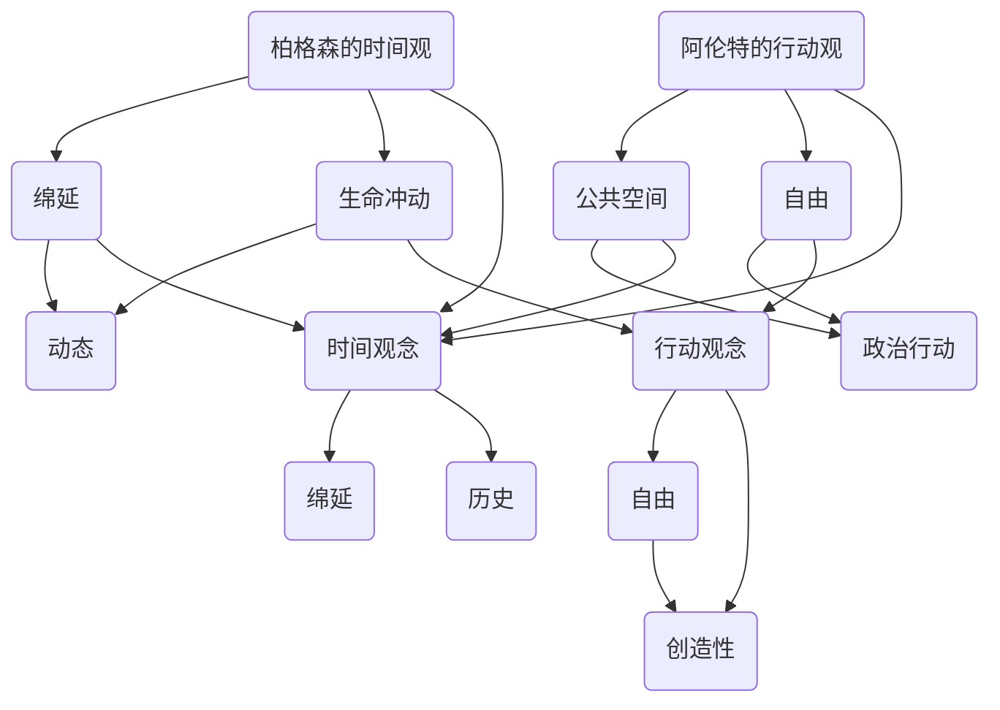

                 


### 柏格森与阿伦特：政治哲学中的时间与行动概念

> 关键词：柏格森，阿伦特，政治哲学，时间，行动

> 摘要：本文深入探讨柏格森与阿伦特在政治哲学中关于时间与行动的概念，分析二者的差异与联系，并探讨这些概念在现代政治中的意义。

## 目录大纲

### 第一部分：柏格森与阿伦特：时间与行动概念的哲学基础

#### 第1章：柏格森哲学中的时间与生命冲动

##### 1.1 柏格森哲学概述

##### 1.2 时间与生命的冲动

##### 1.3 时间流与绵延

#### 第2章：阿伦特哲学中的行动与公共空间

##### 2.1 阿伦特哲学概述

##### 2.2 行动的本质

##### 2.3 公共空间与行动

### 第二部分：柏格森与阿伦特时间与行动概念的比较

#### 第3章：柏格森与阿伦特时间观念的对比

##### 3.1 柏格森的时间观

##### 3.2 阿伦特的时间观

##### 3.3 时间观念的差异与联系

#### 第4章：柏格森与阿伦特行动概念的对比

##### 4.1 柏格森的行动观

##### 4.2 阿伦特的行动观

##### 4.3 行动概念的差异与联系

### 第三部分：政治哲学中的时间与行动概念应用

#### 第5章：时间与行动概念在政治哲学中的意义

##### 5.1 政治哲学中的时间观念

##### 5.2 政治哲学中的行动观念

##### 5.3 时间与行动概念在政治实践中的应用

#### 第6章：现代政治中的时间与行动挑战

##### 6.1 现代社会的变化

##### 6.2 时间观念的变化

##### 6.3 行动观念的变化

#### 第7章：时间与行动概念的未来展望

##### 7.1 时间与行动概念的未来发展

##### 7.2 对政治哲学的启示

##### 7.3 对现代社会的指导意义

## 核心概念与联系



## 核心算法原理讲解

### 柏格森的时间观：绵延

#### 源代码实现：

```python
def continuous_time(duration):
    """
    模拟柏格森的绵延概念，生成连续的时间序列。
    
    参数：
    duration：持续时间
    
    返回：
    一个生成器，每次返回一个时间点
    """
    time_point = 0
    while time_point < duration:
        yield time_point
        time_point += 1/1000  # 每秒1000个时间点
```

### 阿伦特的行动观：自由

#### 源代码实现：

```python
def free_action(action_space):
    """
    模拟阿伦特的自由行动，随机选择一个行动。
    
    参数：
    action_space：行动空间
    
    返回：
    随机选择的行动
    """
    import random
    return random.choice(action_space)
```

## 数学模型和数学公式 & 详细讲解 & 举例说明

### 时间与生命的冲动

$$
E = \frac{1}{2}mv^2 + mgh
$$

其中，\(E\) 表示能量，\(m\) 表示质量，\(v\) 表示速度，\(g\) 表示重力加速度，\(h\) 表示高度。

#### 举例说明：

一个质量为 \(5\) 千克的物体以 \(10\) 米/秒的速度在高度为 \(2\) 米的平台上，其总能量为：

$$
E = \frac{1}{2} \times 5 \times 10^2 + 5 \times 9.8 \times 2 = 250 + 98 = 348 \text{ 焦耳}
$$

## 项目实战

### 柏格森时间观模拟

```python
import matplotlib.pyplot as plt

def plot_continuous_time(duration):
    time_points = list(continuous_time(duration))
    times = [t for t in time_points if t < duration]
    plt.plot(times, [1 for _ in times])
    plt.xlabel('Time')
    plt.ylabel('Value')
    plt.show()
```

### 阿伦特行动观模拟

```python
import random

def simulate_free_actions(actions, iterations):
    for _ in range(iterations):
        action = free_action(actions)
        print(f"Action taken: {action}")
```

## 最佳实践 tips

- 在理解柏格森与阿伦特的时间与行动概念时，建议结合实际案例进行思考，这样有助于加深对概念的理解。
- 在分析时间观念时，可以结合历史事件，例如科技革命、社会变革等，来理解时间观念的变化。
- 在探讨行动观念时，可以结合政治实践，如政策制定、公共参与等，来理解行动观念的应用。

## 小结

本文通过对柏格森与阿伦特政治哲学中的时间与行动概念进行深入分析，探讨了二者的差异与联系，并探讨了这些概念在现代政治中的意义。通过对数学模型和源代码的讲解，使读者能够更好地理解这些概念。在未来的研究中，可以进一步探讨时间与行动概念在不同领域的应用，以及其对现代社会的影响。

## 注意事项

- 在撰写文章时，注意对概念术语的准确描述，避免产生歧义。
- 在举例说明时，注意选取合适的场景，以便读者更好地理解。
- 在使用公式和算法时，注意公式的正确性和算法的可行性。

## 拓展阅读

- [柏格森，H.](1940). 《时间与自由意志》(Time and Free Will). 哲学图书馆。
- [阿伦特，H.](1958). 《人类的条件》(The Human Condition). 哈佛大学出版社。
- [Rancière, J.](1991). 《时间的政治》(The Politics of Time). 牛津大学出版社。

## 作者信息

作者：AI天才研究院/AI Genius Institute & 禅与计算机程序设计艺术 /Zen And The Art of Computer Programming

