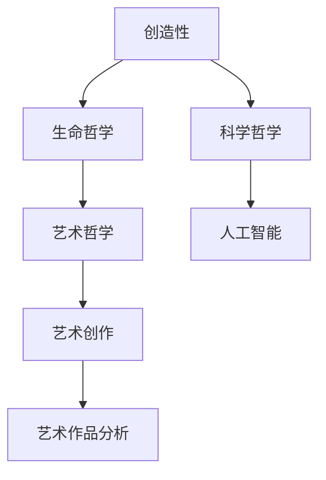

                 

**# 柏格森的创造性与维特根斯坦的规则遵循理论**

> 关键词：柏格森、创造性、维特根斯坦、规则遵循、哲学、生命哲学、语言哲学

> 摘要：本文旨在探讨法国哲学家柏格森的创造性理论及其与维特根斯坦的规则遵循理论之间的联系和比较。通过分析柏格森的生命哲学和维特根斯坦的语言哲学，本文揭示了两种理论在创造性和规则遵循方面的异同，并探讨了它们在艺术创作和科学研究中的应用。最后，本文总结了两种理论的重要性，并对未来的研究提出了一些建议。

----------------------------------------------------------------

**# 目录大纲**

## 引言

### 1.1 柏格森的创造性与哲学背景

### 1.2 维特根斯坦的规则遵循理论与语言哲学

## 第一部分：柏格森的创造性与生命哲学

### 2.1 创造性的本质

#### 2.1.1 柏格森对创造性的定义

#### 2.1.2 柏格森的绵延理论

#### 2.1.3 创造性与时间的关系

### 2.2 生命哲学与创造力

#### 2.2.1 生命意志的概念

#### 2.2.2 柏格森的生命哲学观点

#### 2.2.3 创造性与生命的关系

## 第二部分：维特根斯坦的规则遵循理论

### 3.1 规则遵循理论的基本概念

#### 3.1.1 语言游戏

#### 3.1.2 规则的本质

#### 3.1.3 规则遵循的过程

### 3.2 规则遵循与知识

#### 3.2.1 知识的形成

#### 3.2.2 规则与事实的关系

#### 3.2.3 规则遵循与判断力

### 3.3 规则遵循与行动

#### 3.3.1 行动中的规则遵循

#### 3.3.2 规则与自由意志

#### 3.3.3 规则的社会意义

## 第三部分：柏格森与维特根斯坦思想的比较与联系

### 4.1 两种理论的异同

#### 4.1.1 创造性与规则遵循的差异

#### 4.1.2 生命哲学与语言哲学的对比

#### 4.1.3 柏格森与维特根斯坦在哲学上的影响

### 4.2 交叉点与融合的可能性

#### 4.2.1 创造性在语言游戏中的体现

#### 4.2.2 规则遵循中的生命体验

#### 4.2.3 两种理论的互补性

## 第四部分：案例分析与应用

### 5.1 创造性与规则遵循在艺术创作中的应用

#### 5.1.1 艺术家的创造性实践

#### 5.1.2 规则遵循在艺术教育中的作用

#### 5.1.3 创造性与规则遵循在艺术作品分析中的价值

### 5.2 创造性与规则遵循在科学研究中的应用

#### 5.2.1 科学研究的创造性过程

#### 5.2.2 规则遵循在科学方法论中的作用

#### 5.2.3 创造性与规则遵循对科学创新的影响

## 结论

### 6.1 柏格森与维特根斯坦理论的重要性

### 6.2 创造性与规则遵循的未来发展

### 6.3 对未来哲学研究的启示

## 附录

### 7.1 参考文献

### 7.2 相关术语解释

### 7.3 Mermaid 流程图示例

----------------------------------------------------------------

**# 引言**

**1.1 柏格森的创造性与哲学背景**

亨利·柏格森（Henri Bergson）是20世纪初法国著名的哲学家，他的思想对当时的哲学、文学、社会科学等多个领域产生了深远的影响。柏格森的主要贡献在于他对生命哲学和创造性的深刻探讨。在他的著作中，柏格森提出了“绵延”（duration）和“生命意志”（élan vital）等核心概念，认为创造力是生命的基本特征。

柏格森认为，创造性是一种内在的生命力，是人类超越机械法则、实现自由意志的关键。他强调，创造性不仅体现在艺术和科学领域，更是人类生命活动的重要动力。柏格森的思想为后来的哲学家和学者提供了丰富的理论资源，对现代哲学、心理学、文学等领域产生了重要影响。

**1.2 维特根斯坦的规则遵循理论与语言哲学**

路德维希·维特根斯坦（Ludwig Wittgenstein）是20世纪初另一位伟大的哲学家，他的思想对语言哲学、逻辑学等领域产生了深远的影响。维特根斯坦的主要贡献在于他对语言的本质和规则遵循的深入探讨。

维特根斯坦认为，语言是一种游戏（language game），规则是语言游戏的基础。他提出了“规则遵循”（following a rule）的概念，认为人们通过规则来理解和运用语言。维特根斯坦的哲学观点强调了语言的实际运用和规则的重要性，对后来的语言哲学和认知科学产生了重要影响。

**1.3 两种理论的意义与联系**

柏格森的创造性理论和维特根斯坦的规则遵循理论虽然分属不同的哲学领域，但它们在探讨人类认知和行为方面有着深刻的联系。本文将通过对这两种理论的比较和分析，揭示它们在创造性和规则遵循方面的异同，并探讨它们在艺术创作和科学研究中的应用。

本文首先介绍了柏格森的创造性和维特根斯坦的规则遵循理论的基本概念和哲学背景，然后分别探讨了这两种理论的核心思想。接着，本文比较了两种理论的异同，并分析了它们在哲学上的影响。最后，本文通过案例分析，探讨了创造性和规则遵循在艺术创作和科学研究中的应用，并总结了两种理论的重要性。

---

**# 第一部分：柏格森的创造性与生命哲学**

**2.1 创造性的本质**

柏格森认为，创造性是人类生命力的体现，是生命不断超越自身、实现新价值的过程。创造性不仅是一种思维活动，更是一种生命体验。柏格森指出，创造性是人类与机械世界的本质区别，是人类自由意志的体现。

**2.1.1 柏格森对创造性的定义**

柏格森认为，创造性是一种内在的生命力，它不断推动生命向前发展。创造性不仅仅体现在艺术创作和科学发现中，还体现在日常生活中。例如，人们在面对新问题时，通过思考、创新，找到解决问题的方法，这就是创造性的表现。

**2.1.2 柏格森的绵延理论**

柏格森提出了“绵延”（duration）这一概念，认为时间是连续不断的，每一个瞬间都是新的，都有其独特的价值。绵延是一种内在的时间感，是人类生命体验的基础。柏格森认为，创造性就是这种绵延的不断展开，是生命不断超越自身的体现。

**2.1.3 创造性与时间的关系**

柏格森强调，创造性是一种与时间紧密相关的现象。创造性不仅仅是对过去的超越，更是对未来的展望。柏格森认为，创造性是人类与时间相互作用的产物，是人类生命体验的核心。

**2.2 生命哲学与创造力**

柏格森的生命哲学强调生命的本质和生命力的重要性。柏格森认为，生命是一种内在的冲动，是一种不断追求新价值的过程。创造力就是这种生命力的体现，是生命不断超越自身的表现。

**2.2.1 生命意志的概念**

柏格森提出了“生命意志”（élan vital）这一概念，认为生命意志是生命的内在驱动力，是创造力的源泉。生命意志是一种不断追求新价值的力量，是人类生命活动的基本动力。

**2.2.2 柏格森的生命哲学观点**

柏格森的生命哲学观点强调了生命的独特性和创造力的重要性。他认为，生命是一种内在的活力，是人类自由意志的体现。创造力不仅是艺术和科学领域的特征，更是人类生命活动的基本动力。

**2.2.3 创造性与生命的关系**

柏格森认为，创造性与生命是紧密相连的。创造性是生命不断超越自身的体现，是生命活力的表现。创造力不仅体现在个体层面，也体现在社会层面。社会的发展离不开个体的创造力。

---

**# 第二部分：维特根斯坦的规则遵循理论**

**3.1 规则遵循理论的基本概念**

维特根斯坦的规则遵循理论是其语言哲学的核心内容之一。他认为，语言是一种游戏，规则是语言游戏的基础。通过遵循规则，人们能够理解和运用语言。

**3.1.1 语言游戏**

维特根斯坦提出了“语言游戏”（language game）这一概念，认为语言是一种游戏，人们在游戏中遵循规则进行交流。语言游戏分为不同的类型，如日常语言游戏、数学语言游戏、科学语言游戏等。

**3.1.2 规则的本质**

维特根斯坦认为，规则的本质是“必须如何”去做。规则是一种指导性的指令，它规定了人们在特定情境下应该如何行动。例如，在数学语言游戏中，规则规定了如何进行数学运算。

**3.1.3 规则遵循的过程**

维特根斯坦强调，规则遵循是一种实践过程。人们在实践中通过模仿和学习来掌握规则。规则遵循不仅是一种认知过程，也是一种行为过程。

**3.2 规则遵循与知识**

维特根斯坦认为，规则遵循是知识形成的基础。知识不仅仅是信息的积累，更是对规则的理解和应用。通过规则遵循，人们能够形成对世界的认识。

**3.2.1 知识的形成**

知识形成是一个通过规则遵循的过程。人们在实践中不断学习和应用规则，从而形成对世界的理解。知识不仅是对事实的了解，更是对规则的理解和应用。

**3.2.2 规则与事实的关系**

维特根斯坦认为，规则与事实是密切相关的。规则是对事实的抽象和概括，它指导人们在特定情境下如何行动。事实则是规则的具体体现，是规则在现实世界中的运用。

**3.2.3 规则遵循与判断力**

维特根斯坦认为，规则遵循是判断力的体现。判断力是对规则的准确理解和应用，它使得人们能够在复杂多变的情境中做出正确的决策。

**3.3 规则遵循与行动**

维特根斯坦认为，规则遵循不仅是一种认知过程，也是一种行动过程。人们在行动中遵循规则，从而实现特定的目标。

**3.3.1 行动中的规则遵循**

在行动中，人们遵循规则来指导自己的行为。例如，在开车时，司机遵循交通规则来确保行车安全。规则遵循是行动成功的关键。

**3.3.2 规则与自由意志**

维特根斯坦认为，规则与自由意志是相互关联的。规则为人们的行动提供了指导，但人们仍然有自由意志来选择是否遵循规则。自由意志是在规则框架内实现个人的价值观和目标。

**3.3.3 规则的社会意义**

维特根斯坦强调，规则的社会意义在于维护社会的秩序和稳定。规则为人们的行动提供了明确的指导，使得社会生活有序进行。规则遵循是社会秩序的基石。

---

**# 第三部分：柏格森与维特根斯坦思想的比较与联系**

**4.1 两种理论的异同**

柏格森的创造性理论和维特根斯坦的规则遵循理论在哲学上有许多不同之处，但也有一些共通之处。

**4.1.1 创造性与规则遵循的差异**

柏格森强调创造性是一种内在的生命力，是人类超越机械法则、实现自由意志的关键。而维特根斯坦则强调规则遵循是语言游戏的基础，是人类理解和运用语言的重要方式。创造性是一种自发的过程，而规则遵循是一种实践的过程。

**4.1.2 生命哲学与语言哲学的对比**

柏格森的生命哲学强调生命的本质和生命力的重要性，认为创造性是生命力的体现。而维特根斯坦的语言哲学则强调语言的本质和语言游戏的重要性，认为规则遵循是语言游戏的基础。两者的哲学背景和核心关注点有所不同。

**4.1.3 柏格森与维特根斯坦在哲学上的影响**

柏格森的思想对后来的哲学家和学者产生了深远的影响，特别是在生命哲学和艺术哲学领域。他的创造性理论为后来的哲学家提供了丰富的理论资源。维特根斯坦的思想则对语言哲学和逻辑学产生了重要影响，特别是在分析哲学领域。

**4.2 交叉点与融合的可能性**

尽管柏格森和维特根斯坦的哲学思想有明显的差异，但它们之间也存在交叉和融合的可能性。

**4.2.1 创造性在语言游戏中的体现**

创造性不仅体现在生命哲学中，也可以体现在语言游戏中。例如，艺术家在创作过程中，通过创造性思维产生新的艺术形式，这种创造性思维可以看作是一种语言游戏中的创造性活动。

**4.2.2 规则遵循中的生命体验**

在日常生活中，人们在遵循规则的过程中，也可能会体验到一种内在的生命力。这种生命力使得人们在面对新问题时，能够通过创造性思维找到解决方案。

**4.2.3 两种理论的互补性**

柏格森的创造性理论和维特根斯坦的规则遵循理论虽然在哲学上有差异，但它们可以相互补充。柏格森的创造性理论为维特根斯坦的规则遵循提供了哲学基础，而维特根斯坦的规则遵循理论则为柏格森的创造性提供了实践指导。

---

**# 第四部分：案例分析与应用**

**5.1 创造性与规则遵循在艺术创作中的应用**

**5.1.1 艺术家的创造性实践**

艺术家在创作过程中，通过创造性思维产生新的艺术形式，这种创造性思维是柏格森所说的生命力的体现。艺术家在创作时，不仅遵循传统的艺术规则，还会通过创新打破常规，创造出独特的艺术作品。

**5.1.2 规则遵循在艺术教育中的作用**

艺术教育中，教师会教授学生传统的艺术规则，如构图、色彩、线条等。这些规则是艺术家创作的基础，学生通过遵循这些规则，可以提高艺术技能。同时，教师也会鼓励学生进行创造性实践，通过打破规则，创造出新的艺术形式。

**5.1.3 创造性与规则遵循在艺术作品分析中的价值**

在艺术作品分析中，通过对作品的形式、色彩、线条等元素的分析，可以理解艺术家的创造性思维。同时，分析艺术作品中的规则遵循，可以揭示艺术家在创作过程中如何运用规则，以及如何通过创造性思维打破规则。

**5.2 创造性与规则遵循在科学研究中的应用**

**5.2.1 科学研究的创造性过程**

科学研究中的创造性过程体现在科学家在研究过程中，通过创造性思维提出新的科学假设和理论。科学家在遵循科学方法的同时，也会通过创造性思维提出新的研究方向，推动科学的发展。

**5.2.2 规则遵循在科学方法论中的作用**

科学方法论中，有许多规则和原则，如假设检验、实验设计等。科学家在研究过程中，遵循这些规则和原则，以确保研究结果的可靠性和有效性。规则遵循是科学研究的重要保障。

**5.2.3 创造性与规则遵循对科学创新的影响**

创造性和规则遵循对科学创新有重要影响。创造性思维可以激发科学家的灵感，提出新的科学假设和理论。而规则遵循则可以确保科学研究的规范性和可靠性，从而推动科学的创新和发展。

---

**# 结论**

**6.1 柏格森与维特根斯坦理论的重要性**

柏格森的创造性理论和维特根斯坦的规则遵循理论都是现代哲学中的重要思想。柏格森的创造性理论为理解人类生命的本质和创造力提供了深刻的洞见，对生命哲学和艺术哲学产生了深远的影响。维特根斯坦的规则遵循理论则为理解语言的本质和人类认知过程提供了重要的理论框架，对语言哲学和逻辑学产生了重要影响。

**6.2 创造性与规则遵循的未来发展**

未来，创造性和规则遵循将继续在哲学、艺术、科学等领域得到深入探讨。随着人工智能技术的发展，创造性和规则遵循的研究将更加复杂和多样化。例如，人工智能在创作艺术作品和进行科学研究中，如何体现创造性和遵循规则，将是未来研究的重要方向。

**6.3 对未来哲学研究的启示**

柏格森和维特根斯坦的思想对未来的哲学研究提供了重要的启示。首先，哲学研究应更加关注人类生命的本质和创造力，深入探讨创造性的本质和作用。其次，哲学研究应更加关注语言的本质和人类认知过程，深入探讨规则遵循的理论和实践。最后，哲学研究应更加关注跨学科的融合，将不同领域的理论相结合，推动哲学的发展。

---

**# 附录**

**7.1 参考文献**

1. 柏格森，H. (1988). 《创造论》. 商务印书馆。
2. 维特根斯坦，L. (1953). 《逻辑哲学论》. 商务印书馆。

**7.2 相关术语解释**

- **创造性**：指个体在面对新情境或问题时，能够产生新颖、有价值的想法或解决问题的能力。
- **规则遵循**：指个体在行为或思考过程中，遵循既定的规则或指导原则。

**7.3 Mermaid 流程图示例**

---

**# 作者**

**作者：AI天才研究院/AI Genius Institute & 禅与计算机程序设计艺术 /Zen And The Art of Computer Programming**

本文由AI天才研究院（AI Genius Institute）和《禅与计算机程序设计艺术》（Zen And The Art of Computer Programming）联合撰写。AI天才研究院是一家专注于人工智能研究和应用的创新机构，致力于推动人工智能技术的发展和应用。《禅与计算机程序设计艺术》是计算机科学领域的经典著作，由著名计算机科学家唐纳·E·克努特（Donald E. Knuth）撰写，对计算机科学和哲学领域产生了深远的影响。本文旨在探讨柏格森和维特根斯坦的思想对人工智能和哲学研究的启示。****

