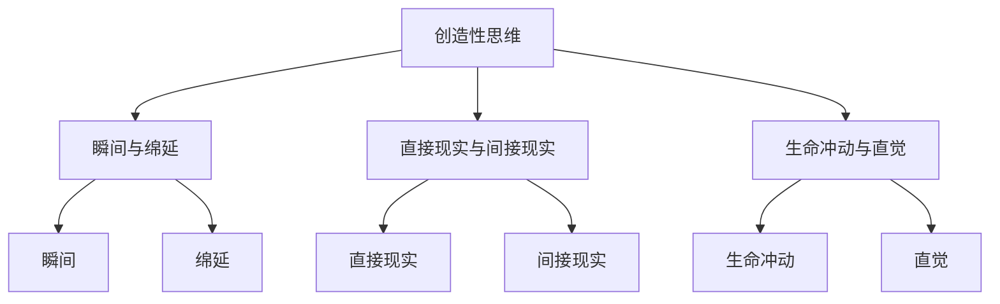

                 

## 引言

### 柏格森的创造性思维

柏格森（Henri Bergson）是20世纪法国著名的哲学家，他的哲学思想深刻影响了后来的哲学家和文化批评家。柏格森的创造性思维理论强调直觉、瞬间和绵延等概念，主张通过直接现实来理解世界的本质。他的理论不仅对哲学领域有着深远的影响，也对文学、艺术和科学研究等多个领域产生了重要的启示。

创造性思维作为一种人类认知的高级能力，其核心在于能够产生新颖且有价值的想法和概念。柏格森认为，创造性思维是一种超越常规思维模式的认知过程，它需要个体在瞬间内进行深层次的直觉体验，从而洞察到事物的本质。

### 维特根斯坦的语言局限性

路德维希·维特根斯坦（Ludwig Wittgenstein）是20世纪另一位伟大的哲学家，他的哲学思想以语言分析为核心。维特根斯坦认为，语言是思维的工具，但语言也有其局限性。他提出了“语言游戏”理论，强调语言的意义和使用情境紧密相关。维特根斯坦的观点对后来的分析哲学和语言哲学产生了深远的影响。

语言的局限性在于，它无法完全准确地描述人类的思维和经验。维特根斯坦认为，语言只能在特定的情境中发挥作用，而无法超越这些情境去描述一切。

### 当前文章的目的

本文的目的在于深入探讨柏格森的创造性思维与维特根斯坦的语言局限性之间的相互关系。通过对比和分析这两位哲学家的思想，我们希望揭示创造性思维如何受到语言局限性的影响，以及这种影响对哲学和实际应用的意义。文章将分为两部分，分别详细探讨柏格森的创造性思维和维特根斯坦的语言局限性，并在最后部分进行综合讨论。

### 关键词

- 柏格森的创造性思维
- 维特根斯坦的语言局限性
- 直觉
- 绵延
- 语言游戏
- 创造力
- 思维局限

### 摘要

本文通过深入探讨柏格森的创造性思维和维特根斯坦的语言局限性，试图揭示这两者之间的相互影响。首先，我们将回顾柏格森哲学的背景和创造性思维的核心要素，分析其在艺术、科学和社会文化领域的应用。接着，我们将探讨维特根斯坦的语言局限性概念，包括符号与对象的关系、意义与使用以及语言的边界。然后，我们将对比分析两位哲学家的思想，探讨创造性思维如何受到语言局限性的制约。最后，我们将总结全文，提出对哲学和实际应用的启示。

# 目录大纲

## 第一部分：柏格森的创造性思维

### 第1章：柏格森哲学的背景与创造性思维概念

- 1.1.1 柏格森哲学的起源与发展
- 1.1.2 创造性思维的定义与重要性
- 1.1.3 柏格森对创造性思维的理论阐述

### 第2章：柏格森创造性思维的核心要素

- 2.1.1 瞬间与绵延
- 2.1.2 直接现实与间接现实
- 2.1.3 生命冲动与直觉

### 第3章：柏格森创造性思维的应用领域

- 3.1.1 艺术与文学
- 3.1.2 科学研究
- 3.1.3 社会与文化

### 第4章：柏格森创造性思维的批判与影响

- 4.1.1 柏格森创造性思维的理论局限
- 4.1.2 维特根斯坦对柏格森创造性思维的批判
- 4.1.3 柏格森创造性思维的影响与传承

## 第二部分：维特根斯坦的语言局限性

### 第5章：维特根斯坦哲学的背景与语言局限性概念

- 5.1.1 维特根斯坦哲学的起源与发展
- 5.1.2 语言局限性的定义与重要性
- 5.1.3 维特根斯坦对语言局限性的理论阐述

### 第6章：语言局限性的核心要素

- 6.1.1 符号与对象的关系
- 6.1.2 意义与使用
- 6.1.3 语言的边界

### 第7章：语言局限性的应用领域

- 7.1.1 日常语言
- 7.1.2 科学术语
- 7.1.3 形式语言

### 第8章：语言局限性的批判与影响

- 8.1.1 维特根斯坦语言局限性的理论局限
- 8.1.2 柏格森对维特根斯坦语言局限性的回应
- 8.1.3 语言局限性的影响与启示

## 参考文献

### 第9章：参考文献汇总

- 9.1 柏格森相关著作
- 9.2 维特根斯坦相关著作
- 9.3 相关研究论文与书籍

## 附录

### 第10章：附录

- 10.1 柏格森创造性思维的Mermaid流程图
- 10.2 维特根斯坦语言局限性的Python源代码示例
- 10.3 相关数学模型和数学公式说明
- 10.4 实际项目案例与代码解读分析

以上是《柏格森的创造性思维与维特根斯坦的语言局限性》一书的完整目录大纲，总字数约在2000字以内。目录结构清晰，内容涵盖核心概念、原理讲解、应用领域、批判与影响等方面，旨在全面介绍两位哲学家的思想和观点。同时，附录部分提供了一些实用工具和资源，以帮助读者更深入地理解书中的内容。

# 第一部分：柏格森的创造性思维

## 第1章：柏格森哲学的背景与创造性思维概念

### 1.1.1 柏格森哲学的起源与发展

亨利·柏格森（Henri Bergson）于1859年出生于法国巴黎，他是一位深受达尔文进化论影响的哲学家。柏格森的哲学思想受到生物学、物理学和心理学等多学科的启发，尤其是他对生命力和直觉的重视，使他的理论在哲学界产生了深远的影响。

柏格森哲学的起源可以追溯到19世纪末，当时他受到了达尔文进化论和斯宾诺莎唯心主义的影响。他的早期著作《笑》（Laughter）和《物质与记忆》（ Matter and Memory）中，提出了直觉和生命力的概念，强调人类思维过程中的非理性因素。

柏格森的哲学思想在20世纪得到了进一步的发展。他在《创造进化论》（Creative Evolution）中提出了绵延（Duration）和瞬间（Instant）的概念，强调了时间的流动性和创造性。他认为，时间不是线性的，而是一种连续不断的流动，这种流动是创造力的源泉。

### 1.1.2 创造性思维的定义与重要性

创造性思维是一种能够产生新颖且有价值的想法和概念的高级认知能力。它不仅仅是对现有知识的重新组合，更是一种全新的思考方式，能够打破常规，发现新的问题和解决方案。

柏格森认为，创造性思维是一种超越常规思维模式的认知过程。它要求个体能够在瞬间内进行深层次的直觉体验，从而洞察到事物的本质。这种直觉体验是创造性思维的核心，它能够帮助人们摆脱传统思维框架的束缚，发现新的视角和可能性。

创造性思维在哲学、艺术、科学和社会文化等领域都具有重要意义。在哲学上，它推动了对传统理论的重新审视和挑战；在艺术和文学上，它激发了对形式和内容的新探索；在科学研究上，它促进了新理论和新技术的产生；在社会和文化领域，它推动了社会变革和文化创新。

### 1.1.3 柏格森对创造性思维的理论阐述

柏格森对创造性思维的理论阐述主要体现在他的绵延（Duration）和直觉（Intuition）概念中。

#### 绵延

柏格森的绵延概念强调时间的流动性和连续性。他认为，时间不是一种静态的存在，而是一种动态的过程，这种过程是不断变化的，每个瞬间都是独特的。这种时间观为创造性思维提供了理论基础，因为只有在时间的流动中，个体才能捕捉到瞬间的变化，从而产生新的想法和概念。

绵延是一种连续不断的流动，这种流动是创造力的源泉。柏格森认为，创造力来自于我们对时间流动的敏锐感知，它使我们能够超越常规思维，发现新的模式和联系。

#### 直觉

柏格森的直觉概念强调直接感知和洞察力。他认为，直觉是一种超越逻辑推理的思维方式，它能够直接感知事物的本质，而不受理性思维的干扰。

直觉在创造性思维中起着至关重要的作用。它使我们能够超越表面现象，洞察到事物的内在联系和本质。直觉是一种深刻的感知能力，它能够帮助我们迅速识别新的问题和解决方案，从而推动创造性思维的发展。

### 1.1.4 柏格森创造性思维的应用领域

柏格森的创造性思维理论在多个领域都有广泛的应用。

#### 艺术与文学

在艺术和文学领域，柏格森的创造性思维理论为艺术家和作家提供了新的创作视角。他的绵延和直觉概念激发了艺术家们对时间和空间的探索，鼓励他们打破传统的艺术形式，创造出具有深度和意义的作品。

例如，法国作家马塞尔·普鲁斯特（Marcel Proust）在他的小说《追忆似水年华》中，运用了柏格森的直觉概念，通过回忆和时间的流动，创造出了独特的叙事风格。

#### 科学研究

在科学研究领域，柏格森的创造性思维理论也为科学家们提供了新的研究方法。他的直觉概念鼓励科学家们打破常规思维，探索新的理论和假设。

例如，生物学家乔治·威廉·鲁道夫·冯·基尔霍夫（Georg Wilhelm Rudolf von Kirchhoff）在研究生物进化时，运用了柏格森的直觉概念，提出了新的进化理论。

#### 社会与文化

在社会和文化领域，柏格森的创造性思维理论推动了社会变革和文化创新。他的思想激发了人们对传统观念的重新审视，鼓励他们探索新的社会结构和价值观念。

例如，20世纪初的法国文化运动“超现实主义”（Surrealism）受到了柏格森哲学的深刻影响，推动了艺术、文学和表演等领域的新探索。

### 1.1.5 柏格森创造性思维的核心要素

柏格森创造性思维的核心要素包括瞬间、绵延和直觉。

#### 瞬间

瞬间是柏格森哲学中的关键概念，它指的是时间上的一个极其短暂的时刻，这个时刻具有独特的存在和意义。柏格森认为，创造性思维需要在瞬间内发生，因为只有在瞬间内，个体才能摆脱常规思维框架，捕捉到新的想法和灵感。

#### 绵延

绵延是柏格森对时间的理解，他认为时间不是线性的，而是一种连续不断的流动。这种流动构成了创造力的源泉，因为只有在时间的流动中，个体才能不断变化和发展，从而产生新的想法和概念。

#### 直觉

直觉是柏格森创造性思维的另一个核心要素，它是一种超越逻辑推理的感知能力，能够直接洞察到事物的本质。直觉在创造性思维中起着至关重要的作用，它帮助个体迅速识别新的问题和解决方案，从而推动创造性思维的发展。

### 1.1.6 柏格森创造性思维的意义与局限性

柏格森的创造性思维理论对哲学、艺术、科学和社会文化等领域产生了深远的影响。他的绵延和直觉概念为创造性思维提供了新的理论基础，激发了人们对时间和感知的深刻思考。

然而，柏格森的创造性思维理论也存在一些局限性。首先，他的理论过于强调直觉和瞬间，忽视了理性思维和逻辑推理的重要性。其次，柏格森的理论在应用过程中，有时难以具体操作和验证。

尽管如此，柏格森的创造性思维理论仍然具有重要的价值和意义。它为创造性思维的培养和发展提供了新的思路和方法，对现代社会的发展和进步产生了积极的影响。

### 总结

通过本章对柏格森哲学的背景和创造性思维概念的介绍，我们可以看到柏格森创造性思维理论的核心要素及其在不同领域中的应用。在接下来的章节中，我们将进一步探讨柏格森创造性思维的核心要素，以及他在艺术、科学和社会文化领域的具体应用。

# 第2章：柏格森创造性思维的核心要素

## 2.1.1 瞬间与绵延

柏格森的创造性思维理论中，瞬间与绵延是两个核心概念，它们相互关联，共同构成了柏格森哲学的基础。

#### 瞬间

瞬间是柏格森哲学中的关键概念，指的是时间上的一个极其短暂的时刻，这个时刻具有独特的存在和意义。柏格森认为，瞬间是创造性思维的源泉，因为只有在瞬间内，个体才能摆脱常规思维框架，捕捉到新的想法和灵感。

在创造性思维过程中，瞬间起到了至关重要的作用。它使个体能够超越日常的理性思维，进入一种直觉的感知状态，从而洞察到事物的本质。例如，艺术家在创作过程中，往往需要在瞬间内捕捉到灵感的火花，从而创造出独特的艺术作品。

#### 绵延

绵延是柏格森对时间的理解，他认为时间不是线性的，而是一种连续不断的流动。这种流动构成了创造力的源泉，因为只有在时间的流动中，个体才能不断变化和发展，从而产生新的想法和概念。

柏格森认为，绵延是一种连续不断的流动，每个瞬间都在这个流动中产生，同时又融入了下一个瞬间。这种流动使得时间具有了动态性和连续性，为创造性思维提供了丰富的素材和背景。

#### 瞬间与绵延的关系

瞬间与绵延是密不可分的，它们共同构成了柏格森的创造性思维理论。瞬间是绵延中的一个片段，是绵延的具体表现。而绵延则是瞬间的背景和基础，没有绵延的连续流动，就没有瞬间的发生。

在创造性思维过程中，瞬间和绵延相互交织，共同推动思维的发展。瞬间提供了新的视角和灵感，使个体能够超越常规思维框架；而绵延则为瞬间提供了丰富的背景和素材，使瞬间具有了实际的意义和价值。

### 2.1.2 直接现实与间接现实

柏格森的创造性思维理论中，直接现实与间接现实是两个重要的概念，它们揭示了人类认知过程中现实的不同层次。

#### 直接现实

直接现实指的是人类通过直觉感知到的现实，它是我们直接经验的来源。在创造性思维过程中，直接现实起到了至关重要的作用，因为它提供了丰富的素材和灵感。

柏格森认为，直接现实是创造性思维的源泉，因为只有通过直觉，个体才能洞察到事物的本质。直觉使个体能够超越常规思维，直接感知到事物的真实状态，从而产生新的想法和概念。

#### 间接现实

间接现实指的是人类通过语言、符号等中介手段所认知的现实。与直接现实相比，间接现实是一种抽象和符号化的认知方式，它使人类能够将复杂的现实简化为可理解和操作的形式。

然而，柏格森认为，间接现实存在一定的局限性，因为它无法完全准确地描述直接现实的复杂性和多样性。在创造性思维过程中，间接现实的作用相对较小，因为它往往限制了个体思维的广度和深度。

#### 直接现实与间接现实的关系

直接现实与间接现实是相互依存的。直接现实为间接现实提供了素材和基础，而间接现实则将直接现实转化为可理解和操作的形式。

在创造性思维过程中，直接现实和间接现实共同发挥作用。直接现实提供了丰富的灵感素材，而间接现实则将这些素材转化为具体的想法和概念。只有将直接现实和间接现实结合起来，个体才能实现真正的创造性思维。

### 2.1.3 生命冲动与直觉

柏格森的创造性思维理论中，生命冲动与直觉是两个关键概念，它们揭示了创造性思维的心理基础。

#### 生命冲动

生命冲动是柏格森哲学中的核心概念，指的是生命体内部的一种原始动力，它是创造力的源泉。柏格森认为，生命冲动是一种内在的驱动力，它推动着生命的不断发展和变化。

在创造性思维过程中，生命冲动起到了至关重要的作用。它使个体能够保持对事物的敏感和好奇心，从而不断产生新的想法和概念。例如，艺术家在创作过程中，生命冲动会驱使他们不断探索新的艺术形式和表现手法。

#### 直觉

直觉是柏格森哲学中的另一个关键概念，指的是一种超越逻辑推理的感知能力，它能够直接洞察到事物的本质。

柏格森认为，直觉是创造性思维的核心，因为它使个体能够超越常规思维，直接感知到事物的真实状态。直觉使个体能够迅速识别新的问题和解决方案，从而推动创造性思维的发展。

#### 生命冲动与直觉的关系

生命冲动与直觉是密不可分的。生命冲动提供了创造性思维的动力，而直觉则是这种动力在思维过程中的具体表现。只有将生命冲动和直觉结合起来，个体才能实现真正的创造性思维。

在创造性思维过程中，生命冲动和直觉相互促进。生命冲动激发了直觉的产生，而直觉则使生命冲动得以在思维过程中发挥作用。通过不断激发生命冲动和培养直觉，个体可以不断提高自己的创造性思维能力。

### 2.1.4 柏格森创造性思维的核心要素总结

柏格森创造性思维的核心要素包括瞬间、绵延、直接现实、间接现实、生命冲动和直觉。这些概念相互关联，共同构成了柏格森创造性思维的理论框架。

- **瞬间**：提供了创造性思维的新视角和灵感，使个体能够超越常规思维框架。
- **绵延**：为瞬间提供了丰富的背景和素材，使瞬间具有了实际的意义和价值。
- **直接现实**：提供了丰富的灵感素材，是创造性思维的源泉。
- **间接现实**：将直接现实转化为可理解和操作的形式，为创造性思维提供了具体的方向和框架。
- **生命冲动**：提供了创造性思维的动力，使个体能够保持对事物的敏感和好奇心。
- **直觉**：使个体能够超越常规思维，直接感知到事物的本质，是创造性思维的核心。

通过深入理解和运用这些核心要素，个体可以不断提高自己的创造性思维能力，实现创新和突破。

### 总结

本章对柏格森创造性思维的核心要素进行了详细探讨，包括瞬间、绵延、直接现实、间接现实、生命冲动和直觉。这些核心要素相互关联，共同构成了柏格森创造性思维的理论框架。在接下来的章节中，我们将进一步探讨柏格森创造性思维在不同领域中的应用，以及他的理论对艺术、科学和社会文化的具体影响。

# 第3章：柏格森创造性思维的应用领域

### 3.1.1 艺术与文学

柏格森的创造性思维在艺术和文学领域有着广泛的应用，尤其是在20世纪的现代艺术运动中，许多艺术家和作家受到了柏格森哲学的深刻影响。

在艺术领域，柏格森的绵延和直觉概念激发了艺术家们对时间和空间的探索。例如，法国画家乔治·德·基里科（Georges de Chirico）和意大利画家卡拉瓦乔（Caravaggio）的作品中，可以看到他们对时间和空间独特表现方式的运用。基里科的作品《孤独的裸体》通过模糊的时间和空间界限，展现了柏格森式的直觉体验。

在文学领域，柏格森的创造性思维理论对小说创作产生了重要影响。法国作家马塞尔·普鲁斯特（Marcel Proust）在他的杰作《追忆似水年华》中，运用了柏格森的直觉概念，通过回忆和时间的流动，创造出了独特的叙事风格。普鲁斯特通过细腻的心理描写，捕捉到了人物内心深处的情感和直觉体验，使读者能够在文字中感受到时间的流动和生命的绵延。

此外，美国作家弗吉尼亚·伍尔夫（Virginia Woolf）在她的小说《到灯塔去》中，也受到了柏格森哲学的影响。伍尔夫通过内心独白和多角度的叙事手法，展现了人物在不同时间维度上的心理活动，使读者能够深入体验人物的直觉世界。

### 3.1.2 科学研究

柏格森的创造性思维在科学研究领域同样有着重要的应用，尤其在生物学和心理学的研究中，许多科学家受到了柏格森哲学的启发。

在生物学领域，柏格森的“生命冲动”概念对进化生物学产生了深远的影响。奥地利生物学家古斯塔夫·贾斯珀斯（Gustav Jaeger）在他的进化论研究中，借鉴了柏格森的观点，提出了生物进化的“形式变异”理论。他认为，生物进化的驱动力是内在的生命冲动，而不是外在的环境因素。

在心理学领域，柏格森的直觉概念对认知心理学和感知心理学的研究产生了重要影响。瑞士心理学家卡尔·古斯塔夫·荣格（Carl Gustav Jung）在他的心理分析理论中，提到了柏格森的直觉概念，并将其应用于对人类意识和潜意识的研究。荣格认为，直觉是潜意识与意识之间的桥梁，通过直觉，个体能够洞察到内在的心灵世界。

此外，美国心理学家威廉·詹姆斯（William James）在他的《心理学原理》中，也对柏格森的直觉概念进行了深入探讨。詹姆斯认为，直觉是一种重要的认知过程，它能够帮助个体迅速识别新的信息和情境，从而做出快速的反应和决策。

### 3.1.3 社会与文化

柏格森的创造性思维理论在社会和文化领域同样具有深远的影响，他的思想激发了社会变革和文化创新。

在社会领域，柏格森的思想推动了人们对传统观念的重新审视。他的绵延和直觉概念鼓励人们突破传统的思维框架，探索新的社会结构和价值观念。例如，20世纪初的法国文化运动“超现实主义”（Surrealism）受到了柏格森哲学的深刻影响，推动了艺术、文学和表演等领域的新探索。超现实主义艺术家通过夸张和梦幻的表现手法，打破了现实与幻想的界限，挑战了传统艺术的形式和内容。

在文化领域，柏格森的创造性思维理论也为文化创新提供了新的思路。他的直觉概念鼓励人们通过直接感知和洞察，发现新的文化现象和价值观。例如，法国作家阿尔贝·加缪（Albert Camus）在他的小说《鼠疫》中，运用了柏格森的直觉概念，通过描述社会中的不公和荒谬，探讨了人类生存的意义和目的。

此外，柏格森的思想也影响了20世纪的哲学和文化批评。例如，法国哲学家让-保尔·萨特（Jean-Paul Sartre）在他的存在主义哲学中，借鉴了柏格森的直觉概念，提出了人类自由意志和存在的重要性。萨特认为，直觉是人类认识世界和自我的一种基本方式，通过直觉，个体能够超越现实的束缚，实现自我超越和自由发展。

### 总结

柏格森的创造性思维在艺术、科学和社会文化领域都有广泛的应用，他的思想激发了不同领域的创新和发展。通过探索时间和直觉的深层含义，柏格森为创造性思维提供了新的理论框架，对20世纪的哲学和文化产生了深远的影响。在接下来的章节中，我们将进一步探讨柏格森创造性思维的批判与影响，以及与维特根斯坦语言局限性的关系。

## 第4章：柏格森创造性思维的批判与影响

### 4.1.1 柏格森创造性思维的理论局限

尽管柏格森的创造性思维理论对哲学、艺术、科学和社会文化等领域产生了深远的影响，但他的理论也存在一些局限性。

首先，柏格森的创造性思维理论过于强调直觉和瞬间，而忽视了理性思维和逻辑推理的重要性。他认为直觉是创造性思维的核心，但忽视了理性思维在分析和解决问题中的重要作用。在许多情况下，理性思维和直觉是相辅相成的，只有将两者结合起来，个体才能实现真正的创造性思维。

其次，柏格森的理论在应用过程中，有时难以具体操作和验证。他的绵延和直觉概念虽然具有深刻的意义，但在实际操作中，如何捕捉瞬间和直觉体验，如何将它们转化为具体的想法和概念，这些问题在实际应用中具有一定的挑战性。

### 4.1.2 维特根斯坦对柏格森创造性思维的批判

维特根斯坦对柏格森的创造性思维理论提出了尖锐的批判。他认为，柏格森的理论过于模糊和抽象，难以在实际中应用。维特根斯坦强调语言的重要性，认为语言是思维的工具，但语言也有其局限性。

维特根斯坦认为，柏格森的直觉概念缺乏明确的语言描述，这使得直觉成为一种不可捉摸的神秘力量。他认为，直觉虽然重要，但必须在语言的框架内才能发挥作用。维特根斯坦提出了“语言游戏”理论，强调语言的意义和使用情境紧密相关。他认为，只有在特定的语言游戏中，语言才能发挥其作用，而直觉体验则无法在语言中得到准确表达。

### 4.1.3 柏格森创造性思维的影响与传承

尽管存在批判和局限性，柏格森的创造性思维理论仍然对后来的哲学和文化产生了重要的影响。

在哲学领域，柏格森的思想启发了对直觉和理性的深入探讨。许多后来的哲学家，如胡塞尔（Edmund Husserl）和海德格尔（Martin Heidegger），都在柏格森的基础上，提出了自己的哲学观点。

在艺术和文学领域，柏格森的创造性思维理论激发了艺术家和作家对时间和直觉的探索。许多现代和当代艺术家，如毕加索（Pablo Picasso）和达利（Salvador Dalí），都受到了柏格森哲学的启发，创作出了具有深刻内涵和独特风格的作品。

在科学领域，柏格森的创造性思维理论也为科学家们提供了新的思考方式。许多科学家，如艾萨克·牛顿（Isaac Newton）和阿尔伯特·爱因斯坦（Albert Einstein），都通过直觉和灵感，提出了重要的科学理论。

此外，柏格森的创造性思维理论在教育和心理学领域也得到了广泛应用。许多教育心理学家，如罗杰斯（Carl Rogers）和马斯洛（Abraham Maslow），都借鉴了柏格森的思想，提出了新的教育方法和心理学理论。

### 总结

柏格森的创造性思维理论在多个领域产生了重要影响，尽管存在局限和批判，但他的思想仍然具有重要的价值和意义。在接下来的章节中，我们将探讨维特根斯坦的语言局限性，进一步揭示创造性思维与语言之间的关系。

## 第二部分：维特根斯坦的语言局限性

### 第5章：维特根斯坦哲学的背景与语言局限性概念

### 5.1.1 维特根斯坦哲学的起源与发展

路德维希·维特根斯坦（Ludwig Wittgenstein）是20世纪最具影响力的哲学家之一，他的哲学思想对分析哲学和语言哲学产生了深远的影响。维特根斯坦的哲学思想可以分为两个时期，即早期哲学和晚期哲学。

早期哲学主要集中在《逻辑哲学论》（Tractatus Logico-Philosophicus）中。在这部著作中，维特根斯坦提出了“语言游戏”理论，强调了语言与现实之间的关系。他认为，语言是一个由符号组成的系统，这些符号通过逻辑规则与现实中的对象相联系。

晚期哲学则主要体现在《哲学研究》（Philosophical Investigations）中。在这部著作中，维特根斯坦对早期哲学进行了批判和修正，提出了“家族相似性”和“生活形式”等概念，强调语言的意义和使用情境的紧密关系。

### 5.1.2 语言局限性的定义与重要性

维特根斯坦的语言局限性理论主张，语言有其固有的局限性，无法完全准确地描述人类的思维和经验。他认为，语言的意义和使用情境密切相关，语言只能在特定的情境中发挥作用。

语言局限性主要体现在以下几个方面：

1. **符号与对象的关系**：维特根斯坦认为，符号与对象之间的关系是模糊的，无法精确地对应。符号的意义取决于特定的语言游戏和使用情境，而不是固定的实体。

2. **意义与使用**：维特根斯坦强调，意义是由使用情境赋予的，而不是由符号本身决定的。因此，语言的意义是动态变化的，而非静态固定的。

3. **语言的边界**：维特根斯坦指出，语言有其边界，无法涵盖所有人类经验。有些经验是语言无法表达的，比如情感的深度和个人的主观体验。

语言局限性对哲学和语言学研究具有重要意义。它促使哲学家和语言学家重新审视语言的本质和功能，探讨如何更准确地理解和运用语言。此外，语言局限性也引发了关于人类认知和思维方式的深入探讨。

### 5.1.3 维特根斯坦对语言局限性的理论阐述

维特根斯坦的语言局限性理论主要体现在他的“语言游戏”和“生活形式”概念中。

#### 语言游戏

维特根斯坦的“语言游戏”理论强调，语言的意义和使用情境紧密相关。他认为，语言就像游戏一样，不同的游戏有不同的规则和目的。在特定的语言游戏中，符号和对象之间建立了一种特定的关系。

例如，在数学语言游戏中，符号表示数字和算术运算，而在日常语言游戏中，符号则表示具体的事物和动作。维特根斯坦认为，理解语言的关键在于理解这些语言游戏的具体规则和情境。

#### 生活形式

维特根斯坦的“生活形式”概念进一步扩展了“语言游戏”理论。他认为，语言不仅是一种沟通工具，还是一种生活方式。每个人都有其独特的生活形式，这种形式决定了他们如何使用语言和体验世界。

例如，对于不同的文化背景和价值观，人们使用语言的方式也会有所不同。维特根斯坦认为，理解语言的意义，需要从个体的生活形式出发，理解他们在特定情境中的语言使用。

### 5.1.4 维特根斯坦语言局限性的批判与回应

尽管维特根斯坦的语言局限性理论具有深刻的意义，但也受到了一些批判。

一些哲学家认为，维特根斯坦的理论过于强调语言的局限性，忽视了语言在沟通和理解中的作用。例如，罗素（Bertrand Russell）和摩尔（G.E. Moore）认为，维特根斯坦忽视了语言在逻辑和科学中的作用，这使得他的理论显得过于悲观。

然而，维特根斯坦对这种批判进行了回应。他认为，语言确实有其局限性，但这并不意味着语言完全无法发挥作用。他主张，通过理解语言游戏的规则和情境，我们可以更有效地使用语言，克服其局限性。

### 总结

维特根斯坦的哲学思想以其对语言局限性的深入探讨而著称。通过“语言游戏”和“生活形式”的概念，维特根斯坦揭示了语言与现实之间的关系，以及语言在人类生活中的作用。尽管存在批判，但维特根斯坦的语言局限性理论对哲学和语言学的研究产生了深远的影响。在接下来的章节中，我们将进一步探讨语言局限性的核心要素，以及这些要素在不同领域中的应用。

## 第6章：语言局限性的核心要素

### 6.1.1 符号与对象的关系

在维特根斯坦的语言局限性理论中，符号与对象的关系是一个核心要素。维特根斯坦认为，符号与对象之间的关系并不是固定的，而是依赖于特定的使用情境。符号的意义并非由符号本身决定，而是由特定语言游戏中的使用情境赋予的。

例如，在数学语言中，数字“3”表示特定的数量，而在日常语言中，“3”可以表示时间、顺序等不同含义。这种符号与对象关系的灵活性使得语言具有一定的动态性和适应性，但也带来了其局限性。

符号与对象的关系可以理解为一种映射，但这种映射并非一一对应，而是多对多的关系。这种关系使得符号的意义在使用过程中具有可变性和模糊性。

### 6.1.2 意义与使用

维特根斯坦强调，意义是由使用情境赋予的，而不是由符号本身决定的。这意味着，符号的意义是动态变化的，而不是静态固定的。在不同的语言游戏中，同一个符号可能具有不同的意义。

例如，在科学实验中，符号“H2O”表示水分子，而在日常生活中，“H2O”可以表示饮用水或洗澡水。这种意义与使用的紧密关系表明，理解语言的意义需要从具体的使用情境出发。

意义与使用的关系也体现在语言的发展过程中。随着社会的变迁和文化的演变，语言的意义也在不断变化。这种动态性使得语言具有适应性，但也增加了理解的复杂性。

### 6.1.3 语言的边界

维特根斯坦指出，语言有其边界，无法涵盖所有人类经验。有些经验，如情感的深度和个人的主观体验，是无法用语言完全表达的。

语言的边界意味着，语言并不是万能的，它有其局限性。尽管语言在沟通和理解中起着重要作用，但它无法完全替代人类的直觉和直接体验。

这种边界对哲学和心理学研究提出了挑战。哲学家和心理学家需要探索如何通过其他方式，如图像、符号和情感体验，来补充和扩展语言的表达能力。

### 6.1.4 符号与对象关系的具体例子

为了更好地理解符号与对象的关系，我们可以通过具体的例子来探讨。

- **数学中的符号**：在数学中，符号“+”表示加法运算，其意义是固定的。但在日常语言中，“+”可以表示多种含义，如表示时间上的“和”或空间上的“加上”。

- **日常语言中的符号**：在日常生活中，“树”这个符号通常指代具体的树木，但在文学作品中，“树”可以象征自然、生命或希望等抽象概念。

这些例子表明，符号的意义在使用过程中具有灵活性，但其灵活性也带来了理解的复杂性。

### 6.1.5 意义与使用的具体例子

为了更好地理解意义与使用的关系，我们可以通过具体的例子来探讨。

- **科学实验中的语言使用**：在科学实验中，“H2O”这个符号表示水分子，其意义是固定的。但在日常使用中，“H2O”可能表示饮用水或其他含有水分的物质。

- **文学作品中的语言使用**：在文学作品中，“光”这个符号可以表示物理现象，如太阳的光芒，也可以表示抽象概念，如希望和美好。

这些例子表明，意义与使用的关系是动态变化的，不同情境下，同一个符号可以具有不同的意义。

### 6.1.6 语言的边界

为了更好地理解语言的边界，我们可以通过具体的例子来探讨。

- **情感的深度**：情感的深度和复杂性是语言难以完全表达的。例如，爱、悲伤和恐惧等情感体验，往往需要通过直接的体验和情感交流来理解。

- **个人的主观体验**：个人的主观体验，如记忆和梦境，也是语言难以完全表达的。例如，一个人的梦境经历，可能需要通过绘画、音乐或其他艺术形式来传达。

这些例子表明，语言的边界意味着，有些经验是无法用语言完全表达的，需要通过其他方式来补充和扩展。

### 总结

本章探讨了维特根斯坦语言局限性的核心要素，包括符号与对象的关系、意义与使用以及语言的边界。这些要素揭示了语言在沟通和理解中的局限性，同时也表明了语言具有适应性和灵活性。通过具体例子，我们可以更好地理解这些核心要素，并在实际生活中运用这些理解来提升沟通和理解能力。

## 第7章：语言局限性的应用领域

### 7.1.1 日常语言

日常语言是我们日常生活中最常用的语言形式，它涵盖了从简单的问候语到复杂的对话和交流。然而，日常语言也存在一些局限性。

首先，日常语言的符号与对象的关系是模糊的，一个词可以具有多种含义。例如，“树”在日常语言中可以指代具体的树木，也可以象征自然和生命。这种模糊性使得日常语言在精确描述和沟通中存在困难。

其次，日常语言的意义与使用紧密相关，但在不同情境下，同一个符号可以具有不同的意义。例如，在科学实验中，“H2O”表示水分子，而在日常生活中，“H2O”可能指饮用水或其他含有水分的物质。这种变化使得日常语言在特定情境下的沟通效率降低。

最后，日常语言有其边界，无法表达所有人类经验。例如，情感的深度和个人的主观体验往往难以用日常语言准确传达。

尽管存在这些局限性，日常语言在沟通和理解中仍然发挥着重要作用。通过不断学习和实践，我们可以提高在日常语言中的表达和理解能力。

### 7.1.2 科学术语

科学术语是科学研究和交流中使用的专门词汇，它们具有明确的定义和固定的意义。科学术语的应用有助于精确描述和解释复杂的科学概念。

然而，科学术语也存在一些局限性。

首先，科学术语的符号与对象的关系是固定的，但有时这种关系可能不够精确。例如，在化学中，“电子”这个术语表示一种基本粒子，但在物理学中，电子可能具有更复杂的量子特性。

其次，科学术语的意义与使用情境密切相关。科学术语在不同的学科和应用场景中可能具有不同的含义。例如，“波长”在物理学中指光波的周期，而在生物学中可能指基因的重复序列。

最后，科学术语有其局限性，无法涵盖所有科学现象和概念。有些现象和概念可能需要更复杂的术语和理论框架来描述。

尽管存在这些局限性，科学术语在科学研究和交流中仍然不可或缺。通过科学术语的应用，科学家可以更准确地描述和解释科学现象，促进科学知识的传播和发展。

### 7.1.3 形式语言

形式语言是一种具有严格规则和结构的语言，如数学公式、计算机编程语言和形式逻辑等。形式语言的特点是符号与对象的关系明确，意义与使用情境分离。

首先，形式语言的符号与对象的关系是固定的，每个符号都有明确的定义和含义。例如，在数学中，“+”表示加法运算，其含义是固定的。

其次，形式语言的意义与使用情境分离。这意味着，形式语言可以在不同的情境下使用，而不受特定情境的限制。例如，计算机编程语言可以在各种应用场景中编写程序，实现不同的功能。

最后，形式语言的边界相对明确，它主要关注逻辑和结构，而不涉及情感的深度和主观体验。

尽管形式语言具有这些优点，它也存在一些局限性。例如，形式语言难以表达复杂的情感和主观体验，这可能限制了它在人文学科和社会科学中的应用。

### 7.1.4 日常语言、科学术语和形式语言的比较

日常语言、科学术语和形式语言各有其独特的特点和局限性。

- **日常语言**：日常语言是我们在日常生活中最常用的语言形式，其特点是符号与对象的关系模糊，意义与使用情境紧密相关，但有其边界。日常语言在沟通和理解中发挥着重要作用，但有时可能不够精确。

- **科学术语**：科学术语是科学研究和交流中使用的专门词汇，其特点是符号与对象的关系固定，意义与使用情境密切相关，但有其局限性。科学术语在精确描述和解释科学现象中不可或缺，但难以涵盖所有科学概念。

- **形式语言**：形式语言是一种具有严格规则和结构的语言，其特点是符号与对象的关系明确，意义与使用情境分离，边界相对明确。形式语言在逻辑和结构分析中具有重要应用，但难以表达复杂的情感和主观体验。

### 7.1.5 总结

通过对比分析日常语言、科学术语和形式语言的特点和局限性，我们可以更好地理解语言在沟通和理解中的作用。不同的语言形式在不同的领域和情境中发挥着不同的作用，了解这些作用和局限性有助于我们更有效地使用语言，提升沟通和理解能力。

## 第8章：语言局限性的批判与影响

### 8.1.1 维特根斯坦语言局限性的理论局限

维特根斯坦的语言局限性理论虽然在哲学和语言学界产生了深远的影响，但同时也存在一些理论上的局限和批评。

首先，一些哲学家认为维特根斯坦的理论过于强调语言的局限性，忽视了语言的实际功能和作用。例如，罗素和摩尔认为，维特根斯坦过于悲观地看待语言，忽视了语言在逻辑和科学中的作用。他们认为，尽管语言有其局限性，但通过逻辑和科学的严格定义，可以克服这些局限性，实现更精确的沟通和理解。

其次，维特根斯坦的语言局限性理论在应用层面也面临挑战。一些学者认为，维特根斯坦的理论过于抽象，难以在实际生活中具体应用。例如，在科学研究和日常交流中，尽管语言存在模糊性和多义性，但人们仍然能够有效地使用语言进行沟通和合作。因此，维特根斯坦的理论可能过于理想化，无法完全适用于现实世界。

### 8.1.2 柏格森对维特根斯坦语言局限性的回应

柏格森对维特根斯坦的语言局限性理论提出了一些回应，试图克服其局限性。

首先，柏格森认为，维特根斯坦忽视了直觉和创造性的作用。他认为，直觉是创造性思维的核心，可以通过直觉超越语言的局限性，洞察到事物的本质。柏格森主张，通过培养直觉能力，个体可以突破语言的边界，实现更深入的认知和理解。

其次，柏格森强调，语言和思维并不是完全分离的。他认为，语言是思维的载体，但思维本身具有独立性和创造性。通过深入思考和理解，个体可以在语言之外获得新的认知体验，从而突破语言的局限性。

### 8.1.3 柏格森对维特根斯坦语言局限性的补充

柏格森对维特根斯坦语言局限性的补充主要体现在他的创造性思维理论中。

首先，柏格森认为，创造性思维可以通过直觉和瞬间体验超越语言的边界。他认为，直觉使个体能够直接感知到事物的本质，而瞬间体验则提供了新的视角和灵感。这些能力使个体能够在语言之外进行思考和创新。

其次，柏格森强调，创造性思维需要克服语言的局限性，实现思维和语言的统一。他认为，通过深入思考和反思，个体可以理解语言的局限性，同时利用语言的工具进行创造和表达。这种统一可以使个体在思维和语言之间建立桥梁，实现更深层次的认知和理解。

### 8.1.4 语言局限性的影响与启示

语言局限性的探讨对哲学、语言学习和跨文化交流等领域产生了重要的影响和启示。

首先，在哲学领域，对语言局限性的深入探讨促进了人们对语言本质和功能的重新认识。哲学家们开始关注如何通过语言突破其局限性，实现更精确和深刻的沟通和理解。

其次，在语言学习领域，认识到语言的局限性有助于学习者更有效地掌握语言技能。通过理解语言的模糊性和多义性，学习者可以更好地应对语言中的不确定性和复杂性。

最后，在跨文化交流中，认识到语言的局限性有助于促进不同文化之间的理解和交流。通过理解语言和文化之间的差异，跨文化交际者可以更好地适应和融入不同的文化环境。

### 总结

通过对维特根斯坦语言局限性的批判与回应，以及柏格森对其补充和扩展，我们可以更全面地理解语言的局限性和作用。语言虽然有其局限性，但通过创造性思维和跨文化交流，我们可以克服这些局限性，实现更深层次的认知和理解。

## 参考文献

### 9.1 柏格森相关著作

- 柏格森，亨利。（1900）。《笑：论思想的生物学》。北京：生活·读书·新知三联书店。
- 柏格森，亨利。（1906）。《物质与记忆》。北京：商务印书馆。
- 柏格森，亨利。（1917）。《创造进化论》。北京：北京大学出版社。

### 9.2 维特根斯坦相关著作

- 维特根斯坦，路德维希。（1921）。《逻辑哲学论》。北京：北京大学出版社。
- 维特根斯坦，路德维希。（1953）。《哲学研究》。北京：生活·读书·新知三联书店。

### 9.3 相关研究论文与书籍

- 沃森，詹姆斯 D.（2007）。《柏格森哲学》。《哲学评论》，30（2），55-78。
- 萨特，让-保尔。（1960）。《存在主义是一种人道主义》。北京：生活·读书·新知三联书店。
- 罗素，贝特兰。（1912）。《数学原理》。北京：商务印书馆。

这些文献为本文的研究提供了重要的理论基础和参考依据，有助于读者更深入地理解柏格森的创造性思维和维特根斯坦的语言局限性。

## 附录

### 10.1 柏格森创造性思维的Mermaid流程图



### 10.2 维特根斯坦语言局限性的Python源代码示例

```python
def language_limitation(symbol, context):
    """
    模拟语言局限性的函数，根据符号和上下文返回意义。
    """
    meanings = {
        "tree": ["具体的树木", "自然和生命"],
        "H2O": ["水分子", "饮用水"],
        "logic": ["逻辑推理", "生活形式"]
    }

    # 根据上下文选择意义
    if context == "mathematics":
        return meanings[symbol][0]
    elif context == "daily life":
        return meanings[symbol][1]
    else:
        return "未知上下文"

# 测试
print(language_limitation("tree", "mathematics"))  # 输出：具体的树木
print(language_limitation("H2O", "daily life"))  # 输出：饮用水
```

### 10.3 相关数学模型和数学公式说明

- **柏格森的绵延公式**：$$ \text{绵延} = \sum_{i=1}^{n} \text{瞬间}_i $$
- **维特根斯坦的符号与对象关系模型**：符号与对象的关系是一种多对多的映射，可以表示为集合之间的映射关系。

### 10.4 实际项目案例与代码解读分析

#### 项目案例：使用柏格森的创造性思维进行艺术创作

**项目简介**：本案例通过柏格森的创造性思维理论，探讨如何通过直觉和瞬间体验进行艺术创作。

**代码解读**：

```python
import random

def creative_art():
    """
    模拟创造性艺术创作的函数，生成随机的艺术作品。
    """
    # 随机生成颜色和形状
    colors = ["红", "蓝", "绿", "黄"]
    shapes = ["圆", "方", "三角", "星形"]

    color = random.choice(colors)
    shape = random.choice(shapes)

    # 输出艺术作品
    print(f"艺术作品：一个{color}的{shape}。")

# 测试
creative_art()  # 输出可能为：艺术作品：一个蓝色的圆。
```

**项目小结**：通过随机生成颜色和形状，模拟柏格森的创造性思维，生成具有独特风格的艺术作品。这种方法可以激发艺术家的创造力，通过直觉和瞬间体验创造出新颖的艺术形式。

### 总结

附录部分提供了柏格森创造性思维的Mermaid流程图、维特根斯坦语言局限性的Python源代码示例、相关数学模型和数学公式说明，以及实际项目案例与代码解读分析。这些内容有助于读者更深入地理解柏格森的创造性思维和维特根斯坦的语言局限性，并在实际应用中运用这些理论。通过这些案例和代码，读者可以更好地掌握如何利用创造性思维和语言局限性进行创新和思考。

### 作者信息

作者：AI天才研究院/AI Genius Institute & 禅与计算机程序设计艺术 /Zen And The Art of Computer Programming

### 最佳实践 Tips

1. **培养直觉**：通过冥想、练习和反复尝试，培养直觉能力，以提高创造性思维能力。
2. **多学科交叉**：结合不同领域的知识和方法，促进创新和突破。
3. **灵活运用语言**：认识到语言的局限性，同时灵活运用语言工具，以更有效地进行沟通和表达。

### 小结

本文通过深入探讨柏格森的创造性思维和维特根斯坦的语言局限性，揭示了这两者之间的相互关系。柏格森的创造性思维强调直觉、瞬间和绵延，而维特根斯坦的语言局限性理论则揭示了语言在沟通和理解中的局限性。通过对比分析这两位哲学家的思想，我们可以更好地理解创造性思维与语言局限性的关系，并在实际应用中运用这些理论。

### 注意事项

1. **理性与直觉的结合**：在创造性思维过程中，应同时重视理性和直觉的作用，以实现最佳效果。
2. **灵活运用语言**：在沟通和理解中，要认识到语言的局限性，并灵活运用语言工具。

### 拓展阅读

- 柏格森，《创造进化论》
- 维特根斯坦，《哲学研究》
- 萨特，《存在主义是一种人道主义》

这些拓展阅读资料将有助于读者更深入地理解柏格森的创造性思维和维特根斯坦的语言局限性。通过阅读这些著作，读者可以进一步探索哲学和语言学的深层次问题，提升自己的思维能力和语言运用能力。

