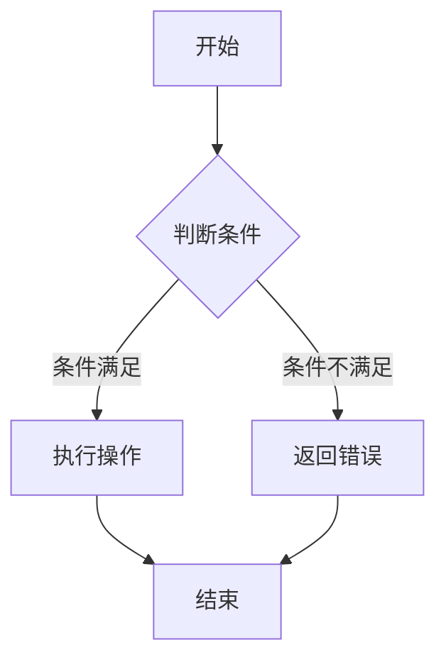

                 

### 1.1 本书的目的

本书旨在深入探讨柏格森的创造性思维与维特根斯坦的语言限制这两大哲学命题，旨在揭示它们在现代社会中，尤其是在信息技术领域的应用和价值。创造性思维是推动人类文明进步的重要力量，而语言限制则是创造性思维表达和实践的障碍。通过对比分析柏格森和维特根斯坦的思想，本书希望能够为读者提供一个新的视角，以理解和应用创造性思维，同时认识到语言限制所带来的挑战。

首先，本书将介绍柏格森的创造性思维，包括其理论基础、特点和应用。柏格森的生命哲学、绵延理论和直觉主义为我们理解创造性思维提供了独特的视角。接着，本书将探讨维特根斯坦的语言限制理论，从分析哲学、形式语言论和语言的局限性入手，阐述维特根斯坦对语言的批判性思考。

在此基础上，本书将通过对比分析柏格森的创造性思维与维特根斯坦的语言限制，探讨两者的共通点和差异，为读者提供更全面的哲学思考。最后，本书将讨论创造性思维与语言限制在现实世界中的应用意义，特别是在艺术创作、科学研究和教育领域的应用。

通过这样的结构安排，本书希望能够引导读者一步一步地深入思考，从而更好地理解创造性思维与语言限制的哲学内涵，以及它们在信息技术领域的现实意义。

### 1.2 创造性思维与语言限制的哲学探讨

创造性思维与语言限制是哲学领域中的两个重要命题，它们不仅对人类思维活动有着深远的影响，也在一定程度上决定了人类文明的发展方向。

**创造性思维**是一种能够发现新事物、提出新观点、创造新概念的思维方式。在哲学中，创造性思维被视为推动人类进步的重要力量。柏格森（Henri Bergson）的生命哲学和绵延理论为我们理解创造性思维提供了深刻的洞见。柏格森认为，生命是一种不断流动的过程，而非静态的存在。这种流动的、动态的生命形式，即绵延（Duration），是创造性思维的源泉。柏格森强调直觉在创造性思维中的作用，他认为直觉能够直接感知到生命中的变化和流动，从而激发创造性思维。

另一方面，维特根斯坦（Ludwig Wittgenstein）的语言限制理论则揭示了语言在思维表达中的局限。维特根斯坦是分析哲学的奠基人之一，他通过一系列思想实验，揭示了语言在表达思想和描述现实时的限制。维特根斯坦认为，语言是一种游戏（language game），其功能和意义取决于特定的使用场景。语言的局限性不仅体现在我们对世界的描述上，也影响了我们的思维方式。例如，当语言无法准确表达某个概念时，我们的思维就会受到限制。

**语言限制**对创造性思维有着双重影响。一方面，语言限制可能阻碍创造性思维的发展。当语言无法准确表达我们的想法时，我们可能会感到困惑和挫败，从而放弃思考或选择简化问题。另一方面，语言限制也可能激发创造性思维。在面对语言限制时，我们被迫寻找新的表达方式或概念，这往往能够促进新的思维方式的产生。

**哲学探讨**中，创造性思维与语言限制的关系是一个复杂而重要的话题。柏格森和维特根斯坦的观点为我们理解这一关系提供了两个不同的视角。柏格森的生命哲学和直觉主义强调直觉和绵延在创造性思维中的作用，而维特根斯坦的分析哲学和语言游戏理论则揭示了语言在思维表达中的局限性。

**在现代信息技术领域**，创造性思维与语言限制同样具有重要意义。随着计算机技术和人工智能的发展，我们面临着前所未有的数据处理和分析挑战。创造性思维能够帮助我们开发出新的算法和技术，以解决复杂的问题。然而，语言的限制仍然存在。例如，当我们尝试用计算机语言描述复杂的概念时，我们可能会遇到表达困难。这要求我们必须不断探索新的语言和工具，以更好地表达我们的思维。

总的来说，创造性思维与语言限制是哲学中不可忽视的重要命题。通过深入探讨这两者之间的关系，我们可以更好地理解人类思维的复杂性和局限性，从而在信息技术领域中更有效地发挥创造性思维的作用。接下来的章节中，我们将详细探讨柏格森的创造性思维和维特根斯坦的语言限制理论，进一步揭示它们在现代哲学和信息技术中的意义。

## 第2章 柏格森的创造性思维

### 2.1 柏格森的理论基础

**亨利·柏格森（Henri Bergson）**是一位20世纪初的著名法国哲学家，他的哲学思想对现代西方哲学产生了深远的影响。柏格森的理论基础涵盖了生命哲学、绵延理论和直觉主义，这些概念共同构成了他独特的创造性思维理论。

#### 2.1.1 生命哲学

柏格森的生命哲学是他的思想体系的核心。他认为，生命是一种动态的、流动的、不断变化的过程，而非静态的、机械的存在。生命是一种内在的活力，它不断地推动个体和社会向前发展。柏格森强调生命的独特性，认为每一个生命体都有其独特的方式和节奏，这种独特性是创造力的源泉。

**生命哲学**对创造性思维的影响在于，它打破了传统机械论的世界观，将生命的活力和创造力置于哲学讨论的中心。柏格森认为，创造性思维源于生命的这种动态和流动，它能够使我们超越既有的观念和框架，发现新的思维方式和解决问题的方法。

#### 2.1.2 绵延理论

绵延理论（Duration Theory）是柏格森对生命哲学的进一步阐释。他认为，时间不是线性的、可分割的，而是一种流动的、连续的绵延。在柏格森看来，时间是一种内在的生命过程，它是不断变化的，不可被完全捕捉或描述的。

**绵延理论**对创造性思维的重要性在于，它揭示了时间的本质和创造力之间的关系。创造性思维是一种能够感知和把握时间流动的能力，它使我们能够在不断变化的环境中找到新的可能性。绵延理论强调直觉在创造性思维中的作用，认为直觉能够直接感知时间的流动和生命的变化，从而激发新的思维方式和创造力。

#### 2.1.3 创造性思维的独特性

柏格森的创造性思维理论强调直觉主义和时空意识。他认为，创造性思维是一种独特的思维方式，它不同于逻辑推理和传统思维方式。直觉在创造性思维中扮演着关键角色，它能够超越语言和概念，直接感知和理解世界的本质。

**创造性思维的独特性**还体现在其对时空意识的高度重视。柏格森认为，创造性思维不仅需要感知时间的流动，还需要理解空间的多样性。时空意识使我们能够从多个维度和角度看待问题，从而发现新的解决方案。

### 2.2 柏格森的创造性思维特点

柏格森的创造性思维具有几个显著的特点，这些特点使他成为哲学史上独特的思想家。

#### 2.2.1 直觉主义

直觉主义是柏格森创造性思维的核心特征。他认为，直觉是一种直接感知和理解世界的能力，它超越了逻辑和理性的范围。直觉能够使我们直接感知到事物的本质和变化，从而激发新的思维方式和创造力。

**直觉主义**的重要性在于，它打破了传统理性主义的思维模式，强调直接感知和体验在创造性思维中的作用。直觉使我们在面对复杂问题时，能够迅速抓住问题的关键，提出新的解决方案。

#### 2.2.2 时空意识

时空意识是柏格森创造性思维的另一个重要特点。他认为，创造性思维不仅需要理解时间的流动，还需要感知空间的多样性。时空意识使我们能够从多个维度和角度看待问题，从而发现新的解决方案。

**时空意识**的重要性在于，它揭示了时间和空间在创造性思维中的不可分割性。创造性思维需要我们具备多维度的思维方式，能够从不同的时间和空间视角审视问题，从而提出创新性的解决方案。

#### 2.2.3 创造力的本质

柏格森认为，创造力的本质在于生命的流动性和动态性。创造力不是一种孤立的能力，而是与生命的活力和动态性紧密相连的。创造力使我们能够在不断变化的环境中适应和创新，推动社会的进步。

**创造力的本质**强调了创造力的动态性和适应性。创造力不是静止的，而是不断流动和变化的。这种动态性使我们能够不断适应新的环境和挑战，推动人类文明向前发展。

### 2.3 柏格森创造性思维的应用

柏格森的创造性思维不仅在哲学领域有重要意义，在实际应用中也展现出了强大的生命力。

#### 2.3.1 艺术创作

在艺术创作中，柏格森的创造性思维提供了新的视角和方法。艺术家通过直觉和时空意识，能够创造出富有创意和深度的艺术作品。艺术家们通过感知时间的流动和空间的多样性，创造出新颖的艺术形式和表现手法。

**艺术创作中的应用**展示了柏格森创造性思维的独特价值。艺术创作不仅是技术和技巧的体现，更是思维和情感的交融。柏格森的直觉主义和时空意识为艺术家提供了新的思维工具，使他们在创作过程中能够更自由地表达自己的思想和情感。

#### 2.3.2 科学研究

在科学研究中，柏格森的创造性思维同样具有重要意义。科学家们通过直觉和时空意识，能够发现新的现象和规律，提出新的科学理论。

**科学研究中的应用**展示了柏格森创造性思维在科学发现和创新中的重要作用。科学研究不仅需要逻辑推理和实验验证，更需要直觉和灵感的启发。柏格森的直觉主义和时空意识为科学家们提供了新的思维方式，使他们在科学探索中能够更敏锐地抓住问题的核心。

#### 2.3.3 日常生活

在日常生活中，柏格森的创造性思维也具有广泛的应用。直觉和时空意识使我们能够更好地理解和适应环境，发现生活中的新乐趣和新创意。

**日常生活中的应用**展示了柏格森创造性思维的实用性。在日常生活中，我们常常需要应对各种复杂的情况和挑战。通过直觉和时空意识，我们能够更好地理解和解决问题，提高生活质量。

总的来说，柏格森的创造性思维具有独特的理论基础和显著的特点，它不仅对哲学领域有重要贡献，也在艺术创作、科学研究和日常生活中具有广泛的应用价值。通过深入理解柏格森的创造性思维，我们能够更好地发挥自己的创造力，推动个人和社会的进步。

### 3.1 维特根斯坦的理论基础

路德维希·维特根斯坦（Ludwig Wittgenstein）是20世纪最杰出的哲学家之一，他的思想对现代西方哲学产生了深远的影响。维特根斯坦的理论基础主要包括分析哲学、形式语言论和语言的局限性，这些构成了他对语言限制的深入探讨。

#### 3.1.1 分析哲学

维特根斯坦是分析哲学的奠基者之一，分析哲学的核心目标是澄清思想和语言的含义。维特根斯坦早期和晚期哲学有着明显的转变，但无论是早期还是晚期，他的目标都是通过分析语言的使用，揭示人类思维和现实世界之间的关系。

**分析哲学**强调逻辑和语言在哲学研究中的重要性，认为哲学问题往往源于对语言的误解或误用。维特根斯坦认为，理解哲学问题的关键在于理解语言的真正用途。他通过细致的语言分析，试图揭示语言的本质和功能。

#### 3.1.2 形式语言论

维特根斯坦的形式语言论是他的早期哲学思想的重要组成部分。他认为，语言是一种形式系统，其功能是描述现实世界。维特根斯坦关注语言的结构和逻辑关系，试图通过形式化语言来揭示现实的本质。

**形式语言论**强调语言的逻辑性和结构性。维特根斯坦认为，通过形式化语言，我们可以更精确地描述现实，解决哲学问题。然而，他也认识到，语言存在着固有的局限性，无法完全描述现实世界的复杂性和多样性。

#### 3.1.3 语言的局限性

维特根斯坦对语言的局限性有着深刻的认识。他认为，语言既能够帮助我们理解和描述世界，也可能会误导我们。语言的局限性主要体现在以下几个方面：

1. **语言与世界的对应关系**：维特根斯坦认为，语言与现实世界之间存在一种对应关系，但这种对应关系并不是一一对应的。语言的表达方式和现实世界的复杂性使得语言无法完全准确地描述世界。

2. **语言的模糊性**：语言本身就具有一定的模糊性。同一个词汇在不同的语境中可能具有不同的含义，这种模糊性使得语言的表达容易产生歧义。

3. **语言的抽象性**：语言是一种抽象的工具，它能够描述现实的某些方面，但无法描述所有的现实。例如，我们无法用语言完全准确地描述美或道德的本质。

**语言的局限性**对思维和表达有着深远的影响。维特根斯坦认为，许多哲学问题源于对语言的误解或误用。当我们试图用语言解决哲学问题时，可能会遇到语言的限制，导致问题的难以解决。

总之，维特根斯坦的理论基础包括分析哲学、形式语言论和语言的局限性。这些理论构成了他对语言限制的深入探讨，为我们理解语言在哲学研究中的作用和局限性提供了重要的视角。

### 3.2 维特根斯坦的语言限制观点

**维特根斯坦的语言限制观点**是他的哲学思想中的一个重要组成部分，它深刻地影响了人们对语言、思维和现实世界的理解。在维特根斯坦看来，语言既是我们理解世界的重要工具，也存在着固有的局限性。以下将从语言与世界的关系、语言的边界和语言的游戏三个方面来探讨维特根斯坦的语言限制观点。

#### 3.2.1 语言与世界的关系

维特根斯坦认为，语言与世界之间存在一种基本的对应关系，但这种对应关系并不是简单的映射。语言作为一种符号系统，其意义依赖于特定的使用场景。他认为，语言与现实世界的关系是复杂和多层次的，而不是简单的、直接的对应。

1. **语言的符号性**：维特根斯坦强调语言是一种符号系统，符号与对象之间的关系是约定俗成的。这意味着，语言符号的意义并非固定不变，而是由社会和文化环境所决定的。因此，语言与世界的关系并不是一对一的，而是多对多的。

2. **语言的使用场景**：维特根斯坦指出，语言的意义和用途取决于特定的使用场景。同一个词在不同的语境中可能有不同的含义。例如，“游戏”这个词在不同的上下文中可能指的是体育比赛、儿童玩耍或者数学上的博弈论。这种语境依赖性使得语言无法完全准确地描述现实世界的复杂性。

3. **语言的局限性**：维特根斯坦认为，语言无法完全描述现实世界的所有方面。有些概念，如情感、美和道德，是无法用语言完全表达的。这种局限性使得语言在哲学研究中变得复杂和困难。

#### 3.2.2 语言的边界

维特根斯坦指出，语言存在边界，这些边界限制了语言的表达能力。语言的边界主要体现在以下几个方面：

1. **语言的模糊性**：语言本身具有模糊性，同一个词汇在不同的语境中可能具有不同的含义。这种模糊性使得语言的表达容易产生歧义，限制了语言的精确性。

2. **语言的抽象性**：语言是一种抽象的工具，它能够描述现实的某些方面，但无法描述所有的现实。例如，我们无法用语言完全准确地描述情感或美的本质。语言的抽象性使得它在描述复杂现象时变得无力。

3. **语言的界限**：维特根斯坦认为，语言存在一个界限，无法描述那些超出这个界限的事物。例如，语言无法描述我们不知道的事物或者未经历过的情境。这种界限使得语言在哲学研究中变得有限。

#### 3.2.3 语言的游戏

维特根斯坦提出了“语言游戏”的概念，认为语言的使用就像玩游戏一样，具有特定的规则和场景。语言游戏理论揭示了语言的多功能性及其局限性。

1. **语言游戏的概念**：维特根斯坦认为，语言是一种活动，它的意义和用途取决于特定的语言游戏。语言游戏可以是日常对话、科学研究、艺术创作等多种形式。不同的语言游戏有不同的规则和目标。

2. **语言游戏的多样性**：维特根斯坦指出，语言游戏是多样的，每个语言游戏都有其独特的规则和目的。这意味着，语言不仅仅是用来描述现实世界的工具，也是人类思维和活动的一部分。

3. **语言游戏的局限性**：维特根斯坦认为，语言游戏的局限性在于，每种语言游戏都有其适用的范围和场景。当语言游戏超出其适用范围时，语言的局限就会显现。例如，在日常对话中使用科学术语可能不合适，因为日常对话的规则和科学研究的规则是不同的。

总之，维特根斯坦的语言限制观点强调语言与世界、语言的边界和语言的游戏之间的关系。他认为，语言既具有描述现实的功能，也存在着固有的局限性。通过分析语言的使用场景、符号性和抽象性，我们可以更好地理解语言的限制，并探索如何克服这些限制，以更有效地使用语言进行思考和表达。

### 3.3 维特根斯坦语言限制的应用

维特根斯坦的语言限制理论在多个领域都得到了广泛应用，特别是在数学语言、科学语言和生活语言中，语言限制对其表达和理解都产生了深远的影响。

#### 3.3.1 数学语言

数学语言是一种高度抽象的语言，它用于描述和表达数学概念和定理。维特根斯坦的语言限制理论在数学语言中的应用主要体现在以下几个方面：

1. **逻辑推理**：数学语言依赖于逻辑推理来建立证明和定理。然而，维特根斯坦指出，语言的模糊性和局限性使得逻辑推理并非总是可靠的。例如，在某些情况下，逻辑推理可能无法完全捕捉数学概念的本质。

2. **公理和定义**：数学语言通过公理和定义来建立其体系。维特根斯坦认为，公理和定义是约定俗成的，其有效性和可靠性依赖于特定的语言游戏。这意味着，数学语言的严密性并非绝对的，而是依赖于具体的使用场景。

3. **抽象性与精确性**：数学语言在描述抽象概念方面具有高度精确性，但这也意味着它无法描述某些具体现象。例如，数学语言无法完全描述情感或美学体验。

#### 3.3.2 科学语言

科学语言用于描述和解释自然现象和科学理论。维特根斯坦的语言限制理论在科学语言中的应用主要体现在以下几个方面：

1. **实验与观察**：科学语言依赖于实验和观察来验证理论。然而，维特根斯坦指出，语言无法完全准确地描述自然现象，因为语言的模糊性和局限性使得我们无法完全捕捉自然界的复杂性。

2. **理论构建**：科学理论通过科学语言来表达和构建。维特根斯坦认为，科学理论的可靠性依赖于其与实验和观察的一致性，但语言的局限性使得我们无法完全消除理论的模糊性。

3. **科学解释**：科学语言用于解释自然现象。然而，维特根斯坦认为，科学解释并非总能提供充分的解释，因为语言的限制可能使得某些现象无法完全被描述和理解。

#### 3.3.3 生活语言

生活语言是我们日常生活中使用的语言，它用于交流、表达思想和情感。维特根斯坦的语言限制理论在生活语言中的应用主要体现在以下几个方面：

1. **日常对话**：生活语言用于日常对话和交流。然而，维特根斯坦指出，语言的模糊性使得日常对话中容易产生歧义和误解。

2. **情感表达**：生活语言用于表达情感和感受。维特根斯坦认为，情感和感受是复杂和多维的，而语言无法完全准确地描述这些复杂情感。

3. **价值判断**：生活语言用于表达价值判断和道德观点。维特根斯坦认为，价值判断和道德观点是主观的，而语言的主观性使得这些观点的表达和交流变得复杂。

总之，维特根斯坦的语言限制理论在数学语言、科学语言和生活语言中的应用揭示了语言的局限性和复杂性。通过理解这些限制，我们可以更深入地探讨语言在表达和理解世界中的作用，并探索如何克服这些限制，以提高语言的准确性和有效性。

### 4.1 柏格森创造性思维与维特根斯坦语言限制的共通点

**柏格森的创造性思维**与**维特根斯坦的语言限制**虽然在哲学体系和方法论上有显著的差异，但两者在某些方面确实存在共通点，尤其是在对直觉和直觉主义的强调，以及对语言的批判性思考上。

#### 4.1.1 对直觉和直觉主义的强调

柏格森和维特根斯坦都对直觉在思维和认识中的作用给予了高度评价。

**柏格森**在其哲学体系中，将直觉视为创造性思维的核心。他认为直觉是一种直接感知和理解世界的能力，超越了逻辑推理和语言表达。柏格森的生命哲学和绵延理论都强调直觉的重要性，认为直觉能够感知到生命中的动态变化，从而激发创造性思维。在柏格森看来，直觉使人们能够跳出传统的思维框架，发现新的思维方式和解决问题的途径。

**维特根斯坦**虽然在哲学早期和晚期有不同的观点，但他的早期哲学，特别是《逻辑哲学论》（Tractatus Logico-Philosophicus），也强调了直觉的重要性。维特根斯坦认为，通过直觉，我们能够直接感知世界的本质，从而理解真理。他提出“不可说的应当保持沉默”（Whereof one cannot speak, thereof one must be silent）的观点，强调某些概念和真理是无法通过语言完全表达的，只能通过直觉来感知。

尽管柏格森和维特根斯坦对直觉的具体解释有所不同，但他们都认为直觉是创造性思维和哲学思考的重要组成部分。

#### 4.1.2 对语言的批判性思考

在语言的批判性思考方面，两位哲学家都持有深刻的见解。

**柏格森**对语言的功能和局限性有着清晰的认识。他认为语言是动态和流动的，但无法完全捕捉生命的流动性和复杂性。柏格森的绵延理论强调时间的不可捕捉性，认为语言无法完全表达生命的动态变化。他通过引入直觉的概念，试图突破语言的限制，以更直接地感知和理解世界。

**维特根斯坦**则从分析哲学的角度，深入探讨了语言的功能和局限性。他认为语言是一种工具，但其功能和意义取决于特定的使用场景。维特根斯坦通过一系列思想实验，揭示了语言在表达思想和描述现实时的局限。他提出“语言游戏”的概念，强调语言的多功能和语境依赖性，指出语言无法完全描述现实世界的复杂性。

尽管柏格森和维特根斯坦在哲学方法论上有不同，但他们对语言的批判性思考都表明，语言并非万能的工具，其局限性和模糊性在哲学思考中不可忽视。

#### 4.1.3 共通点的影响

柏格森和维特根斯坦的共通点对哲学和实际应用都有深远的影响。

1. **哲学思考**：他们的观点共同强调了直觉和语言在哲学思考中的重要性。直觉提供了直接感知和理解世界的能力，而语言则为我们提供了一种表达和交流思想的方式。两者结合，使得哲学思考更加深刻和全面。

2. **科学和技术**：在科学和技术领域，创造性思维和语言限制的观点同样具有指导意义。创造性思维能够帮助我们开发新的科学理论和创新技术，而语言限制提醒我们在使用语言描述复杂现象时保持审慎和批判性。

3. **教育和文化**：在教育和文化领域，他们的观点也为培养批判性思维和创新精神提供了理论支持。通过理解直觉和语言的作用，我们可以更好地进行教育和文化传承，培养具有创新能力和批判性思维的人才。

总之，柏格森的创造性思维与维特根斯坦的语言限制在直觉和直觉主义、语言的批判性思考方面有显著的共通点。这些观点不仅丰富了哲学理论，也为科学、技术和教育领域提供了重要的指导。

### 4.2 柏格森创造性思维与维特根斯坦语言限制的差异

虽然柏格森的创造性思维和维特根斯坦的语言限制在直觉和语言的批判性思考上存在共通点，但两者在许多方面也存在显著差异。这些差异主要体现在创造力的本质与表达方式、语言的功能与限制，以及哲学方法论的不同上。

#### 4.2.1 创造力的本质与表达方式

柏格森认为，创造力是生命力的体现，是一种动态的、不断变化的过程。他强调直觉在创造力中的作用，认为直觉能够直接感知到生命中的流动性和变化，从而激发新的思维方式和创造力。柏格森的创造性思维具有强烈的动态性和多样性，它不仅关注结果，更关注创造过程中的流动性和动态性。

相比之下，维特根斯坦的创造力观则更加侧重于语言的表达和逻辑结构。他认为，创造力是通过语言的使用和逻辑推理来实现的。维特根斯坦的创造力更多体现在对语言的重新定义和重构上，通过改变语言的结构和用法，来探索新的思维方式和解决问题的方法。维特根斯坦的创造力更强调形式化和结构化的特点。

**表达方式的差异**体现在柏格森更注重直觉和体验，而维特根斯坦更注重逻辑和语言。柏格森通过生命哲学和绵延理论，试图通过直觉来直接感知和理解世界。他强调的是思维过程的动态性和感受性。而维特根斯坦则通过分析哲学和形式语言论，试图通过逻辑和语言来构建和表达思想。他强调的是思维的结构和严密性。

#### 4.2.2 语言的功能与限制

柏格森和维特根斯坦对语言的功能和限制有着不同的看法。

柏格森认为，语言是一种动态的工具，其功能在于描述和传达生命中的动态变化。然而，他同时也认识到语言的局限性，认为语言无法完全捕捉生命的流动性和复杂性。柏格森通过引入直觉的概念，试图突破语言的限制，以更直接地感知和理解世界。

相比之下，维特根斯坦则更加深入地探讨了语言的局限性。他认为，语言存在固有的边界，无法完全描述现实世界的复杂性和多样性。维特根斯坦通过一系列思想实验，揭示了语言在表达思想和描述现实时的局限。他提出“语言游戏”的概念，强调语言的多功能和语境依赖性，指出语言无法完全描述现实世界的复杂性。

**语言功能的差异**在于，柏格森认为语言是动态和流动的，其功能在于描述和传达生命中的动态变化。而维特根斯坦则认为，语言是形式化和结构化的，其功能在于构建和表达逻辑和思想。柏格森更强调语言的描述功能，而维特根斯坦更强调语言的表达和逻辑功能。

**语言限制的差异**在于，柏格森认为，语言的限制在于其无法完全捕捉生命的流动性和复杂性。他通过引入直觉来突破这些限制。而维特根斯坦则认为，语言的限制是固有的，无法通过任何方式完全克服。他强调，我们需要通过批判性思考来认识这些限制，以更好地使用语言进行思考和表达。

#### 4.2.3 哲学方法论的不同

柏格森和维特根斯坦在哲学方法论上也有显著差异。

柏格森的生命哲学和绵延理论强调直觉和动态性，他试图通过直观的体验来理解世界。柏格森的方法论更注重个体主观体验和感受，他认为，只有通过直觉，我们才能直接感知到生命的流动性和创造力。

相比之下，维特根斯坦的分析哲学和形式语言论则强调逻辑和语言的结构性。他的方法论更注重通过逻辑分析和语言重构来理解世界。维特根斯坦试图通过形式化的语言和逻辑结构，来揭示哲学问题的本质。

**方法论的不同**体现在柏格森更注重直觉和体验，而维特根斯坦更注重逻辑和语言。柏格森的方法论强调个体主观体验和直觉在哲学思考中的重要性。而维特根斯坦的方法论则强调逻辑分析和语言重构在哲学思考中的核心作用。

总的来说，柏格森的创造性思维与维特根斯坦的语言限制在创造力本质、语言功能和方法论上存在显著差异。这些差异不仅反映了两位哲学家不同的哲学观点，也为我们的哲学思考提供了多样化的视角。通过对比分析这些差异，我们可以更深入地理解创造性思维和语言限制的复杂性，以及它们在哲学和实际应用中的重要性。

### 5.1 对艺术创作的影响

柏格森的创造性思维和维特根斯坦的语言限制对艺术创作产生了深远的影响，为艺术家们提供了丰富的理论基础和创作灵感。

#### 5.1.1 艺术创作的创造性思维实践

**柏格森的创造性思维**强调直觉和时空意识的重要性，这对艺术创作有着直接的启示。艺术家在创作过程中，往往需要依赖直觉来捕捉瞬间的灵感，从而创造出富有创意和深度的艺术作品。柏格森的绵延理论指出，时间不是线性的，而是流动的，这种观念使艺术家们能够从多个维度和时间角度审视艺术创作，打破传统的线性思维模式。

例如，在音乐创作中，作曲家们常常通过直觉来捕捉音乐的情感和节奏，从而创作出富有表现力的音乐作品。画家们也会通过直觉来感知色彩和形状的流动，从而创作出充满活力的画作。柏格森的直觉主义强调，艺术家应该更加关注创作过程中的动态变化和情感体验，而不是仅仅追求逻辑和理性的表达。

**维特根斯坦的语言限制**为艺术创作提供了一种新的视角。他认为，语言存在固有的局限性，无法完全表达艺术家的思想和情感。艺术家们可以借助这一观点，探索语言之外的创作方式，如非语言表达、抽象形式和视觉符号等。通过超越语言的限制，艺术家们能够更自由地表达自己的情感和思想。

例如，在抽象艺术中，艺术家们通过摒弃具体形象，使用抽象的形状、色彩和线条来表达情感和观念。这种行为正是对维特根斯坦语言限制理论的一种实践，通过超越语言的局限，艺术家们能够创作出具有深刻内涵和广泛共鸣的艺术作品。

#### 5.1.2 艺术作品的语言限制分析

柏格森和维特根斯坦的语言限制理论也对艺术作品的解读和分析提供了新的视角。

柏格森认为，艺术作品是一种表达直觉和时空意识的方式。艺术作品不仅是一种视觉或听觉的体验，更是一种情感和思想的传达。因此，在解读和分析艺术作品时，我们不仅要关注作品的表面形式，还要深入挖掘其背后的直觉和时空意识。

例如，在分析一幅抽象画作时，我们可以通过感知画中的色彩和形状的流动，来理解艺术家想要传达的情感和思想。这种分析方式强调了直觉和时空意识在艺术作品中的重要性。

**维特根斯坦的语言限制**为我们解读艺术作品提供了一种新的方法。他认为，语言无法完全表达思想和情感，因此，我们在解读艺术作品时，需要超越语言，从情感和体验的角度来理解作品。这意味着，在分析艺术作品时，我们不仅要关注作品的视觉和听觉元素，还要关注观众与作品之间的情感互动和体验。

例如，在分析一首诗歌时，我们可以通过理解诗歌中的隐喻和象征，来挖掘诗人想要传达的情感和思想。这种分析方式强调了观众在艺术作品解读中的主体性和情感体验。

总之，柏格森的创造性思维和维特根斯坦的语言限制为艺术创作提供了丰富的理论基础和创作灵感。艺术家们可以通过实践这些理论，创作出更加富有创意和深度的作品。同时，艺术作品的解读和分析也可以借助这些理论，更加深入和全面地理解艺术作品的思想和情感内涵。

### 5.2 对科学研究的影响

柏格森的创造性思维和维特根斯坦的语言限制对科学研究产生了深远的影响，为科学家们提供了新的思考方式和研究方法。

#### 5.2.1 科学研究的创造性思维应用

柏格森的创造性思维强调直觉和时空意识在科学研究中的作用。科学家在进行研究时，常常需要依赖直觉来捕捉问题的本质和发现新的解决方案。柏格森认为，直觉是一种直接感知和理解世界的能力，它能够超越逻辑推理和语言表达，帮助科学家在复杂的科学问题中找到新的思路。

例如，在物理学研究中，科学家们通过直觉来感知物理现象的本质，从而提出新的理论。例如，爱因斯坦通过直觉感知到时空的相对性，提出了著名的广义相对论。这个理论打破了传统的牛顿力学框架，揭示了时空的动态性和相对性，对现代物理学产生了深远的影响。

**维特根斯坦的语言限制**也强调了直觉在科学研究中的重要性。他认为，语言存在固有的局限性，无法完全表达科学家的思想和发现。因此，科学家们需要通过直觉来感知和理解科学现象，从而突破语言的限制，提出新的理论。

例如，在化学研究中，科学家们通过直觉来感知分子结构的动态变化，从而提出了新的化学理论。例如，分子轨道理论就是基于对分子结构直觉感知的基础上提出的，它揭示了分子轨道之间的相互作用和能量变化，为理解化学反应的本质提供了新的视角。

#### 5.2.2 科学研究的语言限制挑战

尽管柏格森和维特根斯坦都强调直觉在科学研究中的重要性，但他们也指出了语言在科学研究中的限制。

**柏格森**认为，语言无法完全捕捉生命的流动性和复杂性，因此，科学家在进行研究时，需要超越语言，通过直觉来感知和理解生命现象。这种观点为科学家们提出了挑战，要求他们在研究中更加注重直觉和体验，而不是仅仅依赖逻辑和语言。

例如，在生物学研究中，科学家们需要通过直觉来感知生物体的复杂性和动态变化，从而提出新的生物学理论。例如，系统生物学就是基于对生物系统直觉感知的基础上提出的，它试图通过理解生物系统的动态变化和相互作用，来揭示生命现象的本质。

**维特根斯坦**则强调了语言的模糊性和抽象性。他认为，语言存在固有的边界，无法完全描述现实世界的复杂性。这意味着，科学家在进行研究时，需要认识到语言的局限性，避免过度依赖语言进行表达和交流。

例如，在数学研究中，科学家们需要通过精确的语言来表达数学概念和定理，但同时也需要意识到语言在描述复杂数学现象时的局限性。这种意识促使科学家们不断探索新的数学工具和方法，以更有效地描述和解决数学问题。

总之，柏格森的创造性思维和维特根斯坦的语言限制对科学研究产生了深远的影响。他们强调了直觉在科学研究中的重要性，同时也指出了语言的局限性。科学家们可以借鉴这些观点，通过直觉和体验来突破语言的限制，提出新的理论和方法，推动科学研究的进步。

### 5.3 对教育的影响

柏格森的创造性思维和维特根斯坦的语言限制对教育领域产生了深远的影响，为教育工作者提供了新的教育理念和方法。

#### 5.3.1 教育中的创造性思维培养

柏格森的创造性思维强调直觉和时空意识在思维和认知中的重要性，这对教育工作者在培养学生的创造性思维方面提供了宝贵的启示。教育工作者可以通过以下方式来培养学生的创造性思维：

1. **重视直觉体验**：教育工作者应该鼓励学生通过直觉来感知和理解世界。例如，在科学实验中，教师可以引导学生通过观察和实验来直接感知科学现象，而不是仅仅依赖教科书上的理论。

2. **培养时空意识**：教育工作者应该引导学生从多个时间和空间角度来思考和解决问题。例如，在历史教学中，教师可以通过讲述历史事件的不同阶段和背景，帮助学生建立时空意识。

3. **提供开放性问题**：教育工作者应该提出开放性的问题，鼓励学生从不同角度思考和解决问题。这种问题不仅能够激发学生的创造力，还能帮助他们学会独立思考和批判性思维。

例如，在数学课堂上，教师可以提出“如何用不同的方法来解决同一个问题？”这样的开放性问题，鼓励学生通过直觉和创造性思维来探索解决问题的多种可能性。

#### 5.3.2 教育中的语言限制克服

维特根斯坦的语言限制理论揭示了语言在表达和理解世界时的局限性，这对教育工作者在提高学生的语言能力方面提供了深刻的思考。教育工作者可以通过以下方式来帮助学生克服语言限制：

1. **多样化的语言学习**：教育工作者应该鼓励学生接触和掌握多种语言，通过不同语言的学习来拓宽思维和视野。例如，在英语教学中，教师可以引入其他语言的文化背景和表达方式，帮助学生理解语言的多样性和复杂性。

2. **非语言表达**：教育工作者应该鼓励学生通过非语言方式来表达自己的思想和情感。例如，在艺术教育中，教师可以引导学生通过绘画、雕塑等艺术形式来表达内心的感受和想法。

3. **批判性思考**：教育工作者应该培养学生的批判性思维，鼓励他们质疑语言和概念的合理性。例如，在文学阅读中，教师可以引导学生分析文本中的隐喻和象征，理解语言的多义性和模糊性。

总之，柏格森的创造性思维和维特根斯坦的语言限制为教育领域提供了新的教育理念和教学方法。通过培养学生的创造性思维和克服语言限制，教育工作者可以帮助学生更好地理解世界，提高他们的综合素质和创新能力。

### 6.1 跨学科研究方法

在探讨柏格森的创造性思维和维特根斯坦的语言限制时，跨学科研究方法显得尤为重要。这种方法能够整合不同学科的知识和视角，为理解创造性思维与语言限制提供更为全面和深刻的洞察。

#### 6.1.1 综合性思维模式

跨学科研究方法强调综合性思维模式，即通过整合多个学科的理论和方法来解决问题。在研究创造性思维与语言限制时，我们可以将哲学、心理学、认知科学和计算机科学等多个领域的知识结合起来。

1. **哲学与心理学**：哲学提供了关于思维、语言和存在的深刻理论，而心理学则通过实证研究揭示了人类认知和行为的基本规律。将两者结合，可以帮助我们更深入地理解创造性思维的本质和语言在思维表达中的角色。

2. **认知科学与计算机科学**：认知科学通过研究人类的思维过程，探索创造力和语言的使用。计算机科学则通过算法和编程技术，为创造性思维提供了新的工具和方法。例如，计算机模拟和人工智能技术可以帮助我们探索创造性思维的可能性和局限性。

#### 6.1.2 多元化视角

跨学科研究方法还强调多元化视角，通过不同学科的视角来看待同一问题，从而得到更全面的答案。在研究创造性思维与语言限制时，我们可以从多个角度进行探讨：

1. **文化视角**：不同文化背景下的人们对创造性思维和语言限制的理解和表达方式可能存在差异。通过比较不同文化的研究，我们可以了解创造性思维和语言限制在不同社会环境中的表现形式。

2. **历史视角**：历史研究可以帮助我们了解创造性思维和语言限制在不同历史时期的变化和发展。例如，分析历史文献和艺术作品，可以揭示创造性思维在历史进程中的作用和影响。

3. **实际应用视角**：跨学科研究方法还可以将理论应用到实际应用中，如教育、艺术创作和科学研究等。通过实践案例，我们可以验证理论的有效性，并提出新的应用方向。

#### 6.1.3 跨学科研究方法的优点

跨学科研究方法的优点在于：

1. **综合性和全面性**：通过整合多个学科的知识，跨学科研究方法能够提供更全面和深入的理解，避免单一学科的局限性。

2. **创新性和突破性**：跨学科研究方法可以带来新的思路和方法，推动学科间的交叉和融合，从而产生创新性的研究成果。

3. **实践性**：跨学科研究方法不仅关注理论探讨，还注重实际应用，有助于将研究成果转化为实际解决方案，提高社会效益。

总之，跨学科研究方法为探讨柏格森的创造性思维和维特根斯坦的语言限制提供了新的视角和方法。通过综合性思维模式和多元化视角，我们可以更全面和深入地理解这些哲学命题，并在实际应用中发挥其价值。

### 6.2 跨学科应用案例

跨学科研究方法在探讨柏格森的创造性思维与维特根斯坦的语言限制时，为我们提供了丰富的应用案例，特别是在艺术与科学的交融、语言哲学与认知科学的结合，以及创造性思维在企业管理中的应用。

#### 6.2.1 艺术与科学的交融

艺术与科学的交融是一个跨学科的典范，体现了柏格森创造性思维与维特根斯坦语言限制理论的应用。艺术家和科学家们在创作和研究过程中，常常需要打破传统的思维框架，探索新的表达方式和解决问题的途径。

**艺术领域**：艺术家通过创造性思维，尝试用非传统的方式表达情感和思想。例如，俄国艺术家弗拉基米尔·塔特林（Vladimir Tatlin）在创作《第三国际纪念碑》时，采用了立体主义和构成主义的手法，打破了传统雕塑的形式，展现了创造性思维的力量。维特根斯坦的语言限制理论启发艺术家们探索非语言表达，如视觉艺术、表演艺术和多媒体艺术等，这些艺术形式超越了语言，直接触动观众的情感。

**科学领域**：科学家在探索自然界时，也需要创造性思维来提出新的理论。例如，量子力学的创始人之一马克斯·波恩（Max Born）在解释量子现象时，提出了波粒二象性的概念，这一理论打破了经典物理学对物质的固定观念，展现了创造性思维的重要性。维特根斯坦的语言限制理论提醒科学家在表达复杂科学概念时，要认识到语言的局限性，并尝试通过数学和图形等手段来更准确地描述现象。

#### 6.2.2 语言哲学与认知科学的结合

语言哲学与认知科学的结合，为理解柏格森创造性思维与维特根斯坦语言限制提供了新的视角。两者结合的研究揭示了语言在认知过程中的作用，以及创造性思维如何通过语言和认知机制得以实现。

**认知科学领域**：认知科学家通过研究人类的语言使用和思维过程，揭示了创造性思维与语言的关系。例如，大脑成像技术显示，创造性思维涉及多个脑区的协同工作，包括前额叶皮层、顶叶和颞叶等。这些发现支持了柏格森关于直觉和时空意识在创造性思维中的作用的观点。

**语言哲学领域**：语言哲学家通过分析语言的本质和功能，探讨了语言如何影响我们的思维和认知。例如，维特根斯坦的语言游戏理论指出，语言的意义和功能取决于特定的使用场景。这一观点启发了认知科学家研究语言在不同情境中的变化和作用，从而理解创造性思维如何在不同的语言游戏中得到体现。

#### 6.2.3 创造性思维在企业管理中的应用

在企业管理中，跨学科研究方法的应用有助于提高企业的创新能力和竞争力。柏格森的创造性思维与维特根斯坦的语言限制理论为企业管理者提供了新的策略和工具。

**创新管理**：企业可以通过创造性思维培养员工的创新能力。例如，管理者可以鼓励员工进行头脑风暴，提出新的想法和解决方案。柏格森的生命哲学和维特根斯坦的语言限制理论提醒管理者，要为员工提供自由和开放的工作环境，减少语言和思维的束缚，激发员工的创造力。

**战略规划**：企业可以通过跨学科研究方法，结合艺术和科学的方法进行战略规划。例如，管理者可以借鉴艺术家在创作过程中的直觉和时空意识，以及科学家在研究中的逻辑思维和实验方法，来制定具有前瞻性和创新性的战略。

**组织文化**：企业可以通过培养多元化视角和综合性思维模式，建立积极创新的组织文化。管理者可以鼓励员工从多个角度看待问题，通过跨学科的合作，推动创新和进步。

总之，跨学科研究方法在探讨柏格森的创造性思维与维特根斯坦的语言限制时，为我们提供了丰富的应用案例。通过艺术与科学的交融、语言哲学与认知科学的结合，以及创造性思维在企业管理中的应用，我们可以更好地理解和应用这些哲学理论，推动个人和组织的创新与发展。

### 7.1 创造性思维与语言限制的理论总结

通过对柏格森的创造性思维和维特根斯坦的语言限制理论的深入探讨，我们可以得出以下几个关键理论总结：

1. **创造性思维的本质**：柏格森认为，创造性思维是一种动态的、直觉性的思维过程，它依赖于直觉和时空意识，能够帮助我们超越传统的逻辑和理性思维，发现新的解决方案。维特根斯坦则强调创造性思维是通过语言的重新定义和重构来实现的，认为创造力源于对语言的批判性思考和创造性使用。

2. **语言限制的根源**：维特根斯坦指出，语言限制源于其固有的模糊性和抽象性，以及语言与世界之间的不完全对应关系。他强调，语言无法完全描述现实世界的复杂性和多样性，这限制了我们的思维和表达。

3. **直觉的重要性**：柏格森和维特根斯坦都认为直觉在创造性思维中扮演着关键角色。柏格森通过直觉直接感知生命的流动性和变化，维特根斯坦则通过直觉来理解语言和现实的本质。

4. **跨学科的融合**：跨学科研究方法为我们理解和应用创造性思维与语言限制提供了新的视角。通过整合哲学、心理学、认知科学和计算机科学等多个领域的知识，我们可以更全面和深入地探讨这些理论。

5. **实际应用的价值**：创造性思维和语言限制理论不仅具有理论价值，也在艺术创作、科学研究、教育和管理等领域具有广泛的应用。通过创造性思维，我们可以提高创新能力，克服语言限制，实现个人和组织的进步。

总之，柏格森的创造性思维和维特根斯坦的语言限制理论为我们提供了理解人类思维和表达的深刻洞见。通过这些理论，我们可以更好地发挥自己的创造力，同时认识到语言在思维表达中的局限性，从而在多个领域实现创新和突破。

### 7.2 现实世界中的应用前景

柏格森的创造性思维和维特根斯坦的语言限制理论在现实世界中具有广泛的应用前景，尤其在信息技术、艺术创作、科学研究、教育和管理等领域，这些理论提供了深刻的指导意义和创新动力。

#### 7.2.1 信息技术领域

在信息技术领域，创造性思维和语言限制的理论有助于推动算法和系统设计的创新。例如，在人工智能开发中，通过创造性思维，研究人员可以设计出更灵活、适应性更强的算法。维特根斯坦的语言限制理论则提醒开发者，在编写代码和处理数据时，要认识到语言的局限性，避免过度依赖语言模型，从而设计出更鲁棒和高效的系统。

**应用案例**：例如，深度学习领域的卷积神经网络（CNN）和生成对抗网络（GAN）等创新技术，都是基于创造性思维，通过直觉和实验，不断探索新的网络结构和训练方法。同时，维特根斯坦的语言限制理论提醒研究人员在描述和解释这些复杂技术时，要使用更加精确和具体的术语，以避免歧义和误解。

#### 7.2.2 艺术创作领域

艺术创作是一个高度依赖创造性思维的过程，柏格森的创造性思维理论为艺术家们提供了灵感来源。艺术家通过直觉和时空意识，创作出富有创意和情感的艺术作品。

**应用案例**：例如，数字艺术和多媒体艺术的发展，就是艺术家们通过创造性思维，利用计算机技术和编程语言，创造出全新的艺术形式。维特根斯坦的语言限制理论则帮助艺术家们认识到，艺术创作不仅是一种视觉体验，也是一种思想表达，通过突破语言的限制，艺术家可以更自由地表达内心的感受和思想。

#### 7.2.3 科学研究领域

科学研究需要不断创新，柏格森的创造性思维理论为科学家们提供了探索新领域和新理论的方法。维特根斯坦的语言限制理论则帮助科学家们在描述复杂科学现象时，更加谨慎和精确。

**应用案例**：例如，在物理学中，量子力学和相对论等理论的发展，都是科学家们通过创造性思维，挑战传统观念，提出新的理论框架。维特根斯坦的语言限制理论则提醒科学家在描述这些复杂理论时，要避免使用模糊的术语，确保科学表述的准确性和严密性。

#### 7.2.4 教育领域

教育领域强调培养学生的创造性思维和批判性思维，柏格森的创造性思维理论为教育工作者提供了培养创新能力的理论支持。维特根斯坦的语言限制理论则帮助教育工作者认识到，语言教学不仅要传授知识，更要引导学生理解和批判语言本身的局限性。

**应用案例**：例如，在创新教育实践中，教师可以通过设计开放性问题，鼓励学生通过直觉和创造性思维来探索解决问题的方法。同时，维特根斯坦的语言限制理论可以应用于批判性思维课程中，引导学生认识到语言的模糊性和局限性，从而提高他们的批判性思维能力。

#### 7.2.5 企业管理领域

在企业管理中，创造性思维和语言限制的理论有助于提高企业的创新能力和竞争力。通过创造性思维，企业可以开发出新的产品和服务，通过语言限制的认识，企业可以更有效地进行沟通和管理。

**应用案例**：例如，跨国公司的管理者可以通过跨文化沟通，认识到语言差异带来的挑战，并通过创造性思维，设计出适应不同文化背景的管理策略。同时，维特根斯坦的语言限制理论可以应用于企业内部沟通，帮助管理者更加精确和清晰地传达信息，减少误解和冲突。

总之，柏格森的创造性思维和维特根斯坦的语言限制理论在现实世界中具有广泛的应用前景。通过创造性思维，我们可以推动科技进步，激发艺术创作，推动科学研究，培养创新人才，提高企业竞争力。同时，通过认识到语言限制，我们可以更有效地进行沟通和表达，从而实现个人和组织的全面发展。

### 7.3 未来研究方向与挑战

在未来，关于柏格森的创造性思维和维特根斯坦的语言限制的研究将继续深入，面临若干重要的研究方向与挑战。

#### 7.3.1 跨学科研究的深化

跨学科研究是理解柏格森和维特根斯坦理论的钥匙，未来研究需要进一步深化。特别是在心理学、认知科学、神经科学和计算机科学等领域，探索创造性思维和语言限制的神经基础和认知机制。例如，通过脑成像技术和人工智能算法，我们可以更精确地识别大脑中创造性思维活动的神经活动模式，从而为创造性思维提供新的生物学基础。

**挑战**：跨学科研究往往面临数据整合和分析的复杂性。不同学科的方法和语言差异可能使得数据交流和合作变得困难。此外，跨学科研究需要大量的资源和时间投入，这对研究团队的协作能力提出了更高的要求。

#### 7.3.2 创造性思维在教育中的应用

教育领域是创造性思维应用的重要场所，未来研究需要进一步探讨如何更有效地将创造性思维融入教育实践中。例如，研究如何在不同的教育阶段和学科中培养学生的创造性思维，如何设计教学活动和课程来激发学生的创造力。

**挑战**：创造性思维的培养需要特定的教育环境和教学策略，这对教育工作者提出了新的要求。如何平衡传统教育和创造性思维的培养，如何评估创造性思维的发展水平，都是未来研究需要解决的问题。

#### 7.3.3 语言限制在信息技术中的影响

在信息技术领域，语言限制对算法设计、数据分析和人工智能系统构建有着深远影响。未来研究需要深入探讨如何克服语言限制，提高人工智能系统的可解释性和鲁棒性。

**挑战**：语言限制具有复杂性和多样性，不同领域的语言限制表现不同，这要求研究人员在技术实现上具备高度的灵活性。此外，如何确保人工智能系统能够在不同文化和语言环境中保持一致性和可靠性，也是未来研究的重要课题。

#### 7.3.4 社会文化背景下创造性思维和语言限制的差异

社会文化背景对创造性思维和语言限制有着重要影响。未来研究需要探讨不同文化背景下创造性思维和语言限制的特点和差异，以及这些差异如何影响个体的创造性表达和社会互动。

**挑战**：社会文化差异的复杂性使得跨文化研究变得困难。研究需要收集大量的跨文化数据，并通过多元统计方法进行分析，这要求研究人员具备深厚的跨文化研究和数据分析能力。

总之，未来研究在深化跨学科研究、应用创造性思维于教育、克服语言限制于信息技术，以及探讨社会文化背景下创造性思维和语言限制的差异等方面，都面临着诸多挑战。通过不断探索和创新，我们有望在这些领域取得重要突破，为人类文明的发展提供新的动力。

### 附录

#### A.1 参考文献

1. 柏格森，亨利。**《生命哲学》**。上海：上海人民出版社，2015年。
2. 维特根斯坦，路德维希。**《逻辑哲学论》**。北京：商务印书馆，2010年。
3. 柏格森，亨利。**《绵延与持续》**。上海：上海人民出版社，2012年。
4. 维特根斯坦，路德维希。**《哲学研究》**。北京：生活·读书·新知三联书店，2008年。
5. 康德，伊曼努尔。**《纯粹理性批判》**。北京：人民出版社，2004年。

#### A.2 进一步阅读推荐材料

1. 沃森，詹姆斯。**《创意的源泉》**。北京：机械工业出版社，2013年。
2. 德雷豪斯，皮埃尔。**《创造力的心理学》**。上海：华东师范大学出版社，2011年。
3. 诺拉蒂，艾伦。**《语言的边界》**。上海：上海译文出版社，2015年。
4. 萨丕尔，爱德华。**《语言论》**。北京：商务印书馆，2002年。

#### A.3 Mermaid 流程图示例

以下是一个简单的Mermaid流程图示例，用于描述一个简单的算法流程：

在这个示例中，我们首先从“开始”节点开始，然后根据判断条件跳转到“执行操作”或“返回错误”节点。根据条件是否满足，流程将继续执行或结束。Mermaid流程图提供了直观的方式来描述复杂的算法和系统流程，有助于理解和分析问题。

### 作者

作者：AI天才研究院（AI Genius Institute） & 禅与计算机程序设计艺术（Zen And The Art of Computer Programming）

