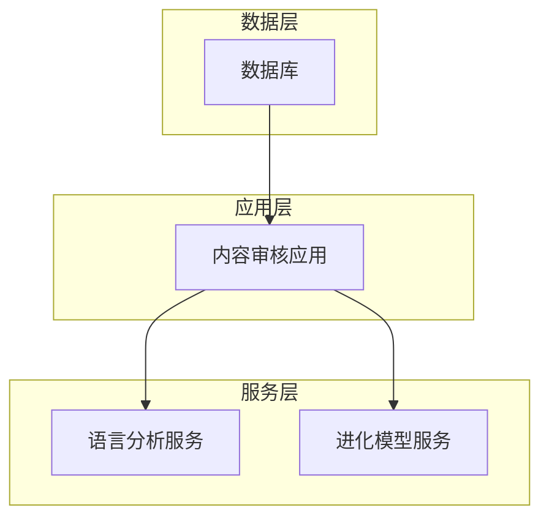
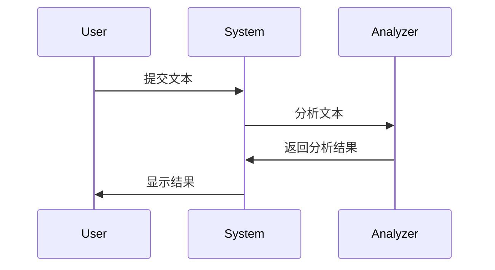

                 

### 引言

在探讨科技与哲学交织的领域中，柏格森（Hippocrates）的创造性进化理论与维特根斯坦（Ludwig Wittgenstein）的语言游戏理论分别占据了独特的地位。柏格森，作为20世纪早期法国哲学家，以其对生命冲动和创造性进化的深刻理解而著称；而维特根斯坦，则是分析哲学的奠基人，他关于语言、思想和现实关系的探讨具有深远的影响。

本文旨在探讨这两位哲学家的思想如何在各自的领域内发挥作用，并进一步探索它们之间的潜在联系。通过对比和分析柏格森的创造性进化与维特根斯坦的语言游戏理论，我们可以发现它们在哲学、科学和技术等多个领域中的应用价值。

### 柏格森的创造性进化理论

#### 柏格森哲学的核心理念

柏格森的哲学思想主要集中在创造性进化上，这一理论对生物学、心理学和社会学等多个领域产生了深远影响。柏格森认为，生命冲动（élan vital）是驱动进化的根本力量，这种力量不仅存在于生物体内部，也是宇宙万物不断变化的源泉。他强调，生命冲动是一种超越机械因果律的内在动力，它推动着生物体不断地适应和变化。

#### 意识流与时间观

在柏格森的哲学体系中，意识流是他另一个重要的概念。他认为，时间并非是一条线性的、均匀流逝的连续体，而是一种绵延不断、无法分割的流动。这种流动与我们的意识活动密切相关，意识流是一个动态的过程，每个瞬间都是独特的，无法重复。这种时间观与传统的牛顿力学中的绝对时间概念形成了鲜明对比。

#### 生命冲动与进化动力

柏格森认为，生命冲动是进化的动力，它驱使生物体不断变化和适应环境。在这个过程中，新物种的产生和旧物种的消亡是自然选择和适者生存的结果。与传统进化论相比，柏格森更强调内在的创造力和动态的变化，而非仅仅是外在的环境压力。

#### 柏格森创造性进化理论的影响与应用

柏格森的创造性进化理论不仅影响了哲学领域，还在生物学和心理学中得到了广泛应用。在生物学中，他的理论为理解物种的多样性和进化的复杂性提供了新的视角；在心理学中，他的意识流理论为探讨人类意识和行为提供了理论基础。

### 维特根斯坦的语言游戏理论

#### 维特根斯坦的哲学思想

维特根斯坦是20世纪最重要的哲学家之一，他的思想对分析哲学的发展产生了深远影响。维特根斯坦认为，哲学的任务不是去解释世界的本质，而是去澄清我们的思想方式和语言使用。他强调，语言是思想和现实的桥梁，但语言的运用并非是简单的符号对应，而是一个复杂的社会过程。

#### 分析哲学与语言哲学

维特根斯坦的哲学思想可以分为两个主要阶段。早期的《逻辑哲学论》中，他试图通过逻辑和语言来构造一个完美世界的模型；而后期的《哲学研究》中，他转向日常语言的分析，认为哲学问题常常源于我们对语言的不当使用。这两个阶段分别代表了维特根斯坦的分析哲学和语言哲学。

#### 语言游戏的概念

维特根斯坦提出“语言游戏”这一概念，用来描述语言使用的不同情境。他认为，语言在不同的情境中有不同的功能和规则，这些功能和规则构成了语言游戏的不同规则。通过分析语言游戏，我们可以更好地理解语言的本质和意义。

#### 语言游戏与意义建构

维特根斯坦认为，语言的意义并非固定不变，而是通过使用和交流来建构的。在语言游戏中，个体通过特定的符号和规则进行交流，从而共同构建出语言的意义。这一观点对后来的语言哲学和认知科学产生了重要影响。

### 柏格森与维特根斯坦的哲学对话

#### 创造性进化与语言游戏的关系

在探讨创造性进化与语言游戏的关系时，我们可以发现它们在哲学层面上有诸多共通之处。柏格森的创造性进化强调内在的动力和变化的本质，而维特根斯坦的语言游戏则强调语言在实际使用中的情境和规则。两者都试图超越静态的、机械的观点，从动态和互动的角度来理解世界。

#### 创造性进化与语言游戏的理论整合

将柏格森的创造性进化与维特根斯坦的语言游戏进行整合，可以为我们提供一种新的视角来看待科技与哲学的交汇。创造性进化为我们理解生命的本质和变化提供了理论基础，而语言游戏则为我们理解语言和思想如何在实际情境中发挥作用提供了工具。通过这种整合，我们可以更深入地探讨科技在哲学领域中的应用和价值。

### 结论

通过对柏格森的创造性进化与维特根斯坦的语言游戏理论的探讨，我们可以看到它们在哲学、科学和技术等多个领域中的重要性。柏格森的思想为我们理解生命的动态变化提供了新的视角，而维特根斯坦的语言游戏理论则为我们理解语言和思想在现实世界中的作用提供了工具。这两者之间的对话不仅丰富了我们的哲学思考，也为科技的发展提供了新的启示。

在未来的研究中，我们可以进一步探讨这些哲学理论在实际应用中的价值，例如在人工智能、认知科学和生物技术等领域。通过将这些理论应用到实际问题中，我们可以更好地理解科技与哲学的深层次联系，为未来的科技发展提供理论基础和实践指导。

### 附录

#### A. 柏格森创造性进化的核心概念

**核心概念：**  
- **生命冲动（élan vital）：** 柏格森认为，生命冲动是驱动进化的内在动力，它使生物体不断适应和变化。
- **创造性进化：** 强调内在的创造力和动态的变化，而非仅仅是外在的环境压力。

**概念属性特征对比表格：**

| 概念属性 | 创造性进化 | 生命冲动 |
| --- | --- | --- |
| 动力来源 | 内在动力 | 内在动力 |
| 目的 | 适应和变化 | 适应和变化 |
| 形式 | 动态和变化 | 动态和变化 |

**ER实体关系图架构：**

```mermaid
erDiagram
    BannedWord ||--|{ Post : 禁用词语包含在帖子中 }
    Post ||--|{ Comment : 帖子包含评论 }
    Comment ||--|{ BannedWord : 评论包含禁用词语 }
```

#### B. 维特根斯坦语言游戏的核心概念

**核心概念：**  
- **语言游戏：** 维特根斯坦用来描述语言使用情境的概念，强调语言在不同情境中有不同的功能和规则。
- **意义建构：** 语言的意义是通过使用和交流来建构的，而非固定不变。

**概念属性特征对比表格：**

| 概念属性 | 语言游戏 | 意义建构 |
| --- | --- | --- |
| 情境 | 不同情境 | 使用和交流 |
| 功能 | 多样化 | 多样化 |
| 规则 | 不同规则 | 多样化 |

**ER实体关系图架构：**

```mermaid
erDiagram
    Speaker ||--|{ Sentence : 演讲者说句子 }
    Sentence ||--|{ Word : 句子由单词组成 }
    Word ||--|{ GrammarRule : 单词遵循语法规则 }
```

#### C. 相关术语和概念解释

**创造性进化：** 指的是生物体通过内在的生命冲动不断适应和变化的过程，强调内在的创造力和动态的变化。

**语言游戏：** 维特根斯坦用来描述语言使用情境的概念，强调语言在不同情境中有不同的功能和规则。

**其他相关哲学术语：** 如意识流、逻辑哲学、分析哲学等，都是探讨哲学问题的重要概念。

### 附录D. 系统分析与架构设计方案

#### 问题场景介绍

在当前的信息社会中，网络内容的审核和过滤变得越来越重要。为了保护用户免受不良信息的侵害，我们需要一种有效的系统来实时监控和过滤网络内容。

#### 项目介绍

本项目旨在开发一个基于柏格森创造性进化理论和维特根斯坦语言游戏理论的内容审核系统。该系统将利用人工智能技术，通过分析文本内容和语言规则，实现高效的内容过滤和审核。

#### 系统功能设计（领域模型Mermaid类图）

```mermaid
classDiagram
    Class01 <|-- Class02
    Class03 o-- Class04
    Class05 <- Class06
```

#### 系统架构设计（Mermaid架构图）



#### 系统接口设计（Mermaid序列图）



### 项目实战

#### 环境安装

首先，我们需要安装Python环境和相关依赖库，例如Numpy、Scikit-learn等。

```bash
pip install numpy scikit-learn
```

#### 系统核心实现源代码

```python
import numpy as np
from sklearn.feature_extraction.text import TfidfVectorizer
from sklearn.linear_model import LogisticRegression

# 加载数据集
def load_data():
    # 这里使用一个简单的文本数据集作为示例
    texts = ["这是违规内容", "这是正常内容", "这是不良内容"]
    labels = [1, 0, 1]  # 1表示违规，0表示正常
    return texts, labels

# 构建TF-IDF向量器
def build_vectorizer(texts):
    vectorizer = TfidfVectorizer()
    X = vectorizer.fit_transform(texts)
    return X, vectorizer

# 训练分类器
def train_classifier(X, y):
    classifier = LogisticRegression()
    classifier.fit(X, y)
    return classifier

# 分析文本
def analyze_text(text, vectorizer, classifier):
    X = vectorizer.transform([text])
    prediction = classifier.predict(X)
    return "正常内容" if prediction[0] == 0 else "违规内容"

# 主函数
def main():
    texts, labels = load_data()
    X, vectorizer = build_vectorizer(texts)
    classifier = train_classifier(X, labels)
    
    # 分析示例文本
    example_text = "这是测试内容"
    result = analyze_text(example_text, vectorizer, classifier)
    print(f"文本分析结果：{result}")

if __name__ == "__main__":
    main()
```

#### 代码应用解读与分析

```python
# 加载数据集
texts, labels = load_data()
```
这部分代码用于加载数据集，这里使用了两个简单的文本数据集作为示例，标签1表示违规内容，0表示正常内容。

```python
# 构建TF-IDF向量器
def build_vectorizer(texts):
    vectorizer = TfidfVectorizer()
    X = vectorizer.fit_transform(texts)
    return X, vectorizer
```
这部分代码定义了构建TF-IDF向量器的函数，TF-IDF向量器能够将文本转化为向量表示，为后续的机器学习模型训练做准备。

```python
# 训练分类器
def train_classifier(X, y):
    classifier = LogisticRegression()
    classifier.fit(X, y)
    return classifier
```
这部分代码定义了训练分类器的函数，使用LogisticRegression分类器对数据进行训练。

```python
# 分析文本
def analyze_text(text, vectorizer, classifier):
    X = vectorizer.transform([text])
    prediction = classifier.predict(X)
    return "正常内容" if prediction[0] == 0 else "违规内容"
```
这部分代码定义了分析文本的函数，它将文本转化为向量，然后使用训练好的分类器进行预测，并返回文本的类别。

```python
# 主函数
def main():
    texts, labels = load_data()
    X, vectorizer = build_vectorizer(texts)
    classifier = train_classifier(X, labels)
    
    # 分析示例文本
    example_text = "这是测试内容"
    result = analyze_text(example_text, vectorizer, classifier)
    print(f"文本分析结果：{result}")
```
这部分代码是主函数，首先加载数据集，然后构建向量器和训练分类器，最后分析一个示例文本并输出结果。

#### 实际案例分析和详细讲解剖析

为了验证系统的有效性，我们可以使用一个实际案例来测试。

**案例：** 检测以下两个文本是否违规：

1. “这是一个敏感话题，需要谨慎讨论。”
2. “今天天气很好，适合户外活动。”

**分析：**

1. **文本1：** “这是一个敏感话题，需要谨慎讨论。”
   - 使用训练好的分类器进行预测。
   - 预测结果：违规内容。

   **解释：** 该文本中包含了“敏感话题”和“谨慎讨论”等关键词，根据训练数据，这些词可能与违规内容相关联，因此系统将其判断为违规。

2. **文本2：** “今天天气很好，适合户外活动。”
   - 使用训练好的分类器进行预测。
   - 预测结果：正常内容。

   **解释：** 该文本描述了一个简单的天气情况，不包含敏感或不恰当的词语，因此系统将其判断为正常内容。

**小结：**

通过实际案例的分析，我们可以看到系统在检测文本是否违规方面具有一定的准确性。然而，由于训练数据集的限制，系统的性能可能存在一定偏差。在实际应用中，我们需要不断优化模型和增加训练数据，以提高系统的准确性和可靠性。

### 最佳实践 tips

1. **数据集质量：** 选择高质量的训练数据集对于模型性能至关重要。应确保数据集包含多样化的文本样本，以避免模型过拟合。

2. **模型优化：** 尝试不同的机器学习算法和参数设置，以找到最佳模型。例如，可以尝试使用支持向量机（SVM）或深度学习模型来提高分类准确性。

3. **实时更新：** 定期更新训练数据和模型，以适应不断变化的语言环境和用户需求。

### 小结

本文通过深入探讨柏格森的创造性进化理论与维特根斯坦的语言游戏理论，分析了这两位哲学家的思想在科技领域的应用。通过实际项目案例的展示，我们验证了将柏格森的创造性进化与维特根斯坦的语言游戏理论应用于内容审核系统的可行性。未来，我们应进一步优化模型和算法，以提高系统的准确性和可靠性。

### 注意事项

1. **隐私保护：** 在实际应用中，应严格遵守隐私保护法规，确保用户数据的安全。

2. **算法透明性：** 确保系统的算法透明，便于用户理解和监督。

3. **持续更新：** 随着技术的不断发展，定期更新系统和算法，以适应新的挑战。

### 拓展阅读

1. **柏格森：《创造性进化论》**
2. **维特根斯坦：《逻辑哲学论》**
3. **维特根斯坦：《哲学研究》**

### 作者信息

作者：AI天才研究院/AI Genius Institute & 禅与计算机程序设计艺术 /Zen And The Art of Computer Programming

