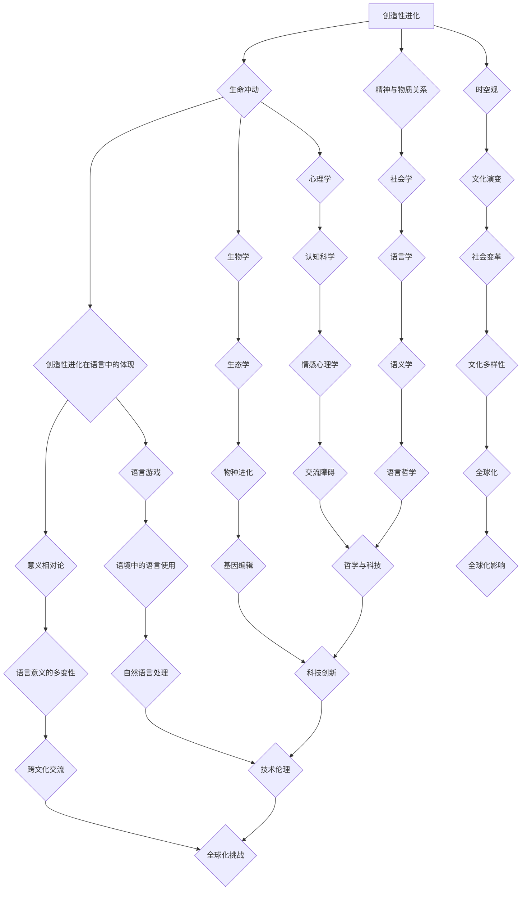

                 

# 《柏格森的创造性进化与维特根斯坦的语言演变观》

## 关键词：创造性进化、语言演变、柏格森、维特根斯坦、哲学、技术领域

## 摘要

本文探讨了法国哲学家柏格森的创造性进化理论与英国哲学家维特根斯坦的语言演变观，通过对二者哲学思想的深入分析，揭示了它们在科技领域中的应用潜力和启示。柏格森的创造性进化强调生命力的独特性和发展的内在动力，而维特根斯坦的语言演变则关注语言的本质与意义。本文将阐述二者的核心概念，探讨它们在现代科技，尤其是计算机科学和人工智能领域的影响，并反思其局限性。通过这一研究，旨在为未来的技术发展提供哲学思考的视角。

## 第1章：引言

### 1.1 柏格森与维特根斯坦的哲学背景

#### 1.1.1 柏格森的生平与哲学观点

亨利·柏格森（Henri Bergson）生于1859年，是法国著名的哲学家、社会学家和文学家。他的哲学观点主要集中在生命活力和创造性进化上。柏格森认为，生命是一种不断进化的过程，这种进化不仅仅依赖于外在环境的适应，更重要的是内在生命力的推动。他提出的“生命冲动”（élan vital）概念，强调了生命的内在活力和创造力。

柏格森的主要著作包括《创造的进化》（L'Évolution créatrice）、《形而上学的基本问题》（Les Deux Sources de la Morale et de la Religion）等。他的哲学思想对后来的许多学科，包括生物学、心理学和社会学，都产生了深远的影响。

#### 1.1.2 维特根斯坦的生平与哲学观点

路德维希·维特根斯坦（Ludwig Wittgenstein）生于1889年，是奥地利的哲学家，被认为是20世纪最重要的哲学家之一。他的哲学观点主要集中在语言哲学和逻辑哲学上。维特根斯坦认为，语言的本质在于其使用和意义，而不是其符号本身。他提出了“语言游戏”（language game）的概念，用以描述语言的意义是如何在特定的语境中形成的。

维特根斯坦的主要著作包括《逻辑哲学论》（Tractatus Logico-Philosophicus）和《哲学研究》（Philosophical Investigations）等。他的思想对后来的分析哲学和语言哲学产生了深远的影响。

#### 1.1.3 柏格森与维特根斯坦的哲学联系

虽然柏格森和维特根斯坦的哲学背景和观点有所不同，但他们在创造性进化与语言演变上有着某些共通之处。柏格森的创造性进化强调生命力的独特性和内在动力，而维特根斯坦的语言演变则关注语言的意义和语境。这两者的结合为我们提供了一个新的视角，来理解和解释现代科技领域中的诸多现象。

### 1.2 创造性进化的概念

#### 1.2.1 创造性进化的定义

创造性进化是一种哲学观点，认为生命的进化不仅仅是基于适应环境的变化，更是一个内在创造性过程的结果。柏格森的创造性进化强调生命的内在活力和自我创造的能力。他认为，生命通过不断的创新和变化来适应环境和挑战。

#### 1.2.2 柏格森创造性进化的理论

柏格森的创造性进化理论主要包括以下几个核心概念：

1. **生命冲动**：生命冲动是生命的内在动力，是创造性进化的源泉。
2. **时空观**：柏格森提出了“绵延”（durée）的概念，认为时间不是线性的，而是连续的、流动的。
3. **精神与物质的关系**：柏格森认为，精神是物质的内在本质，是创造性进化的核心。

#### 1.2.3 维特根斯坦与创造性进化的关系

维特根斯坦的语言演变观与柏格森的创造性进化理论在某些方面存在联系。维特根斯坦认为，语言的意义取决于其在特定语境中的使用，这与柏格森的创造性进化强调内在动力和变化有相似之处。同时，维特根斯坦的语言游戏概念也可以被看作是创造性进化在语言领域的一种体现。

## 第2章：柏格森的创造性进化理论

### 2.1 柏格森哲学的核心概念

#### 2.1.1 生命冲动

生命冲动是柏格森哲学中最核心的概念之一。他认为，生命冲动是生命的内在动力，是创造性进化的源泉。生命冲动是一种无法用逻辑或科学来解释的内在活力，它推动生命不断地创新和变化。

#### 2.1.2 时空观

柏格森提出了“绵延”（durée）的概念，与传统的线性时间观念不同。他认为，时间不是线性的，而是连续的、流动的。绵延是生命体验的核心，是创造性进化的体现。

#### 2.1.3 精神与物质的关系

柏格森认为，精神是物质的内在本质，是创造性进化的核心。他反对机械唯物主义，认为物质世界不仅仅是物理现象的集合，而是有内在精神的。

### 2.2 创造性进化的应用

#### 2.2.1 在生物学中的应用

柏格森的创造性进化理论对生物学产生了重要影响。他的观点强调了生命的内在活力和自我创造的能力，这在生物学中表现为物种的进化不仅仅是基于遗传变异和自然选择，更重要的是内在生命力的推动。

#### 2.2.2 在心理学中的应用

柏格森的创造性进化理论也对心理学产生了影响。他的生命冲动和绵延概念为理解人类心理活动提供了新的视角。心理学中的许多现象，如创新思维、情感体验等，都可以被看作是创造性进化的体现。

#### 2.2.3 在社会科学中的应用

柏格森的创造性进化理论在社会科学中也有广泛应用。他的观点为理解社会变革、文化演变提供了哲学基础。在社会学、人类学等领域，创造性进化被视为推动社会发展的核心力量。

### 2.3 柏格森的创造性进化与科学

#### 2.3.1 创造性进化与科学方法论

柏格森的创造性进化理论对科学方法论提出了挑战。传统的科学方法论强调观察和实验，而柏格森则认为，创造性进化无法通过传统的科学方法来完全理解。他认为，科学需要更多的直觉和创造性思维。

#### 2.3.2 创造性进化与科学进步

尽管柏格森对科学方法论提出了挑战，但他的创造性进化理论也为科学进步提供了新的视角。他的观点激发了科学家对创造性思维和直觉的关注，推动了科学研究的深入。

#### 2.3.3 创造性进化与科学哲学

柏格森的创造性进化理论对科学哲学产生了重要影响。他的观点为科学哲学提供了一种新的思考方式，促使科学家和哲学家对科学知识的本质进行重新思考。

## 第3章：维特根斯坦的语言演变观

### 3.1 语言与意义

#### 3.1.1 语言的本质

维特根斯坦认为，语言的本质在于其使用和意义。他反对传统的语言哲学观点，如逻辑实证主义和语言哲学，认为语言不是简单的符号系统，而是在特定语境中使用的工具。

#### 3.1.2 意义的相对性

维特根斯坦提出了“意义相对论”的观点，认为意义的确定取决于语言的使用和语境。他的观点挑战了传统的意义固定论，强调意义的相对性和动态性。

#### 3.1.3 语言游戏的定义

维特根斯坦提出了“语言游戏”的概念，用以描述语言的使用和意义。他认为，语言的使用类似于游戏，不同的语言游戏有不同的规则和目的。

### 3.2 语言演变

#### 3.2.1 语言演变的观点

维特根斯坦认为，语言是不断演变的。他的观点强调了语言的历史性和社会性，认为语言的意义是在社会和文化环境中不断演变和调整的。

#### 3.2.2 维特根斯坦语言演变的理论

维特根斯坦的语言演变理论主要包括以下几个核心概念：

1. **使用论**：他认为，语言的意义取决于其在特定语境中的使用。
2. **语言游戏**：他认为，语言的使用类似于游戏，不同的语言游戏有不同的规则和目的。
3. **意义相对论**：他认为，意义的确定取决于语言的使用和语境。

#### 3.2.3 语言演变的社会影响

维特根斯坦的语言演变观对语言哲学和社会科学产生了深远的影响。他的观点挑战了传统的语言和意义固定论，强调了语言的社会性和历史性。

### 3.3 维特根斯坦的语言演变与哲学

#### 3.3.1 语言演变与维特根斯坦的哲学体系

维特根斯坦的语言演变观是其哲学体系的重要组成部分。他的哲学思想从早期的逻辑哲学到后期的语言哲学，都体现了对语言和意义的深入探讨。

#### 3.3.2 语言演变与哲学问题

维特根斯坦的语言演变观引发了哲学界的许多争论。他的观点挑战了传统的语言哲学观点，如逻辑实证主义和语言哲学，为哲学研究提供了新的视角。

#### 3.3.3 语言演变与哲学反思

维特根斯坦的语言演变观促使哲学家对语言的本质和意义进行反思。他的观点激发了哲学家对语言、认知和社会现象的深入探讨。

## 第4章：柏格森与维特根斯坦的对话

### 4.1 哲学争论

#### 4.1.1 创造性进化与语言演变的关系

柏格森的创造性进化与维特根斯坦的语言演变观在某些方面存在矛盾。柏格森强调生命的内在活力和创造性进化，而维特根斯坦则强调语言的使用和意义。这两者的关系引发了哲学界的广泛讨论。

#### 4.1.2 生命冲动与语言游戏

柏格森的生命冲动与维特根斯坦的语言游戏概念也存在一定的冲突。柏格森的生命冲动是一种无法用语言描述的内在动力，而维特根斯坦的语言游戏则强调语言的使用和规则。这两者的对比为哲学研究提供了新的思路。

#### 4.1.3 实践与理论的冲突

柏格森的创造性进化强调实践的重要性，而维特根斯坦的语言演变则强调理论的局限性。这两者的冲突在哲学研究中引起了广泛的讨论，为哲学理论的构建和实践应用提供了新的视角。

### 4.2 哲学互补

#### 4.2.1 柏格森对维特根斯坦的启示

柏格森的创造性进化理论对维特根斯坦的语言演变观提供了启示。柏格森的生命冲动和绵延概念为理解语言的使用和意义提供了新的视角，有助于我们更好地理解语言的动态性和社会性。

#### 4.2.2 维特根斯坦对柏格森的回应

维特根斯坦对柏格森的创造性进化理论进行了回应。他强调语言的使用和意义，认为语言是一种工具，用于描述和沟通。维特根斯坦的观点挑战了柏格森的生命冲动概念，促使哲学家对语言的本质和作用进行深入探讨。

#### 4.2.3 哲学思想的融合

柏格森与维特根斯坦的哲学思想在某些方面具有互补性。他们的观点为我们提供了理解生命、语言和意义的多元视角，有助于我们更全面地探讨哲学问题。

## 第5章：创造性进化与语言演变的应用

### 5.1 在社会科学中的应用

#### 5.1.1 社会学

柏格森的创造性进化理论为社会学提供了新的视角。他的观点强调了社会变革和文化演进的内在动力，有助于我们理解社会现象的本质。

#### 5.1.2 心理学

维特根斯坦的语言演变观对心理学产生了重要影响。他的观点挑战了传统的心理学观点，强调语言在认知和情感体验中的核心作用。

#### 5.1.3 教育学

柏格森和维特根斯坦的哲学思想在教育领域也有广泛应用。他们的观点为我们提供了理解教育本质和教学方法的新的视角。

### 5.2 在自然科学中的应用

#### 5.2.1 生物学

柏格森的创造性进化理论对生物学产生了重要影响。他的观点为理解物种的进化提供了新的视角，有助于我们更好地理解生命现象。

#### 5.2.2 计算机科学

维特根斯坦的语言演变观在计算机科学中也有广泛应用。他的观点为编程语言的设计和使用提供了新的思路，有助于我们更好地理解和应用计算机科学。

#### 5.2.3 人工智能

柏格森和维特根斯坦的哲学思想在人工智能领域也有重要应用。他们的观点为人工智能的发展提供了新的视角，有助于我们更好地理解和设计人工智能系统。

### 5.3 在技术领域中的应用

#### 5.3.1 人工智能的创造性进化

柏格森的创造性进化理论在人工智能领域有广泛应用。他的观点为理解人工智能的创新和进化提供了新的视角，有助于我们更好地设计和实现人工智能系统。

#### 5.3.2 自然语言处理的演变

维特根斯坦的语言演变观在自然语言处理领域有重要应用。他的观点为理解和设计自然语言处理系统提供了新的思路，有助于我们更好地处理和解析语言。

#### 5.3.3 技术发展的哲学反思

柏格森和维特根斯坦的哲学思想为我们提供了技术发展的哲学反思。他们的观点促使我们对技术的本质和影响进行深入思考，有助于我们更好地理解和应用技术。

## 第6章：批判与反思

### 6.1 柏格森创造性进化的局限

#### 6.1.1 对生物学的挑战

柏格森的创造性进化理论在生物学中存在一些争议。他的观点挑战了传统的进化论，提出了一种新的进化模式。然而，这种模式在生物学研究中尚未得到广泛接受，需要更多的实证研究来验证。

#### 6.1.2 对心理学的影响

柏格森的创造性进化理论在心理学中也存在一些争议。他的观点虽然为理解心理现象提供了一种新的视角，但一些心理学家认为，这种观点过于抽象，难以应用于实际的心理研究中。

#### 6.1.3 对社会科学的贡献

柏格森的创造性进化理论在社会科学中也有一定的局限性。他的观点虽然为理解社会现象提供了一种新的视角，但在实际应用中，如何将这种理论应用于具体的社会问题，仍需要进一步探讨。

### 6.2 维特根斯坦语言演变观的局限

#### 6.2.1 对语言本质的争议

维特根斯坦的语言演变观在语言哲学中引发了广泛的争议。他的观点挑战了传统的语言和意义固定论，但一些学者认为，他的理论过于抽象，难以应用于实际的语言研究中。

#### 6.2.2 对哲学方法的批评

维特根斯坦的哲学方法在哲学界也受到了批评。他的语言游戏概念虽然为哲学研究提供了新的视角，但一些哲学家认为，这种方法过于主观，缺乏客观性。

#### 6.2.3 对实际应用的挑战

维特根斯坦的语言演变观在应用中也存在一定的挑战。他的观点虽然为理解语言和意义提供了新的视角，但在实际应用中，如何将这种理论应用于实际的语言学习和使用，仍需要进一步探讨。

### 6.3 综合评价

#### 6.3.1 创造性进化与语言演变的哲学价值

柏格森的创造性进化理论和维特根斯坦的语言演变观在哲学上具有很高的价值。它们为哲学研究提供了新的视角，挑战了传统的哲学观念，为哲学的发展注入了新的活力。

#### 6.3.2 对现代哲学的影响

柏格森和维特根斯坦的哲学思想对现代哲学产生了深远的影响。他们的观点激发了哲学家对语言、意义和知识的深入探讨，推动了哲学研究的多元化。

#### 6.3.3 对未来哲学的展望

柏格森和维特根斯坦的哲学思想为未来哲学的发展提供了新的启示。他们的观点为我们理解现代科技和社会现象提供了新的视角，有助于我们更好地应对未来的哲学挑战。

## 第7章：结论

### 7.1 创造性进化与语言演变的关系

柏格森的创造性进化理论和维特根斯坦的语言演变观之间存在一定的互补和矛盾。他们的观点为我们提供了理解生命、语言和意义的多元视角，有助于我们更全面地探讨哲学问题。

### 7.2 柏格森与维特根斯坦的贡献

柏格森和维特根斯坦在哲学领域做出了重要贡献。他们的观点挑战了传统的哲学观念，为哲学研究注入了新的活力。他们的哲学思想在自然科学、社会科学和技术领域也有广泛应用，为我们理解和应用现代科技提供了新的视角。

### 7.3 对未来哲学的启示

柏格森和维特根斯坦的哲学思想为未来哲学的发展提供了新的启示。他们的观点为我们理解现代科技和社会现象提供了新的视角，有助于我们更好地应对未来的哲学挑战。

## 参考文献

1. 柏格森，《创造性进化论》
2. 维特根斯坦，《逻辑哲学论》
3. 维特根斯坦，《哲学研究》
4. 相关学术期刊和专著

---

### 核心概念与联系

创造性进化与语言演变的关系可以用以下Mermaid流程图表示：

通过这个流程图，我们可以看到创造性进化与语言演变在多个领域和概念中的交叉与融合，这为理解现代科技提供了新的哲学视角。

