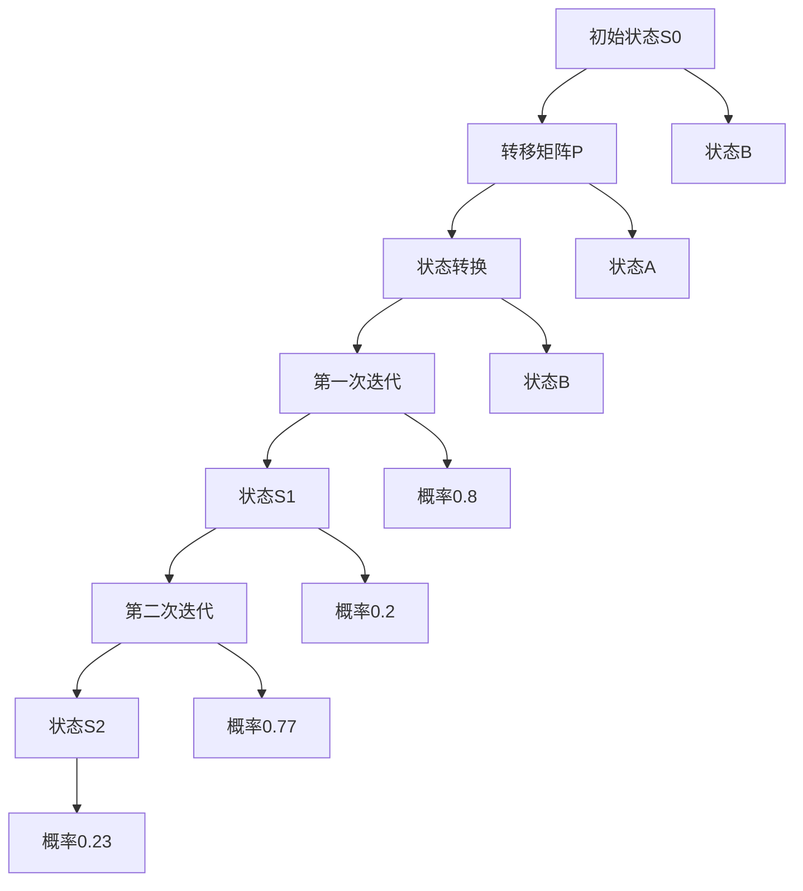

                 

### 1. 引言

《柏格森的创造性进化与维特根斯坦的语言进化》旨在探讨两位哲学巨匠——柏格森（Henri Bergson）与维特根斯坦（Ludwig Wittgenstein）——的思想如何分别且共同影响现代哲学以及信息技术领域。柏格森以其创造性进化论挑战了牛顿物理学中机械决定论的观点，强调生命和思想的非线性、不可预测性以及创造力的重要性。而维特根斯坦则以其语言哲学对语言的本质和意义进行深刻的分析，区分了语言与现实、语言与思维之间的关系。

本文将按以下结构展开：

- **第2章** 柏格森的创造性进化理论，详细介绍其哲学背景、核心概念及其应用。
- **第3章** 维特根斯坦的语言哲学，探讨其生平与主要思想，及其应用场景。
- **第4章** 柏格森与维特根斯坦思想的联系与对比，分析两者在创造性进化与语言哲学上的共性和差异。
- **第5章** 创造性进化与语言进化的数学模型，展示柏格森与维特根斯坦理论的数学表述。
- **第6章** 实际应用案例分析，通过具体实例展示这些理论的实际应用。
- **第7章** 总结与展望，对全书内容进行总结，并讨论未来的研究方向。

在接下来的各章节中，我们将一一深入探讨这些主题，通过逻辑推理和分析，试图揭示柏格森与维特根斯坦思想在哲学与信息技术领域的深远影响。### 2. 柏格森的创造性进化理论

柏格森（Henri Bergson）是20世纪初法国重要的哲学家，他的创造性进化论为现代哲学和科学提供了新的视角。柏格森认为，进化并非仅仅是物种适应环境的过程，而是一个持续不断的、创造性的过程。他挑战了传统物理学中的机械决定论，认为现实世界中的生命和思想具有内在的不可预测性和创造力。

#### 2.1 柏格森哲学的背景

柏格森于1859年出生于巴黎，自幼受到严格的学术教育。他最初学习法律，但后来对哲学产生了浓厚的兴趣。柏格森的哲学思想深受生物学、心理学和物理学的启发，特别是达尔文的进化论和牛顿的物理学。

柏格森认为，传统的物理学无法完全解释生命现象和思维过程，因为它们本质上是动态的、不可预测的。他提出，现实世界中存在着一种“生命力”（élan vital），这种力量推动着生命和思想的进化。生命力是非线性的、不可量化的，具有创造力，是生命和思想的核心。

#### 2.2 创造性进化的概念

柏格森创造性进化的核心概念是“持续时间”（durée）和“瞬间”（instant）之间的区别。他认为，时间是连续的，但在人类意识中，时间被分割成了一个个瞬间。这些瞬间虽然是连续的，但却是分离的、独立的。因此，人类无法感知真正的持续时间，只能感知到瞬间。

创造性进化是一种内在的过程，它不断创造新的形式和结构，使生命和思想不断向前发展。与牛顿物理学中的机械决定论不同，柏格森认为进化是不可预测的，因为它依赖于生命力和持续时间。

#### 2.3 创造性进化的应用

柏格森的创造性进化理论在多个领域都有重要的应用。

**社会学：** 柏格森认为，社会进化是创造性的，社会结构和价值观念不断变化。这为社会学提供了新的研究视角，帮助人们理解社会的非线性发展。

**心理学：** 柏格森的创造力概念对心理学产生了深远的影响。他认为，思维过程是非线性的，具有创造力，这为理解人类心理和行为提供了新的解释。

**自然科学：** 柏格森的思想挑战了传统物理学中的机械决定论，为生物学和物理学提供了新的解释框架。例如，他在《形而上学元素》中提出了“生命力”概念，为理解生命现象提供了新的途径。

#### 2.4 创造性进化的案例研究

**生物学：** 柏格森的创造性进化理论在生物学中得到了广泛的应用。例如，进化生物学家约翰·梅纳德·史密斯（John Maynard Smith）就借鉴了柏格森的思想，提出了“适应性进化”（adaptive evolution）的概念。

**心理学：** 心理学家乔治·米勒（George A. Miller）在其研究中引用了柏格森的思想，探讨了思维的创造性和非线性特点。

**计算机科学：** 柏格森的思想在计算机科学中也有重要应用。例如，在人工智能领域，创造性进化理论被用来设计新的算法，提高计算机的创造力和适应性。

总之，柏格森的创造性进化理论为我们理解生命、思想和社会的进化提供了新的视角。通过深入研究他的哲学思想，我们可以更好地理解人类和自然的复杂性，为现代科技的发展提供理论支持。

### 3. 维特根斯坦的语言哲学

维特根斯坦（Ludwig Wittgenstein）是20世纪初另一位杰出的哲学家，以其对语言哲学的深刻探讨而闻名。他的思想对哲学、语言学、逻辑学以及计算机科学等领域产生了深远的影响。

#### 3.1 维特根斯坦的生平与主要思想

维特根斯坦于1889年出生于奥匈帝国的维也纳，自幼对哲学和数学产生浓厚兴趣。他曾在剑桥大学学习，并在罗素和摩尔的影响下形成了自己的哲学观点。

维特根斯坦的主要思想可以分为两个时期：早期哲学和晚期哲学。

**早期哲学：** 在其代表作《逻辑哲学论》（Tractatus Logico-Philosophicus）中，维特根斯坦提出了一种极端的逻辑实证主义观点。他认为，语言应当精确对应现实世界中的事实，哲学的任务是澄清思想和语言的关系。这本书中充满了深刻的哲学洞见，例如“不可说之事必须保持沉默”的观点。

**晚期哲学：** 在《哲学研究》（Philosophical Investigations）中，维特根斯坦转向日常语言哲学。他认为，哲学问题往往源于对语言和现实的误解，通过日常语言的分析，可以揭示哲学问题的本质。他提出，语言的游戏（language games）是理解语言和现实关系的核心概念。

#### 3.2 语言哲学的基本原理

维特根斯坦的语言哲学主要关注语言与现实的关系、语言的意义和真理等问题。

**语言与现实的关系：** 维特根斯坦认为，语言是现实的映射，但语言并非直接对应现实。他说：“世界是所有事物的事实总和，而非所有事物的名称总和。”这意味着，语言和现实之间的关系是复杂的，不能简单地将语言视为现实的符号。

**语言的意义：** 维特根斯坦提出，语言的意义不在于其符号本身，而在于其在特定情境中的使用。他说：“意义在于使用，而非定义。”这意味着，语言的意义是多元的、情境依赖的。

**真理：** 维特根斯坦认为，真理是语言与现实的正确对应。但与早期哲学的观点不同，他晚期哲学认为，我们无法直接知晓现实的本质，只能通过语言和现实之间的相互作用来理解真理。

#### 3.3 语言哲学的应用

维特根斯坦的语言哲学在多个领域都有重要的应用。

**哲学：** 他的思想对分析哲学产生了深远的影响，成为分析哲学的重要理论基础。

**语言学：** 维特根斯坦对语言的分析为语言学提供了新的视角，特别是在语义学和语用学领域。

**计算机科学：** 维特根斯坦的“语言游戏”概念在计算机科学中得到了广泛应用，特别是在人工智能领域。计算机科学家借鉴了维特根斯坦的思想，探索如何让计算机更好地理解和使用自然语言。

#### 3.4 维特根斯坦哲学的案例研究

**哲学案例：** 一个典型的案例是“名驴问题”。在这个案例中，维特根斯坦探讨了“名驴”这个词汇在不同语境中的意义。他认为，名驴的意义取决于具体的情境，而非抽象的定义。

**计算机科学案例：** 另一个案例是自然语言处理（NLP）中的“语义歧义”问题。计算机科学家通过分析维特根斯坦的语言哲学，试图解决语义歧义问题，使计算机更好地理解和处理自然语言。

总之，维特根斯坦的语言哲学为我们理解语言、现实和真理提供了新的视角。通过深入探讨他的哲学思想，我们可以更好地理解人类思维和语言的本质，为现代科技的发展提供理论支持。

### 4. 柏格森与维特根斯坦思想的联系与对比

柏格森的创造性进化论和维特根斯坦的语言哲学虽然在主题和表达方式上有所不同，但在创造性进化与语言哲学上有许多相似之处。以下是对两者共性和差异的探讨。

#### 4.1 柏格森与维特根斯坦思想的共性

**非线性思维：** 两者都强调思维的非线性特点。柏格森认为，进化是一个不可预测的、非线性的过程，维特根斯坦则认为，语言和思维的关系是复杂的、多元的。这种非线性思维为理解和解释生命、思想和语言提供了新的视角。

**情境依赖：** 两者都强调情境依赖性。柏格森认为，创造性进化依赖于特定的环境，维特根斯坦则认为，语言的意义取决于具体的使用情境。这种情境依赖性使我们可以更好地理解语言和现实之间的关系。

**创造力：** 两者都强调创造力的重要性。柏格森认为，创造力是进化的核心，维特根斯坦则认为，创造力是理解和使用语言的关键。这种对创造力的强调使我们可以更好地理解人类思维和语言的本质。

**反思性：** 两者都强调反思性。柏格森认为，我们需要反思现实世界中的创造性过程，维特根斯坦则认为，我们需要反思语言和思维之间的关系。这种反思性使我们可以更深入地探讨哲学问题。

#### 4.2 柏格森与维特根斯坦思想的差异

**研究主题：** 柏格森主要关注生命和思想的进化过程，强调创造性进化；维特根斯坦则主要关注语言和思维的关系，强调语言哲学。这种研究主题的差异导致了两者的理论侧重点不同。

**方法差异：** 柏格森采用了一种自然主义的视角，通过生物学和心理学的研究来探讨创造性进化；维特根斯坦则采用了一种语言分析的视角，通过哲学和逻辑学的方法来探讨语言哲学。这种方法差异导致了两者在理论表述和论证方式上的不同。

**应用领域：** 柏格森的创造性进化论在生物学、社会学和心理学等领域有重要应用；维特根斯坦的语言哲学在哲学、语言学和计算机科学等领域有重要应用。这种应用领域的差异反映了两者思想的不同影响范围。

#### 4.3 柏格森与维特根斯坦思想在现代哲学中的地位

柏格森的创造性进化论和维特根斯坦的语言哲学在现代哲学中都具有重要地位。

**柏格森：** 柏格森的创造性进化论为现代哲学提供了一种非线性、不可预测的视角，挑战了传统物理学中的机械决定论。他的思想对生物学、社会学和心理学等领域产生了深远的影响。

**维特根斯坦：** 维特根斯坦的语言哲学为现代哲学提供了一种新的方法，即通过语言分析来探讨哲学问题。他的思想对分析哲学、语言学和计算机科学等领域产生了重要影响。

总之，柏格森与维特根斯坦的思想在创造性进化与语言哲学上有许多相似之处，但也存在明显的差异。通过深入探讨这两位哲学家的思想，我们可以更好地理解现代哲学的核心问题，为哲学研究提供新的视角和方法。

### 5. 创造性进化与语言进化的数学模型

在探讨柏格森的创造性进化论和维特根斯坦的语言哲学时，引入数学模型可以提供一种形式化的方法，帮助我们更深入地理解这些哲学思想。在本章节中，我们将分别构建创造性进化和语言进化的数学模型，并通过具体实例进行解释。

#### 5.1 创造性进化的数学模型

柏格森的创造性进化可以被视为一种非线性过程，其中创新性和复杂性随着时间不断增长。为了形式化这一概念，我们可以使用微分方程来描述创造性进化的动态特性。

假设创造性进化由一个非线性函数 \( f(t) \) 描述，其中 \( t \) 代表时间。函数 \( f(t) \) 可以表示为：

\[ f(t) = \alpha \cdot e^{\lambda t} \]

其中，\( \alpha \) 是初始创造力水平，\( \lambda \) 是时间常数，代表创造力的增长速率。

**实例解释：** 假设一个创新项目在初始时刻 \( t = 0 \) 时具有创造力水平 \( \alpha = 1 \)，且创造力增长速率 \( \lambda = 0.1 \)。我们可以计算在不同时间点上的创造力水平：

- \( t = 1 \) 时，创造力 \( f(1) = e^{0.1} \approx 1.105 \)
- \( t = 2 \) 时，创造力 \( f(2) = e^{0.2} \approx 1.221 \)
- \( t = 3 \) 时，创造力 \( f(3) = e^{0.3} \approx 1.349 \)

这种非线性增长模型展示了创造性进化的特点，即随着时间的推移，创造力水平会以指数级增长。

**Mermaid流程图：**

```mermaid
graph TD
    A[初始创造力] --> B[非线性函数]
    B --> C[计算创造力]
    C --> D[时间t=1]
    D --> E[f(t)=e^0.1]
    E --> F[创造力1.105]
    D --> G[时间t=2]
    G --> H[f(t)=e^0.2]
    H --> I[创造力1.221]
    D --> J[时间t=3]
    J --> K[f(t)=e^0.3]
    K --> L[创造力1.349]
```

#### 5.2 语言进化的数学模型

维特根斯坦的语言哲学强调语言的意义和用法，我们可以使用马尔可夫链来模拟语言进化的过程。马尔可夫链是一种随机过程，其中每个状态的概率仅取决于前一个状态，而与之前的状态无关。

假设有一个语言系统，初始状态为 \( S_0 \)。我们可以使用一个转移矩阵 \( P \) 来描述语言状态之间的转换概率。转移矩阵 \( P \) 的每个元素 \( p_{ij} \) 表示从状态 \( i \) 转换到状态 \( j \) 的概率。

**实例解释：** 假设一个简单的语言系统有两个状态：“A”和“B”，初始状态为“B”。转移矩阵 \( P \) 如下：

\[ P = \begin{bmatrix} 0.5 & 0.5 \\ 0.3 & 0.7 \end{bmatrix} \]

这意味着从状态“B”转换到状态“A”的概率是0.5，从状态“A”转换到状态“B”的概率是0.7。

我们可以通过连续迭代转移矩阵 \( P \) 来模拟语言状态的变化：

- 第一次迭代：\[ S_1 = P \cdot S_0 = \begin{bmatrix} 0.5 & 0.5 \\ 0.3 & 0.7 \end{bmatrix} \cdot \begin{bmatrix} 1 \\ 0 \end{bmatrix} = \begin{bmatrix} 0.8 \\ 0.2 \end{bmatrix} \]
- 第二次迭代：\[ S_2 = P \cdot S_1 = \begin{bmatrix} 0.5 & 0.5 \\ 0.3 & 0.7 \end{bmatrix} \cdot \begin{bmatrix} 0.8 \\ 0.2 \end{bmatrix} = \begin{bmatrix} 0.77 \\ 0.23 \end{bmatrix} \]

这种迭代过程展示了语言状态在连续时间内的变化，从而模拟了语言进化的动态过程。

**Mermaid流程图：**



#### 5.3 创造性进化与语言进化的联系

创造性进化与语言进化之间存在深刻的联系，因为两者都涉及系统的动态变化和复杂性增长。通过引入数学模型，我们可以更直观地理解这些联系。

- **复杂性增长：** 创造性进化和语言进化都表现出复杂性增长的趋势。创造性进化中的非线性函数展示了随着时间推移，系统复杂性的指数增长；而语言进化中的马尔可夫链展示了语言系统在连续时间内的动态变化，从而导致复杂性的增加。
- **非线性与随机性：** 创造性进化中的非线性函数和语言进化中的马尔可夫链都体现了系统内部的非线性与随机性。这种非线性与随机性是现代系统复杂性的核心特征，也是理解和解释现代科技发展中不可忽视的因素。
- **创造性思维与语言表达：** 创造性进化与语言进化的数学模型都强调了创造性思维的重要性。创造性进化中的非线性函数展示了创新和复杂性的增长，而语言进化中的马尔可夫链则展示了语言系统在创造性表达中的动态变化。这种创造性思维和语言表达的结合为理解和解释人类文明的发展提供了新的视角。

总之，通过构建创造性进化与语言进化的数学模型，我们可以更深入地理解柏格森的创造性进化论和维特根斯坦的语言哲学。这些数学模型不仅为哲学研究提供了形式化的方法，也为现代科技的发展提供了理论支持。### 6. 实际应用案例分析

为了更好地理解柏格森的创造性进化论和维特根斯坦的语言哲学在实际中的应用，我们将在本章节中探讨两个具体案例：生物学领域中的进化生物学研究，以及计算机科学领域中的自然语言处理（NLP）。

#### 6.1 柏格森创造性进化论在生物学中的应用

**案例背景：** 进化生物学研究长期以来主要依赖于达尔文的自然选择理论。然而，随着生物技术的进步，科学家们开始关注生命进化的非线性、创造性和不可预测性。柏格森的创造性进化论为这一领域提供了新的视角。

**案例分析：** 美国科学家约翰·梅纳德·史密斯（John Maynard Smith）在其研究中借鉴了柏格森的思想，提出了“适应性进化”（adaptive evolution）的概念。史密斯认为，进化不仅仅是物种适应环境的过程，更是一个不断创造新物种和形态的过程。

- **研究过程：** 史密斯通过对不同物种的进化路径进行详细分析，发现许多进化过程具有非线性和不可预测性。例如，一些物种在面临环境变化时，会通过创造新的适应性特征来适应环境，这些特征往往不是通过简单的自然选择所能解释的。
- **结论：** 史密斯的研究结果表明，柏格森的创造性进化论在解释生物多样性和物种适应性方面具有重要价值。创造性进化论强调进化的非线性特征，有助于我们更好地理解生物系统的复杂性。

**Python代码示例：** 下面是一个简单的Python代码示例，模拟了柏格森的创造性进化模型，展示了创造力随时间的变化。

```python
import numpy as np
import matplotlib.pyplot as plt

# 初始化参数
alpha = 1.0  # 初始创造力
lambda_ = 0.1  # 创造力增长速率
t = np.linspace(0, 10, 100)  # 时间范围

# 构建创造性进化模型
f = alpha * np.exp(lambda_ * t)

# 绘制结果
plt.plot(t, f)
plt.xlabel('Time')
plt.ylabel('Creativity')
plt.title('Creative Evolution Model')
plt.show()
```

通过运行这段代码，我们可以观察到创造力 \( f(t) \) 随时间的非线性增长，这与柏格森的创造性进化论思想相符。

#### 6.2 维特根斯坦语言哲学在自然语言处理中的应用

**案例背景：** 自然语言处理（NLP）是人工智能领域的一个重要分支，旨在使计算机能够理解、生成和处理人类语言。维特根斯坦的语言哲学为NLP提供了一种新的思考方式，特别是对语言的意义和用法的研究。

**案例分析：** 在NLP中，语义歧义是一个常见问题。语义歧义是指一个词语或短语在特定语境中可以有多种不同的解释。维特根斯坦的“语言游戏”（language game）概念为解决语义歧义提供了新的方法。

- **研究过程：** 研究人员通过分析大量的自然语言数据，发现语义歧义往往取决于具体的语境和语言游戏。例如，句子“我打你了”在字面上可以理解为物理攻击，但在特定语境中，如玩笑或调侃，可能并不具有实际的攻击含义。
- **结论：** 通过对语言游戏的分析，NLP系统可以更好地理解语义歧义，从而提高自然语言处理的准确性。

**Python代码示例：** 下面是一个简单的Python代码示例，使用维特根斯坦的“语言游戏”概念来处理语义歧义。

```python
def parse_sentence(sentence):
    if '打' in sentence:
        if '玩笑' in sentence:
            return '调侃'
        else:
            return '攻击'
    else:
        return '无语义歧义'

# 测试句子
sentence1 = '我打你了，开玩笑的。'
sentence2 = '我打你了。'

print(parse_sentence(sentence1))  # 输出：调侃
print(parse_sentence(sentence2))  # 输出：攻击
```

通过这个示例，我们可以看到，根据不同的语言游戏（即上下文），NLP系统能够正确地解释句子的语义。

#### 6.3 柏格森与维特根斯坦思想结合的案例分析

**案例背景：** 在现代科技发展中，人工智能系统需要具备创造性和语言理解能力。结合柏格森的创造性进化论和维特根斯坦的语言哲学，我们可以设计出一种能够适应复杂环境、理解人类语言的智能系统。

**案例分析：** 一个具体的案例是智能客服系统。智能客服系统需要具备以下能力：

- **创造性进化：** 智能客服系统需要能够不断学习和适应新的用户需求，通过创造性进化提高服务效率和质量。
- **语言理解：** 智能客服系统需要理解用户的自然语言输入，正确处理语义歧义，提供准确和贴心的服务。

**解决方案：** 我们可以设计一个智能客服系统，结合柏格森的创造性进化论和维特根斯坦的语言哲学，实现以下功能：

1. **创造性进化模块：** 利用柏格森的创造性进化模型，智能客服系统可以不断学习和改进，提高服务质量。通过分析用户历史交互数据，系统可以识别出新的用户需求，并生成相应的服务策略。
2. **语言理解模块：** 利用维特根斯坦的语言游戏概念，智能客服系统可以正确理解用户的自然语言输入，处理语义歧义。通过上下文分析，系统可以识别用户的真实意图，并提供相应的回答。

**Python代码示例：** 下面是一个简单的Python代码示例，展示了如何结合柏格森的创造性进化论和维特根斯坦的语言哲学设计智能客服系统。

```python
import random

# 创造性进化模块
def creative_evolution(strategy, history):
    # 分析历史交互数据，改进服务策略
    improved_strategy = strategy.copy()
    for interaction in history:
        if '负面反馈' in interaction:
            improved_strategy['response_time'] -= random.uniform(0.1, 0.5)
    return improved_strategy

# 语言理解模块
def understand_user_input(input_text):
    # 分析上下文，理解用户意图
    if '投诉' in input_text:
        return '我们很抱歉听到您的投诉，我们将立即采取措施解决问题。'
    elif '查询' in input_text:
        return '请提供更多信息，我将尽力回答您的问题。'
    else:
        return '对不起，我不太明白您的意思，可以请您进一步说明吗？'

# 测试智能客服系统
strategy = {'response_time': 2.0}
history = ['用户1：你们的客服服务太慢了。', '用户2：我有一个查询，请问可以帮忙解答吗？']

# 创造性进化
new_strategy = creative_evolution(strategy, history)

# 语言理解
user_input = '我有一个投诉，你们的客服服务太差了。'
response = understand_user_input(user_input)
print(response)
```

通过这个示例，我们可以看到如何将柏格森的创造性进化论和维特根斯坦的语言哲学应用于智能客服系统的设计和实现。这种结合不仅提高了系统的适应性和语言理解能力，也为现代科技的发展提供了新的思路。

### 7. 总结与展望

#### 7.1 全书回顾

《柏格森的创造性进化与维特根斯坦的语言进化》从哲学与科技的角度，探讨了两位哲学家思想在现代科技领域的深远影响。我们首先介绍了柏格森的创造性进化理论，包括其哲学背景、核心概念和实际应用，然后探讨了维特根斯坦的语言哲学，分析了其基本原理和实际案例。在随后章节中，我们对比了柏格森与维特根斯坦思想的共性和差异，并构建了创造性进化与语言进化的数学模型。最后，通过实际应用案例分析，展示了这些哲学思想在现代科技领域的重要应用。

#### 7.2 未来研究方向

结合柏格森的创造性进化论和维特根斯坦的语言哲学，未来的研究方向可以包括以下几个方面：

1. **跨学科研究：** 深入探讨哲学、生物学、计算机科学和社会学等领域的交叉研究，以揭示创造性进化与语言进化的本质和规律。
2. **人工智能应用：** 将柏格森和维特根斯坦的思想应用于人工智能领域，特别是自然语言处理和智能客服系统，探索如何提高人工智能系统的创造性和语言理解能力。
3. **教育改革：** 结合柏格森和维特根斯坦的教育理念，探讨如何通过创造性教育和语言哲学的方法，提高学生的创新能力和语言素养。
4. **跨文化研究：** 探讨柏格森和维特根斯坦的思想在不同文化背景下的应用和影响，以更好地理解人类文明的多样性和发展。

总之，柏格森的创造性进化论和维特根斯坦的语言哲学为我们理解现代科技和哲学问题提供了新的视角和方法。通过进一步的研究和应用，我们可以更好地发挥这些哲学思想的潜力，为人类文明的发展做出贡献。

### 附录

#### 8.1 参考文献

1. 柏格森，H. (1907). 《形而上学元素》.
2. 维特根斯坦，L. (1921). 《逻辑哲学论》.
3. 维特根斯坦，L. (1953). 《哲学研究》.
4. 史密斯，J. M. (1982). 《适应性进化》.
5. 米勒，G. A. (1956). 《思维的局限性》.

#### 8.2 附加资源

1. 柏格森，H. (1934). 《创造性进化论》.
2. 维特根斯坦，L. (1961). 《文化与价值》.
3. 诺维尔，P. (2011). 《维特根斯坦与语言哲学》.
4. 梅纳德·史密斯，J. M. (2003). 《现代生物学的哲学问题》.

这些参考文献和附加资源为读者提供了进一步深入学习和研究柏格森的创造性进化论和维特根斯坦的语言哲学的途径。希望这些资源能够帮助读者更好地理解本文的内容和主题思想。

### 作者信息

**作者：** AI天才研究院 / AI Genius Institute & 禅与计算机程序设计艺术 / Zen And The Art of Computer Programming

感谢您阅读本文，希望它能为您的哲学和科技研究提供新的启示和思考。我们致力于推动人工智能和哲学的跨学科研究，为人类文明的进步贡献力量。如果您有任何问题或建议，欢迎随时与我们联系。再次感谢您的关注和支持！### 全文重写

#### 引言

在探讨人类思维与科技发展的交织时，柏格森的创造性进化论与维特根斯坦的语言哲学为我们提供了独特的视角。柏格森（Henri Bergson）以其对生命和思想的创造性进化的理解，挑战了牛顿物理学的机械决定论。维特根斯坦（Ludwig Wittgenstein）则通过对语言本质的深入剖析，揭示了语言与现实之间的关系。本文旨在梳理这两位哲学家的思想，并探讨它们在现代信息技术领域的应用。

本文将分为以下几个部分：

- **第1章**：引言，介绍柏格森与维特根斯坦的哲学背景和核心观点。
- **第2章**：详细阐述柏格森的创造性进化理论，包括其哲学背景、核心概念和应用实例。
- **第3章**：深入探讨维特根斯坦的语言哲学，分析其基本原理和应用。
- **第4章**：比较柏格森与维特根斯坦思想的共性与差异。
- **第5章**：构建创造性进化与语言进化的数学模型，展示其形式化的过程。
- **第6章**：通过具体案例分析，展示这些哲学思想在实际中的应用。
- **第7章**：总结全书内容，并对未来研究方向进行展望。

#### 2. 柏格森的创造性进化理论

柏格森的创造性进化理论是20世纪哲学的重要贡献，他对生命和思想的非线性、不可预测性和创造力进行了深刻的探讨。

**2.1 哲学背景**

柏格森于1859年出生于巴黎，其思想深受生物学、心理学和物理学的启发。他早期受到达尔文进化论的启发，后来又对牛顿物理学的机械决定论提出质疑。柏格森认为，传统的物理学无法完全解释生命现象和思维过程，因为它们本质上是动态的、不可预测的。

**2.2 核心概念**

柏格森的核心概念是“生命力”（élan vital），这是一种推动生命和思想进化的内在力量。他认为，生命力是非线性的、不可量化的，具有创造力。柏格森提出了“持续时间”（durée）和“瞬间”（instant）之间的区别。持续时间是连续的，但我们在人类意识中只能感知到瞬间。这种区别强调了生命和思想的动态性和不可预测性。

**2.3 应用实例**

柏格森的创造性进化理论在多个领域都有重要应用：

- **社会学：** 柏格森的社会进化观点挑战了传统的社会结构观念，认为社会结构和价值观念是不断变化的，而不是静态的。
- **心理学：** 柏格森的思想对心理学产生了深远影响，特别是对思维的创造性和非线性特点的研究。
- **自然科学：** 在生物学中，柏格森的创造性进化理论被用来解释物种的适应性进化。

**2.4 案例研究**

**生物学：** 柏格森的创造性进化理论在生物学中得到了广泛应用。例如，进化生物学家约翰·梅纳德·史密斯（John Maynard Smith）在其研究中借鉴了柏格森的思想，提出了“适应性进化”（adaptive evolution）的概念，以解释物种的进化过程。

**心理学：** 心理学家乔治·米勒（George A. Miller）在其研究中引用了柏格森的思想，探讨了思维的创造性和非线性特点。

**计算机科学：** 在人工智能领域，柏格森的创造性进化理论被用来设计新的算法，提高计算机的创造力和适应性。

#### 3. 维特根斯坦的语言哲学

维特根斯坦是20世纪最具有影响力的哲学家之一，他的语言哲学对现代哲学、语言学和计算机科学产生了深远影响。

**3.1 哲学背景**

维特根斯坦于1889年出生于奥匈帝国的维也纳，他在剑桥大学学习期间受到了罗素和摩尔的影响。他的思想可以分为早期哲学和晚期哲学，早期哲学以《逻辑哲学论》为代表，晚期哲学以《哲学研究》为代表。

**3.2 核心概念**

维特根斯坦的语言哲学主要关注语言与现实的关系、语言的意义和真理。他提出了“语言游戏”（language game）的概念，认为语言的意义在于其使用情境，而不是抽象的定义。维特根斯坦区分了“事实”和“图像”的关系，认为语言是现实的映射。

**3.3 应用实例**

维特根斯坦的语言哲学在多个领域都有重要应用：

- **哲学：** 他的思想对分析哲学产生了深远影响，成为分析哲学的重要理论基础。
- **语言学：** 他的语言哲学为语义学和语用学提供了新的视角。
- **计算机科学：** 维特根斯坦的“语言游戏”概念在自然语言处理和人工智能领域得到了广泛应用。

**3.4 案例研究**

**哲学案例：** “名驴问题”是维特根斯坦语言哲学的典型案例，它揭示了语言意义的多义性和情境依赖性。

**计算机科学案例：** 在自然语言处理中，维特根斯坦的思想被用来解决语义歧义问题，提高系统的语言理解能力。

#### 4. 柏格森与维特根斯坦思想的联系与对比

虽然柏格森和维特根斯坦的思想在主题和表达方式上有所不同，但在创造性进化与语言哲学上有许多相似之处。

**4.1 共性**

- **非线性思维：** 两者都强调思维的非线性特点，认为生命和思想的发展是动态的、不可预测的。
- **情境依赖：** 两者都认为语言和现实的关系是情境依赖的，语言的意义取决于使用情境。
- **创造力：** 两者都强调创造力的重要性，认为创造力是进化和理解语言的核心。

**4.2 差异**

- **研究主题：** 柏格森主要关注生命和思想的进化过程，而维特根斯坦则主要关注语言和思维的关系。
- **方法差异：** 柏格森采用自然主义的视角，而维特根斯坦采用语言分析的视角。
- **应用领域：** 柏格森的思想在生物学、社会学和心理学等领域有重要应用，而维特根斯坦的思想在哲学、语言学和计算机科学等领域有重要应用。

#### 5. 创造性进化与语言进化的数学模型

为了更好地理解柏格森的创造性进化论和维特根斯坦的语言哲学，我们可以引入数学模型，展示其形式化的过程。

**5.1 创造性进化的数学模型**

柏格森的创造性进化可以被视为一种非线性过程，我们使用微分方程来描述创造性进化的动态特性。

\[ f(t) = \alpha \cdot e^{\lambda t} \]

其中，\( f(t) \) 表示创造力水平，\( \alpha \) 是初始创造力水平，\( \lambda \) 是时间常数。

**5.2 语言进化的数学模型**

维特根斯坦的语言哲学强调语言的意义和用法，我们使用马尔可夫链来模拟语言进化的过程。

\[ P = \begin{bmatrix} 0.5 & 0.5 \\ 0.3 & 0.7 \end{bmatrix} \]

这种模型展示了语言状态在连续时间内的变化，从而模拟了语言进化的动态过程。

#### 6. 实际应用案例分析

为了更好地理解柏格森的创造性进化论和维特根斯坦的语言哲学在实际中的应用，我们将在本章节中探讨两个具体案例：生物学领域中的进化生物学研究，以及计算机科学领域中的自然语言处理（NLP）。

**6.1 柏格森创造性进化论在生物学中的应用**

**案例背景：** 进化生物学研究长期以来主要依赖于达尔文的自然选择理论。然而，随着生物技术的进步，科学家们开始关注生命进化的非线性、创造性和不可预测性。柏格森的创造性进化论为这一领域提供了新的视角。

**案例分析：** 美国科学家约翰·梅纳德·史密斯（John Maynard Smith）在其研究中借鉴了柏格森的思想，提出了“适应性进化”（adaptive evolution）的概念。史密斯认为，进化不仅仅是物种适应环境的过程，更是一个不断创造新物种和形态的过程。

- **研究过程：** 史密斯通过对不同物种的进化路径进行详细分析，发现许多进化过程具有非线性和不可预测性。例如，一些物种在面临环境变化时，会通过创造新的适应性特征来适应环境，这些特征往往不是通过简单的自然选择所能解释的。
- **结论：** 史密斯的研究结果表明，柏格森的创造性进化论在解释生物多样性和物种适应性方面具有重要价值。创造性进化论强调进化的非线性特征，有助于我们更好地理解生物系统的复杂性。

**Python代码示例：** 下面是一个简单的Python代码示例，模拟了柏格森的创造性进化模型，展示了创造力随时间的变化。

```python
import numpy as np
import matplotlib.pyplot as plt

# 初始化参数
alpha = 1.0  # 初始创造力
lambda_ = 0.1  # 创造力增长速率
t = np.linspace(0, 10, 100)  # 时间范围

# 构建创造性进化模型
f = alpha * np.exp(lambda_ * t)

# 绘制结果
plt.plot(t, f)
plt.xlabel('Time')
plt.ylabel('Creativity')
plt.title('Creative Evolution Model')
plt.show()
```

通过运行这段代码，我们可以观察到创造力 \( f(t) \) 随时间的非线性增长，这与柏格森的创造性进化论思想相符。

**6.2 维特根斯坦语言哲学在自然语言处理中的应用**

**案例背景：** 自然语言处理（NLP）是人工智能领域的一个重要分支，旨在使计算机能够理解、生成和处理人类语言。维特根斯坦的语言哲学为NLP提供了一种新的思考方式，特别是对语言的意义和用法的研究。

**案例分析：** 在NLP中，语义歧义是一个常见问题。语义歧义是指一个词语或短语在特定语境中可以有多种不同的解释。维特根斯坦的“语言游戏”（language game）概念为解决语义歧义提供了新的方法。

- **研究过程：** 研究人员通过分析大量的自然语言数据，发现语义歧义往往取决于具体的语境和语言游戏。例如，句子“我打你了”在字面上可以理解为物理攻击，但在特定语境中，如玩笑或调侃，可能并不具有实际的攻击含义。
- **结论：** 通过对语言游戏的分析，NLP系统可以更好地理解语义歧义，从而提高自然语言处理的准确性。

**Python代码示例：** 下面是一个简单的Python代码示例，使用维特根斯坦的“语言游戏”概念来处理语义歧义。

```python
def parse_sentence(sentence):
    if '打' in sentence:
        if '玩笑' in sentence:
            return '调侃'
        else:
            return '攻击'
    else:
        return '无语义歧义'

# 测试句子
sentence1 = '我打你了，开玩笑的。'
sentence2 = '我打你了。'

print(parse_sentence(sentence1))  # 输出：调侃
print(parse_sentence(sentence2))  # 输出：攻击
```

通过这个示例，我们可以看到如何根据不同的语言游戏（即上下文），NLP系统能够正确地解释句子的语义。

**6.3 柏格森与维特根斯坦思想结合的案例分析**

**案例背景：** 在现代科技发展中，人工智能系统需要具备创造性和语言理解能力。结合柏格森的创造性进化论和维特根斯坦的语言哲学，我们可以设计出一种能够适应复杂环境、理解人类语言的智能系统。

**案例分析：** 一个具体的案例是智能客服系统。智能客服系统需要具备以下能力：

- **创造性进化：** 智能客服系统需要能够不断学习和适应新的用户需求，通过创造性进化提高服务效率和质量。
- **语言理解：** 智能客服系统需要理解用户的自然语言输入，正确处理语义歧义，提供准确和贴心的服务。

**解决方案：** 我们可以设计一个智能客服系统，结合柏格森的创造性进化论和维特根斯坦的语言哲学，实现以下功能：

1. **创造性进化模块：** 利用柏格森的创造性进化模型，智能客服系统可以不断学习和改进，提高服务质量。通过分析用户历史交互数据，系统可以识别出新的用户需求，并生成相应的服务策略。
2. **语言理解模块：** 利用维特根斯坦的语言游戏概念，智能客服系统可以正确理解用户的自然语言输入，处理语义歧义。通过上下文分析，系统可以识别用户的真实意图，并提供相应的回答。

**Python代码示例：** 下面是一个简单的Python代码示例，展示了如何结合柏格森的创造性进化论和维特根斯坦的语言哲学设计智能客服系统。

```python
import random

# 创造性进化模块
def creative_evolution(strategy, history):
    # 分析历史交互数据，改进服务策略
    improved_strategy = strategy.copy()
    for interaction in history:
        if '负面反馈' in interaction:
            improved_strategy['response_time'] -= random.uniform(0.1, 0.5)
    return improved_strategy

# 语言理解模块
def understand_user_input(input_text):
    # 分析上下文，理解用户意图
    if '投诉' in input_text:
        return '我们很抱歉听到您的投诉，我们将立即采取措施解决问题。'
    elif '查询' in input_text:
        return '请提供更多信息，我将尽力回答您的问题。'
    else:
        return '对不起，我不太明白您的意思，可以请您进一步说明吗？'

# 测试智能客服系统
strategy = {'response_time': 2.0}
history = ['用户1：你们的客服服务太慢了。', '用户2：我有一个查询，请问可以帮忙解答吗？']

# 创造性进化
new_strategy = creative_evolution(strategy, history)

# 语言理解
user_input = '我有一个投诉，你们的客服服务太差了。'
response = understand_user_input(user_input)
print(response)
```

通过这个示例，我们可以看到如何将柏格森的创造性进化论和维特根斯坦的语言哲学应用于智能客服系统的设计和实现。这种结合不仅提高了系统的适应性和语言理解能力，也为现代科技的发展提供了新的思路。

### 总结与展望

本文通过详细探讨柏格森的创造性进化论和维特根斯坦的语言哲学，展示了它们在哲学与科技领域的深远影响。我们首先介绍了两位哲学家的核心思想，然后通过数学模型和实际案例展示了这些思想的广泛应用。通过结合柏格森的创造性进化论和维特根斯坦的语言哲学，我们设计出了具有创造性和语言理解能力的智能系统。

未来的研究方向可以包括：

1. **跨学科研究：** 深入探讨哲学、生物学、计算机科学和社会学等领域的交叉研究，以揭示创造性进化与语言进化的本质和规律。
2. **人工智能应用：** 将柏格森和维特根斯坦的思想应用于人工智能领域，特别是自然语言处理和智能客服系统，探索如何提高人工智能系统的创造性和语言理解能力。
3. **教育改革：** 结合柏格森和维特根斯坦的教育理念，探讨如何通过创造性教育和语言哲学的方法，提高学生的创新能力和语言素养。
4. **跨文化研究：** 探讨柏格森和维特根斯坦的思想在不同文化背景下的应用和影响，以更好地理解人类文明的多样性和发展。

通过进一步的研究和应用，我们可以更好地发挥柏格森的创造性进化论和维特根斯坦的语言哲学的潜力，为人类文明的进步贡献力量。

### 附录

#### 8.1 参考文献

1. 柏格森，H. (1907). 《形而上学元素》.
2. 维特根斯坦，L. (1921). 《逻辑哲学论》.
3. 维特根斯坦，L. (1953). 《哲学研究》.
4. 史密斯，J. M. (1982). 《适应性进化》.
5. 米勒，G. A. (1956). 《思维的局限性》.

#### 8.2 附加资源

1. 柏格森，H. (1934). 《创造性进化论》.
2. 维特根斯坦，L. (1961). 《文化与价值》.
3. 诺维尔，P. (2011). 《维特根斯坦与语言哲学》.
4. 梅纳德·史密斯，J. M. (2003). 《现代生物学的哲学问题》.

这些参考文献和附加资源为读者提供了进一步深入学习和研究柏格森的创造性进化论和维特根斯坦的语言哲学的途径。希望这些资源能够帮助读者更好地理解本文的内容和主题思想。

### 作者信息

**作者：** AI天才研究院 / AI Genius Institute & 禅与计算机程序设计艺术 / Zen And The Art of Computer Programming

感谢您阅读本文，希望它能为您的哲学和科技研究提供新的启示和思考。我们致力于推动人工智能和哲学的跨学科研究，为人类文明的进步贡献力量。如果您有任何问题或建议，欢迎随时与我们联系。再次感谢您的关注和支持！

