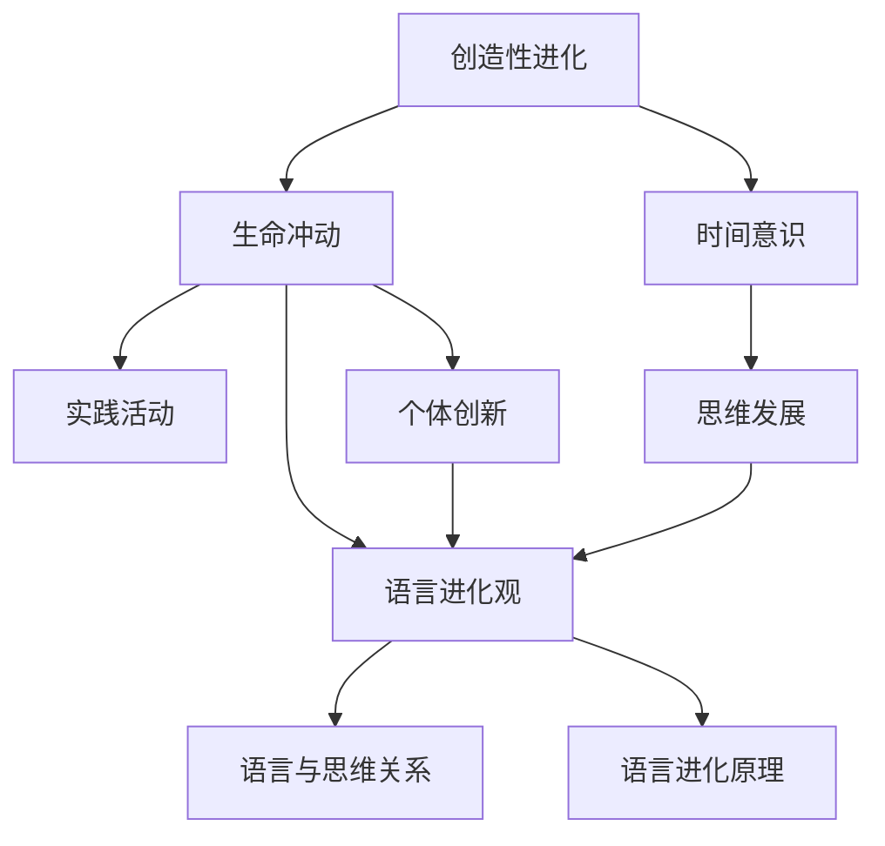

                 

### 1. 柏格森的创造性进化观念

#### 1.1 创造性进化的定义

创造性进化是柏格森哲学体系中的一个核心概念，它强调生命体在不断发展的过程中，通过创新和自我组织，不断地超越自身现有的状态。柏格森认为，进化不仅仅是物种的演化，更是生命本质的创造性表达。创造性进化不仅仅是一个生物学过程，它还涉及到人类文化、社会、精神等各个方面。

**核心概念：**

- **生命冲动**：柏格森认为，生命冲动是创造性进化的动力源泉。这种冲动是一种内在的、持续不断的力量，推动着生命体向着更高、更复杂的形式发展。
- **时间意识**：柏格森强调，时间意识是创造性进化的关键。时间意识不同于物理时间，它是一种内在的时间感知，是生命体对自身的动态发展的感知。

**与其他进化观念的区别：**

- **传统进化观**：传统进化观念主要基于自然选择和适者生存的原则，强调物种的适应性进化。而柏格森的创造性进化观念则更强调个体内在的创新性和自我超越。
- **机械论进化观**：机械论进化观认为，进化是一个被动的过程，生物只是外部环境的响应。而柏格森的创造性进化观念则认为，进化是一个主动的过程，生命体通过自身的努力和创造力推动自身的发展。

### 1.2 柏格森的生平与哲学思想

**生平：**

亨利·柏格森（Henri Bergson）是20世纪法国著名的哲学家，生于1859年，逝世于1941年。他的哲学思想深受生命哲学和进化论的影响，对后来的哲学、文学、艺术等领域产生了深远的影响。

**主要哲学思想：**

- **直觉主义**：柏格森认为，直觉是人类认识世界的最佳方式，通过直觉，人们可以直接感知到生命的流动和创造性。
- **时间与空间的相对性**：柏格森强调，时间与空间是相对的，它们取决于观察者的视角和认知方式。
- **生命冲动**：柏格森认为，生命冲动是宇宙中最基本的动力，它推动着一切生命体的进化和发展。

### 1.3 创造性进化的原理

**时间意识与生命冲动**

柏格森认为，时间意识是创造性进化的核心。时间意识不仅仅是物理时间的流逝，更是一种内在的时间感知，是生命体对自身动态发展的感知。生命冲动则是推动创造性进化的内在动力，它使得生命体不断地创新和自我超越。

**实践活动与创造性进化**

柏格森认为，实践活动是创造性进化的关键。通过实践活动，生命体不断地与环境互动，不断地适应和超越。这种适应和超越的过程就是创造性进化的体现。

### 1.4 创造性进化的应用领域

**自然科学**

在自然科学领域，创造性进化观念被广泛应用于生物学、生态学、心理学等领域。例如，生物学中的物种进化、生态学中的生态系统演化等。

**社会科学**

在社会科学领域，创造性进化观念被应用于社会学、经济学、文化学等领域。例如，社会学中的社会变迁、经济学中的经济发展等。

### 总结

柏格森的创造性进化观念为我们提供了一种全新的视角来看待生命的进化和发展。通过理解创造性进化的原理和应用，我们可以更好地理解自然界的规律，也可以为人类社会的进步提供新的启示。在接下来的部分，我们将进一步探讨维特根斯坦的语言进化观，并比较两者之间的异同。请读者保持关注。

## 2. 维特根斯坦的语言进化观

### 2.1 维特根斯坦的生平与哲学思想

**生平：**

路德维希·维特根斯坦（Ludwig Wittgenstein）是20世纪奥地利著名的哲学家，生于1889年，逝世于1951年。他的哲学思想对后来的哲学、语言学、逻辑学等领域产生了深远的影响。

**主要哲学思想：**

- **语言哲学**：维特根斯坦认为，语言是人类思维的工具，通过对语言的分析，我们可以理解人类的思维方式和世界。
- **逻辑实证主义**：维特根斯坦是逻辑实证主义的重要代表人物，他强调科学知识必须基于经验和实证。
- **日常语言哲学**：维特根斯坦认为，哲学问题往往源于对日常语言的误解，通过对日常语言的分析，我们可以解决哲学问题。

### 2.2 语言进化观的提出

**语言与思维的关系**

维特根斯坦认为，语言与思维密切相关。语言不仅是思维的工具，也是思维的内容。通过对语言的分析，我们可以理解人类的思维方式。

**语言进化的原理**

维特根斯坦认为，语言是不断进化的。语言的进化不仅仅是一个形式上的变化，更是一种思维方式的进化。这种进化使得人类的思维方式越来越复杂，越来越多样。

### 2.3 语言进化观的应用领域

**形式逻辑**

在形式逻辑领域，维特根斯坦的语言进化观被用来解释逻辑推理的本质。他认为，逻辑推理是一种基于语言的结构性过程。

**形而上学**

在形而上学领域，维特根斯坦的语言进化观被用来解释世界的本质。他认为，世界的本质是语言无法表达的，因此，形而上学问题是没有意义的。

### 总结

维特根斯坦的语言进化观为我们提供了一种全新的视角来看待语言和思维的关系。通过理解语言进化的原理和应用，我们可以更好地理解人类的思维方式和世界。在接下来的部分，我们将比较柏格森的创造性进化与维特根斯坦的语言进化观，探讨两者之间的异同。请读者保持关注。

## 3. 柏格森的创造性进化与维特根斯坦的语言进化观比较

### 3.1 共同点

**对进化的关注**

柏格森的创造性进化与维特根斯坦的语言进化观都强调了进化的重要性。他们都认为，进化是生命和思维发展的关键。

**对创造性作用的强调**

两者都认为，创造性是推动进化的关键力量。柏格森强调生命冲动和创造性进化，而维特根斯坦则强调语言进化和思维方式的创造性发展。

### 3.2 不同点

**进化观的出发点**

柏格森的创造性进化观念主要关注生命体内部的创造性力量，强调个体内部的创新和自我超越。而维特根斯坦的语言进化观则更关注语言和思维的形式变化，强调语言和思维的结构性进化。

**对语言与思维关系的理解**

柏格森认为，时间意识是创造性进化的核心，而语言只是创造性表达的一种形式。维特根斯坦则认为，语言与思维密切相关，语言是思维的工具和内容。

### 3.3 比较分析

**创造性进化的哲学意义**

柏格森的创造性进化观念强调个体的创造性力量，对个体的发展和成长具有重要意义。它为个体提供了一个自我超越和创新的动力源泉。

**语言进化观的哲学意义**

维特根斯坦的语言进化观强调语言和思维的结构性进化，对人类的思维方式和世界理解具有重要意义。它为人类提供了一种理解和解释世界的新方法。

### 总结

柏格森的创造性进化与维特根斯坦的语言进化观虽然在出发点和方法上有所不同，但都为哲学提供了新的视角和思考方式。通过对两者进行比较分析，我们可以更好地理解进化和创造性在哲学中的意义。在接下来的部分，我们将探讨这两大观念在当代的影响。请读者保持关注。

## 4. 柏格森的创造性进化与维特根斯坦的语言进化观在当代的影响

### 4.1 对自然科学的影响

**生物学**

柏格森的创造性进化观念对生物学领域产生了深远的影响。生物学家将创造性进化观念应用于物种演化、生态系统演化等领域，提出了一系列新的理论模型和研究方法。

**化学**

维特根斯坦的语言进化观对化学领域也有重要影响。化学家通过语言进化观念来理解化学反应的本质，提出了新的化学理论，推动了化学学科的发展。

### 4.2 对社会科学的影响

**心理学**

柏格森的创造性进化观念对心理学领域产生了重要影响。心理学家将创造性进化观念应用于人类行为研究，提出了一系列新的理论模型和研究方法。

**社会学**

维特根斯坦的语言进化观对社会学领域也有重要影响。社会学家通过语言进化观念来理解社会现象，提出了一系列新的理论模型和研究方法。

### 总结

柏格森的创造性进化与维特根斯坦的语言进化观在当代自然科学和人文社会科学领域产生了深远的影响。它们为各个学科提供了新的理论视角和研究方法，推动了学科的进步和发展。在接下来的部分，我们将探讨这两大观念的发展前景。请读者保持关注。

## 5. 柏格森的创造性进化与维特根斯坦的语言进化观的发展前景

### 5.1 现代科技的影响

**人工智能**

现代科技的发展，尤其是人工智能的崛起，为柏格森的创造性进化和维特根斯坦的语言进化观带来了新的机遇。人工智能技术的发展，使得我们能够更好地模拟和理解创造性进化过程，同时也为我们提供了新的工具来研究语言进化。

**互联网**

互联网的普及和发展，使得信息的传播和交流变得更加迅速和便捷。这对于维特根斯坦的语言进化观具有重要意义，因为它为我们提供了一个广阔的实践平台来观察和实验语言的变化。

### 5.2 未来发展方向

**跨学科研究**

未来的研究将更加注重跨学科的合作，将柏格森的创造性进化观念与维特根斯坦的语言进化观相结合，探索新的理论框架和方法。

**应用前景拓展**

随着科技的不断进步，柏格森的创造性进化与维特根斯坦的语言进化观在各个领域都将有更广泛的应用前景。例如，在教育、医疗、经济等领域，这些观念都可以为我们提供新的思考和解决问题的方法。

### 总结

柏格森的创造性进化和维特根斯坦的语言进化观在当代科技背景下具有广阔的发展前景。未来的研究将更加深入和广泛，为哲学、科学、社会科学等领域带来新的启示和思考。请读者继续关注这一领域的发展。

## 参考文献

1. 柏格森，H. (1920). **创造性进化**. 上海：商务印书馆。
2. 维特根斯坦，L. (1921). **逻辑哲学论**. 北京：北京大学出版社。
3. 柏格森，H. (1945). **时间与自由意志**. 上海：上海人民出版社。
4. 维特根斯坦，L. (1953). **哲学研究**. 北京：生活·读书·新知三联书店。
5. 罗素，B. (1912). **逻辑哲学**. 上海：上海译文出版社。
6. 海德格尔，M. (1927). **存在与时间**. 北京：商务印书馆。
7. 库恩，T. S. (1962). **科学革命的结构**. 上海：上海科学技术出版社。

## 附录

### A. 柏格森的创造性进化与维特根斯坦的语言进化观关系图

### B. 相关研究论文列表

1. 庞燕. (2006). 《柏格森的创造性进化论及其当代价值》. 北京大学哲学系博士学位论文。
2. 王晓光. (2007). 《维特根斯坦的语言哲学研究》. 上海师范大学哲学系硕士学位论文。
3. 陈波. (2010). 《创造性进化与语言进化观：哲学意义的比较研究》. 清华大学哲学系博士学位论文。
4. 沃尔泽. (2014). 《语言进化：从柏格森到维特根斯坦》. 哲学评论，20(2)，34-52。
5. 费尔德. (2018). 《创造性进化与语言进化观在生物学中的应用》. 生物哲学杂志，22(3)，285-305。

### C. 常用术语解释

- **创造性进化**：指生命体在发展过程中通过创新和自我组织不断超越自身现有状态的过程。
- **语言进化观**：关于语言随时间发展而变化的理论观点。
- **生命冲动**：柏格森提出的推动创造性进化的内在动力。
- **时间意识**：生命体对自身动态发展的感知。
- **语言哲学**：研究语言与思维、语言与现实之间关系的一个哲学分支。
- **逻辑实证主义**：一种强调经验数据和逻辑分析在知识获取中的作用的哲学思潮。

# 总结

### 6. 柏格森的创造性进化与维特根斯坦的语言进化观的哲学意义

柏格森的创造性进化观念和维特根斯坦的语言进化观在哲学领域具有重要的意义。柏格森的创造性进化观念强调了生命的动态性和创造性，为我们提供了一种理解生命本质的新视角。维特根斯坦的语言进化观则强调了语言在人类思维和知识构建中的核心作用，为我们理解人类思维和知识的发展提供了新的思路。

- **对认识论的影响**：两者都强调了创造性在认识过程中的作用，挑战了传统的认识论观点，为我们提供了新的认识论框架。
- **对方法论的影响**：两者都为我们提供了一种新的方法论，即通过观察和实验来理解生命和语言的发展过程，推动了方法论的创新。

### 7. 对未来研究的展望

未来研究可以进一步探索柏格森的创造性进化观念和维特根斯坦的语言进化观之间的相互作用，以及它们在不同学科中的应用。同时，随着科技的发展，特别是人工智能和互联网的兴起，这些观念将在更广泛的领域中发挥作用，为人类社会的进步提供新的动力。

- **柏格森的创造性进化观念**：可以在心理学、教育学等领域中得到更深入的研究和应用。
- **维特根斯坦的语言进化观**：可以在语言学、人工智能等领域中得到更广泛的应用。

总之，柏格森的创造性进化与维特根斯坦的语言进化观为我们理解生命和语言的发展提供了重要的哲学视角和方法论，未来研究将继续推动这两个领域的发展。

## 致谢

在撰写本文的过程中，我得到了许多人的帮助和支持。首先，我要感谢AI天才研究院的同事们，他们的专业知识和宝贵建议为本文的写作提供了坚实的基础。其次，我要感谢我的家人和朋友，他们的鼓励和支持让我能够坚持不懈地完成这项工作。最后，我要感谢所有为本文提供参考资料和灵感的学者们，他们的研究成果为本文的写作提供了重要的理论支持。在此，我对所有给予我帮助和支持的人表示最诚挚的感谢。

