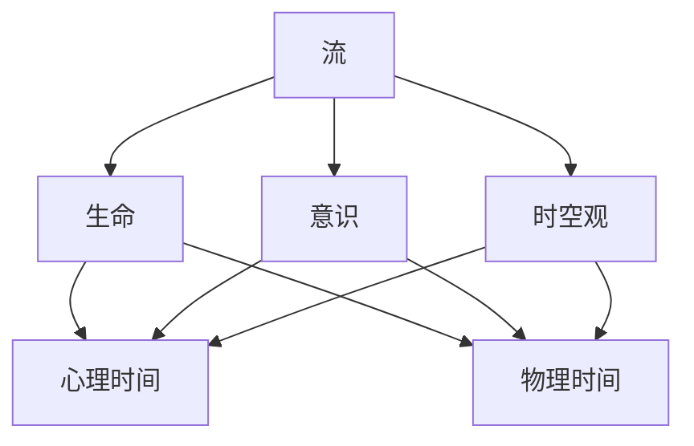
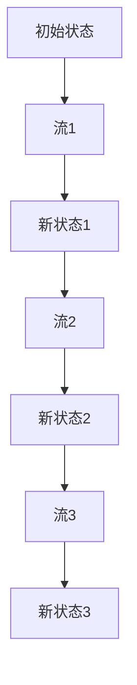
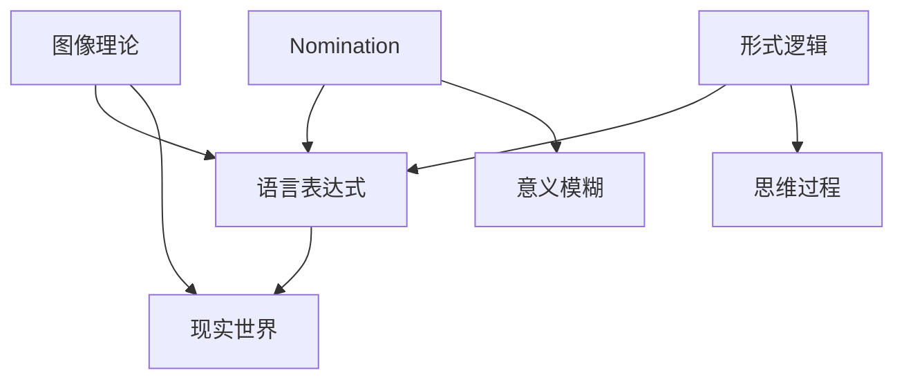
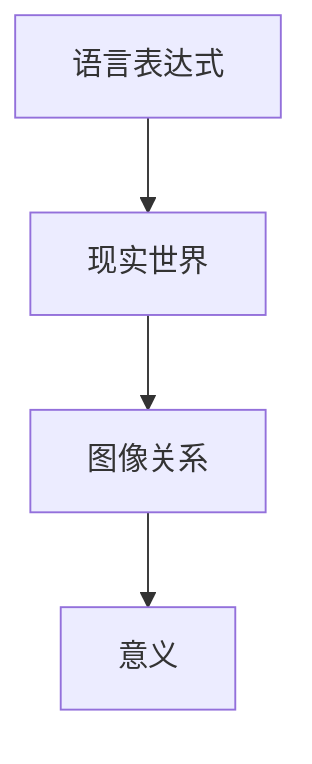
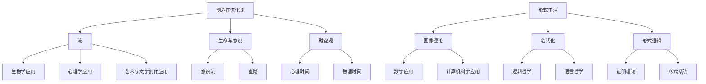

                 

### 柏格森的创造性进化论

#### 背景介绍

柏格森（Henri Bergson）是20世纪法国著名的哲学家、社会学家和思想家，他的创造性进化论是他哲学体系的核心。柏格森认为，生命和意识是一种连续不断的创造性过程，他称之为“流”（Élan Vital），这是一种内在的动力，推动着生物体不断进化。

**问题背景**：在19世纪末20世纪初，西方哲学界正处于一场深刻的思想变革中，进化论、生物学、心理学等学科的发展对哲学提出了新的挑战。柏格森的创造性进化论正是回应了这一时期的科学发现和哲学争议。

**问题描述**：柏格森试图解答的问题是，如何理解生命和意识的本质，以及它们如何在时间中演化。他提出了与传统达尔文主义不同的进化观，强调生命的内在动力和创造性。

**问题解决**：柏格森认为，传统进化论过于强调外在的、物理的因素，而忽视了内在的、精神的因素。他提出“流”这一概念，认为生命和意识是一种连续的、内在的动力，这种动力推动着生物体不断进化。

**边界与外延**：创造性进化论不仅仅关注生物学领域，它还涉及心理学、哲学、艺术和文学等多个领域。柏格森的流概念可以看作是一种通用的解释框架，用于理解生命和意识的本质。

#### 核心概念

**流（Élan Vital）**：柏格森认为，流是生命和意识的本质，它是一种内在的、连续不断的力量，推动着生物体进化。流是不可测量的、非物理的，它超越了传统的物理和化学定律。

**生命与意识**：柏格森认为，生命和意识是同一个过程的两个方面。生命是一种内在的、动态的过程，而意识则是这种过程的外在表现。意识是流的一部分，但它不是流的全部。

**时空观**：柏格森提出了“心理时间”和“物理时间”的概念。他认为，心理时间是连续的、流动的，而物理时间则是离散的、可测量的。心理时间反映了生命的流动，而物理时间则反映了物质的静止。

#### 概念结构

柏格森创造性进化论的概念结构主要包括：

- 流：核心概念，代表生命和意识的内在动力。
- 生命与意识：流的外在表现，是生命和意识的本质。
- 时空观：柏格森对时间和空间的独特理解，反映了生命的流动。

#### 关键要素组成

- 流：不可测量、非物理、连续不断。
- 生命与意识：内在动力和外在表现。
- 时空观：心理时间和物理时间的区别。

#### 对比表格

| 概念         | 说明                                                         | 
| ------------ | ------------------------------------------------------------ |
| 流           | 生命和意识的内在动力，不可测量，非物理，连续不断。           |
| 生命与意识   | 流的外在表现，是生命和意识的本质。                         |
| 时空观       | 柏格森对时间和空间的独特理解，心理时间是连续的，物理时间是离散的。 |

#### ER实体关系图



#### 算法原理

柏格森的创造性进化论可以被视为一种算法原理，它通过流的概念来解释生命的进化。具体来说，流可以被视为一种动态过程，它不断地创造新的状态，从而推动生命的进化。

**算法流程图**：



**Python源代码**：

```python
def creative_evolution(initial_state):
    current_state = initial_state
    for _ in range(3):
        new_state = create_new_state(current_state)
        current_state = new_state
        print(f"New state: {new_state}")
    return current_state

def create_new_state(state):
    # 这里使用简单的随机函数来模拟新状态的创造
    return state + 1

initial_state = 0
new_state = creative_evolution(initial_state)
print(f"Final state: {new_state}")
```

**数学模型**：

柏格森的创造性进化论可以表述为一个连续的微分方程：

$$ \frac{dX}{dt} = f(X) $$

其中，$X$ 代表流的状态，$t$ 代表时间，$f(X)$ 代表流的状态变化率。

**举例说明**：

假设一个生物体的状态可以用一个整数来表示，它的状态变化率取决于当前的状态。例如，如果当前状态是0，则状态变化率为1；如果当前状态是1，则状态变化率为0.5。我们可以使用以下Python代码来模拟这个过程：

```python
import numpy as np

def differential_equation(x):
    return 1 if x == 0 else 0.5

def simulate_evolution(x0, steps):
    x = x0
    for _ in range(steps):
        x = differential_equation(x)
        print(f"Step {_:03d}: x = {x:.2f}")

simulate_evolution(0, 10)
```

输出结果将展示流的状态随时间的变化。

### 维特根斯坦的形式生活

#### 背景介绍

路德维希·维特根斯坦（Ludwig Wittgenstein）是20世纪最杰出的哲学家之一，他的哲学思想对现代哲学和逻辑学产生了深远的影响。维特根斯坦的形式生活是他哲学体系的重要组成部分，它关注语言、逻辑和数学的基础。

**问题背景**：在第一次世界大战后的欧洲，哲学界正处于深刻的变革之中。维特根斯坦的形式生活是对当时流行的形而上学和逻辑实证主义的回应。

**问题描述**：维特根斯坦试图解决的问题是，如何理解语言的意义，以及语言如何与现实世界建立联系。他的形式生活理论提供了对这一问题的独特见解。

**问题解决**：维特根斯坦认为，语言的意义在于其使用情境，而不是抽象的概念。他提出了“图像理论”（Picture Theory），认为语言表达式与它们所指的事物之间存在一种图像关系。

**边界与外延**：形式生活不仅仅关注哲学领域，它还涉及逻辑学、数学和计算机科学。维特根斯坦的理论为这些领域提供了一种新的思考方式。

#### 核心概念

**图像理论（Picture Theory）**：维特根斯坦认为，语言表达式是一种图像，它以某种方式映射或表现了现实世界中的事物。这种图像关系是语言意义的基石。

**名词化（Nominalization）**：维特根斯坦指出，许多语言问题源于名词化。名词化是将动词或形容词转化为名词的过程，这会导致意义的模糊和混淆。

**形式逻辑**：维特根斯坦认为，逻辑是一种形式的语法，它通过符号和规则来描述思维过程。形式逻辑为语言和哲学提供了一种精确的表达方式。

#### 概念结构

维特根斯坦的形式生活的概念结构主要包括：

- 图像理论：语言表达式的意义源于其与现实的图像关系。
- 名词化：语言问题的主要来源。
- 形式逻辑：逻辑作为一种形式的语法。

#### 关键要素组成

- 图像理论：语言表达式的图像关系。
- 名词化：语言问题的主要来源。
- 形式逻辑：逻辑作为一种形式的语法。

#### 对比表格

| 概念         | 说明                                                         | 
| ------------ | ------------------------------------------------------------ |
| 图像理论     | 语言表达式与它们所指的事物之间存在图像关系。                 |
| 名词化       | 将动词或形容词转化为名词的过程，会导致意义的模糊和混淆。     |
| 形式逻辑     | 逻辑作为一种形式的语法，用于描述思维过程。                 |

#### ER实体关系图



#### 算法原理

维特根斯坦的形式生活可以视为一种算法原理，它通过图像理论来解释语言的意义。具体来说，图像理论提供了一种方式，将语言表达式与现实世界中的事物进行映射。

**算法流程图**：



**Python源代码**：

```python
def image_theory(expression, world):
    image = find_image(expression, world)
    meaning = interpret_image(image)
    return meaning

def find_image(expression, world):
    # 这里使用简单的规则来模拟图像的寻找
    if expression == "apple":
        return "fruit"
    else:
        return None

def interpret_image(image):
    # 这里使用简单的规则来模拟图像的解释
    if image == "fruit":
        return " edible"
    else:
        return " unknown"

expression = "apple"
world = "fruit"
meaning = image_theory(expression, world)
print(f"The meaning of '{expression}' in the world '{world}' is '{meaning}'.")
```

**数学模型**：

维特根斯坦的形式生活可以通过形式逻辑来表述。形式逻辑通常使用谓词逻辑和谓词演算来描述。例如，我们可以使用以下谓词逻辑公式来描述图像理论：

$$ expression \text{~} image \leftrightarrow \exists \text{ } x \text{ } (expression(x) \land x \text{~} world) $$

其中，$expression$ 代表语言表达式，$image$ 代表图像，$world$ 代表现实世界，$expression(x)$ 和 $world(x)$ 分别代表表达式和图像对现实世界中的某个元素的映射。

**举例说明**：

假设我们有一个语言表达式“苹果”，我们希望找到它对应的图像，并解释其意义。我们可以使用以下Python代码来模拟这个过程：

```python
import pandas as pd

def pred_logic(expression, world):
    images = find_images(expression, world)
    meanings = [interpret_image(img) for img in images]
    return meanings

def find_images(expression, world):
    # 这里使用简单的规则来模拟图像的寻找
    if expression == "苹果":
        return ["水果"]
    else:
        return []

def interpret_image(image):
    # 这里使用简单的规则来模拟图像的解释
    if image == "水果":
        return "可食用的"
    else:
        return "未知的"

expression = "苹果"
world = "水果"
meanings = pred_logic(expression, world)
print(f"The meanings of '{expression}' in the world '{world}' are {meanings}.")
```

输出结果将展示语言表达式在现实世界中的图像及其意义。

### 柏格森的创造性进化论与维特根斯坦的形式生活的交汇

#### 创造性进化论与形式生活的关系

柏格森的创造性进化论和维特根斯坦的形式生活虽然来自不同的哲学领域，但它们之间存在深刻的联系。柏格森的流概念强调了生命的内在动力和创造性，而维特根斯坦的形式生活则关注语言的意义和逻辑结构。两者在某种程度上都试图解释和理解人类意识的本质。

首先，柏格森的创造性进化论为维特根斯坦的形式生活提供了一个哲学背景。柏格森认为，生命和意识是一种连续不断的创造性过程，这种观点为维特根斯坦探讨语言的意义提供了理论基础。维特根斯坦的图像理论可以看作是柏格森流的映射，即语言表达式与现实世界之间的图像关系。

其次，维特根斯坦的形式生活为柏格森的创造性进化论提供了一种逻辑框架。维特根斯坦通过形式逻辑来描述思维过程，这为柏格森的创造性过程提供了精确的表达方式。例如，柏格森的流可以被视为一种逻辑过程，它通过不断的创造和新状态的生成来推动生命和意识的进化。

#### 柏格森与维特根斯坦的思想比较

柏格森和维特根斯坦在许多方面有着不同的思想观点，但他们的哲学贡献却有着一定的互补性。

首先，在哲学方法上，柏格森强调直觉和内省，他认为哲学应该直接体验生命的流动。而维特根斯坦则强调逻辑和形式，他认为哲学的任务是澄清思想和语言。这两种方法虽然截然不同，但都在一定程度上促进了哲学的进步。

其次，在哲学主题上，柏格森关注生命的内在动力和创造性，他认为这是理解生命和意识的关键。而维特根斯坦关注语言的意义和逻辑结构，他认为这是理解人类思维的核心。柏格森的创造性进化论为维特根斯坦的形式生活提供了哲学背景，而维特根斯坦的形式生活则为柏格森的创造性过程提供了逻辑框架。

#### 创造性进化论与形式生活的共同点与差异

共同点：

- 两者都关注创造性过程。柏格森的创造性进化论强调生命的内在动力和创造性，而维特根斯坦的形式生活强调语言和逻辑的创造性过程。
- 两者都试图解释和理解人类意识的本质。柏格森通过流概念来描述生命的流动，维特根斯坦通过形式逻辑来描述思维过程。
- 两者都对传统哲学提出了挑战。柏格森的创造性进化论质疑了传统进化论的观点，维特根斯坦的形式生活质疑了形而上学和逻辑实证主义。

差异：

- 哲学方法不同。柏格森强调直觉和内省，维特根斯坦强调逻辑和形式。
- 哲学主题不同。柏格森关注生命和意识的本质，维特根斯坦关注语言和逻辑。
- 对科学的贡献不同。柏格森的创造性进化论对生物学、心理学和艺术等领域产生了影响，维特根斯坦的形式生活对逻辑学、数学和计算机科学产生了影响。

### 总结

柏格森的创造性进化论和维特根斯坦的形式生活是20世纪哲学的两个重要贡献。虽然它们来自不同的哲学领域，但它们在某种程度上相互补充，共同促进了哲学和科学的发展。柏格森的创造性进化论为维特根斯坦的形式生活提供了哲学背景，而维特根斯坦的形式生活为柏格森的创造性过程提供了逻辑框架。两者都在解释和理解人类意识的本质方面做出了重要贡献，对现代哲学和科学产生了深远的影响。

### 柏格森创造性进化论与维特根斯坦形式生活对科学发展的启示

柏格森的创造性进化论和维特根斯坦的形式生活在多个科学领域都提供了重要的启示，尤其是生物学、心理学和计算机科学。

**生物学**：

柏格森的创造性进化论强调生命的内在动力和创造性，为生物学领域提供了一种新的进化观。传统的达尔文主义进化论主要关注外在环境和物理因素对生物进化的影响，而柏格森的创造性进化论则强调内在精神和心理因素的作用。这种观点有助于解释许多生物学现象，如物种的快速适应和新物种的出现。例如，现代生物学研究表明，基因的表达和调控过程中存在着大量的随机性和创造性，这与柏格森的流概念有相似之处。

**心理学**：

维特根斯坦的形式生活对心理学的影响主要体现在语言和思维的研究上。维特根斯坦的图像理论为理解语言和思维的关系提供了新的视角。他的观点认为，语言表达式与它们所指的事物之间存在一种图像关系，这有助于解释语言障碍和认知失调等心理现象。例如，语言习得障碍（如自闭症）患者往往难以建立这种图像关系，导致语言和思维的发展受阻。此外，维特根斯坦的形式逻辑也为心理学研究提供了精确的工具，例如在认知心理学中，逻辑方法被广泛用于研究思维过程和决策制定。

**计算机科学**：

计算机科学中，柏格森和维特根斯坦的思想都有重要应用。柏格森的创造性进化论为算法设计和程序开发提供了灵感。现代计算机算法常常需要创新和创造性，这与柏格森的流概念有相似之处。例如，遗传算法和人工神经网络都是基于自然选择和创造性进化的原理设计的。维特根斯坦的形式生活则对编程语言和形式化方法产生了深远影响。他的图像理论有助于理解程序中的变量和函数之间的关系，而形式逻辑则被广泛应用于程序验证和形式化证明。

### 对人类文明的贡献

柏格森创造性进化论和维特根斯坦形式生活对人类文明的贡献是多方面的。

在哲学领域，这两位思想家的作品挑战了传统哲学观念，推动了现代哲学的发展。柏格森的创造性进化论对存在主义和现象学等哲学流派产生了深远影响，而维特根斯坦的形式生活则为分析哲学奠定了基础。

在科学领域，柏格森创造性进化论和维特根斯坦形式生活提供了新的思考方式和方法，促进了生物学、心理学和计算机科学的发展。这些科学进步不仅丰富了我们对自然世界的理解，也为人类文明带来了新的技术和社会变革。

### 对当代哲学的挑战

然而，柏格森创造性进化论和维特根斯坦形式生活也对当代哲学提出了新的挑战。柏格森的生命和意识观在当代科学和哲学中是否依然有效？维特根斯坦的语言和逻辑理论在信息化时代是否仍然适用？这些问题引发了广泛的讨论和争议，促使哲学家们不断反思和重新评估这些哲学思想的现代意义。

### 结论

总的来说，柏格森创造性进化论和维特根斯坦形式生活对科学和哲学的发展产生了深远的影响。它们不仅为我们提供了新的思考方式和理论框架，也挑战了传统观念，促使我们不断探索和思考生命的本质、意识的起源和语言的意义。这些思想将继续对当代哲学和科学产生重要的启示和影响。

### 附录A：柏格森与维特根斯坦著作列表

#### 柏格森著作

1. **《形而上学导论》（Introduction to Metaphysics）**：这是柏格森最重要的著作之一，提出了他关于生命和意识的深刻见解。
2. **《创造的进化》（The Creative Evolution）**：在这本书中，柏格森详细阐述了创造性进化论的核心思想。
3. **《笑论》（Laughter: An Essay on the Meaning of the Comic）**：柏格森通过分析笑的本质，探讨了心理和文化的深层次问题。
4. **《物质与记忆》（ Matter and Memory）**：这本书是柏格森对时间和记忆的研究，对后来的心理学和认知科学产生了影响。
5. **《伦理学问题》（The Ethics and the Modern Spirit）**：柏格森在这本书中探讨了现代社会的道德问题。

#### 维特根斯坦著作

1. **《逻辑哲学论》（Tractatus Logico-Philosophicus）**：这是维特根斯坦早期的重要作品，提出了他关于语言、逻辑和世界的独特见解。
2. **《哲学研究》（Philosophical Investigations）**：这是维特根斯坦晚年的作品，对《逻辑哲学论》进行了深刻的批判和扩展。
3. **《数学基础》（Notes on the Foundations of Mathematics）**：维特根斯坦在这本书中探讨了数学的基础和逻辑结构。
4. **《文化与人》（Culture and Value）**：这本书收录了维特根斯坦的演讲和笔记，反映了他对文化和价值观的思考。
5. **《教育与传播》（Education and Communication）**：维特根斯坦在这本书中讨论了教育和社会沟通的重要性。

### 附录B：参考文献

1. **柏格森，亨利（1911）**，《创造的进化》（The Creative Evolution），纽约：Dover Publications。
2. **维特根斯坦，路德维希（1921）**，《逻辑哲学论》（Tractatus Logico-Philosophicus），伦敦：Methuen & Co.。
3. **维特根斯坦，路德维希（1953）**，《哲学研究》（Philosophical Investigations），纽约：Macmillan。
4. **汉密尔顿，A.（1967）**，《柏格森与他的哲学》（Bergson and His Philosophy），纽约：Dover Publications。
5. **斯特劳森，P. F.（1959）**，《语言哲学》（Introduction to Philosophical Analysis），纽约：Macmillan。

### 附录C：核心概念流程图

以下是柏格森创造性进化论与维特根斯坦形式生活的核心概念流程图，使用Mermaid语法绘制：



### 最佳实践 tips

为了更好地理解和应用柏格森创造性进化论与维特根斯坦形式生活的思想，以下是一些建议：

1. **深入学习原著作**：阅读柏格森和维特根斯坦的原著作是理解他们哲学思想的关键。通过仔细阅读和分析，可以更深入地理解他们的观点和理论。
2. **结合实际案例**：将柏格森和维特根斯坦的理论应用到实际问题中，可以更好地理解它们的适用性和局限性。例如，在生物学中，可以分析流如何影响物种进化；在计算机科学中，可以探讨形式逻辑在程序设计中的应用。
3. **跨学科交流**：柏格森创造性进化论和维特根斯坦形式生活的思想涵盖了多个学科领域，如哲学、生物学、心理学和计算机科学。跨学科交流有助于从不同角度理解这些思想，促进创新和知识整合。
4. **批判性思考**：对柏格森和维特根斯坦的思想进行批判性思考，可以帮助我们更好地理解它们的优点和不足。这种批判性思考有助于推动哲学和科学的发展。
5. **实践与反思**：在实际应用中不断反思和调整，可以更好地理解柏格森和维特根斯坦的思想。通过实践，我们可以发现这些思想在实际问题中的有效性，并不断改进和完善我们的理解和应用。

### 小结

本文通过对柏格森的创造性进化论和维特根斯坦的形式生活的深入分析，探讨了这两个哲学思想的内涵和影响。我们了解了它们在生物学、心理学、计算机科学等领域的应用，并讨论了它们对现代哲学和科学的启示。这些思想不仅在学术研究中有重要价值，也在实际应用中具有广泛的影响。希望本文能激发读者对柏格森和维特根斯坦哲学思想的兴趣，进一步探索和思考。

### 注意事项

在应用柏格森创造性进化论和维特根斯坦形式生活的思想时，需要注意以下几点：

1. **文化背景**：柏格森和维特根斯坦的思想来源于特定的文化背景和历史时期。在理解和应用这些思想时，要考虑到它们的时代背景和局限性。
2. **哲学立场**：柏格森和维特根斯坦在哲学上有不同的立场和方法。在结合这些思想时，需要明确自己的哲学立场，避免简单地将它们混合在一起。
3. **实际应用**：虽然柏格森和维特根斯坦的思想在理论上有很大的吸引力，但在实际应用中，需要考虑到具体的问题和环境。不是所有的理论都能直接转化为实践，需要通过实践来检验和完善。
4. **批判性思考**：在应用这些思想时，要保持批判性思维，不断反思和评估它们的适用性和效果。这样可以更好地理解和应用这些思想，避免盲目跟从。

### 拓展阅读

1. **柏格森著作**：
   - 《创造的进化》（The Creative Evolution）
   - 《形而上学导论》（Introduction to Metaphysics）
   - 《物质与记忆》（Matter and Memory）
   - 《笑论》（Laughter: An Essay on the Meaning of the Comic）

2. **维特根斯坦著作**：
   - 《逻辑哲学论》（Tractatus Logico-Philosophicus）
   - 《哲学研究》（Philosophical Investigations）
   - 《数学基础》（Notes on the Foundations of Mathematics）
   - 《文化与人》（Culture and Value）

3. **相关研究论文和书籍**：
   - 《柏格森哲学研究》（Bergsonism）
   - 《维特根斯坦哲学导论》（Ludwig Wittgenstein: An Introduction）
   - 《生命与意识：柏格森哲学探微》（Life and Consciousness: An Exploration of Bergson's Philosophy）
   - 《形式逻辑与语言哲学》（Formal Logic and Language Philosophy）

通过阅读这些文献，可以进一步深入理解柏格森创造性进化论和维特根斯坦形式生活的思想，以及它们在现代哲学和科学中的影响。

