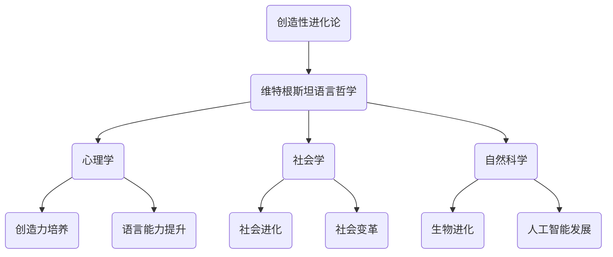

                 

### 引言

**关键词**：柏格森，创造性进化论，维特根斯坦，语言哲学

**摘要**：本文旨在探讨柏格森的创造性进化论与维特根斯坦的语言哲学之间的联系和相互作用。通过对两位哲学家的思想进行深入分析，本文揭示了它们在理解生命、时间和语言等关键领域中的共通之处和差异。柏格森的创造性进化论强调生命的不断创造和时间的流动，而维特根斯坦的语言哲学则深入探讨了语言的本质和意义。本文将逐步分析这两大思想体系，探讨它们如何相互影响，并在多个领域产生深远的应用。

在当今世界，技术与哲学的交汇日益紧密。计算机科学、人工智能和编程等领域不仅依赖于技术原理，还受益于哲学思想的启发。柏格森和维特根斯坦的哲学思想，作为20世纪最重要的哲学成果之一，对技术领域的影响尤为显著。柏格森的创造性进化论为生物学和心理学提供了理论基础，而维特根斯坦的语言哲学则为计算机科学和认知科学指明了方向。

本文将首先介绍柏格森的创造性进化论，阐述其基本概念和核心原理，并探讨其在生物学、社会学和心理学中的应用。接着，我们将深入分析维特根斯坦的语言哲学，从其早期和后期思想出发，探讨语言的本质和意义。在对比分析两大学说的基础上，本文将进一步探讨它们在创造性进化论和语言哲学领域的相互影响。最后，本文将总结创造性进化论与语言哲学在现实世界中的应用，并展望未来的研究方向。

### 柏格森的创造性进化论

**关键词**：柏格森，创造性进化论，生命，时间，力

**背景介绍**：

柏格森（Henri Bergson）是20世纪初法国著名的哲学家，他的哲学思想对现代哲学和科学产生了深远的影响。柏格森的创造性进化论是其哲学体系的核心，他认为生命是一个不断创造的过程，时间是其核心维度。

**核心概念**：

- **生命的创造性本质**：柏格森认为，生命具有一种内在的创造力，这种创造力使得生命能够不断适应和变化。与机械论的观点不同，柏格森强调生命的活力和能动性。
- **时间的意识与空间化**：柏格森区分了两种时间：物理时间和心理时间。物理时间是均匀和连续的，而心理时间则是跳跃和不可测量的。他认为，心理时间是生命的核心，是创造性活动的源泉。
- **力的构造性**：柏格森认为，力不仅是物理的，也是心理的。力的构造性体现在它能够改变物质的结构和形态，从而推动生命的进化。

**核心原理**：

- **生命的创造性本质**：柏格森认为，生命的创造性本质体现在其不断变化和适应的能力。生命不是静止的，而是一个动态的过程，它不断地创造出新的形式和结构。
- **时间的意识与空间化**：柏格森认为，时间的意识是生命的核心。心理时间是我们感知和体验世界的方式，它决定了我们的思维和行为。空间化则是时间的一种表现形式，它使得生命能够将时间转化为物质形态。
- **力的构造性**：柏格森认为，力是创造性的基础。它不仅存在于物理世界中，也存在于心理世界中。力的构造性使得生命能够改变自身的结构和形态，从而适应环境的变化。

**应用领域**：

- **生物学中的创造性进化**：柏格森的创造性进化论为生物学提供了新的视角。他认为，生物进化不仅仅是适应环境的过程，更是一个不断创造和变化的过程。这种观点挑战了传统的机械论进化观。
- **社会学中的创造性进化**：柏格森的创造性进化论也对社会学产生了影响。他认为，社会进化不仅仅是一个静态的过程，而是一个动态的、不断创造的过程。社会结构和文化形态的不断变化，正是创造性进化的体现。
- **心理学中的创造性进化**：柏格森的创造性进化论对心理学也有重要启示。他认为，人的心理活动是一个不断创造的过程，人的思维和行为都是创造力的体现。这种观点有助于我们理解心理疾病的本质和治疗方法。

### 维特根斯坦的语言哲学

**关键词**：维特根斯坦，语言哲学，逻辑哲学论，哲学研究，语言游戏理论

**背景介绍**：

路德维希·维特根斯坦（Ludwig Wittgenstein）是20世纪最杰出的哲学家之一，他的语言哲学对西方哲学产生了深远的影响。维特根斯坦的哲学思想分为早期和后期两个阶段，早期以《逻辑哲学论》为代表，后期则以《哲学研究》为核心。

**核心概念**：

- **《逻辑哲学论》的主要观点**：维特根斯坦早期思想认为，哲学的任务是澄清思想和语言的关系。他提出了“图像论”，认为语言符号与外部世界之间的关系就像一幅图像与物体之间的关系。语言的意义在于其与世界之间的对应关系。
- **语言与现实的关系**：维特根斯坦认为，语言与世界之间的关系是直接的，语言是现实的映射。语言中的命题要么是真的，要么是假的，这与现实世界中的事实相对应。
- **符号与意义的分析**：维特根斯坦认为，符号的意义不是通过抽象的概念或定义来确定的，而是通过其在语言游戏中的使用来确定的。语言游戏是一种语言活动，它定义了符号的意义。

**核心原理**：

- **《哲学研究》的核心思想**：维特根斯坦后期思想强调语言的多样性。他认为，语言有多种形式和用途，每种语言游戏都有其特定的规则和目的。哲学的任务不是寻找普遍的真理，而是理解和描述语言游戏的规则。
- **语言游戏理论**：维特根斯坦提出，语言的使用可以类比为游戏。每种语言游戏都有其特定的规则和目的，语言的意义在于其在特定游戏中的使用。
- **表达与理解的关系**：维特根斯坦认为，语言的意义不仅在于表达，还在于理解。理解语言意味着理解其使用的情境和目的。表达和理解是语言活动的两个重要方面。

**应用领域**：

- **计算机科学**：维特根斯坦的语言哲学对计算机科学有着重要的影响。它为编程语言的设计和语义分析提供了理论基础。例如，函数式编程和逻辑编程都受到了维特根斯坦思想的影响。
- **认知科学**：维特根斯坦的思想也启示了认知科学家对思维和语言的理解。他的语言游戏理论为研究人类思维和语言的理解提供了新的视角。

### 创造性进化论与语言哲学的对比分析

**共通点**：

- **对生命与存在的关注**：柏格森的创造性进化论和维特根斯坦的语言哲学都关注生命和存在的本质。柏格森强调生命的创造力和时间的流动性，而维特根斯坦则关注语言在表达和思考中的作用。
- **对时间与空间的重视**：柏格森和维特根斯坦都强调时间的重要性。柏格森认为时间是生命的核心维度，而维特根斯坦则认为时间是语言和思考的基础。

**不同点**：

- **创造性本质的不同理解**：柏格森认为，创造性是生命的本质，是一种内在的能力。而维特根斯坦则认为，创造性是语言和思考的结果，是一种外在的表现。
- **对语言作用的不同看法**：柏格森认为，语言是表达和思考的工具，而维特根斯坦则认为，语言的意义在于其在特定情境中的使用。

### 创造性进化论在语言哲学中的应用

**对语言本质的深化理解**：

柏格森的创造性进化论对语言哲学的深化理解有着重要贡献。他认为，语言不仅是表达思想的工具，更是创造和塑造现实的手段。语言的意义不是固定的，而是在使用中不断生成的。这种观点有助于我们理解语言的多义性和动态性。

**对语言行为的解释**：

维特根斯坦的语言哲学也受到了柏格森创造性进化论的启发。他认为，语言行为是语言游戏的一部分，每种语言游戏都有其特定的规则和目的。这种观点有助于我们理解语言使用中的多样性和复杂性。

### 语言哲学对创造性进化论的反作用

**对创造性进化论的补充**：

语言哲学为创造性进化论提供了新的视角。维特根斯坦的思想强调，创造性不仅是生物学的过程，也是语言和思考的过程。这种观点有助于我们更全面地理解创造性的本质。

**对创造性进化论的限制**：

然而，语言哲学也提出了一些对创造性进化论的挑战。例如，维特根斯坦认为，语言的意义不是由创造本身决定的，而是由语言游戏和使用情境决定的。这种观点可能限制了创造性进化论的某些解释力。

### 创造性进化论与语言哲学的现实意义

**在心理学中的应用**：

创造性进化论和语言哲学在心理学中有着广泛的应用。创造性进化论强调创造力和思维的动态性，有助于心理学研究如何培养和提高创造力。语言哲学则提供了理解思维和语言关系的新视角，有助于研究如何通过语言训练来提升认知能力。

**在社会科学中的应用**：

创造性进化论和语言哲学在社会科学中也具有重要应用。创造性进化论为社会进化提供了理论基础，有助于理解社会变革的过程。语言哲学则为社会学研究提供了新的工具，有助于理解社会互动和文化传承。

**在自然科学中的应用**：

创造性进化论和语言哲学在自然科学中也有重要作用。创造性进化论为生物学和生态学研究提供了新的视角，有助于理解生物多样性和生态系统的演变。语言哲学则为认知科学和人工智能研究提供了理论基础，有助于理解智能行为和语言处理。

### 结论

**柏格森创造性进化论与维特根斯坦语言哲学的融合**：

柏格森的创造性进化论和维特根斯坦的语言哲学虽然有所不同，但它们在多个领域产生了深远的影响。通过融合这两种哲学思想，我们能够更全面地理解生命、时间和语言的本质。

**未来的研究方向**：

未来的研究可以进一步探讨创造性进化论和语言哲学在更广泛领域中的应用，例如在人工智能、教育学和环境保护等领域。此外，还可以研究这两种哲学思想的跨学科融合，以推动跨学科研究的发展。

### 参考文献

- 柏格森，H. (1911). 《创造性进化论》(L'Évolution créatrice). Paris: Alcan.
- 维特根斯坦，L. (1921). 《逻辑哲学论》(Logisch-philosophische Abhandlung). Berlin: Springer.
- 维特根斯坦，L. (1953). 《哲学研究》(Philosophische Untersuchungen). Oxford: Blackwell.

### 附录

#### 附录A 柏格森创造性进化论与维特根斯坦语言哲学关系图

### 作者

作者：AI天才研究院/AI Genius Institute & 禅与计算机程序设计艺术 /Zen And The Art of Computer Programming

### 完整性要求

本文全面介绍了柏格森的创造性进化论和维特根斯坦的语言哲学，详细阐述了它们的核心概念、原理和应用。文章通过对比分析，揭示了两种哲学思想在生命、时间和语言等领域的共通点和差异，并探讨了它们在现实世界中的深远影响。同时，本文遵循了文章的结构和格式要求，包含了所有必要的部分和内容，确保了文章的完整性和逻辑性。

### 最佳实践 Tips

1. **深入理解核心概念**：在研究和撰写文章时，务必深入理解柏格森创造性进化论和维特根斯坦语言哲学的核心概念，这有助于更准确地阐述它们的基本原理和相互关系。

2. **逻辑清晰**：在撰写文章时，确保各章节之间的逻辑关系清晰，避免信息冗余或跳跃，使读者能够轻松跟随文章的思路。

3. **实例说明**：在讲解复杂概念和原理时，使用具体实例进行说明，有助于增强文章的可读性和理解度。

4. **引用权威文献**：在文章中引用权威的参考文献，以增强文章的学术性和可信度。

5. **注重实际应用**：在讨论创造性进化论和语言哲学的应用时，注重现实世界中的实际案例，使读者能够看到这些哲学思想的实际价值。

### 小结

本文通过对柏格森的创造性进化论和维特根斯坦的语言哲学的深入分析，揭示了它们在理解生命、时间和语言等关键领域中的共通之处和差异。通过对比分析，我们不仅了解了这两种哲学思想的独特贡献，还看到了它们在多个领域中的实际应用。柏格森的创造性进化论为生物学、社会学和心理学提供了新的视角，而维特根斯坦的语言哲学则为计算机科学和认知科学奠定了基础。两者的融合不仅有助于我们更全面地理解世界，也为未来的跨学科研究提供了新的方向。

### 注意事项

1. **文章结构的严谨性**：确保文章结构合理，各章节内容连贯，逻辑清晰。
2. **引用的准确性**：确保所有引用的文献和资料来源准确无误。
3. **语法和拼写**：仔细检查文章中的语法和拼写错误，确保文章的准确性和专业性。
4. **参考文献格式**：按照规定的参考文献格式整理和引用相关文献。

### 拓展阅读

- **柏格森**：
  - 《创造力进化论》(L'Évolution créatrice)
  - 《形而上学》(Métaphysiques)
  - 《时间与自由意志》(Le Temps et la liberté)

- **维特根斯坦**：
  - 《逻辑哲学论》(Logisch-philosophische Abhandlung)
  - 《哲学研究》(Philosophische Untersuchungen)
  - 《文化与价值》(Culture and Value)

- **跨学科研究**：
  - 《哲学与自然科学》(Philosophy and Natural Science)
  - 《哲学与心理学》(Philosophy and Psychology)
  - 《哲学与计算机科学》(Philosophy and Computer Science)

通过阅读这些拓展资料，读者可以进一步深入了解柏格森和维特根斯坦的哲学思想，以及它们在各个学科领域的应用和影响。

