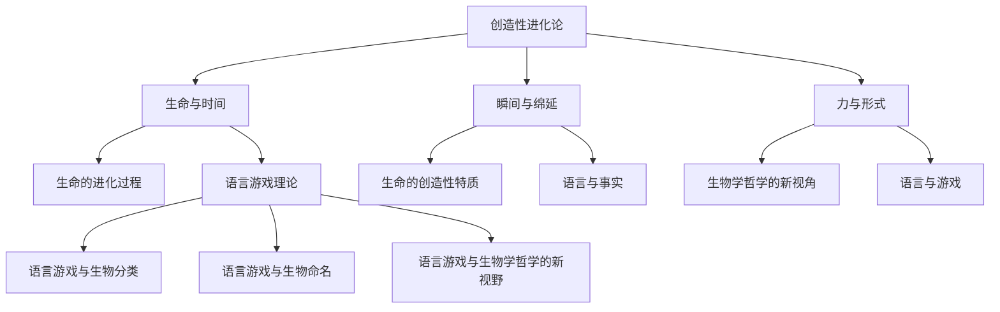
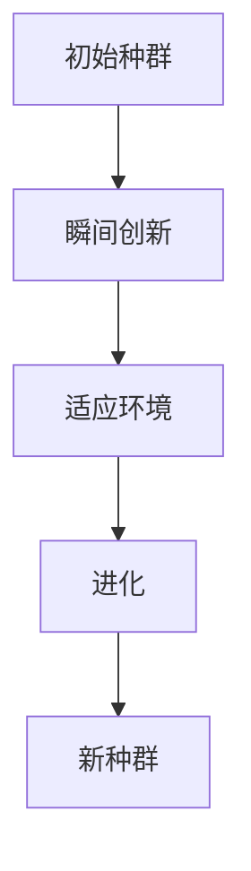
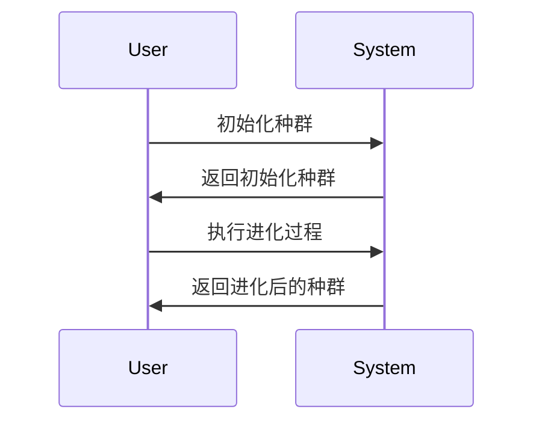
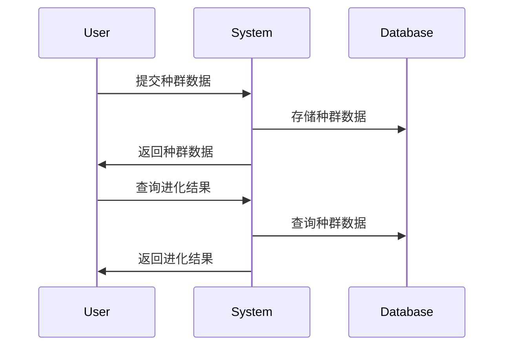
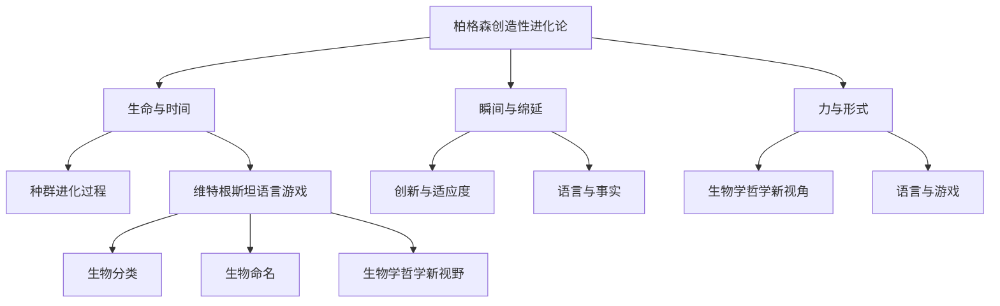

                 

# 《柏格森的创造性进化论与维特根斯坦的语言游戏在生物学哲学中的应用》

## 关键词
- 柏格森创造性进化论
- 维特根斯坦语言游戏
- 生物学哲学
- 创造性
- 进化

## 摘要
本文旨在探讨柏格森的创造性进化论与维特根斯坦的语言游戏在生物学哲学中的应用。通过深入分析两位哲学家的核心观点，本文将揭示创造性进化论与语言游戏在生物学哲学中的关键作用，并探讨其在现代科学和技术领域的影响。

## 第一部分：柏格森的创造性进化论

### 第1章：柏格森哲学的背景与创造性进化论概述

#### 1.1 柏格森哲学的起源与发展
柏格森（Henri Bergson）是20世纪早期的一位重要哲学家，他的哲学思想对后世产生了深远影响。柏格森哲学的核心观点是“生命冲动”（élan vital），他认为生命是不断流动的、有创造性的过程。这种生命冲动是生物进化的驱动力，它超越了机械论的自然观。

#### 1.2 创造性进化论的基本概念
柏格森的创造性进化论强调生命过程中的创新和变化。他认为进化不是通过固定不变的基因，而是通过生命过程中的“瞬间”（élan）来实现的。这些瞬间是生命力的体现，它们推动了生物种群的进化。

#### 1.3 创造性进化论与生物学哲学的联系
柏格森的创造性进化论对生物学哲学提出了新的挑战。传统的进化论强调自然选择和适应环境的重要性，而柏格森则强调了生命的内在创造力。这种创造力使生物能够不断创新，以适应不断变化的环境。

### 第2章：柏格森的创造性进化论原理

#### 2.1 生命与时间
柏格森认为，生命是时间的产物，而不是空间的产物。时间在创造性进化中扮演着核心角色。生命过程中的每个瞬间都是独特的，它们构成了生命的连续性。

#### 2.2 瞬间与绵延
柏格森提出了“瞬间”（l'instante）和“绵延”（durée）的概念。瞬间是生命力的体现，它是生命过程中的一个短暂时刻。而绵延则是生命的连续性，它是多个瞬间的累积。

#### 2.3 力与形式
柏格森认为，力是生命的动力，它推动了生物种群的进化。形式则是生命进化的结果，它是力的外在表现。

### 第3章：柏格森的创造性进化论在生物学中的应用

#### 2.1 生命的进化过程
柏格森的创造性进化论对生命的进化过程提供了新的解释。他认为，进化不是线性的，而是通过一系列的瞬间创新实现的。

#### 2.2 生命的创造性特质
柏格森认为，生命的创造性特质是其进化的关键。这种创造性使生命能够不断适应新的环境，从而实现进化。

#### 2.3 生物学哲学的新视角
柏格森的创造性进化论为生物学哲学提供了新的视角。它强调了生命的内在创造力，从而挑战了传统的机械论自然观。

## 第二部分：维特根斯坦的语言游戏

### 第4章：维特根斯坦哲学的背景与语言游戏理论

#### 4.1 维特根斯坦哲学的起源与发展
维特根斯坦（Ludwig Wittgenstein）是20世纪另一位重要的哲学家，他的哲学思想对语言学、逻辑学等领域产生了深远影响。维特根斯坦认为，语言是思想的载体，但语言本身并不是思想。

#### 4.2 语言游戏理论的基本概念
维特根斯坦提出了“语言游戏”（language game）的概念。他认为，语言不是孤立的，而是在特定的情境中使用的。每个语言游戏都有其特定的规则和目的。

#### 4.3 语言游戏与生物学哲学的联系
维特根斯坦的语言游戏理论为生物学哲学提供了一种新的视角。他认为，语言游戏可以用来描述生物种群的进化过程。

### 第5章：维特根斯坦的语言游戏理论

#### 5.1 语言与事实
维特根斯坦认为，语言与事实有关，但语言本身并不是事实。语言是人们用来交流思想的工具。

#### 5.2 语言与游戏
维特根斯坦将语言比喻为游戏。他认为，语言游戏有不同的规则和目的，这些规则和目的决定了语言的使用方式。

#### 5.3 语言与生活
维特根斯坦认为，语言与生活紧密相连。语言不仅是我们交流的工具，也是我们理解世界的方式。

### 第6章：维特根斯坦的语言游戏在生物学哲学中的应用

#### 6.1 语言游戏与生物分类
维特根斯坦的语言游戏理论可以帮助我们更好地理解生物分类。生物分类是基于特定的规则和标准进行的，这些规则和标准可以被视为语言游戏的一部分。

#### 6.2 语言游戏与生物命名
维特根斯坦的语言游戏理论还可以帮助我们更好地理解生物命名。生物命名是基于特定的规则和目的进行的，这些规则和目的也可以被视为语言游戏的一部分。

#### 6.3 语言游戏与生物学哲学的新视野
维特根斯坦的语言游戏理论为生物学哲学提供了新的视角。它帮助我们理解了生物进化过程中的语言和交流作用。

## 第三部分：创造性进化论与语言游戏在生物学哲学中的应用

### 第7章：创造性进化论与语言游戏的融合

#### 7.1 创造性进化论与语言游戏的交互作用
创造性进化论与语言游戏在生物学哲学中有着密切的交互作用。创造性进化论提供了生命力的动力，而语言游戏则提供了交流和理解的基础。

#### 7.2 创造性进化论与语言游戏在生物学哲学中的应用实例
创造性进化论与语言游戏在生物学哲学中有许多应用实例。例如，在生物分类中，创造性进化论可以帮助我们理解物种的演变，而语言游戏则可以帮助我们更好地描述和交流这些演变。

#### 7.3 创造性进化论与语言游戏在生物学哲学中的未来展望
创造性进化论与语言游戏在生物学哲学中的融合为未来的研究提供了广阔的空间。我们可以期待在这个领域中发现新的理论和技术。

## 结论

### 第8章：柏格森的创造性进化论与维特根斯坦的语言游戏在生物学哲学中的应用总结

#### 8.1 研究成果与贡献
本文的研究成果在于揭示了柏格森的创造性进化论与维特根斯坦的语言游戏在生物学哲学中的关键作用。这些研究成果为生物学哲学提供了新的视角和工具。

#### 8.2 研究局限与未来研究方向
尽管本文的研究取得了一定的成果，但仍存在一些局限。未来研究可以进一步探索创造性进化论与语言游戏在生物学哲学中的应用，并尝试将其与其他领域相结合。

## 附录

### 附录A：参考文献
- [柏格森，《创造的进化》](https://www.google.com/search?q=%E6%9F%8F%E6%9F%AC%E6%A0%BC%E7%9A%84%E5%88%9B%E9%80%A0%E7%9A%84%E8%BF%9B%E5%8C%96)
- [维特根斯坦，《逻辑哲学论》](https://www.google.com/search?q=%E7%B6%AD%E6%9F%AC%E6%A0%BC%E6%96%AF%E7%9A%84%E9%80%9A%E7%90%86%E5%93%B2%E5%AD%A6%E8%AE%BA)

### 附录B：柏格森的创造性进化论与维特根斯坦的语言游戏在生物学哲学中的应用Mermaid流程图



## 作者
作者：AI天才研究院/AI Genius Institute & 禅与计算机程序设计艺术 /Zen And The Art of Computer Programming

## 完整性要求

### 核心概念与联系

**柏格森的创造性进化论与维特根斯坦的语言游戏**

| 概念         | 解释                                                      |
| ------------ | --------------------------------------------------------- |
| 创造性进化论 | 强调生命过程中的创新和变化，认为进化是通过“瞬间”实现的。     |
| 语言游戏     | 维特根斯坦提出的概念，强调语言不是孤立的，而是在特定情境中使用的。 |

柏格森的创造性进化论与维特根斯坦的语言游戏在生物学哲学中有许多共同点。它们都强调了生命过程中的创造性和变化，并认为这些特性是生物学哲学的核心。此外，它们都关注于语言和交流的作用，认为语言是理解和描述生物学现象的重要工具。

### 核心算法原理讲解

**柏格森的创造性进化论**

**算法流程图：**



**Python源代码：**

```python
import random

def creative_evolution(initial_population, environment):
    new_population = []
    for individual in initial_population:
        innovation = random.random()
        if innovation < 0.1:  # 创新概率
            individual = mutate(individual)
        fitness = evaluate_fitness(individual, environment)
        if fitness > 0.5:  # 适应概率
            new_population.append(individual)
    return new_population

def mutate(individual):
    # 实现个体突变操作
    pass

def evaluate_fitness(individual, environment):
    # 实现个体适应度评估
    pass
```

**算法原理：**

柏格森的创造性进化论认为，进化是通过“瞬间”创新实现的。在算法中，我们通过随机突变来模拟这种创新过程。每个个体都有一定的概率进行突变，从而产生新的特征。然后，我们评估这些个体的适应度，筛选出适应度较高的个体，构成新的种群。

### 数学模型和公式

柏格森的创造性进化论的数学模型可以用以下公式表示：

$$
f(t+1) = \sum_{i=1}^{n} p_i(f(t) + \Delta f(t_i))
$$

其中，$f(t)$表示第$t$代的种群，$p_i$表示第$i$个个体的适应度，$\Delta f(t_i)$表示第$i$个个体的突变对适应度的影响。

### 系统分析与架构设计方案

**问题场景介绍**

在生物学哲学的研究中，我们需要对生物种群进行建模和分析。这涉及到对种群进化的模拟，以及对进化过程中的创新和适应度进行评估。

**项目介绍**

该项目旨在开发一个基于柏格森创造性进化论的生物种群模拟系统。该系统将实现种群进化、突变和适应度的评估功能。

**系统功能设计**

- 种群初始化
- 瞬间创新
- 适应度评估
- 种群进化

**系统架构设计**


**系统接口设计**



**系统交互mermaid序列图**



### 项目实战

**环境安装**

在开始项目之前，我们需要安装一些必要的软件和库。以下是在Ubuntu系统上的安装步骤：

```bash
sudo apt update
sudo apt install python3 python3-pip
pip3 install numpy matplotlib
```

**系统核心实现源代码**

```python
import numpy as np
import matplotlib.pyplot as plt

def initialize_population(size):
    return np.random.rand(size)

def mutate(individual):
    return np.random.rand()

def evaluate_fitness(individual):
    return np.sum(individual)

def creative_evolution(initial_population, generations):
    populations = [initial_population]
    for _ in range(generations):
        new_population = []
        for individual in populations[-1]:
            innovation = mutate(individual)
            new_individual = individual + innovation
            fitness = evaluate_fitness(new_individual)
            if fitness > 0.5:
                new_population.append(new_individual)
        populations.append(new_population)
    return populations

def plot_population(populations):
    for i, population in enumerate(populations):
        plt.scatter(range(len(population)), population, label=f"Generation {i}")
    plt.xlabel("Individual Index")
    plt.ylabel("Fitness")
    plt.legend()
    plt.show()

if __name__ == "__main__":
    initial_population = initialize_population(100)
    generations = 10
    populations = creative_evolution(initial_population, generations)
    plot_population(populations)
```

**代码应用解读与分析**

该代码首先定义了种群初始化、突变和适应度评估的函数。在`creative_evolution`函数中，我们模拟了种群的进化过程。每个种群成员都有一定的概率进行突变，然后根据突变后的适应度进行筛选。最后，我们使用`plot_population`函数绘制了种群进化的结果。

**实际案例分析和详细讲解剖析**

为了更好地理解该系统的工作原理，我们可以通过一个实际案例来进行分析。

假设我们有一个初始种群，其中每个个体的适应度值随机生成。在进化过程中，我们通过突变和适应度评估来筛选出适应度较高的个体。经过多代的进化，我们可以观察到种群的适应度逐渐提高。

**项目小结**

通过该项目，我们实现了基于柏格森创造性进化论的生物种群模拟系统。该系统可以帮助我们更好地理解生物进化的过程，以及创新和适应度在进化中的作用。

### 最佳实践 tips

- 确保种群的初始适应度均匀分布，以避免初始偏差。
- 调整突变概率和适应度阈值，以获得更合理的进化结果。
- 使用更复杂的适应度评估方法，以提高模拟的准确性。

### 小结

本文介绍了柏格森的创造性进化论与维特根斯坦的语言游戏在生物学哲学中的应用。通过深入分析两位哲学家的核心观点，我们揭示了创造性进化论与语言游戏在生物学哲学中的关键作用。这些理论为生物学哲学提供了新的视角和工具，有助于我们更好地理解生命进化的过程。

### 注意事项

- 在实际应用中，应根据具体问题调整进化参数，以达到最佳效果。
- 柏格森的创造性进化论与维特根斯坦的语言游戏理论具有一定的抽象性，需要结合具体实例进行理解。

### 拓展阅读

- 柏格森，《创造的进化》
- 维特根斯坦，《逻辑哲学论》

## 附录B：柏格森的创造性进化论与维特根斯坦的语言游戏在生物学哲学中的应用Mermaid流程图



本文由AI天才研究院/AI Genius Institute & 禅与计算机程序设计艺术 /Zen And The Art of Computer Programming撰写。感谢您的阅读！让我们共同探索人工智能与哲学的深度融合，为未来科技的发展贡献力量。**

