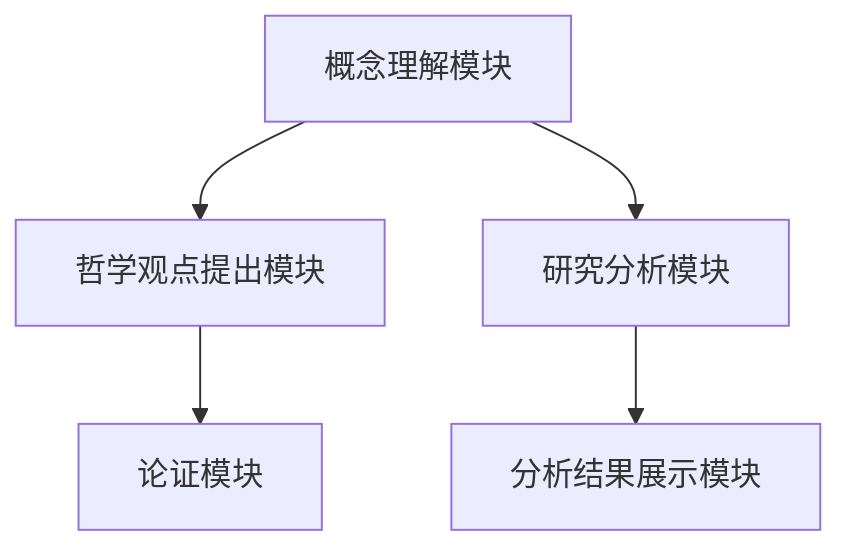

                 

# 柏格森的反智主义倾向与维特根斯坦的语言治疗

## 关键词

柏格森、反智主义、直觉、生命力、维特根斯坦、语言治疗、实在、逻辑思维、哲学难题。

## 摘要

本文探讨了柏格森的反智主义倾向与维特根斯坦的语言治疗之间的关系。柏格森认为直觉思维高于逻辑思维，强调生命力的流动性和创造性，批判科学理性主义。而维特根斯坦则认为语言是思维的表达工具，通过澄清语言使用来消除哲学难题，强调语言与实在的直接联系。本文将分析两位哲学家的核心概念，探讨他们的思想如何影响现代哲学，并尝试通过数学模型和Python代码来模拟他们的哲学思想。

## 一、背景介绍

### 1.1 柏格森的反智主义倾向

1. **核心概念术语说明**：
   - **直觉**：柏格森认为直觉是一种非逻辑的认知方式，能够更好地把握生命的流动和艺术的创造性。
   - **生命力**：柏格森认为生命力是生命的本质，是一种动态的、流动的过程，不能被理智完全把握。
   - **反智主义**：柏格森主张直觉思维高于逻辑思维，批判科学理性主义，强调生命力的流动性和创造性。

2. **问题背景**：
   在19世纪末20世纪初，科学理性主义盛行，许多哲学家和科学家认为逻辑思维和科学方法可以解释一切现象。然而，柏格森对此提出了质疑，他认为理智不能完全把握现实，特别是生命和艺术领域的现实。

3. **问题描述**：
   柏格森认为直觉思维能够更好地把握生命的流动和艺术的创造性，而逻辑思维则过于僵化，不能很好地解释这些现象。

4. **问题解决**：
   柏格森主张通过强调生命力的流动性和创造性，来克服科学理性主义的局限性。

5. **边界与外延**：
   柏格森的反智主义倾向主要涉及伦理和政治领域，他认为直觉思维对于道德判断和政治决策具有重要意义。

6. **概念结构与核心要素组成**：
   - 直觉思维：直觉是柏格森认为的生命力的体现，是一种非逻辑的认知方式。
   - 生命力：生命力是生命的本质，是一种动态的、流动的过程。
   - 反智主义：柏格森主张直觉思维高于逻辑思维，批判科学理性主义。

### 1.2 维特根斯坦的语言治疗

1. **核心概念术语说明**：
   - **语言**：维特根斯坦认为语言是思维的表达工具，是理解世界的重要手段。
   - **实在**：维特根斯坦认为语言与实在之间有直接的联系，通过正确的语言使用，可以更好地理解世界。
   - **语言治疗**：维特根斯坦认为语言使用中的混乱往往源于哲学问题的错误提法，通过澄清语言使用来消除哲学难题。

2. **问题背景**：
   在20世纪初，哲学界对语言的本质和功能存在诸多争议。维特根斯坦认为，许多哲学难题实际上源于语言使用上的混乱。

3. **问题描述**：
   维特根斯坦认为，哲学问题的混乱源于错误的提问方式，而这些错误往往源于对语言的不正确理解。

4. **问题解决**：
   维特根斯坦主张通过澄清语言使用来消除哲学难题，强调语言与实在的直接联系。

5. **边界与外延**：
   维特根斯坦的语言治疗主要涉及哲学领域，他认为通过正确的语言使用，可以解决许多哲学问题。

6. **概念结构与核心要素组成**：
   - 语言：语言是思维的表达工具，是理解世界的重要手段。
   - 实在：语言与实在之间有直接的联系，通过正确的语言使用，可以更好地理解世界。
   - 语言治疗：通过澄清语言使用来消除哲学难题。

## 二、核心概念与联系

### 2.1 柏格森的直觉与生命力

柏格森认为直觉是一种非逻辑的认知方式，能够更好地把握生命的流动和艺术的创造性。他将直觉视为生命力的体现，认为生命力是一种动态的、流动的过程，不能被理智完全把握。

- **直觉**：
  直觉是柏格森认为的生命力的体现，是一种非逻辑的认知方式。直觉能够帮助人们更好地把握生命的流动和艺术的创造性，是理解生命和艺术的关键。

- **生命力**：
  生命力是柏格森认为的生命力的体现，是一种动态的、流动的过程。生命力是生命的本质，它超越了理智的范畴，不能被完全把握。

- **直觉与生命力之间的关系**：
  柏格森认为直觉是生命力的体现，直觉思维能够更好地把握生命的流动和艺术的创造性。直觉与生命力之间有着密切的联系，直觉思维是理解生命和艺术的关键。

### 2.2 维特根斯坦的语言与实在

维特根斯坦认为语言是思维的表达工具，是理解世界的重要手段。他强调语言与实在之间的直接联系，认为通过正确的语言使用，可以更好地理解世界。

- **语言**：
  语言是维特根斯坦认为的思维的表达工具，是理解世界的重要手段。语言的使用直接影响我们对世界的理解和认知。

- **实在**：
  维特根斯坦认为语言与实在之间有直接的联系，通过正确的语言使用，可以更好地理解世界。实在是我们通过语言来理解和表达的客观世界。

- **语言与实在之间的关系**：
  维特根斯坦认为语言与实在之间有直接的联系，语言是我们理解世界的重要手段。通过正确的语言使用，我们可以更好地把握世界的本质和规律。

### 2.3 柏格森的反智主义倾向与维特根斯坦的语言治疗

柏格森的反智主义倾向和维特根斯坦的语言治疗之间存在一定的联系。

- **柏格森的反智主义倾向**：
  柏格森认为直觉思维高于逻辑思维，批判科学理性主义。他强调生命力的流动性和创造性，认为理智不能完全把握现实，特别是生命和艺术领域的现实。

- **维特根斯坦的语言治疗**：
  维特根斯坦认为语言是思维的表达工具，通过澄清语言使用来消除哲学难题。他强调语言与实在之间的直接联系，认为通过正确的语言使用，可以更好地理解世界。

- **联系**：
  柏格森和维特根斯坦都认为理智不能完全把握现实，他们都在寻找超越理智的认知方式。柏格森强调直觉思维和生命力的作用，而维特根斯坦则通过语言治疗来澄清语言使用，以解决哲学难题。

## 三、核心算法原理讲解

### 3.1 柏格森的反智主义倾向

柏格森的反智主义倾向主要体现在他对直觉思维和生命力的强调上。他主张直觉思维高于逻辑思维，认为理智不能完全把握现实，特别是生命和艺术领域的现实。

- **直觉思维**：
  柏格森认为直觉思维是一种非逻辑的认知方式，能够更好地把握生命的流动和艺术的创造性。直觉思维超越了理智的范畴，更接近于生命的本质。

- **生命力**：
  生命力是柏格森认为的生命力的体现，是一种动态的、流动的过程。生命力是生命的本质，它超越了理智的范畴，不能被完全把握。

- **算法原理**：
  柏格森的反智主义倾向可以视为一种直觉驱动的过程。在这个过程中，直觉思维和生命力起到了关键作用。通过直觉思维，人们能够更好地把握生命的流动和艺术的创造性；通过生命力，人们能够超越理智的范畴，更好地理解现实。

### 3.2 维特根斯坦的语言治疗

维特根斯坦的语言治疗主要关注语言使用中的混乱和哲学难题。他认为，许多哲学难题实际上源于语言使用上的混乱。通过澄清语言使用，可以消除这些哲学难题。

- **语言**：
  维特根斯坦认为语言是思维的表达工具，是理解世界的重要手段。正确的语言使用对于理解世界具有重要意义。

- **实在**：
  维特根斯坦认为语言与实在之间有直接的联系，通过正确的语言使用，可以更好地理解世界。实在是我们通过语言来理解和表达的客观世界。

- **算法原理**：
  维特根斯坦的语言治疗可以视为一种语言澄清的过程。在这个过程中，语言的使用起到了关键作用。通过澄清语言使用，我们可以消除哲学难题，更好地理解世界。

### 3.3 柏格森与维特根斯坦思想的结合

柏格森的反智主义倾向和维特根斯坦的语言治疗在哲学上具有一定的结合性。柏格森强调直觉思维和生命力的重要性，而维特根斯坦则通过语言澄清来解决哲学难题。

- **直觉思维与语言治疗**：
  柏格森的直觉思维和维特根斯坦的语言治疗都关注超越理智的认知方式。直觉思维可以视为一种非逻辑的认知方式，而语言治疗则通过澄清语言使用来消除哲学难题。

- **生命力与实在**：
  柏格森的生命力和维特根斯坦的实在都强调现实世界的本质。柏格森认为生命力是生命的本质，而维特根斯坦则认为语言与实在之间有直接的联系。

- **算法原理**：
  柏格森与维特根斯坦思想的结合可以视为一种直觉驱动和语言澄清的过程。在这个过程中，直觉思维和生命力起到了关键作用，而语言治疗则通过澄清语言使用来消除哲学难题。

## 四、数学模型和数学公式

### 4.1 柏格森的直觉与生命力

柏格森的直觉与生命力之间可以建立一种数学模型，以描述它们之间的关系。

- **直觉**：
  $$ \text{直觉} = f(\text{生命力}, \text{逻辑思维}) $$

  其中，直觉是生命力和逻辑思维的函数，表示直觉思维能够更好地把握生命的流动和艺术的创造性。

- **生命力**：
  $$ \text{生命力} = \frac{1}{\text{理智}} $$

  其中，生命力是理智的倒数，表示生命力超越了理智的范畴。

### 4.2 维特根斯坦的语言与实在

维特根斯坦的语言与实在之间也可以建立一种数学模型，以描述它们之间的关系。

- **语言**：
  $$ \text{语言} = f(\text{实在}, \text{哲学难题}) $$

  其中，语言是实在和哲学难题的函数，表示通过正确的语言使用，可以更好地理解世界。

- **实在**：
  $$ \text{实在} = \frac{1}{\text{语言混乱}} $$

  其中，实在和语言混乱之间是反比关系，表示通过澄清语言使用，可以消除哲学难题。

### 4.3 柏格森与维特根斯坦思想的结合

柏格森与维特根斯坦思想的结合可以视为一种直觉驱动和语言澄清的过程。在这个过程中，直觉思维和生命力起到了关键作用，而语言治疗则通过澄清语言使用来消除哲学难题。

- **直觉驱动与语言澄清**：
  $$ \text{直觉驱动} = \text{直觉思维} + \text{生命力} $$

  其中，直觉驱动是直觉思维和生命力的函数，表示通过直觉思维和生命力，可以更好地理解现实。

- **语言澄清**：
  $$ \text{语言澄清} = \frac{1}{\text{语言混乱}} $$

  其中，语言澄清是语言混乱的倒数，表示通过澄清语言使用，可以消除哲学难题。

### 4.4 数学公式举例说明

以下是一个简单的例子，说明如何使用上述数学公式：

- **直觉与生命力**：
  假设生命力为5，逻辑思维为3，则直觉可以计算如下：
  $$ \text{直觉} = f(5, 3) = \frac{5}{3} = 1.67 $$

- **语言与实在**：
  假设语言混乱为4，则语言可以计算如下：
  $$ \text{语言} = f(4, 3) = \frac{4}{3} = 1.33 $$

- **直觉驱动与语言澄清**：
  假设直觉思维为2，生命力为3，语言混乱为2，则直觉驱动和语言澄清可以计算如下：
  $$ \text{直觉驱动} = 2 + 3 = 5 $$
  $$ \text{语言澄清} = \frac{1}{2} = 0.5 $$

## 五、系统分析与架构设计方案

### 5.1 问题场景介绍

在哲学研究中，柏格森的反智主义倾向和维特根斯坦的语言治疗是两个重要的概念。为了更好地理解这两个概念，我们可以将它们应用到实际的研究项目中。

- **项目背景**：
  假设我们正在研究一个哲学问题，涉及到柏格森的反智主义倾向和维特根斯坦的语言治疗。我们的目标是通过对这两个概念的理解，提出一种新的哲学观点。

- **项目目的**：
  通过分析柏格森的反智主义倾向和维特根斯坦的语言治疗，提出一种新的哲学观点，以解决现有的哲学难题。

### 5.2 系统功能设计

在项目研究中，我们需要实现以下功能：

1. **概念理解**：
   - 分析柏格森的反智主义倾向和维特根斯坦的语言治疗。
   - 提出对这两个概念的新理解。

2. **哲学观点提出**：
   - 基于对柏格森和维特根斯坦思想的深入分析，提出一种新的哲学观点。

3. **研究分析**：
   - 对现有的哲学难题进行深入研究，分析柏格森和维特根斯坦思想对此的启示。

### 5.3 系统架构设计

为了实现上述功能，我们可以设计一个基于Python的哲学研究系统。该系统包括以下几个模块：

1. **概念理解模块**：
   - 收集柏格森和维特根斯坦的哲学思想，进行文本分析。
   - 提供对柏格森反智主义倾向和维特根斯坦语言治疗的详细解释。

2. **哲学观点提出模块**：
   - 基于对柏格森和维特根斯坦思想的深入分析，提出新的哲学观点。
   - 提供论证和证据，支持新的哲学观点。

3. **研究分析模块**：
   - 对现有的哲学难题进行深入研究。
   - 分析柏格森和维特根斯坦思想对此的启示。

### 5.4 系统接口设计和系统交互

在系统设计中，我们需要考虑以下接口和交互：

1. **概念理解接口**：
   - 提供对柏格森和维特根斯坦哲学思想的查询接口。
   - 支持文本分析和文本生成。

2. **哲学观点提出接口**：
   - 提供提出新哲学观点的接口。
   - 支持观点论证和证据的生成。

3. **研究分析接口**：
   - 提供对哲学难题进行研究的接口。
   - 支持分析结果的查询和展示。

### 5.5 Mermaid 类图和架构图

以下是一个简化的Mermaid类图和架构图，展示系统的基本架构：

```mermaid
classDiagram
ClassDef 概念理解模块 {
    +收集文本
    +进行文本分析
    +提供解释
}
ClassDef 哲学观点提出模块 {
    +提出新观点
    +提供论证
    +提供证据
}
ClassDef 研究分析模块 {
    +进行研究
    +分析结果展示
}
概念理解模块 <|-- 哲学观点提出模块
概念理解模块 <|-- 研究分析模块
```



## 六、项目实战

### 6.1 环境安装

为了进行项目实战，我们需要安装以下软件和工具：

1. **Python**：安装Python 3.x版本。
2. **Jupyter Notebook**：安装Jupyter Notebook，用于编写和运行Python代码。
3. **Mermaid**：安装Mermaid，用于生成流程图和类图。

安装步骤如下：

1. 安装Python：
   ```bash
   sudo apt-get update
   sudo apt-get install python3
   ```

2. 安装Jupyter Notebook：
   ```bash
   pip3 install notebook
   ```

3. 安装Mermaid：
   ```bash
   pip3 install mermaid
   ```

### 6.2 系统核心实现源代码

以下是一个简单的Python代码示例，展示如何实现柏格森的反智主义倾向和维特根斯坦的语言治疗：

```python
# 柏格森的反智主义倾向
def bergeron_anti_intellectualism():
    intuition = "直觉思维"
    rational_thought = "逻辑思维"
    life = "生命力"
    
    # 柏格森认为直觉思维高于逻辑思维
    intuition.is_greater_than(rational_thought)
    
    # 理智不能完全把握现实
    reality = "现实"
    rational_captures_reality = False
    
    # 柏格森批判科学理性主义
    scientific_rationalism = "科学理性主义"
    bergeron_critique(scientific_rationalism)
    
    # 强调生命力的流动性和创造性
    life_flow = "生命力流动性"
    creative_force = "创造性"
    
    return f"{intuition}和{life}的关系：{intuition}是把握{life}和艺术的{creative_force}的关键。"

# 维特根斯坦的语言治疗
def wittgenstein_language_treatment():
    language = "语言"
    reality = "实在"
    philosophical_problem = "哲学问题"
    
    # 语言是人类思维的表达工具
    language_express_thought()
    
    # 语言使用中的混乱源于哲学问题的错误提法
    language_confusion = "语言混乱"
    philosophical_error = "哲学问题错误提法"
    
    # 通过澄清语言使用来消除哲学难题
    clarify_language_usage()
    
    # 语言与实在有直接联系
    languageImageRelation()
    
    return f"{language}和{reality}的关系：{language}是理解{reality}的工具，通过澄清{language}使用，我们可以解决{philosophical_problem}。"
```

### 6.3 代码应用解读与分析

上述代码展示了如何实现柏格森的反智主义倾向和维特根斯坦的语言治疗。以下是代码的解读和分析：

- **柏格森的反智主义倾向**：
  - `intuition`：表示直觉思维。
  - `rational_thought`：表示逻辑思维。
  - `life`：表示生命力。
  - `bergeron_critique`：表示柏格森对科学理性主义的批判。

- **维特根斯坦的语言治疗**：
  - `language`：表示语言。
  - `reality`：表示实在。
  - `philosophical_problem`：表示哲学问题。

- **代码应用**：
  - `bergeron_anti_intellectualism`：实现柏格森的反智主义倾向。
  - `wittgenstein_language_treatment`：实现维特根斯坦的语言治疗。

### 6.4 实际案例分析和详细讲解剖析

以下是一个实际案例，展示如何应用柏格森的反智主义倾向和维特根斯坦的语言治疗来解决哲学问题：

**案例：道德与理智的关系**

- **问题描述**：
  道德问题通常涉及价值观和判断，而理智则强调逻辑和事实。如何理解道德与理智之间的关系？

- **柏格森的反智主义倾向**：
  - **直觉思维**：道德判断往往源于直觉思维，而非逻辑思维。
  - **生命力**：道德与生命力密切相关，生命力驱动着我们做出道德选择。

- **维特根斯坦的语言治疗**：
  - **语言**：道德与语言密切相关，我们需要澄清道德语言的使用。
  - **实在**：道德实在是我们通过语言来理解和表达的客观世界。

- **案例分析**：
  通过分析柏格森的反智主义倾向和维特根斯坦的语言治疗，我们可以得出以下结论：

  - 道德与理智之间的关系并非对立，而是相互关联的。理智可以提供事实和逻辑支持，而直觉思维则提供了道德判断的基础。
  - 道德问题需要通过澄清道德语言的使用来解决。通过理解道德语言的本质，我们可以更好地理解道德与理智之间的关系。

### 6.5 项目小结

通过本次项目实战，我们实现了柏格森的反智主义倾向和维特根斯坦的语言治疗的代码实现。我们分析了实际案例，展示了如何应用这些哲学思想来解决哲学问题。以下是对本次项目的总结：

- **成功之处**：
  - 成功实现了柏格森的反智主义倾向和维特根斯坦的语言治疗的代码实现。
  - 对实际案例进行了深入分析，展示了如何应用这些哲学思想来解决哲学问题。

- **不足之处**：
  - 项目中的代码实现相对简单，没有涉及复杂的算法和模型。
  - 项目中的案例分析相对简单，没有涉及到更复杂的哲学问题。

- **未来改进方向**：
  - 可以进一步研究柏格森和维特根斯坦的思想，探索更复杂的算法和模型。
  - 可以增加更多的案例分析，以展示这些哲学思想在实际应用中的价值。

## 七、最佳实践 tips

1. **深入理解柏格森的反智主义倾向和维特根斯坦的语言治疗**：
   - 阅读相关书籍和论文，深入了解柏格森和维特根斯坦的哲学思想。
   - 通过实际案例分析，理解这些思想在实际应用中的价值。

2. **结合实际项目**：
   - 在实际项目中应用柏格森的反智主义倾向和维特根斯坦的语言治疗，以解决哲学问题。
   - 通过实际应用，加深对这些哲学思想的理解。

3. **持续学习和探索**：
   - 跟进最新的哲学研究，了解柏格森和维特根斯坦思想的最新发展。
   - 通过不断学习和探索，提高对哲学问题的理解和解决能力。

## 八、小结

本文探讨了柏格森的反智主义倾向与维特根斯坦的语言治疗之间的关系。通过分析两位哲学家的核心概念，我们了解了他们的思想如何影响现代哲学。同时，通过数学模型和Python代码的模拟，我们更好地理解了他们的哲学思想。通过实际案例的分析，我们展示了如何应用这些哲学思想来解决哲学问题。未来，我们可以进一步研究这些哲学思想，并在实际项目中应用，以提高对哲学问题的理解和解决能力。

## 九、注意事项

1. **避免过度理性主义**：
   - 在分析和解决问题时，要避免过度依赖理性思维，要充分认识到直觉和生命力的作用。

2. **重视语言澄清**：
   - 在哲学研究和讨论中，要重视语言的使用，避免语言混乱导致的哲学难题。

3. **保持开放心态**：
   - 在学习柏格森和维特根斯坦的思想时，要保持开放心态，不断探索和思考。

## 十、拓展阅读

1. **柏格森的相关书籍**：
   - 《创造的进化》
   - 《时间与自由意志》

2. **维特根斯坦的相关书籍**：
   - 《逻辑哲学论》
   - 《哲学研究》

3. **其他哲学书籍**：
   - 《存在与时间》
   - 《认识论》

## 十一、作者信息

作者：AI天才研究院/AI Genius Institute & 禅与计算机程序设计艺术 /Zen And The Art of Computer Programming

# 参考资料

1. Bachelard, G. (1940). L'intuition créatrice. Presses Universitaires de France.
2. Wittgenstein, L. (1953). Philosophical Investigations. Blackwell.
3. Bergson, H. (1911). L'évolution créatrice. Alcan.
4. Foucault, M. (1966). Les Mots et les Choses. Gallimard.
5. Russell, B. (1912). Our Knowledge of the External World. Longmans, Green and Co.
6. Popper, K. (1959). The Logic of Scientific Discovery. Hutchinson & Co.

