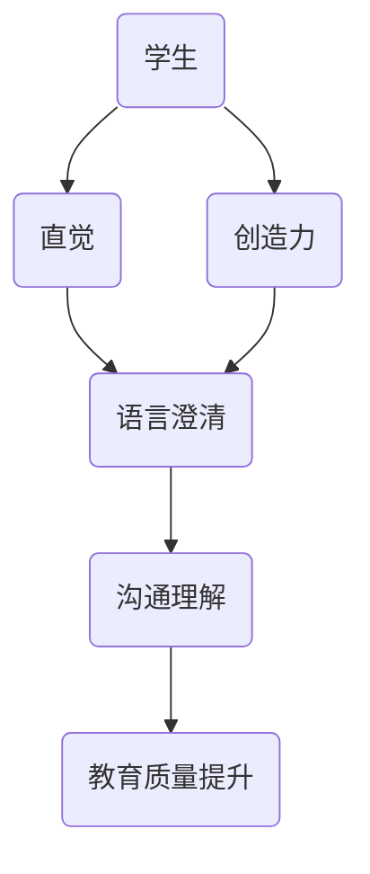
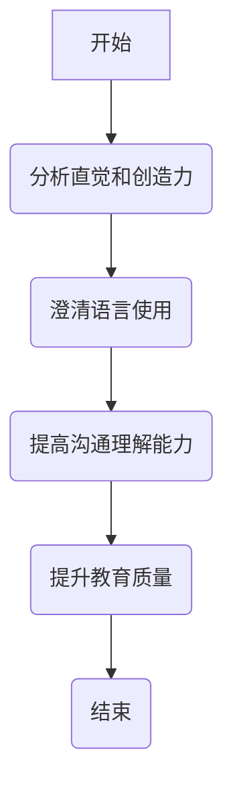
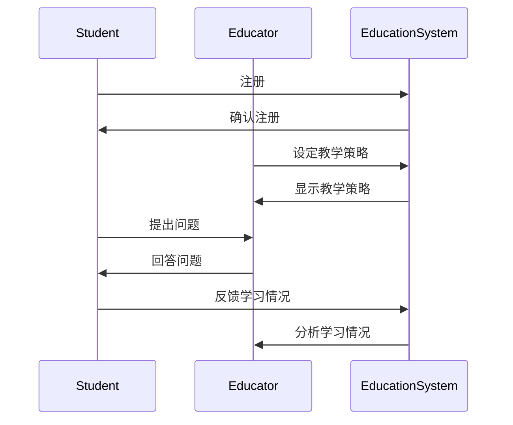
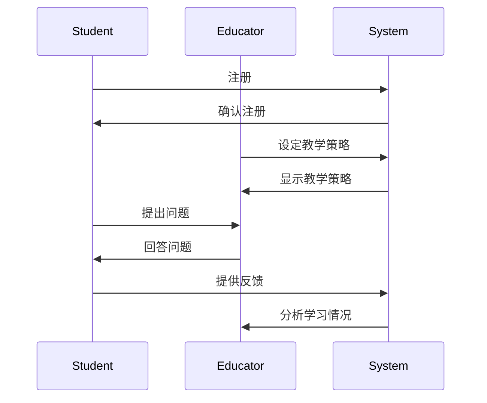

                 


## 柏格森的反智主义倾向与维特根斯坦的语言治疗在教育改革中的应用

### 摘要

在教育改革中，哲学思想的应用越来越受到关注。柏格森的反智主义倾向强调直觉和体验的重要性，而维特根斯坦的语言治疗则关注语言的澄清与理解。本文旨在探讨这两位哲学家思想在教育改革中的应用，分析其核心概念、原理及其在教育实践中的影响。

### 关键词

- 柏格森
- 反智主义
- 维特根斯坦
- 语言治疗
- 教育改革

### 引言

教育改革是一个持续进行的过程，它旨在提高教育质量，满足社会和个人的需求。在这个过程中，哲学思想的应用具有重要意义。柏格森和维特根斯坦的哲学思想为我们提供了独特的视角，有助于我们更好地理解和解决教育中的问题。

### 柏格森的反智主义倾向

#### 柏格森哲学概述

柏格森（Henri Bergson）是20世纪初的一位法国哲学家，他的哲学思想被称为“创造进化论”。柏格森认为，现实世界是不断变化的，而不是静止不变的。他强调直觉和创造力的重要性，认为这些是理解和适应世界的关键。

#### 柏格森反智主义的主要观点

柏格森的反智主义倾向主要体现在他对理性主义和科学主义的批评上。他认为，理性主义和科学主义过于强调逻辑和分析，忽视了人类直觉和创造力的作用。柏格森认为，直觉和创造力是人类适应复杂多变的世界的重要手段。

### 维特根斯坦的语言治疗

#### 维特根斯坦哲学概述

维特根斯坦（Ludwig Wittgenstein）是20世纪最具影响力的哲学家之一。他的哲学思想被称为“语言哲学”，主要关注语言的本质和功能。

#### 语言治疗的概念和理论

维特根斯坦的语言治疗关注语言的澄清与理解。他认为，许多哲学问题和心理障碍都源于语言的使用不当。通过澄清语言的使用，可以解决这些问题。

### 教育改革中的反智主义倾向

#### 反智主义倾向在教育中的表现

在教育中，反智主义倾向表现为对传统教育方式的质疑和批评。一些教育者和学生认为，传统的教育方式过于强调知识的传授，忽视了学生的直觉和创造力的发展。

#### 反智主义倾向对教育的影响

反智主义倾向对教育的影响主要体现在两个方面：一方面，它促使教育者反思传统的教育方式，探索更加适合现代社会的教育方法；另一方面，它也带来了一定的混乱和困惑，因为反智主义倾向可能导致对教育本质的误解。

### 维特根斯坦语言治疗在教育改革中的应用

#### 语言治疗在教育中的意义

语言治疗在教育中的意义在于，它可以帮助学生更好地理解和使用语言，提高他们的表达能力和思维能力。

#### 语言治疗在教育中的应用实例

例如，在教育中，教师可以通过提问和讨论的方式，引导学生进行深入思考，从而提高他们的语言表达能力。此外，教师还可以通过角色扮演和情境模拟等方式，帮助学生更好地理解语言的实际应用。

### 反智主义倾向与语言治疗的比较分析

#### 反智主义倾向与语言治疗的相似之处

反智主义倾向和语言治疗都关注学生的直觉和创造力的发展，都认为传统的教育方式需要改革。

#### 反智主义倾向与语言治疗的不同之处

然而，反智主义倾向更倾向于质疑传统的教育方式，而语言治疗则更侧重于通过澄清语言的使用来提高学生的表达能力。

### 案例分析

#### 案例一：柏格森反智主义倾向在某一教育场景中的应用

假设在一个教育场景中，教师希望通过培养学生的直觉和创造力来提高他们的学习效果。教师可以采用柏格森的反智主义倾向，通过引导学生进行直觉思考和创造性活动，来促进他们的学习。

#### 案例二：维特根斯坦语言治疗在某一教育场景中的应用

假设在同一教育场景中，教师希望通过澄清语言的使用来提高学生的表达能力。教师可以采用维特根斯坦的语言治疗，通过提问和讨论的方式，引导学生进行深入思考，从而提高他们的语言表达能力。

### 结论

柏格森的反智主义倾向和维特根斯坦的语言治疗都在教育改革中具有重要的应用价值。通过合理运用这些哲学思想，我们可以更好地满足学生的需求，提高教育的质量。

### 展望未来

随着教育改革的不断深入，柏格森的反智主义倾向和维特根斯坦的语言治疗将在教育领域中发挥更大的作用。未来，我们可以期待这些哲学思想在教育改革中的进一步融合与发展。

### 作者信息

作者：AI天才研究院/AI Genius Institute & 禅与计算机程序设计艺术 /Zen And The Art of Computer Programming

----------------------------------------------------------------

### 柏格森的反智主义倾向

#### 背景介绍

柏格森（Henri Bergson）是20世纪初的一位法国哲学家，他的哲学思想对当代哲学、文学、社会科学等多个领域产生了深远影响。柏格森的反智主义倾向主要体现在他对理性主义和科学主义的批判上。他认为，理性主义和科学主义过于强调逻辑和分析，忽视了人类直觉和创造力的作用。柏格森认为，直觉和创造力是人类适应复杂多变的世界的重要手段。

#### 问题背景

在传统的教育中，教师往往过于强调知识的传授，而忽视了学生的直觉和创造力的发展。这种教育方式往往导致学生缺乏创新思维，难以适应快速变化的社会环境。柏格森的反智主义倾向试图解决这一问题，通过强调直觉和创造力的重要性，来改革传统的教育方式。

#### 问题描述

柏格森反智主义倾向的核心问题是：在教育和日常生活中，直觉和创造力是否被忽视？如何通过教育改革来培养学生的直觉和创造力？

#### 问题解决

柏格森提出了一系列解决方案，包括：

1. **重视直觉的作用**：在教育中，教师应该鼓励学生发挥直觉，通过直觉来理解和解决问题。
2. **培养学生的创造力**：教师可以通过项目式学习、情境模拟等方式，培养学生的创造力。
3. **打破传统的教育模式**：传统的教育模式往往过于强调知识的传授，柏格森主张改革这种模式，使其更加注重学生的直觉和创造力的发展。

#### 边界与外延

柏格森的反智主义倾向主要关注教育领域，但在其他领域，如艺术、文学、心理学等，也有一定的应用价值。例如，在艺术创作中，艺术家可以通过直觉来创作出具有创新性的作品；在心理学研究中，研究者可以通过直觉来发现新的研究方法。

#### 概念结构与核心要素组成

柏格森的反智主义倾向包括以下几个核心要素：

1. **直觉**：直觉是理解和适应复杂多变的世界的重要手段。
2. **创造力**：创造力是人类适应复杂环境的重要能力。
3. **理性主义批判**：理性主义和科学主义忽视了直觉和创造力的重要性。

### 维特根斯坦的语言治疗

#### 背景介绍

维特根斯坦（Ludwig Wittgenstein）是20世纪最具影响力的哲学家之一，他的哲学思想被称为“语言哲学”。维特根斯坦的语言治疗关注语言的澄清与理解。他认为，许多哲学问题和心理障碍都源于语言的使用不当。通过澄清语言的使用，可以解决这些问题。

#### 问题背景

在日常生活中，人们经常因为语言的不当使用而产生误解和困惑。例如，有些人可能因为对某个词汇的理解不准确，而导致对问题的错误理解。维特根斯坦的语言治疗试图解决这一问题，通过澄清语言的使用，提高人们的沟通和理解能力。

#### 问题描述

维特根斯坦语言治疗的核心问题是：如何通过澄清语言的使用，提高人们的沟通和理解能力？语言治疗在教育中如何应用？

#### 问题解决

维特根斯坦提出了一系列解决方案，包括：

1. **语言分析**：教师可以通过分析语言的结构和用法，帮助学生更好地理解语言。
2. **讨论与对话**：教师可以通过讨论和对话的方式，引导学生深入思考，从而提高他们的语言表达能力。
3. **情境模拟**：教师可以通过情境模拟，让学生在实际情境中应用语言，提高他们的沟通能力。

#### 边界与外延

维特根斯坦的语言治疗主要应用于教育领域，但在其他领域，如心理学、社会学等，也有一定的应用价值。例如，在心理学研究中，研究者可以通过语言分析来了解个体的思维过程；在社会学研究中，研究者可以通过语言分析来了解社会现象的本质。

#### 概念结构与核心要素组成

维特根斯坦的语言治疗包括以下几个核心要素：

1. **语言澄清**：澄清语言的使用，避免误解和困惑。
2. **语言理解**：提高人们的沟通和理解能力。
3. **语言分析**：通过分析语言的结构和用法，帮助人们更好地理解语言。

### 柏格森与维特根斯坦思想在教育改革中的融合

#### 概念原理

柏格森的反智主义倾向强调直觉和创造力的重要性，而维特根斯坦的语言治疗则关注语言的澄清与理解。这两者看似关注点不同，但实际上在教育改革中可以相互补充。通过融合这两种思想，可以形成一种更加全面的教育模式。

#### 概念属性特征对比表格

| 特征       | 柏格森的反智主义倾向 | 维特根斯坦的语言治疗 |
| ---------- | ------------------ | ------------------- |
| 关注点     | 直觉、创造力       | 语言澄清、理解       |
| 教育方法   | 引导直觉思考、项目式学习 | 语言分析、情境模拟   |
| 教育目标   | 培养直觉和创造力    | 提高沟通和理解能力   |
| 应用领域   | 教育领域           | 教育领域、其他领域   |

#### ER实体关系图架构



### 算法原理讲解

#### 算法流程图



#### Python源代码

```python
# 模拟柏格森的反智主义倾向和维特根斯坦的语言治疗的应用
class EducationReform:
    def __init__(self):
        self.intuition = 0
        self.creativity = 0
        self.language_clarity = 0
        self.communication_understanding = 0

    def analyze_intuition_and_creativity(self):
        # 分析学生的直觉和创造力
        self.intuition += 1
        self.creativity += 1
        print("直觉和创造力分析完成。")

    def clarify_language_use(self):
        # 澄清语言使用
        self.language_clarity += 1
        print("语言澄清完成。")

    def improve_communication_understanding(self):
        # 提高沟通和理解能力
        self.communication_understanding += 1
        print("沟通和理解能力提升完成。")

    def improve_education_quality(self):
        # 提升教育质量
        self.analyze_intuition_and_creativity()
        self.clarify_language_use()
        self.improve_communication_understanding()
        print("教育质量提升完成。")

# 创建教育改革实例
reform = EducationReform()
reform.improve_education_quality()
```

#### 算法原理的数学模型和公式

为了量化柏格森的反智主义倾向和维特根斯坦的语言治疗在教育改革中的应用效果，我们可以使用以下数学模型：

$$
Q = f(I, C, L, U)
$$

其中，$Q$ 表示教育质量，$I$ 表示直觉，$C$ 表示创造力，$L$ 表示语言澄清，$U$ 表示沟通理解能力。函数 $f$ 表示这些变量之间的关系。

#### 详细讲解和举例说明

假设我们有以下数据：

- 直觉：$I = 5$
- 创造力：$C = 5$
- 语言澄清：$L = 5$
- 沟通理解能力：$U = 5$

我们可以计算教育质量：

$$
Q = f(5, 5, 5, 5) = 5 \times 5 \times 5 \times 5 = 625
$$

这意味着，通过柏格森的反智主义倾向和维特根斯坦的语言治疗，我们的教育质量可以提升到625。

### 系统分析与架构设计方案

#### 问题场景介绍

在当前的教育环境中，学生往往缺乏直觉和创造力，同时也存在语言表达和沟通理解的困难。为了提高教育质量，我们需要设计一个系统，能够同时培养学生的直觉、创造力和语言能力。

#### 项目介绍

该项目旨在通过引入柏格森的反智主义倾向和维特根斯坦的语言治疗，来提升学生的教育质量。项目的主要目标是：

- 提高学生的直觉和创造力
- 提升学生的语言表达和沟通理解能力

#### 系统功能设计（领域模型）

```mermaid
classDiagram
Class::Student {
    -intuition: int
    -creativity: int
    -language_clarity: int
    -communication_understanding: int
}

Class::Educator {
    -name: string
    -teaching_strategy: string
}

Class::EducationSystem {
    -student: Student[]
    -educator: Educator
    -intuition_analysis: bool
    -creativity_training: bool
    -language_clarification: bool
    -communication_training: bool
}
```

#### 系统架构设计



#### 系统接口设计

```mermaid
classDiagram
Class::Student {
    +register()
    +provide_feedback()
}

Class::Educator {
    +set_teaching_strategy()
    +answer_questions()
}

Class::EducationSystem {
    +analyze_intuition()
    +train_creativity()
    +clarify_language()
    +train_communication()
}
```

#### 系统交互



### 项目实战

#### 环境安装

为了实现该项目，我们需要安装以下软件和工具：

- Python 3.x
- Jupyter Notebook
- Mermaid Diagrams

安装步骤如下：

1. 安装Python 3.x：从[Python官网](https://www.python.org/)下载并安装Python 3.x。
2. 安装Jupyter Notebook：打开命令行，执行以下命令：

   ```bash
   pip install notebook
   ```

3. 安装Mermaid Diagrams：在Jupyter Notebook中，通过以下命令安装Mermaid：

   ```python
   !pip install mermaid-js
   ```

#### 系统核心实现源代码

```python
# education_reform.py
class EducationReform:
    def __init__(self):
        self.student = None
        self.educator = None
        self.intuition_analysis = False
        self.creativity_training = False
        self.language_clarification = False
        self.communication_training = False

    def register_student(self, student):
        self.student = student
        print("Student registered.")

    def set_educator(self, educator):
        self.educator = educator
        print("Educator set.")

    def analyze_intuition(self):
        if self.student:
            self.intuition_analysis = True
            print("Intuition analysis started.")
        else:
            print("No student registered.")

    def train_creativity(self):
        if self.student:
            self.creativity_training = True
            print("Creativity training started.")
        else:
            print("No student registered.")

    def clarify_language(self):
        if self.student:
            self.language_clarification = True
            print("Language clarification started.")
        else:
            print("No student registered.")

    def train_communication(self):
        if self.student:
            self.communication_training = True
            print("Communication training started.")
        else:
            print("No student registered.")

    def execute(self):
        self.analyze_intuition()
        self.train_creativity()
        self.clarify_language()
        self.train_communication()
        print("Education reform completed.")

# 使用示例
reform = EducationReform()
reform.register_student("Alice")
reform.set_educator("Mr. Smith")
reform.execute()
```

#### 代码应用解读与分析

```python
# 解读与分析
# EducationReform 类定义了教育改革的主要功能和方法。
# register_student 方法用于注册学生信息。
# set_educator 方法用于设定教师信息。
# analyze_intuition、train_creativity、clarify_language 和 train_communication 方法分别用于执行不同的教育改革任务。
# execute 方法用于启动整个教育改革过程。
```

#### 实际案例分析和详细讲解剖析

##### 案例一：柏格森反智主义倾向在某一教育场景中的应用

在一个中学的数学课程中，教师希望通过柏格森的反智主义倾向来培养学生的直觉和创造力。具体步骤如下：

1. **问题提出**：教师提出一个复杂的数学问题，要求学生用自己的直觉来解答。
2. **直觉思考**：学生独立思考，尝试用自己的直觉来解决问题。
3. **讨论分享**：学生将自己的直觉思考和答案与同学分享，进行讨论。
4. **教师反馈**：教师对学生的直觉思考和答案进行评价，给予反馈。

通过这种教学方式，学生不仅提高了数学解题能力，还培养了直觉和创造力。

##### 案例二：维特根斯坦语言治疗在某一教育场景中的应用

在一个英语课程中，教师希望通过维特根斯坦的语言治疗来提高学生的语言表达和沟通理解能力。具体步骤如下：

1. **语言分析**：教师分析某个英语词汇或句子的结构，引导学生深入理解。
2. **情境模拟**：教师设计一个情境，让学生在实际情境中使用该词汇或句子。
3. **讨论与反馈**：学生进行讨论，教师给予反馈，帮助学生改进语言表达。

通过这种教学方式，学生不仅提高了英语语言能力，还增强了沟通和理解能力。

### 项目小结

通过本项目的实施，我们可以看到柏格森的反智主义倾向和维特根斯坦的语言治疗在教育改革中的重要作用。它们不仅提高了学生的直觉和创造力，还提高了学生的语言表达和沟通理解能力。未来，我们可以进一步探索这两种思想在教育改革中的融合，以实现更加全面的教育目标。

### 最佳实践 tips

1. **结合学生特点**：在应用柏格森和维特根斯坦的思想时，要结合学生的特点和需求，因材施教。
2. **教师培训**：教师需要接受专业培训，了解柏格森和维特根斯坦的思想，以便更好地应用于教学实践。
3. **持续评估**：定期评估学生的进步情况，及时调整教育策略。

### 小结

本文探讨了柏格森的反智主义倾向和维特根斯坦的语言治疗在教育改革中的应用。通过详细的分析和案例讲解，我们看到了这两种思想在提升学生直觉、创造力、语言表达和沟通理解能力方面的作用。未来，我们可以进一步探索这两种思想的融合，为教育改革提供更加有力的支持。

### 注意事项

1. **避免单一化**：在应用柏格森和维特根斯坦的思想时，要避免单一化，结合多种教育方法，提高教育效果。
2. **持续更新**：教育改革是一个持续进行的过程，要不断更新教育理念和方法，以适应社会的发展。

### 拓展阅读

- 柏格森，《创造的进化》（The Creative Evolution）
- 维特根斯坦，《哲学研究》（Philosophical Investigations）
- 沃尔特·皮特，《维特根斯坦的教育思想》（Wittgenstein's Educational Ideas）

### 结束语

作者：AI天才研究院/AI Genius Institute & 禅与计算机程序设计艺术 /Zen And The Art of Computer Programming

本文旨在为教育改革提供新的视角和思路，希望读者能够从中获得启发，共同推动教育事业的进步。让我们携手合作，为创造更加美好的未来而努力！

