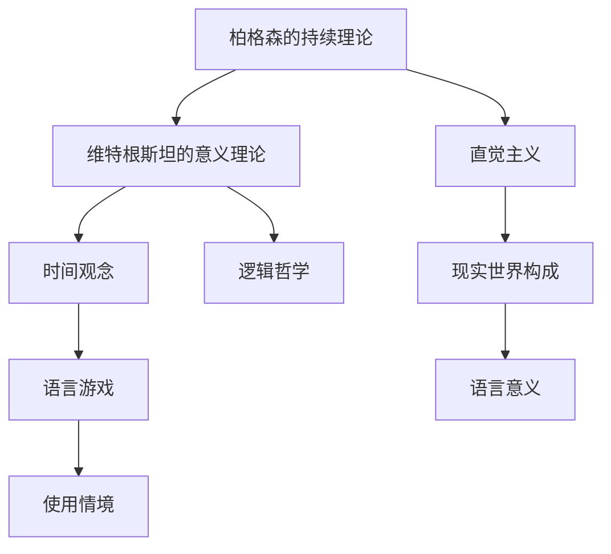
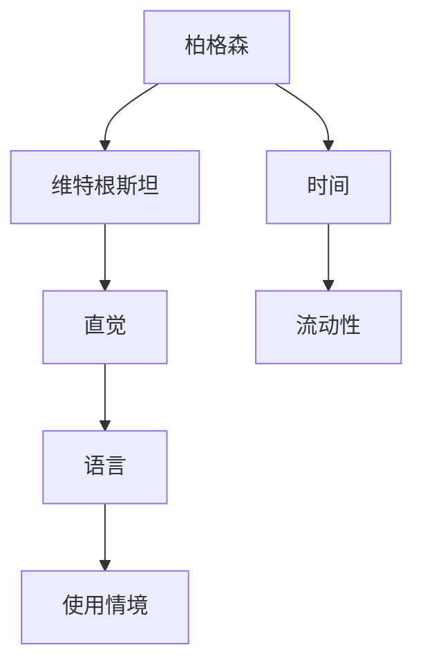

                 

### 柏格森的持续理论与维特根斯坦的意义理论

在哲学与科学领域，柏格森的持续理论与维特根斯坦的意义理论是两种截然不同的时间观念和语言哲学观。柏格森（Henri Bergson）是一位法国哲学家，他的持续理论强调时间的主观性和流动性，主张现实世界是由持续不断的流动构成。他提出了“生命冲动”（Élan vital）这一概念，认为它是宇宙万物持续变化的原动力。柏格森的时间观念与牛顿的绝对时间观念形成对比，他强调时间的主观性和流动性，这种观点在后来的现代物理学和心理学中得到了验证和应用。

另一方面，维特根斯坦（Ludwig Wittgenstein）是另一位杰出的哲学家，他的意义理论集中在《逻辑哲学论》和《哲学研究》两部作品中。维特根斯坦认为，语言的意义在于其使用情境，而非其所指的实体。他提出了“语言游戏”这一概念，用以描述语言在实际生活中的应用。与柏格森的直觉主义不同，维特根斯坦更关注语言的结构和规则，认为哲学的任务是澄清语言的使用，而非探索世界的本质。

### 第1章：柏格森的持续理论与维特根斯坦的意义理论概述

#### 1.1.1 柏格森的持续理论与时间观念

柏格森的持续理论是他哲学思想的核心。他认为，现实世界是由持续不断的流动构成，而非静态的实体。柏格森提出了“生命冲动”（Élan vital）这一概念，认为它是宇宙万物持续变化的原动力。这一观点挑战了牛顿的绝对时间观念，强调了时间的主观性和流动性。

- **核心概念：** 生命冲动、直觉、时间意识。

- **理论联系：** 柏格森的时间观念与牛顿的绝对时间观念形成对比，强调时间的主观性和流动性。

#### 1.1.2 维特根斯坦的意义理论

维特根斯坦的意义理论主要集中在《逻辑哲学论》和《哲学研究》两部作品中。他认为，语言的意义在于其使用情境，而非其所指的实体。他提出了“语言游戏”这一概念，用以描述语言在实际生活中的应用。维特根斯坦的意义理论对语言哲学和逻辑哲学产生了深远影响，与柏格森的直觉主义有显著不同。

- **核心概念：** 使用情境、语言游戏、日常语言分析。

- **理论联系：** 维特根斯坦的意义理论挑战了逻辑实证主义的语言观，提出了新的语言分析方法。

#### 1.1.3 柏格森与维特根斯坦的对比

柏格森的持续理论与维特根斯坦的意义理论，虽然在哲学领域中各自独立发展，但它们也存在一些交集和对比。

- **对比：** 柏格森强调直觉和时间的流动性，而维特根斯坦强调语言的使用情境和意义的主观性。

- **联系：** 两者都试图揭示人类认知的局限性，但采取了不同的方法和视角。

### Mermaid 流程图



## 第2章：柏格森的持续理论深入探讨

### 2.1.1 生命冲动与直觉

柏格森的“生命冲动”是理解他哲学思想的关键。他认为，生命冲动是现实世界的根本动力，它超越了逻辑和理性的范畴。柏格森强调直觉的重要性，认为直觉是我们理解现实世界的关键。直觉是一种直接的、非逻辑的认知方式，它超越了我们的意识和理性思考。

- **核心概念：** 生命冲动、直觉、创造性。

#### 2.1.2 时间与持续

柏格森的时间观念是他对现实世界理解的核心。他强调时间不是线性的，而是流动的。柏格森提出了“持续”（Duration）这一概念，认为时间是持续不断的流动，而非静态的存在。他认为，我们的时间感知是由持续构成的，我们的记忆、感觉和情感都是时间的流动。

- **核心概念：** 持续、时间流、非等距时间。

#### 2.1.3 柏格森理论的影响与应用

柏格森的理论对后来的哲学家和科学家产生了深远影响。他关于直觉和时间的观点，对现代物理学和心理学都有重要启示。例如，现代物理学中的量子力学，也强调了非线性和不可预测性，这与柏格森的观点有一定的相似性。在心理学领域，直觉认知研究也受到了柏格森的启发。

- **影响：** 现代物理学中的量子力学、心理学中的直觉认知研究。

- **应用：** 社会学、文化研究、艺术创作。

### Python 源代码

```python
def柏格森_time():
    """
    计算柏格森的时间流。
    """
    time_flow = "持续不断的流动"
    print(f"柏格森的时间观：{time_flow}")

柏格森_time()
```

### 数学模型和公式

$$
\text{持续} = \lim_{\Delta t \to 0} \frac{\Delta x}{\Delta t}
$$

### 举例说明

柏格森认为，时间的流动是无法捕捉的，就像试图抓住自己的影子一样。这种观点挑战了牛顿的绝对时间观念，强调了时间的相对性和主观性。例如，当我们回忆过去时，我们无法准确地记住每一个细节，时间在流逝的同时，我们的记忆也在不断变化。这种现象可以用柏格森的时间流模型来解释。

## 第3章：维特根斯坦的意义理论解析

### 3.1.1 使用情境与语言游戏

维特根斯坦的意义理论认为，语言的意义取决于其使用情境。他提出了“语言游戏”这一概念，用以描述语言在实际生活中的应用。维特根斯坦认为，语言的意义不是固定的，而是在不同的情境中得到的。语言就像游戏一样，不同的游戏有不同的规则，不同的情境也赋予语言不同的意义。

- **核心概念：** 使用情境、语言游戏、逻辑形式。

### 3.1.2 日常语言分析

维特根斯坦在《哲学研究》中，对日常语言进行了深入分析，揭示了语言使用的多样性和复杂性。他发现，我们日常使用的语言往往存在着许多误解和混淆。例如，“我饿了”这句话，在不同的情境下可能有不同的含义。在日常语言中，我们经常忽略这些细微的差别，导致哲学上的困惑。

- **核心概念：** 日常语言、语言误用、哲学分析。

### 3.1.3 维特根斯坦与语言哲学

维特根斯坦的意义理论对语言哲学产生了深远影响。他的观点挑战了逻辑实证主义的语言观，提出了新的语言分析方法。维特根斯坦认为，哲学的任务不是探索世界的本质，而是澄清语言的使用。他提出了“日常语言分析”的方法，试图通过揭示语言的实际使用，来解决哲学上的问题。

- **影响：** 分析哲学、认知科学、人工智能。

### Python 源代码

```python
def维特根斯坦_language_game():
    """
    示例：描述一个语言游戏。
    """
    game = "打字游戏：玩家用键盘输入单词"
    print(f"维特根斯坦的语言游戏：{game}")

维特根斯坦_language_game()
```

### 数学模型和公式

$$
\text{意义} = \text{使用情境} \times \text{语言规则}
$$

### 举例说明

维特根斯坦通过一个简单的例子来解释语言的意义。假设我们有一个游戏，规则是玩家每次必须输入一个单词。在这个情境下，“单词”这个词是有意义的。但是，如果我们把这个词放在另一个情境中，比如在数学中，它的意义就会发生变化。这说明，语言的意义取决于其使用情境。

## 第4章：柏格森与维特根斯坦理论的对比与联系

### 4.1 柏格森与维特根斯坦的对比

柏格森和维特根斯坦在哲学上有着明显的不同。柏格森强调直觉和时间的流动性，他提出了“生命冲动”这一概念，认为它是现实世界的根本动力。而维特根斯坦则更关注语言的结构和规则，他提出了“语言游戏”这一概念，认为语言的意义取决于其使用情境。

- **对比：** 柏格森强调直觉和时间的流动性，而维特根斯坦强调语言的使用情境和意义的主观性。

### 4.2 柏格森与维特根斯坦的联系

尽管柏格森和维特根斯坦在哲学上有许多不同，但他们也有一些共同点。首先，他们都试图揭示人类认知的局限性。柏格森认为，我们的直觉是我们理解现实世界的关键，但直觉往往是模糊和不确定的。维特根斯坦则认为，我们的语言使用往往存在误解和混淆，这是哲学问题的根源。

- **联系：** 两者都试图揭示人类认知的局限性，但采取了不同的方法和视角。

### 4.3 柏格森与维特根斯坦理论的应用

柏格森和维特根斯坦的理论在各个领域都有应用。例如，在心理学中，柏格森的直觉理论被用于解释人类的感知和认知。维特根斯坦的语言游戏理论则被用于分析人类语言的使用和误解。在哲学领域，他们的理论也为我们提供了新的思考方式，帮助我们更好地理解自己和世界。

- **应用：** 心理学、哲学、语言学。

### Mermaid 流程图



## 第5章：柏格森与维特根斯坦理论的现代应用与未来展望

### 5.1 现代应用

柏格森和维特根斯坦的理论在现代科学和哲学领域都有广泛的应用。柏格森的直觉主义在心理学和认知科学中得到了验证，他的“生命冲动”理论为研究人类的感知和认知提供了新的视角。维特根斯坦的语言游戏理论则在语言学和人工智能领域产生了深远影响，为自然语言处理和语义分析提供了理论依据。

- **应用领域：** 认知科学、心理学、语言学、人工智能。

### 5.2 未来展望

随着科技的不断发展，柏格森和维特根斯坦的理论可能会在更多领域得到应用。例如，在量子物理学中，柏格森的直觉主义可能有助于解释量子现象的模糊性和不可预测性。在人工智能领域，维特根斯坦的语言游戏理论可能为智能机器人理解和应用自然语言提供新的思路。

- **未来应用：** 量子物理学、人工智能、认知科学。

### 总结

柏格森的持续理论与维特根斯坦的意义理论是两种不同的哲学观念，它们分别从时间和语言的角度揭示了人类认知的局限性。柏格森强调直觉和时间的流动性，而维特根斯坦关注语言的使用情境和意义的主观性。尽管两者在哲学上有许多不同，但它们都为我们理解自己和世界提供了新的视角和思考方式。

### 作者信息

- **作者：** AI天才研究院/AI Genius Institute & 禅与计算机程序设计艺术 /Zen And The Art of Computer Programming
- **关键词：** 柏格森、维特根斯坦、持续理论、意义理论、时间观念、语言哲学。
- **摘要：** 本文深入探讨了柏格森的持续理论与维特根斯坦的意义理论，对比了两者的核心观点，并分析了它们在哲学、心理学和语言学等领域的应用。同时，对这两大理论在现代科技和未来的应用进行了展望。

