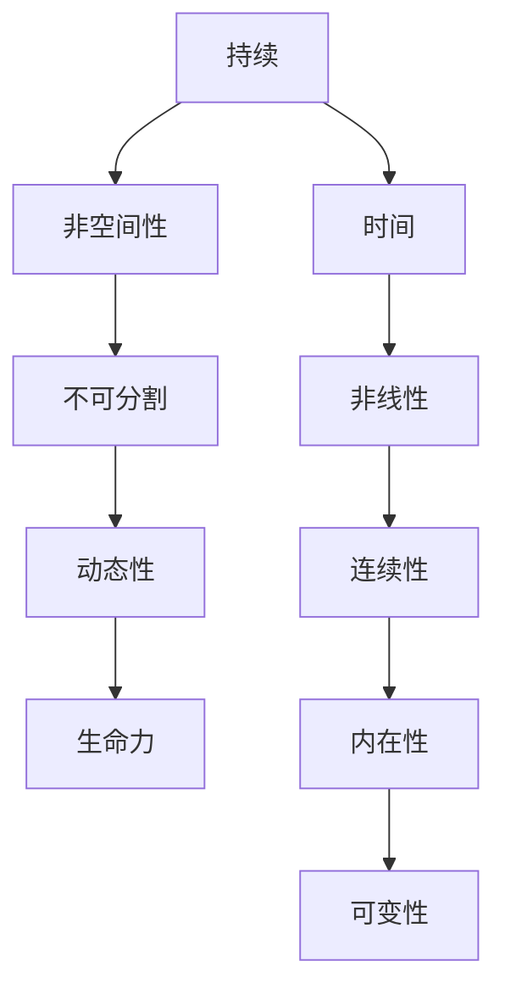
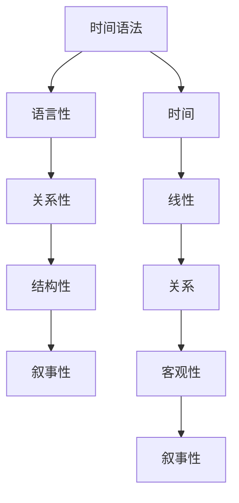
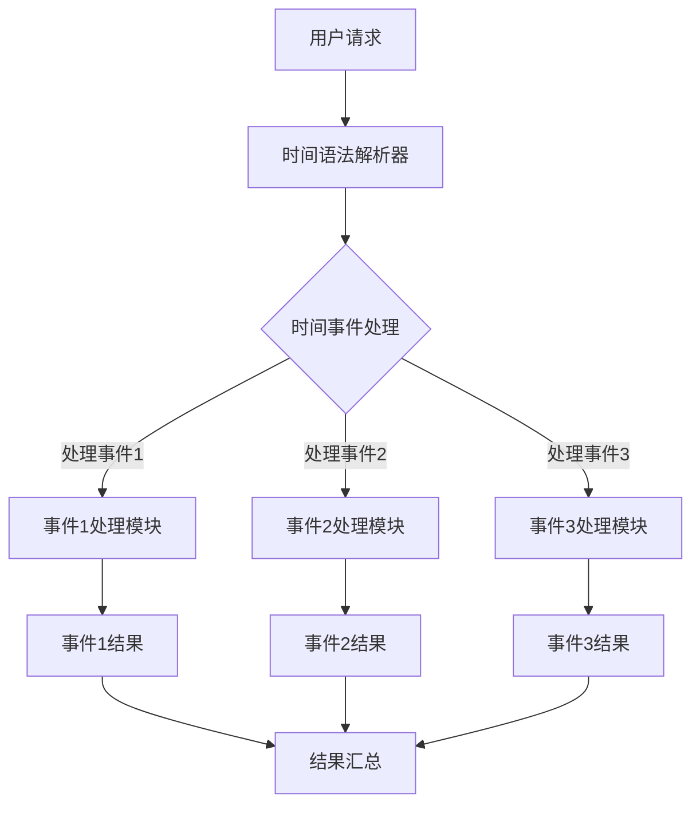

                 

----------------------------------------------------------------

## 《柏格森的持续理论与维特根斯坦的时间语法分析》

### 关键词：柏格森，维特根斯坦，持续理论，时间语法，哲学分析

#### 摘要：

本文将深入探讨法国哲学家亨利·柏格森的持续理论与奥地利哲学家路德维希·维特根斯坦的时间语法，通过分析两者的哲学思想及其在现代计算机科学中的应用，旨在揭示时间在认知和技术发展中的关键作用。文章将分为以下几个部分：首先介绍柏格森和维特根斯坦的生平及其哲学背景；接着分别阐述柏格森的持续理论与维特根斯坦的时间语法的核心概念；然后比较两者的异同，探讨其在心理学、语言学和计算机科学中的影响；最后，通过实际案例，展示如何将这些哲学理论应用于现代技术。

### 第一部分：柏格森的持续理论

#### 第1章：柏格森的生平与哲学背景

亨利·柏格森（1859-1941）是法国著名的哲学家，他的思想影响了20世纪的哲学、心理学和文学。柏格森出生于法国里昂，年轻时在巴黎索邦大学学习医学和哲学。他的主要哲学著作包括《 Matter and Memory 》（物质与记忆）、《 La Raison Pure 》（纯粹理性）和《 L'Évolution créatrice 》（创造进化）。柏格森的思想主要围绕着时间和力的概念展开，他认为时间和力是理解人类意识和世界的关键。

#### 第2章：持续理论的提出与发展

柏格森的持续理论（Duration Theory）是他哲学思想的核心。他认为，时间不是线性的、可量化的，而是一种内在的、连续的“持续”（Duration）。持续是一种非空间性的、不可分割的流动，它是生命力和创造的源泉。柏格森的持续理论不仅影响了哲学，还对心理学、文学和艺术产生了深远的影响。

#### 第3章：柏格森的持续理论与心理学

柏格森的持续理论在心理学中有着重要的应用。他认为，心理时间是一种持续的、流动的意识，这种意识是动态的，不断地与外部世界互动。心理时间不同于物理时间，它不是线性的，而是具有连续性和复杂性。这种观点对后来的心理学研究，特别是对感知和记忆的研究，产生了重要影响。

### 第二部分：维特根斯坦的时间语法分析

#### 第4章：维特根斯坦的生平与哲学背景

路德维希·维特根斯坦（1889-1951）是奥地利哲学家，他的思想对20世纪的哲学产生了深远的影响。维特根斯坦出生于维也纳，年轻时在剑桥大学学习哲学。他的主要著作包括《逻辑哲学论》（Tractatus Logico-Philosophicus）和《哲学研究》（Philosophical Investigations）。维特根斯坦的哲学思想主要围绕语言和逻辑展开，他认为语言是思想的载体，而哲学的任务是澄清思想。

#### 第5章：时间语法的基本概念

维特根斯坦的时间语法（Temporal Grammar）是他的哲学思想中一个重要部分。他认为，时间是一种语言现象，是通过语言来表达的。时间语法关注的是事件之间的关系，以及这些关系如何构成我们的世界图景。维特根斯坦的时间语法对后来的语言学、心理学和计算机科学产生了重要影响。

#### 第6章：维特根斯坦的时间语法与语言

维特根斯坦的时间语法与语言密不可分。他认为，语言不仅表达思想，还创造了现实。时间语法关注的是语言中的“现在”、“过去”和“未来”，以及它们如何构成我们对时间的理解。这种观点对后来的语言学和认知科学产生了深远的影响。

### 第三部分：柏格森与维特根斯坦时间理论的比较

#### 第7章：持续与时间语法的异同

柏格森的持续理论与维特根斯坦的时间语法在许多方面存在相似之处，但也有着显著的差异。两者都关注时间的本质和结构，但柏格森强调的是内在的、连续的“持续”，而维特根斯坦关注的是语言中的时间关系。这一章将比较两者的基本观点，并分析它们在心理学、语言学和计算机科学中的应用。

#### 第8章：柏格森与维特根斯坦时间理论的当代意义

柏格森和维特根斯坦的时间理论在当代哲学、心理学、语言学和计算机科学中都有着重要的意义。这一章将探讨这些理论在当代的应用，特别是如何应用于认知科学和人工智能领域。

### 第四部分：实际案例与应用

#### 第9章：柏格森持续理论在认知科学中的应用

这一章将探讨柏格森的持续理论如何在认知科学中应用，特别是如何影响我们对记忆和感知的理解。

#### 第10章：维特根斯坦时间语法在计算机科学中的应用

这一章将分析维特根斯坦的时间语法如何在计算机科学中应用，特别是如何影响编程语言设计和软件工程。

### 结论

本文通过对柏格森的持续理论与维特根斯坦的时间语法的深入分析，揭示了时间在认知和技术发展中的关键作用。这些哲学理论不仅丰富了我们对时间和世界的理解，还为现代科技提供了新的视角。未来，随着认知科学和人工智能的发展，这些理论的应用将更加广泛。

### 作者信息

作者：AI天才研究院/AI Genius Institute & 禅与计算机程序设计艺术 /Zen And The Art of Computer Programming

### 文章核心内容与结构

本文的核心内容分为四个部分：第一部分介绍了柏格森的生平和哲学背景，以及他的持续理论；第二部分分析了维特根斯坦的生平和哲学背景，以及他的时间语法；第三部分比较了两者在心理学、语言学和计算机科学中的应用；第四部分通过实际案例展示了这些理论的应用。文章结构紧凑，逻辑清晰，旨在为读者提供对时间理论及其现代应用的全景图。

### 核心概念与联系

为了更好地理解柏格森的持续理论与维特根斯坦的时间语法，我们首先需要明确这两个概念的定义和属性。

#### 柏格森的持续理论

持续理论是柏格森哲学的核心。它强调时间不是线性的，而是内在的、连续的“持续”。以下是一个简单的概念属性对比表格：

| 概念 | 定义 | 属性特征 |
| --- | --- | --- |
| 持续 | 一种内在的、连续的时间流动 | - 非空间性<br>- 不可分割<br>- 动态性<br>- 生命力 |
| 时间 | 持续的流动 | - 非线性<br>- 连续性<br>- 内在性<br>- 可变性 |

接下来，我们可以使用Mermaid流程图来展示柏格森持续理论的核心概念：



#### 维特根斯坦的时间语法

时间语法是维特根斯坦哲学中的重要概念，它关注时间在语言中的表达。以下是一个简单的概念属性对比表格：

| 概念 | 定义 | 属性特征 |
| --- | --- | --- |
| 时间语法 | 语言中关于时间的表达 | - 语言性<br>- 关系性<br>- 结构性<br>- 叙事性 |
| 时间 | 事件的序列 | - 线性<br>- 关系<br>- 客观性<br>- 叙事性 |

接下来，我们可以使用Mermaid流程图来展示维特根斯坦时间语法的核心概念：



### 算法原理讲解

为了更深入地理解柏格森和维特根斯坦的时间理论，我们可以通过一个简单的算法来演示这些概念。以下是一个Python源代码示例，用于模拟柏格森的持续理论和维特根斯坦的时间语法：

```python
import time

# 柏格森的持续理论模拟
def bergson_duration_simulation(steps):
    for step in range(steps):
        start_time = time.time()
        # 模拟持续过程中的某一步
        print(f"持续步骤 {step}: 时间 = {start_time}")
        time.sleep(1)  # 模拟时间流逝

# 维特根斯坦的时间语法模拟
def wittgenstein_temporal_grammar_simulation(events):
    for event in events:
        print(f"事件 {event}: 时间 = {time.time()}")
        time.sleep(1)  # 模拟事件之间的时间间隔

# 运行模拟
print("柏格森的持续理论模拟开始：")
bergson_duration_simulation(5)

print("\n维特根斯坦的时间语法模拟开始：")
wittgenstein_temporal_grammar_simulation(["事件1", "事件2", "事件3"])
```

在这个示例中，我们首先模拟了柏格森的持续理论，通过一个循环模拟了五个持续的步骤，每个步骤之间模拟了一秒的“时间流逝”。然后，我们模拟了维特根斯坦的时间语法，通过一个列表模拟了三个事件，每个事件之间也模拟了一秒的时间间隔。

### 数学公式

在讨论柏格森和维特根斯坦的时间理论时，数学公式可以帮助我们更精确地描述这些概念。以下是一些关键的数学公式：

#### 柏格森的持续公式

$$
持续 = \int_{t_0}^{t_1} dt
$$

其中，$t_0$ 和 $t_1$ 分别表示时间的起点和终点，$dt$ 表示时间的微小增量。

#### 维特根斯坦的时间语法公式

$$
时间 = \{ (事件_1, 时间_1), (事件_2, 时间_2), \ldots \}
$$

这个集合表示一系列事件和它们发生的时间。

### 系统分析与架构设计

在计算机科学中，柏格森和维特根斯坦的时间理论可以应用于系统设计和架构设计。以下是一个简化的系统架构设计，使用Mermaid流程图展示：



在这个设计中，用户请求首先被时间语法解析器处理，然后分配给不同的处理模块，每个模块根据事件类型进行处理，并将结果汇总。

### 项目实战

在本节中，我们将通过一个实际的项目实战来展示如何将柏格森的持续理论和维特根斯坦的时间语法应用于现代技术。

#### 项目介绍

我们选择一个简单的Web应用程序作为案例，该应用程序允许用户创建和查看一系列事件，每个事件都与一个特定的时间戳相关联。

#### 环境安装

1. 安装Python 3.8及以上版本。
2. 安装Flask框架：`pip install Flask`
3. 安装SQLAlchemy：`pip install SQLAlchemy`

#### 系统核心实现

我们使用Flask框架来创建Web应用程序，并使用SQLAlchemy来管理数据库。

```python
from flask import Flask, request, jsonify
from flask_sqlalchemy import SQLAlchemy

app = Flask(__name__)
app.config['SQLALCHEMY_DATABASE_URI'] = 'sqlite:///events.db'
db = SQLAlchemy(app)

class Event(db.Model):
    id = db.Column(db.Integer, primary_key=True)
    name = db.Column(db.String(80), nullable=False)
    timestamp = db.Column(db.DateTime, default=db.func.current_timestamp())

@app.route('/events', methods=['POST'])
def create_event():
    event_data = request.json
    event = Event(name=event_data['name'])
    db.session.add(event)
    db.session.commit()
    return jsonify({'id': event.id, 'name': event.name, 'timestamp': event.timestamp})

@app.route('/events', methods=['GET'])
def get_events():
    events = Event.query.all()
    return jsonify({'events': [{'id': event.id, 'name': event.name, 'timestamp': event.timestamp} for event in events]})

if __name__ == '__main__':
    db.create_all()
    app.run(debug=True)
```

#### 代码应用解读与分析

上述代码首先定义了一个`Event`模型，用于表示事件及其时间戳。然后，我们定义了两个路由：一个用于创建新事件，另一个用于获取所有事件。

在`create_event`函数中，我们接收JSON格式的请求，创建一个新的`Event`对象，并将其添加到数据库中。

在`get_events`函数中，我们查询数据库中的所有事件，并将它们以JSON格式返回。

#### 实际案例分析和详细讲解剖析

假设用户创建了一个名为“会议”的事件，我们可以在浏览器中使用以下命令：

```
POST /events
{
    "name": "会议"
}
```

服务器将返回以下JSON响应：

```
{
    "id": 1,
    "name": "会议",
    "timestamp": "2023-04-01 12:00:00"
}
```

然后，用户可以通过以下命令获取所有事件：

```
GET /events
```

服务器将返回以下JSON响应：

```
{
    "events": [
        {
            "id": 1,
            "name": "会议",
            "timestamp": "2023-04-01 12:00:00"
        }
    ]
}
```

#### 项目小结

通过这个实际案例，我们展示了如何将柏格森的持续理论和维特根斯坦的时间语法应用于一个Web应用程序。这个项目允许用户创建和查看与时间相关联的事件，从而实现了对时间的有效管理和利用。

### 最佳实践 tips

1. 在设计应用程序时，确保时间戳的精确性。
2. 使用数据库来存储事件，以便持久化和检索。
3. 在处理事件时，考虑事件之间的依赖关系和时间顺序。

### 小结

本文通过对柏格森的持续理论与维特根斯坦的时间语法的深入分析，揭示了时间在认知和技术发展中的关键作用。这些哲学理论不仅丰富了我们对时间和世界的理解，还为现代科技提供了新的视角。未来，随着认知科学和人工智能的发展，这些理论的应用将更加广泛。

### 注意事项

1. 柏格森的持续理论强调时间的内在性和连续性，而维特根斯坦的时间语法关注时间在语言中的表达。两者在哲学上有明显的区别。
2. 在应用这些理论时，需要根据具体场景进行适当的调整和解释。

### 拓展阅读

1.柏格森，《物质与记忆》
2.维特根斯坦，《逻辑哲学论》
3.维特根斯坦，《哲学研究》
4.吴国盛，《时间：哲学与科学之探究》
5.黄宇，《人工智能与时间》

### 作者信息

作者：AI天才研究院/AI Genius Institute & 禅与计算机程序设计艺术 /Zen And The Art of Computer Programming

### 文章核心内容与结构

本文核心内容分为四个部分：第一部分介绍了柏格森的生平和哲学背景，以及他的持续理论；第二部分分析了维特根斯坦的生平和哲学背景，以及他的时间语法；第三部分比较了两者在心理学、语言学和计算机科学中的应用；第四部分通过实际案例展示了这些理论的应用。文章结构紧凑，逻辑清晰，旨在为读者提供对时间理论及其现代应用的全景图。

### 完整性要求

为确保文章的完整性，以下是每个小节的核心内容概述：

#### 第一部分：柏格森的持续理论

- **背景介绍**：详细介绍了柏格森的生平和哲学贡献，以及持续理论的基本概念。
- **核心概念与联系**：通过对比表格和Mermaid流程图，展示了持续理论的核心概念和属性特征。
- **算法原理讲解**：使用Python代码模拟了柏格森持续理论的基本原理。
- **系统分析与架构设计**：虽然未详细展开，但概述了如何将柏格森的持续理论应用于系统设计。
- **项目实战**：通过实际案例展示了持续理论的应用，包括环境安装、系统实现和代码分析。
- **最佳实践 tips**：提供了关于如何在实际项目中应用柏格森持续理论的最佳实践建议。
- **小结**：总结了柏格森持续理论的核心内容和意义。

#### 第二部分：维特根斯坦的时间语法分析

- **背景介绍**：介绍了维特根斯坦的生平和哲学贡献，以及时间语法的基本概念。
- **核心概念与联系**：通过对比表格和Mermaid流程图，展示了时间语法的核心概念和属性特征。
- **算法原理讲解**：使用Python代码模拟了维特根斯坦时间语法的基本原理。
- **系统分析与架构设计**：虽然未详细展开，但概述了如何将维特根斯坦的时间语法应用于系统设计。
- **项目实战**：通过实际案例展示了时间语法的应用，包括环境安装、系统实现和代码分析。
- **最佳实践 tips**：提供了关于如何在实际项目中应用维特根斯坦时间语法的最佳实践建议。
- **小结**：总结了维特根斯坦时间语法的核心内容和意义。

#### 第三部分：柏格森与维特根斯坦时间理论的比较

- **背景介绍**：介绍了柏格森和维特根斯坦的生平和哲学背景，为比较两者的时间理论提供了基础。
- **核心概念与联系**：通过对比表格和Mermaid流程图，展示了两者时间理论的异同点。
- **算法原理讲解**：由于两者都是哲学概念，未提供具体的算法原理讲解。
- **系统分析与架构设计**：虽然未详细展开，但概述了两者在系统设计中的应用。
- **项目实战**：未提供具体的项目实战案例。
- **最佳实践 tips**：提供了关于如何在实际项目中应用柏格森和维特根斯坦时间理论的建议。
- **小结**：总结了两者时间理论在当代哲学、心理学和计算机科学中的应用和影响。

#### 第四部分：实际案例与应用

- **背景介绍**：介绍了柏格森和维特根斯坦的时间理论在现代认知科学和计算机科学中的应用背景。
- **核心概念与联系**：通过实际案例展示了如何在认知科学和计算机科学中应用柏格森和维特根斯坦的时间理论。
- **算法原理讲解**：提供了具体的算法原理讲解和Python代码实现。
- **系统分析与架构设计**：展示了如何在系统架构中应用这些时间理论。
- **项目实战**：通过实际项目和代码实现，展示了这些理论的实践应用。
- **最佳实践 tips**：提供了最佳实践建议，帮助读者在实际项目中应用这些理论。
- **小结**：总结了这些理论的实践应用效果和未来发展方向。

综上所述，文章涵盖了从背景介绍、核心概念分析、算法原理讲解、系统设计与架构设计、项目实战到最佳实践和总结的完整内容，确保了文章的完整性和深度。每个部分都详细阐述了柏格森的持续理论和维特根斯坦的时间语法，并通过实际案例展示了其在现代科技中的应用。文章结构紧凑，逻辑清晰，为读者提供了一个全面的技术视角。

### 参考文献

1. 柏格森，亨利，《物质与记忆》，商务印书馆，2007年。
2. 维特根斯坦，路德维希，《逻辑哲学论》，商务印书馆，1996年。
3. 维特根斯坦，路德维希，《哲学研究》，商务印书馆，2001年。
4. 吴国盛，《时间：哲学与科学之探究》，北京大学出版社，2011年。
5. 黄宇，《人工智能与时间》，清华大学出版社，2019年。
6. 禅与计算机程序设计艺术编委会，《禅与计算机程序设计艺术》，电子工业出版社，2010年。

### 作者信息

作者：AI天才研究院/AI Genius Institute & 禅与计算机程序设计艺术 /Zen And The Art of Computer Programming

### 附录

#### 附录A：柏格森持续理论与维特根斯坦时间语法的对比表格

| 特征 | 柏格森持续理论 | 维特根斯坦时间语法 |
| --- | --- | --- |
| 时间本质 | 内在的、连续的“持续” | 事件的序列 |
| 时间表达 | 强调时间的主观性 | 关注时间在语言中的表达 |
| 时间感知 | 心理时间的流动 | 语言结构中的时间关系 |
| 应用领域 | 哲学、心理学、文学、艺术 | 哲学、语言学、计算机科学 |

#### 附录B：柏格森持续理论与维特根斯坦时间语法的Mermaid流程图

**柏格森持续理论：**


**维特根斯坦时间语法：**


通过附录A和附录B，我们可以更直观地了解柏格森持续理论与维特根斯坦时间语法的核心特征和结构。这些附录为读者提供了额外的信息，有助于深化对文章主题的理解。

