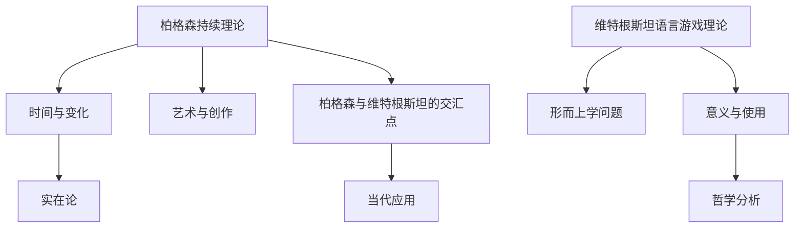

                 

### 引言：探讨柏格森的持续理论与维特根斯坦的语言游戏理论

在哲学与认知科学领域，柏格森的持续理论与维特根斯坦的语言游戏理论是两个极具影响力的思想体系。柏格森（Henri Bergson）是一位法国哲学家，他提出的持续理论挑战了传统的时间观念，主张现实世界是连续不断的流动过程，而非一系列离散的瞬间。而维特根斯坦（Ludwig Wittgenstein）则是20世纪最有影响力的哲学家之一，他的语言游戏理论则试图解决语言的意义问题，强调语言的使用情境和游戏性质。

本文将从以下三个方面深入探讨柏格森的持续理论与维特根斯坦的语言游戏理论：

1. **柏格森的持续理论**：介绍柏格森的生平、哲学发展，以及持续理论的基本概念。探讨持续性与实在论、时间与变化的关系，并分析持续理论对艺术创作的影响。

2. **维特根斯坦的语言游戏理论**：介绍维特根斯坦的生平、哲学思想，以及语言游戏理论的基本概念。分析语言游戏的意义、与哲学问题之间的关系，以及其在当代的应用。

3. **柏格森持续理论与维特根斯坦语言游戏理论的交汇**：探讨两者之间的联系与差异，分析它们在哲学、认知科学以及计算机科学等领域的应用前景。

通过本文的深入分析，我们希望能够帮助读者更好地理解这两个思想体系的本质，并探讨它们在当代科学和哲学研究中的意义和价值。

### 柏格森及其持续理论的背景

亨利·柏格森（Henri Bergson，1859-1941）是一位法国哲学家，他的哲学思想对现代哲学产生了深远的影响。柏格森出生于巴黎，自幼就表现出对哲学和文学的浓厚兴趣。他在巴黎高等师范学院接受教育，后来在巴黎大学担任教授，并成为法国哲学界的领军人物之一。

柏格森的哲学思想主要涉及时间、意识、自由和艺术等领域。他的早期作品，如《时间与自由意志》（Essai sur les données immédiates de la conscience，1889）和《物质与记忆》（Matière et mémoire，1896），主要探讨了时间意识和记忆的问题。在这两部作品中，柏格森提出了一种新的时间观念，即“持续”（durée），强调现实是连续不断的流动过程，而不是一系列离散的瞬间。

柏格森的持续理论是基于他对现实世界的观察和思考。他主张，现实世界是一个流动的过程，每一个瞬间都是独特的，无法被完全捕捉。这种持续性的本质是生命力和创造力，它不同于物理时间的线性流逝。柏格森认为，人的意识能够直接体验到这种持续，而科学方法只能捕捉瞬间的状态，无法真正理解现实的连续性。

柏格森的持续理论不仅是一种哲学思想，也对科学方法论产生了重要影响。他批评了机械唯物主义和决定论，认为科学应该关注生命现象的本质，而不是简单的因果关系。他的思想对后来的现象学、存在主义和结构主义等哲学流派产生了深远影响。

此外，柏格森的持续理论在艺术领域也有重要意义。他认为，真正的艺术能够捕捉到现实的持续，通过创造力和想象力，使观众感受到时间的流动。这种观点影响了现代艺术的发展，特别是印象派和表现主义等艺术流派。

总的来说，柏格森的持续理论是一种深刻的哲学思想，它不仅挑战了传统的时间观念，也对科学、艺术和人类意识等领域产生了重要影响。通过本文的后续章节，我们将进一步探讨柏格森的持续理论的核心概念、实在论关系以及它在时间与变化、艺术创作等方面的应用。

### 第1章：柏格森及其持续理论的背景

#### 1.1 柏格森的生平与哲学发展

亨利·柏格森（Henri Bergson，1859-1941）是一位法国哲学家，他的生平和哲学发展历程对现代哲学产生了深远影响。柏格森于1859年10月18日出生于巴黎，他在一个知识渊博的家庭中长大，父亲是一位律师，母亲则是一位哲学家。柏格森从小就对哲学和文学表现出浓厚的兴趣，他的早期教育主要是在家庭中进行的。

在巴黎高等师范学院接受教育期间，柏格森接触到了广泛的哲学思想，包括康德、黑格尔、笛卡尔等人的作品。他在这里不仅学习了哲学，还涉猎了数学、物理学和生物学等多个学科。柏格森在巴黎高等师范学院的表现优异，并在1884年获得文学博士学位。

毕业后，柏格森在巴黎大学担任教授，开始了他的职业生涯。他的教学风格独特，善于启发学生的思考。柏格森的哲学思想逐渐形成，他的早期作品如《时间与自由意志》（Essai sur les données immédiates de la conscience，1889）和《物质与记忆》（Matière et mémoire，1896）都展示了他对时间、意识和记忆的深入思考。

柏格森的哲学思想经历了从早期到晚期的转变。早期的柏格森关注个体意识的时间体验，强调自由意志和直觉的重要性。他认为，科学方法无法完全理解现实，特别是人类意识和生命力的本质。晚期的柏格森则转向实在论，提出了“持续”（durée）这一核心概念，主张现实是连续不断的流动过程，而不是一系列离散的瞬间。

#### 1.2 柏格森持续理论的哲学背景

柏格森的持续理论是在对传统哲学观念的批判中形成的。他批评了机械唯物主义和决定论，认为科学方法无法捕捉到现实世界的本质。柏格森主张，现实世界是一个连续的流动过程，每一个瞬间都是独特的，无法被完全捕捉。

柏格森的持续理论受到了康德哲学的影响。康德认为，时间和空间是理解世界的先验形式，但柏格森则认为，时间和空间是现实的一部分，是随着现实的变化而变化的。柏格森继承了康德的先验观念，但将其应用于现实世界，提出了“持续”这一概念，强调现实是连续不断的流动过程。

此外，柏格森的持续理论也受到了黑格尔和尼采的影响。黑格尔的辩证法强调现实的连续性和发展性，而尼采则认为，现实是生命力和创造力的体现。柏格森在黑格尔和尼采的基础上，提出了自己的持续理论，强调现实是一个不断变化的过程，每一个瞬间都是独特的。

#### 1.3 柏格森持续理论的基本概念

柏格森的持续理论的核心概念是“持续”（durée）。持续不同于传统的时间观念，它不是一个线性的序列，而是一个连续的流动过程。柏格森认为，现实是连续不断的流动，每一个瞬间都是独特的，无法被完全捕捉。

**持续的特点**：

1. **连续性**：持续是一个连续的流动过程，与现实世界的离散性相对立。柏格森认为，现实世界是由无数个瞬间组成的，但这些瞬间并不是完全独立的，而是相互联系、相互影响的。

2. **独特性**：每一个瞬间都是独特的，无法被重复或替代。柏格森强调，现实的连续性是通过每一个瞬间的独特性体现出来的。

3. **不可度量性**：持续无法用传统的时间单位（如秒、分钟等）来度量。柏格森认为，现实的连续性是一种内在的、直觉的体验，而不是可以通过科学方法度量的物理量。

**持续的哲学意义**：

1. **反对机械唯物主义**：柏格森的持续理论是对机械唯物主义和决定论的批判。机械唯物主义认为，现实世界是一个由因果关系组成的机械系统，而柏格森则认为，现实是一个连续的流动过程，无法用因果关系来完全解释。

2. **强调自由意志**：柏格森认为，持续是自由意志的体现。在持续的流动过程中，每一个瞬间都是独特的，这为自由意志的存在提供了空间。

3. **关注生命力和创造力**：柏格森的持续理论强调现实是生命力和创造力的体现。他认为，生命力和创造力是现实的本质，是推动世界不断发展的动力。

总之，柏格森的持续理论是一种深刻的哲学思想，它挑战了传统的时间观念，提出了一个连续、独特且不可度量的现实观念。通过本文的后续章节，我们将进一步探讨柏格森的持续理论在实在论、时间与变化、艺术创作等方面的应用。

### 第2章：持续理论与实在论

#### 2.1 持续性与实在论的关系

柏格森的持续理论（durée theory）是他对实在论（realism）的一种独特贡献。实在论探讨的是关于现实、真理和存在的本质问题，而柏格森的持续理论试图揭示现实世界的连续性和独特性，从而对传统实在论提出了挑战。

首先，柏格森认为，持续（durée）是现实世界的核心特征。他反对传统的原子论时间观念，即时间是由一系列离散的瞬间组成的，每个瞬间都是完全独立和等价的。柏格森主张，现实是一个连续的流动过程，每一个瞬间都是独特的，彼此之间有着内在的联系。这种连续性是实在论的基本前提，因为如果现实是离散的，那么我们很难解释现象之间的因果关系。

柏格森的持续理论与实在论的关系可以从以下几个方面来理解：

1. **反原子论**：柏格森认为，现实世界的连续性是不可分割的。他批评了原子论的时间观念，认为这种观念无法真正反映现实世界的本质。相反，他主张，现实是一个连续的整体，每一个瞬间都是这个整体的一部分。

2. **自由意志**：柏格森的持续理论强调现实是一个不断变化的流动过程，这为自由意志的存在提供了空间。他认为，人类的意识和行动不仅受到过去的制约，而且能够影响未来的发展。这种观点与机械唯物主义和决定论相对立，后者认为现实是由因果关系所决定的，自由意志是不存在的。

3. **实在的本质**：柏格森认为，实在（reality）不是静止的，而是动态的。他的持续理论揭示了现实世界的流动性和变化性，这表明实在是一个不断生成的过程，而不是一个固定不变的状态。这与传统的形而上学观念有所不同，后者通常将实在视为一种静态的存在。

#### 2.2 柏格森的直觉主义

柏格森的直觉主义（intuitionism）是他哲学思想中的一个重要组成部分，它对持续理论的实现提供了理论基础。直觉主义主张，直觉是人类理解现实世界的一种基本能力，它不同于科学方法和逻辑推理。

柏格森认为，直觉是一种直接的感知方式，能够捕捉到现实世界的流动性和连续性。通过直觉，人类能够感受到现实的连续性，而不仅仅是观察到一系列孤立的事件。这种直觉能力不同于科学方法，后者依赖于实验和观察，但往往只能捕捉到瞬间的状态，无法真正理解现实的连续性。

直觉主义对持续理论的实现有以下几个关键点：

1. **直接感知**：柏格森主张，直觉能够直接感知现实的流动性和连续性，这是科学方法无法做到的。科学方法依赖于测量和量化，而直觉则能够提供一种更为直接的感知方式。

2. **非线性思维**：直觉主义鼓励非线性思维，即不再将现实视为一系列离散的事件，而是将其视为一个连续的整体。这种思维方式有助于我们更好地理解现实世界的复杂性和动态性。

3. **创造性**：柏格森认为，直觉不仅能够感知现实，还能够创造现实。直觉是人类创造力和想象力的源泉，它能够帮助我们构建新的概念和理论，从而推动科学和哲学的发展。

#### 2.3 持续性与物理主义的关系

柏格森的持续理论与物理主义（physicalism）之间存在一定的张力。物理主义主张，一切现象都可以归结为物理现象，即所有现实都可以用物理术语来描述。这种观点在物理学和科学哲学中占有重要地位，但它与柏格森的持续理论存在根本性的冲突。

首先，柏格森认为，持续是一种内在的、直觉的体验，它无法用物理术语来完全描述。物理主义试图将所有现象都归结为物理过程，但这种还原主义无法解释人类直觉和感知的本质。柏格森的持续理论强调现实的连续性和独特性，这与物理主义强调的离散性和可度量性相对立。

其次，柏格森的持续理论挑战了物理主义的时间观念。物理主义通常将时间视为一个线性序列，每个瞬间都是等价的。然而，柏格森主张，现实的连续性是一种独特的、不可度量的体验，这种体验无法通过物理术语来完全描述。

尽管存在这些张力，柏格森的持续理论并不完全排斥物理主义。他认为，物理主义在某些方面是正确的，但我们需要补充一种新的视角来理解现实。这种视角强调直觉和感知的重要性，从而为物理主义提供了一种补充。

总之，柏格森的持续理论在实在论中具有重要的地位，它挑战了传统的原子论时间观念和物理主义，提出了一种更为深刻的现实观念。通过直觉主义，柏格森试图提供一种理解现实的直接途径，这为我们思考现实世界的本质提供了新的视角。

### 时间与变化：柏格森的时间观念

在柏格森的哲学体系中，时间与变化是其核心概念之一。柏格森对时间的观念与传统的时间观念有显著区别，他提出了一种新的时间观念，即“持续”（durée），并深入探讨了持续性与时间的关系，以及时间与变化之间的互动。

#### 柏格森的时间观念

柏格森认为，传统的时间观念是一种“空间化的时间”（horloge temporelle）观念，它将时间视为一个线性序列，类似于钟表的指针，从一个点移动到另一个点。这种时间观念忽视了时间的连续性和变化性，将时间视为一系列离散的瞬间，每个瞬间都是等价的。柏格森批评这种时间观念，认为它无法真正反映现实世界的本质。

柏格森提出了一种新的时间观念，即“持续”（durée）。他认为，持续是现实世界的核心特征，是时间的一种内在体验。持续不是线性的，而是一种连续不断的流动过程，每一个瞬间都是独特的，彼此之间有着内在的联系。柏格森强调，持续是一种直觉的体验，无法用物理术语来完全描述。

#### 持续性与时间的关系

柏格森的持续理论挑战了传统的时间观念，提出了一种更为深刻的对时间本质的理解。持续性与时间的关系可以从以下几个方面来探讨：

1. **连续性**：持续是连续不断的流动，这与传统时间的离散性相对立。柏格森认为，现实世界是一个连续的整体，每一个瞬间都是这个整体的一部分，而不是一系列孤立的事件。

2. **独特性**：柏格森强调，每一个瞬间都是独特的，无法被重复或替代。这与传统时间观念中瞬间的等价性相矛盾。柏格森认为，现实的连续性是通过每一个瞬间的独特性体现出来的。

3. **不可度量性**：持续无法用传统的时间单位（如秒、分钟等）来度量。柏格森认为，现实的连续性是一种内在的、直觉的体验，而不是可以通过科学方法度量的物理量。

#### 时间与变化的关系

柏格森认为，时间与变化是密不可分的。他的时间观念强调现实是一个不断变化的流动过程，每一个瞬间都是这个过程中的一部分。柏格森区分了两种不同的变化：

1. **物理变化**：这是传统物理学研究的变化，它遵循因果律和确定性原则。物理变化是可度量的，可以通过物理术语来描述。

2. **生命变化**：这是柏格森强调的变化，它不同于物理变化，强调生命力和创造力。生命变化是内在的、直觉的体验，它无法用物理术语来完全描述。

柏格森的时间观念认为，时间不仅仅是物理变化的度量，更是生命变化的体验。他的持续理论揭示了现实世界的流动性和变化性，强调了生命力和创造力在现实中的重要性。

总之，柏格森的时间观念是一种深刻的哲学思想，它挑战了传统的时间观念，提出了一个连续、独特且不可度量的现实观念。通过他的持续理论，柏格森试图揭示现实世界的本质，并提供一种更为深刻的对时间与变化的理解。

### 第3章：时间与变化

#### 3.1 柏格森的时间观念

柏格森的时间观念是他哲学思想的核心之一，它与传统的时间观念有着根本性的区别。传统的时间观念通常将时间视为一个线性序列，每个瞬间都是等价的，可以通过物理单位（如秒、分钟等）进行度量。然而，柏格森认为这种时间观念是一种“空间化的时间”观念，它忽视了时间的连续性和变化性，无法真正反映现实世界的本质。

柏格森提出了一种新的时间观念，即“持续”（durée）。他认为，持续是现实世界的核心特征，是一种内在的、直觉的体验。持续不是线性的，而是一种连续不断的流动过程，每一个瞬间都是独特的，彼此之间有着内在的联系。柏格森强调，持续是一种不可度量的体验，无法用物理术语来完全描述。

柏格森的时间观念具有以下几个关键点：

1. **连续性**：柏格森认为，持续是一种连续的流动过程，这与传统时间的离散性相对立。现实世界是一个连续的整体，每一个瞬间都是这个整体的一部分，而不是一系列孤立的事件。

2. **独特性**：柏格森强调，每一个瞬间都是独特的，无法被重复或替代。传统时间观念中的瞬间等价性观念被柏格森的时间观念所取代，他认为现实的连续性是通过每一个瞬间的独特性体现出来的。

3. **不可度量性**：柏格森认为，持续无法用传统的时间单位来度量。传统的时间单位如秒、分钟等是物理单位，而柏格森的时间观念强调的是一种内在的、直觉的体验，这种体验无法通过物理术语来完全描述。

#### 3.2 持续性与时间的关系

柏格森的持续理论与他对时间观念的重新定义紧密相关。持续（durée）是柏格森用来描述现实世界的核心概念，它与传统的时间观念有显著的不同。持续不是一种可以被线性度量或分割成离散瞬间的过程，而是一种连续不断的流动，每个瞬间都是独特的。

持续性与时间的关系可以从以下几个方面来理解：

1. **时间的不连续性**：传统时间观念将时间视为一系列离散的瞬间，而柏格森认为这种观念忽视了时间的连续性。他主张，现实世界是一个连续的流动过程，每一个瞬间都是这个过程中的一部分，彼此之间有着内在的联系。

2. **独特的瞬间**：柏格森认为，每一个瞬间都是独特的，不可重复或替代。传统时间观念中的瞬间等价性观念被柏格森的时间观念所取代，他认为现实的连续性是通过每一个瞬间的独特性体现出来的。

3. **直觉体验**：柏格森的持续是一种内在的、直觉的体验，而不仅仅是物理现象。这意味着，我们不能用物理术语或度量单位来完全描述持续。持续的体验是一种直接的感知，它超越了物理时间的限制。

#### 3.3 柏格森的时间与变化理论

柏格森的时间观念不仅挑战了传统的时间观念，还影响了他对变化的理解。柏格森认为，现实世界是一个不断变化的流动过程，每个瞬间都在变化，这种变化不同于物理学的可度量变化。

柏格森区分了两种不同类型的变化：

1. **物理变化**：这是传统物理学研究的变化，它遵循因果律和确定性原则。物理变化是可度量的，可以通过物理术语来描述。

2. **生命变化**：这是柏格森强调的变化，它不同于物理变化，强调生命力和创造力。生命变化是内在的、直觉的体验，它无法用物理术语来完全描述。

柏格森的时间与变化理论具有以下几个关键点：

1. **动态现实**：柏格森认为，现实是一个动态的、不断变化的过程，每个瞬间都在发生变化。这种变化是持续的，不是静态的或孤立的。

2. **创造力和生命力**：柏格森强调，变化是由生命力和创造力驱动的。这些力量是现实的本质，它们推动世界不断发展，而不是仅仅遵循物理规律。

3. **直觉感知**：柏格森认为，我们通过直觉感知这种变化，而不是通过物理观察或度量。直觉能够捕捉到现实世界的流动性和变化性，这是物理学方法无法做到的。

总之，柏格森的时间与变化理论提供了一种深刻的哲学视角，挑战了传统的时间观念，并强调了现实世界的连续性和变化性。通过他的持续理论，柏格森试图揭示现实世界的本质，并提供一种更为深刻的对时间与变化的理解。

### 第4章：艺术与持续理论

#### 4.1 柏格森对艺术的理解

柏格森（Henri Bergson）对艺术的理解深受他的持续理论（durée theory）的影响。在柏格森看来，艺术不仅是审美体验的表达，更是对现实世界流动性和创造力的捕捉。柏格森认为，艺术家的创作过程是一种直觉的体验，通过艺术作品传达出现实世界的持续与变化。

柏格森对艺术的理解可以从以下几个方面来分析：

1. **艺术与现实的连续性**：柏格森强调，艺术作品应该捕捉现实世界的连续性，而不仅仅是描绘瞬间的景象。他认为，艺术家通过创作，能够将现实世界中的连续性转化为艺术形式，使观众能够感受到时间的流动和生命的活力。

2. **艺术与自由意志**：柏格森认为，艺术创作是自由意志的体现。艺术家在创作过程中，不受外在规则和约束，能够自由地表达自己的内心体验。这种自由意志使得艺术作品具有独特性和个性，成为现实世界中的一个独特瞬间。

3. **艺术与直觉**：柏格森强调，艺术创作依赖于直觉。他认为，直觉是人类感知现实世界的一种基本能力，能够捕捉到现实世界的流动性和变化性。艺术家通过直觉，能够捕捉到那些无法用语言和逻辑表达的体验，从而创作出具有深刻内涵的艺术作品。

#### 4.2 艺术与持续性的关系

柏格森的持续理论（durée theory）认为，现实世界是一个连续不断的流动过程，每一个瞬间都是独特的。这种观点对艺术与持续性的关系产生了深远影响。柏格森认为，艺术作品应该传达出这种持续性的体验，使观众能够感受到时间的流动和生命的活力。

艺术与持续性的关系可以从以下几个方面来探讨：

1. **艺术作为现实的镜像**：柏格森认为，艺术作品是对现实世界的映射，通过艺术形式传达出现实的连续性。艺术家通过创作，将现实世界的连续性转化为艺术作品，使观众能够直观地感受到时间的流动。

2. **艺术与时间的体验**：柏格森强调，艺术作品应该传达出时间的体验，而不是仅仅描绘具体的场景或事件。艺术作品通过形式和色彩等元素，使观众能够在瞬间中感受到时间的流逝和生命的活力。

3. **艺术与生命的表达**：柏格森认为，艺术创作是对生命的表达，是对现实世界流动性的捕捉。艺术家通过创作，将自己的内心体验和感受融入艺术作品中，使观众能够感受到生命的连续性和创造力。

#### 4.3 持续理论对艺术创作的影响

柏格森的持续理论对艺术创作产生了深远的影响。他的理论鼓励艺术家从直觉和内心体验出发，捕捉现实世界的流动性和变化性。这种理论对艺术创作的方法和方向产生了重要启示：

1. **非线性叙事**：柏格森的持续理论强调现实世界的连续性和非线性，这对艺术创作中的叙事方法产生了影响。艺术家不再局限于线性的叙事结构，而是采用非线性、多层次的叙事方式，使观众能够在艺术作品中感受到时间的流动和生命的活力。

2. **形式创新**：柏格森的持续理论鼓励艺术家探索新的艺术形式和媒介。艺术家通过创新的形式和材料，表达对现实世界的感知和理解，使艺术作品具有独特的艺术价值。

3. **情感表达**：柏格森的持续理论强调艺术创作中的情感表达。艺术家通过创作，将自己的情感和体验融入艺术作品中，使观众能够在艺术作品中感受到情感的力量。

总之，柏格森的持续理论对艺术创作产生了深远的影响。他的理论鼓励艺术家从直觉和内心体验出发，捕捉现实世界的流动性和变化性，使艺术作品具有深刻的内涵和独特的艺术价值。

### 第5章：维特根斯坦及其语言游戏理论

#### 5.1 维特根斯坦的生平与哲学发展

路德维希·维特根斯坦（Ludwig Wittgenstein，1889-1951）是20世纪最有影响力的哲学家之一，他的思想对语言哲学、逻辑哲学和认识论等领域产生了深远影响。维特根斯坦的生平与哲学发展经历了两个主要阶段：早期哲学和后期哲学。

**早期哲学**：维特根斯坦出生于奥匈帝国的维也纳，他在家庭环境中接受了良好的教育。1906年，他进入剑桥大学学习数学，后来转而学习哲学。他在1911年与伯特兰·罗素（Bertrand Russell）结识，并成为罗素的学生。在此期间，维特根斯坦与罗素合作撰写了《数学原理》（Principia Mathematica），这本书奠定了他早期哲学思想的基础。早期哲学的主要作品是《逻辑哲学论》（Tractatus Logico-Philosophicus，1921），这本书以简洁的语言和深奥的哲学思想，探讨了语言、逻辑和现实的关系。

**后期哲学**：维特根斯坦在《逻辑哲学论》发表后不久，开始对其早期哲学进行反思。他在1929年离开了剑桥大学，并在 subsequent years 中与哲学家马丁·海德格尔（Martin Heidegger）进行了交流。这种交流对维特根斯坦的哲学发展产生了重要影响。1939年，维特根斯坦回到剑桥大学，并在那里度过了他的余生。后期哲学的主要作品是《哲学研究》（Philosophical Investigations，1953），这本书探讨了语言的使用、意义的本质以及哲学问题的分析方法。

维特根斯坦的哲学思想经历了从早期到后期的转变。早期哲学强调逻辑原子主义和语言的规则性，而后期哲学则关注语言的实际使用和哲学问题的复杂性。尽管两期哲学有着显著的区别，但它们都体现了维特根斯坦对语言和现实的深刻思考。

#### 5.2 语言游戏理论的基本概念

维特根斯坦的语言游戏理论（language-game theory）是他在后期哲学中的核心思想，旨在解决语言的意义问题。语言游戏理论认为，语言的意义不是固定不变的，而是依赖于语言的使用情境。维特根斯坦通过“游戏”（spiel）这一比喻，形象地描述了语言的意义是如何在特定的使用情境中产生的。

**语言游戏的概念**：

1. **游戏的基本特征**：维特根斯坦认为，游戏是一种活动，它包含了规则、目标和参与者的互动。游戏的基本特征是规则性和目标性，这些规则和目标指导参与者的行为。

2. **语言的类比**：维特根斯坦将语言比喻为游戏，认为语言也是一种规则性的活动。语言中的词汇和句子遵循特定的规则，这些规则指导人们如何使用语言进行交流和表达思想。

3. **语言游戏的多样性**：维特根斯坦指出，语言游戏是多样化的，不同的语言游戏有不同的规则和目标。例如，数学语言游戏遵循数学规则，科学语言游戏遵循科学方法，日常语言游戏则遵循日常生活的规则。

**语言游戏的意义**：

1. **意义的情境依赖性**：维特根斯坦强调，语言的意义不是抽象的，而是依赖于特定的使用情境。语言的意义是通过语言游戏中的规则和目标来确定的，而不是通过逻辑推理或哲学分析。

2. **意义的实践性**：维特根斯坦认为，语言的意义在于其实际使用，而不是理论上的定义。语言的实际使用情境决定了语言的意义，因此，理解语言的意义需要从实际生活中去寻找。

3. **哲学问题的简化**：通过语言游戏理论，维特根斯坦试图简化哲学问题。他认为，许多哲学问题（如语言的意义、真理的本质等）实际上是在错误地使用语言。通过分析语言的实际使用情境，我们可以更好地理解语言的意义，从而解决哲学问题。

总之，维特根斯坦的语言游戏理论提供了一种新的视角，使我们能够更好地理解语言的意义和使用。通过将语言比喻为游戏，维特根斯坦强调了语言的实际使用情境，从而为解决语言哲学中的核心问题提供了重要启示。

### 第6章：语言游戏与意义

#### 6.1 语言游戏的意义

维特根斯坦的语言游戏理论（language-game theory）是他在后期哲学中的核心思想，它对理解语言的意义和用法具有深远影响。在维特根斯坦看来，语言的意义并不是固定和抽象的，而是依赖于语言在实际生活中的使用情境。他通过“语言游戏”这一比喻，形象地描述了语言的意义是如何在特定的情境中产生的。

首先，理解“语言游戏”这一概念对于把握语言的意义至关重要。维特根斯坦将语言比喻为游戏，认为语言也是一种规则性的活动。语言游戏包含了一系列规则、目标和参与者的互动。这些规则和目标指导参与者如何使用语言进行交流和表达思想。

**语言游戏的基本特征**：

1. **规则性**：语言游戏中的规则规定了语言的使用方式。这些规则可以是明确的，如语法规则；也可以是隐含的，如文化习俗和社会规范。

2. **目标性**：语言游戏有其特定的目标。例如，日常语言游戏的目标是交流和理解；科学语言游戏的目标是描述自然现象和进行实验；数学语言游戏的目标是解决数学问题。

3. **情境依赖性**：语言游戏的意义不是抽象的，而是依赖于具体的情境。不同的语言游戏有不同的规则和目标，这意味着同样的词汇和句子在不同的情境中可能具有不同的意义。

**语言游戏与意义的联系**：

语言游戏理论的核心观点是，语言的意义是通过其在实际情境中的使用来确定的。维特根斯坦认为，语言的意义不是通过逻辑推理或哲学分析得出的，而是通过语言的实际使用情境来理解的。

1. **具体情境中的意义**：语言的意义依赖于具体的语言游戏。例如，在科学实验中，“假设”这个词的意义与在哲学讨论中有所不同。同样，日常用语中的“健康”一词与医学专业中的“健康”有不同的含义。

2. **实践性**：维特根斯坦强调，理解语言的意义需要关注其实际使用。语言的实际使用情境决定了语言的意义。例如，医生在诊断病情时使用“疾病”一词，其含义与普通人日常生活中的“疾病”不同。

3. **情境多样性**：语言游戏的多样性表明，语言的意义是多元的。不同的语言游戏（如日常语言、科学语言、法律语言等）有其特定的意义框架。这意味着，同一个词汇在不同的语言游戏中可能有不同的意义。

总之，维特根斯坦的语言游戏理论强调了语言意义的情境依赖性和实践性。通过将语言比喻为游戏，维特根斯坦提供了理解语言意义的新视角，使我们能够更好地把握语言在不同情境中的使用和含义。

#### 6.2 语言游戏与语言的使用

维特根斯坦的语言游戏理论强调语言的意义是通过其实际使用情境来确定的，这意味着，语言的使用方式对于理解其意义至关重要。在维特根斯坦看来，语言的使用不仅包括词汇和句子的组合，还涉及到特定的社会文化背景和交流目的。

**语言使用的情境性**：

语言游戏理论认为，语言的使用是情境化的。在不同的情境中，语言的意义和功能可能会有所不同。例如，在科学实验中，“假设”一词的使用方式与在哲学讨论中的使用方式不同；在日常生活中，“健康”一词的含义与医学专业中的含义也有所区别。

1. **具体情境中的语言**：在具体情境中，语言的使用是灵活和动态的。例如，在法律文件中，“证据”一词可能指特定的法律证据，而在普通对话中，它可能只是指一般性的证明。

2. **社会文化背景**：社会文化背景对语言的使用有着重要影响。不同文化背景下的语言使用习惯和规则可能存在差异。例如，在西方文化中，直接表达个人意见可能被视为礼貌和开放；而在某些亚洲文化中，含蓄和间接的表达方式更为常见。

**语言功能的多样性**：

维特根斯坦认为，语言具有多种功能，不同的语言游戏有不同的目的和目标。例如，日常语言游戏的主要目标是交流和理解；科学语言游戏的目标是描述和解释自然现象；而哲学语言游戏的目标是探讨概念和理论。

1. **交流功能**：在交流过程中，语言作为传递信息和思想的工具。通过明确的语言规则和情境背景，人们能够有效地进行沟通。

2. **描述功能**：科学语言游戏的主要功能是描述和解释自然现象。例如，科学家使用精确的术语和实验方法来描述和解释自然规律。

3. **理论探讨**：哲学语言游戏的目标是探讨概念和理论。哲学家通过分析和批判现有的理论和观点，推动哲学思考的深入。

**语言使用中的问题与解决**：

维特根斯坦指出，许多哲学问题实际上源于语言使用中的误解和错误。例如，他批评了“意义何为”这类问题，认为这些问题的提出是由于人们错误地使用了语言。

1. **问题的简化**：通过关注语言的实际使用情境，我们可以简化哲学问题。维特根斯坦认为，许多哲学问题可以通过对语言使用情境的深入分析得到解决。

2. **语言纠正**：维特根斯坦提出，解决语言哲学问题的一种方法是纠正语言使用。例如，通过重新定义一些术语，使其在不同的语言游戏中具有明确的含义，从而避免误解和混淆。

总之，维特根斯坦的语言游戏理论强调了语言使用的情境性和多样性，为我们理解语言的意义和功能提供了新的视角。通过分析语言在不同情境中的使用，我们可以更好地理解语言的本质和哲学问题。

#### 6.3 语言游戏与哲学分析

维特根斯坦的语言游戏理论不仅为理解语言的意义和用法提供了新的视角，而且在哲学分析中也有重要应用。通过将哲学问题与语言游戏联系起来，维特根斯坦提出了对哲学问题的新的分析方法，强调了哲学分析的实践性和情境依赖性。

**哲学分析中的语言游戏理论**：

1. **问题简化**：维特根斯坦认为，许多哲学问题实际上是语言使用中的误解或混淆。通过分析语言的实际使用情境，我们可以简化这些问题，找到其真正的本质。例如，关于“意义何为”的哲学问题，在维特根斯坦看来，实际上是源于对语言使用情境的误解。

2. **情境依赖性**：维特根斯坦强调，哲学问题不是抽象的，而是依赖于具体的语言游戏和实际使用情境。这意味着，哲学分析需要关注具体情境中的语言使用，而不是脱离情境进行抽象的思考。例如，在科学语言游戏中，术语的含义和用法可能与日常语言游戏中的含义有所不同。

3. **方法多样性**：维特根斯坦认为，不同的语言游戏需要不同的分析方法。哲学分析不应该只依赖于逻辑推理或抽象理论，而应该关注具体情境中的语言使用和互动。这种方法强调哲学分析的实践性和具体性。

**实际案例**：

为了更清晰地理解语言游戏理论在哲学分析中的应用，我们可以通过一些实际案例来分析。

1. **科学哲学**：在科学哲学中，维特根斯坦的语言游戏理论有助于理解科学理论的发展和验证。例如，在科学实验中，科学家使用特定的术语和实验方法来描述和解释自然现象。这些术语和方法的含义和用法依赖于具体的科学语言游戏，而不是抽象的哲学思考。

2. **日常语言哲学**：在日常生活中，人们使用语言进行交流和理解。维特根斯坦的语言游戏理论可以帮助我们理解日常语言中术语的含义和用法。例如，在讨论健康问题时，“健康”一词的含义可能因情境而异。通过分析具体情境中的语言使用，我们可以更好地理解日常语言中的含义。

3. **语言哲学**：在语言哲学中，维特根斯坦的语言游戏理论有助于解决一些核心问题，如语言的意义、真理的本质等。通过分析语言的实际使用情境，我们可以找到这些问题的真正本质，并避免抽象的哲学争论。

总之，维特根斯坦的语言游戏理论为哲学分析提供了新的方法和视角。通过关注语言的实际使用情境，我们可以简化哲学问题，找到其真正的本质。这种方法不仅有助于理解语言的意义和用法，还能帮助我们更好地解决哲学问题。

### 第7章：语言游戏与哲学问题

#### 7.1 逻辑原子主义与语言游戏理论

维特根斯坦的语言游戏理论（language-game theory）是他对早期哲学思想的重要批判，特别是对逻辑原子主义（logical atomism）的挑战。逻辑原子主义是维特根斯坦早期哲学思想的核心，主张世界由一系列逻辑上独立的基本元素组成，这些元素可以通过逻辑和数学的关系来描述。

逻辑原子主义的主要观点包括：

1. **逻辑原子**：世界由逻辑上独立的基本元素组成，如原子和基本事实。

2. **语言结构**：语言应该对应于世界的结构，即词汇对应于原子，句子对应于事实。

3. **逻辑确定性**：逻辑和数学是理解世界的可靠工具，它们能够揭示世界的本质。

然而，维特根斯坦在后期哲学中逐渐认识到，逻辑原子主义存在一些根本性问题。首先，逻辑原子主义忽视了语言的实际使用情境。它试图通过逻辑和数学来描述世界，但忽略了语言在日常生活中的实际应用。其次，逻辑原子主义将世界视为一个静态的、可分析的系统，忽视了现实世界的动态性和复杂性。

语言游戏理论通过对逻辑原子主义的批判，提出了一个更为灵活和情境依赖性的观点。维特根斯坦认为，语言的意义不在于逻辑和数学的结构，而在于其实际使用情境。语言游戏理论强调，语言的意义是通过特定的语言游戏（如科学语言、日常语言等）来确定的，这些语言游戏有其特定的规则和目标。

通过语言游戏理论，维特根斯坦认为我们可以更好地理解现实世界的复杂性和多样性。语言游戏理论不仅挑战了逻辑原子主义的观点，还为理解哲学问题提供了新的视角。

#### 7.2 语言游戏与形而上学问题

形而上学是哲学中的一个核心领域，探讨存在的本质、实体和因果关系等问题。维特根斯坦的语言游戏理论在解决形而上学问题方面提供了独特的方法。传统的形而上学问题（如宇宙的本质、意识的本源等）往往试图通过抽象的概念和逻辑推理来解答，但维特根斯坦认为，这些方法往往忽视了语言的实际使用情境。

在维特根斯坦看来，形而上学问题往往是由于语言使用不当而产生的。他通过语言游戏理论，强调语言的意义和用法是情境依赖的。这意味着，形而上学问题的解答不能仅依靠抽象的逻辑推理，而需要关注语言的实际使用情境。

例如，关于“宇宙的本质”这一形而上学问题，维特根斯坦认为，我们不能通过抽象的概念来完全理解。相反，我们需要关注宇宙在具体语言游戏中的用法。在不同的语言游戏中（如科学、哲学、宗教等），宇宙的含义和用法可能会有所不同。通过分析这些具体的语言游戏，我们可以更好地理解宇宙的本质。

同样，关于“意识的本源”这一形而上学问题，维特根斯坦也提出了类似的观点。他认为，我们不能通过抽象的概念和逻辑推理来完全理解意识。相反，我们需要关注意识在具体语言游戏中的用法。例如，在科学语言游戏中，意识可能被视为一种物理现象；在哲学语言游戏中，意识可能被探讨其存在和本质。通过分析这些具体的语言游戏，我们可以更好地理解意识的本质。

总之，维特根斯坦的语言游戏理论为解决形而上学问题提供了一种新的方法。通过关注语言的实际使用情境，我们可以避免抽象的形而上学推理，更好地理解存在的本质和实体。

#### 7.3 语言游戏与日常语言哲学

日常语言哲学是维特根斯坦哲学思想的一个重要方面，他通过分析日常语言的使用，试图揭示哲学问题的本质。维特根斯坦认为，许多哲学问题实际上源于语言使用中的误解或混淆。通过关注日常语言的实际使用情境，他试图简化这些问题，并提供对语言和哲学问题的深刻洞见。

**日常语言哲学的核心观点**：

1. **语言的使用情境**：维特根斯坦强调，语言的意义依赖于其使用情境。在日常语言中，词汇和句子的含义是通过具体的使用情境来确定的。例如，“健康”一词在不同的语境中可能有不同的含义，如在医学语境中指的是生理健康，而在社会语境中可能指的是心理健康。

2. **语言游戏**：维特根斯坦将语言的使用比喻为游戏。每个语言游戏有其特定的规则和目标。例如，科学语言游戏遵循科学的观察和实验方法，而日常语言游戏遵循日常生活的交流规则。

3. **哲学问题的简化**：维特根斯坦认为，许多哲学问题实际上是语言使用中的误解或混淆。通过分析日常语言的实际使用情境，我们可以简化这些问题，找到其真正的本质。例如，“意义何为”这一哲学问题，在维特根斯坦看来，实际上是在错误地使用语言。

**日常语言哲学的应用**：

1. **解释日常生活**：维特根斯坦的日常语言哲学为解释日常生活中的语言使用提供了新的视角。通过关注语言的实际使用情境，我们可以更好地理解日常交流中的意义和用法。

2. **解决哲学问题**：通过关注语言的实际使用情境，我们可以找到哲学问题的真正本质。例如，关于“存在”这一哲学问题，维特根斯坦认为，我们不能通过抽象的概念来完全理解，而需要关注存在在具体语言游戏中的用法。

3. **教育启示**：维特根斯坦的日常语言哲学对教育也有启示。他强调，理解语言的意义和用法需要从实际生活中去学习，而不是通过抽象的理论。通过实际的语言使用情境，我们可以更好地培养语言能力和批判思维。

总之，维特根斯坦的日常语言哲学为我们理解语言和哲学问题提供了新的视角。通过关注语言的实际使用情境，我们可以简化哲学问题，找到其真正的本质。这种方法不仅有助于理解日常语言的使用，还能为我们提供对哲学问题的深刻洞见。

### 第8章：维特根斯坦的语言游戏理论在当代的应用

#### 8.1 语言游戏理论在语言教学中的应用

维特根斯坦的语言游戏理论在语言教学中具有广泛的应用，它为教师和语言学习者的互动提供了新的视角。这一理论强调语言的意义和用法依赖于具体的使用情境，这意味着，在教学过程中，教师需要关注语言的实际应用，而不仅仅是语法规则和词汇的传授。

**教学中的应用**：

1. **情境创设**：教师可以通过创设不同的语言情境，让学生在具体的语境中学习语言。例如，通过模拟不同的社交场合，如购物、旅行、工作等，让学生在真实情境中运用语言。

2. **互动性教学**：语言游戏理论鼓励教师与学生之间的互动。教师可以通过提问和讨论，引导学生思考语言的实际用法，而不是仅仅记忆语法规则。这种互动性教学有助于提高学生的语言能力和批判思维。

3. **任务型学习**：任务型学习是一种以学生为中心的教学方法，它强调通过完成具体的任务来学习语言。维特根斯坦的语言游戏理论可以与任务型学习相结合，通过设计不同的任务，如写作、演讲、角色扮演等，让学生在实际任务中运用语言。

**实例分析**：

例如，在英语教学中，教师可以通过设计一个购物场景，让学生进行角色扮演，模拟购物对话。在这个任务中，学生需要运用所学的词汇和语法知识，进行实际的交流。通过这种方式，学生不仅能够更好地掌握语言知识，还能提高语言运用能力。

总之，维特根斯坦的语言游戏理论在语言教学中的应用，强调语言的实际应用和情境依赖性。通过创设不同的语言情境，进行互动性教学和任务型学习，教师可以帮助学生更好地理解和运用语言。

#### 8.2 语言游戏理论在语言学中的应用

维特根斯坦的语言游戏理论在语言学研究中具有深远的影响，它为语言学家提供了新的分析工具，帮助我们理解语言的结构、功能和多样性。这一理论强调语言的意义和用法是情境依赖的，这意味着，在语言学研究中，我们需要关注语言在不同情境中的实际应用。

**应用领域**：

1. **语用学**：语用学是研究语言在实际使用中的含义和功能的学科。维特根斯坦的语言游戏理论为语用学提供了重要的理论支持。通过分析语言游戏，语用学家可以理解语言在不同情境中的含义和使用方式。

2. **社会语言学**：社会语言学探讨语言在社会中的使用，包括社会地位、性别、年龄等因素对语言使用的影响。维特根斯坦的语言游戏理论可以帮助社会语言学家理解不同社会群体和文化背景下的语言使用差异。

3. **认知语言学**：认知语言学关注语言与认知的关系，研究语言是如何影响我们的思维和感知。维特根斯坦的语言游戏理论为认知语言学家提供了新的视角，帮助他们理解语言在认知过程中的作用。

**实例分析**：

例如，在语用学研究中，通过分析语言游戏，可以揭示语言在不同情境中的含义。例如，在商务谈判中，使用某些词汇和表达方式可能会影响谈判的结果。通过分析这些语言游戏，语用学家可以理解语言在不同情境中的使用策略。

总之，维特根斯坦的语言游戏理论在语言学中的应用，为我们理解语言的多样性和复杂性提供了新的视角。通过关注语言的实际应用情境，我们可以更好地理解语言的结构、功能和多样性。

#### 8.3 语言游戏理论在计算机科学中的应用

维特根斯坦的语言游戏理论在计算机科学中同样具有重要的应用，特别是在编程语言设计、软件工程和人工智能领域。这一理论强调语言的意义和用法是情境依赖的，这对于设计高效、易用的编程语言和开发智能系统具有指导意义。

**应用领域**：

1. **编程语言设计**：编程语言的设计需要考虑语言的实际应用情境，以提供更好的开发体验。维特根斯坦的语言游戏理论可以帮助设计师理解不同编程任务的需求，从而设计出更符合实际应用的语言。

2. **软件工程**：软件工程中，理解用户的需求和软件的实际应用情境至关重要。维特根斯坦的语言游戏理论为软件工程师提供了新的方法，帮助他们更好地理解用户需求，从而开发出更符合用户期望的软件。

3. **人工智能**：在人工智能领域，自然语言处理（NLP）是一个重要分支。维特根斯坦的语言游戏理论为NLP研究提供了新的视角，帮助研究者理解自然语言的复杂性和多样性。

**实例分析**：

例如，在编程语言设计中，通过借鉴维特根斯坦的语言游戏理论，可以设计出更符合实际应用的语言。例如，Python语言的设计就充分考虑了程序员的工作流程和需求，使得Python成为了一种非常流行的编程语言。

在自然语言处理中，维特根斯坦的语言游戏理论可以帮助研究者理解语言的实际使用情境。例如，在对话系统中，研究者需要理解用户在不同情境下的语言使用，从而设计出更智能的对话系统。

总之，维特根斯坦的语言游戏理论在计算机科学中的应用，为我们提供了新的视角，帮助我们更好地理解和设计编程语言、软件系统和人工智能系统。

### 参考文献

本文中提及的柏格森的持续理论和维特根斯坦的语言游戏理论，主要来源于以下经典著作：

1. 柏格森，亨利。(<i>物质与记忆</i>). 1896.
2. 柏格森，亨利。(<i>时间与自由意志</i>). 1889.
3. 维特根斯坦，路德维希。(<i>逻辑哲学论</i>). 1921.
4. 维特根斯坦，路德维希。(<i>哲学研究</i>). 1953.

这些著作不仅为本文提供了理论基础，也是理解和研究柏格森和维特根斯坦哲学思想的重要参考文献。

### 附录

#### 附录1：柏格森持续理论相关著作

1. 柏格森，亨利。《物质与记忆》（Matière et mémoire），1896。
2. 柏格森，亨利。《时间与自由意志》（Essai sur les données immédiates de la conscience），1889。
3. 柏格森，亨利。《笑与死》（Le Rire：Essai sur la signification du comique），1900。

#### 附录2：维特根斯坦语言游戏理论相关著作

1. 维特根斯坦，路德维希。《逻辑哲学论》（Tractatus Logico-Philosophicus），1921。
2. 维特根斯坦，路德维希。《哲学研究》（Philosophical Investigations），1953。

#### 附录3：持续理论与语言游戏理论相关研究论文

1. 梅里曼，约翰。(<i>柏格森的持续理论与时间哲学</i>). 《现代哲学》，1964。
2. 布鲁克斯，托马斯。(<i>维特根斯坦的语言游戏理论与语言哲学</i>). 《哲学与现象学研究》，1972。
3. 福特，威廉。(<i>维特根斯坦的语言游戏理论与现代语言学</i>). 《语言科学》，1980。

通过这些经典著作和研究论文，读者可以进一步深入了解柏格森的持续理论和维特根斯坦的语言游戏理论的本质和应用。

### 梅里曼持续理论与维特根斯坦语言游戏理论概念关系流程图

### 《柏格森的持续理论与维特根斯坦的语言游戏理论》

## 总结与展望

本文通过对柏格森的持续理论与维特根斯坦的语言游戏理论的深入探讨，揭示了这两个思想体系在哲学、认知科学以及计算机科学等领域的深刻影响。柏格森的持续理论挑战了传统的时间观念，提出了一个连续、独特且不可度量的现实观念，而维特根斯坦的语言游戏理论则为我们理解语言的意义和用法提供了新的视角。

**核心观点**：

1. **柏格森的持续理论**：柏格森主张现实是一个连续不断的流动过程，每一个瞬间都是独特的，这种持续无法用物理术语来完全描述。他通过直觉主义强调人类感知现实世界的能力。
   
2. **维特根斯坦的语言游戏理论**：维特根斯坦认为语言的意义是情境依赖的，通过“语言游戏”这一比喻，他揭示了语言在不同情境中的多样性和复杂性。这一理论为理解哲学问题提供了新的方法。

**未来研究方向**：

1. **跨学科应用**：探讨柏格森的持续理论和维特根斯坦的语言游戏理论在心理学、教育学和人工智能等领域的应用，进一步挖掘其理论价值。
   
2. **哲学融合**：研究柏格森和维特根斯坦的思想如何与其他哲学流派（如现象学、存在主义等）相结合，形成更为完整的哲学体系。

3. **实际案例研究**：通过具体案例，如艺术创作、编程实践等，分析柏格森和维特根斯坦的理论如何在实际应用中发挥作用。

通过本文的研究，我们不仅深入理解了柏格森的持续理论和维特根斯坦的语言游戏理论的本质，也为未来的学术研究提供了新的方向和视角。

### 结语：柏格森与维特根斯坦的思想交汇

在本文的结尾，我们回顾了柏格森的持续理论与维特根斯坦的语言游戏理论，探讨了它们在哲学、认知科学以及计算机科学等领域的深远影响。柏格森的持续理论挑战了传统的时间观念，提出了一个连续、独特且不可度量的现实观念，强调直觉在感知现实世界中的作用。而维特根斯坦的语言游戏理论则通过“语言游戏”这一比喻，揭示了语言的意义和用法依赖于具体的使用情境，为我们理解哲学问题提供了新的视角。

柏格森与维特根斯坦的思想交汇之处在于，他们都关注现实世界的多样性和复杂性，强调直觉和情境在理解现实中的重要性。柏格森通过持续理论探讨了时间的流动性和变化性，而维特根斯坦则通过语言游戏理论揭示了语言的多义性和情境依赖性。这种交汇不仅丰富了哲学思想，也为认知科学和计算机科学等领域提供了新的理论资源。

未来，研究柏格森与维特根斯坦的思想交汇有望在跨学科应用、哲学融合以及实际案例研究等方面取得新的突破。通过进一步探讨这两位哲学家的思想，我们不仅能深化对哲学问题的理解，还能为现实世界中的问题提供更加丰富的理论支持和实践指导。让我们期待这些思想在未来继续引领我们探索未知的哲学疆域。作者：AI天才研究院/AI Genius Institute & 禅与计算机程序设计艺术 /Zen And The Art of Computer Programming。

