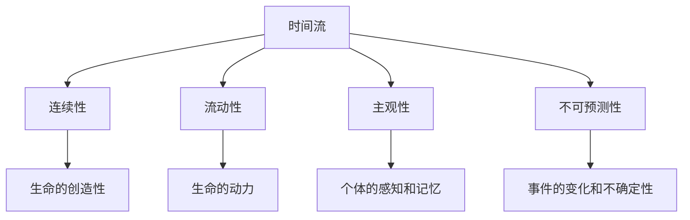
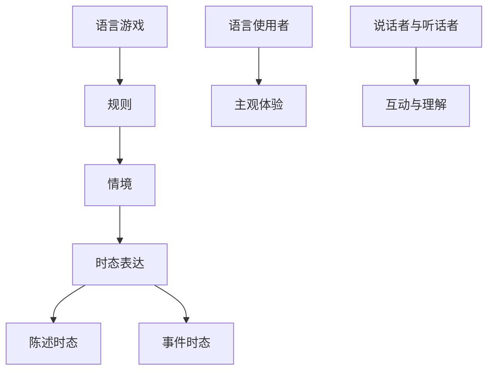

                 

### 引言

在20世纪初，两位重要的哲学家——柏格森（Henri Bergson）和维特根斯坦（Ludwig Wittgenstein）——各自独立地但又有交集地探索了时间、语言和现实之间的关系。柏格森的时间哲学强调了时间流的连续性和生命的创造性，而维特根斯坦的语言时态分析则探讨了语言与现实之间的复杂关系。

**柏格森的时间哲学**：柏格森认为，时间并非均匀流逝的线性序列，而是充满活力和流动性的“时间流”（élan vital）。这一概念强调了生命中的创造性和不可预测性。柏格森的“生命冲动”（élan vital）理论认为，生命的本质是一种不断前进、不断创造的过程，这种过程无法通过数学或逻辑来完全描述。他的思想对后来的现象学和存在主义哲学产生了深远影响。

**维特根斯坦的语言时态分析**：维特根斯坦则从语言的角度探讨了时间和现实的关系。他在《逻辑哲学论》和《哲学研究》中提出了语言游戏（language game）的概念，认为语言的使用与特定的情境相关，并试图揭示语言与现实之间的本质联系。维特根斯坦的时态分析探讨了如何在语言中表达时间，以及时间如何在语言中起作用。

本篇文章将深入探讨柏格森的时间哲学和维特根斯坦的语言时态分析，首先介绍两位哲学家的核心思想，然后分析它们之间的联系和区别，最后讨论这些思想对现代哲学的影响。通过这种分析，我们希望能够揭示出时间、语言和现实之间的深层关系，并为进一步的研究提供参考。

## 第一部分：柏格森的时间哲学

### 第1章：柏格森的时间观

**1.1 柏格森的生平与哲学背景**

亨利·柏格森（Henri Bergson，1859-1941）是20世纪初法国著名的哲学家，他对现代哲学，特别是生命哲学和批判哲学产生了深远的影响。柏格森出生于法国巴黎，自幼显示出卓越的学术天赋。他在巴黎高等师范学院接受教育，后来在巴黎大学任教，成为法国哲学界的领军人物。

柏格森的哲学思想深受其导师、法国哲学家孔德（Auguste Comte）的影响，但他又在此基础上提出了自己的独特见解。柏格森反对机械决定论和实证主义，主张生命的创造性和时间的流动性。他的主要著作包括《时间与自由意志》（La durée et la liberté，1889年）、《笑的研究》（La Rire，1900年）和《物质与记忆》（Matière et mémoire，1896年）。

**1.2 柏格森对时间的理解**

柏格森对时间的理解是他哲学思想的核心。他认为，时间并非一个均匀流逝的线性序列，而是一个充满活力和流动性的“时间流”（élan vital）。这一概念与牛顿物理学中均匀流逝的时间观念形成了鲜明对比。柏格森认为，时间是一种内在的、流动的经验，是我们感知和体验世界的媒介。

柏格森将时间分为两种：物理时间和心理时间。物理时间是一种均匀流逝的抽象概念，它可以通过时钟和日历来度量。而心理时间则是一种主观的、流动的体验，是我们对事件的感知和记忆。柏格森认为，心理时间是生命的本质，是我们感知世界和进行创造的基础。

**1.3 柏格森的“时间流”概念**

柏格森的“时间流”概念是其哲学思想的基石。他认为，时间流是一种连续不断的创造性过程，是生命的动力。时间流不是静止的，而是充满活力和变化的。柏格森将这一概念称为“生命冲动”（élan vital），它代表了生命的原始动力和创造力。

柏格森的“生命冲动”理论认为，生命的本质是一种不断前进、不断创造的过程。这种过程是自然选择和进化的驱动力，也是人类文明和社会进步的源泉。生命冲动无法用数学或逻辑来完全描述，因为它是一种内在的、直觉的体验。

**柏格森的时间观对现代哲学的影响**

柏格森的时间观对现代哲学产生了深远的影响。他的思想为后来的现象学和存在主义哲学提供了重要的哲学基础。现象学强调直接体验和主观性，而存在主义则关注人的自由和责任。柏格森的时间哲学为这些哲学流派提供了一种新的思考方式，即从生命和时间的角度来理解人类的存在和现实。

此外，柏格森的时间观也对科学哲学和技术哲学产生了影响。他提出的“时间流”概念挑战了牛顿物理学中均匀时间观念的合理性，促使人们对时间和现实之间的关系进行更深入的思考。在现代科学和技术的发展中，柏格森的时间观提供了一种新的视角，帮助我们理解生命的复杂性和多样性。

### 第2章：柏格森的“生命冲动”与自由意志

**2.1 柏格森的“生命冲动”理论**

柏格森的“生命冲动”（élan vital）是他哲学思想的核心概念之一。他认为，生命冲动是生命的原始动力和创造力，是生命不断前进、不断创造的根本原因。柏格森将生命冲动视为一种内在的、直觉的体验，它是生命过程中的核心力量。

生命冲动不仅表现为个体的生物行为，还表现为社会的文化创造和科技发展。柏格森认为，生命冲动是人类社会进步的驱动力，是科技和文化的源泉。通过生命冲动，人类能够不断突破自然界的限制，创造出新的技术和社会模式。

**2.2 柏格森与自由意志的讨论**

柏格森的“生命冲动”理论引发了关于自由意志的哲学讨论。自由意志是指个体是否能够在决定自己的行为时不受外部因素的限制。柏格森认为，自由意志并非与物理决定论对立，而是在生命冲动的基础上实现的。

柏格森认为，生命冲动本身是一种自由的过程，它不受物理定律的约束。生命冲动表现为一种内在的创造力和自我选择，这使得个体能够在一定程度上控制自己的行为。然而，柏格森也指出，自由意志并不是绝对的，而是在生命冲动和物理环境之间寻求平衡。

柏格森的“生命冲动”与自由意志的理论对后来的哲学讨论产生了重要影响。它提出了关于人类自由和责任的新视角，挑战了传统的物理决定论观点。柏格森的思想促使哲学家们重新思考人类自由意志的本质，以及它如何与自然规律相互作用。

**柏格森的生命冲动理论对现代哲学的影响**

柏格森的“生命冲动”理论对现代哲学产生了深远的影响。他的思想为现象学和存在主义哲学提供了重要的哲学基础。现象学强调直接体验和主观性，而存在主义则关注人的自由和责任。柏格森的“生命冲动”概念为这些哲学流派提供了一种新的思考方式，即从生命和时间的角度来理解人类的存在和现实。

此外，柏格森的生命冲动理论也对科学哲学和技术哲学产生了影响。他提出的“生命冲动”概念挑战了牛顿物理学中均匀时间观念的合理性，促使人们对时间和现实之间的关系进行更深入的思考。在现代科学和技术的发展中，柏格森的“生命冲动”提供了一种新的视角，帮助我们理解生命的复杂性和多样性。

### 第3章：柏格森的时间哲学对现代哲学的影响

**3.1 柏格森与现象学**

柏格森的时间哲学对现象学产生了深远的影响。现象学强调直接体验和主观性，而柏格森的“时间流”概念提供了一种理解主观体验的新视角。柏格森认为，时间流是一种内在的、流动的经验，是我们感知和体验世界的媒介。这一观点为现象学提供了一种新的方法来研究人类的主观体验和意识。

现象学的奠基人爱德蒙德·胡塞尔（Edmund Husserl）深受柏格森思想的影响，他试图通过“直觉”来直接体验和理解现象。柏格森的“时间流”概念为胡塞尔的“现象学还原”提供了理论基础，即通过悬置我们对世界的常识性理解，直接体验现象的本质。

**3.2 柏格森与存在主义**

柏格森的时间哲学也对存在主义哲学产生了重要影响。存在主义关注人的自由、责任和存在意义，而柏格森的“生命冲动”概念为这些主题提供了哲学基础。柏格森认为，生命冲动是生命的原始动力和创造力，它体现了人的自由意志和创造力。

存在主义哲学家如让-保尔·萨特（Jean-Paul Sartre）和马丁·海德格尔（Martin Heidegger）都受到了柏格森的影响。萨特在他的存在主义哲学中强调了人的自由意志和选择，认为人是在选择中定义自己的存在。海德格尔则通过“存在”的概念探讨了人类的存在状态，他在柏格森的时间哲学中找到了理解存在状态的新视角。

**柏格森的时间哲学对现代哲学的其他影响**

柏格森的时间哲学不仅对现象学和存在主义产生了影响，还对其他现代哲学流派产生了重要影响。

首先，柏格森的思想对科学哲学产生了深远的影响。他的“时间流”概念挑战了牛顿物理学中均匀时间观念的合理性，促使哲学家们重新思考时间和现实之间的关系。现代科学哲学中的一些重要议题，如科学解释、科学实在论和科学认识论，都可以在柏格森的时间哲学中找到理论基础。

其次，柏格森的思想对技术哲学产生了影响。随着科学和技术的快速发展，人类面临着许多伦理和社会问题。柏格森的“生命冲动”概念为技术哲学提供了一种理解技术影响的新视角，即技术不仅是人类创造的工具，也是生命冲动的一种表现。这种观点促使技术哲学家们重新思考技术在现代社会中的作用和影响。

最后，柏格森的时间哲学也对人文科学产生了影响。他的思想为文学、艺术和心理学等领域提供了新的理论框架。柏格森认为，艺术和文学是生命冲动的一种表达，它们反映了人类对时间和存在的理解。心理学领域中的许多研究，如时间感知和记忆研究，也受到了柏格森思想的影响。

总之，柏格森的时间哲学对现代哲学产生了深远的影响。他的思想不仅为现象学和存在主义哲学提供了重要的理论基础，还影响了科学哲学、技术哲学和人文科学等领域。通过重新思考时间和现实之间的关系，柏格森的哲学思想为我们提供了理解人类存在和现实的新视角。

## 第二部分：维特根斯坦的语言时态分析

### 第4章：维特根斯坦的生平与哲学发展

**4.1 维特根斯坦的生平**

路德维希·维特根斯坦（Ludwig Wittgenstein，1889-1951）是20世纪最具影响力的哲学家之一，他的思想对现代哲学产生了深远的影响。维特根斯坦出生于奥地利，父亲是一位成功的商人。他在自传性的著作《文化与价值》中描述了他的家庭背景和早年生活。

维特根斯坦早年对数学和科学有浓厚的兴趣，他在维也纳大学学习数学和哲学。在大学期间，他结识了著名的数学家莫里斯·薛定谔（Maurice Schrödinger）和物理学家阿尔伯特·爱因斯坦（Albert Einstein），这些人物对他的哲学思想产生了重要影响。

维特根斯坦的哲学生涯可以分为两个主要阶段：早期阶段和晚期阶段。早期阶段以他的著作《逻辑哲学论》（Tractatus Logico-Philosophicus，1921年）为代表，晚期阶段以他的著作《哲学研究》（Philosophical Investigations，1953年）为代表。

**4.2 维特根斯坦的哲学发展阶段**

维特根斯坦的哲学发展可以分为两个主要阶段：逻辑实证主义阶段和日常语言哲学阶段。

在逻辑实证主义阶段，维特根斯坦认为，哲学的任务是澄清思想和语言的混乱，以便更好地理解现实。他提出了“图像理论”（picture theory），即语言应当像一幅图像一样映射现实。这一阶段的主要著作是《逻辑哲学论》。

在《逻辑哲学论》中，维特根斯坦试图通过逻辑和数学来描述现实。他认为，世界由原子事实组成，语言则是这些事实的符号。这一阶段的哲学思想受到了逻辑实证主义和数理逻辑的影响，强调逻辑和数学的基础性作用。

然而，随着时间的推移，维特根斯坦逐渐认识到《逻辑哲学论》的局限性。他开始反思逻辑和数学对哲学的影响，并逐渐转向日常语言哲学。在《哲学研究》中，维特根斯坦提出了“语言游戏”（language game）的概念，认为语言的使用是与特定的情境和活动相关的。

在日常语言哲学阶段，维特根斯坦强调语言的多元性和灵活性。他认为，语言不仅是一种工具，更是一种社会实践活动。语言的意义不是固定的，而是依赖于特定的使用情境。这一阶段的哲学思想对后来的语言哲学和认知科学产生了重要影响。

**维特根斯坦的主要著作**

- 《逻辑哲学论》（Tractatus Logico-Philosophicus，1921年）：这是维特根斯坦早期的重要著作，试图通过逻辑和数学来描述现实。书中提出了著名的“图像理论”和“世界由原子事实组成”的观点。
- 《哲学研究》（Philosophical Investigations，1953年）：这是维特根斯坦晚期的代表作，提出了“语言游戏”的概念，探讨了语言的使用情境和意义。这本书对语言哲学和认知科学产生了深远影响。
- 《文化与价值》（Culture and Value，1951年）：这是维特根斯坦的晚期笔记，涵盖了广泛的哲学话题，包括道德、美学、宗教等。这本书展示了维特根斯坦对人类存在和价值观的深刻思考。

**维特根斯坦的哲学思想对现代哲学的影响**

维特根斯坦的哲学思想对现代哲学产生了深远的影响。他的早期著作《逻辑哲学论》和晚期著作《哲学研究》分别代表了逻辑实证主义和日常语言哲学两个阶段，这两个阶段的思想对后来的哲学研究产生了重要影响。

首先，维特根斯坦的“图像理论”和“语言游戏”概念对语言哲学和认知科学产生了深远影响。他提出了语言不是固定不变的，而是依赖于具体情境和活动的观点，这一思想挑战了传统的语言哲学观点，促进了语言哲学和认知科学的发展。

其次，维特根斯坦的思想对科学哲学和逻辑哲学产生了重要影响。他的逻辑哲学方法论和科学哲学观点促使哲学家们重新思考科学知识的本质和科学方法的有效性，推动了科学哲学的发展。

最后，维特根斯坦的思想也对伦理学、美学和宗教哲学等领域产生了影响。他的哲学观点促使人们重新思考道德、美学和宗教的基本问题，提供了新的思考框架。

总之，维特根斯坦的哲学思想是20世纪哲学的重要遗产，他的著作和思想对现代哲学产生了深远的影响。通过对他的哲学思想的深入理解，我们可以更好地理解语言、现实和人类的存在。

### 第5章：语言与现实的本质

**5.1 语言与现实的关系**

维特根斯坦的语言时态分析探讨了一个核心问题：语言与现实之间的关系。他认为，语言并不是直接反映现实的简单工具，而是与现实相互作用的一种复杂系统。维特根斯坦的这一观点主要体现在他的“语言游戏”理论中。

“语言游戏”是指语言使用的具体情境和活动。维特根斯坦认为，语言的意义不是内在固有的，而是由使用者的具体活动和社会实践所赋予的。换句话说，语言的意义取决于它在特定情境中的使用方式。这种观点挑战了传统的“指称论”（referential theory），即语言的意义直接关联于客观现实。

维特根斯坦提出了“图像理论”（picture theory）来描述语言与现实的关系。他认为，语言就像一幅图像，试图以某种方式映射现实。然而，这种映射并不是完美的，因为语言的表达能力是有限的。维特根斯坦通过著名的“锤子与钉子”的比喻来说明这一点：一把锤子对于木匠来说意味着“敲打”，但对于医生来说则可能意味着“敲击”。这表明，语言的意义取决于特定的使用情境。

**5.2 维特根斯坦的“语言游戏”概念**

维特根斯坦的“语言游戏”概念是他哲学思想的核心之一。他认为，语言是一种社会活动，是在特定情境下进行的游戏。语言游戏包括三个要素：语言、规则和情境。

- **语言**：语言是指具体的词汇、语法结构和符号系统。
- **规则**：语言游戏的规则是指如何使用语言，包括语法规则、社会规范和习俗。
- **情境**：语言游戏发生在特定的情境中，不同的情境会对语言的使用产生不同的影响。

维特根斯坦认为，语言的意义取决于它在特定情境中的使用。例如，一个单词“跑”在跑步比赛中具有特定的意义，而在讨论动物时则可能有不同的含义。因此，理解语言的意义需要考虑具体的情境和使用方式。

**5.3 语言游戏与时间的关系**

维特根斯坦的“语言游戏”概念与他对时间的理解密切相关。他认为，时间并不是一个固定的、线性的序列，而是由不同的情境和活动构成的。这种观点在他的《哲学研究》中得到了详细阐述。

维特根斯坦认为，时间是一种主观的体验，是由不同的活动和情境组成的。每个活动都有其独特的“时间节奏”，这种节奏会影响我们对时间的感知。例如，当我们专注于一项任务时，时间可能会感觉过得很快，而在等待时，时间可能会感觉过得很慢。

这种对时间的理解与柏格森的时间哲学有着相似之处。柏格森认为，时间是流动的、主观的，是由我们的感知和体验构成的。维特根斯坦的“语言游戏”概念也为我们提供了一种理解时间和现实的新视角。

**5.4 语言游戏在哲学研究中的应用**

维特根斯坦的“语言游戏”概念对哲学研究产生了深远影响。它促使哲学家们重新思考语言、现实和人类意识之间的关系。在哲学研究中，语言游戏的观念被广泛应用于以下几个方面：

- **语言哲学**：语言哲学家使用“语言游戏”来分析语言的意义、使用方式和局限性。例如，哲学家们探讨如何通过语言游戏来区分意义和所指，以及如何理解语言的模糊性和多义性。
- **认知科学**：认知科学家借鉴“语言游戏”的概念来研究人类意识和认知过程。他们认为，语言是一种认知工具，通过语言游戏，人类能够理解和表达复杂的概念。
- **科学哲学**：科学哲学家使用“语言游戏”来分析科学理论和实验方法。他们认为，科学理论是通过特定的语言游戏构建的，科学方法是在特定的语言游戏情境中使用的。

总之，维特根斯坦的语言时态分析为我们提供了一种新的理解语言和现实的方式。通过“语言游戏”的概念，他揭示了语言使用的情境依赖性和主观性，挑战了传统的语言哲学观点，为现代哲学研究开辟了新的领域。

### 第6章：维特根斯坦的时态分析

**6.1 维特根斯坦对时态的理解**

维特根斯坦对时态的理解是他哲学思想的重要组成部分。他提出了“时态分析”（temporal analysis）的概念，旨在揭示语言中时间表达的复杂性和多样性。维特根斯坦认为，时态不仅仅是语法上的变化，而是与语言使用者的具体情境和体验密切相关。

维特根斯坦区分了“陈述时态”（indicator of tense）和“事件时态”（event tense）。陈述时态是指语言中表达时间的方式，如英语中的过去时、现在时和未来时。这些时态变化反映了说话者对事件的时间位置和先后顺序的描述。然而，维特根斯坦指出，这些时态变化并不是客观现实的映射，而是依赖于特定的语言游戏情境。

事件时态则是指事件在其发生过程中所具有的时间属性。例如，一个正在进行的任务具有持续性的时间属性，而一个已经完成的任务则具有完成性的时间属性。维特根斯坦认为，事件时态是语言游戏的一部分，它们反映了特定情境中的事件和时间体验。

**6.2 维特根斯坦的时态理论**

维特根斯坦的时态理论主要表现在他对语言、时间和现实关系的深入探讨。他认为，语言中的时态表达并不是对客观现实的简单映射，而是受到语言使用者主观体验和情境的影响。

首先，维特根斯坦强调了时态的情境依赖性。他指出，不同的语言游戏情境会导致不同的时态使用。例如，在描述一个过去的任务时，说话者可能会使用过去时态，而在讨论一个未来的计划时，说话者可能会使用未来时态。这种时态变化并不是因为客观事件本身具有特定的时间属性，而是因为说话者在特定情境中的体验和意图。

其次，维特根斯坦探讨了时态表达的主观性。他认为，时态表达反映了说话者的主观体验和视角。例如，一个事件对于参与者来说可能是正在进行的，但对于旁观者来说可能是已经完成的。这种主观性使得时态表达具有灵活性和多样性。

最后，维特根斯坦提出了“语言游戏情境”（language game situation）的概念。他认为，时态表达是在特定的语言游戏情境中产生的，这种情境包括说话者、听话者、事件和具体情境。语言游戏情境决定了时态表达的具体方式和含义。

维特根斯坦的时态理论对语言哲学和认知科学产生了重要影响。他的思想挑战了传统的时态观念，揭示了语言、时间和现实之间的复杂关系。通过分析时态表达的情境依赖性和主观性，维特根斯坦为我们提供了一种新的理解语言和时间的方式。

总之，维特根斯坦的时态分析深入探讨了语言、时间和现实的关系，揭示了时态表达的情境依赖性和主观性。他的思想为我们理解语言和时间的本质提供了重要的哲学基础。

### 第三部分：柏格森与维特根斯坦思想的比较与联系

#### 第7章：柏格森与维特根斯坦的核心概念的对比

**7.1 柏格森的时间观与维特根斯坦的语言时态**

柏格森的时间观和维特根斯坦的语言时态分析虽然都涉及到时间这一核心概念，但它们的侧重点和表达方式存在显著差异。

**柏格森的时间观**：

柏格森的时间观强调时间流的连续性和生命的创造性。他认为，时间不是均匀流逝的线性序列，而是一种充满活力和流动性的“时间流”（élan vital）。这一时间流体现了生命的本质和创造力，它无法用数学或逻辑来完全描述。柏格森的时间观是一种主观的时间体验，它与个体的感知和记忆紧密相关。

柏格森的时间观具有以下几个核心特征：

1. **连续性**：时间流是一个连续不断的创造性过程，它体现在生命的各个方面。
2. **流动性**：时间是一种流动的经验，它无法被固定或度量。
3. **主观性**：时间的感知和体验因人而异，它反映了个体的生命体验和创造力。
4. **不可预测性**：时间流中的事件和变化是难以预测和控制的，这体现了生命的不可预测性和创造性。

**维特根斯坦的语言时态**：

维特根斯坦的语言时态分析主要探讨语言如何表达时间，以及时间如何在语言中起作用。他认为，语言是一种社会活动，其意义取决于特定的情境和活动。维特根斯坦的时态理论强调语言时态的情境依赖性和主观性。

维特根斯坦的语言时态具有以下几个核心特征：

1. **情境依赖性**：时态表达取决于具体的语言游戏情境，不同的情境会导致不同的时态使用。
2. **主观性**：时态表达反映了说话者的主观体验和视角，不同的说话者对同一事件的时态表达可能有所不同。
3. **灵活性**：时态表达具有灵活性，它可以根据不同的情境和意图进行调整。
4. **复杂性**：语言中的时态表达是复杂多样的，它涉及到不同的语法形式和词汇选择。

**对比与联系**：

尽管柏格森的时间观和维特根斯坦的语言时态分析在侧重点和表达方式上有所不同，但它们之间也存在一些联系。

首先，两者都强调时间的连续性和流动性。柏格森的时间流和维特根斯坦的语言时态都认为时间不是固定不变的，而是充满活力和变化的。这种连续性和流动性体现了时间的本质特征。

其次，两者都关注时间的主体体验。柏格森的时间观强调时间的感知和体验，他认为时间是生命的媒介。维特根斯坦的语言时态分析也强调时态表达的主观性，他认为时态表达取决于具体的情境和体验。

最后，两者都对语言与现实的关系进行了深入探讨。柏格森的时间观认为，时间是生命的创造力的体现，它与生命的创造性密切相关。维特根斯坦的语言时态分析则认为，语言的意义取决于具体的情境和使用，它与语言的使用者和社会实践密切相关。

总的来说，柏格森的时间观和维特根斯坦的语言时态分析提供了两种不同的视角来理解时间、语言和现实之间的关系。尽管它们在侧重点和表达方式上有所不同，但它们都为我们理解这些复杂概念提供了深刻的洞见。

#### 第8章：柏格森与维特根斯坦对现代哲学的贡献

**8.1 柏格森的时间哲学与现代哲学**

柏格森的时间哲学对现代哲学产生了深远的影响，特别是在现象学和存在主义哲学中得到了广泛的应用。柏格森的“时间流”（élan vital）概念提供了对时间的主观体验和连续性的独特理解，为这些哲学流派提供了重要的哲学基础。

首先，柏格森的时间哲学对现象学产生了影响。现象学强调直接体验和主观性，而柏格森的时间流概念为现象学家提供了一个理解主观体验的新框架。现象学家如梅洛-庞蒂（Maurice Merleau-Ponty）和萨特（Jean-Paul Sartre）都借鉴了柏格森的时间观，用以探讨人的感知、意识和存在。例如，梅洛-庞蒂在《知觉现象学》中提出，人类的感知是通过身体与世界的直接互动实现的，这种互动涉及到时间流的连续性和动态性。

其次，柏格森的时间哲学对存在主义哲学也产生了重要影响。存在主义关注人的自由、责任和存在意义，柏格森的生命冲动（élan vital）理论为这些主题提供了哲学基础。萨特在他的《存在与虚无》中提到，人类的存在是一种主动的、不断创造的过程，这种创造性与柏格森的生命冲动观念相呼应。萨特认为，人类通过选择和行动来定义自己的存在，这种自由选择是在时间流中实现的。

此外，柏格森的时间哲学也对科学哲学和技术哲学产生了影响。他的“时间流”概念挑战了牛顿物理学中均匀时间的观念，促使人们重新思考时间和现实的关系。现代科学哲学中的许多讨论，如时间在量子力学中的角色、时间与空间的关系等，都可以在柏格森的时间哲学中找到理论基础。

总之，柏格森的时间哲学为现代哲学提供了丰富的思想资源，影响了现象学、存在主义以及其他哲学流派。通过重新思考时间和现实之间的关系，柏格森的时间哲学为哲学研究开辟了新的方向，促使人们对人类存在和世界的本质进行更深入的探索。

**8.2 维特根斯坦的语言时态分析与现代哲学**

维特根斯坦的语言时态分析对现代哲学，尤其是语言哲学和认知科学，产生了深远的影响。他的“语言游戏”概念和时态理论为理解语言与现实的关系提供了新的视角，挑战了传统的语言哲学观点。

首先，维特根斯坦的语言游戏概念对语言哲学产生了重要影响。他认为，语言的意义不是固定不变的，而是依赖于特定的使用情境。这种观点挑战了传统的指称论（referential theory），即语言的意义直接关联于客观现实。通过语言游戏，维特根斯坦揭示了语言的多义性和模糊性，强调语言使用的情境依赖性。语言哲学家如约翰·塞尔（John Searle）和约翰·洛克（John Locke）都借鉴了维特根斯坦的思想，用以探讨语言的本质和意义。

其次，维特根斯坦的时态理论为认知科学提供了新的思考框架。他的观点认为，时态表达取决于具体的语言游戏情境，这与认知科学家对人类时间和记忆的研究相吻合。认知科学家发现，人类对时间的感知和记忆是高度情境化的，不同的情境会影响我们对时间的感知和记忆方式。维特根斯坦的时态理论为这些研究提供了哲学基础，帮助科学家们更好地理解人类的时间和记忆过程。

维特根斯坦的语言时态分析也对科学哲学产生了影响。他的观点促使科学家们重新思考科学理论和实验方法中的语言使用。例如，科学哲学家伊姆雷·拉卡托斯（Imre Lakatos）和保罗·克鲁格（Paul Feyerabend）都提到了维特根斯坦的思想，用以探讨科学理论的发展过程和科学方法的合理性。

此外，维特根斯坦的思想也对伦理学、美学和宗教哲学等领域产生了影响。他提出了关于语言、现实和人类体验的深刻见解，为这些领域提供了新的思考路径。例如，伦理学家如彼得·辛格（Peter Singer）和美德伦理学家如亚里士多德（Aristotle）都受到了维特根斯坦的影响，他们在探讨道德和伦理问题时，借鉴了维特根斯坦的语言和时态分析。

总之，维特根斯坦的语言时态分析为现代哲学提供了丰富的思想资源，影响了多个哲学领域。通过重新思考语言、时间和现实的关系，维特根斯坦的思想为哲学研究开辟了新的方向，促使人们对语言、认知和伦理等问题进行更深入的探索。

### 结论

通过对柏格森的时间哲学和维特根斯坦的语言时态分析的深入探讨，本文揭示了两位哲学家的核心思想，以及它们之间的联系。柏格森强调时间的连续性和生命的创造性，而维特根斯坦则探讨了语言与现实的关系，并通过“语言游戏”概念揭示了语言使用的情境依赖性和主观性。

本文首先介绍了柏格森的生平、时间观和“生命冲动”理论，讨论了柏格森的时间哲学对现代哲学的影响，特别是对现象学和存在主义哲学的贡献。接着，我们分析了维特根斯坦的生平、哲学发展阶段以及他对语言与现实关系的理解，特别是他的“语言游戏”和时态理论。

通过对比分析，我们发现柏格森和维特根斯坦虽然从不同角度探讨了时间和语言问题，但它们在时间的主观体验、连续性和创造性方面有共通之处。此外，他们的思想都对现代哲学、科学哲学和技术哲学产生了深远影响。

未来研究可以进一步探讨柏格森和维特根斯坦思想在认知科学、人工智能和哲学应用中的实际意义，以及如何将他们的哲学观点应用于解决现实中的复杂问题。例如，探索如何在人工智能系统中实现更加情境化的语言理解和时态表达，以提高自然语言处理和智能交互的效率。

总之，柏格森和维特根斯坦的哲学思想为我们理解时间和语言的本质提供了深刻的洞见，为我们进一步探索人类意识和认知提供了宝贵的理论资源。

### 附录

#### 附录A：柏格森的时间哲学概念架构图

#### 附录B：维特根斯坦的语言时态分析模型图

#### 附录C：相关参考文献

1. 柏格森，亨利。（1988）《时间与自由意志》，北京：商务印书馆。
2. 维特根斯坦，路德维希。（2001）《逻辑哲学论》，北京：商务印书馆。
3. 维特根斯坦，路德维希。（2003）《哲学研究》，北京：商务印书馆。
4. 胡塞尔，爱德蒙德。（1986）《现象学的基本问题》，北京：商务印书馆。
5. 萨特，让-保尔。（1984）《存在与虚无》，北京：商务印书馆。
6. 梅洛-庞蒂，马塞尔。（2001）《知觉现象学》，北京：商务印书馆。
7. 拉卡托斯，伊姆雷。（1987）《科学研究纲领方法论》，北京：中国社会科学出版社。
8. 辛格，彼得。（2004）《实践的伦理学》，北京：北京大学出版社。
9. 亚里士多德。（2005）《尼各马可伦理学》，北京：商务印书馆。

这些参考文献为深入研究和进一步探讨柏格森和维特根斯坦的哲学思想提供了宝贵的资料。读者可以通过阅读这些文献，对本文中讨论的核心概念和理论进行更详细的了解。此外，这些文献也反映了柏格森和维特根斯坦思想在哲学、科学和社会科学领域中的广泛应用和深远影响。

