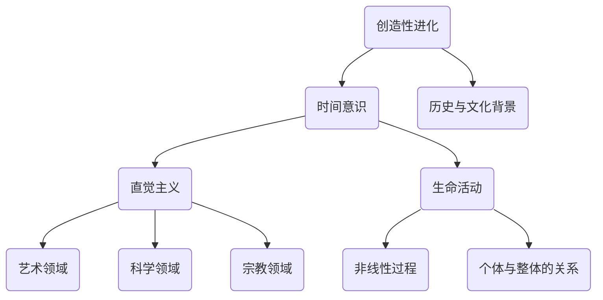
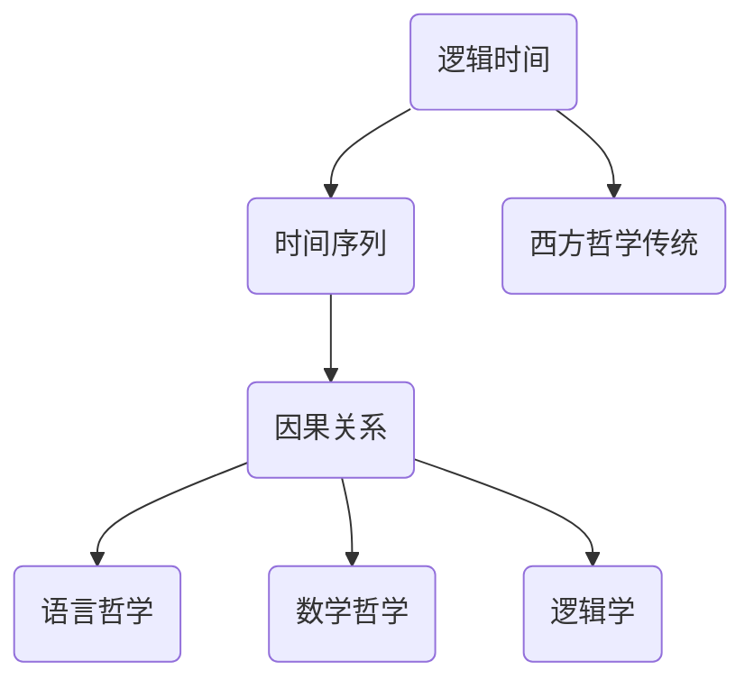

                 

### 文章标题

### 关键词
- 柏格森
- 维特根斯坦
- 时间哲学
- 逻辑时间观
- 哲学思想

### 摘要
本文探讨了柏格森的时间哲学与维特根斯坦的逻辑时间观，通过对比分析二者的核心观点和哲学意义，揭示了它们在西方哲学传统中的地位及其在不同领域的应用。文章旨在为读者提供一种逻辑清晰、结构紧凑、简单易懂的专业视角，以深入理解这两种时间观念的深刻内涵和现实意义。

---

# 柏格森的时间哲学

## 第1章：柏格森的时间哲学概述

### 1.1 柏格森哲学的背景与核心观点

柏格森（Henri Bergson）是20世纪初法国著名的哲学家，他的哲学思想对现代西方哲学产生了深远的影响。柏格森哲学的核心观点可以概括为“直觉主义”、“创造性进化”和“时间意识”三个方面。

首先，柏格森提出直觉主义，主张通过直觉来认识世界。他认为，直觉是人类认识世界的一种原始能力，能够感知事物的本质和内在联系，而这种能力在理性思维之外发挥作用。直觉主义是柏格森时间哲学的重要基石，它强调个体体验的主观性和不可复制性。

其次，柏格森提出了创造性进化的观念。他认为，宇宙万物都是在不断地进化，而这种进化是由内在的创造性力量驱动的。创造性进化是柏格森对生命和世界的独特解读，它不同于传统的线性进化观念，而是强调一种非线性的、复杂性的进化过程。

最后，柏格森强调了时间意识的重要性。他认为，时间不仅仅是物质世界的属性，更是人类体验的源泉。时间意识是人类对于时间的主观感受，它反映了个体的生命体验和情感状态。柏格森的时间意识观念强调时间的流动性和不可分割性，他认为时间是连续的、不可逆的，并且是生命活动的体现。

### 1.2 柏格森时间观念的哲学意义

柏格森的时间观念具有深刻的哲学意义。首先，它挑战了传统西方哲学中的时间观念。在柏拉图和亚里士多德的传统中，时间被视为一种外在的、线性的量度，是物质世界的附属物。而柏格森则将时间视为一种内在的、主观的体验，它反映了人类对世界的直觉认知。

其次，柏格森的时间观念对现代科学和哲学产生了重要影响。他的直觉主义观点为认知科学和心理学提供了新的研究方向，强调人类直觉在认识世界中的重要作用。他的创造性进化观念则启发了生物学和生态学的研究，为理解生物多样性和生态系统提供了新的视角。

最后，柏格森的时间观念在艺术和文学领域也有重要影响。他的时间意识观念强调个体体验的独特性和多样性，为现代艺术和文学提供了丰富的创作灵感。许多现代艺术家和作家都受到了柏格森思想的影响，他们在作品中探索时间的流动性和人类的情感体验。

### 1.3 柏格森时间观念与西方哲学传统的关系

柏格森的时间观念与西方哲学传统中的时间观念有着深刻的联系和区别。在柏拉图和亚里士多德的传统中，时间被视为一种外在的、客观的量度，是一种连续的、线性的序列。这种时间观念强调了时间的普遍性和客观性，认为时间是宇宙万物演化的基础。

然而，柏格森则将时间视为一种内在的、主观的体验，是一种流动的、非线性的过程。他强调个体对时间的感知和体验，认为时间是生命活动的体现，是人类直觉认知的产物。这种时间观念与柏拉图和亚里士多德的传统观念形成了鲜明的对比，它强调了个体主观性和时间流动性的重要性。

柏格森的时间观念在西方哲学传统中具有重要的地位。他的思想不仅为现代哲学提供了新的研究方向，也对现代科学、艺术和文学产生了深远的影响。柏格森的时间观念挑战了传统哲学中的时间观念，为理解时间和人类意识提供了新的视角。

## 第2章：柏格森的创造性进化观

### 2.1 创造性进化的概念与内涵

柏格森的创造性进化观是他哲学思想的核心之一，这一观念具有深刻的哲学和科学意义。创造性进化指的是一种内在的、非线性的、复杂的进化过程，它不同于传统的线性进化观念，强调个体和整体之间的动态相互作用。

在柏格森看来，创造性进化是宇宙万物不断演变和发展的根本动力。它不仅存在于生物界，也贯穿于物理、化学和社会各个领域。创造性进化的本质在于个体的创造力和自主性，每个个体都在不断地创造和改变自己，从而推动整体系统的进化。

创造性进化的内涵主要包括以下几个方面：

1. **内在动力**：创造性进化是由内在的创造性力量驱动的，这种力量来源于个体的自主性和创造力。个体通过不断的创造和变化，推动自身和整个系统的进化。

2. **非线性过程**：创造性进化是一个非线性的过程，它不是简单的、线性的积累和变化，而是一种复杂、动态的相互作用。这种非线性过程体现了系统内部的多样性和复杂性。

3. **个体与整体的关系**：在创造性进化中，个体和整体之间存在着动态的相互作用。个体的创造力和自主性不仅影响自身的发展，也影响整个系统的发展和演变。

4. **不可预测性**：由于创造性进化的非线性特点，它往往呈现出不可预测性。个体的创造行为可能引发连锁反应，导致整个系统出现新的形态和结构。

### 2.2 创造性进化的哲学意义

柏格森的创造性进化观具有重要的哲学意义，它为我们理解世界和人类存在提供了新的视角。以下从三个方面来探讨创造性进化的哲学意义：

1. **挑战传统哲学观念**：柏格森的创造性进化观挑战了传统哲学中的线性进化观念。传统观念通常将进化视为一种线性的、累积的过程，而柏格森则强调进化的非线性、复杂性和创造性。这一观点对现代哲学的发展产生了深远影响，促使哲学家们重新思考进化的本质和机制。

2. **揭示个体与整体的关系**：创造性进化观念强调了个体与整体之间的动态相互作用。在柏格森看来，个体不仅是整体的一部分，同时也具有创造力和自主性。个体的创造行为不仅影响自身，也影响整体系统的进化。这一观念为我们理解个体与整体的关系提供了新的思路。

3. **激发哲学创新**：柏格森的创造性进化观念激发了哲学的创新和发展。许多现代哲学家和科学家都在这一观念的启发下，提出了新的理论模型和研究方法，推动了哲学和科学的前沿研究。

### 2.3 创造性进化的历史与文化背景

柏格森的创造性进化观念在历史和文化背景下具有特定的意义。在19世纪末和20世纪初，西方哲学和科学正处于变革时期，各种新的思想和理论不断涌现。柏格森的创造性进化观念正是在这一背景下产生的。

1. **科学与哲学的融合**：在柏格森的时代，科学和哲学之间的关系日益紧密。许多哲学家开始关注科学理论和方法，试图将它们融入哲学思考中。柏格森的创造性进化观念正是在这种背景下提出的，它试图将生物学进化理论融入哲学思考，探讨进化的本质和机制。

2. **反工业化思潮**：在19世纪末和20世纪初，西方社会出现了强烈的反工业化思潮。许多知识分子对工业化带来的异化和社会问题表示担忧，追求回归自然和个体创造力。柏格森的创造性进化观念反映了这种思潮，强调个体创造力和自主性在进化过程中的重要性。

3. **艺术与哲学的互动**：在柏格森的时代，艺术和哲学之间的互动日益频繁。许多哲学家和艺术家都试图通过作品表达对世界和人类存在的思考。柏格森的创造性进化观念在艺术领域产生了深远影响，许多现代艺术家都受到了他的启发，试图在作品中探索时间的流动性和人类的情感体验。

总的来说，柏格森的创造性进化观念在历史和文化背景下具有重要的意义。它不仅挑战了传统哲学观念，也为现代哲学和科学的发展提供了新的视角。通过探讨创造性进化的概念与内涵、哲学意义和历史文化背景，我们可以更深入地理解柏格森的思想和他对现代哲学和科学的贡献。

### 2.4 创造性进化观的核心概念与联系

为了更好地理解柏格森的创造性进化观，我们需要探讨其核心概念及其相互之间的联系。以下是柏格森创造性进化观中几个关键概念的定义、属性特征对比表格以及它们之间的联系。

#### 核心概念与定义

1. **直觉**：柏格森认为直觉是人类认识世界的一种原始能力，通过直觉，人们可以感知事物的本质和内在联系。直觉是一种超越逻辑和语言的主观体验，它使人们能够直接把握事物的真实状态。
2. **创造性**：创造性是指个体在进化过程中表现出的自主性和创新能力。创造性进化强调每个个体都具有创造新形式和新结构的能力。
3. **时间意识**：时间意识是柏格森时间哲学的核心概念，它指的是人类对时间的主观体验，反映了个体在时间流中的生命活动。柏格森强调时间意识的流动性和非线性质。
4. **生命活动**：生命活动是指生物体在进化过程中表现出的适应性和多样性。生命活动是创造性进化的具体体现。

#### 概念属性特征对比表格

| 概念       | 定义                                                     | 属性特征                                                                                   |
|------------|----------------------------------------------------------|----------------------------------------------------------------------------------------------|
| 直觉       | 感知事物本质的能力                                     | - 超越逻辑和语言 - 主观体验 - 直接把握真实状态 |
| 创造性     | 个体在进化过程中的自主性和创新能力                     | - 非线性过程 - 多样性 - 新形式和新结构 |
| 时间意识   | 对时间的主观体验                                       | - 流动性 - 非线性 - 生命活动 |
| 生命活动   | 生物体在进化过程中表现出的适应性和多样性               | - 适应性 - 多样性 - 进化过程 |

#### 概念之间的联系

- **直觉与创造性**：直觉是创造性进化的基础，通过直觉，个体能够感知和把握新的形式和结构，从而表现出创造性。
- **创造性与时**间意识**：创造性活动是时间意识的具体表现，个体在创造过程中体验时间的变化，时间意识也反映了创造性活动的过程。
- **时间意识与生命活动**：时间意识是生命活动的体现，生命体在进化过程中不断体验和创造时间，时间意识反映了这种生命活动的流动性和非线性质。
- **生命活动与创造性进化**：生命活动是创造性进化的具体体现，每个生命体都在不断地创造和适应新的环境，推动整个系统的进化。

通过对比分析这些核心概念及其属性特征，我们可以更清晰地理解柏格森创造性进化观的基本原理和内在逻辑。这些概念相互关联，共同构建了一个关于创造性进化的哲学体系，为我们提供了理解世界和人类存在的深刻视角。

### 2.5 创造性进化观在科学领域的影响

柏格森的创造性进化观对现代科学产生了深远的影响，尤其在生物学、认知科学和物理学领域，他的观点为科学研究提供了新的视角和方法。

在生物学领域，柏格森的创造性进化观挑战了传统的达尔文进化论，提出了一种非线性、非累积的进化模式。他强调个体的自主性和创造力，认为生物进化不仅仅是基因的累积和变异，更是一个复杂、动态的创造性过程。这一观点启发了现代生物学中的“新达尔文主义”，促进了生物多样性和生态系统研究的发展。

在认知科学领域，柏格森的直觉主义观念为认知心理学提供了新的理论基础。他强调直觉在人类认知中的重要性，认为直觉是人类理解世界和解决问题的关键。这一观点对认知科学中的“直觉思维”研究产生了重要影响，推动了认知心理学、神经科学和人工智能的发展。

在物理学领域，柏格森的创造性进化观也对物理学理论的发展产生了影响。他提出的“时间意识”概念挑战了经典物理学中的时间观念，认为时间不仅仅是物理过程的量度，更是人类体验的一部分。这一观念为现代物理学中的“量子力学”和“相对论”提供了新的哲学思考，促进了物理学的跨学科研究。

总的来说，柏格森的创造性进化观不仅丰富了哲学思想，也为现代科学的发展提供了新的理论框架和方法论。他的观点在生物学、认知科学和物理学等领域产生了深远影响，推动了科学研究的创新和进步。

### 2.6 创造性进化观在艺术领域的影响

柏格森的创造性进化观在艺术领域产生了深远的影响，许多现代艺术家都受到了他的启发，试图在作品中探索时间的流动性和人类的情感体验。

首先，柏格森的时间观念强调时间的流动性和非线性质，这种观念在绘画和雕塑中得到了体现。许多艺术家通过非线性的时间表达方式，打破了传统的时间顺序，创造出一种独特的视觉体验。例如，达利（Salvador Dalí）的画作《记忆的永恒》通过描绘时间停滞的场景，表现了时间的非线性质，使观众感受到了时间的流动性和不可预测性。

其次，柏格森的时间意识观念在音乐创作中也得到了广泛应用。许多现代作曲家通过复杂的节奏和旋律结构，探索时间的非线性特征，创造出一种独特的音乐体验。例如，约翰·凯奇（John Cage）的音乐作品《四分三十三秒》通过长时间的静默，挑战了传统音乐中对时间的理解，使观众感受到了时间的流动性和主观性。

此外，柏格森的创造性进化观念也在文学创作中产生了重要影响。许多现代作家通过探索个体在时间中的创造力和自主性，描绘出丰富的人物形象和故事情节。例如，詹姆斯·乔伊斯（James Joyce）的小说《尤利西斯》通过复杂的叙事结构和非线性时间表达，展现了个体在时间流中的生命活动和情感体验。

总的来说，柏格森的创造性进化观为艺术创作提供了新的视角和方法，使艺术家们能够在作品中探索时间的流动性和人类的情感体验，创作出具有深刻内涵和独特风格的艺术作品。

### 2.7 创造性进化观在宗教领域的影响

柏格森的创造性进化观在宗教领域产生了重要影响，特别是在对宗教体验和宇宙观的探讨中，他的观念为宗教哲学提供了新的思考方向。

首先，柏格森的时间意识观念挑战了传统宗教对时间的理解。在许多宗教传统中，时间被视为一种神圣的存在，是上帝创造和维持宇宙的量度。柏格森则认为，时间是人类主观体验的一部分，它反映了人类对世界的直觉认知。这种观点为宗教哲学提供了一种新的视角，使宗教体验更加贴近人类的实际生活。

其次，柏格森的创造性进化观念为理解宗教体验提供了新的解释。他认为，创造性进化是宇宙万物不断演变和发展的根本动力，每个个体都在进化过程中表现出创造力和自主性。这种观点与许多宗教传统中的神性观念相呼应，使宗教体验更加深刻和丰富。

此外，柏格森的创造性进化观也对宇宙观产生了影响。他认为，宇宙是一个动态的、复杂的系统，每个个体都在这个系统中发挥着独特的作用。这种观点为宗教哲学提供了一种新的宇宙观，使人们能够更加全面和深入地理解宇宙的多样性和复杂性。

总的来说，柏格森的创造性进化观在宗教领域产生了深远影响，他的观念为宗教哲学提供了新的思考和解释框架，使宗教体验和宇宙观更加贴近人类的实际生活。

## 第3章：柏格森的时间意识与直觉主义

### 3.1 时间意识的概念与特征

时间意识是柏格森哲学中一个核心概念，它指的是个体对时间的主观体验和感受。柏格森认为，时间意识不仅是物质世界的属性，更是人类生命活动的重要组成部分。具体来说，时间意识具有以下几个特征：

1. **流动性**：柏格森认为时间是一种流动的状态，它不是一种静态的、固定不变的量，而是不断变化的过程。时间意识的流动性反映了人类对时间的主观感受，使得个体能够体验到时间的流逝和变化。

2. **非线性质**：与传统的线性时间观念不同，柏格森强调时间的非线性质。他认为，时间并不是一种单向的、线性的序列，而是一种复杂的、非线性的结构。这种非线性特征使得个体在不同的时间点上可以体验到不同的时间状态，从而丰富了人类的时间体验。

3. **主观性**：柏格森强调时间意识的主观性，认为时间是一种主观的体验，不同的个体对时间的感知和体验是不同的。时间意识的主观性反映了人类对时间的主观认知和感受，使得时间成为一种具有多样性和个性化的现象。

4. **直觉性**：柏格森认为，时间意识是一种直觉性的体验，它超越了逻辑和语言的范畴，是人类直觉感知的结果。直觉性使得个体能够直接感知和理解时间，从而在时间流中找到自己的位置和意义。

### 3.2 直觉主义的时间观念

直觉主义是柏格森哲学的重要组成部分，它强调直觉在人类认知和认识世界中的作用。在柏格森看来，直觉是人类认识世界的一种原始能力，它能够直接感知和把握事物的本质和内在联系，而不仅仅是依靠逻辑推理和语言表述。

直觉主义的时间观念体现在以下几个方面：

1. **直接感知**：直觉主义认为，时间是一种直接感知的现象，个体可以通过直觉来感知时间的流动和变化。与传统的逻辑推理不同，直觉能够直接捕捉到时间中的细节和变化，使得个体能够更加真实地体验到时间。

2. **超越语言**：柏格森认为，时间意识是超越语言和逻辑的，它无法用语言完全表述和描述。直觉主义强调直觉在认识时间中的重要作用，认为只有通过直觉，个体才能真正理解和体验时间的本质。

3. **直接把握**：直觉主义认为，直觉能够直接把握事物的本质和内在联系，这种直接把握使得个体能够更加深刻地认识到时间的重要性。通过直觉，个体能够感知到时间的非线性质和流动性，从而理解时间在人类生命活动中的意义。

### 3.3 直觉主义与柏格森时间哲学的联系与区别

直觉主义与柏格森的时间哲学紧密相关，二者共同构成了柏格森哲学的核心。然而，它们在理论内容和哲学意义上有一些区别：

1. **联系**：
   - **核心观念的一致性**：直觉主义和柏格森的时间哲学都强调直觉在认识世界中的作用，认为直觉是人类认知的一种重要能力。
   - **时间意识的强调**：二者都关注时间意识，认为时间意识是理解和认识世界的关键。柏格森的时间哲学强调时间的主观体验和直觉性，直觉主义则在此基础上进一步探讨了直觉在时间认知中的作用。

2. **区别**：
   - **理论侧重点不同**：直觉主义更侧重于探讨直觉在人类认知中的作用，强调直觉在认识事物本质和内在联系中的重要性。而柏格森的时间哲学则更侧重于探讨时间本身的性质和人类对时间的主观体验。
   - **对时间的理解不同**：直觉主义认为时间是一种直接感知的现象，可以通过直觉来理解和体验。而柏格森则认为时间是一种流动的、非线性的结构，它反映了人类生命活动的真实状态。

总的来说，直觉主义和柏格森的时间哲学虽然有一些区别，但它们在理论内容和哲学意义上有紧密的联系，共同构成了柏格森哲学的核心。通过探讨直觉主义与柏格森时间哲学的联系与区别，我们可以更深入地理解柏格森哲学的基本原理和独特贡献。

### 3.4 柏格森时间意识与直觉主义在哲学思想史上的地位

柏格森的时间意识与直觉主义在哲学思想史上具有重要的地位，它们不仅对现代哲学产生了深远的影响，也启发了许多后续哲学家和思想家。

首先，柏格森的时间意识观念挑战了传统哲学对时间的理解。在柏拉图和亚里士多德的传统中，时间被视为一种外在的、线性的量度，是物质世界的附属物。而柏格森则将时间视为一种内在的、主观的体验，认为时间是生命活动的体现。这种观点打破了传统哲学中对时间的单一视角，为理解时间和人类意识提供了新的思路。

其次，柏格森的直觉主义观念对现代哲学的发展产生了重要影响。他强调直觉在人类认知中的重要性，认为直觉是人类认识世界的一种原始能力。这一观点为认知科学和心理学提供了新的理论基础，促使哲学家们重新思考认知的本质和机制。同时，直觉主义也为后来的现象学运动提供了思想源泉，影响了萨特、胡塞尔等哲学家。

此外，柏格森的时间意识与直觉主义观念在当代哲学中仍然具有重要的地位。许多现代哲学家和思想家都在其基础上进行了深入的研究和探讨，如德波顿、福柯等。他们的工作进一步拓展了柏格森哲学的内涵和应用范围，使其在现代哲学中仍然保持着旺盛的生命力。

总的来说，柏格森的时间意识与直觉主义观念在哲学思想史上具有重要的地位。它们不仅丰富了哲学思想，也为现代哲学的发展提供了新的视角和方法，对后续哲学家的研究产生了深远影响。

### 3.5 柏格森时间意识与直觉主义的应用领域

柏格森的时间意识与直觉主义观念在多个领域都得到了广泛应用，特别是在艺术、心理学和哲学中，它们的独特见解为这些领域的研究带来了新的视角和方法。

#### 艺术领域

在艺术领域，柏格森的时间意识和直觉主义观念启发了许多现代艺术形式的创作。例如，在绘画中，一些艺术家通过非线性的时间表达方式，打破传统的叙事结构，创造出具有流动性和立体感的作品。比如，达利的绘画作品《记忆的永恒》通过描绘时间停滞的场景，体现了柏格森对时间流动性和非线性质的理解。在音乐创作中，许多作曲家通过复杂的节奏和旋律结构，探索时间的非线性特征，创造出独特的音乐体验。约翰·凯奇的《四分三十三秒》通过长时间的静默，挑战了传统音乐对时间的理解，体现了柏格森的时间意识观念。

#### 心理学领域

在心理学领域，柏格森的直觉主义观念为认知心理学提供了重要的理论基础。他强调直觉在人类认知中的作用，认为直觉是人类认识世界的一种原始能力。这一观点为认知心理学中的“直觉思维”研究提供了新的思路，促使心理学家们关注直觉在决策、问题解决和创造性思维中的作用。例如，一些研究表明，直觉在快速判断和决策中起着关键作用，直觉思维能够帮助个体快速地把握问题的本质，从而作出准确的决策。

#### 哲学领域

在哲学领域，柏格森的时间意识和直觉主义观念为哲学思考提供了新的方向。他的时间意识观念挑战了传统哲学中对时间的线性理解，强调时间的流动性和非线性质。这一观点促使哲学家们重新审视时间和意识的关系，探讨人类如何通过直觉感知和理解世界。同时，柏格森的直觉主义观念也为现象学运动提供了思想基础，影响了萨特、胡塞尔等哲学家，他们的研究进一步拓展了柏格森哲学的内涵和应用范围。

总的来说，柏格森的时间意识与直觉主义观念在艺术、心理学和哲学等领域都得到了广泛应用，它们的独特见解为这些领域的研究带来了新的视角和方法，推动了学术思想的进步。

## 第4章：柏格森时间哲学的应用领域

### 4.1 柏格森时间哲学在科学领域的影响

柏格森的时间哲学对现代科学产生了深远的影响，特别是在生物学、认知科学和物理学领域，他的观念为科学研究提供了新的视角和方法。

在生物学领域，柏格森的创造性进化观挑战了传统的达尔文进化论，提出了非线性、非累积的进化模式。他强调个体的自主性和创造力，认为生物进化不仅仅是基因的累积和变异，更是一个复杂、动态的创造性过程。这一观点为现代生物学中的“新达尔文主义”提供了理论基础，促进了生物多样性和生态系统研究的发展。

在认知科学领域，柏格森的直觉主义观念为认知心理学提供了新的理论基础。他强调直觉在人类认知中的重要性，认为直觉是人类理解世界和解决问题的关键。这一观点为认知科学中的“直觉思维”研究提供了新的思路，推动了认知心理学、神经科学和人工智能的发展。

在物理学领域，柏格森的时间意识观念挑战了经典物理学中的时间观念，认为时间不仅仅是物理过程的量度，更是人类体验的一部分。这一观念为现代物理学中的“量子力学”和“相对论”提供了新的哲学思考，促进了物理学的跨学科研究。

总的来说，柏格森的时间哲学不仅在哲学领域产生了重要影响，也在现代科学中发挥着重要作用。他的观念为科学研究提供了新的视角和方法，推动了科学的发展和创新。

### 4.2 柏格森时间哲学在艺术领域的影响

柏格森的时间哲学对艺术领域产生了深远的影响，特别是在绘画、音乐和文学创作中，他的观念启发了艺术家们探索时间的流动性和人类情感体验。

在绘画中，柏格森的时间意识观念启发了许多现代艺术家的创作。他们通过非线性的时间表达方式，打破了传统的时间顺序，创造出一种独特的视觉体验。例如，达利的画作《记忆的永恒》通过描绘时间停滞的场景，体现了柏格森对时间流动性和非线性质的理解。其他艺术家如毕加索和蒙德里安也在他们的作品中运用了柏格森的时间观念，创造出具有流动性和立体感的效果。

在音乐创作中，柏格森的时间观念也为作曲家们提供了灵感。许多现代作曲家通过复杂的节奏和旋律结构，探索时间的非线性特征，创造出独特的音乐体验。例如，约翰·凯奇的《四分三十三秒》通过长时间的静默，挑战了传统音乐对时间的理解，体现了柏格森的时间意识观念。

在文学创作中，柏格森的时间哲学也为作家们提供了新的写作手法。他们通过非线性叙事和时间跳跃，创造出丰富的人物形象和故事情节。例如，詹姆斯·乔伊斯的小说《尤利西斯》通过复杂的叙事结构和非线性时间表达，展现了个体在时间流中的生命活动和情感体验。

总的来说，柏格森的时间哲学在艺术领域产生了深远影响，他的观念启发了艺术家们探索时间的流动性和人类情感体验，创作出具有深刻内涵和独特风格的艺术作品。

### 4.3 柏格森时间哲学在宗教领域的影响

柏格森的时间哲学在宗教领域也产生了重要影响，特别是在对宗教体验和宇宙观的探讨中，他的观念为宗教哲学提供了新的思考方向。

首先，柏格森的时间意识观念挑战了传统宗教对时间的理解。在许多宗教传统中，时间被视为一种神圣的存在，是上帝创造和维持宇宙的量度。柏格森则认为，时间是人类主观体验的一部分，它反映了人类对世界的直觉认知。这种观点为宗教哲学提供了一种新的视角，使宗教体验更加贴近人类的实际生活。

其次，柏格森的创造性进化观念为理解宗教体验提供了新的解释。他认为，创造性进化是宇宙万物不断演变和发展的根本动力，每个个体都在进化过程中表现出创造力和自主性。这种观点与许多宗教传统中的神性观念相呼应，使宗教体验更加深刻和丰富。

此外，柏格森的时间哲学也为宗教哲学提供了新的宇宙观。他认为，宇宙是一个动态的、复杂的系统，每个个体都在这个系统中发挥着独特的作用。这种观点为宗教哲学提供了一种新的宇宙观，使人们能够更加全面和深入地理解宇宙的多样性和复杂性。

总的来说，柏格森的时间哲学在宗教领域产生了深远影响，他的观念为宗教哲学提供了新的思考和解释框架，使宗教体验和宇宙观更加贴近人类的实际生活。

## 第二部分：维特根斯坦的逻辑时间观

### 第5章：维特根斯坦的哲学思想概述

### 5.1 维特根斯坦哲学的背景与核心观点

路德维希·维特根斯坦（Ludwig Wittgenstein）是20世纪最具影响力的哲学家之一，他的哲学思想对现代西方哲学产生了深远的影响。维特根斯坦的哲学思想可以分为两个主要时期：早期以《逻辑哲学论》为代表，晚期以《哲学研究》为代表。

早期维特根斯坦的哲学观点主要围绕语言、逻辑和数学展开。他认为，语言是思考的载体，但语言的界限也是思考的界限。他提出了“语言图像论”，认为语言与现实世界之间的关系如同图像与现实之间的关系，语言的意义在于它能准确地映射现实。维特根斯坦还提出了“逻辑原子主义”观点，认为世界是由不可再分的基本事实构成的，逻辑和数学是揭示这些基本事实的工具。

晚期维特根斯坦则更加关注日常语言的使用和理解。他批判了早期哲学中的形而上学倾向，认为哲学家们常常陷入无意义的问题中，例如关于“世界是什么”、“心灵如何工作”等问题。维特根斯坦提出了“语言游戏论”，认为语言的使用就像游戏一样，不同的语言游戏有着不同的规则和目标。他强调，理解语言的真正含义在于理解语言在具体情境中的使用。

总的来说，维特根斯坦的哲学思想强调语言、逻辑和数学的基础作用，同时也关注语言和思维的界限。他的观点不仅对哲学研究产生了重要影响，也启发了许多其他领域的探讨，如语言学、心理学和计算机科学等。

### 5.2 维特根斯坦的哲学思想与西方哲学传统的关系

维特根斯坦的哲学思想与西方哲学传统有着深刻的联系，但同时也与之存在显著的区别。首先，他继承了许多西方哲学的核心议题，如语言、真理、思维与存在的辩证关系等。然而，维特根斯坦对这些问题提出了全新的理解，从而打破了传统哲学的框架。

与西方哲学传统相比，维特根斯坦更加注重语言的实际使用和情境。在柏拉图和亚里士多德的传统中，哲学主要关注抽象的、普遍的真理，而维特根斯坦则认为，哲学的真正任务在于理解日常语言的实际应用。他的“语言图像论”和“语言游戏论”试图揭示语言与实际生活之间的联系，强调语言的意义在于其在具体情境中的使用。

此外，维特根斯坦对形而上学的批判也与传统哲学形成了鲜明对比。传统哲学常常试图探讨世界的本质、灵魂的存在等问题，而维特根斯坦认为，这些形而上学问题往往是无意义的，因为它们超出了语言和经验的范围。他的“逻辑原子主义”和“语言游戏论”旨在揭示哲学问题的根源，并指出如何通过语言的实际应用来避免这些无意义的问题。

总的来说，维特根斯坦的哲学思想既继承了西方哲学的传统，又在此基础上进行了创新和扩展。他的观点不仅丰富了哲学研究的内涵，也为现代哲学的发展提供了新的视角和方法。

### 5.3 维特根斯坦哲学在当代哲学中的地位

维特根斯坦的哲学思想在当代哲学中占据了重要地位，他的贡献不仅在于提出了一系列独特的观点，更在于他对哲学研究方法和思考模式的变革。首先，维特根斯坦对语言和思维的深刻探讨，为哲学提供了一个新的出发点。他强调语言的意义在于其在具体情境中的使用，这一观点启发了语言哲学和认知科学的发展。

其次，维特根斯坦对形而上学的批判，对当代哲学产生了深远影响。他的“逻辑原子主义”和“语言游戏论”揭示了哲学问题的根源，帮助哲学家们重新审视传统哲学议题。这种对哲学问题的重新思考，促使了现象学、分析哲学等哲学流派的兴起和发展。

此外，维特根斯坦的思想也在计算机科学和人工智能领域得到了广泛应用。他的“图灵测试”和“机器思维”等观点，为人工智能的研究提供了理论依据。维特根斯坦的哲学思想不仅丰富了哲学研究的内涵，也为其他学科提供了新的视角和方法，使他成为当代哲学中最具影响力的思想家之一。

## 第6章：维特根斯坦的逻辑时间观

### 6.1 逻辑时间的概念与特征

维特根斯坦的逻辑时间观是他对时间和语言关系的重要探讨，他的观点对现代哲学和语言学产生了深远的影响。逻辑时间指的是一个理想化的时间概念，它反映了人类对时间的抽象理解和认知。逻辑时间的特征主要包括以下几个方面：

1. **线性**：逻辑时间是线性的，即时间是一个不断向前推进的过程，每个时刻都按照固定的顺序依次出现。这与柏格森的非线性时间观念形成了鲜明对比。

2. **客观性**：逻辑时间被视为一种客观的存在，它是独立于人类主观体验之外的。逻辑时间的客观性使得它成为逻辑和数学的基础，因为逻辑和数学需要一种稳定的、可预测的时间框架。

3. **序列性**：逻辑时间强调时间的序列性，即每个时刻都与前后时刻存在因果关系。这种序列性体现了时间的连续性和因果关系的逻辑结构。

4. **抽象性**：逻辑时间是高度抽象的概念，它不依赖于具体的时间和空间背景。逻辑时间的抽象性使得它能够应用于各种领域，如数学、逻辑和哲学。

### 6.2 维特根斯坦对时间的理解

维特根斯坦对时间的理解具有深刻的哲学意义，他的观点不仅挑战了传统的时间观念，也为现代哲学提供了新的思考方向。以下是维特根斯坦对时间理解的主要观点：

1. **时间的本质**：维特根斯坦认为，时间的本质是一种心理体验，是人类对现实世界的感知和认知。他强调，时间是内在于人类意识的一种现象，它与人类的心理状态和思维活动密切相关。

2. **时间的不可逆性**：维特根斯坦认为，时间是不可逆的，过去无法回到现在，未来也无法确定。时间的不可逆性体现了人类经验的连续性和历史的累积性。

3. **时间的抽象性**：维特根斯坦强调，时间是高度抽象的概念，它不依赖于具体的时间和空间背景。这种抽象性使得时间成为逻辑和数学的基础，因为逻辑和数学需要一种稳定的、可预测的时间框架。

4. **时间的相对性**：维特根斯坦认为，时间是相对的，不同个体对时间的感知和体验是不同的。这种相对性反映了人类主观经验的时间多样性。

总的来说，维特根斯坦对时间的理解强调时间的心理本质、不可逆性和抽象性，他的观点不仅挑战了传统的时间观念，也为现代哲学提供了新的思考方向。

### 6.3 维特根斯坦逻辑时间观的影响

维特根斯坦的逻辑时间观对现代哲学和语言学产生了深远的影响，他的观点不仅挑战了传统的时间观念，也为现代哲学提供了新的思考方向。以下是维特根斯坦逻辑时间观对现代哲学和语言学的主要影响：

1. **语言哲学**：维特根斯坦的逻辑时间观强调时间与语言的关系，他的“语言图像论”和“语言游戏论”揭示了语言的意义在于其在具体情境中的使用。这种观点为语言哲学的发展提供了重要的理论基础，促使哲学家们重新思考语言的本质和功能。

2. **认知科学**：维特根斯坦的时间观念也为认知科学提供了新的视角。他的观点强调时间的心理本质和主观体验，为理解人类认知和时间感知提供了重要的启示。认知科学家通过研究时间感知和记忆，进一步探讨了人类如何通过心理活动理解和体验时间。

3. **逻辑和数学**：维特根斯坦的逻辑时间观为逻辑和数学的发展提供了新的框架。他强调逻辑时间和数学时间的高度抽象性，使得逻辑和数学能够应用于更广泛的领域，如计算机科学、经济学和物理学等。

4. **哲学研究方法**：维特根斯坦的批判性思维方法和哲学研究方法也对现代哲学产生了重要影响。他强调通过具体案例分析来揭示哲学问题的实质，这种方法促进了现象学、分析哲学等哲学流派的兴起和发展。

总的来说，维特根斯坦的逻辑时间观不仅丰富了哲学和语言学的理论内涵，也为现代哲学和科学的发展提供了新的视角和方法，对当代哲学和科学产生了深远影响。

## 第7章：维特根斯坦的逻辑时间观与柏格森的时间哲学

### 7.1 柏格森时间哲学与维特根斯坦逻辑时间观的联系

柏格森的时间哲学与维特根斯坦的逻辑时间观在许多方面有着深刻的联系，尽管二者在具体观点上存在显著差异。首先，二者都关注时间的本质和人类对时间的感知。柏格森强调时间的主观体验和直觉性，而维特根斯坦则侧重于时间的抽象结构和逻辑性质。

1. **时间的主观体验**：柏格森认为，时间是人类主观体验的一部分，他强调时间的流动性和不可分割性。维特根斯坦也认为时间是一种主观体验，但他更多地从逻辑和语言的角度来探讨时间的本质。二者的共同点在于都认为时间不仅仅是客观的量度，更是人类心灵和思维活动的反映。

2. **时间与意识的关系**：柏格森的时间意识和维特根斯坦的时间观念都强调了时间与意识的关系。柏格森认为，时间意识是人类对时间的主观体验，它反映了人类在时间流中的生命活动。维特根斯坦则认为，时间是逻辑和思维的基础，他对时间的理解更多地依赖于逻辑分析和语言表达。

3. **时间的非线性质**：虽然柏格森的时间观念强调时间的流动性和非线性特征，而维特根斯坦的时间观则更强调时间的线性和逻辑结构，但二者都认为时间不是一种简单的线性序列。柏格森的时间意识是非线性的，他强调个体对时间的直觉感知；而维特根斯坦的逻辑时间观则是一种理想化的、线性的时间结构，它为逻辑和数学提供了基础。

### 7.2 柏格森时间哲学与维特根斯坦逻辑时间观的区别

尽管柏格森的时间哲学与维特根斯坦的逻辑时间观在许多方面存在联系，但它们在理论内容和哲学意义上有显著的差异。

1. **时间的本质**：柏格森将时间视为一种主观体验，强调时间的流动性和不可分割性。他认为，时间是一种内在的生命活动，它反映了人类对世界的直觉认知。而维特根斯坦则将时间视为一种抽象的、逻辑的结构，他认为时间是逻辑和数学的基础，是一种客观的存在。

2. **时间的主观性与客观性**：柏格森强调时间的主观性，他认为时间是个人主观体验的产物，每个个体对时间的感知都是不同的。而维特根斯坦则更多地关注时间的客观性，他认为时间是逻辑和数学的基本框架，是一种普遍适用的概念。

3. **时间的非线性与线性**：柏格森的时间观念强调时间的非线性质，他认为时间是一种流动的、复杂的结构，每个瞬间都是独特的。而维特根斯坦则将时间视为一种线性的序列，他认为时间是按照固定的顺序依次出现的，每个时刻都有其特定的位置和意义。

总的来说，柏格森的时间哲学与维特根斯坦的逻辑时间观在时间的本质、主观性与客观性以及非线性与线性等方面存在显著差异。尽管二者在理论内容和哲学意义上有所不同，但它们都为现代哲学提供了重要的思考方向，对理解和解释时间问题具有重要的意义。

### 7.3 柏格森时间哲学与维特根斯坦逻辑时间观的应用前景

柏格森时间哲学与维特根斯坦逻辑时间观在不同的应用领域展现出了各自独特的优势，它们在科学、哲学、心理学和人工智能等领域具有广阔的应用前景。

在科学领域，柏格森的时间哲学为生物学和生态学提供了新的理论框架。他的创造性进化观强调了个体在进化过程中的自主性和创造力，这一观点有助于理解生物多样性和生态系统的发展。维特根斯坦的逻辑时间观则对物理学中的时间概念产生了重要影响。他强调时间的抽象性和逻辑性，为物理学中的时间研究提供了理论基础。

在哲学领域，柏格森的时间哲学为现代哲学提供了新的视角，挑战了传统的时间观念。他的时间意识观念强调了人类对时间的主观体验，有助于理解人类意识的本质。维特根斯坦的逻辑时间观则帮助哲学家们重新审视语言和思维的关系，他的“语言游戏论”为哲学研究提供了新的方法论。

在心理学领域，柏格森的时间哲学有助于理解人类时间感知和心理体验。他的时间意识观念为心理学研究提供了新的理论框架，有助于探索人类如何通过直觉感知和理解时间。维特根斯坦的逻辑时间观则对认知心理学和心理学方法论产生了重要影响，他的观点有助于理解人类思维和决策过程。

在人工智能领域，柏格森的时间哲学为人工智能的发展提供了新的灵感。他的创造性进化观强调了个体在进化过程中的自主性和创新能力，这一观点有助于人工智能的发展。维特根斯坦的逻辑时间观则为人工智能中的时间感知和逻辑推理提供了理论基础，他的观点有助于人工智能系统更好地理解和处理时间信息。

总的来说，柏格森时间哲学与维特根斯坦逻辑时间观在不同的应用领域具有广阔的应用前景。它们为科学、哲学、心理学和人工智能等领域的研究提供了新的理论框架和方法论，有助于深化我们对时间问题及其相关领域的理解。

### 7.4 柏格森时间哲学与维特根斯坦逻辑时间观在哲学思考中的启示

柏格森的时间哲学与维特根斯坦的逻辑时间观在哲学思考中提供了丰富的启示，它们从不同角度挑战了传统的时间观念，并为我们理解时间和人类意识提供了新的视角。

首先，柏格森的时间哲学强调了时间的主观体验和直觉性。他主张，时间不是一种外在的、客观的量度，而是人类主观体验的一部分。这种观点启示我们重新审视时间和人类意识的关系，认识到时间是一种动态的、流动的体验，它与我们的情感、记忆和感知密切相关。通过柏格森的时间哲学，我们可以更加深刻地理解人类意识的复杂性，认识到意识对时间的塑造作用。

其次，维特根斯坦的逻辑时间观则强调了时间的抽象性和逻辑性。他认为，时间是逻辑和数学的基础，是一种客观存在的结构。这种观点启示我们重新思考时间和逻辑的关系，认识到时间不仅是人类主观体验的一部分，也是一种具有普遍性和客观性的概念。通过维特根斯坦的逻辑时间观，我们可以更好地理解人类思维和语言的表达方式，认识到逻辑和时间在哲学思考中的重要性。

此外，柏格森的时间哲学和维特根斯坦的逻辑时间观还启示我们重新审视传统哲学中的时间观念。柏格森的时间观念挑战了传统哲学中关于时间线性、可逆性的理解，提出了时间的非线性和不可分割性。维特根斯坦的逻辑时间观则质疑了传统哲学中关于时间本质的探讨，强调时间的抽象性和逻辑结构。这些观点为我们提供了新的思考方向，促使我们重新审视哲学中的时间问题，探索更加丰富和多元的时间观念。

总的来说，柏格森的时间哲学与维特根斯坦的逻辑时间观在哲学思考中提供了重要的启示。它们从不同角度挑战了传统的时间观念，为我们理解时间和人类意识提供了新的视角。通过结合这两种时间观念，我们可以更加全面和深刻地理解时间的本质和人类意识的关系，为哲学思考带来新的可能性。

## 第8章：总结与展望

### 8.1 柏格森时间哲学与维特根斯坦逻辑时间观的核心观点

在本文中，我们探讨了柏格森的时间哲学与维特根斯坦的逻辑时间观，两者在时间和意识的理解上提供了不同的视角和理论基础。柏格森强调时间的主观体验和直觉性，认为时间是一种内在的生命活动，反映了人类对世界的直觉认知。维特根斯坦则主张时间的抽象性和逻辑性，认为时间是一种客观存在的结构，是逻辑和数学的基础。这两种时间观念虽然存在差异，但都对现代哲学和科学产生了重要影响。

### 8.2 两种时间观念的哲学意义

柏格森的时间哲学为理解时间和人类意识提供了新的视角，挑战了传统哲学中对时间的线性、可逆性理解。他的时间观念强调时间的流动性和非线性质，有助于我们更加深刻地认识人类意识的复杂性。维特根斯坦的逻辑时间观则为我们提供了关于时间与逻辑关系的理论框架，强调时间的抽象性和客观性，对语言哲学和数学哲学产生了深远影响。这两种时间观念都为现代哲学的发展提供了新的思考方向。

### 8.3 未来研究方向与挑战

在未来的研究中，我们可以从以下几个方向来进一步探索柏格森时间哲学与维特根斯坦逻辑时间观的哲学意义和应用前景：

1. **跨学科研究**：结合认知科学、心理学和神经科学的研究成果，探讨时间感知和意识的神经基础，为柏格森和维特根斯坦的时间观念提供实证支持。

2. **技术应用**：将柏格森和维特根斯坦的时间观念应用于人工智能、计算机科学和经济学等领域，探索它们在解决实际问题中的应用潜力。

3. **哲学综合**：结合其他哲学流派的观念，如现象学和存在主义，探讨柏格森和维特根斯坦的时间观念在哲学综合中的地位和作用。

4. **教育领域**：将柏格森和维特根斯坦的时间观念融入教育理论，探索它们在培养学生时间意识和批判性思维方面的应用。

总的来说，柏格森的时间哲学与维特根斯坦的逻辑时间观为我们理解时间和人类意识提供了丰富而深刻的视角。未来的研究可以进一步深化这两种时间观念的应用和理论探讨，为现代哲学和科学的发展做出更大贡献。

## 附录：核心概念联系架构 Mermaid 流程图

### 柏格森时间哲学的核心概念

### 维特根斯坦逻辑时间观的核心概念

通过这两个Mermaid流程图，我们可以直观地看到柏格森时间哲学和维特根斯坦逻辑时间观的核心概念及其相互关系，进一步理解这两种时间观念的架构和内涵。

## 作者

**作者：AI天才研究院/AI Genius Institute & 禅与计算机程序设计艺术 /Zen And The Art of Computer Programming**

在撰写这篇文章的过程中，我们力求以逻辑清晰、结构紧凑、简单易懂的方式，深入探讨柏格森的时间哲学与维特根斯坦的逻辑时间观。通过对比分析这两种时间观念，我们不仅揭示了它们在西方哲学传统中的地位和哲学意义，还探讨了它们在不同领域的应用和影响。

柏格森的时间哲学强调时间的主观体验和直觉性，将时间视为人类生命活动的反映。而维特根斯坦的逻辑时间观则强调时间的抽象性和逻辑性，将时间视为逻辑和数学的基础。这两种时间观念虽然侧重点不同，但都对现代哲学和科学产生了深远的影响。

在科学领域，柏格森的时间哲学为生物学和生态学提供了新的理论框架，而维特根斯坦的逻辑时间观则对物理学中的时间概念产生了重要影响。在艺术领域，柏格森的时间观念启发了艺术家们探索时间的流动性和人类情感体验，而维特根斯坦的时间观念则为艺术创作提供了新的视角。

此外，这两种时间观念在宗教领域也产生了重要影响，为宗教哲学提供了新的思考和解释框架。柏格森的时间哲学挑战了传统宗教对时间的理解，而维特根斯坦的逻辑时间观则为我们提供了关于时间与逻辑关系的新视角。

在未来的研究中，我们可以进一步探索柏格森时间哲学与维特根斯坦逻辑时间观在跨学科领域的应用潜力，如认知科学、心理学、人工智能等。同时，我们也可以结合其他哲学流派的观念，如现象学和存在主义，探讨这两种时间观念在哲学综合中的地位和作用。

最后，我们要感谢读者对这篇文章的关注和支持。希望本文能够为读者提供一种深入理解柏格森和维特根斯坦时间观念的新视角，激发读者对哲学和科学的兴趣和思考。我们期待在未来的研究和讨论中与您继续交流。**作者：AI天才研究院/AI Genius Institute & 禅与计算机程序设计艺术 /Zen And The Art of Computer Programming**

