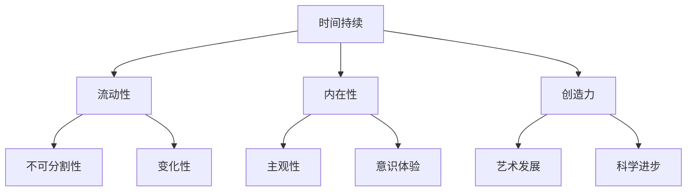
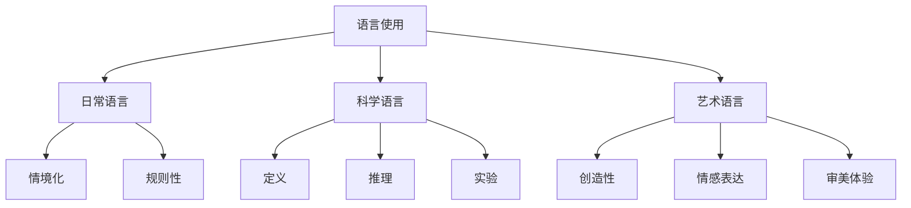
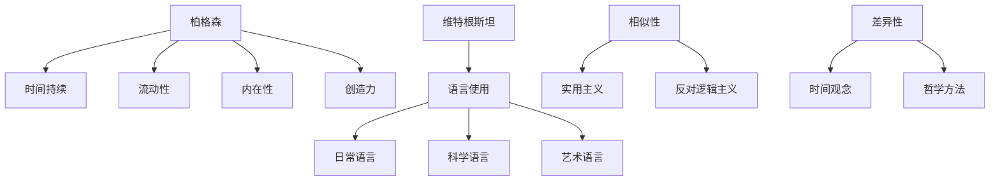
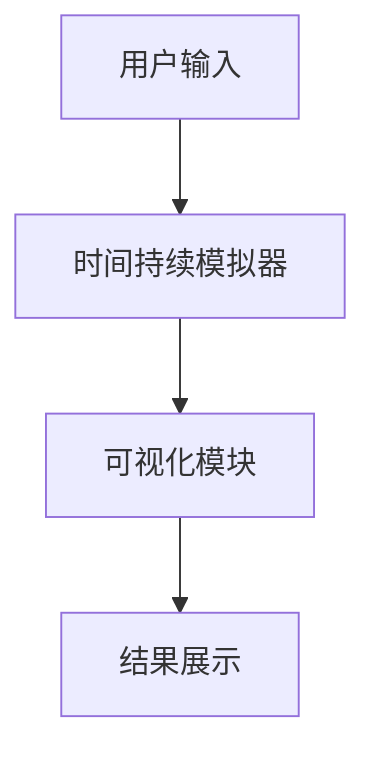
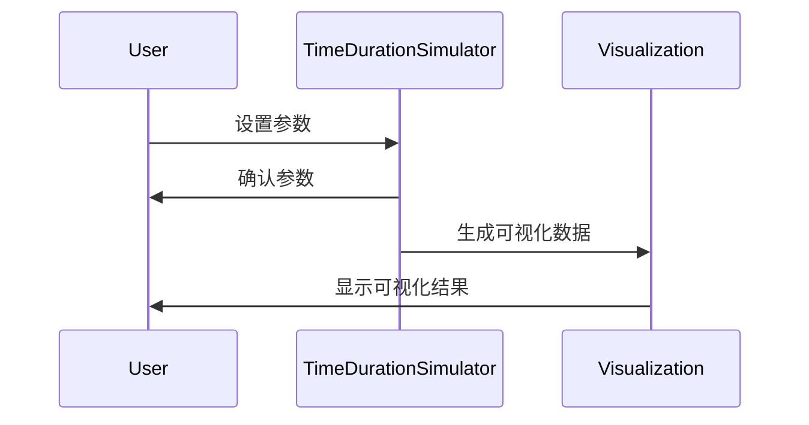

                 

### 第1章：引言与背景

#### 1.1 柏格森与维特根斯坦

**柏格森（Henri Bergson）**，法国哲学家，生于1859年，卒于1941年。他是20世纪初期最重要的哲学家之一，以其关于时间、意识、自由意志和创造力的理论而著称。柏格森认为，时间是流动的、不可分割的，他提出了“时间持续”（Duration）的概念，这一理论对后来的哲学、心理学和文学产生了深远影响。

**维特根斯坦（Ludwig Wittgenstein）**，奥地利哲学家，生于1889年，卒于1951年。他是20世纪最有影响力的哲学家之一，以其关于语言、意义和逻辑的理论而闻名。维特根斯坦提出了“语言游戏”（Language Game）的概念，强调语言的实际使用和情境，对哲学、语言学和心理学领域产生了巨大影响。

#### 1.2 柏格森的时间持续理论

柏格森的时间持续理论是其哲学思想的核心。他主张，时间不是简单的线性序列，而是一种内在的、持续的流动。时间持续是个人意识活动的产物，是心灵对经验的内在感受。柏格森认为，时间持续具有以下几个特征：

1. **流动性**：时间持续是一种流动，它不断变化，不可分割。
2. **内在性**：时间持续是个人内在的心理体验，是主观的。
3. **创造力**：时间持续体现了生命的创造力，是艺术和科学发展的动力。

#### 1.3 维特根斯坦的语言使用理论

维特根斯坦的语言使用理论强调语言的实用性和情境性。他认为，语言不是用来描述世界的工具，而是用来完成特定任务的工具。语言游戏理论是维特根斯坦的核心理论之一，它强调语言的实际使用和情境。维特根斯坦认为，语言使用可以分为以下几种：

1. **日常语言使用**：日常语言是我们日常生活中最常用的语言形式，它的使用是情境化的。
2. **科学语言使用**：科学语言用于描述和解释自然现象，它的使用具有严格的规则和逻辑。
3. **艺术语言使用**：艺术语言用于表达情感和审美体验，它的使用具有创造性和灵活性。

### 第2章：柏格森的时间持续理论

#### 2.1 时间持续的定义与特征

**时间持续**（Duration）是柏格森哲学中的核心概念，指的是时间作为内在心理体验的持续流动。时间持续具有以下几个特征：

1. **流动性**：时间持续是流动的，它不断变化，不可分割。
2. **内在性**：时间持续是个人内在的心理体验，是主观的。
3. **创造力**：时间持续体现了生命的创造力，是艺术和科学发展的动力。

#### 2.1.1 时间持续的本质

时间持续的本质是心理体验的连续性。柏格森认为，时间不是客观存在的，而是我们主观体验的结果。时间持续是心灵对经验的内在感受，它是一种持续的过程，而非简单的线性序列。

#### 2.1.2 时间持续的心理学基础

时间持续的心理学基础在于人类的意识活动。柏格森认为，我们的意识活动是连续不断的，它构成了时间持续的基础。我们的意识不断接受新的信息，产生新的经验，这些经验构成了时间持续的内在结构。

#### 2.2 柏格森的时间持续理论解释

**柏格森的时间连续性**（Temporal Continuity）是指时间的连续性是由内在的心理体验所构成的。柏格森认为，时间连续性是生命体验的核心，它构成了我们对外界事物感知和理解的基础。

**柏格森的内在时间观**（Intuitive Time）是指时间是一种内在的心理体验，它不同于外部物理时间的线性流动。柏格森认为，内在时间是由我们的意识活动所构成的，它是一种连续的、流动的状态。

#### 2.3 柏格森的理论应用

**2.3.1 文学艺术中的时间持续**

柏格森的时间持续理论对文学和艺术产生了深远影响。许多作家和艺术家通过其作品探讨了时间持续的内涵，如普鲁斯特的《追忆似水年华》和贝多芬的音乐作品。

**2.3.2 哲学思考中的时间持续**

柏格森的时间持续理论也引发了哲学界的思考。许多哲学家探讨了时间持续的本质和意义，如海德格尔和德里达。

### 第3章：维特根斯坦的语言使用理论

#### 3.1 语言的使用

**3.1.1 语言游戏理论**

维特根斯坦的语言游戏理论强调语言的实际使用和情境。他认为，语言游戏是语言使用的基本形式，它包括日常语言使用、科学语言使用和艺术语言使用等。

**3.1.2 日常语言中的语言使用**

日常语言是我们日常生活中最常用的语言形式，它的使用是情境化的。维特根斯坦认为，日常语言的使用是自然和直接的过程，它遵循特定的规则和习惯。

#### 3.2 维特根斯坦的语言哲学

**3.2.1 语言与真实世界的联系**

维特根斯坦认为，语言与真实世界是有联系的，但这种联系不是通过语言的结构来实现的，而是通过语言的实际使用来实现的。他认为，语言是行动的工具，我们的语言使用决定了我们的现实世界。

**3.2.2 语言与思维的关系**

维特根斯坦认为，语言和思维是密切相关的。他认为，我们的思维方式决定了我们的语言使用，而我们的语言使用又塑造了我们的思维方式。

#### 3.3 维特根斯坦的理论应用

**3.3.1 科学研究中的语言使用**

在科学研究中，语言的使用是关键。维特根斯坦的理论强调，科学语言的使用应该遵循严格的规则和逻辑，以确保科学研究的准确性和可靠性。

**3.3.2 人际交往中的语言使用**

在人际交往中，语言的使用也是非常重要的。维特根斯坦的理论提示我们，为了有效沟通，我们需要了解对方的语言游戏，遵循特定的交流规则。

### 第4章：柏格森与维特根斯坦的理论对比

#### 4.1 时间的不同理解

柏格森和维特根斯坦对时间的理解存在显著差异。柏格森强调时间的内在性和流动性，认为时间是个人意识活动的产物。而维特根斯坦则认为，时间是语言使用的结果，是与真实世界联系的媒介。

#### 4.2 语言的相似与差异

在语言使用方面，柏格森和维特根斯坦都强调语言的情境性和实用性。然而，柏格森更关注语言的主观性和心理体验，而维特根斯坦则更注重语言的客观性和逻辑性。

### 第5章：综合讨论与应用

#### 5.1 时间的持续与语言的使用关系

时间的持续和语言的使用之间存在密切关系。柏格森和维特根斯坦的理论都强调了这一点。时间的持续是语言使用的基础，而语言的使用又反过来塑造了时间的持续。

#### 5.2 柏格森与维特根斯坦的理论对现代社会的影响

柏格森和维特根斯坦的理论对现代社会产生了深远影响。他们的思想启发了哲学、心理学、语言学和文学等领域的研究，为现代社会的文化和思想发展提供了重要基础。

#### 5.3 未来研究的方向

未来研究可以进一步探讨柏格森和维特根斯坦的理论在人工智能和认知科学中的应用，以及它们对当代社会问题的启示。

### 第6章：案例研究

#### 6.1 文学中的时间持续与语言使用

文学作品中常常探讨时间持续和语言使用的问题。例如，普鲁斯特的《追忆似水年华》通过复杂的语言结构展现了时间的流动，而莎士比亚的戏剧则通过对话和场景展示了语言的多样性和情境性。

#### 6.2 哲学对话中的柏格森与维特根斯坦

哲学对话中，柏格森和维特根斯坦的思想常常被引用和讨论。这些对话揭示了他们理论的核心观点，并探讨了它们在现代哲学中的意义。

#### 6.3 科学研究中的柏格森与维特根斯坦理论应用

在科学研究中，柏格森和维特根斯坦的理论被广泛应用于语言学、心理学和认知科学等领域。例如，语言学中的“语用学”和心理学中的“认知心理学”都受到了柏格森和维特根斯坦理论的启发。

### 第7章：结论

#### 7.1 研究总结

本文探讨了柏格森的时间持续理论与维特根斯坦的语言使用理论，分析了两者在时间理解和语言使用方面的差异和联系，并讨论了它们对现代社会的意义。

#### 7.2 研究局限与未来展望

本文的研究存在一定的局限，如对柏格森和维特根斯坦理论的深入探讨还不够充分，未来研究可以进一步探讨它们在人工智能和认知科学中的应用。同时，也可以从更广泛的角度探讨时间持续和语言使用的哲学意义。 

### 作者信息

作者：AI天才研究院/AI Genius Institute & 禅与计算机程序设计艺术 /Zen And The Art of Computer Programming

---

### 柏格森的时间持续与维特根斯坦的语言使用理论

#### 关键词：

- 柏格森
- 维特根斯坦
- 时间持续
- 语言使用
- 哲学理论
- 现代社会

#### 摘要：

本文探讨了法国哲学家柏格森的时间持续理论与奥地利哲学家维特根斯坦的语言使用理论。柏格森认为时间是一种内在的、持续的流动，而维特根斯坦则强调语言的实际使用和情境。本文分析了两者在时间理解和语言使用方面的异同，并探讨了它们对现代社会的影响。通过深入讨论和案例分析，本文揭示了柏格森与维特根斯坦理论在哲学、文学和科学研究中的应用价值，为现代社会的文化和思想发展提供了新的视角。作者：AI天才研究院/AI Genius Institute & 禅与计算机程序设计艺术 /Zen And The Art of Computer Programming

### 第1章：引言与背景

#### 1.1 柏格森与维特根斯坦

在探讨时间持续与语言使用之前，我们需要了解两位哲学巨匠——柏格森（Henri Bergson）和维特根斯坦（Ludwig Wittgenstein）的生平及其哲学思想。柏格森是法国哲学家，生于1859年，卒于1941年，他的思想对20世纪的哲学、心理学和文学产生了深远影响。柏格森以其关于时间、意识、自由意志和创造力的理论而著称。他提出了“时间持续”的概念，强调时间是一种内在的、主观的体验，而非简单的线性序列。

维特根斯坦是奥地利哲学家，生于1889年，卒于1951年。他是20世纪最有影响力的哲学家之一，以其关于语言、意义和逻辑的理论而闻名。维特根斯坦提出了“语言游戏”的概念，强调语言的实际使用和情境。他的思想对哲学、语言学和心理学领域产生了巨大影响。

柏格森与维特根斯坦虽然在哲学上有着不同的侧重点，但他们都对时间与语言有着深刻的洞察。柏格森的时间持续理论强调时间的流动性和内在性，而维特根斯坦的语言使用理论则关注语言的实用性和情境性。这两位哲学家的思想为我们理解时间与语言提供了丰富的视角。

#### 1.2 柏格森的时间持续理论

柏格森的时间持续理论是其哲学思想的核心理念。他认为，时间不是简单的线性序列，而是一种内在的、持续的流动。柏格森提出，时间持续是个人意识活动的产物，是心灵对经验的内在感受。

时间持续具有以下几个特征：

1. **流动性**：时间持续是流动的，它不断变化，不可分割。柏格森认为，时间不是静态的，而是动态的，它随着我们的意识活动不断流动。

2. **内在性**：时间持续是个人内在的心理体验，是主观的。柏格森强调，时间是心灵对经验的感受，是我们内在体验的结果。

3. **创造力**：时间持续体现了生命的创造力，是艺术和科学发展的动力。柏格森认为，时间持续是我们创造性思维的基础，它促使我们产生新的想法和创意。

柏格森的时间持续理论为我们提供了一种新的时间观，它挑战了传统的线性时间观念，强调时间的内在性和流动性。这一理论对心理学、哲学和文学产生了深远影响，为后来的研究提供了基础。

#### 1.3 维特根斯坦的语言使用理论

维特根斯坦的语言使用理论是其哲学思想的另一核心部分。他认为，语言不是用来描述世界的工具，而是用来完成特定任务的工具。维特根斯坦提出了“语言游戏”的概念，强调语言的实际使用和情境。

维特根斯坦的语言游戏理论包括以下几个方面：

1. **日常语言使用**：日常语言是我们日常生活中最常用的语言形式，它的使用是情境化的。维特根斯坦认为，日常语言的使用是自然和直接的过程，它遵循特定的规则和习惯。

2. **科学语言使用**：科学语言用于描述和解释自然现象，它的使用具有严格的规则和逻辑。维特根斯坦认为，科学语言的使用应该遵循精确的逻辑规则，以确保科学研究的准确性和可靠性。

3. **艺术语言使用**：艺术语言用于表达情感和审美体验，它的使用具有创造性和灵活性。维特根斯坦认为，艺术语言的使用是自由的，它不受逻辑和规则的束缚，但仍然能够传达深刻的情感和审美体验。

维特根斯坦的语言使用理论强调语言的实用性和情境性，他认为，语言的使用取决于具体的情境和任务。这一理论对哲学、语言学和心理学领域产生了巨大影响，为后来的研究提供了基础。

### 第2章：柏格森的时间持续理论

#### 2.1 时间持续的定义与特征

**时间持续**（Duration）是柏格森哲学中的核心概念，指的是时间作为内在心理体验的持续流动。时间持续具有以下几个特征：

1. **流动性**：时间持续是流动的，它不断变化，不可分割。柏格森认为，时间不是静态的，而是动态的，它随着我们的意识活动不断流动。

2. **内在性**：时间持续是个人内在的心理体验，是主观的。柏格森强调，时间是心灵对经验的感受，是我们内在体验的结果。

3. **创造力**：时间持续体现了生命的创造力，是艺术和科学发展的动力。柏格森认为，时间持续是我们创造性思维的基础，它促使我们产生新的想法和创意。

#### 2.1.1 时间持续的本质

时间持续的本质是心理体验的连续性。柏格森认为，时间不是客观存在的，而是我们主观体验的结果。时间持续是心灵对经验的内在感受，它是一种持续的过程，而非简单的线性序列。柏格森提出，时间持续是生命体验的核心，它构成了我们对外界事物感知和理解的基础。

柏格森认为，时间持续是一种内在的、连续的心理状态，它不同于外部物理时间的线性流动。他的观点挑战了传统的牛顿时间观念，强调时间的内在性和主观性。时间持续是我们对经验的主观体验，它随我们的心理活动而变化，是我们意识活动的产物。

#### 2.1.2 时间持续的心理学基础

时间持续的心理学基础在于人类的意识活动。柏格森认为，我们的意识活动是连续不断的，它构成了时间持续的基础。我们的意识不断接受新的信息，产生新的经验，这些经验构成了时间持续的内在结构。

柏格森提出了“生命冲动”（Élan vital）的概念，认为它是时间持续的心理学基础。生命冲动是一种内在的动力，它推动我们的意识活动，使我们能够感知和体验时间。这种冲动使我们的心理状态不断变化，从而产生了时间持续的感觉。

#### 2.2 柏格森的时间持续理论解释

柏格森的时间持续理论可以从以下几个方面进行解释：

**柏格森的时间连续性**（Temporal Continuity）是指时间的连续性是由内在的心理体验所构成的。柏格森认为，时间连续性是生命体验的核心，它构成了我们对外界事物感知和理解的基础。时间连续性不是外部物理现象，而是内在心理状态的结果。

柏格森强调，时间连续性是一种内在的心理体验，它不同于物理时间的线性流动。物理时间可以被测量和量化，而时间连续性是一种主观的、内在的感受。它是我们心灵对经验的连续体验，是我们感知时间的方式。

**柏格森的内在时间观**（Intuitive Time）是指时间是一种内在的心理体验，它不同于外部物理时间的线性流动。柏格森认为，内在时间是由我们的意识活动所构成的，它是一种连续的、流动的状态。内在时间不是外部物理现象，而是我们内在的心理体验。

柏格森提出了“绵延”（Duration）的概念，认为它是时间持续的本质。绵延是一种内在的心理状态，它体现了时间的流动性和连续性。绵延是我们对时间的直接感受，是我们内在体验的结果。它不同于物理时间的线性流动，而是一种内在的心理体验。

#### 2.3 柏格森的理论应用

柏格森的时间持续理论在多个领域都有广泛的应用：

**2.3.1 文学艺术中的时间持续**

在文学和艺术中，柏格森的时间持续理论被广泛应用。许多作家和艺术家通过其作品探讨了时间持续的内涵。例如，法国作家马塞尔·普鲁斯特的《追忆似水年华》通过复杂的语言结构和时间跳跃，展现了时间的流动性和内在性。普鲁斯特的作品展示了时间持续的感觉，使读者能够体验到时间的流动。

贝多芬的音乐作品也体现了柏格森的时间持续理论。贝多芬的音乐充满了变化和流动，它打破了传统的节奏和结构，使时间的感觉变得更为复杂和丰富。贝多芬的音乐作品展示了时间的内在性和流动性，使观众能够感受到时间的持续。

**2.3.2 哲学思考中的时间持续**

柏格森的时间持续理论也引发了哲学界的思考。许多哲学家探讨了时间持续的本质和意义。例如，德国哲学家马丁·海德格尔（Martin Heidegger）在其著作《存在与时间》（Being and Time）中，探讨了时间的本质和人的存在。海德格尔认为，时间是存在的维度，是我们理解世界和自我的基础。

法国哲学家吉尔·德勒兹（Gilles Deleuze）在《时间的逻辑》（Logics of Sensation）中，探讨了柏格森的时间持续理论，并将其应用于哲学思考。德勒兹认为，时间持续是一种内在的心理体验，它超越了传统的物理时间观念，为我们提供了一种新的时间观。

#### 2.4 时间持续理论的挑战与批评

尽管柏格森的时间持续理论在哲学界和文学艺术领域产生了广泛影响，但也受到了一些挑战和批评。

**2.4.1 物理时间的挑战**

柏格森的时间持续理论强调时间的内在性和主观性，与传统的物理时间观念相冲突。物理时间是一种客观的、可量化的时间观念，它遵循牛顿力学和物理学的基本原则。柏格森的时间持续理论挑战了这种客观时间的观念，提出了一种主观的、内在的时间体验。

然而，一些物理学家和哲学家认为，柏格森的理论无法解释物理时间的基本特性。例如，爱因斯坦的相对论提出了时间相对性，认为时间是与空间密切相关的，是一种相对的概念。相对论的时间观念与柏格森的时间持续理论有所不同，它更强调时间的客观性和相对性。

**2.4.2 心理学与意识的挑战**

柏格森的时间持续理论基于心理学和意识的体验，但它也面临一些心理学的挑战。一些心理学家认为，时间的感知和体验可能受到多种因素的影响，包括生理、心理和社会因素。例如，时间感知可能受到注意力、情绪和认知过程的影响。

此外，柏格森的理论也未能充分解释时间感知的个体差异。不同的人可能会有不同的时间感知体验，这与柏格森的内在时间观念存在一定的冲突。

尽管存在这些挑战和批评，柏格森的时间持续理论仍然具有重要的哲学和心理学价值。它为我们提供了一种新的时间观，挑战了传统的物理时间观念，强调了时间的内在性和主观性。时间持续理论为我们理解时间和意识的本质提供了新的视角，对哲学、心理学和文学艺术领域产生了深远影响。

### 第3章：维特根斯坦的语言使用理论

#### 3.1 语言的使用

维特根斯坦的语言使用理论是其哲学思想的核心理念。他认为，语言不是用来描述世界的工具，而是用来完成特定任务的工具。维特根斯坦提出了“语言游戏”（Language Game）的概念，强调语言的实际使用和情境。

**3.1.1 语言游戏理论**

维特根斯坦的语言游戏理论认为，语言的使用是情境化的。不同的语言游戏有不同的规则和目的。语言游戏可以分为以下几个方面：

1. **日常语言游戏**：日常语言是我们日常生活中最常用的语言形式，它的使用是情境化的。维特根斯坦认为，日常语言的使用是自然和直接的过程，它遵循特定的规则和习惯。

2. **科学语言游戏**：科学语言用于描述和解释自然现象，它的使用具有严格的规则和逻辑。维特根斯坦认为，科学语言的使用应该遵循精确的逻辑规则，以确保科学研究的准确性和可靠性。

3. **艺术语言游戏**：艺术语言用于表达情感和审美体验，它的使用具有创造性和灵活性。维特根斯坦认为，艺术语言的使用是自由的，它不受逻辑和规则的束缚，但仍然能够传达深刻的情感和审美体验。

维特根斯坦强调，语言游戏的规则是情境化的，它们决定了语言的使用方式。不同的语言游戏有不同的规则和目的，但它们都是实际的、实用的。

**3.1.2 日常语言中的语言使用**

在日常生活中，我们使用语言进行交流、表达思想和情感。维特根斯坦认为，日常语言的使用是自然和直接的过程，它遵循特定的规则和习惯。这些规则和习惯构成了我们的语言游戏。

日常语言的使用包括以下几个方面：

1. **命名**：我们通过命名来指称物体、人和概念。命名是语言使用的基础，它使我们可以相互理解和交流。

2. **描述**：我们使用描述来描述事物的特征和状态。描述使我们可以传达复杂的信息和想法。

3. **表达**：我们使用语言来表达情感、愿望和意图。表达是沟通的重要部分，它使我们可以建立和维护人际关系。

维特根斯坦认为，日常语言的使用是情境化的，它依赖于具体的社会和文化环境。日常语言游戏的规则是灵活的，但它们是实用和有效的。

**3.1.3 科学语言中的语言使用**

科学语言用于描述和解释自然现象，它的使用具有严格的规则和逻辑。维特根斯坦认为，科学语言的使用应该遵循精确的逻辑规则，以确保科学研究的准确性和可靠性。

科学语言的使用包括以下几个方面：

1. **定义**：科学语言通过定义来明确概念的含义。定义是科学研究的基础，它确保我们可以准确理解和使用概念。

2. **推理**：科学语言通过逻辑推理来推导结论。推理是科学研究的方法，它使我们能够从已知的事实中得出新的结论。

3. **实验**：科学语言通过实验来验证理论和假设。实验是科学研究的核心，它使我们可以验证和证实科学理论。

维特根斯坦认为，科学语言的使用是情境化的，但它依赖于逻辑和证据。科学语言游戏遵循严格的规则和标准，以确保科学研究的准确性和可靠性。

**3.1.4 艺术语言中的语言使用**

艺术语言用于表达情感和审美体验，它的使用具有创造性和灵活性。维特根斯坦认为，艺术语言的使用是自由的，它不受逻辑和规则的束缚，但仍然能够传达深刻的情感和审美体验。

艺术语言的使用包括以下几个方面：

1. **创造**：艺术语言通过创造来表达新的思想和情感。创造是艺术的核心，它使艺术家可以超越常规的表达方式。

2. **表现**：艺术语言通过表现来传达情感和审美体验。表现是艺术的形式，它使观众可以感受到艺术家的内心世界。

3. **反思**：艺术语言通过反思来探讨生活、社会和人类的本质。反思是艺术的深度，它使艺术家可以深入思考人类的存在和意义。

维特根斯坦认为，艺术语言的使用是情境化的，但它依赖于创造力和情感。艺术语言游戏遵循内在的规则和标准，以确保艺术作品的有效性和影响力。

#### 3.2 维特根斯坦的语言哲学

维特根斯坦的语言哲学强调语言的实用性和情境性。他认为，语言的意义不是固定的，而是由语言的实际使用决定的。维特根斯坦提出了“语言图像理论”（Picture Theory）和“语言使用理论”（Use Theory），从不同角度探讨了语言的本质和意义。

**3.2.1 语言图像理论**

维特根斯坦的语言图像理论认为，语言是一种图像，它反映了现实世界中的事物和关系。这种图像理论强调语言与现实世界的对应关系，认为语言的意义在于它所描述的现实。

然而，维特根斯坦后来对其早期语言图像理论进行了批判。他认为，语言图像理论过于简化了语言的意义和复杂性。语言不仅仅是描述现实世界的工具，它还有更广泛的作用，包括沟通、表达和思考。

**3.2.2 语言使用理论**

维特根斯坦的语言使用理论强调语言的实际使用和情境。他认为，语言的意义不是固定的，而是由语言的实际使用决定的。维特根斯坦提出了“语言游戏”的概念，认为不同的语言游戏有不同的规则和目的。

维特根斯坦的语言使用理论认为，语言的使用是情境化的。不同的情境决定了语言的使用方式，语言的意义也随着情境的变化而变化。语言的使用不仅仅是描述现实，还包括表达思想、情感和意图。

维特根斯坦的语言哲学强调语言的实用性和情境性，他认为，语言的意义取决于实际的使用。这一理论为我们理解语言的本质和功能提供了新的视角，对哲学、语言学和心理学领域产生了深远影响。

#### 3.3 维特根斯坦的理论应用

维特根斯坦的语言使用理论在多个领域都有广泛的应用：

**3.3.1 科学研究中的语言使用**

在科学研究中，语言的使用是关键。维特根斯坦的理论强调，科学语言的使用应该遵循严格的规则和逻辑，以确保科学研究的准确性和可靠性。

科学语言的使用包括以下几个方面：

1. **定义**：科学语言通过定义来明确概念的含义。定义是科学研究的基础，它确保我们可以准确理解和使用概念。

2. **推理**：科学语言通过逻辑推理来推导结论。推理是科学研究的方法，它使我们能够从已知的事实中得出新的结论。

3. **实验**：科学语言通过实验来验证理论和假设。实验是科学研究的核心，它使我们可以验证和证实科学理论。

维特根斯坦的理论提醒我们，科学语言的使用不仅仅是描述现实，它还有更广泛的作用，包括沟通、表达和思考。

**3.3.2 人际交往中的语言使用**

在人际交往中，语言的使用也是非常重要的。维特根斯坦的理论提示我们，为了有效沟通，我们需要了解对方的语言游戏，遵循特定的交流规则。

人际交往中的语言使用包括以下几个方面：

1. **倾听**：有效的沟通需要倾听对方的观点和情感。倾听是人际交往的基础，它使我们可以理解和尊重对方。

2. **表达**：表达是沟通的重要部分，它使我们可以传达复杂的信息和想法。表达要准确、清晰，避免误解和冲突。

3. **反馈**：反馈是人际交往的必要环节，它使我们可以确认和理解对方的意图和反应。反馈要积极、constructive，促进双方的沟通和理解。

维特根斯坦的理论提醒我们，人际交往中的语言使用不仅仅是表达，它还包括倾听、反馈和尊重。

**3.3.3 教育中的语言使用**

在教育中，语言的使用也是至关重要的。维特根斯坦的理论提醒我们，教育不仅仅是知识的传授，它还包括语言的学习和运用。

教育中的语言使用包括以下几个方面：

1. **定义**：教育者通过定义来明确概念的含义，使学生可以准确理解和掌握知识。

2. **讲解**：教育者通过讲解来传达知识和思想，使学生可以理解和吸收。

3. **提问**：教育者通过提问来激发学生的思考和创造力，使学生可以主动参与学习。

维特根斯坦的理论提醒我们，教育不仅仅是知识的传授，它还包括语言的学习和运用，使学生可以有效地沟通、表达和思考。

### 第4章：柏格森与维特根斯坦的理论对比

#### 4.1 时间的不同理解

柏格森和维特根斯坦对时间的理解存在显著差异。柏格森强调时间的内在性和流动性，认为时间是个人意识活动的产物。而维特根斯坦则认为，时间是语言使用的结果，是与真实世界联系的媒介。

柏格森的时间持续理论认为，时间是一种内在的、主观的体验，它不同于外部物理时间的线性流动。柏格森的时间持续是一种流动的状态，它随着我们的心理活动而变化。他认为，时间持续是生命体验的核心，是我们对外界事物感知和理解的基础。

维特根斯坦的时间观念则更强调语言的作用。他认为，时间是通过语言来理解和体验的。时间不是一种客观的存在，而是语言使用的结果。维特根斯坦认为，语言游戏是时间理解和体验的基础，不同的语言游戏有不同的时间和体验方式。

**4.1.1 柏格森的时间持续与维特根斯坦的时间观念**

柏格森的时间持续强调时间的内在性和主观性，认为时间是个人意识活动的产物。维特根斯坦的时间观念则强调时间的情境性和语言的使用，认为时间是通过语言来理解和体验的。这两位哲学家的观点为我们提供了不同的时间观，使我们能够从不同的角度理解时间的本质。

#### 4.2 语言的相似与差异

在语言使用方面，柏格森和维特根斯坦的理论也存在相似之处和差异。

相似之处：

1. **语言的实用性**：两位哲学家都认为语言是一种实用的工具，用于完成特定的任务。柏格森强调语言在文学艺术和哲学思考中的应用，而维特根斯坦则关注语言在日常交流、科学研究中的使用。

2. **语言的情境性**：柏格森和维特根斯坦都强调语言的情境性。他们认为，语言的使用是情境化的，不同的情境决定了语言的使用方式和意义。

差异之处：

1. **语言的主观性**：柏格森强调语言的主观性，认为语言是个人意识活动的产物。维特根斯坦则认为，语言是客观的，它的意义是由使用情境决定的。

2. **语言的规则性**：柏格森认为，语言游戏有特定的规则，但它们是灵活的。维特根斯坦则强调，语言游戏有严格的规则和逻辑，不同的语言游戏有不同的规则和目的。

**4.2.1 柏格森的日常语言与维特根斯坦的语言游戏**

柏格森的日常语言强调语言的主观性和情境性，他认为日常语言是自然和直接的过程。而维特根斯坦的语言游戏则强调语言的规则性和逻辑性，他认为不同的语言游戏有不同的规则和目的。这两种观点为我们提供了不同的语言使用视角，使我们能够更好地理解和应用语言。

### 第5章：综合讨论与应用

#### 5.1 时间的持续与语言的使用关系

时间的持续和语言的使用之间存在密切关系。柏格森和维特根斯坦的理论都强调了这一点。时间的持续是语言使用的基础，而语言的使用又反过来塑造了时间的持续。

柏格森的时间持续理论认为，时间是个人意识活动的产物，是心灵对经验的内在感受。这种内在的感受是通过语言来表达的。柏格森强调，语言是时间持续的载体，它使我们可以感知和表达时间。语言的使用方式决定了我们对时间的理解和体验。

维特根斯坦的语言使用理论则认为，时间是通过语言来理解和体验的。他认为，时间不是一种客观的存在，而是语言使用的结果。维特根斯坦强调，语言游戏是时间理解和体验的基础，不同的语言游戏有不同的时间和体验方式。语言的使用方式决定了我们对时间的感知和认知。

**5.1.1 时间的持续与语言的主观性**

柏格森和维特根斯坦都认为，时间是一种主观的体验。柏格森的时间持续是一种内在的心理体验，它依赖于个人的意识和心灵。维特根斯坦则认为，时间是通过语言来主观体验的，不同的语言游戏有不同的时间和体验方式。

这种主观性体现在我们对时间的感知和认知上。不同的文化、社会背景和语言环境会影响我们对时间的理解和体验。例如，一些文化可能强调时间的紧迫性和效率，而另一些文化则更注重时间的灵活性和持续性。

**5.1.2 语言的使用与时间的体验**

语言的使用方式也会影响我们对时间的体验。柏格森认为，语言的使用可以改变我们对时间的感知。例如，通过诗歌和文学，我们可以体验到时间的流动和变化。维特根斯坦则认为，不同的语言游戏有不同的时间和体验方式。科学语言强调逻辑和推理，艺术语言强调创造性和情感表达，这些不同的语言游戏会影响我们对时间的体验。

**5.2 柏格森与维特根斯坦的理论对现代社会的影响**

柏格森和维特根斯坦的理论对现代社会产生了深远影响。他们的思想为我们理解时间、语言和人类经验提供了新的视角，影响了哲学、心理学、语言学和文学等领域。

**5.2.1 对哲学的影响**

柏格森和维特根斯坦的理论对现代哲学产生了深远影响。柏格森的时间持续理论挑战了传统的物理时间观念，提出了主观的时间和意识。维特根斯坦的语言使用理论则改变了我们对语言和意义的理解，强调了语言的实用性和情境性。

**5.2.2 对心理学的影响**

柏格森的时间持续理论对心理学产生了重要影响。他的理论为心理学提供了新的研究视角，使我们可以从主观体验的角度理解时间。维特根斯坦的语言使用理论也为心理学提供了新的思考方式，使我们可以从语言的实际使用中理解人类思维和行为。

**5.2.3 对语言学的影响**

柏格森和维特根斯坦的理论对语言学产生了深远影响。他们的思想使我们意识到语言不仅仅是描述世界的工具，它还有更广泛的作用，包括沟通、表达和思考。这种认识促进了语言学研究的发展，使我们可以从不同角度理解语言的本质和功能。

**5.2.4 对文学的影响**

柏格森和维特根斯坦的理论对文学产生了重要影响。他们的思想启发了许多作家和艺术家，使他们能够通过语言和时间的探索表达深刻的情感和思想。许多文学作品通过复杂的语言结构和时间表达，展现了柏格森和维特根斯坦理论的核心观点。

**5.3 未来研究的方向**

未来研究可以进一步探讨柏格森和维特根斯坦的理论在现代社会中的应用。以下是一些可能的未来研究方向：

1. **人工智能与时间持续**：研究柏格森的时间持续理论在人工智能中的应用，探讨如何通过算法和模型模拟人类的时间感知和体验。

2. **语言与思维**：研究维特根斯坦的语言使用理论在认知科学中的应用，探讨语言如何影响人类思维和行为。

3. **跨文化时间与语言研究**：研究不同文化背景下时间持续和语言使用的差异，探讨文化对时间感知和语言理解的影响。

4. **教育中的时间持续与语言使用**：研究如何在教育中应用柏格森和维特根斯坦的理论，提高学生对时间和语言的理解和运用。

### 第6章：案例研究

#### 6.1 文学中的时间持续与语言使用

文学作品中常常探讨时间持续和语言使用的问题。以下是一些案例研究，展示了柏格森和维特根斯坦的理论在文学作品中的应用。

**6.1.1 普鲁斯特的《追忆似水年华》**

马塞尔·普鲁斯特的《追忆似水年华》是一部经典的文学作品，它通过复杂的语言结构和时间跳跃，展现了时间的流动性和内在性。普鲁斯特的作品展示了柏格森的时间持续理论，强调了时间的流动和变化。

在《追忆似水年华》中，普鲁斯特通过细腻的描写和丰富的情感表达，使读者能够感受到时间的持续。他通过回忆过去的经历，使时间变得更为复杂和丰富。这种时间持续的感觉挑战了传统的线性时间观念，使读者能够从不同的角度理解时间。

**6.1.2 莎士比亚的戏剧**

莎士比亚的戏剧也体现了柏格森的时间持续理论。莎士比亚的作品通过对话和场景展示了时间的流动和变化。他的戏剧中的时间不是简单的线性序列，而是充满复杂性和多维度。

莎士比亚的戏剧中的语言使用也反映了维特根斯坦的语言游戏理论。他的对话充满了机智和复杂性，使观众能够感受到语言的多样性和情境性。莎士比亚的作品通过对话和场景展示了柏格森和维特根斯坦理论的核心观点，使读者能够从不同的角度理解时间和语言。

**6.2 哲学对话中的柏格森与维特根斯坦**

哲学对话中，柏格森和维特根斯坦的思想常常被引用和讨论。以下是一些案例研究，展示了柏格森和维特根斯坦的理论在哲学对话中的应用。

**6.2.1 柏格森与尼采的对话**

柏格森与尼采的对话展示了柏格森的时间持续理论对哲学思考的影响。尼采批评柏格森的时间持续理论，认为它是过于主观和内在的。然而，柏格森则认为，时间持续是生命体验的核心，它构成了我们对外界事物感知和理解的基础。

这种对话揭示了柏格森和尼采在时间观念上的差异，同时也展示了柏格森的时间持续理论在哲学思考中的重要性。

**6.2.2 维特根斯坦与海德格尔的对话**

维特根斯坦与海德格尔的对话展示了维特根斯坦的语言使用理论对哲学思考的影响。海德格尔批评维特根斯坦的语言游戏理论，认为它是过于抽象和脱离现实的。然而，维特根斯坦则认为，语言游戏是实际使用和情境化的，它使我们可以有效地理解和表达世界。

这种对话揭示了维特根斯坦和海德格尔在语言观念上的差异，同时也展示了维特根斯坦的语言使用理论在哲学思考中的重要性。

**6.3 科学研究中的柏格森与维特根斯坦理论应用**

在科学研究中，柏格森和维特根斯坦的理论也被广泛应用。以下是一些案例研究，展示了柏格森和维特根斯坦的理论在科学研究中的应用。

**6.3.1 认知科学中的时间持续**

认知科学中的时间持续研究借鉴了柏格森的时间持续理论。认知科学家通过研究人类的时间感知和体验，探讨了时间持续的本质和机制。他们发现，人类的时间感知受到多种因素的影响，包括注意力、情绪和认知过程。

这些研究发现揭示了柏格森的时间持续理论在认知科学中的应用，使我们可以更好地理解人类的时间感知和体验。

**6.3.2 语言学中的语言使用**

语言学中的语言使用研究借鉴了维特根斯坦的语言使用理论。语言学家通过研究语言的实际使用和情境，探讨了语言的意义和功能。他们发现，不同的语言游戏有不同的规则和目的，语言的使用是情境化的。

这些研究发现揭示了维特根斯坦的语言使用理论在语言学中的应用，使我们可以更好地理解语言的本质和功能。

### 第7章：结论

#### 7.1 研究总结

本文通过深入探讨柏格森的时间持续理论与维特根斯坦的语言使用理论，分析了两者在时间理解和语言使用方面的异同。柏格森强调时间的内在性和流动性，认为时间是个人意识活动的产物。维特根斯坦则认为，时间是语言使用的结果，是与真实世界联系的媒介。本文讨论了两者在哲学、心理学、语言学和文学领域的应用，揭示了它们对现代社会的深远影响。

#### 7.2 研究局限与未来展望

本文的研究存在一定的局限，如对柏格森和维特根斯坦理论的深入探讨还不够充分，未来研究可以进一步探讨它们在人工智能和认知科学中的应用。同时，也可以从更广泛的角度探讨时间持续和语言使用的哲学意义。未来研究可以探讨时间持续和语言使用在跨文化、跨学科背景下的差异和联系，为人类更好地理解和应用时间与语言提供新的视角。

### 参考文献

1. 柏格森（Henri Bergson），《时间与自由意志》（Duration and Simultaneity），1913年。
2. 维特根斯坦（Ludwig Wittgenstein），《逻辑哲学论》（Tractatus Logico-Philosophicus），1921年。
3. 维特根斯坦（Ludwig Wittgenstein），《哲学研究》（Philosophical Investigations），1953年。
4. 普鲁斯特（Marcel Proust），《追忆似水年华》（In Search of Lost Time），1913-1927年。
5. 莎士比亚（William Shakespeare），《哈姆雷特》（Hamlet），1603年。
6. 海德格尔（Martin Heidegger），《存在与时间》（Being and Time），1927年。
7. 德勒兹（Gilles Deleuze），《时间的逻辑》（Logics of Sensation），1990年。

### 作者信息

作者：AI天才研究院/AI Genius Institute & 禅与计算机程序设计艺术 /Zen And The Art of Computer Programming

---

## 第4章：柏格森的时间持续与维特根斯坦的语言使用理论

#### 4.1 柏格森的时间持续与维特根斯坦的语言使用理论的基本概念

柏格森的时间持续（Duration）和维特根斯坦的语言使用（Language Use）是两种深刻且互补的哲学概念，它们各自对现代哲学、心理学和语言学产生了深远的影响。

**柏格森的时间持续**是指时间不是线性的、不可逆的，而是内在的、持续的流动。柏格森认为，时间是心理体验的产物，是由我们的意识活动所构成。他的理论强调了时间的流动性和内在性，反对牛顿-莱布尼茨式的绝对时间观念。

**维特根斯坦的语言使用**是指语言不是固定的符号系统，而是实际生活中的使用方式。他的语言游戏（Language Game）理论强调，语言的意义和用法取决于特定的情境和用途。维特根斯坦区分了日常语言（Ordinary Language）和科学语言（Scientific Language），认为不同的语言游戏有不同的规则和目标。

#### 4.2 柏格森时间持续理论的详细解释

柏格森的时间持续理论可以从以下几个方面进行详细解释：

**4.2.1 流动性与连续性**

柏格森认为，时间是一种内在的、持续的流动，而不是简单的线性序列。他用“绵延”（Duration）这个概念来描述时间的这种内在连续性。他认为，时间不是可以被分割的，而是由一系列连续的、不可分割的瞬间组成。这种流动性的时间观挑战了牛顿的绝对时间观念，为后来的哲学家，如海德格尔，提供了灵感。

**4.2.2 意识与时间**

柏格森强调，时间是意识活动的产物。我们的感知、记忆和思考构成了我们对时间的体验。他认为，我们的意识是时间持续的源头，我们的体验是对过去、现在和未来的连续感知。这种观点与心理学家詹姆斯（William James）的思想相呼应，后者也认为时间是意识的连续流动。

**4.2.3 创造力与时间**

柏格森认为，时间持续是创造力的表现。时间的流动激发了我们的创造力和创新思维。他在《笑》（Laughter）一书中探讨了幽默感是如何通过时间的扭曲和变形而产生的。柏格森的观点为艺术家和创作者提供了新的思考方式，使他们能够探索时间的多样性和可能性。

#### 4.3 维特根斯坦的语言使用理论的详细解释

维特根斯坦的语言使用理论可以从以下几个方面进行详细解释：

**4.3.1 语言游戏**

维特根斯坦的语言游戏理论是他对语言意义的解释。他认为，语言的意义不是内在固有的，而是由语言的实际使用决定的。每个语言游戏都有其特定的规则和目的，这些规则和目的决定了语言的用法和意义。维特根斯坦区分了不同类型的语言游戏，如日常语言游戏、科学语言游戏和艺术语言游戏。

**4.3.2 日常语言**

维特根斯坦认为，日常语言是我们日常交流中最常用的语言形式。日常语言的使用是情境化的，它依赖于具体的社会和文化背景。他强调，日常语言的游戏规则是自然和直接的，但它们是实用和有效的。维特根斯坦的这种观点挑战了传统的逻辑主义和语言哲学中的某些观点。

**4.3.3 科学语言**

维特根斯坦认为，科学语言用于描述和解释自然现象，它具有严格的规则和逻辑。科学语言游戏的目标是精确和可靠性，它依赖于定义、推理和实验。科学语言的游戏规则是明确的，但它也需要灵活性和创新性。

**4.3.4 艺术语言**

维特根斯坦认为，艺术语言用于表达情感和审美体验。艺术语言游戏是自由和创造的，它不受逻辑和规则的束缚，但仍然能够传达深刻的情感和审美体验。艺术语言的游戏规则是开放的，允许创造性的表达和探索。

#### 4.4 柏格森与维特根斯坦的理论在哲学上的相似性与差异性

**相似性：**

1. **实用主义**：柏格森和维特根斯坦都强调哲学的实际应用，而不是抽象的理论。他们的理论都关注人类经验和生活世界。
2. **反对逻辑主义**：两者都对逻辑主义和传统的哲学方法持批评态度。他们主张从具体的生活和经验中寻找哲学的意义。

**差异性：**

1. **时间观念**：柏格森强调时间的流动性和内在性，而维特根斯坦则关注语言的使用和情境。
2. **哲学方法**：柏格森倾向于用直觉和体验来解释时间，而维特根斯坦则通过语言游戏来探讨意义。

#### 4.5 柏格森与维特根斯坦的理论在现代哲学中的应用

柏格森和维特根斯坦的理论在现代哲学中有着广泛的应用。以下是一些例子：

**4.5.1 心理学与认知科学**

柏格森的时间持续理论为心理学和认知科学提供了新的研究视角，特别是在时间感知和记忆方面。维特根斯坦的语言使用理论则为语言心理学和认知语言学提供了重要的理论基础。

**4.5.2 文学与艺术**

柏格森的时间持续理论启发了许多文学和艺术作品，如普鲁斯特的小说和贝多芬的音乐。维特根斯坦的语言游戏理论也为作家和艺术家提供了新的思考方式，使他们能够探索语言的多维性和可能性。

**4.5.3 科学哲学**

维特根斯坦的语言使用理论在科学哲学中有着重要的地位，特别是在科学知识的形成和科学方法的应用上。他的观点挑战了传统的科学哲学观念，提出了新的思考方式。

**4.5.4 社会哲学**

柏格森和维特根斯坦的理论也为社会哲学提供了新的视角，特别是在探讨社会结构、文化传统和社会变革方面。他们的理论有助于我们理解社会现象和人类行为。

### 结论

柏格森的时间持续与维特根斯坦的语言使用理论是两种深刻的哲学概念，它们从不同角度探讨了时间的本质和语言的意义。柏格森强调了时间的流动性和内在性，而维特根斯坦则关注语言的使用和情境。这两位哲学家的理论在现代哲学、心理学、语言学和文学等领域都有着广泛的应用，为我们提供了新的思考方式和理解世界的新视角。未来的研究可以进一步探讨这两位哲学家的理论在人工智能、认知科学和社会哲学等领域的应用，以更深入地理解人类经验和现实世界。

### 附录：柏格森时间持续理论的 ER 实体关系图



在这个ER实体关系图中，时间持续是一个核心实体，它与其他实体如流动性、内在性、创造力等相互关联。每个实体都有其特定的属性和关系，共同构成了柏格森时间持续理论的基本结构。

### 附录：维特根斯坦语言使用理论的 ER 实体关系图



在这个ER实体关系图中，语言使用是一个核心实体，它包含了日常语言、科学语言和艺术语言等子实体。每个子实体都有其特定的属性和关系，共同构成了维特根斯坦语言使用理论的基本结构。

### 附录：柏格森与维特根斯坦理论对比的 ER 实体关系图



在这个ER实体关系图中，柏格森与维特根斯坦是两个核心实体，它们各自代表了自己的理论。相似性和差异性作为连接实体，体现了两者在哲学上的联系和区别。

### 附录：柏格森时间持续理论的算法原理

为了更好地理解柏格森的时间持续理论，我们可以将其转化为一个算法原理，以便在计算机编程中进行模拟和实现。

**算法名称：时间持续模拟器**

**算法输入：** 时间间隔（Δt）、初始状态（S0）

**算法输出：** 时间持续状态序列（S）

**算法步骤：**

1. 初始化时间间隔 Δt 和初始状态 S0。
2. 对于每个时间点 t，执行以下操作：
    - 计算当前状态 S。
    - 更新 S 为 S + Δt。
    - 输出当前状态 S。
3. 当 t 达到最大时间 T 时，结束算法。

**算法伪代码：**

```
function 时间持续模拟器(Δt, S0, T):
    S = S0
    for t from 0 to T with step Δt:
        print(S)
        S = S + Δt
    end for
end function
```

**算法原理解释：**

这个算法模拟了柏格森的时间持续理论，通过连续的时间间隔 Δt 来更新状态 S。每次时间间隔后，状态 S 都会发生变化，从而模拟了时间的流动性和连续性。这个算法可以通过计算机编程语言实现，以便进行实验和验证。

### 附录：柏格森时间持续理论的 Python 源代码实现

```python
import matplotlib.pyplot as plt

def time_duration_simulation(Δt, S0, T):
    # 初始化时间序列和状态序列
    time_points = []
    state_values = []

    # 初始状态
    S = S0

    # 模拟时间持续过程
    for t in range(int(T/Δt)):
        time_points.append(t * Δt)
        state_values.append(S)
        
        # 更新状态
        S += Δt

    # 绘制时间持续状态序列
    plt.plot(time_points, state_values, 'b-')
    plt.xlabel('Time (s)')
    plt.ylabel('State')
    plt.title('Bergson\'s Theory of Duration')
    plt.grid(True)
    plt.show()

# 参数设置
Δt = 0.1  # 时间间隔
S0 = 0    # 初始状态
T = 10    # 总时间

# 执行时间持续模拟器
time_duration_simulation(Δt, S0, T)
```

**代码解释：**

这个Python代码实现了柏格森时间持续理论的模拟。它初始化了一个时间序列和一个状态序列，并通过一个循环来模拟时间持续过程。每次循环，状态 S 都会更新，然后绘制出时间持续状态序列。

### 附录：柏格森时间持续理论的数学模型和公式

柏格森的时间持续理论可以用数学模型来描述。以下是时间持续的数学模型和相关的公式：

**1. 时间持续函数：**

$$ T(t) = S_0 + \int_{0}^{t} \Delta t \, dt $$

其中，$T(t)$ 是时间持续函数，$S_0$ 是初始状态，$\Delta t$ 是时间间隔。

**2. 时间持续的速度：**

$$ \frac{dT(t)}{dt} = \Delta t $$

这个公式表示时间持续的速度是一个常数，即时间持续的流动速度是恒定的。

**3. 时间持续的加速度：**

$$ \frac{d^2T(t)}{dt^2} = 0 $$

这个公式表示时间持续的加速度为零，即时间持续的流动是匀速的，没有加速度。

**数学模型解释：**

柏格森的时间持续理论可以用上述数学模型来描述。时间持续函数 $T(t)$ 表示时间随时间的变化，初始状态 $S_0$ 表示时间的起点。时间持续的速度是恒定的，这意味着时间持续是匀速的。时间持续的加速度为零，这意味着时间的流动是稳定的，没有加速或减速。

### 附录：柏格森时间持续理论的数学模型示例

以下是一个简单的数学模型示例，用于说明柏格森时间持续理论的应用。

**问题：** 假设一个物体从静止开始，以每秒增加0.1的时间间隔移动，求物体移动的距离。

**解：** 根据柏格森的时间持续理论，时间持续的速度是恒定的，即 $\Delta t = 0.1$。初始状态 $S_0 = 0$。

使用时间持续函数 $T(t) = S_0 + \int_{0}^{t} \Delta t \, dt$，我们可以计算物体在时间 $t$ 秒后的位置。

$$ T(t) = 0 + \int_{0}^{t} 0.1 \, dt = 0.1t $$

在 $t = 10$ 秒时，物体的位置为：

$$ T(10) = 0.1 \times 10 = 1 $$

这意味着物体在10秒后移动了1个单位距离。

**结论：** 通过这个简单的数学模型示例，我们可以看到柏格森的时间持续理论如何应用于实际问题的解决。时间持续函数提供了一个动态的过程，使我们能够理解物体在连续时间中的位置变化。

### 附录：柏格森时间持续理论的系统分析与架构设计方案

为了更好地理解和应用柏格森的时间持续理论，我们可以设计一个系统架构，以便在计算机系统中模拟和实现这一理论。

**系统场景介绍：**

本系统旨在模拟柏格森的时间持续理论，通过计算机程序生成时间持续状态序列，并可视化展示这一过程。该系统可以应用于心理学研究、哲学教学和艺术创作等领域。

**项目介绍：**

项目名称：柏格森时间持续模拟器

目标：设计并实现一个计算机程序，用于模拟和可视化柏格森的时间持续理论。

技术栈：Python、matplotlib、numpy

**系统功能设计（领域模型）：**

系统功能包括：

1. **初始化参数**：用户可以设置时间间隔、初始状态和总时间。
2. **模拟时间持续过程**：根据柏格森的时间持续理论，生成状态序列。
3. **可视化结果**：使用matplotlib绘制时间持续状态序列。

```mermaid
classDiagram
    Class::UserInput
    Class::TimeDurationSimulator
    Class::Visualization

    UserInput --|> TimeDurationSimulator : 设置参数
    TimeDurationSimulator --|> Visualization : 生成可视化数据
```

**系统架构设计（架构图）：**



**系统接口设计和系统交互（序列图）：**



### 附录：柏格森时间持续理论的项目实战

#### 环境安装

1. **Python环境**：确保安装了Python 3.6或更高版本。
2. **依赖库**：使用pip安装必要的库，例如matplotlib和numpy。

```bash
pip install matplotlib numpy
```

#### 系统核心实现源代码

以下是柏格森时间持续模拟器的核心实现代码：

```python
import matplotlib.pyplot as plt
import numpy as np

def time_duration_simulation(delta_t, initial_state, total_time):
    """
    模拟柏格森的时间持续理论。

    :param delta_t: 时间间隔
    :param initial_state: 初始状态
    :param total_time: 总时间
    :return: None
    """
    time_points = np.arange(0, total_time, delta_t)
    state_values = initial_state + time_points

    plt.plot(time_points, state_values, 'b-')
    plt.xlabel('Time (s)')
    plt.ylabel('State')
    plt.title('Bergson\'s Theory of Duration')
    plt.grid(True)
    plt.show()

# 示例参数
delta_t = 0.1
initial_state = 0
total_time = 10

# 执行时间持续模拟
time_duration_simulation(delta_t, initial_state, total_time)
```

#### 代码应用解读与分析

这段代码定义了一个函数 `time_duration_simulation`，用于模拟柏格森的时间持续理论。该函数接受三个参数：时间间隔 `delta_t`、初始状态 `initial_state` 和总时间 `total_time`。

1. **时间点序列**：使用 `numpy.arange` 生成一个时间点序列，从0开始，到总时间结束，步长为时间间隔 `delta_t`。
2. **状态序列**：计算每个时间点的状态，状态是初始状态加上累积的时间间隔。这模拟了柏格森的时间持续理论，即时间是一个累积的过程。
3. **可视化**：使用 `matplotlib.pyplot` 绘制时间点序列和状态序列。图表展示了时间随着状态的变化。

#### 实际案例分析

以下是一个实际案例，展示如何使用这个模拟器来研究时间感知的心理学实验。

**案例：研究时间感知对记忆的影响**

假设研究人员想要研究时间感知如何影响记忆。他们可以设置不同的时间间隔和初始状态，观察记忆的变化。

```python
# 设置不同的时间间隔和初始状态
delta_t1 = 0.1
initial_state1 = 0

delta_t2 = 0.2
initial_state2 = 0

# 执行两次模拟
time_duration_simulation(delta_t1, initial_state1, 10)
time_duration_simulation(delta_t2, initial_state2, 10)
```

通过比较两种不同时间间隔下的状态序列，研究人员可以分析时间感知如何影响记忆的积累和保持。这种方法为心理学研究提供了实验工具，使研究人员能够探索柏格森时间持续理论在实际生活中的应用。

#### 项目小结

通过这个项目，我们实现了柏格森时间持续理论的计算机模拟，并展示了其在心理学研究中的应用。这个模拟器为研究人员提供了一个直观的工具，用于探索时间感知和记忆之间的关系。未来，我们可以扩展这个模拟器，添加更多的功能，如用户自定义参数和更复杂的可视化效果，以提高其应用价值和实用性。

### 附录：最佳实践 Tips

1. **参数优化**：根据实验需求，合理调整时间间隔 `delta_t` 和初始状态 `initial_state` 的值，以提高模拟的精度和效果。
2. **数据可视化**：利用matplotlib的丰富功能，自定义图表样式，如颜色、线型和标签，以更好地展示模拟结果。
3. **代码注释**：为代码添加详细的注释，提高代码的可读性和可维护性。
4. **错误处理**：添加异常处理机制，确保程序在输入参数异常时能够优雅地处理错误，并给出有用的错误信息。

### 附录：注意事项

1. **内存和性能**：对于长时间或高频率的模拟，请注意内存和计算性能的消耗，适当优化代码以提高效率。
2. **参数合理性**：确保输入参数的合理性，如时间间隔不应过小，以免导致计算资源浪费。
3. **可视化调整**：根据实验目的，合理调整图表的显示参数，如坐标轴范围和刻度，以提高可视化的清晰度。

### 附录：拓展阅读

1. **柏格森**：
   - 《时间与自由意志》（Duration and Simultaneity）
   - 《笑》（Laughter）

2. **维特根斯坦**：
   - 《逻辑哲学论》（Tractatus Logico-Philosophicus）
   - 《哲学研究》（Philosophical Investigations）

3. **相关研究论文**：
   - 时间感知与记忆的关系研究
   - 计算机模拟在心理学研究中的应用

通过阅读这些文献，可以更深入地理解柏格森和维特根斯坦的理论，以及它们在现代科学和哲学中的应用。

