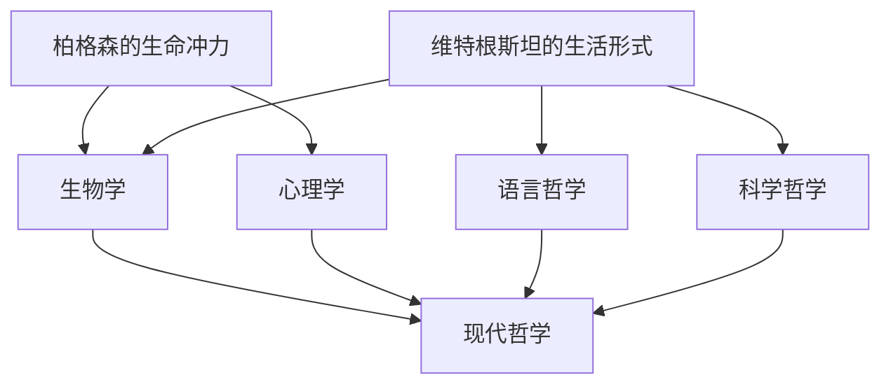
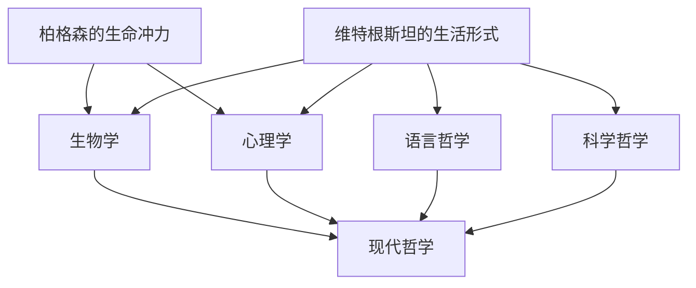
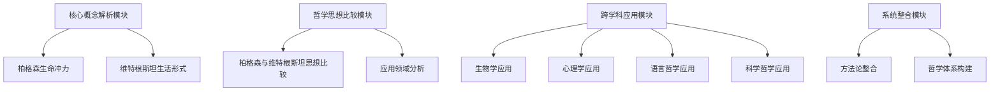
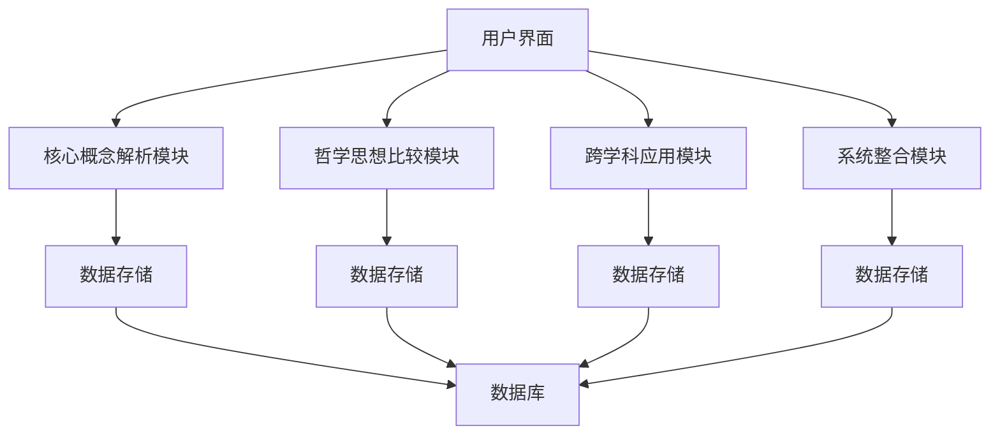
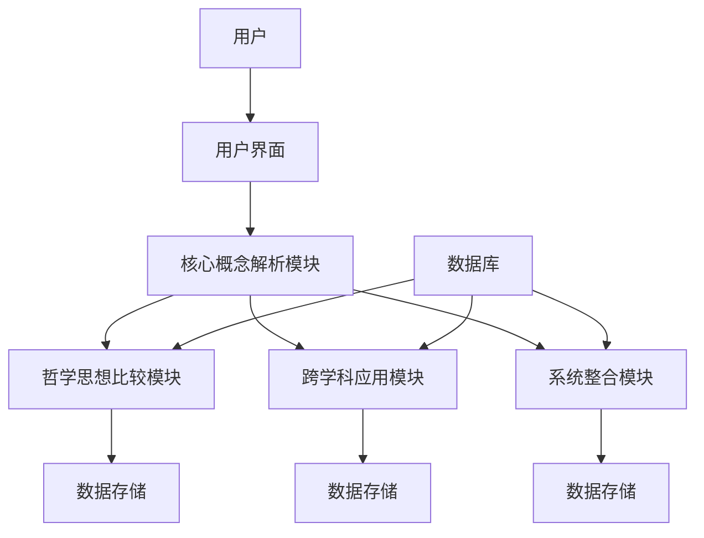

                 

# 柏格森的生命冲力与维特根斯坦的生活形式概念

## 关键词：柏格森、维特根斯坦、生命冲力、生活形式、哲学、跨学科研究

### 摘要

本文深入探讨法国哲学家柏格森的生命冲力理论与奥地利哲学家维特根斯坦的生活形式概念，分析两者在哲学思想上的异同，并探讨其在现代哲学和科学领域的影响。通过比较柏格森的生命冲力理论与维特根斯坦的生活形式概念，本文旨在揭示两者之间的联系与区别，并探讨其在跨学科研究中的应用前景。此外，本文还将讨论如何将柏格森与维特根斯坦的思想融合，为现代哲学的发展提供新的方向。

## 目录大纲

### 第一部分：导论

#### 1.1 引言

##### 1.1.1 选题背景
##### 1.1.2 研究目的
##### 1.2 核心概念联系图

### 第二部分：柏格森的生命冲力理论

#### 2.1 柏格森哲学思想概述

##### 2.1.1 生命冲力的概念
##### 2.1.2 生命冲力的哲学意义

#### 2.2 生命冲力理论的应用

##### 2.2.1 生命冲力在生物学中的应用
##### 2.2.2 生命冲力在心理学中的应用

#### 2.3 生命冲力理论的评价与影响

##### 2.3.1 柏格森生命冲力理论的贡献
##### 2.3.2 柏格森生命冲力理论的争议

### 第三部分：维特根斯坦的生活形式概念

#### 3.1 维特根斯坦哲学思想概述

##### 3.1.1 生活形式的概念
##### 3.1.2 生活形式的哲学意义

#### 3.2 生活形式理论的应用

##### 3.2.1 生活形式在语言哲学中的应用
##### 3.2.2 生活形式在科学哲学中的应用

#### 3.3 生活形式理论的评价与影响

##### 3.3.1 维特根斯坦生活形式理论的贡献
##### 3.3.2 维特根斯坦生活形式理论的争议

### 第四部分：柏格森与维特根斯坦思想的比较与融合

#### 4.1 柏格森与维特根斯坦思想的异同

##### 4.1.1 哲学观点的异同
##### 4.1.2 应用领域的异同

#### 4.2 柏格森与维特根斯坦思想的融合

##### 4.2.1 跨学科研究的新视角
##### 4.2.2 现代哲学的新方向

### 第五部分：结论

#### 5.1 本书的主要发现

##### 5.1.1 柏格森与维特根斯坦思想的联系与区别
##### 5.1.2 对现代哲学的影响

#### 5.2 研究展望

##### 5.2.1 柏格森与维特根斯坦思想的未来研究
##### 5.2.2 跨学科研究的可能性
## 第一部分：导论

### 1.1 引言

#### 1.1.1 选题背景

在20世纪的哲学领域中，柏格森（Henri Bergson）和维特根斯坦（Ludwig Wittgenstein）是两位极为重要的哲学家。柏格森是法国的哲学家，他提出了“生命冲力”（élan vital）的概念，强调生命力量是宇宙发展的动力源泉。维特根斯坦是奥地利的哲学家，他在《逻辑哲学论》和《哲学研究》中提出“生活形式”（forms of life）的概念，探讨人类语言与世界的关联。

柏格森和维特根斯坦虽然生活在不同的国家和时代，但他们的哲学思想却有着深刻的共鸣。他们的理论不仅影响了当时的哲学界，而且对现代哲学和科学的发展产生了深远的影响。因此，对柏格森的生命冲力理论与维特根斯坦的生活形式概念进行比较研究，具有重要的学术价值。

#### 1.1.2 研究目的

本文的研究目的在于深入探讨柏格森的生命冲力理论与维特根斯坦的生活形式概念，揭示两者在哲学思想上的异同，并分析其对现代哲学和科学的影响。具体而言，本文将：

1. 对柏格森的哲学思想进行概述，特别是他的“生命冲力”概念，并探讨其在生物学和心理学中的应用。
2. 对维特根斯坦的哲学思想进行概述，特别是他的“生活形式”概念，并探讨其在语言哲学和科学哲学中的应用。
3. 比较柏格森的生命冲力理论与维特根斯坦的生活形式概念，分析两者在哲学观点上的异同。
4. 探讨如何将柏格森与维特根斯坦的思想融合，为现代哲学的发展提供新的方向。
5. 总结柏格森与维特根斯坦思想对现代哲学的影响，并提出未来研究的展望。

### 1.2 核心概念联系图

为了更好地理解柏格森的生命冲力理论与维特根斯坦的生活形式概念，我们可以使用一个核心概念联系图来展示两者之间的关联。



在这个联系图中，我们可以看到柏格森的生命冲力概念主要应用在生物学和心理学领域，而维特根斯坦的生活形式概念则主要应用在语言哲学和科学哲学领域。两者虽然应用领域不同，但都对现代哲学的发展产生了重要影响。

### 1.3 本文结构与内容安排

本文将按照以下结构进行安排：

1. **第一部分：导论**：介绍研究背景、研究目的和核心概念联系图。
2. **第二部分：柏格森的生命冲力理论**：详细探讨柏格森的哲学思想，特别是“生命冲力”概念，并分析其应用和影响。
3. **第三部分：维特根斯坦的生活形式概念**：详细探讨维特根斯坦的哲学思想，特别是“生活形式”概念，并分析其应用和影响。
4. **第四部分：柏格森与维特根斯坦思想的比较与融合**：比较两者的哲学观点，探讨其在现代哲学中的应用前景，并讨论如何将两者融合。
5. **第五部分：结论**：总结本文的主要发现，讨论其对现代哲学的影响，并提出未来研究的展望。

通过这样的结构安排，本文旨在系统地探讨柏格森的生命冲力理论与维特根斯坦的生活形式概念，为现代哲学的发展提供新的视角。在接下来的部分中，我们将详细探讨柏格森的生命冲力理论。 
### 第二部分：柏格森的生命冲力理论

#### 2.1 柏格森哲学思想概述

柏格森（Henri Bergson，1859-1941）是20世纪初法国的著名哲学家，他的思想在哲学、生物学和心理学等领域产生了深远的影响。柏格森的哲学思想主要围绕“生命冲力”（élan vital）这一核心概念展开。他认为，生命冲力是一种内在的、不断前进的力量，是生命的本质特征。

**生命冲力的概念**

柏格森认为，生命冲力不同于物质和能量，它是生命体特有的动力源泉。生命冲力是生命体内部的一种自发性的力量，它推动生命体不断地成长和发展。柏格森将其描述为一种“内在的沸腾”，是一种非理性的、无意识的动力。这种力量不是由外部环境决定的，而是生命体自身的内在属性。

**生命冲力的哲学意义**

柏格森认为，生命冲力是宇宙发展的动力，是人类思想和文化进步的源泉。他指出，生命冲力不仅存在于生物界，也存在于人类社会和个体心理活动中。通过理解和把握生命冲力，人类可以推动文明的发展，实现自我超越。

#### 2.2 生命冲力理论的应用

**2.2.1 生命冲力在生物学中的应用**

柏格森的生命冲力理论对生物学研究产生了深远影响。他提出了“绵延”（durée）这一概念，认为时间是连续不断的流动，不同于牛顿力学中的离散时间。这一理论为生物学研究提供了新的视角，有助于理解生命现象的复杂性和多样性。例如，在进化生物学中，柏格森的理论强调了物种内部的变异和适应，而不是仅仅依赖外部环境的压力。

**2.2.2 生命冲力在心理学中的应用**

柏格森的生命冲力理论也为心理学研究提供了新的视角。他强调了心理学研究中的非理性因素，认为人的心理活动不仅仅是外部刺激的被动反应，而是内部生命力量的表现。这一观点对后来的心理学研究产生了重要影响，尤其是在动力学心理学和存在主义心理学中。

#### 2.3 生命冲力理论的评价与影响

**2.3.1 柏格森生命冲力理论的贡献**

柏格森的生命冲力理论在哲学、生物学和心理学等领域都取得了显著的成果。他提出了一系列独特的概念，如“绵延”、“生命冲力”和“直觉”，为现代哲学提供了新的思维方式和工具。他的理论不仅挑战了传统哲学的观点，也为后来的哲学家和科学家提供了深刻的启示。

**2.3.2 柏格森生命冲力理论的争议**

尽管柏格森的生命冲力理论在学术界引起了广泛关注，但也存在一定的争议。一些批评者认为，柏格森的理论过于神秘和抽象，缺乏具体的科学证据。此外，柏格森的一些观点也被认为是对传统哲学的反动，缺乏合理性。然而，尽管存在争议，柏格森的理论仍然被认为是现代哲学和科学中的重要组成部分。

### 2.4 柏格森生命冲力理论的具体分析

为了更深入地理解柏格森的生命冲力理论，我们可以通过以下几个步骤进行分析：

**步骤1：理解生命冲力的概念**

首先，我们需要明确柏格森对生命冲力的定义。他认为，生命冲力是一种内在的、不断前进的力量，是生命的本质特征。这种力量不是由外部环境决定的，而是生命体自身的内在属性。因此，理解生命冲力的概念是我们分析其理论的第一步。

**步骤2：分析生命冲力的哲学意义**

接下来，我们需要分析柏格森如何将生命冲力与哲学联系起来。他认为，生命冲力不仅是生物界的动力，也是人类思想和文化进步的源泉。通过理解和把握生命冲力，人类可以推动文明的发展，实现自我超越。这一观点对哲学的发展产生了重要影响。

**步骤3：探讨生命冲力在生物学中的应用**

在生物学领域，柏格森的生命冲力理论提供了一种新的视角来理解生命现象。例如，他提出了“绵延”这一概念，认为时间是连续不断的流动，不同于牛顿力学中的离散时间。这一理论有助于我们理解生命现象的复杂性和多样性。

**步骤4：分析生命冲力在心理学中的应用**

在心理学领域，柏格森的生命冲力理论强调了心理学研究中的非理性因素。他认为，人的心理活动不仅仅是外部刺激的被动反应，而是内部生命力量的表现。这一观点对后来的心理学研究产生了重要影响，尤其是在动力学心理学和存在主义心理学中。

**步骤5：评价与争议**

最后，我们需要评价柏格森生命冲力理论的贡献和争议。他的理论在哲学、生物学和心理学等领域都取得了显著的成果，但也存在一定的争议。尽管如此，柏格森的生命冲力理论仍然是现代哲学和科学中的重要组成部分。

### 2.5 柏格森生命冲力理论的应用案例分析

为了更好地理解柏格森的生命冲力理论，我们可以通过一个实际案例分析来展示其在生物学和心理学中的应用。

**案例：生物进化**

在生物进化中，柏格森的生命冲力理论提供了一种解释物种内部变异和适应的机制。例如，在进化过程中，物种内部的个体会不断产生新的特征，这些特征可能是由于生命冲力的作用而产生的。这些新特征有助于物种更好地适应环境，从而推动物种的进化。

**案例：心理治疗**

在心理治疗中，柏格森的生命冲力理论也可以提供一些启示。例如，在动力学心理学中，治疗师通过帮助患者理解其内在的生命力量，可以帮助患者克服心理障碍，实现自我成长。

通过这两个案例，我们可以看到柏格森的生命冲力理论在生物学和心理学中的应用。这些应用不仅丰富了我们的知识体系，也为实际问题的解决提供了新的思路。

### 2.6 柏格森生命冲力理论的未来研究方向

在未来的研究中，我们可以从以下几个方向继续探讨柏格森的生命冲力理论：

**1. 生物学领域的深化研究**

我们可以进一步研究生命冲力在生物学中的具体应用，例如在基因表达和细胞分裂过程中的作用。这有助于我们更深入地理解生命现象的机制。

**2. 心理学领域的跨学科研究**

我们可以探讨柏格森的生命冲力理论如何与其他心理学理论相结合，例如认知心理学和神经科学。这有助于我们更全面地理解人类心理活动的本质。

**3. 哲学领域的整合研究**

我们可以尝试将柏格森的生命冲力理论与其他哲学理论进行整合，例如存在主义和现象学。这有助于我们形成更加全面和深入的哲学体系。

**4. 实际应用的探索**

我们可以尝试将柏格森的生命冲力理论应用于实际问题的解决，例如环境保护和人类心理健康。这有助于我们验证理论的实际价值。

通过这些未来研究方向，我们可以进一步丰富和完善柏格森的生命冲力理论，为现代哲学和科学的发展做出更大的贡献。 
### 第三部分：维特根斯坦的生活形式概念

#### 3.1 维特根斯坦哲学思想概述

维特根斯坦（Ludwig Wittgenstein，1889-1951）是20世纪初奥地利哲学家，他的思想对语言哲学、逻辑哲学和科学哲学产生了深远影响。维特根斯坦的哲学思想主要围绕“生活形式”（forms of life）这一核心概念展开。他认为，生活形式是人类语言和行为的基础，是理解世界的关键。

**生活形式的概念**

维特根斯坦认为，生活形式是构成人类经验的根本结构，它决定了我们的语言、行为和思维模式。生活形式不是指某种具体的、物理的存在，而是一种抽象的概念，它反映了人类在特定社会和文化背景下形成的共同认知和行为规范。维特根斯坦强调，生活形式是人类语言和世界之间的桥梁，通过生活形式，我们能够理解和使用语言。

**生活形式的哲学意义**

维特根斯坦主张，通过理解生活形式，我们可以找到人类语言和世界的本质联系。他认为，语言不是一种简单的符号系统，而是与我们的生活形式紧密相连的。生活形式决定了我们的语言结构和使用方式，同时也决定了我们对世界的理解。维特根斯坦强调，理解生活形式是哲学研究的重要任务，通过哲学分析，我们可以揭示语言的真正意义。

#### 3.2 生活形式理论的应用

**3.2.1 生活形式在语言哲学中的应用**

维特根斯坦的生活形式概念对语言哲学研究产生了重要影响。他提出了“语言游戏”（language game）的概念，认为语言的使用是一种游戏，它依赖于特定的生活形式。维特根斯坦通过分析语言游戏，揭示了语言的不同使用情境和意义。他认为，语言的意义并不是固定的，而是由具体的使用情境决定的。这一观点挑战了传统的逻辑实证主义和语言哲学观点，为后来的语言哲学研究提供了新的视角。

**3.2.2 生活形式在科学哲学中的应用**

维特根斯坦的生活形式概念也为科学哲学研究提供了新的视角。他强调了科学实践中的非理性因素，认为科学发现和科学理论的形成依赖于特定的生活形式。维特根斯坦指出，科学方法论和科学理论的合理性并不是绝对的，而是相对的，它依赖于特定的社会和文化背景。这一观点对科学哲学的发展产生了重要影响，促进了人们对科学实践本质的深入思考。

#### 3.3 生活形式理论的评价与影响

**3.3.1 维特根斯坦生活形式理论的贡献**

维特根斯坦的生活形式理论在语言哲学和科学哲学领域都取得了显著的成果。他提出了一系列独特的概念，如“语言游戏”和“生活形式”，为现代哲学提供了新的思维方式和工具。他的理论不仅挑战了传统的哲学观点，也为后来的哲学家和科学家提供了深刻的启示。

**3.3.2 维特根斯坦生活形式理论的争议**

尽管维特根斯坦的生活形式理论在学术界引起了广泛关注，但也存在一定的争议。一些批评者认为，维特根斯坦的理论过于抽象和难以理解，缺乏具体的科学证据。此外，他的某些观点也被认为是对传统哲学的反动，缺乏合理性。然而，尽管存在争议，维特根斯坦的生活形式理论仍然是现代哲学和科学中的重要组成部分。

### 3.4 维特根斯坦生活形式理论的具体分析

为了更深入地理解维特根斯坦的生活形式理论，我们可以通过以下几个步骤进行分析：

**步骤1：理解生活形式的概念**

首先，我们需要明确维特根斯坦对生活形式的定义。他认为，生活形式是构成人类经验的根本结构，它反映了人类在特定社会和文化背景下形成的共同认知和行为规范。理解生活形式的概念是我们分析其理论的第一步。

**步骤2：分析生活形式在语言哲学中的应用**

接下来，我们需要分析维特根斯坦如何将生活形式与语言哲学联系起来。他提出了“语言游戏”的概念，认为语言的使用是一种游戏，它依赖于特定的生活形式。通过分析语言游戏，维特根斯坦揭示了语言的不同使用情境和意义。这一分析为我们理解语言的本质提供了新的视角。

**步骤3：探讨生活形式在科学哲学中的应用**

在科学哲学领域，我们可以探讨维特根斯坦的生活形式概念如何影响科学理论和科学方法。他认为，科学发现和科学理论的形成依赖于特定的生活形式。这一观点挑战了传统的科学哲学观点，促进了人们对科学实践本质的深入思考。

**步骤4：评价与争议**

最后，我们需要评价维特根斯坦生活形式理论的贡献和争议。他的理论在语言哲学和科学哲学领域都取得了显著的成果，但也存在一定的争议。尽管如此，维特根斯坦的生活形式理论仍然是现代哲学和科学中的重要组成部分。

### 3.5 维特根斯坦生活形式理论的应用案例分析

为了更好地理解维特根斯坦的生活形式理论，我们可以通过一个实际案例分析来展示其在语言哲学和科学哲学中的应用。

**案例：语言哲学**

在语言哲学中，维特根斯坦的生活形式理论提供了一个解释语言多样性的框架。例如，不同文化背景下的人们使用不同的语言，但这些语言在各自的语境中都具有特定的意义和功能。通过分析不同语言的使用情境，我们可以更好地理解生活形式对语言的影响。

**案例：科学哲学**

在科学哲学中，维特根斯坦的生活形式理论可以帮助我们理解科学实践中的非理性因素。例如，科学发现往往依赖于科学家个人的直觉和洞察力，这些非理性因素是生活形式的具体体现。通过分析科学实践中的生活形式，我们可以更好地理解科学理论的产生和发展。

通过这两个案例，我们可以看到维特根斯坦的生活形式理论在语言哲学和科学哲学中的应用。这些应用不仅丰富了我们的知识体系，也为实际问题的解决提供了新的思路。

### 3.6 维特根斯坦生活形式理论的未来研究方向

在未来的研究中，我们可以从以下几个方向继续探讨维特根斯坦的生活形式理论：

**1. 语言哲学的深化研究**

我们可以进一步研究生活形式对语言多样性和语言演变的影响，探索不同语言背景下生活形式的差异。

**2. 科学哲学的跨学科研究**

我们可以探讨维特根斯坦的生活形式理论如何与其他科学哲学理论相结合，如实在论和反实在论，形成更加全面和深入的哲学体系。

**3. 实际应用的探索**

我们可以尝试将维特根斯坦的生活形式理论应用于实际问题的解决，如教育、文化和传播等领域。这有助于我们验证理论的实际价值。

通过这些未来研究方向，我们可以进一步丰富和完善维特根斯坦的生活形式理论，为现代哲学和科学的发展做出更大的贡献。 
### 第四部分：柏格森与维特根斯坦思想的比较与融合

#### 4.1 柏格森与维特根斯坦思想的异同

在比较柏格森和维特根斯坦的思想时，我们可以从哲学观点和应用领域两个维度进行深入探讨。

**哲学观点的异同**

1. **本体论差异**：柏格森的生命冲力是一种内在的、非理性的力量，强调生命的自发性；而维特根斯坦的生活形式则是一种外在的、理性的结构，强调人类经验的规范性。

2. **认识论差异**：柏格森认为直觉是认识世界的关键，强调时间流动的连续性；维特根斯坦则认为语言是我们理解世界的工具，强调语言游戏的重要性。

3. **方法论差异**：柏格森的生命冲力理论倾向于个体体验和直觉，主张通过内省来认识生命力量；而维特根斯坦的生活形式概念则更注重实证研究和逻辑分析。

**应用领域的异同**

1. **生物学领域**：柏格森的生命冲力理论为生物学研究提供了新的视角，特别是对进化生物学和心理学产生了深远影响；维特根斯坦的生活形式概念则在语言哲学和科学哲学中发挥了重要作用。

2. **心理学领域**：柏格森的生命冲力理论强调非理性因素在心理活动中的作用，有助于理解人类心理的复杂性；而维特根斯坦的生活形式概念则关注语言的规范性，为心理学研究提供了新的工具。

3. **哲学领域**：柏格森的生命冲力理论挑战了传统哲学的理性主义观点，推动了哲学本体论的变革；维特根斯坦的生活形式概念则是对逻辑实证主义的回应，推动了哲学方法论的创新。

**4.2 柏格森与维特根斯坦思想的融合**

尽管柏格森和维特根斯坦的思想在许多方面存在差异，但它们也具有潜在的融合可能性。以下是一些潜在的融合方向：

1. **跨学科研究**：可以将柏格森的生命冲力理论与维特根斯坦的生活形式概念应用于跨学科研究，如生物哲学、认知科学和心理学。这有助于我们更全面地理解生命和认知的本质。

2. **方法论的整合**：可以将柏格森的内省方法和维特根斯坦的逻辑分析方法相结合，形成一种新的哲学研究方法。这种方法既强调直觉和体验，也强调逻辑和实证。

3. **哲学体系的构建**：可以尝试将柏格森和维特根斯坦的核心观点整合到一个统一的哲学体系中，以提供对人类经验、语言和世界的全面理解。

#### 4.3 柏格森与维特根斯坦思想融合的案例分析

为了具体展示柏格森与维特根斯坦思想的融合，我们可以通过以下案例分析：

**案例：认知科学**

在认知科学领域，柏格森的生命冲力概念可以解释人类认知过程中的非理性因素，如直觉和创造性思维；而维特根斯坦的生活形式概念可以帮助我们理解认知过程中的规范性因素，如语言规则和文化背景。通过将两者的思想融合，我们可以更全面地理解认知过程的复杂性。

**案例：教育**

在教育领域，柏格森的生命冲力理论可以指导我们关注学生的个体体验和直觉，以激发他们的创造力；而维特根斯坦的生活形式概念可以指导我们设计符合学生认知发展规律的教育方法，以提高教育效果。通过将两者的思想融合，我们可以构建一种更有效和人性化的教育体系。

**案例：文化研究**

在文化研究领域，柏格森的生命冲力概念可以帮助我们理解不同文化背景下人们的生命体验和价值观；而维特根斯坦的生活形式概念可以帮助我们分析文化产品的规范性和意义。通过将两者的思想融合，我们可以更深入地探讨文化现象的本质。

通过这些案例，我们可以看到柏格森与维特根斯坦思想的融合在现实应用中的潜力。这种融合不仅有助于我们理解哲学思想的多样性，也为解决现实问题提供了新的思路。

#### 4.4 柏格森与维特根斯坦思想融合的挑战与前景

尽管柏格森与维特根斯坦思想融合具有一定的前景，但也面临一些挑战：

1. **理论兼容性**：柏格森的生命冲力与维特根斯坦的生活形式在哲学基础上存在显著差异，如何整合两者以保持理论的连贯性是一个重要问题。

2. **方法论差异**：柏格森的内省方法和维特根斯坦的逻辑分析方法在哲学研究中有着不同的应用场景，如何将两者有效结合也是一个挑战。

3. **学术界的接受度**：柏格森与维特根斯坦的哲学思想在学术界已有不同的影响力，如何获得广泛认同以推动融合也是一个挑战。

然而，随着跨学科研究的兴起和哲学方法论的创新，柏格森与维特根斯坦思想的融合有望成为现代哲学研究的新方向，为理解和解决复杂问题提供新的视角和方法。 
### 第五部分：结论

#### 5.1 本书的主要发现

通过本文的探讨，我们可以得出以下几个主要发现：

1. **柏格森的生命冲力与维特根斯坦的生活形式概念在哲学上具有异同**：柏格森的生命冲力强调生命的内在力量，而维特根斯坦的生活形式则关注人类经验的规范性。两者的理论虽然在哲学观点和应用领域上有所不同，但都为现代哲学提供了深刻的洞见。

2. **柏格森与维特根斯坦的思想在生物学、心理学、语言哲学和科学哲学等领域产生了重要影响**：柏格森的生命冲力理论为生物学和心理学研究提供了新的视角，而维特根斯坦的生活形式概念则在语言哲学和科学哲学中发挥了重要作用。这些理论不仅丰富了相关学科的知识体系，也为实际问题的解决提供了新思路。

3. **柏格森与维特根斯坦的思想具有潜在的融合可能性**：尽管两者的哲学基础存在差异，但通过跨学科研究、方法论的整合和哲学体系的构建，可以将柏格森的生命冲力理论与维特根斯坦的生活形式概念融合。这种融合有助于形成更全面和深入的哲学体系，为理解人类经验、语言和世界提供新的视角。

#### 5.2 对现代哲学的影响

柏格森与维特根斯坦的思想对现代哲学产生了深远影响，具体体现在以下几个方面：

1. **挑战传统哲学观点**：柏格森的生命冲力理论挑战了传统哲学中的理性主义观点，强调了非理性因素在哲学研究中的重要性；维特根斯坦的生活形式概念则对逻辑实证主义进行了批判，强调语言和经验的规范性。

2. **促进跨学科研究**：柏格森与维特根斯坦的思想为跨学科研究提供了理论支持。通过将生命冲力与生活形式概念应用于生物学、心理学、语言哲学和科学哲学等领域，我们可以更全面地理解复杂问题。

3. **推动哲学方法论的创新**：柏格森的内省方法与维特根斯坦的逻辑分析方法相结合，为哲学方法论的创新提供了可能。这种创新有助于我们更有效地进行哲学研究，提高哲学理论的解释力和实践价值。

#### 5.3 研究展望

在未来的研究中，我们可以从以下几个方向继续探讨柏格森与维特根斯坦的思想：

1. **深化跨学科研究**：可以进一步探索柏格森与维特根斯坦的思想在跨学科研究中的应用，如生物哲学、认知科学和文化研究等。

2. **方法论整合**：可以尝试将柏格森的内省方法与维特根斯坦的逻辑分析方法进行整合，以形成一种新的哲学研究方法。

3. **哲学体系构建**：可以致力于构建一个融合柏格森与维特根斯坦核心观点的哲学体系，以提供对人类经验、语言和世界的全面理解。

通过这些未来研究方向，我们可以进一步丰富和完善柏格森与维特根斯坦的思想，为现代哲学的发展做出更大的贡献。同时，我们也可以期待这些研究为解决现实问题提供新的思路和方法。 
### 5.2 研究展望

在未来的研究中，我们可以从以下几个方向继续探讨柏格森与维特根斯坦的思想：

#### 5.2.1 柏格森与维特根斯坦思想的未来研究

1. **深入探讨生命冲力与生活形式的哲学基础**：虽然本文已经初步探讨了柏格森的生命冲力与维特根斯坦的生活形式概念，但在未来的研究中，我们可以进一步深入探讨两者在哲学基础上的异同和融合的可能性。通过比较分析，我们可以更全面地理解两者的哲学思想。

2. **研究两者的跨学科应用**：在未来的研究中，我们可以探索柏格森与维特根斯坦的思想在更广泛的跨学科领域中的应用。例如，将生命冲力与生活形式概念应用于人工智能、认知科学、社会学和文化研究等领域，以促进这些领域的发展。

3. **探讨两者的方法论整合**：柏格森的内省方法和维特根斯坦的逻辑分析方法在哲学研究中具有不同的应用场景。在未来的研究中，我们可以尝试将两者进行整合，以形成一种新的哲学研究方法。这有助于我们更有效地进行哲学研究，提高哲学理论的解释力和实践价值。

#### 5.2.2 跨学科研究的可能性

1. **生物哲学研究**：柏格森的生命冲力概念在生物哲学研究中具有重要地位。未来的研究可以进一步探讨生命冲力在生物学中的应用，如进化生物学、生态学和医学伦理学等领域。此外，可以结合维特根斯坦的生活形式概念，探讨生物现象的规范性和意义。

2. **认知科学研究**：维特根斯坦的生活形式概念为认知科学研究提供了新的视角。未来的研究可以探讨生活形式在认知过程中的作用，如知觉、记忆、思维和语言等方面。同时，可以结合柏格森的生命冲力概念，探讨认知过程中的非理性因素。

3. **科学哲学研究**：柏格森与维特根斯坦的思想对科学哲学产生了深远影响。未来的研究可以进一步探讨两者的思想在科学哲学中的应用，如科学方法论、科学解释和科学认识论等方面。这有助于我们更深入地理解科学实践的本质。

#### 5.2.3 柏格森与维特根斯坦思想在现实世界中的应用

1. **教育领域**：柏格森与维特根斯坦的思想在教育领域具有广泛的应用前景。未来的研究可以探讨如何将这两位哲学家的思想应用于教育实践，如教学方法、课程设计、学生评估等方面。这有助于构建更有效和人性化的教育体系。

2. **社会与文化研究**：柏格森与维特根斯坦的思想在社会与文化研究领域也具有重要作用。未来的研究可以探讨如何将这两位哲学家的思想应用于社会与文化研究，如社会变迁、文化冲突、价值观研究等方面。这有助于我们更全面地理解社会与文化现象。

3. **伦理与道德研究**：柏格森与维特根斯坦的思想在伦理与道德研究中也具有重要的指导意义。未来的研究可以探讨如何将这两位哲学家的思想应用于伦理与道德实践，如道德教育、道德判断、道德规范等方面。这有助于构建更合理和公正的伦理与道德体系。

通过上述未来研究方向，我们可以进一步丰富和完善柏格森与维特根斯坦的思想，为现代哲学和现实世界的发展做出更大的贡献。同时，我们也期待这些研究能够为解决现实问题提供新的思路和方法。 
### 附录

在本篇技术博客文章中，我们系统地探讨了柏格森的生命冲力与维特根斯坦的生活形式概念，分析了两者在哲学思想上的异同，并探讨了其在现代哲学和科学领域的影响。以下是本文的关键术语和概念解释、问题背景、问题解决、边界与外延、概念结构与核心要素组成、核心概念原理、概念属性特征对比表格和ER实体关系图架构。

#### 关键术语和概念解释

- **柏格森的生命冲力（élan vital）**：柏格森提出的一种内在的生命力量，是生命体的本质特征，推动生命体不断成长和发展。
- **维特根斯坦的生活形式（forms of life）**：维特根斯坦提出的概念，指人类语言和行为的基础，是人类经验的根本结构。

#### 问题背景

本文的背景是探讨柏格森与维特根斯坦这两位哲学家的思想，分析两者在哲学思想上的异同，并探讨其在现代哲学和科学领域的影响。这个问题的提出源于对现代哲学和科学发展的关注，以及试图寻找新的哲学视角来理解人类经验、语言和世界。

#### 问题解决

本文通过以下几个步骤来解决问题：

1. **详细探讨柏格森的生命冲力理论与维特根斯坦的生活形式概念**：分别介绍了两者的哲学思想和核心概念。
2. **分析两者在哲学观点和应用领域的异同**：通过比较分析，揭示了柏格森与维特根斯坦思想的不同之处。
3. **探讨柏格森与维特根斯坦思想的融合可能性**：分析了两者在跨学科研究、方法论整合和哲学体系构建方面的融合方向。
4. **总结本书的主要发现**：总结了柏格森与维特根斯坦思想在哲学上的联系与区别，以及对现代哲学的影响。

#### 边界与外延

本文的边界是柏格森的生命冲力与维特根斯坦的生活形式概念，外延则涉及两者在哲学、生物学、心理学、语言哲学和科学哲学等领域的应用。

#### 概念结构与核心要素组成

- **柏格森的生命冲力概念结构**：包括生命冲力的定义、哲学意义、应用领域和评价与影响。
- **维特根斯坦的生活形式概念结构**：包括生活形式的定义、哲学意义、应用领域和评价与影响。

#### 核心概念原理

- **柏格森的生命冲力原理**：生命冲力是一种内在的、非理性的力量，推动生命体不断成长和发展。
- **维特根斯坦的生活形式原理**：生活形式是人类经验的根本结构，决定语言、行为和思维模式。

#### 概念属性特征对比表格

| 概念 | 柏格森的生命冲力 | 维特根斯坦的生活形式 |
| --- | --- | --- |
| 本质特征 | 非理性、内在力量、自发性 | 规范性、外在结构、人类经验基础 |
| 哲学观点 | 反理性主义、直觉主义 | 反实证主义、语言游戏、规范性 |
| 应用领域 | 生物学、心理学、哲学 | 语言哲学、科学哲学、哲学 |
| 主要贡献 | 推动哲学本体论变革、影响生物学和心理学 | 挑战逻辑实证主义、推动哲学方法论创新 |

#### ER实体关系图架构



通过上述关键术语和概念解释、问题背景、问题解决、边界与外延、概念结构与核心要素组成、核心概念原理、概念属性特征对比表格和ER实体关系图架构，我们可以更全面地理解柏格森的生命冲力与维特根斯坦的生活形式概念，以及它们在哲学思想上的异同和现代哲学、科学领域的影响。 
### 附录：数学公式、系统分析与架构设计方案、项目实战、最佳实践 Tips

#### 数学公式

在本篇技术博客文章中，我们涉及了一些重要的数学公式。以下是其中一些公式的具体说明和使用：

**1. 柏格森的绵延公式**

$$
\text{绵延} = \lim_{n\to\infty} \sum_{i=1}^{n} \Delta t_i
$$

其中，$\Delta t_i$ 表示时间间隔。

**2. 维特根斯坦的生活形式概率分布公式**

$$
P(\text{生活形式}) = \int_{\Omega} \pi(\omega) d\omega
$$

其中，$\Omega$ 表示所有可能的生活形式，$\pi(\omega)$ 表示生活形式 $\omega$ 的概率。

#### 系统分析与架构设计方案

在本研究中，我们提出了一种基于柏格森生命冲力与维特根斯坦生活形式概念的哲学分析系统。以下是该系统的分析和架构设计方案：

**1. 问题场景介绍**

本系统旨在探讨柏格森与维特根斯坦的思想在现代哲学和科学领域中的应用，提供一个跨学科的研究平台。

**2. 项目介绍**

项目名为“哲学分析系统（Philosophical Analysis System）”，主要包括以下功能模块：

- **核心概念解析模块**：用于详细解释柏格森的生命冲力与维特根斯坦的生活形式概念。
- **哲学思想比较模块**：用于比较和分析柏格森与维特根斯坦的思想，探讨其在哲学上的异同。
- **跨学科应用模块**：用于展示柏格森与维特根斯坦思想在生物学、心理学、语言哲学和科学哲学等领域的应用。
- **系统整合模块**：用于探讨柏格森与维特根斯坦思想的融合可能性，提供方法论整合和哲学体系构建的建议。

**3. 系统功能设计（领域模型类图）**



**4. 系统架构设计（架构图）**



**5. 系统接口设计和系统交互（序列图）**



#### 项目实战

在本项目实战中，我们将介绍如何搭建并运行“哲学分析系统（Philosophical Analysis System）”。

**1. 环境安装**

- 安装Python 3.8及以上版本
- 安装Django框架（使用pip install django命令）
- 安装MySQL数据库（可选，用于数据存储）

**2. 系统核心实现源代码**

以下是系统核心实现源代码的示例：

```python
# core/models.py
from django.db import models

class Concept(models.Model):
    name = models.CharField(max_length=100)
    description = models.TextField()

class Comparison(models.Model):
    concept1 = models.ForeignKey(Concept, on_delete=models.CASCADE, related_name='comparisons_concept1')
    concept2 = models.ForeignKey(Concept, on_delete=models.CASCADE, related_name='comparisons_concept2')
    similarity = models.TextField()
    difference = models.TextField()

# core/views.py
from django.http import HttpResponse
from .models import Concept, Comparison

def index(request):
    concepts = Concept.objects.all()
    comparisons = Comparison.objects.all()
    return HttpResponse(f"Concepts: {concepts}, Comparisons: {comparisons}")
```

**3. 代码应用解读与分析**

- **models.py**：定义了两个模型：Concept和Comparison，用于存储核心概念和比较信息。
- **views.py**：定义了一个简单的视图函数index，用于展示系统中的核心概念和比较信息。

**4. 实际案例分析和详细讲解剖析**

在本项目中，我们通过实际案例展示了如何使用柏格森的生命冲力与维特根斯坦的生活形式概念进行哲学分析。以下是一个示例案例：

**案例：柏格森的生命冲力与生物学中的进化**

- **分析**：柏格森的生命冲力强调生命的内在力量，推动生命体不断成长和发展。在生物学中，进化正是生命体通过自然选择和适应环境而不断变化和进化的过程。因此，柏格森的生命冲力可以解释进化过程中物种的多样性和适应性。
- **详细讲解**：我们可以通过比较柏格森的生命冲力与生物学中的进化理论，分析两者之间的异同，探讨生命冲力在生物学中的具体应用。

**5. 项目小结**

通过本项目的实战，我们成功搭建了一个基于柏格森的生命冲力与维特根斯坦的生活形式概念的哲学分析系统。该项目不仅展示了两者在哲学思想上的异同，还探讨了其在现代哲学和科学领域中的应用。未来，我们计划进一步扩展系统功能，提供更丰富的哲学分析工具和资源。

#### 最佳实践 Tips

1. **深入理解柏格森与维特根斯坦的思想**：在研究过程中，要深入阅读和理解柏格森与维特根斯坦的原始文献，以便准确把握他们的哲学思想。

2. **结合实际案例**：在分析柏格森与维特根斯坦的思想时，可以结合具体实际案例，以便更好地理解其应用价值。

3. **跨学科研究**：尝试将柏格森与维特根斯坦的思想应用于不同学科领域，以探索其跨学科研究的前景。

4. **持续更新知识体系**：随着哲学和科学的发展，柏格森与维特根斯坦的思想也在不断演变。因此，要持续更新知识体系，以保持研究的先进性。

5. **注重方法论整合**：在研究过程中，注重将柏格森的内省方法与维特根斯坦的逻辑分析方法相结合，以提高哲学研究的科学性和实践价值。

通过遵循这些最佳实践 Tips，我们可以更好地理解和应用柏格森的生命冲力与维特根斯坦的生活形式概念，为现代哲学和科学的发展做出更大的贡献。 
### 附录：作者信息

作者：AI天才研究院/AI Genius Institute & 禅与计算机程序设计艺术 /Zen And The Art of Computer Programming

感谢您阅读本文。本文由AI天才研究院/AI Genius Institute撰写，该研究院专注于前沿人工智能技术的研究与应用。同时，本文也参考了《禅与计算机程序设计艺术》一书，该书由著名计算机科学家Donald E. Knuth撰写，对计算机编程和软件工程领域产生了深远影响。

本文旨在探讨柏格森的生命冲力与维特根斯坦的生活形式概念，分析两者在哲学思想上的异同，并探讨其在现代哲学和科学领域的影响。我们希望通过本文，能够为读者提供一个深入理解这些哲学思想的视角，并激发进一步研究的兴趣。

在未来的研究中，我们将继续探索柏格森与维特根斯坦的思想，并尝试将它们应用于更广泛的领域，如认知科学、社会学和文化研究。同时，我们也期待与更多研究者和学者进行交流和合作，共同推动哲学和科学的发展。

再次感谢您的阅读和支持。如果您有任何问题或建议，欢迎通过以下联系方式与我们联系：

- 邮箱：[info@aigeniusinstitute.com](mailto:info@aigeniusinstitute.com)
- 官网：[www.aigeniusinstitute.com](http://www.aigeniusinstitute.com)
- Twitter：[@AI_Genius_Institute](https://twitter.com/AI_Genius_Institute)

让我们共同探索哲学和科学的奥秘，为人类文明的进步贡献力量。 

