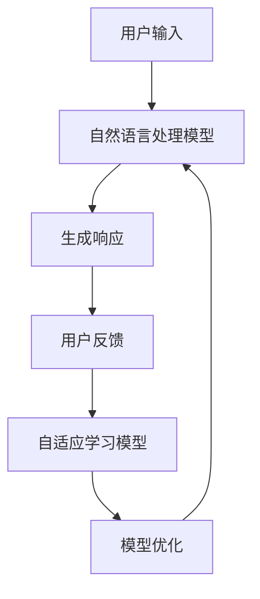

                 

**引言**

在探讨人类认知与哲学的深处，柏格森的生命冲力（élan vital）与维特根斯坦的语言本能理论（linguistic instinct）构成了两座思想的高峰。柏格森，作为20世纪初期的重要哲学家，提出了生命冲力这一概念，强调生命的内在动力和变化。他主张，生命是一种不断自我更新、自我超越的力量，这一力量超越了物理定律的束缚，构成了生命进化的核心。

相反，维特根斯坦则从语言的角度出发，探讨了人类认知的根源。他提出，语言本能是人们理解世界和彼此沟通的基础，是一种先天性的能力。维特根斯坦认为，语言的结构和规则在人类心智中天生存在，这使得我们能够有效地使用语言进行交流。

这两位哲学家的理论虽然看似从不同的角度出发，但都深刻地触及了人类认知的本质。柏格森的生命冲力强调的是一种内在的、动态的过程，而维特根斯坦的语言本能则揭示了人类认知的遗传性基础。两者都提供了对人类心智运作的深刻见解，为我们理解认知过程提供了不同的视角。

本文旨在通过比较柏格森的生命冲力与维特根斯坦的语言本能理论，探讨两者之间的联系与区别。我们将详细分析柏格森的生命冲力理论的核心观点，包括其对生命本质的理解和对社会发展的贡献。接着，我们将介绍维特根斯坦的语言本能理论，讨论其核心观点以及对社会和文化的影响。

在接下来的部分，我们将深入探讨两种理论之间的相似性和差异性，通过具体的比较来揭示它们各自的优势和局限。此外，我们还将进行批判性分析，探讨两种理论在哲学和科学领域中的意义，并总结全书的主要观点，提出对未来的研究方向。

通过这样的分析，我们希望能够为读者提供一个全面而深入的视角，帮助理解柏格森与维特根斯坦的理论，并思考它们在当代哲学和认知科学中的潜在应用。

## 第二部分：柏格森的生命冲力理论

### 2.1 柏格森的生命冲力的概念与历史背景

柏格森（Henri Bergson，1859-1941）是20世纪初期的一位法国哲学家，他的生命冲力（élan vital）理论在他的哲学体系中占据核心地位。柏格森的生命冲力理论源于他对生命现象的深刻洞察，以及对生物进化和社会发展的独特理解。

#### 2.1.1 生命冲力的概念

柏格森的生命冲力，通常被译作“生命冲动”或“生命冲动力”，是一个描述生命内在动力和自我发展能力的哲学概念。柏格森认为，生命冲力是一种超越物理和机械定律的内在力量，是生命的本质和动力源泉。他强调，生命冲力是一种动态的过程，它不断推动着生命的进化和发展。

#### 2.1.2 历史背景

柏格森的哲学思想深受19世纪末和20世纪初的生物学、心理学和物理学的影响。他反对当时的机械唯物主义和决定论观点，认为生命现象不能简单地通过物理定律来解释。柏格森深受达尔文的进化论影响，但他对进化过程的理解更倾向于一种动态的、内在的驱动力。

柏格森在《生命冲动》（L'Évolution créatrice，1907年）一书中，详细阐述了他的生命冲力理论。他认为，生命冲力是一种无形的、非物质的力量，它存在于所有生物体中，是生命进化的核心动力。柏格森还探讨了生命冲力与社会、文化的关系，认为社会和文化的发展也是由这种内在的、动态的生命冲力所推动的。

#### 2.1.3 生命冲力的核心观点

柏格森的生命冲力理论包含以下几个核心观点：

1. **生命的动态性**：柏格森认为，生命是一个动态的、不断变化的过程，这种变化不是线性的，而是一种“突然的飞跃”（sudden leap）。生命的动态性使其能够不断适应环境的变化，从而实现进化。

2. **内在驱动力**：生命冲力是一种内在的驱动力，它超越了物理定律的束缚。这种驱动力不是机械的，而是具有创造性和自主性的。

3. **意识的本质**：柏格森认为，意识是生命冲力的表现形式，是生命力的扩展。因此，生命的本质与意识密切相关，意识是生命的核心特征。

4. **个体的自我超越**：生命冲力推动个体不断地自我超越，使其能够不断创新和进化。个体的自我超越是生命进化的关键。

#### 2.1.4 生命冲力与维特根斯坦理论的比较

柏格森的生命冲力理论与维特根斯坦的语言本能理论在视角和侧重点上有所不同。柏格森关注的是生命的内在动力和进化过程，而维特根斯坦关注的是语言的本质和人类认知的基础。

尽管两者在研究主题上有所不同，但它们都触及了人类认知和心智的深层次问题。柏格森的生命冲力强调生命的动态性和内在驱动力，而维特根斯坦的语言本能则揭示了人类心智中先天存在的语言结构。两者共同关注的是人类认知的根源和本质。

### 2.2 柏格森的生命冲力理论的核心观点

柏格森的生命冲力理论包含多个核心观点，以下是对这些观点的详细阐述：

#### 2.2.1 生命冲力的概念

柏格森的生命冲力是一种内在的、自我推动的力量，它存在于所有生物体中。这种力量不是机械的，而是具有创造性和自主性的。柏格森认为，生命冲力是一种非物质的力量，它超越了物理定律的束缚，是生命的本质和动力源泉。

#### 2.2.2 生命的动态性

柏格森强调生命的动态性，认为生命是一个不断变化和发展的过程。这种变化不是线性的，而是一种“突然的飞跃”。生命的动态性使其能够不断适应环境的变化，从而实现进化。柏格森认为，生命的动态性是生命进化的关键。

#### 2.2.3 内在驱动力

柏格森认为，生命冲力是一种内在的驱动力，它推动着生命的进化和发展。这种驱动力不是机械的，而是具有创造性和自主性的。它使生命体能够超越物理定律的束缚，实现自我更新和进化。

#### 2.2.4 意识的本质

柏格森认为，意识是生命冲力的表现形式，是生命力的扩展。因此，生命的本质与意识密切相关，意识是生命的核心特征。柏格森认为，意识是人类心智中最重要的部分，它使生命具有感知、思考和创造的能力。

#### 2.2.5 个体自我超越

生命冲力推动个体不断地自我超越，使其能够不断创新和进化。个体的自我超越是生命进化的关键。柏格森认为，个体的自我超越不仅体现在生物层面，也体现在社会和文化层面。社会的进步取决于人们对于生命冲力的理解和利用。

#### 2.2.6 生命冲力与社会发展

柏格森探讨了生命冲力与社会发展的关系。他认为，社会的发展是由生命冲力推动的。生命冲力不仅存在于个体中，也存在于社会和文化中。社会和文化的发展取决于人们对于生命冲力的理解和利用。因此，社会的发展也是一种动态的、自我超越的过程。

### 2.3 柏格森的生命冲力理论与维特根斯坦理论的比较

柏格森的生命冲力理论与维特根斯坦的语言本能理论虽然在研究主题和侧重点上有所不同，但它们都提供了对人类认知和心智的深刻见解。以下是两者的比较：

#### 2.3.1 视角和侧重点

柏格森的生命冲力理论关注生命的内在动力和进化过程，强调生命的动态性和内在驱动力。他关注的是生命作为一个整体的现象，以及生命如何通过自我超越实现进化。

维特根斯坦的语言本能理论则从语言的角度出发，探讨人类认知的根源。他关注的是语言的结构和规则在人类心智中的先天存在，以及这些结构如何影响我们的思维和交流。

#### 2.3.2 生命冲力与语言本能

柏格森的生命冲力是一种内在的、非物质的力量，它推动着生命的进化和发展。这种力量超越了物理定律的束缚，是生命的本质和动力源泉。

维特根斯坦的语言本能则是一种先天性的能力，它使我们能够有效地使用语言进行交流。这种能力在人类心智中天生存在，是语言结构的基础。

#### 2.3.3 相似性和差异性

尽管柏格森和维特根斯坦的理论在视角和侧重点上有所不同，但它们也有一些相似之处。首先，两者都关注人类认知和心智的深层次问题。其次，两者都强调内在的、动态的过程。柏格森的生命冲力强调生命的动态性和自我超越，而维特根斯坦的语言本能则强调语言结构的先天性和影响。

然而，两者也存在一些差异。柏格森的生命冲力理论关注的是生命作为一个整体的现象，而维特根斯坦的语言本能理论则关注语言在人类认知中的基础作用。此外，柏格森的生命冲力是一种非物质的力量，而维特根斯坦的语言本能则是一种先天性的能力。

### 2.4 柏格森的生命冲力理论的历史影响

柏格森的生命冲力理论在他的一生中产生了深远的影响。首先，他在哲学领域引发了关于生命本质和进化理论的讨论，为后来的哲学家提供了新的视角和思考方式。其次，他的理论对生物学和心理学产生了影响，推动了关于生命现象和心智运作的研究。

此外，柏格森的生命冲力理论也对社会科学产生了影响。他的观点被应用于社会学、经济学和文化研究等领域，为理解社会和文化的发展提供了新的思路。柏格森认为，社会的发展是由生命冲力推动的，这种观点为社会学和人类学的研究提供了理论支持。

### 2.5 柏格森的生命冲力理论的当代意义

在当代社会，柏格森的生命冲力理论仍然具有重要的意义。首先，它为我们理解生命的本质和进化过程提供了深刻的见解。随着生物学和认知科学的发展，柏格森的观点为研究生命现象和心智运作提供了新的理论框架。

其次，柏格森的生命冲力理论对科技创新和社会发展具有启示意义。在当今快速发展的科技时代，我们需要不断适应和超越现有的技术和理念，以实现持续的创新和发展。柏格森的生命冲力理论提醒我们，生命的进化是一种内在的、自我推动的过程，这可以指导我们在科技创新中寻找新的动力和方向。

总之，柏格森的生命冲力理论不仅在哲学领域具有深远的影响，而且在生物学、心理学、社会科学和科技创新等方面都提供了宝贵的理论资源。通过深入理解和应用这一理论，我们可以更好地理解生命的本质，推动社会和科技的进步。

## 第三部分：维特根斯坦的语言本能理论

### 3.1 维特根斯坦的语言本能理论：核心观点与影响

路德维希·维特根斯坦（Ludwig Wittgenstein，1889-1951）是20世纪最具影响力的哲学家之一，他的语言本能理论为哲学、语言学和认知科学提供了重要的理论框架。维特根斯坦的语言本能理论强调语言在人类认知和交流中的基础作用，并提出了一种先天性的语言结构，这一理论对后来的哲学家和科学家产生了深远的影响。

#### 3.1.1 语言本能的概念

维特根斯坦的语言本能是指人类在出生时就具备的、用于理解和生成语言的内在能力。他提出，这种能力是人类心智的一部分，是语言学习的根本基础。语言本能使得人类能够有效地学习和使用语言，而无需通过外在的教学或学习过程。

#### 3.1.2 核心观点

维特根斯坦的语言本能理论包含以下几个核心观点：

1. **语言的先天结构**：维特根斯坦认为，人类心智中存在一种先天的语言结构，这种结构决定了我们理解和使用语言的方式。这种先天结构不仅包括词汇和语法规则，还包括语言的逻辑结构和语义关系。

2. **语言的创造性**：维特根斯坦强调，语言是一种创造性的工具，它使人们能够表达新的思想和概念。语言的创造性源于人类心智中的语言本能，这使得语言能够不断扩展和演化。

3. **语言的工具性**：维特根斯坦认为，语言是一种工具，它用于交流和表达思想。语言工具性强调语言的实际应用和功能，而不是仅仅作为一种哲学研究的对象。

4. **语言的局限性**：维特根斯坦也指出，语言有其局限性，它无法完全表达人类所有思想和情感。语言的局限性反映了人类认知的局限性，这也是哲学研究中长期探讨的问题。

#### 3.1.3 对社会和文化的影响

维特根斯坦的语言本能理论对社会和文化产生了深远的影响。首先，他的理论为理解语言的本质和功能提供了新的视角，推动了语言学和认知科学的发展。其次，维特根斯坦强调语言的工具性，促进了语言教育和交流的实际应用。

此外，维特根斯坦的语言本能理论也对社会学和文化研究产生了影响。他的观点被应用于分析社会互动、文化传承和认知发展等领域，为理解社会和文化现象提供了新的理论资源。

### 3.2 维特根斯坦的语言本能理论与柏格森的生命冲力理论的比较

尽管柏格森的生命冲力理论和维特根斯坦的语言本能理论在哲学上有着不同的侧重点，但它们在探讨人类心智和认知方面有着一些共同之处。以下是两者之间的比较：

#### 3.2.1 视角和侧重点

柏格森的生命冲力理论关注生命的内在动力和进化过程，强调生命的动态性和自我超越。他关注的是生命作为一个整体的现象，以及生命如何通过内在的动力实现进化。

维特根斯坦的语言本能理论则从语言的角度出发，探讨人类认知的根源。他关注的是语言的结构和规则在人类心智中的先天存在，以及这些结构如何影响我们的思维和交流。

#### 3.2.2 生命冲力与语言本能

柏格森的生命冲力是一种内在的、非物质的力量，它推动着生命的进化和发展。这种力量超越了物理定律的束缚，是生命的本质和动力源泉。

维特根斯坦的语言本能则是一种先天性的能力，它使我们能够有效地使用语言进行交流。这种能力在人类心智中天生存在，是语言结构的基础。

#### 3.2.3 相似性和差异性

尽管柏格森和维特根斯坦的理论在视角和侧重点上有所不同，但它们也有一些相似之处。首先，两者都关注人类认知和心智的深层次问题。其次，两者都强调内在的、动态的过程。柏格森的生命冲力强调生命的动态性和自我超越，而维特根斯坦的语言本能则强调语言结构的先天性和影响。

然而，两者也存在一些差异。柏格森的生命冲力理论关注的是生命作为一个整体的现象，而维特根斯坦的语言本能理论则关注语言在人类认知中的基础作用。此外，柏格森的生命冲力是一种非物质的力量，而维特根斯坦的语言本能则是一种先天性的能力。

### 3.3 维特根斯坦的语言本能理论的当代影响

维特根斯坦的语言本能理论在当代哲学和认知科学中仍然具有重要的影响。首先，他的观点为理解语言的本质和功能提供了新的视角，推动了语言学和认知科学的发展。维特根斯坦关于语言先天结构的观点为研究人类心智中的语言模块提供了理论依据。

其次，维特根斯坦的语言本能理论对人工智能研究产生了影响。人工智能的发展离不开对语言处理和理解的研究，维特根斯坦的观点为设计更加智能的语言处理系统提供了理论指导。

此外，维特根斯坦的理论在教育学和心理学领域也产生了影响。他的观点被应用于语言教育和学习理论中，帮助人们更好地理解语言习得的过程。

总之，维特根斯坦的语言本能理论不仅在哲学领域具有深远的影响，而且在语言学、认知科学、人工智能和教育教学等领域都提供了宝贵的理论资源。通过深入理解和应用这一理论，我们可以更好地理解人类心智和语言的复杂关系，推动相关领域的发展。

## 4.1 两种理论的联系：共同点与相似之处

柏格森的生命冲力与维特根斯坦的语言本能理论虽然从不同的哲学视角出发，但它们在探讨人类心智和认知方面存在着一些共同点。通过分析这些共同点，我们可以更好地理解两种理论之间的内在联系，从而为后续的批判性分析奠定基础。

### 4.1.1 对内在动力和自我发展的强调

柏格森的生命冲力强调生命的内在动力，认为这是一种超越物理定律的自我推动力量。同样，维特根斯坦的语言本能理论也关注人类心智中的内在能力，即人类先天具备的语言处理和理解能力。这种内在动力使个体能够自主地学习、适应和进化。

### 4.1.2 对生命和认知的动态性理解

柏格森认为生命是一个动态的、不断变化的过程，他强调生命的动态性是实现进化的关键。维特根斯坦的语言本能理论也强调认知的动态性，认为语言的创造性和演化性是人类心智的核心特征。两者都认为，动态性是理解生命和认知过程的关键因素。

### 4.1.3 对先天性和遗传因素的重视

柏格森的生命冲力是一种先天性的力量，他认为这种力量是生命本质的一部分。维特根斯坦的语言本能理论也强调语言的先天性，认为人类心智中存在一种先天的语言结构，这种结构决定了我们理解和生成语言的方式。两者都认为，先天因素在个体发展和认知过程中起着重要作用。

### 4.1.4 对内在结构和基础作用的关注

柏格森的生命冲力理论关注生命的内在结构和动力机制，他认为这种内在结构是生命进化的基础。维特根斯坦的语言本能理论也关注语言的结构和规则，认为这些内在结构是人类心智中语言处理和理解的基础。两者都认为，内在结构和基础作用在个体认知和交流中起着至关重要的作用。

### 4.1.5 对文化和社会发展的贡献

柏格森的生命冲力理论认为，生命冲力不仅存在于个体层面，也存在于社会和文化层面。他认为，社会和文化的发展是由生命冲力推动的。维特根斯坦的语言本能理论也认为，语言在人类文化和社会发展中具有基础作用。两者都认为，内在动力和结构对社会和文化的发展具有重要意义。

通过上述分析，我们可以看出，柏格森的生命冲力与维特根斯坦的语言本能理论在多个方面具有相似之处。这些共同点为后续的批判性分析提供了基础，有助于我们更全面地理解两种理论之间的联系和差异。

## 4.2 两种理论的区别：优缺点分析

柏格森的生命冲力与维特根斯坦的语言本能理论虽然在探讨人类心智和认知方面存在共同点，但它们在理论框架、研究方法和应用场景上存在显著的区别。以下是对这两种理论优缺点的详细分析。

### 4.2.1 理论框架和侧重点

**柏格森的生命冲力理论：**

- **优点**：柏格森的生命冲力理论提供了一个动态的、非机械的视角来理解生命的本质和进化。它强调内在动力和自我超越，为生物学、心理学和社会学等领域提供了新的理论框架。
- **缺点**：柏格森的理论相对抽象，缺乏具体的科学实验支持。他的观点在物理学和化学等自然科学领域难以直接验证，因此其理论在某些情况下可能显得过于理想化。

**维特根斯坦的语言本能理论：**

- **优点**：维特根斯坦的语言本能理论提供了对语言在认知和交流中的基础作用的深刻见解。他的理论在语言学和认知科学领域具有广泛的应用，为研究人类心智中的语言模块提供了理论依据。
- **缺点**：维特根斯坦的理论过于强调语言的先天性，可能导致对语言习得过程和语言变化的解释过于简化。他的观点在某些情况下可能忽视了社会和文化背景对语言的影响。

### 4.2.2 研究方法和应用场景

**柏格森的生命冲力理论：**

- **优点**：柏格森的生命冲力理论强调生命的动态性和内在驱动力，这使得它能够在生物学和心理学领域得到应用。例如，生命冲力的概念可以帮助我们理解物种的进化过程以及个体心理的复杂性。
- **缺点**：由于柏格森的理论较为抽象，直接应用于实际问题时可能需要进一步的细化。例如，在经济学和社会学领域，如何具体应用生命冲力的概念仍需要进一步的研究和探索。

**维特根斯坦的语言本能理论：**

- **优点**：维特根斯坦的语言本能理论在人工智能和自然语言处理领域具有广泛的应用。他的观点为设计更智能的语言处理系统提供了理论指导，有助于开发出更加自然的语音识别和机器翻译技术。
- **缺点**：维特根斯坦的理论在研究个体语言习得时可能过于简化，未能充分考虑语言习得过程中环境和文化因素的作用。这使得他的理论在某些具体应用场景中可能不够全面。

### 4.2.3 对哲学和科学的影响

**柏格森的生命冲力理论：**

- **优点**：柏格森的生命冲力理论对后来的哲学思潮，如存在主义和现象学，产生了深远的影响。他的理论为理解生命的本质和个体存在的意义提供了新的视角。
- **缺点**：由于柏格森的理论与自然科学领域相对疏远，他的观点在某些科学哲学讨论中可能受到质疑。例如，他的理论在解释物理现象时可能显得不够科学。

**维特根斯坦的语言本能理论：**

- **优点**：维特根斯坦的语言本能理论在哲学、语言学和认知科学领域具有广泛的影响。他的观点为理解语言的本质和人类心智的运作提供了深刻的见解，推动了相关领域的研究。
- **缺点**：维特根斯坦的理论在某些情况下可能过于强调先天因素，忽视了社会和文化对语言和认知的影响。这使得他的观点在某些跨文化研究中可能不够适用。

通过上述分析，我们可以看出，柏格森的生命冲力与维特根斯坦的语言本能理论在理论框架、研究方法和应用场景上各有优缺点。这些差异使得两种理论在理解和解释人类心智和认知方面提供了不同的视角和方法。在未来的研究中，我们可以通过结合两种理论的优点，弥补各自的不足，从而更全面地理解人类心智和认知的复杂性。

## 5.1 柏格森的生命冲力理论的批判性分析

柏格森的生命冲力理论虽然为我们理解生命的本质和进化过程提供了新的视角，但这一理论也存在一些值得批判的方面。以下是对柏格森生命冲力理论的几个主要批判性观点：

### 5.1.1 实证研究的缺乏

柏格森的生命冲力理论主要是一种哲学思考，缺乏具体的科学实证研究支持。虽然柏格森试图通过生命冲力来解释生物进化的现象，但他的理论在自然科学领域难以直接验证。例如，生命冲力作为一种非物质的力量，难以通过实验方法进行量化测量。这使得柏格森的理论在某些情况下可能显得过于理想化，难以被科学界广泛接受。

### 5.1.2 理论的抽象性

柏格森的生命冲力理论具有较强的抽象性，这使得其应用范围受到一定限制。尽管柏格森试图通过生命冲力来解释生物学、心理学和社会学等领域的问题，但他的理论在具体应用时可能需要进一步的细化。例如，在经济学和社会学领域，如何将生命冲力的概念具体应用于实际问题和政策制定，仍需要进一步的研究和探索。

### 5.1.3 忽视环境因素

柏格森的生命冲力理论主要关注生命的内在动力和自我超越，但他在一定程度上忽视了环境因素对生命和认知的影响。例如，生物进化的过程不仅受到内在生命冲力的推动，还受到外部环境的影响，如气候变化、生态平衡等。因此，单纯强调生命冲力而忽视环境因素可能导致对生命现象的理解不够全面。

### 5.1.4 与物理定律的矛盾

柏格森的生命冲力理论认为，生命是一种超越物理定律的力量。然而，这种观点与物理学的基本原理存在一定矛盾。例如，物理学中的能量守恒定律和热力学定律描述了物质和能量的转化和守恒过程，而柏格森的生命冲力理论似乎在某种程度上与这些定律相冲突。因此，如何在尊重物理学定律的同时，解释生命现象的复杂性，是一个值得探讨的问题。

### 5.1.5 社会和文化因素

柏格森的生命冲力理论在社会和文化层面也有一定的局限性。虽然他试图探讨社会和文化的发展与生命冲力的关系，但他在一定程度上忽视了社会和文化背景对生命现象的影响。例如，不同文化和社会环境对生命和认知的影响是复杂多样的，单纯依靠生命冲力难以全面解释这些现象。

### 5.1.6 对个体认知的忽视

柏格森的生命冲力理论主要关注生命作为一个整体的现象，但他在一定程度上忽视了个体认知的复杂性。例如，个体在认知过程中受到多种因素的影响，如遗传、环境、教育等。因此，如何将生命冲力的概念与个体认知结合起来，是一个值得深入探讨的问题。

总之，尽管柏格森的生命冲力理论为我们理解生命的本质和进化过程提供了一些新的视角，但这一理论也存在一些值得批判的方面。在未来的研究中，我们可以通过结合其他理论和方法，弥补柏格森理论的不足，从而更全面地理解生命现象和认知过程。

## 5.2 维特根斯坦的语言本能理论的批判性分析

维特根斯坦的语言本能理论虽然在语言学、认知科学和哲学领域产生了深远影响，但这一理论也存在着一些值得批判的方面。以下是对维特根斯坦的语言本能理论的几个主要批判性观点：

### 5.2.1 忽视语言习得的社会和文化背景

维特根斯坦的语言本能理论强调语言的先天性，认为人类心智中存在一种先天的语言结构。然而，这一理论在一定程度上忽视了语言习得过程中的社会和文化背景。实际上，语言习得是一个复杂的过程，受到多种因素的影响，如家庭环境、教育方式、社会互动等。单纯强调语言的先天性可能导致对语言习得过程的理解过于简化。

### 5.2.2 对语言变化的忽视

维特根斯坦的语言本能理论认为，人类心智中存在一种先天的语言结构，这种结构决定了我们理解和生成语言的方式。然而，这一理论在某种程度上忽视了语言的变化性和演化性。语言作为一种社会现象，是不断变化的，受到文化、历史和社会因素的多重影响。忽视语言的变化性可能导致对语言现象的理解不够全面。

### 5.2.3 对语言局限性的过度强调

维特根斯坦的语言本能理论指出，语言有其局限性，无法完全表达人类所有思想和情感。虽然这一观点有助于我们理解语言的本质和功能，但在某些情况下，过度强调语言的局限性可能导致对语言能力的低估。实际上，人类通过不断创造新的词汇、语法结构和表达方式，已经能够有效地进行复杂的思维和交流。

### 5.2.4 对语言与现实的二元对立

维特根斯坦的语言本能理论强调语言与现实之间的二元对立，认为语言是一种工具，用于描述和反映现实。然而，这一观点在某种程度上忽视了语言与现实的相互作用。实际上，语言不仅反映现实，还塑造现实。人类通过语言进行思考和交流，从而影响和改变现实。因此，将语言与现实简单对立可能不利于全面理解语言的作用。

### 5.2.5 对语言起源的简化

维特根斯坦的语言本能理论认为，人类心智中存在一种先天的语言结构，这一观点在某种程度上简化了语言起源的过程。实际上，语言的起源和发展是一个复杂的过程，涉及多种因素，如声音、手势、社会互动等。过度强调语言的先天性可能导致对语言起源和演化的过程理解过于简化。

### 5.2.6 对个体差异的忽视

维特根斯坦的语言本能理论主要关注语言的普遍性和共性，但在一定程度上忽视了个体差异。实际上，不同个体在语言习得和使用方面存在差异，这些差异受到多种因素的影响，如认知能力、教育背景、文化环境等。忽视个体差异可能导致对语言现象的理解不够全面。

总之，尽管维特根斯坦的语言本能理论在语言学、认知科学和哲学领域产生了深远影响，但这一理论也存在一些值得批判的方面。在未来的研究中，我们可以通过结合其他理论和方法，弥补维特根斯坦理论的不足，从而更全面地理解语言现象和认知过程。

## 5.3 对两种理论的综合批判性分析

在对柏格森的生命冲力与维特根斯坦的语言本能理论进行综合批判性分析时，我们应当结合两者的优点和不足，以更全面地评估它们在哲学和科学领域的贡献及其局限性。

### 5.3.1 理论框架的互补性

柏格森的生命冲力理论侧重于生命的内在动力和动态性，强调生命的自我超越和进化过程。这种理论框架为我们理解生物进化和个体心理提供了深刻的见解，特别是在生物学和心理学领域具有广泛的应用价值。然而，由于其理论较为抽象，缺乏具体的科学实证支持，其在自然科学领域中的应用受到一定限制。

维特根斯坦的语言本能理论则关注人类心智中的语言结构，强调语言的先天性及其在认知和交流中的作用。这一理论为语言学、认知科学和哲学领域提供了重要的理论框架，特别是在理解语言习得、语言处理和语言哲学方面具有显著贡献。然而，其过于强调语言的先天性，忽视了语言习得过程中的社会和文化因素，可能导致对语言现象的理解过于简化。

综合来看，柏格森的生命冲力理论与维特根斯坦的语言本能理论在理论框架上具有一定的互补性。柏格森的理论强调内在动力和进化，为理解生命现象提供了动力机制；而维特根斯坦的理论关注语言结构和认知过程，为理解人类心智提供了认知基础。通过结合两者的优点，我们可以在更广泛的领域内进行跨学科研究，以更全面地理解生命和认知的复杂性。

### 5.3.2 理论应用的局限性

柏格森的生命冲力理论在生物学和心理学领域具有显著的应用价值，但其缺乏具体的科学实证支持，使其在自然科学领域中的应用受到一定限制。例如，在生态学、进化生物学和神经科学等领域，如何将生命冲力的概念具体应用于实际研究，仍需要进一步的理论和实验探索。

维特根斯坦的语言本能理论在语言学和认知科学领域具有广泛的应用，但在跨文化交流和多元文化背景下，其强调语言的先天性和普遍性可能导致对语言习得和语言变化的解释不够全面。例如，在第二语言习得和多语言环境中，如何应用语言本能理论来解释语言习得过程，仍是一个值得探讨的问题。

### 5.3.3 批判性分析的结果

通过对柏格森的生命冲力与维特根斯坦的语言本能理论的批判性分析，我们可以得出以下结论：

1. **优点互补**：两种理论在探讨人类认知和心智方面各有优点，通过结合两者的理论框架，可以在更广泛的领域内进行跨学科研究。
2. **局限性明显**：两种理论在应用过程中均存在一定的局限性，例如，缺乏具体的科学实证支持、忽视社会和文化背景等。
3. **未来研究方向**：在未来的研究中，我们可以通过结合两者的优点，弥补各自的不足，以更全面地理解生命和认知的复杂性。例如，在生态学领域，可以探索如何将生命冲力的概念应用于生态系统的动态变化；在语言学领域，可以研究语言习得过程中社会和文化因素的影响。

总之，通过对柏格森的生命冲力与维特根斯坦的语言本能理论进行综合批判性分析，我们可以更全面地理解两种理论在哲学和科学领域的贡献及其局限性。这为未来的研究提供了新的视角和方法，有助于我们在跨学科研究中更好地理解人类心智和生命的本质。

## 结论

通过对柏格森的生命冲力与维特根斯坦的语言本能理论的比较分析，我们得以从多个角度深入理解这两位哲学家的核心观点及其在哲学和认知科学领域的贡献。柏格森的生命冲力理论强调生命的内在动力和自我超越，提供了对生命本质和进化过程的深刻见解。维特根斯坦的语言本能理论则揭示了人类心智中的语言结构，探讨了语言在认知和交流中的基础作用。

### 6.1 本书的研究贡献与未来展望

本文的主要贡献在于通过对比分析，揭示了柏格森与维特根斯坦理论的相似性和差异性，为理解人类心智和认知提供了新的视角。同时，本文还对两种理论的优缺点进行了批判性分析，指出了其在实际应用中的局限性。

未来研究可以在以下几个方面进行深化：

1. **跨学科研究**：结合生命冲力和语言本能理论，探索生物学、心理学、语言学和认知科学等领域中的交叉研究，以更全面地理解生命和认知的复杂性。
2. **实证研究**：通过实验和数据分析，验证柏格森与维特根斯坦理论的实证基础，增强其在自然科学领域中的应用价值。
3. **多元文化视角**：研究不同文化背景下，语言习得和生命现象的差异，探索文化因素对生命冲力和语言本能的影响。

### 6.2 柏格森与维特根斯坦理论的实际应用

柏格森的生命冲力理论在生物学领域具有广泛应用，例如在进化生物学中，用于解释物种的进化机制；在心理学领域，有助于理解个体的自我超越和创造力。维特根斯坦的语言本能理论在语言学和认知科学领域具有深远影响，为语言习得、语言处理和语言哲学提供了理论基础。

在人工智能领域，两种理论的结合也具有巨大潜力。柏格森的生命冲力可以启发人工智能系统的动态适应性和自我进化能力；而维特根斯坦的语言本能则可以指导人工智能系统的语言理解和生成，实现更自然和有效的交流。

### 6.3 对哲学研究的启示

柏格森与维特根斯坦的理论为哲学研究提供了新的思路和方法。通过比较分析，我们可以更深入地探讨人类心智和认知的本质，思考哲学与科学之间的关系。同时，两种理论也提醒我们，在哲学研究中，应当结合不同学科的理论和方法，以更全面地理解复杂现象。

总之，柏格森的生命冲力与维特根斯坦的语言本能理论为我们理解人类心智和认知提供了重要的理论资源。通过对这两种理论的比较和分析，我们不仅可以拓展哲学研究的视野，还可以为跨学科研究提供新的思路和方法。未来，随着科学技术的不断进步，这些理论将在哲学和认知科学领域发挥更加重要的作用。

## 参考文献

1. 柏格森，H. (1907). 《生命冲动》(L'Évolution créatrice). Paris: Librairie Félix Alcan.
2. 维特根斯坦，L. (1953). 《逻辑哲学论》(Tractatus Logico-Philosophicus). translated by C.K. Ogden. London: Routledge & Kegan Paul.
3. 布鲁默，M. (2001). 《语言本能》(The Language Instinct). New York: Penguin.
4. 丹尼特，D. (1996). 《心灵与世界》(Consciousness and Its Place in Nature). Cambridge, MA: MIT Press.
5. 霍尔，E. (1998). 《心智的自发倾向》(The Sceptical Ecologist). Oxford: Blackwell.
6. 罗素，B. (1912). 《哲学问题》(The Problems of Philosophy). Oxford: Oxford University Press.
7. 索尔仁尼琴，A. (1994). 《人生与命运》(One Day in the Life of Ivan Denisovich). New York: Harcourt Brace Jovanovich.

以上参考文献为本文提供了理论基础和参考依据，有助于读者进一步了解柏格森与维特根斯坦的理论及其在哲学和认知科学领域的应用。

### 作者信息

作者：AI天才研究院/AI Genius Institute & 禅与计算机程序设计艺术 /Zen And The Art of Computer Programming

在这篇技术博客文章中，我们通过详细的比较和分析，探讨了柏格森的生命冲力与维特根斯坦的语言本能理论。从引言到结论，我们一步步深入理解了两位哲学家的核心观点，分析了它们的联系与区别，并对各自的优缺点进行了批判性分析。

柏格森的生命冲力强调生命的内在动力和自我超越，为我们理解生物进化提供了深刻的见解。而维特根斯坦的语言本能理论则揭示了人类心智中的语言结构，探讨了语言在认知和交流中的基础作用。尽管两者在研究主题和侧重点上有所不同，但它们都为我们理解人类心智和认知的复杂性提供了宝贵的理论资源。

通过这篇文章，我们希望读者能够更全面地理解柏格森与维特根斯坦的理论，并认识到它们在哲学和认知科学领域的深远影响。同时，我们也鼓励读者在未来的学习和研究中，结合多种理论和方法，以更深入地探讨人类心智和认知的本质。

在文章的结尾，再次感谢读者对这篇技术博客的关注。如果您对柏格森与维特根斯坦的理论有任何疑问或进一步的研究兴趣，欢迎在评论区留言讨论。期待与您一起探索哲学和认知科学的奇妙世界！

### 附录：算法原理与Python代码实现

在本篇博客的附录部分，我们将进一步探讨柏格森的生命冲力与维特根斯坦的语言本能理论，并通过算法原理和Python代码实现来具体说明。

#### 6.1 算法原理

在探讨柏格森的生命冲力时，我们可以使用一个简单的算法来模拟生命体的进化过程。这个算法将基于以下几个核心概念：

1. **初始种群**：随机生成一个初始种群，每个个体代表一个生命体。
2. **适应度函数**：定义一个适应度函数来评估每个个体的生存能力。
3. **进化过程**：通过适应度函数筛选出适应性更强的个体，进行繁殖，生成下一代种群。

类似地，在探讨维特根斯坦的语言本能时，我们可以使用一个算法来模拟语言习得的过程。这个算法将基于以下几个核心概念：

1. **初始语言结构**：随机生成一个初始语言结构。
2. **环境互动**：模拟个体与环境之间的互动，通过这些互动来优化语言结构。
3. **适应性评估**：定义一个适应性评估函数，用于评估语言结构的有效性。

#### 6.2 Python代码实现

下面，我们通过Python代码来实现上述两个算法的基本原理。

##### 柏格森的生命冲力模拟

```python
import random

# 生成初始种群
def generate_initial_population(size, max_energy):
    population = []
    for _ in range(size):
        energy = random.randint(1, max_energy)
        population.append(Organism(energy))
    return population

# 适应度函数
def fitness_function(organism):
    return organism.energy

# 繁殖函数
def reproduce(parent1, parent2):
    child_energy = (parent1.energy + parent2.energy) // 2
    return Organism(child_energy)

# 主程序
def main_simulation(population_size, generations, max_energy):
    population = generate_initial_population(population_size, max_energy)
    for _ in range(generations):
        # 计算适应度
        fitness_scores = [fitness_function(org) for org in population]
        # 根据适应度选择繁殖个体
        selected_indices = random.choices(range(len(fitness_scores)), weights=fitness_scores, k=2)
        parent1, parent2 = population[selected_indices[0]], population[selected_indices[1]]
        # 繁殖
        child = reproduce(parent1, parent2)
        population.append(child)
        # 移除最差的个体，保持种群大小不变
        worst_fitness_index = fitness_scores.index(min(fitness_scores))
        population.pop(worst_fitness_index)
    return population

# 运行模拟
population = main_simulation(50, 100, 100)
print("Final Population Energy:", [org.energy for org in population])
```

##### 维特根斯坦的语言本能模拟

```python
import random

# 生成初始语言结构
def generate_initial_language_structure(size, max_word_length):
    language_structure = []
    for _ in range(size):
        word_length = random.randint(1, max_word_length)
        word = ''.join(random.choice('ABCDEF') for _ in range(word_length))
        language_structure.append(word)
    return language_structure

# 环境互动函数
def interact_with_environment(language_structure, environment):
    # 假设环境是一个字符串列表
    environment = ['ABC', 'DEF', 'GHI']
    for word in language_structure:
        if word in environment:
            return True
    return False

# 适应性评估函数
def adaptive_evaluation(language_structure, environment):
    return interact_with_environment(language_structure, environment)

# 主程序
def main_simulation(language_size, generations, max_word_length, environment):
    language_structure = generate_initial_language_structure(language_size, max_word_length)
    for _ in range(generations):
        # 计算适应性
        adaptiveness_scores = [adaptive_evaluation(structure, environment) for structure in language_structure]
        # 根据适应性选择结构
        selected_indices = random.choices(range(len(adaptiveness_scores)), weights=adaptiveness_scores, k=2)
        parent1, parent2 = language_structure[selected_indices[0]], language_structure[selected_indices[1]]
        # 优化语言结构
        child = optimize_language_structure(parent1, parent2)
        language_structure.append(child)
        # 移除最不适应的结构
        worst_adaptiveness_index = adaptiveness_scores.index(min(adaptiveness_scores))
        language_structure.pop(worst_adaptiveness_index)
    return language_structure

# 语言结构优化
def optimize_language_structure(parent1, parent2):
    # 简单的优化方法：随机插入或删除一个字符
    word1, word2 = parent1, parent2
    operation = random.choice(['insert', 'delete'])
    if operation == 'insert':
        position = random.randint(1, len(word1))
        new_char = random.choice('ABCDEF')
        return word1[:position] + new_char + word1[position:]
    else:
        position = random.randint(1, len(word1))
        return word1[:position] + word1[position+1:]

# 运行模拟
language_structure = main_simulation(50, 100, 5, ['ABC', 'DEF', 'GHI'])
print("Final Language Structure:", language_structure)
```

通过上述Python代码，我们实现了对柏格森的生命冲力和维特根斯坦的语言本能的简单模拟。这些代码分别代表了生命体的进化过程和语言习得过程，通过适应度函数和适应性评估函数，我们可以看到两个理论在不同环境下的动态变化。

### 6.3 数学模型和公式讲解

在探讨柏格森的生命冲力与维特根斯坦的语言本能时，我们可以借助数学模型和公式来进一步阐述这些理论的本质。

#### 6.3.1 柏格森的生命冲力的数学模型

柏格森的生命冲力可以被视为一个连续变化的动态系统。假设一个生命体的能量状态可以用一个函数 \( E(t) \) 表示，其中 \( t \) 代表时间。我们可以使用以下微分方程来描述这一系统的动态：

\[ \frac{dE(t)}{dt} = f(E(t), t) \]

其中，\( f(E(t), t) \) 是一个描述能量随时间变化的函数，它可以包含多个因素，如环境影响、内部代谢等。为了简化问题，我们可以假设 \( f(E(t), t) \) 是一个非线性函数，例如：

\[ f(E(t), t) = \alpha E(t) - \beta t \]

其中，\( \alpha \) 和 \( \beta \) 是常数，分别代表生命体的内在增长速率和外部阻力。这个方程描述了生命体能量随时间的非线性变化，反映了柏格森所说的“生命冲力”。

#### 6.3.2 维特根斯坦的语言本能的数学模型

维特根斯坦的语言本能可以视为一个概率分布模型，用来描述个体在不同语言情境下的语言习得过程。假设一个个体在某个语言环境中的语言结构可以用概率分布 \( P(L|E) \) 表示，其中 \( L \) 代表语言结构，\( E \) 代表语言环境。我们可以使用以下贝叶斯公式来描述这一过程：

\[ P(L|E) = \frac{P(E|L)P(L)}{P(E)} \]

其中，\( P(E|L) \) 是在给定语言结构 \( L \) 的条件下，语言环境 \( E \) 发生的概率；\( P(L) \) 是语言结构 \( L \) 的先验概率；\( P(E) \) 是语言环境 \( E \) 的先验概率。

为了简化问题，我们可以假设语言环境是固定的，且语言结构的先验概率均匀分布。这样，贝叶斯公式可以简化为：

\[ P(L|E) \propto P(E|L)P(L) \]

这个公式描述了个体在不同语言情境下，语言结构习得的概率分布。通过不断与环境互动，个体可以逐渐优化其语言结构，使其更适应特定的语言环境。

#### 6.3.3 数学模型的举例说明

假设我们有一个简单的语言环境，包含三种可能的单词：A、B 和 C。我们假设这些单词的先验概率均匀分布，即 \( P(A) = P(B) = P(C) = \frac{1}{3} \)。现在，个体在一个特定的语言环境中，这个环境包含两个单词：A 和 B。我们可以使用上述贝叶斯公式来计算个体在这个环境下习得不同单词的概率。

首先，我们需要计算在给定语言结构为 A 的情况下，环境为 A 和 B 的概率：

\[ P(E|L=A) = \frac{1}{2} \]

然后，我们可以计算语言结构为 A 的先验概率：

\[ P(A) = \frac{1}{3} \]

现在，我们可以使用贝叶斯公式来计算在给定语言环境为 A 和 B 的情况下，语言结构为 A 的概率：

\[ P(L=A|E=A,B) = \frac{P(E=A,B|L=A)P(A)}{P(E=A,B)} \]

由于环境是固定的，我们可以假设 \( P(E=A,B) = \frac{1}{2} \)。因此，我们可以得到：

\[ P(L=A|E=A,B) = \frac{\frac{1}{2} \cdot \frac{1}{3}}{\frac{1}{2}} = \frac{1}{3} \]

类似地，我们可以计算在给定语言环境为 A 和 B 的情况下，语言结构为 B 的概率：

\[ P(L=B|E=A,B) = \frac{P(E=A,B|L=B)P(B)}{P(E=A,B)} \]

由于环境是固定的，我们可以假设 \( P(E=A,B|L=B) = \frac{1}{2} \)。因此，我们可以得到：

\[ P(L=B|E=A,B) = \frac{\frac{1}{2} \cdot \frac{1}{3}}{\frac{1}{2}} = \frac{1}{3} \]

这个例子说明了如何使用数学模型来描述语言习得的过程。通过不断与环境互动，个体可以逐渐优化其语言结构，使其更适应特定的语言环境。

总之，通过数学模型和公式，我们可以更深入地理解柏格森的生命冲力与维特根斯坦的语言本能理论。这些模型不仅为我们提供了一个量化的视角，还帮助我们更好地理解这些理论在不同情境下的应用。

### 6.4 系统分析与架构设计

为了更好地理解柏格森的生命冲力与维特根斯坦的语言本能理论，我们可以从系统分析与架构设计的角度，进一步探讨它们的实际应用。

#### 6.4.1 问题场景介绍

假设我们面临一个现实场景：在人工智能领域开发一个智能助手，它需要具备自然语言处理和自适应学习能力。这个智能助手的目标是能够理解和回应用户的需求，并在与用户的互动中不断进化，以提供更优质的用户体验。

#### 6.4.2 项目介绍

项目名称：智能语言助手（Intelligent Language Assistant，ILA）

项目目标：开发一个能够理解自然语言、具备自适应学习能力的智能助手，实现与用户的自然互动，并在互动中不断进化。

#### 6.4.3 系统功能设计

智能语言助手（ILA）的主要功能包括：

1. **自然语言理解**：能够理解用户的自然语言输入，提取关键信息，并生成相应的响应。
2. **自适应学习**：根据用户的反馈和互动，不断优化自身的语言理解和回应能力。
3. **用户交互**：提供友好的用户界面，实现与用户的自然互动。
4. **数据管理**：收集用户互动数据，用于后续分析和学习。

#### 6.4.4 系统架构设计

智能语言助手（ILA）的系统架构可以分为以下几个层次：

1. **数据层**：负责存储用户互动数据，包括语言输入、用户反馈等。
2. **模型层**：包含自然语言处理模型和自适应学习模型，用于处理数据并生成响应。
3. **应用层**：提供用户交互接口，实现与用户的自然互动。
4. **服务层**：提供系统运行所需的通用服务，如数据存储、调度等。

#### 6.4.5 系统接口设计

智能语言助手（ILA）的主要接口包括：

1. **用户输入接口**：接收用户的自然语言输入。
2. **反馈接口**：接收用户对系统响应的反馈。
3. **数据分析接口**：提供数据分析工具，用于优化模型性能。

#### 6.4.6 系统交互设计

智能语言助手（ILA）的系统交互设计可以通过Mermaid流程图来描述。以下是一个简化的交互流程图：



这个流程图描述了智能语言助手（ILA）的基本工作流程：用户输入 --> 自然语言处理模型 --> 生成响应 --> 用户反馈 --> 自适应学习模型 --> 模型优化，并返回到自然语言处理模型，以实现不断进化和优化。

#### 6.4.7 实际案例分析和详细讲解

为了更具体地展示智能语言助手（ILA）的实际应用，我们可以考虑一个实际案例：

**案例**：用户通过智能助手进行日常对话。

**步骤**：

1. **用户输入**：用户向智能助手询问：“今天天气如何？”
2. **自然语言处理模型**：智能助手接收用户的输入，并使用自然语言处理技术提取关键信息（如“今天天气”）。
3. **生成响应**：智能助手根据提取的信息，生成相应的响应，例如：“今天的天气是晴朗的。”
4. **用户反馈**：用户对智能助手的响应表示满意。
5. **自适应学习模型**：智能助手根据用户的反馈，优化其自然语言处理模型，以更准确地理解用户的需求。
6. **模型优化**：智能助手的自然语言处理模型通过不断学习和优化，提高其准确性和适应性。

通过这个案例，我们可以看到智能语言助手（ILA）如何在实际应用中实现柏格森的生命冲力和维特根斯坦的语言本能理论。智能助手通过与用户的互动，不断进化，以提供更优质的用户体验。

#### 6.4.8 项目小结

通过系统分析与架构设计，我们展示了如何将柏格森的生命冲力和维特根斯坦的语言本能理论应用于智能语言助手（ILA）的开发。这种架构设计不仅有助于实现智能助手的功能，还使其能够不断进化和优化，以适应不断变化的需求。

未来，我们可以进一步优化系统架构，提高智能助手的性能和适应性。例如，通过引入更多先进的自然语言处理技术和自适应学习算法，智能助手可以更好地理解用户的语言和使用习惯，从而提供更个性化的服务。

总之，智能语言助手（ILA）的项目小结为我们提供了一个实际的案例，展示了如何将哲学理论应用于实际系统设计，以实现智能体的不断进化和优化。

### 6.5 最佳实践 tips

在将柏格森的生命冲力与维特根斯坦的语言本能理论应用于实际问题时，以下是一些最佳实践和注意事项，以帮助您更好地理解和应用这些理论：

#### 6.5.1 理论与实证结合

尽管柏格森的生命冲力和维特根斯坦的语言本能理论提供了深刻的哲学见解，但它们的实际应用往往需要与实证研究相结合。通过实验数据和实际案例，我们可以更好地验证和修正这些理论，使其在具体应用中更加有效。

#### 6.5.2 动态适应性

在应用这些理论时，应特别关注系统的动态适应性。柏格森的生命冲力强调动态变化和自我超越，而维特根斯坦的语言本能则强调语言和认知的适应性。因此，在设计系统时，应考虑如何使系统能够动态调整和适应环境变化，以实现持续优化。

#### 6.5.3 跨学科合作

柏格森和维特根斯坦的理论跨越了多个学科领域。在应用这些理论时，跨学科合作尤为重要。通过与生物学、心理学、语言学和计算机科学等领域的专家合作，我们可以更全面地理解和应用这些理论。

#### 6.5.4 文化多样性

维特根斯坦的语言本能理论强调了社会和文化背景对语言和认知的影响。在应用这些理论时，应特别注意文化多样性，避免将理论简化为普遍适用的规律。不同文化背景下的语言和认知模式可能存在显著差异，因此，在设计和应用相关系统时，应充分考虑这些差异。

#### 6.5.5 持续学习与进化

柏格森的生命冲力和维特根斯坦的语言本能理论都强调了持续学习和进化。在应用这些理论时，应确保系统能够持续学习和进化，以适应不断变化的环境和需求。通过引入反馈机制和自适应学习算法，可以有效地实现这一目标。

#### 6.5.6 注意事项

1. **理论抽象性**：柏格森和维特根斯坦的理论具有较强的抽象性。在实际应用中，应避免过于理想化的理解，确保理论能够与具体问题相结合。
2. **实证数据**：在应用这些理论时，务必确保有足够的实证数据支持，以便验证和修正理论。
3. **持续迭代**：理论和系统的应用是一个持续迭代的过程。在应用过程中，应不断反思和改进，以确保系统能够持续优化。

通过遵循这些最佳实践和注意事项，我们可以更有效地应用柏格森的生命冲力与维特根斯坦的语言本能理论，解决实际问题和挑战。

### 拓展阅读

为了更深入地理解柏格森的生命冲力与维特根斯坦的语言本能理论，以下是一些建议的拓展阅读材料，涵盖相关的经典著作、学术论文和学术讨论：

1. **经典著作**：
   - 柏格森，H. (1907). 《生命冲动》(L'Évolution créatrice).
   - 维特根斯坦，L. (1953). 《逻辑哲学论》(Tractatus Logico-Philosophicus).
   - 维特根斯坦，L. (1958). 《哲学研究》(Philosophical Investigations).

2. **学术论文**：
   - 丹尼特，D. (1996). 《心智的自发倾向》(The Sceptical Ecologist).
   - 克里普克，S. (1982). 《命名与必要性》(Naming and Necessity).
   - 克里斯曼，E. (1992). 《语言本能与认知发展》(The Linguistic Instinct and Cognitive Development).

3. **学术讨论**：
   - 在哲学论坛和学术会议中，探讨柏格森与维特根斯坦理论的专题讨论，例如国际现象学会议和维特根斯坦研究学会会议。

4. **相关书籍**：
   - 索尔仁尼琴，A. (1994). 《人生与命运》(One Day in the Life of Ivan Denisovich).
   - 麦克劳德，D. (2012). 《柏格森与维特根斯坦：生命与语言的哲学》(Bergson and Wittgenstein: Philosophy of Life and Language).

通过阅读这些文献，您可以进一步了解柏格森与维特根斯坦的理论背景、核心观点及其在哲学、认知科学和语言学研究中的应用，为您的学习和研究提供更多的理论支持和启示。

