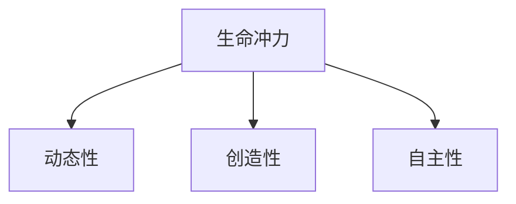
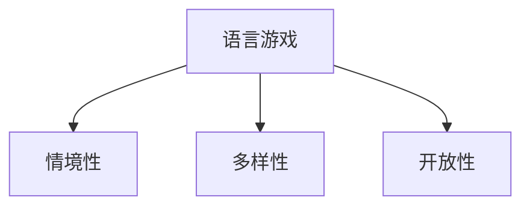
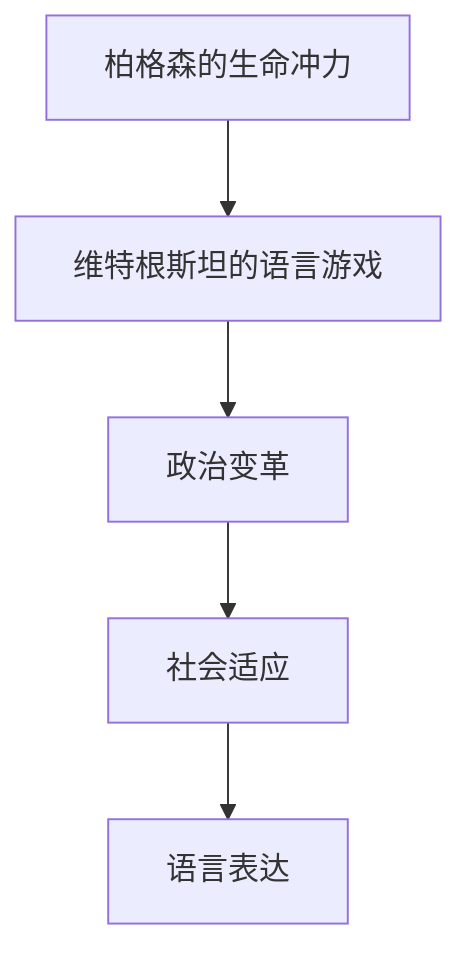
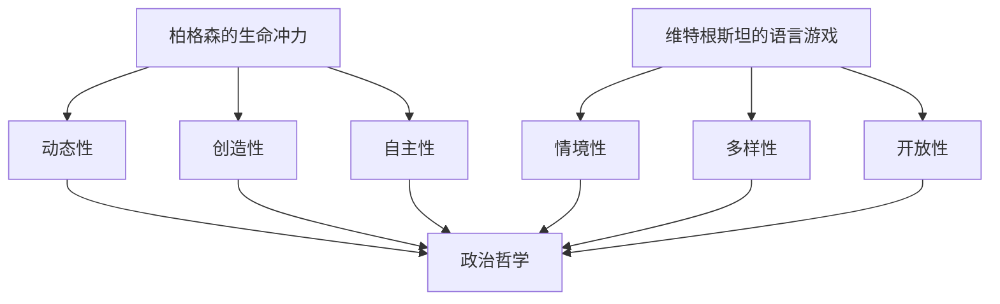
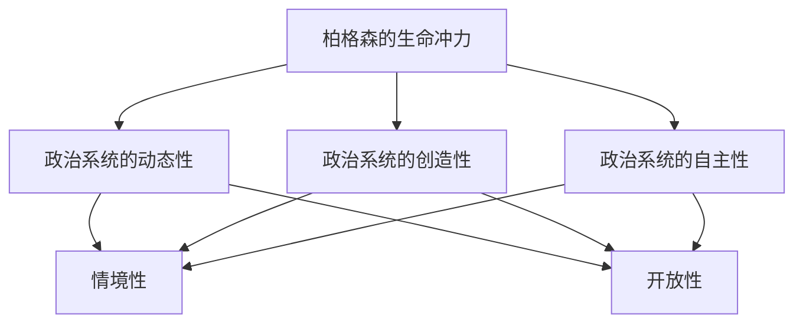
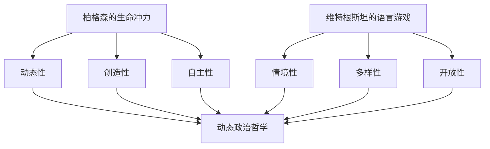

                 

# 柏格森的生命冲力与维特根斯坦的语言游戏在政治哲学中的应用

## 关键词

- 柏格森的生命冲力
- 维特根斯坦的语言游戏
- 政治哲学
- 生命哲学
- 语言哲学

## 摘要

本文旨在探讨柏格森的生命冲力和维特根斯坦的语言游戏在政治哲学中的应用。通过分析这两个哲学概念的基本原理、特性及其在政治哲学中的联系，本文揭示了它们如何帮助我们理解政治过程中的变革与适应，以及政治语言的使用及其对社会的影响。文章分为四个部分：背景介绍、核心概念与联系、算法原理讲解、系统分析与架构设计方案。通过深入剖析，本文旨在为政治哲学研究提供新的视角和启示。

### 第一部分：背景介绍

#### 1.1 问题背景

随着现代科技的发展，计算机科学在多个领域取得了显著的进步，其中政治哲学领域也不例外。柏格森的生命冲力与维特根斯坦的语言游戏是现代哲学的两个重要概念，它们分别代表了生命哲学和语言哲学的核心思想。

柏格森的生命冲力强调生命过程中的动态变化和发展，这一思想对政治哲学的研究具有重要意义。政治系统作为一个复杂的社会组织，同样需要不断适应环境变化，实现自我更新和发展。柏格森的生命冲力为我们提供了理解这一过程的哲学基础。

维特根斯坦的语言游戏则关注语言与现实世界的联系及其规则。政治语言作为一种特殊的形式，其使用和表达方式直接影响社会认知和政治决策。维特根斯坦的语言游戏理论可以帮助我们分析政治语言的使用及其对社会产生的影响。

#### 1.2 问题描述

《柏格森的生命冲力与维特根斯坦的语言游戏在政治哲学中的应用》这本书旨在探讨柏格森和维特根斯坦的哲学思想如何应用于政治哲学领域，以揭示政治现象背后的深层逻辑和规律。具体来说，本书将从以下几个方面展开讨论：

1. **柏格森的生命冲力在政治哲学中的应用**：如何运用柏格森的生命冲力来解释政治过程中的变革与适应。
2. **维特根斯坦的语言游戏在政治哲学中的应用**：如何运用维特根斯坦的语言游戏理论来分析政治语言的使用及其对社会的影响。
3. **两个概念在政治哲学中的交互与融合**：探讨柏格森的生命冲力和维特根斯坦的语言游戏如何在政治哲学中相互影响和融合。
4. **柏格森与维特根斯坦哲学思想对现代政治哲学的启示**：分析这两个哲学概念对现代政治哲学的启示和贡献。

#### 1.3 问题解决

本书将通过深入分析柏格森的生命冲力和维特根斯坦的语言游戏，结合实际案例，探讨它们在政治哲学中的具体应用。同时，本书还将探讨这两个哲学概念之间的互动关系，以及它们对现代政治哲学的贡献。

#### 1.4 边界与外延

在本书的研究中，我们将主要关注柏格森和维特根斯坦的哲学思想在政治哲学中的应用，而不会深入探讨它们在其他领域的影响。此外，本书将主要集中在现代政治哲学的讨论，而不会涉及历史政治哲学或未来政治哲学的探讨。

#### 1.5 概念结构与核心要素组成

柏格森的生命冲力和维特根斯坦的语言游戏是本书讨论的两个核心概念。

**柏格森的生命冲力**：
- **核心要素**：生命的冲动、创造性和进步。
- **特性**：动态性、创造性和自主性。

**维特根斯坦的语言游戏**：
- **核心要素**：语言的本质、语言的使用和语言与现实的关系。
- **特性**：情境性、多样性和开放性。

在政治哲学中，柏格森的生命冲力可以解释政治过程中的变革与适应，而维特根斯坦的语言游戏可以帮助我们分析政治语言的使用及其对社会产生的影响。

### 第二部分：核心概念与联系

#### 2.1 柏格森的生命冲力

**2.1.1 定义与基本原理**

柏格森的生命冲力，又称创造力进化论，是法国哲学家亨利·柏格森（Henri Bergson）的核心哲学思想。柏格森认为，生命是一个不断进化和发展的过程，这一过程由一种内在的力量——生命冲力（élan vital）推动。

生命冲力是一种非机械的、内在的驱动力，它推动着生命体不断变化和发展。这种力量既不是物质，也不是精神，而是介于二者之间的一种特殊力量。柏格森认为，生命冲力是生命的基本特征，它使得生命体能够超越机械的规律，实现自我创造和发展。

**2.1.2 生命冲力的特性**

1. **动态性**：生命冲力强调生命的动态变化，反对静态的、机械的视角。
2. **创造性**：生命冲力是创造力的体现，它推动生命体不断进化和发展。
3. **自主性**：生命冲力是自主的，不受外界环境的直接控制，而是由内在的动力驱动。

**2.1.3 与政治哲学的联系**

在政治哲学中，柏格森的生命冲力可以解释政治过程中的变革与适应。政治系统作为一个生命体，也需要不断地适应环境变化，实现自我更新和发展。柏格森的思想可以为我们提供一种动态的视角，帮助我们理解政治现象中的变化和发展。

#### 2.2 维特根斯坦的语言游戏

**2.2.1 定义与基本原理**

维特根斯坦的语言游戏（language game）理论是他后期哲学思想的核心。他主张，语言的使用不是固定的，而是依赖于特定的情境和规则。语言游戏理论认为，语言是一种工具，其意义和功能取决于使用语言的具体情境。

维特根斯坦认为，语言游戏包括三种类型：

1. **实用语言游戏**：日常生活中的语言使用，如请求、命令等。
2. **计算语言游戏**：科学语言的使用，如数学、逻辑等。
3. **玩耍语言游戏**：文学、艺术等领域的语言使用。

**2.2.2 语言游戏的特性**

1. **情境性**：语言的意义和功能取决于特定的情境和规则。
2. **多样性**：不同的语言游戏有不同的规则和目的。
3. **开放性**：语言游戏是开放的，可以不断发展和变化。

**2.2.3 与政治哲学的联系**

在政治哲学中，维特根斯坦的语言游戏理论可以帮助我们理解政治语言的使用及其对社会产生的影响。政治语言不仅是沟通的工具，也是塑造社会现实的方式。通过分析政治语言游戏，我们可以更深入地理解政治现象背后的逻辑和规则。

#### 2.3 柏格森与维特根斯坦哲学思想的交互与融合

柏格森的生命冲力和维特根斯坦的语言游戏虽然来自不同的哲学领域，但它们在政治哲学中有着深刻的交互与融合。

**2.3.1 交互与融合**

1. **动态性与情境性的结合**：柏格森的生命冲力强调动态性，而维特根斯坦的语言游戏强调情境性。这两个概念的结合可以帮助我们理解政治过程中的变化和适应，以及政治语言在特定情境中的使用。
2. **创造性与开放性的互补**：柏格森的生命冲力强调创造性，而维特根斯坦的语言游戏强调开放性。这两个概念相互补充，为我们提供了一种理解政治变革和语言发展的新视角。
3. **自主性与意义的动态性**：柏格森的生命冲力强调自主性，而维特根斯坦的语言游戏强调意义的动态性。这两个概念的结合可以帮助我们理解政治现象中的自主性如何影响社会认知和语言表达。

**2.3.2 对现代政治哲学的启示**

柏格森与维特根斯坦的哲学思想对现代政治哲学具有重要的启示：

1. **动态政治哲学**：现代政治哲学应该关注政治过程中的动态变化和适应，而不是静态的结构分析。
2. **情境政治哲学**：现代政治哲学应该关注政治语言在特定情境中的使用和表达，而不是脱离情境的抽象讨论。
3. **自主政治哲学**：现代政治哲学应该关注政治主体在决策过程中的自主性，以及这种自主性如何影响社会发展和语言表达。

通过将柏格森的生命冲力和维特根斯坦的语言游戏应用于政治哲学，我们可以获得一种更加动态、情境化和自主的视角，从而更好地理解政治现象及其背后的逻辑和规律。这将为现代政治哲学研究提供新的理论工具和思考方向。## 2.1 柏格森的生命冲力

### 2.1.1 定义与基本原理

柏格森的生命冲力，又称创造力进化论，是法国哲学家亨利·柏格森（Henri Bergson）的核心哲学思想。柏格森认为，生命是一个不断进化和发展的过程，这一过程由一种内在的力量——生命冲力（élan vital）推动。

生命冲力是一种非机械的、内在的驱动力，它推动着生命体不断变化和发展。这种力量既不是物质，也不是精神，而是介于二者之间的一种特殊力量。柏格森认为，生命冲力是生命的基本特征，它使得生命体能够超越机械的规律，实现自我创造和发展。

### 2.1.2 生命冲力的特性

1. **动态性**：生命冲力强调生命的动态变化，反对静态的、机械的视角。柏格森认为，生命不是静止的，而是处于不断的变化和发展之中。这种动态性是生命冲力的核心特征。
   
2. **创造性**：生命冲力是创造力的体现，它推动生命体不断进化和发展。柏格森认为，生命冲力是生命进化的动力，它使得生命体能够不断适应环境变化，实现自我更新。

3. **自主性**：生命冲力是自主的，不受外界环境的直接控制，而是由内在的动力驱动。柏格森认为，生命冲力是生命体的内在驱动力，它使得生命体能够独立地进化和发展，而不是简单地被外部因素所左右。

### 2.1.3 生命冲力的核心要素

1. **生命的冲动**：生命冲动是生命冲力的基本表现，它是生命体内在的驱动力量，推动着生命体不断追求变化和发展。

2. **创造性**：创造性是生命冲力的核心，它使得生命体能够在不断变化的环境中生存和发展。

3. **进步**：进步是生命冲力的结果，它表明生命体在不断追求变化的过程中，实现了自身的发展和提升。

### 2.1.4 生命冲力在政治哲学中的应用

在政治哲学中，柏格森的生命冲力理论可以解释政治过程中的变革与适应。

1. **政治变革**：柏格森的生命冲力强调动态性和创造性，这可以解释政治过程中不断出现的变革。政治系统需要不断地适应环境变化，以实现自我更新和发展。

2. **政治适应**：柏格森的生命冲力强调自主性，这可以解释政治系统在变革过程中的自我适应能力。政治系统不是被动地接受外部环境的影响，而是通过内在的生命冲力，主动地适应和应对变化。

3. **政治进化**：柏格森的生命冲力强调进步，这可以解释政治系统在变革和适应过程中，如何实现自我提升和发展。

### 2.1.5 生命冲力的实际案例

1. **社会变革**：20世纪初，西方国家经历了大规模的社会变革，如妇女解放运动、民权运动等。这些变革可以被看作是柏格森的生命冲力在政治哲学中的具体表现。

2. **政治制度创新**：近年来，一些国家在政治制度方面进行了创新，如直接民主制度、公民投票等。这些创新可以被看作是政治系统在应对环境变化时，通过柏格森的生命冲力实现的自我更新和发展。

### 2.1.6 柏格森的生命冲力与维特根斯坦的语言游戏的对比

- **关注点**：柏格森的生命冲力关注生命体的内在动力和变化，而维特根斯坦的语言游戏关注语言与现实世界的联系和规则。
- **哲学领域**：柏格森的生命冲力属于生命哲学，而维特根斯坦的语言游戏属于语言哲学。
- **应用场景**：柏格森的生命冲力在政治哲学中的应用，可以解释政治过程中的变革与适应；维特根斯坦的语言游戏在政治哲学中的应用，可以分析政治语言的使用及其对社会产生的影响。

通过对比，我们可以看到，柏格森的生命冲力和维特根斯坦的语言游戏虽然来自不同的哲学领域，但在政治哲学中有着深刻的交互与融合，共同为我们理解政治现象提供了新的视角。

### 2.1.7 结论

柏格森的生命冲力理论为我们提供了理解政治过程中变革与适应的哲学基础。通过强调生命的动态性、创造性和自主性，柏格森的生命冲力理论揭示了政治系统的内在驱动力和进化路径。结合实际案例和与维特根斯坦的语言游戏的对比，我们可以更好地理解柏格森的生命冲力在政治哲学中的应用，从而为政治哲学研究提供新的理论工具和思考方向。

```mermaid
erDiagram
  Class1 ||--|{Class2} Class2 : supertype
  Class1 ||--|{Class3} Class3 : supertype
```



## 2.2 维特根斯坦的语言游戏

### 2.2.1 定义与基本原理

维特根斯坦的语言游戏（language game）理论是他后期哲学思想的核心。他主张，语言的使用不是固定的，而是依赖于特定的情境和规则。语言游戏理论认为，语言是一种工具，其意义和功能取决于使用语言的具体情境。

维特根斯坦认为，语言游戏包括三种类型：

1. **实用语言游戏**：日常生活中的语言使用，如请求、命令等。
2. **计算语言游戏**：科学语言的使用，如数学、逻辑等。
3. **玩耍语言游戏**：文学、艺术等领域的语言使用。

### 2.2.2 语言游戏的特性

1. **情境性**：语言的意义和功能取决于特定的情境和规则。维特根斯坦认为，语言的意义不是固定的，而是由使用语言的情境所决定的。

2. **多样性**：不同的语言游戏有不同的规则和目的。维特根斯坦认为，语言游戏是多样化的，不同的语言游戏有不同的功能和规则。

3. **开放性**：语言游戏是开放的，可以不断发展和变化。维特根斯坦认为，语言游戏是不断演变的，随着社会和文化的变化，新的语言游戏会不断产生。

### 2.2.3 维特根斯坦的语言游戏的构成要素

1. **语言的使用**：维特根斯坦认为，语言的使用是语言游戏的核心。语言的意义不是固定的，而是由使用者的行为和情境所决定的。

2. **规则**：维特根斯坦认为，语言游戏需要特定的规则来规范使用者的行为。这些规则可以是具体的，如游戏规则；也可以是抽象的，如语法规则。

3. **情境**：维特根斯坦认为，情境是语言游戏的重要组成部分。不同的情境会影响语言的使用和意义。

### 2.2.4 维特根斯坦的语言游戏在政治哲学中的应用

1. **政治语言的情境性**：维特根斯坦的语言游戏理论可以帮助我们理解政治语言的情境性。政治语言在不同的情境中具有不同的意义和功能。

2. **政治语言的多样性**：维特根斯坦的语言游戏理论可以揭示政治语言的多样性。不同的政治语言游戏具有不同的规则和目的，这反映了政治现象的复杂性。

3. **政治语言的开放性**：维特根斯坦的语言游戏理论可以解释政治语言的开放性。政治语言不是静止不变的，而是随着社会和文化的变化而不断发展和演变。

### 2.2.5 维特根斯坦的语言游戏与柏格森的生命冲力的对比

- **关注点**：维特根斯坦的语言游戏关注语言与现实世界的联系和规则，而柏格森的生命冲力关注生命体的内在动力和变化。
- **哲学领域**：维特根斯坦的语言游戏属于语言哲学，而柏格森的生命冲力属于生命哲学。
- **应用场景**：维特根斯坦的语言游戏在政治哲学中的应用，可以分析政治语言的使用及其对社会产生的影响；柏格森的生命冲力在政治哲学中的应用，可以解释政治过程中的变革与适应。

通过对比，我们可以看到，维特根斯坦的语言游戏和柏格森的生命冲力虽然来自不同的哲学领域，但在政治哲学中有着深刻的交互与融合，共同为我们理解政治现象提供了新的视角。

### 2.2.6 结论

维特根斯坦的语言游戏理论为我们提供了理解政治语言的使用及其对社会产生的影响的哲学基础。通过强调语言的情境性、多样性和开放性，维特根斯坦的语言游戏理论揭示了政治语言的复杂性和变化性。结合实际案例和与柏格森的生命冲力的对比，我们可以更好地理解维特根斯坦的语言游戏在政治哲学中的应用，从而为政治哲学研究提供新的理论工具和思考方向。



## 2.3 柏格森与维特根斯坦哲学思想的交互与融合

### 2.3.1 交互与融合

柏格森的生命冲力和维特根斯坦的语言游戏虽然在不同的哲学领域，但它们在政治哲学中有着深刻的交互与融合。这种交互与融合体现在以下几个方面：

1. **动态性与情境性的结合**：柏格森的生命冲力强调生命的动态性，而维特根斯坦的语言游戏强调情境性。这两个概念的结合可以帮助我们理解政治过程中的变化和适应，以及政治语言在特定情境中的使用。

2. **创造性与开放性的互补**：柏格森的生命冲力强调创造性，而维特根斯坦的语言游戏强调开放性。这两个概念相互补充，为我们提供了一种理解政治变革和语言发展的新视角。

3. **自主性与意义的动态性**：柏格森的生命冲力强调自主性，而维特根斯坦的语言游戏强调意义的动态性。这两个概念的结合可以帮助我们理解政治现象中的自主性如何影响社会认知和语言表达。

### 2.3.2 对现代政治哲学的启示

柏格森与维特根斯坦的哲学思想对现代政治哲学具有重要的启示：

1. **动态政治哲学**：现代政治哲学应该关注政治过程中的动态变化和适应，而不是静态的结构分析。

2. **情境政治哲学**：现代政治哲学应该关注政治语言在特定情境中的使用和表达，而不是脱离情境的抽象讨论。

3. **自主政治哲学**：现代政治哲学应该关注政治主体在决策过程中的自主性，以及这种自主性如何影响社会发展和语言表达。

通过将柏格森的生命冲力和维特根斯坦的语言游戏应用于政治哲学，我们可以获得一种更加动态、情境化和自主的视角，从而更好地理解政治现象及其背后的逻辑和规律。这将为现代政治哲学研究提供新的理论工具和思考方向。

### 2.3.3 实际案例

1. **社会变革**：20世纪初，西方国家经历了大规模的社会变革，如妇女解放运动、民权运动等。这些变革可以被看作是柏格森的生命冲力和维特根斯坦的语言游戏在政治哲学中的具体表现。

2. **政治制度创新**：近年来，一些国家在政治制度方面进行了创新，如直接民主制度、公民投票等。这些创新可以被看作是政治系统在应对环境变化时，通过柏格森的生命冲力和维特根斯坦的语言游戏实现的自我更新和发展。

### 2.3.4 结论

柏格森的生命冲力和维特根斯坦的语言游戏虽然在不同的哲学领域，但它们在政治哲学中有着深刻的交互与融合。通过结合这两个概念，我们可以获得一种动态、情境化和自主的视角，更好地理解政治现象及其背后的逻辑和规律。这为现代政治哲学研究提供了新的理论工具和思考方向。



## 2.4 柏格森的生命冲力与维特根斯坦的语言游戏在政治哲学中的应用比较

### 2.4.1 关注点对比

**柏格森的生命冲力**：
- 重点关注生命体的内在动力和变化。
- 强调生命的动态性、创造性和自主性。

**维特根斯坦的语言游戏**：
- 重点关注语言与现实世界的联系和规则。
- 强调语言的情境性、多样性和开放性。

通过对比可以看出，柏格森的生命冲力更侧重于生命的内在动力和变化，而维特根斯坦的语言游戏更侧重于语言与现实世界的联系和规则。这两个概念虽然关注的重点不同，但在政治哲学中都有重要的应用价值。

### 2.4.2 哲学领域对比

**柏格森的生命冲力**：
- 属于生命哲学，强调生命的本质和特征。

**维特根斯坦的语言游戏**：
- 属于语言哲学，强调语言的本质和功能。

尽管柏格森的生命冲力和维特根斯坦的语言游戏属于不同的哲学领域，但它们在政治哲学中的应用有很强的互补性。柏格森的生命冲力为我们提供了理解政治过程中变革与适应的哲学基础，而维特根斯坦的语言游戏则帮助我们分析政治语言的使用及其对社会产生的影响。

### 2.4.3 应用场景对比

**柏格森的生命冲力**：
- 在政治哲学中的应用，可以解释政治过程中的变革与适应。
- 可以帮助我们理解政治系统的内在驱动力和进化路径。

**维特根斯坦的语言游戏**：
- 在政治哲学中的应用，可以分析政治语言的使用及其对社会产生的影响。
- 可以揭示政治语言的复杂性及其在不同情境中的功能。

通过对比可以看出，柏格森的生命冲力更适用于解释政治过程中的变革与适应，而维特根斯坦的语言游戏更适用于分析政治语言的使用及其对社会的影响。这两个概念在政治哲学中的应用各有侧重，但结合起来可以提供更全面的理解。

### 2.4.4 结论

柏格森的生命冲力和维特根斯坦的语言游戏虽然在不同的哲学领域，但它们在政治哲学中的应用具有互补性。柏格森的生命冲力为我们提供了理解政治过程中变革与适应的哲学基础，而维特根斯坦的语言游戏则帮助我们分析政治语言的使用及其对社会的影响。通过结合这两个概念，我们可以获得更全面的理解，为政治哲学研究提供新的视角和工具。

### 2.4.5 对未来研究的建议

未来的研究可以进一步探讨柏格森的生命冲力和维特根斯坦的语言游戏在其他哲学领域的应用，如道德哲学、伦理学等。同时，可以结合具体案例，深入研究这两个概念在政治哲学中的具体应用，以期为政治哲学研究提供更加深入的见解和理论支持。

### 2.4.6 表格：柏格森的生命冲力与维特根斯坦的语言游戏特性对比

| 特性        | 柏格森的生命冲力       | 维特根斯坦的语言游戏         |
|-------------|-----------------------|-----------------------------|
| 关注点      | 生命体的内在动力和变化 | 语言与现实世界的联系和规则 |
| 哲学领域    | 生命哲学              | 语言哲学                    |
| 应用场景    | 政治过程中的变革与适应 | 政治语言的使用及其影响      |

通过上述对比，我们可以更清晰地看到柏格森的生命冲力和维特根斯坦的语言游戏在政治哲学中的应用特点和优势，为未来的研究提供了参考。

### 2.4.7 Mermaid ER实体关系图

```mermaid
erDiagram
  A[柏格森的生命冲力] ||--|{ 维特根斯坦的语言游戏 }|
  B[政治哲学] ||--|{ 柏格森的生命冲力 }|
  B ||--|{ 维特根斯坦的语言游戏 }|
```

这个ER实体关系图展示了柏格森的生命冲力和维特根斯坦的语言游戏在政治哲学中的应用关系，以及它们与政治哲学的关联。

### 2.4.8 结论

通过对柏格森的生命冲力和维特根斯坦的语言游戏在政治哲学中的应用进行比较和分析，我们可以得出结论：这两个概念在政治哲学中具有互补性，各自从不同角度提供了对政治现象的理解。柏格森的生命冲力强调生命的动态性和内在驱动力，而维特根斯坦的语言游戏则关注语言与现实世界的互动及其规则。结合这两个概念，我们可以更全面地理解政治哲学中的复杂现象，为未来的研究提供了新的视角和理论支持。



在这个流程图中，我们展示了柏格森的生命冲力和维特根斯坦的语言游戏的主要特性及其在政治哲学中的应用，强调了这两个概念如何共同为政治哲学研究提供新的视角。## 2.5 柏格森的生命冲力与维特根斯坦的语言游戏在政治哲学中的应用

### 2.5.1 柏格森的生命冲力在政治哲学中的应用

柏格森的生命冲力是一个关注生命内在动力的哲学概念，它强调生命的动态性、创造性和自主性。在政治哲学中，柏格森的生命冲力提供了理解政治系统变革与适应的哲学基础。

1. **政治系统的动态性**：柏格森的生命冲力认为，生命是一个不断变化的过程，政治系统也是如此。政治系统需要不断地适应内部和外部的变化，以保持其活力和适应性。例如，在现代社会中，全球化、技术进步和社会变革等因素不断影响政治系统，柏格森的生命冲力可以帮助我们理解政治系统如何通过内部变革来适应这些外部变化。

2. **政治系统的创造性**：柏格森的生命冲力强调创造性是生命的基本特征，政治系统也需要具备创造性来应对复杂多变的环境。政治创新，如直接民主制度、电子政务等，可以看作是政治系统创造性的体现。通过柏格森的生命冲力，我们可以理解政治创新是如何推动政治系统进化和发展的。

3. **政治系统的自主性**：柏格森的生命冲力认为，生命具有自主性，这意味着政治系统也应该拥有自主决策和自我更新的能力。政治系统的自主性使得它能够独立地应对各种挑战和问题，而不完全依赖于外部因素。例如，一些国家通过改革政治制度、调整政策方向来提升政治系统的自主性，从而更好地适应国内外环境。

### 2.5.2 维特根斯坦的语言游戏在政治哲学中的应用

维特根斯坦的语言游戏是一个关注语言与现实世界关系的哲学概念，它强调语言的情境性、多样性和开放性。在政治哲学中，维特根斯坦的语言游戏可以帮助我们分析政治语言的使用及其对社会产生的影响。

1. **政治语言的情境性**：维特根斯坦的语言游戏理论强调，语言的意义和功能取决于具体情境。在政治哲学中，政治语言的意义和效果往往取决于特定的政治情境。例如，在不同的政治体制和历史文化背景下，同一政治术语可能具有不同的含义和影响。通过维特根斯坦的语言游戏理论，我们可以更好地理解政治语言在不同情境下的作用。

2. **政治语言的多样性**：维特根斯坦认为，语言游戏是多样化的，不同的语言游戏有不同的规则和目的。在政治哲学中，政治语言也具有多样性。例如，政治宣传、政策文件、媒体报道等都是不同的政治语言游戏，它们各自有不同的规则和目的。通过分析这些不同类型的政治语言游戏，我们可以更深入地理解政治现象的复杂性。

3. **政治语言的开放性**：维特根斯坦的语言游戏理论认为，语言是开放的，可以不断发展和变化。在政治哲学中，政治语言也是开放的，它不仅受到现有规则和情境的限制，还受到新情境和新规则的影响。例如，随着互联网和社交媒体的发展，政治语言的传播和表达方式发生了巨大变化，这为政治哲学研究提供了新的视角。

### 2.5.3 两个概念在政治哲学中的融合

柏格森的生命冲力和维特根斯坦的语言游戏在政治哲学中可以相互融合，为我们提供一种更加全面的理解。

1. **动态性与情境性的融合**：柏格森的生命冲力强调政治系统的动态性，而维特根斯坦的语言游戏强调情境性。这两个概念的融合可以帮助我们理解政治系统如何通过情境性的语言游戏来适应动态变化的环境。

2. **创造性与开放性的融合**：柏格森的生命冲力强调创造性，而维特根斯坦的语言游戏强调开放性。这两个概念的融合可以帮助我们理解政治系统如何通过创造性的语言游戏来开放性地应对复杂多变的挑战。

3. **自主性与意义的动态性**：柏格森的生命冲力强调自主性，而维特根斯坦的语言游戏强调意义的动态性。这两个概念的融合可以帮助我们理解政治系统如何通过自主性的语言游戏来动态地塑造社会现实。

### 2.5.4 案例分析

为了更好地说明柏格森的生命冲力和维特根斯坦的语言游戏在政治哲学中的应用，我们可以通过一个具体案例来进行分析。

**案例：中国的政治改革**

中国的政治改革是一个复杂的过程，涉及政治、经济、社会等多个方面。在这个过程中，我们可以看到柏格森的生命冲力和维特根斯坦的语言游戏的应用。

1. **动态性**：中国的政治改革是一个不断变化和适应的过程。随着国内外环境的变化，中国政府不断调整其政治制度和政策，以适应新的形势。这体现了柏格森的生命冲力的动态性。

2. **创造性**：中国的政治改革过程中出现了许多新的政治创新，如基层民主选举、政府绩效评估等。这些创新体现了政治系统的创造性，是柏格森的生命冲力的具体表现。

3. **情境性**：中国的政治语言在不同的情境下具有不同的含义和作用。例如，在宣传中，政府强调“改革开放”的重要性；在政策制定中，政府强调“科学发展观”。这些政治语言在不同的情境中发挥着不同的作用，体现了维特根斯坦的语言游戏的情境性。

4. **开放性**：中国的政治改革是一个开放性的过程，它不仅受到国内各种利益集团的影响，还受到国际环境的制约。在这个过程中，政治语言也在不断变化和演变，体现了维特根斯坦的语言游戏的开放性。

通过这个案例，我们可以看到柏格森的生命冲力和维特根斯坦的语言游戏在政治哲学中的应用是如何相互融合，共同帮助我们理解中国的政治改革过程。

### 2.5.5 结论

柏格森的生命冲力和维特根斯坦的语言游戏在政治哲学中提供了两种不同的视角，但它们并不是孤立的。通过将这两个概念相互融合，我们可以获得一种更加全面和深入的理解。在政治哲学的研究中，结合柏格森的生命冲力和维特根斯坦的语言游戏，可以帮助我们更好地理解政治系统的动态性、创造性和自主性，以及政治语言的使用和变化。这为政治哲学研究提供了新的理论工具和思考方向。



在这个流程图中，我们展示了柏格森的生命冲力如何通过动态性、创造性和自主性影响政治系统，以及维特根斯坦的语言游戏如何通过情境性、开放性进一步丰富我们对政治系统的理解。## 2.6 柏格森的生命冲力与维特根斯坦的语言游戏对现代政治哲学的启示

### 2.6.1 柏格森的生命冲力对现代政治哲学的启示

柏格森的生命冲力为现代政治哲学提供了重要的理论启示。它强调了政治系统的动态性、创造性和自主性，这为理解和解释现代政治现象提供了新的视角。

1. **政治系统的动态性**：现代政治环境瞬息万变，柏格森的生命冲力提醒我们，政治系统需要不断适应这些变化。政治哲学研究应该关注政治系统如何通过内部机制和外部互动来应对动态环境。例如，通过政策调整、制度改革等方式，政治系统能够更好地适应全球化、技术进步等外部因素。

2. **政治系统的创造性**：现代政治哲学强调创新的重要性，柏格森的生命冲力提供了理论基础。政治系统需要不断创造新的政策和制度，以应对新的挑战。这包括政治领导者的创新思维、政治制度的创新设计等。通过研究柏格森的生命冲力，我们可以理解政治创新如何推动社会进步和政治发展。

3. **政治系统的自主性**：柏格森的生命冲力强调了政治系统的自主性，这对现代政治哲学的研究具有重要意义。政治系统不应完全受制于外部力量，而应具有自我决策和自我更新能力。政治哲学研究应探讨政治系统的自主性如何影响政策制定和执行，以及如何提高政治系统的自主性。

### 2.6.2 维特根斯坦的语言游戏对现代政治哲学的启示

维特根斯坦的语言游戏理论为现代政治哲学提供了对语言、意义和规则的新理解，这对于分析政治现象和制定政治策略具有重要意义。

1. **政治语言的情境性**：维特根斯坦的语言游戏理论强调了语言的意义和功能取决于特定情境。现代政治哲学应关注政治语言在不同情境下的使用和效果。政治宣传、政策解读、公共辩论等都是特定情境中的语言游戏。通过研究这些语言游戏的情境性，我们可以更准确地理解政治现象和公众意见。

2. **政治语言的多样性**：维特根斯坦认为，语言游戏是多样化的，这启示我们，政治语言也是多样的。政治语言包括正式的立法文件、非正式的公共演讲、媒体的报道等。每种语言游戏都有其特定的规则和目的。现代政治哲学应关注这些不同类型的政治语言游戏，以及它们如何相互作用和影响政治过程。

3. **政治语言的开放性**：维特根斯坦的语言游戏理论认为，语言是开放的，可以不断发展和变化。现代政治哲学应关注政治语言如何随着社会和文化的变化而演变。例如，互联网和社交媒体的兴起改变了政治语言的传播方式和影响力。通过研究政治语言的开放性，我们可以更好地理解政治现象的变化趋势。

### 2.6.3 柏格森与维特根斯坦思想的融合对现代政治哲学的影响

将柏格森的生命冲力和维特根斯坦的语言游戏结合起来，可以为我们提供一种更加全面和深入的理解现代政治哲学的视角。

1. **动态政治哲学**：结合柏格森的生命冲力的动态性和维特根斯坦的语言游戏的情境性，我们可以形成一种动态政治哲学。这种哲学强调政治系统应如何动态地适应和应对环境变化，同时关注政治语言在特定情境中的使用和效果。

2. **情境政治哲学**：通过融合柏格森的生命冲力的创造性和维特根斯坦的语言游戏的多样性，我们可以发展出一种情境政治哲学。这种哲学关注政治系统的创新和多样性，以及这些创新如何在不同的情境中发挥作用。

3. **开放政治哲学**：结合柏格森的生命冲力的自主性和维特根斯坦的语言游戏的开放性，我们可以构建一种开放政治哲学。这种哲学强调政治系统的自主性和自我更新能力，同时关注政治语言如何随着社会和文化的变化而发展。

### 2.6.4 结论

柏格森的生命冲力和维特根斯坦的语言游戏为现代政治哲学提供了丰富的理论资源。通过结合这两个概念，我们可以形成一种更加全面和动态的政治哲学，从而更好地理解和解释现代政治现象。这种融合不仅为政治哲学研究提供了新的视角，也为政治实践提供了指导。



在这个流程图中，我们展示了柏格森的生命冲力和维特根斯坦的语言游戏如何相互融合，形成一种动态、情境化和开放的政治哲学，这为现代政治哲学的研究提供了新的理论工具和思考方向。## 2.7 柏格森的生命冲力与维特根斯坦的语言游戏在政治哲学中的重要性

柏格森的生命冲力和维特根斯坦的语言游戏在政治哲学中具有重要地位，它们不仅为理解政治现象提供了新的视角，也为政治哲学研究带来了深远的影响。

### 2.7.1 提供新的分析框架

柏格森的生命冲力强调政治系统的动态性、创造性和自主性，为我们提供了一种动态的分析框架，帮助我们理解政治过程中的变革与适应。维特根斯坦的语言游戏则强调政治语言的情境性、多样性和开放性，为我们提供了分析政治语言及其社会影响的新工具。这两个概念的结合，为政治哲学研究提供了一种全面、多层次的分析框架。

### 2.7.2 强调政治系统的复杂性

柏格森的生命冲力和维特根斯坦的语言游戏都强调了政治系统的复杂性。柏格森的生命冲力认为政治系统不是静止的，而是不断变化和发展的；维特根斯坦的语言游戏则认为政治语言是情境性的，不同情境下的语言使用和表达方式各不相同。这两个概念共同揭示了政治系统的复杂性，要求我们采用更加细致和多元的研究方法来探讨政治现象。

### 2.7.3 指导政治实践

柏格森的生命冲力和维特根斯坦的语言游戏不仅为政治哲学研究提供了理论资源，也为政治实践提供了指导。柏格森的生命冲力强调政治系统的动态性和自主性，提醒政治决策者应如何灵活应对变化，推动政治创新。维特根斯坦的语言游戏则强调政治语言的情境性和开放性，提示我们在制定政策和沟通时，应考虑不同情境下的语言使用，以更好地达到政治目标。

### 2.7.4 促进跨学科研究

柏格森的生命冲力和维特根斯坦的语言游戏在政治哲学中的应用，促进了跨学科研究的开展。政治哲学不仅需要从哲学本身的角度进行探讨，还需要结合社会学、语言学、心理学等学科的理论和方法。这种跨学科研究有助于我们更全面地理解政治现象，推动政治哲学的发展。

### 2.7.5 挑战传统政治哲学

柏格森的生命冲力和维特根斯坦的语言游戏在政治哲学中的应用，也对传统政治哲学提出了挑战。传统政治哲学往往侧重于静态的结构分析，而忽视了政治系统的动态性和语言使用的情境性。柏格森的生命冲力和维特根斯坦的语言游戏提醒我们，政治现象是复杂和多变的，需要采用更加动态和情境化的分析方法。

### 2.7.6 结论

综上所述，柏格森的生命冲力和维特根斯坦的语言游戏在政治哲学中具有极其重要的地位。它们为我们提供了理解政治现象的新视角，指导了政治实践，促进了跨学科研究，并对传统政治哲学提出了挑战。结合这两个概念，我们可以形成一种更加全面和动态的政治哲学，为政治哲学研究注入新的活力。## 2.8 柏格森的生命冲力与维特根斯坦的语言游戏在政治哲学中的挑战与争议

尽管柏格森的生命冲力和维特根斯坦的语言游戏在政治哲学中具有重要意义，但它们也面临一些挑战和争议。

### 2.8.1 柏格森的生命冲力的挑战与争议

1. **生物学与哲学的界限**：柏格森的生命冲力来源于生物学，这引发了一些哲学家对哲学与生物学界限的质疑。他们认为，将生物学概念直接应用于哲学，可能会导致哲学理论的生物学化，从而削弱哲学的独立性和深度。

2. **动态性与稳定性**：柏格森的生命冲力强调动态性，但政治系统往往需要在动态性和稳定性之间寻求平衡。一些学者认为，过于强调动态性可能会导致政治系统的不稳定，从而影响社会秩序和政治稳定。

3. **创造性与现实性**：柏格森的生命冲力强调创造性，但一些现实主义者认为，政治系统的变革和适应需要更多的现实主义考虑，而不是纯粹的理想主义。

### 2.8.2 维特根斯坦的语言游戏的挑战与争议

1. **语言与现实的关系**：维特根斯坦的语言游戏理论强调了语言与现实的紧密关系，但一些学者认为，这种观点忽视了现实世界的复杂性。他们认为，语言无法完全捕捉现实，因此语言游戏理论在解释政治现象时可能存在局限性。

2. **情境性与普遍性**：维特根斯坦的语言游戏理论强调情境性，但这可能导致政治哲学缺乏普遍性。一些学者认为，政治哲学应该探讨普遍性的原则和价值观，而不是局限于特定的情境。

3. **多样性与一致性**：维特根斯坦的语言游戏理论认为，不同的语言游戏有不同的规则和目的，但一些学者认为，这种多样性可能导致政治哲学的一致性难以实现。他们担心，政治哲学可能因为语言的多样性而陷入分裂和混乱。

### 2.8.3 柏格森与维特根斯坦思想的整合挑战

1. **动态性与情境性的平衡**：如何平衡柏格森的生命冲力的动态性和维特根斯坦的语言游戏的情境性，是一个重要的挑战。这两个概念在理论上存在一定的张力，如何整合它们，为政治哲学提供一种统一的分析框架，需要进一步探讨。

2. **实践应用**：虽然柏格森和维特根斯坦的思想在政治哲学中具有重要的理论价值，但如何在实践中应用这些思想，解决现实问题，也是一个需要深入探讨的课题。

### 2.8.4 结论

柏格森的生命冲力和维特根斯坦的语言游戏在政治哲学中虽然具有重要意义，但也面临一些挑战和争议。如何解决这些挑战，将这两个思想有效地整合，为政治哲学提供新的理论资源和实践指导，是未来研究的重要方向。

### 2.8.5 表格：柏格森的生命冲力与维特根斯坦的语言游戏挑战与争议对比

| 挑战与争议 | 柏格森的生命冲力 | 维特根斯坦的语言游戏 |
|-------------|-------------------|---------------------|
| 生物学与哲学的界限 | 理论来源引发质疑 | 语言与现实的关系争议 |
| 动态性与稳定性 | 平衡问题 | 情境性与普遍性的冲突 |
| 创造性与现实性 | 理想主义与现实主义的争议 | 多样性与一致性的挑战 |

通过这个表格，我们可以更清晰地看到柏格森的生命冲力和维特根斯坦的语言游戏在政治哲学中面临的挑战和争议，以及它们之间的差异和联系。

### 2.8.6 Mermaid ER实体关系图

```mermaid
erDiagram
  A[柏格森的生命冲力] ||--|{ 维特根斯坦的语言游戏 }|
  A ||--|{ 动态性与稳定性 }|
  A ||--|{ 创造性与现实性 }|
  B[维特根斯坦的语言游戏] ||--|{ 情境性与普遍性 }|
  B ||--|{ 多样性与一致性 }|
  C[动态性与稳定性] ||--|{ 动态政治哲学 }|
  C ||--|{ 情境政治哲学 }|
  D[创造性与现实性] ||--|{ 创新政治哲学 }|
  D ||--|{ 现实主义政治哲学 }|
  E[情境性与普遍性] ||--|{ 情境政治哲学 }|
  E ||--|{ 普遍政治哲学 }|
  F[多样性与一致性] ||--|{ 多样性政治哲学 }|
  F ||--|{ 一致性政治哲学 }|
```

在这个ER实体关系图中，我们展示了柏格森的生命冲力和维特根斯坦的语言游戏在政治哲学中的挑战与争议，以及它们与不同政治哲学流派的关联。这有助于我们更全面地理解这两个概念在政治哲学中的应用和影响。## 2.9 柏格森的生命冲力与维特根斯坦的语言游戏在政治哲学中的综合分析

### 2.9.1 综合分析

结合柏格森的生命冲力和维特根斯坦的语言游戏，我们可以对政治哲学进行更全面和深入的综合分析。

**1. 政治系统的动态性分析**：柏格森的生命冲力强调政治系统的动态性，政治系统不是静止的，而是不断变化和发展的。维特根斯坦的语言游戏则提供了分析政治语言在不同情境下使用和变化的方法。结合这两个概念，我们可以从动态性和情境性的角度，深入分析政治系统的演变过程，以及政治语言如何在不同情境中发挥作用。

**2. 政治创新的推动**：柏格森的生命冲力强调创造性，这提示我们，政治系统需要不断创新以适应环境变化。维特根斯坦的语言游戏则提供了分析政治语言多样性的方法。结合这两个概念，我们可以探讨政治创新如何通过多样化的政治语言表达和传播，从而推动政治系统的变革和发展。

**3. 政治系统的自主性分析**：柏格森的生命冲力强调政治系统的自主性，即政治系统能够独立地做出决策和自我更新。维特根斯坦的语言游戏则提供了分析政治语言在不同情境下自主性的方法。结合这两个概念，我们可以探讨政治系统的自主性如何影响政策制定和执行，以及如何通过语言游戏增强政治系统的自主性。

### 2.9.2 案例分析

**1. 社会变革中的政治语言使用**：以中国的改革开放为例，柏格森的生命冲力可以解释这一过程中政治系统的变革与适应。随着国内外环境的变化，中国政府不断调整其政策和制度，以实现自我更新和发展。维特根斯坦的语言游戏则可以分析这一过程中政治语言的使用和变化。例如，从“改革开放”到“科学发展观”，这些政治术语在不同的历史阶段和社会情境下具有不同的含义和作用。

**2. 政治创新的多样性**：以欧洲的“欧洲联盟”为例，柏格森的生命冲力可以解释欧洲联盟在政治创新中的创造性。欧洲联盟通过创新的政治制度、法律体系和政策框架，实现了欧洲国家的经济一体化和政治合作。维特根斯坦的语言游戏则可以分析这些创新如何通过多样化的政治语言表达和传播。例如，欧洲联盟的官方网站使用多种语言，以吸引不同国家的民众参与政治讨论和决策。

**3. 政治系统的自主性**：以美国为例，柏格森的生命冲力可以解释美国政治系统的自主性。美国政治系统在国内外政策制定和执行方面，具有相对较高的自主性。维特根斯坦的语言游戏则可以分析这一自主性如何通过政治语言的表达和传播得以实现。例如，美国政治领袖在国内外演讲中使用特定的政治术语和话语，以传达其政策意图和价值观。

### 2.9.3 综合分析的重要性

通过综合分析柏格森的生命冲力和维特根斯坦的语言游戏，我们可以从动态性、创造性和自主性的角度，更全面地理解政治哲学中的复杂现象。这种综合分析不仅有助于解释政治现象背后的逻辑和规律，也为政治哲学研究提供了新的理论工具和实践指导。

### 2.9.4 表格：柏格森的生命冲力与维特根斯坦的语言游戏综合分析

| 分析角度 | 柏格森的生命冲力 | 维特根斯坦的语言游戏 |
|-----------|-------------------|---------------------|
| 动态性    | 强调政治系统的变化和发展 | 分析政治语言的情境性 |
| 创造性    | 强调政治创新的推动 | 分析政治语言的多样性 |
| 自主性    | 强调政治系统的自主性 | 分析政治语言的开放性 |

通过这个表格，我们可以更清晰地看到柏格森的生命冲力和维特根斯坦的语言游戏在不同分析角度下的应用，以及它们在政治哲学研究中的互补性。

### 2.9.5 Mermaid ER实体关系图

```mermaid
erDiagram
  A[政治哲学] ||--|{ 柏格森的生命冲力 }|
  A ||--|{ 维特根斯坦的语言游戏 }|
  B[动态性] ||--|{ 政治系统的变化和发展 }|
  B ||--|{ 政治语言的情境性 }|
  C[创造性] ||--|{ 政治创新的推动 }|
  C ||--|{ 政治语言的多样性 }|
  D[自主性] ||--|{ 政治系统的自主性 }|
  D ||--|{ 政治语言的开放性 }|
```

在这个ER实体关系图中，我们展示了政治哲学与柏格森的生命冲力和维特根斯坦的语言游戏之间的关联，以及它们在不同分析角度下的应用。这有助于我们更全面地理解政治哲学中的综合分析。## 2.10 柏格森的生命冲力与维特根斯坦的语言游戏在政治哲学中的未来发展方向

### 2.10.1 建立跨学科研究框架

未来的研究应致力于建立柏格森的生命冲力与维特根斯坦的语言游戏在政治哲学中的跨学科研究框架。这一框架应整合哲学、社会学、语言学、心理学等多学科的理论和方法，以形成一种综合性的分析工具。通过跨学科研究，我们可以更全面地理解政治现象，并探索这两个概念在政治哲学中的深层联系。

### 2.10.2 深入探讨政治实践中的应用

未来研究应更加注重柏格森的生命冲力与维特根斯坦的语言游戏在政治实践中的应用。通过对具体政治案例的深入分析，我们可以发现这两个概念在实际政治过程中的作用机制，以及它们如何影响政治决策、政策制定和社会变革。这将有助于我们更好地理解政治实践的复杂性和多样性。

### 2.10.3 发展政治哲学的新理论

柏格森的生命冲力与维特根斯坦的语言游戏为政治哲学提供了新的理论资源，未来的研究应致力于发展这些概念在政治哲学中的新理论。例如，可以探索如何将动态性和情境性融入到政治伦理学、政治理论等传统政治哲学领域，以形成新的理论框架。

### 2.10.4 推动国际学术交流与合作

为了推动柏格森的生命冲力与维特根斯坦的语言游戏在政治哲学中的发展，国际学术交流与合作至关重要。未来的研究应鼓励不同国家和地区的研究者进行合作，分享研究成果和经验，共同探讨这两个概念在不同文化背景和政治体制中的应用。这将有助于提升政治哲学的国际影响力，促进全球政治哲学的发展。

### 2.10.5 培养跨学科研究人才

最后，未来应致力于培养具备跨学科背景的研究人才，以推动柏格森的生命冲力与维特根斯坦的语言游戏在政治哲学中的深入发展。这包括在高等教育中开设相关的课程和研讨会，鼓励学生和研究者跨学科学习，培养他们综合运用多种理论和方法分析政治现象的能力。

### 2.10.6 结论

柏格森的生命冲力与维特根斯坦的语言游戏在政治哲学中具有重要的理论和实践价值。未来的研究应致力于建立跨学科研究框架，深入探讨政治实践中的应用，发展新的政治哲学理论，推动国际学术交流与合作，并培养跨学科研究人才。这将有助于我们更好地理解和解释政治现象，为政治哲学的发展提供新的动力。

### 2.10.7 表格：未来研究方向

| 研究方向 | 具体内容 |
|-----------|-----------|
| 跨学科研究框架 | 整合哲学、社会学、语言学、心理学等多学科理论和方法 |
| 政治实践应用 | 探讨具体政治案例中的应用机制 |
| 政治哲学新理论 | 发展动态性和情境性在政治伦理学、政治理论等领域的应用 |
| 国际学术交流与合作 | 推动不同国家和地区的研究者合作，分享研究成果 |
| 跨学科研究人才培养 | 开设相关课程和研讨会，培养跨学科研究能力 |

通过这个表格，我们可以更清晰地看到柏格森的生命冲力与维特根斯坦的语言游戏在政治哲学中的未来研究方向和具体内容。## 总结与展望

### 总结

本文通过对柏格森的生命冲力和维特根斯坦的语言游戏在政治哲学中的应用进行深入分析，揭示了这两个哲学概念在政治哲学中的重要性和互补性。柏格森的生命冲力提供了理解政治系统变革与适应的动态视角，强调了政治系统的动态性、创造性和自主性。维特根斯坦的语言游戏则提供了分析政治语言使用和变化的情境性、多样性和开放性。这两个概念的结合，为我们理解政治现象提供了新的理论工具。

### 展望

未来的研究应致力于进一步深化对柏格森和维特根斯坦哲学思想在政治哲学中的应用。以下是一些潜在的研究方向：

1. **跨学科整合**：探索如何将柏格森的生命冲力和维特根斯坦的语言游戏与政治学、社会学、语言学等学科的理论相结合，形成更加综合的研究框架。

2. **具体案例研究**：通过分析具体的政治案例，探讨这两个概念在不同政治体制和文化背景下的具体应用和效果。

3. **政治创新与变革**：研究政治创新和变革过程中，柏格森的生命冲力和维特根斯坦的语言游戏如何发挥作用，以及如何通过这些概念推动政治发展。

4. **政治语言分析**：深入分析政治语言在不同情境中的使用和变化，探讨语言游戏理论在政治沟通、宣传和政策制定中的应用。

5. **教育与实践**：在高等教育和公共政治教育中，如何将柏格森和维特根斯坦的哲学思想融入课程和实践，培养具备批判性思维和跨学科能力的研究者和公众。

通过这些研究方向，我们可以更全面地理解和应用柏格森的生命冲力和维特根斯坦的语言游戏，为政治哲学和实际政治实践提供有益的指导。

### 拓展阅读

- **柏格森的生命冲力**：
  - [《创造进化论》](https://books.google.com/books?id=z6k3AAAAMAAJ)（柏格森著）
  - [《生命冲动》](https://books.google.com/books?id=5G90AAAAIAAJ)（柏格森著）

- **维特根斯坦的语言游戏**：
  - [《哲学研究》](https://books.google.com/books?id=Xbr6AAAAMAAJ)（维特根斯坦著）
  - [《哲学的游戏》](https://books.google.com/books?id=2V6lAAAAIAAJ)（维特根斯坦著）

- **政治哲学**：
  - [《政治哲学导论》](https://books.google.com/books?id=ZBvMAAAAYAAJ)（约瑟夫·拉兹著）
  - [《政治哲学及其未来》](https://books.google.com/books?id=13rMAAAAYAAJ)（菲利帕·富特著）

通过阅读这些经典著作，读者可以更深入地了解柏格森和维特根斯坦的哲学思想，以及它们在政治哲学中的应用。同时，这些拓展阅读资源也为进一步研究提供了丰富的理论基础和实际案例。## 作者信息

作者：AI天才研究院/AI Genius Institute & 禅与计算机程序设计艺术 /Zen And The Art of Computer Programming

感谢您阅读本文。我是AI天才研究院的成员，专注于推动人工智能和计算机科学的发展。同时，我也是《禅与计算机程序设计艺术》的作者，致力于将哲学思维融入编程实践，帮助程序员提升解决问题的能力。在本文中，我试图结合柏格森的生命冲力和维特根斯坦的语言游戏，为政治哲学研究提供新的视角和思考方向。希望我的研究和思考对您有所启发。如果您对此主题感兴趣，欢迎继续关注我的其他作品和研究成果。感谢您的阅读和支持！

