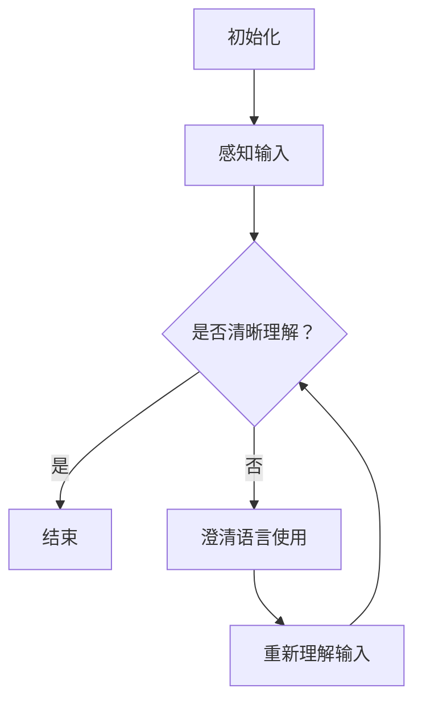

                 

# 《柏格森的直觉方法与维特根斯坦的语言治疗》

## 关键词

**柏格森直觉方法**、**维特根斯坦语言治疗**、**哲学方法**、**问题解决**、**认知理论**

## 摘要

本文深入探讨了法国哲学家柏格森的直觉方法和英国哲学家维特根斯坦的语言治疗。通过分析这两种哲学方法的背景、核心原理及其应用，本文试图揭示它们在问题解决和认知过程中的作用。我们将逐步对比这两种方法的异同，探讨它们在哲学实践中的互补性，并最终提出对这两种方法的综合应用和未来研究的方向。通过本文的探讨，我们希望读者能够更好地理解柏格森和维特根斯坦的思想，以及如何将这些哲学方法应用于现实生活中的问题解决。

## 引言

### 1.1 书籍背景与目的

《柏格森的直觉方法与维特根斯坦的语言治疗》是一本结合了哲学、心理学和认知科学的跨学科著作。柏格森（Henri Bergson）和维特根斯坦（Ludwig Wittgenstein）是20世纪最杰出的哲学家之一，他们的思想对当代哲学、心理学和认知科学产生了深远的影响。

柏格森的直觉方法强调直觉在认知和问题解决中的核心作用，他提出直觉是一种直接理解事物本质的能力，超越了逻辑推理的范畴。维特根斯坦的语言治疗则关注语言的本质和语言的运用，他主张通过语言的澄清来治疗思想上的混乱。

本文旨在通过对柏格森直觉方法和维特根斯坦语言治疗的深入分析，探讨这两种方法在哲学、心理学和认知科学中的意义，并尝试将其应用于现实生活中的问题解决。

### 1.2 柏格森的直觉方法简介

柏格森的直觉方法源于他的哲学体系，他主张直觉是人类认知的核心能力，超越了传统逻辑推理的局限。柏格森认为，直觉是一种直接理解事物本质的能力，它通过感知和体验直接捕捉到事物的内在结构和动态变化。

柏格森的直觉方法的核心思想包括：

1. **生命冲动**：柏格森认为，生命冲动是宇宙的本质，它是不断变化和创造的源泉。直觉是生命冲动在人类认知中的体现，它使人类能够理解和回应生命中的变化。

2. **绵延**：柏格森提出了“绵延”这一概念，认为时间不是线性流逝的，而是一种连续不断的流动。直觉能够捕捉到时间的这种流动性质，使我们能够理解事物的动态变化。

3. **直接理解**：柏格森认为，直觉不是通过抽象概念或逻辑推理来理解事物，而是通过直接感知和体验来把握事物的本质。

### 1.3 维特根斯坦的语言治疗简介

维特根斯坦的语言治疗是他的哲学思想的重要组成部分。他主张通过语言的澄清来治疗思想上的混乱。维特根斯坦认为，我们许多思想上的困惑源于语言的不准确和混乱。

维特根斯坦的语言治疗的核心思想包括：

1. **语言的本质**：维特根斯坦认为，语言是一种工具，用来指称事物和表达思想。语言的本质在于其应用，而不是其含义。

2. **语言的运用**：维特根斯坦主张，理解语言的关键在于理解其运用。语言的治疗在于澄清语言运用中的混乱，使语言能够准确地表达思想。

3. **语言治疗的方法**：维特根斯坦提出了“语言游戏”这一概念，认为语言的使用是一种游戏，需要在不同情境下进行不同的“语言游戏”。语言治疗的目标是帮助人们理解并参与到适当的语言游戏中。

## 柏格森的直觉方法

### 2.1 柏格森哲学概述

柏格森（Henri Bergson，1859-1941）是法国著名哲学家，他的思想对20世纪的哲学、文学和心理学产生了深远的影响。柏格森的哲学核心在于对生命和直觉的深入研究，他提出了一系列独特的概念和理论，旨在揭示人类认知和思维的内在机制。

柏格森的哲学体系可以概括为以下几个核心观点：

1. **直觉主义**：柏格森认为，直觉是人类认知的核心能力，它超越了逻辑推理的局限，直接捕捉到事物的本质。直觉是一种直接感知和理解事物的方式，它使人类能够把握事物的动态变化。

2. **生命冲动**：柏格森提出了“生命冲动”这一概念，认为它是宇宙的本质，是不断变化和创造的源泉。生命冲动是一种内在的动力，推动着人类和宇宙的发展。

3. **绵延**：柏格森的另一个核心概念是“绵延”，他认为时间不是线性流逝的，而是一种连续不断的流动。绵延是时间的本质，它使事物在时间中保持连续性和动态变化。

4. **自由意志**：柏格森主张自由意志的存在，他认为自由意志不是外在的、被动的，而是内在的、主动的。自由意志是生命冲动在人类行为中的体现，它使人类能够创造和改变世界。

### 2.2 直觉方法的哲学意义

柏格森的直觉方法在他的哲学体系中占据着核心地位。直觉对于柏格森来说，不仅是一种认知方式，更是一种生活方式。直觉方法对哲学、心理学和认知科学的意义可以从以下几个方面进行探讨：

1. **超越逻辑推理**：柏格森认为，直觉超越了传统的逻辑推理，它能够直接感知和理解事物的本质。直觉方法为哲学提供了一种新的认知途径，使人们能够更深入地理解世界的本质。

2. **对变化的把握**：直觉方法强调人类对变化的把握。在柏格森看来，世界是不断变化和发展的，直觉使人们能够捕捉到这种变化的动态性质。这为心理学和认知科学提供了关于人类认知和思维的新的视角。

3. **自由意志的体现**：柏格森认为，直觉是自由意志的体现。直觉使人们能够主动地理解和回应世界的变化，从而实现自由意志。这为哲学讨论自由意志的本质提供了新的思路。

### 2.3 直觉方法的核心概念与联系

柏格森的直觉方法涉及多个核心概念，这些概念相互联系，共同构成了他的哲学体系。以下是这些核心概念及其之间的联系：

1. **生命冲动**：生命冲动是柏格森哲学的核心概念，它是宇宙的本质，是不断变化和创造的源泉。生命冲动使事物在时间和空间中保持动态变化，是直觉的基础。

2. **绵延**：绵延是时间的本质，它是一种连续不断的流动。绵延使事物在时间中保持连续性和动态变化，是直觉的感知对象。

3. **直觉**：直觉是直接感知和理解事物的能力，它超越了逻辑推理的局限。直觉通过捕捉生命冲动和绵延的动态变化，使人类能够理解和回应世界。

4. **自由意志**：自由意志是生命冲动在人类行为中的体现，它使人类能够主动地理解和回应世界的变化。自由意志与直觉紧密相连，是直觉方法的最终目标。

### 2.4 直觉方法的应用实例

柏格森的直觉方法在多个领域都有实际应用，以下是几个典型的应用实例：

1. **心理学**：在心理学中，直觉方法被用于理解人类认知和行为的本质。心理学家通过直觉方法研究人类如何感知和理解世界，如何做出决策。

2. **文学创作**：在文学创作中，直觉方法被用于捕捉人物的内心世界和情感变化。作家通过直觉方法深入挖掘人物的心理，创造出生动、深刻的文学作品。

3. **艺术创作**：在艺术创作中，直觉方法被用于捕捉艺术的灵感。艺术家通过直觉方法感知和表达艺术的本质，创造出独特的艺术作品。

4. **哲学研究**：在哲学研究中，直觉方法被用于探索哲学问题的本质。哲学家通过直觉方法深入思考哲学问题，提出新的理论和观点。

### 2.5 柏格森直觉方法的挑战与局限性

尽管柏格森的直觉方法在哲学、心理学和认知科学等领域取得了重要成果，但它也存在一些挑战和局限性：

1. **主观性**：直觉方法依赖于个人的感知和体验，因此存在主观性。不同的个体可能会对同一事物产生不同的直觉理解，这可能导致理论上的争议。

2. **难以量化**：直觉方法难以用科学方法进行量化，这使得它在一些领域中的应用受到限制。直觉方法需要进一步与科学方法相结合，以提高其应用范围和可靠性。

3. **认知负担**：直觉方法要求人们直接感知和理解事物的本质，这可能增加认知负担。在某些复杂情况下，直觉方法可能无法提供有效的解决方案。

4. **逻辑推理的局限**：柏格森认为直觉超越了逻辑推理，但这可能导致对逻辑推理的忽视。逻辑推理在问题解决和科学研究中仍然具有重要作用，不能完全取代直觉方法。

### 2.6 柏格森直觉方法的哲学启示

柏格森的直觉方法对哲学研究提出了新的挑战和启示：

1. **认知过程的理解**：直觉方法帮助哲学家更深入地理解人类认知的过程，尤其是直觉在认知中的作用。

2. **哲学问题的重新审视**：直觉方法促使哲学家重新审视传统哲学问题，提出新的理论和观点。

3. **认知科学的启示**：柏格森的直觉方法为认知科学提供了新的研究思路，特别是在人类认知的动态性和复杂性方面。

4. **哲学与科学的融合**：直觉方法为哲学与科学的融合提供了新的途径，使两者能够相互促进，共同推动人类认知的发展。

### 2.7 柏格森直觉方法与当代哲学的关系

柏格森的直觉方法在当代哲学中仍然具有重要地位，它与当代哲学的主要关联包括：

1. **现象学**：柏格森的直觉方法对现象学产生了深远影响。现象学家强调直觉在认识事物本质中的作用，这与柏格森的观点有共同之处。

2. **认知科学**：柏格森的直觉方法为认知科学提供了重要的理论基础。认知科学家通过研究直觉过程，试图揭示人类认知的机制。

3. **心理学**：柏格森的直觉方法在心理学中得到了广泛应用。心理学家通过实验研究直觉过程，探索人类认知和心理的奥秘。

4. **文学和艺术**：柏格森的直觉方法在文学和艺术创作中得到了广泛应用。作家和艺术家通过直觉方法捕捉灵感，创造出独特的作品。

### 2.8 柏格森直觉方法的未来研究方向

柏格森的直觉方法在当代哲学和认知科学中仍然具有广阔的研究前景。未来研究方向可能包括：

1. **直觉方法的量化研究**：通过实验方法和数学模型，对直觉过程进行量化研究，以提高直觉方法的应用范围和可靠性。

2. **跨学科研究**：结合心理学、认知科学和人工智能等学科，深入探讨直觉方法在问题解决和认知过程中的作用。

3. **哲学问题的直觉研究**：通过直觉方法重新审视传统哲学问题，提出新的理论和观点，推动哲学研究的深入发展。

4. **哲学与科学的融合**：进一步探讨哲学与科学的融合途径，使两者能够相互促进，共同推动人类认知的发展。

## 维特根斯坦的语言治疗

### 3.1 维特根斯坦哲学概述

路德维希·维特根斯坦（Ludwig Wittgenstein，1889-1951）是20世纪最具影响力的哲学家之一，他的哲学思想对语言哲学、认识论和心灵哲学产生了深远的影响。维特根斯坦的哲学可以分为两个主要阶段：早期哲学和晚期哲学。

早期哲学以《逻辑哲学论》（Tractatus Logico-Philosophicus）为代表，维特根斯坦主张世界由事实构成，事实是世界的图像，语言与世界的对应关系是逻辑的。他提出了“语言游戏”的概念，认为语言使用的方式决定了语言的意义。

晚期哲学以《哲学研究》（Philosophical Investigations）为代表，维特根斯坦对早期哲学进行了深刻的反思和修正。他认为，语言的意义不在于与世界的对应，而在于使用中的规则和习惯。他提出了“家族相似性”和“语言游戏”的概念，强调语言的使用是多样的，语言的意义是通过使用来理解的。

维特根斯坦的哲学思想具有以下几个核心观点：

1. **语言的本质**：维特根斯坦认为，语言是一种工具，用于交流和表达思想。语言的本质在于其使用，而不是其含义。

2. **语言游戏**：维特根斯坦提出了“语言游戏”的概念，认为语言的使用是多样的，每一种语言使用都有其特定的规则和情境。语言的意义在于其在特定语言游戏中的运用。

3. **哲学任务**：维特根斯坦认为，哲学的任务不是提出新的理论，而是澄清思想和语言。通过语言治疗，哲学家可以帮助人们理解语言的使用，解决思想上的混乱。

### 3.2 语言治疗的概念与原理

维特根斯坦的语言治疗是他的哲学思想的重要组成部分，他认为许多哲学问题源于语言的使用不当。语言治疗的目标是通过澄清语言使用中的混乱，帮助人们理解语言的真实意义。

语言治疗的核心原理包括：

1. **语言的多样性**：维特根斯坦认为，语言是多样的，每一种语言使用都有其特定的规则和情境。语言治疗的目标是帮助人们理解不同语言游戏中的规则和习惯。

2. **语言的澄清**：维特根斯坦主张，哲学的任务不是提出新的理论，而是澄清思想和语言。通过语言治疗，哲学家可以帮助人们理解语言的真实意义。

3. **问题的解决**：语言治疗的最终目标是解决思想上的混乱。通过澄清语言使用，人们可以更清晰地理解问题，找到有效的解决方案。

### 3.3 语言治疗的应用实例

维特根斯坦的语言治疗在多个领域都有实际应用，以下是几个典型的应用实例：

1. **心理学**：在心理学中，语言治疗被用于治疗语言障碍和沟通问题。通过澄清语言使用，心理学家可以帮助患者改善沟通能力。

2. **教育学**：在教育领域，语言治疗被用于提高学生的语言表达和理解能力。教师可以通过语言治疗帮助学生更好地理解和运用语言。

3. **企业管理**：在企业中，语言治疗被用于提高员工的沟通效率和团队合作能力。通过澄清语言使用，员工可以更有效地交流和合作。

4. **哲学研究**：在哲学研究中，语言治疗被用于解决哲学问题。哲学家通过澄清语言使用，可以帮助人们更好地理解哲学问题，找到有效的解决方案。

### 3.4 语言治疗的挑战与局限性

尽管维特根斯坦的语言治疗在多个领域取得了成功，但它也存在一些挑战和局限性：

1. **主观性**：语言治疗依赖于个体的语言使用和理解，因此存在主观性。不同的个体可能会对同一语言现象产生不同的理解，这可能导致理论上的争议。

2. **复杂性**：语言治疗涉及多种语言游戏和情境，这使得其应用变得复杂。在实际操作中，确定合适的语言治疗策略可能具有挑战性。

3. **认知负担**：语言治疗要求个体在特定情境下理解和运用语言，这可能会增加认知负担。在某些情况下，个体可能难以适应不同的语言游戏和情境。

4. **哲学的范畴**：维特根斯坦的语言治疗主要关注语言的使用和理解，这可能忽视了其他哲学问题，如存在的本质、道德和美学等。

### 3.5 语言治疗的哲学启示

维特根斯坦的语言治疗对哲学研究提出了新的挑战和启示：

1. **语言与思维的关系**：语言治疗帮助哲学家重新审视语言与思维的关系，强调语言在认知过程中的作用。

2. **哲学问题的新视角**：通过语言治疗，哲学家可以重新审视传统哲学问题，提出新的理论和观点。

3. **哲学方法的创新**：语言治疗为哲学提供了一种新的研究方法，强调通过澄清语言使用来解决问题。

4. **哲学与科学的融合**：语言治疗为哲学与科学的融合提供了新的途径，使两者能够相互促进，共同推动人类认知的发展。

### 3.6 语言治疗与当代哲学的关系

维特根斯坦的语言治疗在当代哲学中仍然具有重要地位，它与当代哲学的主要关联包括：

1. **语言哲学**：维特根斯坦的语言治疗对语言哲学产生了深远影响，成为语言哲学研究的重要理论基础。

2. **心灵哲学**：语言治疗关注语言在认知和思维中的作用，对心灵哲学的研究提供了新的视角。

3. **认识论**：维特根斯坦的语言治疗帮助哲学家重新审视知识的基础和获取方式，对认识论的研究提供了新的思路。

4. **教育学**：维特根斯坦的语言治疗在教育学中得到了广泛应用，成为教育研究的重要理论工具。

### 3.7 语言治疗的未来研究方向

维特根斯坦的语言治疗在当代哲学和认知科学中仍然具有广阔的研究前景。未来研究方向可能包括：

1. **跨学科研究**：结合心理学、认知科学和人工智能等学科，深入探讨语言治疗在认知和思维过程中的作用。

2. **实证研究**：通过实验方法和数学模型，对语言治疗的效果和机制进行实证研究，以提高其应用范围和可靠性。

3. **哲学问题的语言分析**：通过语言治疗的方法，重新审视和解决传统哲学问题，提出新的理论和观点。

4. **哲学与科学的融合**：进一步探讨哲学与科学的融合途径，使两者能够相互促进，共同推动人类认知的发展。

### 柏格森直觉方法与维特根斯坦语言治疗的对比分析

#### 核心概念对比

柏格森的直觉方法和维特根斯坦的语言治疗在核心概念上存在显著差异：

1. **直觉与语言**：柏格森的直觉方法强调直觉在认知和问题解决中的核心作用，认为直觉是一种直接感知和理解事物本质的能力。而维特根斯坦的语言治疗则关注语言的本质和运用，主张通过澄清语言使用来治疗思想上的混乱。

2. **生命冲动与语言游戏**：柏格森的生命冲动是宇宙的本质，是不断变化和创造的源泉。直觉是生命冲动在人类认知中的体现。维特根斯坦的语言游戏则是语言使用的多样性和规则性，每种语言游戏都有其特定的规则和情境。

#### 应用领域对比

柏格森的直觉方法和维特根斯坦的语言治疗在应用领域上也有所不同：

1. **心理学与认知科学**：柏格森的直觉方法在心理学和认知科学中得到了广泛应用，用于理解人类认知和思维的动态过程。维特根斯坦的语言治疗则主要应用于哲学、教育学和企业管理等领域，帮助人们澄清思想、提高沟通能力。

2. **文学与艺术**：柏格森的直觉方法在文学和艺术创作中得到了广泛应用，用于捕捉人物的内心世界和情感变化。维特根斯坦的语言治疗则较少应用于文学和艺术创作。

#### 优缺点对比

柏格森的直觉方法和维特根斯坦的语言治疗各自具有优缺点：

1. **柏格森的直觉方法**：

   - 优点：强调直觉在认知和问题解决中的核心作用，有助于理解和回应世界的动态变化。

   - 缺点：主观性强，难以量化，可能在复杂情况下无法提供有效的解决方案。

2. **维特根斯坦的语言治疗**：

   - 优点：通过澄清语言使用，帮助人们解决思想上的混乱，提高沟通能力。

   - 缺点：应用范围有限，可能忽视其他哲学问题，如存在的本质、道德和美学等。

#### 衔接与互补性

尽管柏格森的直觉方法和维特根斯坦的语言治疗在核心概念和应用领域上存在差异，但它们也存在一定的衔接和互补性：

1. **认知过程的互补**：柏格森的直觉方法强调直觉在认知和问题解决中的核心作用，而维特根斯坦的语言治疗则关注语言在认知和沟通中的关键作用。两者共同构成了人类认知过程的两个重要方面。

2. **跨学科研究**：柏格森的直觉方法和维特根斯坦的语言治疗在心理学、认知科学、哲学和教育学等领域都有广泛应用，通过跨学科研究，可以深入探讨它们在人类认知和思维中的作用。

3. **哲学与实践的衔接**：柏格森的直觉方法和维特根斯坦的语言治疗在哲学和实践之间架起了桥梁，使哲学研究能够更好地服务于现实生活，提高人类生活质量。

### 综合应用与未来研究方向

#### 综合应用

柏格森的直觉方法和维特根斯坦的语言治疗在哲学、心理学、认知科学和教育等领域都有广泛应用。以下是一些具体的综合应用实例：

1. **心理学与认知科学**：通过结合柏格森的直觉方法和维特根斯坦的语言治疗，心理学家和认知科学家可以深入探讨人类认知和思维的动态过程，提高人类认知和解决问题的能力。

2. **哲学研究**：哲学家可以通过结合柏格森的直觉方法和维特根斯坦的语言治疗，重新审视传统哲学问题，提出新的理论和观点，推动哲学研究的深入发展。

3. **教育领域**：教师可以通过结合柏格森的直觉方法和维特根斯坦的语言治疗，提高学生的语言表达和理解能力，培养具有创新思维和实践能力的人才。

4. **企业管理**：企业可以通过结合柏格森的直觉方法和维特根斯坦的语言治疗，提高员工的沟通效率和团队合作能力，实现企业的可持续发展。

#### 未来研究方向

柏格森的直觉方法和维特根斯坦的语言治疗在当代哲学和认知科学中仍然具有广阔的研究前景。以下是一些未来研究方向：

1. **跨学科研究**：进一步探讨柏格森的直觉方法和维特根斯坦的语言治疗在心理学、认知科学、哲学和教育学等学科中的应用，促进跨学科研究的深入发展。

2. **实证研究**：通过实验方法和数学模型，对柏格森的直觉方法和维特根斯坦的语言治疗的效果和机制进行实证研究，提高其应用范围和可靠性。

3. **哲学问题的新视角**：通过结合柏格森的直觉方法和维特根斯坦的语言治疗，重新审视和解决传统哲学问题，提出新的理论和观点。

4. **哲学与科学的融合**：进一步探讨哲学与科学的融合途径，使两者能够相互促进，共同推动人类认知的发展。

### 结论

柏格森的直觉方法和维特根斯坦的语言治疗是20世纪最具影响力的哲学方法之一，它们在认知科学、心理学和哲学等领域产生了深远的影响。本文通过对这两种方法的深入分析，揭示了它们在哲学、心理学和认知科学中的核心原理和应用实例。同时，本文还探讨了这两种方法的对比分析、综合应用和未来研究方向。通过本文的研究，我们希望读者能够更好地理解柏格森和维特根斯坦的思想，以及如何将这些哲学方法应用于现实生活中的问题解决。

### 参考文献

1. 维特根斯坦，Ludwig Wittgenstein. (1921). 《逻辑哲学论》(Tractatus Logico-Philosophicus).
2. 维特根斯坦，Ludwig Wittgenstein. (1953). 《哲学研究》(Philosophical Investigations).
3. 柏格森，Henri Bergson. (1932). 《生命的创造》(L'Évolution créatrice).
4. 克拉考尔，Dagobert D. (2009). 《维特根斯坦的逻辑哲学》(Wittgenstein's Early Philosophy: The Road to Logical Atomism).
5. 麦克道威尔，John. (1994). 《认知是这样一种建构》(Knowledge and Mind: A Study in Cognitive Science and Philosophy).
6. 萨丕尔，Edward Sapir. (1921). 《语言论》(Language: An Introduction to the Study of Speech).
7. 库恩，Thomas S. (1970). 《科学革命的结构》(The Structure of Scientific Revolutions).

### 附录

附录部分可以包括一些补充材料，如概念对比表格、算法流程图、数学模型公式等。以下是一个示例：

#### 附录A：概念对比表格

| 概念        | 柏格森的直觉方法                     | 维特根斯坦的语言治疗                       |
|-------------|-----------------------------------|-----------------------------------------|
| 核心概念    | 直觉、生命冲动、绵延                  | 语言游戏、语言的本质、语言的使用               |
| 应用领域    | 心理学、认知科学、文学、艺术           | 哲学、教育学、企业管理、认知科学               |
| 优点        | 强调直觉在认知和问题解决中的核心作用   | 通过澄清语言使用，解决思想上的混乱             |
| 缺点        | 主观性强，难以量化                    | 应用范围有限，可能忽视其他哲学问题             |

#### 附录B：算法流程图

#### 附录C：数学模型公式

$$
\text{直觉理解} = f(\text{感知输入}, \text{认知结构})
$$

$$
\text{语言治疗效果} = g(\text{语言使用}, \text{认知结构})
$$

这些附录内容可以帮助读者更深入地理解本文的核心概念和理论，增强文章的实用性。在撰写实际文章时，可以根据需要添加或调整附录内容。

