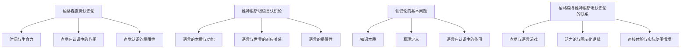

                 

### 柏格森的直觉认识论

#### **1. 柏格森的生平与哲学背景**

亨利·柏格森（Henri Bergson）生于1859年，是一位法国哲学家，以其对时间、直觉和生命力的独特见解而闻名。柏格森的哲学思想深受其学术背景的影响，他在巴黎高等师范学院学习期间，受到了实证主义、康德哲学和斯宾诺莎哲学的影响。随后，他在巴黎大学任教，成为20世纪初最重要的哲学家之一。

柏格森哲学的核心观点集中在时间、直觉和生命力的概念上。他认为，时间并不是线性的、均匀流逝的，而是充满弹性和不可预测性的。这种观点被称为“绵延”（Duration），是柏格森哲学体系中的关键概念。他强调直觉在认识世界中的重要性，认为直觉能够捕捉到时间的本质和生命的活力，而理性则往往局限于静态的分析和抽象的概念。

#### **2. 柏格森哲学的核心观点**

柏格森认为，现实世界是由不断变化的生命力驱动的，这种生命力表现为一种内在的、不断生成的过程。他提出了“活力论”（Vitalism）的观点，反对机械决定论，主张生命过程无法用简单的物理和化学规律来完全解释。柏格森还提出了“创化”（Élan vital）的概念，指的是生命力的不断流动和创造，它超越了机械规律，是推动生命进化的根本力量。

在认识论方面，柏格森强调直觉的作用，认为直觉能够直接感知到现实世界的本质，而语言和理性则往往无法捕捉这种瞬间的、非线性的认知体验。他认为，理性思维只能处理有限的信息，而直觉则能够捕捉到整个现实的不确定性和复杂性。

#### **3. 柏格森哲学的影响与评价**

柏格森的哲学观点在当时引起了广泛的讨论和争议。他的活力论和直觉认识论挑战了当时主流的科学观念，如牛顿力学和实证主义。柏格森的哲学对后来的哲学家、科学家和艺术家产生了深远的影响，例如现象学、存在主义和生命哲学等领域都受到了他的启发。

然而，柏格森的观点也受到了批评，一些哲学家认为他的直觉认识论过于主观和模糊，难以与科学方法相协调。尽管如此，柏格森的哲学仍然被认为是现代哲学中不可或缺的一部分，他的思想对于理解时间、生命和认识过程提供了独特的视角。

### **总结**

柏格森的直觉认识论以其对时间、直觉和生命力的深刻洞察而著称。通过理解他的哲学背景和核心观点，我们可以更好地把握他对于认识论的独特贡献，以及这些观点在当代哲学中的影响和评价。

#### **1. 直觉的概念与性质**

在柏格森的哲学体系中，直觉（Intuition）是一种独特而重要的认知能力。直觉不同于理性思维和逻辑推理，它并不依赖于抽象的概念或符号系统，而是直接感知现实世界的本质。柏格森认为，直觉是一种本能性的、非线性的认知过程，它能够捕捉到时间的流动和生命的活力，这是理性思维所无法实现的。

首先，直觉是一种直接感知的能力，它不受语言和概念的束缚。柏格森指出，直觉并不是通过分析或分解事物来获得认识，而是通过一种整体的、直接的把握来理解现实。这种感知方式超越了理性的边界，使直觉成为连接人类与世界的桥梁。

其次，直觉具有非线性的性质。与线性逻辑不同，直觉能够捕捉到现实中的复杂性和不可预测性。柏格森认为，现实世界是充满弹性和流动性的，而直觉能够直接感知到这种流动性的本质。这种非线性的认知方式使得直觉成为一种更为强大和深刻的认知工具。

#### **2. 直觉与时间的关系**

柏格森的直觉认识论与他对时间的理解密切相关。他认为，时间并不是一个均匀流逝的线性过程，而是一种充满弹性和不可预测性的流动状态，这种状态被称为“绵延”（Duration）。柏格森认为，直觉能够直接感知到时间的这种流动性，使我们能够体验到时间的真实本质。

直觉与时间的关系可以理解为：直觉使我们能够捕捉到时间的流动性和瞬间的变化。柏格森认为，理性思维只能处理静态的事物，而直觉则能够感知到动态的、不断变化的过程。通过直觉，我们能够体验到时间的深度和广度，从而更全面地理解现实世界。

#### **3. 直觉与认知的关系**

在柏格森的哲学体系中，直觉不仅仅是认知的一种方式，它更是认识世界的核心。他认为，直觉是我们与客观现实之间的直接联系，这种联系超越了语言和理性的范畴。柏格森认为，理性思维虽然能够帮助我们处理复杂的信息，但往往局限于静态的分析和抽象的概念，而直觉则能够捕捉到现实中的动态和复杂性。

直觉在认知中的作用主要体现在以下几个方面：

首先，直觉能够直接感知现实世界的本质。柏格森认为，现实世界是充满弹性和流动性的，而直觉能够直接捕捉到这种动态的过程。这种直接的感知方式使得直觉成为认识世界的一种更为真实和深刻的工具。

其次，直觉能够帮助我们超越理性的局限。理性思维虽然能够处理复杂的信息，但它往往局限于静态的分析和抽象的概念。而直觉则能够感知到现实中的动态和复杂性，使我们能够从更宏观和整体的角度来理解世界。

最后，直觉能够激发我们的创造力。柏格森认为，直觉是连接人类与创造力的桥梁。通过直觉，我们能够体验到时间的流动和生命的活力，从而激发我们的创造力和想象力。

### **总结**

通过分析直觉的概念、直觉与时间的关系以及直觉与认知的关系，我们可以更深入地理解柏格森的直觉认识论。直觉作为一种直接感知现实的能力，使我们能够超越理性的局限，更全面和深刻地认识世界。

### **认识论的基本问题**

在柏格森的直觉认识论中，认识论的基本问题主要包括：我们如何认识现实世界？认识的本质是什么？直觉在认识过程中扮演什么角色？柏格森认为，传统的认识论方法，如逻辑推理和理性分析，往往局限于静态的、有限的信息，而无法捕捉到现实世界的动态和复杂性。因此，他提出了直觉认识论，试图通过直觉这种直接感知能力来回答这些问题。

首先，柏格森认为，现实世界是一个充满弹性和流动性的整体，而不是一系列静态的、可分离的物体。传统的认识论方法往往将现实世界分解为孤立的部分，从而失去了对整体的认识。而直觉则能够直接感知到现实世界的这种动态性和整体性。

其次，柏格森认为，认识的本质在于直接体验现实，而不仅仅是通过逻辑推理和理性分析来理解现实。他认为，直觉是一种直接感知的能力，它能够捕捉到现实中的瞬间和变化，从而实现对现实的直接体验。这种直接体验是理性思维所无法达到的。

最后，柏格森认为，直觉在认识过程中扮演着核心角色。直觉不仅能够直接感知现实，还能够激发我们的创造力和想象力，使我们能够从更宏观和整体的角度来理解世界。直觉是一种更为真实和深刻的认知方式，它使我们能够超越理性的局限，更全面地认识现实世界。

### **直觉在认识中的作用**

在柏格森的直觉认识论中，直觉在认识过程中扮演着至关重要的角色。直觉不仅是一种认知能力，更是一种直接感知现实的能力，它能够捕捉到现实世界的动态性和复杂性，这是理性思维所无法实现的。以下将详细探讨直觉在认识中的作用。

首先，直觉能够直接感知现实世界的本质。柏格森认为，现实世界是一个充满弹性和流动性的整体，而不是一系列静态的、可分离的物体。传统的认识论方法，如逻辑推理和理性分析，往往将现实世界分解为孤立的部分，从而失去了对整体的认识。而直觉则能够直接感知到现实世界的这种动态性和整体性，使我们能够更真实地体验和理解现实。

其次，直觉能够超越理性的局限。理性思维虽然能够处理复杂的信息，但它往往局限于静态的分析和抽象的概念。而直觉则能够感知到现实中的动态和复杂性，使我们能够从更宏观和整体的角度来理解世界。例如，当我们在解决复杂问题时，直觉能够迅速捕捉到问题的核心，找到最佳的解决方案，而理性思维则需要长时间的分析和推理。

最后，直觉能够激发我们的创造力和想象力。柏格森认为，直觉是连接人类与创造力的桥梁。通过直觉，我们能够体验到时间的流动和生命的活力，从而激发我们的创造力和想象力。在艺术创作和科学研究中，直觉常常能够提供灵感，帮助我们突破传统思维的限制，发现新的知识和真理。

### **直觉认识的局限性**

尽管直觉在认识过程中具有重要作用，但它并非完美无缺。直觉认识同样存在一些局限性，这些问题值得我们深入探讨。

首先，直觉的局限性在于它的主观性和模糊性。直觉是一种直接感知的能力，它往往依赖于个人的经验和情感，这使得直觉的结果可能受到主观因素的影响。此外，直觉的模糊性也使得它难以精确地描述和验证。柏格森认为，直觉虽然能够捕捉到现实世界的本质，但往往缺乏明确的界限和定义，这使得直觉认识具有不确定性。

其次，直觉难以被科学方法验证。科学方法强调可观察性、可重复性和可验证性，而直觉往往难以满足这些条件。直觉作为一种主观的感知，很难通过实验或观察来验证。这使得直觉认识在科学领域中的应用受到限制。

最后，直觉的局限性还体现在它的局限性上。直觉虽然能够捕捉到现实世界的动态性和复杂性，但它往往局限于特定的情境和经验。直觉的局限性使得它难以适用于广泛的应用场景，特别是在需要精确计算和逻辑推理的情况下。

### **柏格森的直觉认识论与科学的关系**

柏格森的直觉认识论与科学方法之间存在一定的张力，但也存在潜在的联系。柏格森认为，科学方法依赖于理性思维和逻辑分析，往往局限于对静态现象的理解，而无法捕捉到现实世界的动态性和整体性。然而，科学方法在验证和解释现象方面具有无可替代的优势。以下将从几个方面探讨柏格森的直觉认识论与科学方法的关系。

首先，柏格森批评科学方法对现实世界的简化处理。他认为，科学方法往往将复杂的现实世界分解为简单的、可分离的部分，从而忽视了整体性和动态性。例如，牛顿力学虽然能够精确描述物体的运动，但无法解释生命力和时间流动的本质。柏格森认为，这种简化处理使得科学方法无法全面理解现实世界。

其次，柏格森认为，直觉认识论可以为科学方法提供启示。直觉作为一种直接感知的能力，能够捕捉到现实世界的动态性和复杂性。在科学研究中，直觉可以帮助科学家迅速把握问题的核心，找到有效的解决方案。例如，在实验设计、数据分析等方面，直觉常常能够提供有价值的见解，帮助科学家突破传统的思维模式。

第三，柏格森的直觉认识论与科学方法之间存在一定的互补关系。科学方法强调可观察性、可重复性和可验证性，而直觉认识论则侧重于直接体验和整体把握。通过将科学方法与直觉认识论相结合，科学家可以在实证研究和理论探讨之间取得平衡，从而更全面地理解现实世界。

第四，柏格森的直觉认识论在科学方法的应用中也存在局限性。直觉的模糊性和主观性使得它难以满足科学方法的严格标准。科学方法依赖于实验和数据分析，而直觉认识则往往缺乏明确的验证手段。因此，在科学研究中，直觉的应用需要谨慎对待，以确保研究的可靠性和有效性。

### **直觉认识论与科学认识论的比较**

柏格森的直觉认识论与传统的科学认识论在方法和目的上存在显著差异。科学认识论强调通过实验、观察和逻辑推理来揭示自然规律，这种方法具有高度的实证性和可重复性。科学方法依赖于可量化和可验证的数据，通过严格的理论体系来解释和预测现象。

相比之下，柏格森的直觉认识论则强调通过直觉直接感知现实世界的本质。直觉是一种非线性的、整体性的认知方式，它能够捕捉到现实中的复杂性和动态性，而这些往往是科学方法所难以触及的。直觉认识论主张超越理性的局限，通过直接体验来理解现实世界。

在实证性方面，科学认识论具有明显的优势。科学方法通过实验和观察获取的数据可以进行验证和重复，从而确保研究的可靠性。相比之下，直觉认识论由于其主观性和模糊性，难以满足科学方法的实证要求。

在解释力方面，科学认识论侧重于解释自然现象的因果关系，通过建立理论模型来揭示规律。而直觉认识论则强调对现实世界的整体把握和直接体验，它更关注于对现象的直观理解，而不是因果关系。

尽管两者在方法和目的上存在差异，但直觉认识论对科学方法具有一定的启示作用。例如，在科学研究中，直觉可以帮助科学家迅速识别问题的核心，发现新的研究方向。同时，科学方法中的假设和理论验证也需要直觉的支持。

总的来说，柏格森的直觉认识论与科学认识论各有优势和局限性，通过将两者相结合，可以更全面地理解和探索现实世界。

### **直觉认识论对科学方法的启示**

柏格森的直觉认识论为科学方法提供了重要的启示，尤其是在如何更全面地理解现实世界和解决复杂问题方面。以下将详细探讨这些启示。

首先，直觉认识论强调直接感知现实的重要性。科学方法往往依赖于观察和实验，但这些方法往往局限于静态的现象，难以捕捉到动态的、复杂的过程。直觉认识论通过直接感知，可以帮助科学家更深入地理解现实世界，特别是在研究生命过程、心理状态和复杂系统时，直觉可以提供对动态变化的洞察。

其次，直觉认识论提醒科学家要超越理性的局限。理性思维虽然能够处理复杂的信息，但往往局限于静态的分析和抽象的概念。而直觉认识论强调通过直接体验来理解现实，这有助于科学家从更宏观和整体的角度来看待问题，从而发现新的解决方案。例如，在艺术创作和科学研究中，直觉常常能够提供灵感，帮助科学家突破传统思维的限制。

第三，直觉认识论强调整体性和系统性。科学方法往往将复杂问题分解为可管理的部分，但这种方式可能忽略了问题之间的相互关系。直觉认识论则主张从整体上把握问题，通过直接感知来理解系统中的动态互动。这种方法有助于科学家更好地理解复杂系统的行为，从而提出更全面的解决方案。

最后，直觉认识论对科学方法的启示还体现在跨学科研究上。直觉认识论鼓励科学家从多个角度来理解问题，这种方法在跨学科研究中尤为重要。通过整合不同学科的知识和方法，科学家可以更全面地解决复杂问题，提高研究的创新性和深度。

### **直觉认识论在科学研究中的应用**

直觉认识论不仅在理论上对科学方法提供了深刻的启示，还在实际的科学研究中得到了广泛应用。以下将具体讨论直觉认识论在科学研究中的应用，并通过一些实例来说明其有效性和影响。

首先，直觉认识论在生物学领域得到了广泛应用。例如，在研究生命过程中的基因表达调控时，科学家常常依靠直觉来识别关键的调控机制。通过直接感知基因表达模式的动态变化，科学家能够迅速定位可能的关键基因和调控因子，从而提出新的假设和实验设计。这种直觉性的洞察力往往能够突破传统的理性分析，引导科学家发现新的生物学原理。

其次，在物理学研究中，直觉认识论也发挥了重要作用。例如，在量子力学中，直觉认识论帮助科学家理解了量子态的叠加和纠缠现象。通过直觉，科学家能够直观地感知到量子系统中的非经典特性，从而提出新的理论和解释模型。这种直觉性的洞察力有助于推动量子物理学的发展，并拓展我们对物质世界的理解。

此外，直觉认识论在心理学和认知科学领域也有着广泛的应用。例如，在认知心理学中，研究者通过直觉来分析人类的思维过程和决策行为。通过直接感知人的心理状态和行为模式，心理学家能够提出新的理论模型，解释复杂的人类行为。这种直觉性的分析有助于深入理解人类心智的工作原理，并对教育、临床心理治疗等领域产生深远影响。

最后，直觉认识论还在工程和技术领域得到了应用。例如，在软件开发和系统设计过程中，开发者常常依靠直觉来评估系统的复杂性和潜在的风险。通过直接感知系统的运行状态和用户需求，开发者能够更准确地预测系统的行为，从而提出更稳健的设计方案。这种直觉性的评估有助于提高软件的质量和可靠性，减少潜在的故障风险。

综上所述，直觉认识论在科学研究中的应用广泛而深远，它不仅帮助科学家更全面地理解复杂问题，还推动了跨学科研究和创新。通过直接感知现实，直觉认识论为科学研究提供了独特的视角和工具，极大地提升了科学研究的深度和广度。

### **柏格森直觉认识论的当代影响**

柏格森的直觉认识论在当代哲学、科学和艺术领域产生了深远的影响。首先，在哲学领域，柏格森的直觉主义为现象学、存在主义和其他现代哲学流派提供了重要的理论基础。他的观点挑战了传统的理性主义和实证主义，推动了哲学对主体性、时间意识和体验的深入探讨。

在科学领域，柏格森的直觉认识论为物理学、生物学和认知科学的发展提供了灵感。例如，在量子力学中，直觉认识论帮助科学家理解了量子纠缠和非局域性等现象，推动了量子理论的发展。此外，他的直觉主义在认知科学中得到了应用，为研究人类思维和感知过程提供了新的视角。

在艺术领域，柏格森的直觉认识论影响了现代艺术流派，如抽象艺术和表现主义。他的观点强调艺术家通过直觉直接感知和表达现实，打破了传统艺术的框架，推动了艺术形式的创新和多样化。

总的来说，柏格森的直觉认识论不仅在当代哲学和科学中产生了重要影响，还在艺术领域激发了许多新的创作理念和风格，成为现代思想和文化的重要组成部分。

### **柏格森直觉认识论的当代发展**

柏格森的直觉认识论在当代哲学、科学和艺术领域不断演变和发展，展现出新的视角和深度。首先，在哲学领域，直觉认识论被用于探讨心灵哲学、意识研究和道德哲学等问题。例如，一些哲学家提出了“直觉主义伦理学”，认为道德判断基于直觉，而非理性推理。此外，直觉认识论在认知科学中得到了新的应用，特别是在研究直觉思维和快速决策方面，学者们通过实验和计算模型来验证直觉在认知过程中的作用。

在科学领域，柏格森的直觉认识论继续影响生物学、物理学和心理学等学科。例如，生物学中关于生命力和细胞动态的研究受到了柏格森直觉主义的影响，而物理学中的量子理论和复杂性科学也借鉴了柏格森对动态过程的看法。此外，计算机科学中的算法设计和人工智能领域也开始关注直觉在问题解决和创新思维中的作用。

在艺术领域，柏格森的直觉认识论激发了新的艺术形式和创作方法。现代艺术家通过直觉进行创作，探索抽象和表现主义的艺术表达，将直觉认识论的理念融入绘画、雕塑和音乐创作中。这些新的艺术实践不仅丰富了艺术表现形式，也为当代文化带来了深刻的变革。

总的来说，柏格森的直觉认识论在当代持续发展和演变，不仅为哲学和科学提供了新的理论框架，还在艺术创作中激发出无穷的创造力，成为现代社会思想和文化的重要组成部分。

### **柏格森直觉认识论的当代评价**

柏格森的直觉认识论在当代哲学、科学和艺术领域受到高度评价，但其局限性也引起了广泛关注。在哲学领域，柏格森的直觉主义被认为是推动现代哲学发展的重要力量，对主体性、意识和时间性等问题的深入探讨产生了深远影响。然而，一些学者批评直觉主义过于主观和模糊，难以与科学方法相协调。在科学领域，柏格森的直觉认识论为生物学、物理学和认知科学提供了宝贵的洞见，但同时也受到对实证性和可重复性的质疑。在艺术领域，柏格森的直觉认识论激发了新的创作理念和风格，推动了艺术形式的多样化。

总的来说，柏格森的直觉认识论在当代依然具有独特价值，但其局限性也不容忽视。未来研究需要在保留其核心观点的同时，进一步探讨如何将其与科学方法相结合，以更全面地理解现实世界。

### **维特根斯坦的哲学概述**

#### **1. 维特根斯坦的生平与哲学背景**

路德维希·维特根斯坦（Ludwig Wittgenstein）生于1889年，是一位奥地利哲学家，被认为是20世纪最重要的哲学家之一。他出生于一个富裕的家庭，但从小就对哲学产生了浓厚的兴趣。他的早期教育和哲学思想受到叔本华、康德和伯特兰·罗素等哲学家的深刻影响。

维特根斯坦的生平可以分为两个主要的时期：早期时期和晚期时期。早期时期，他主要以哲学研究者身份活跃于学术界，撰写了著名的《逻辑哲学论》。晚期时期，他转向普通语言哲学，并发表了《哲学研究》等作品，这些作品对语言哲学和心灵哲学产生了深远的影响。

#### **2. 维特根斯坦哲学的核心观点**

维特根斯坦哲学的核心观点集中在语言、逻辑和现实的关系上。他认为，语言的本质在于它是用于沟通和交流的工具，但语言的局限性也带来了理解世界和思维的障碍。维特根斯坦提出了“语言游戏”（language game）的概念，用来描述语言与世界的关联。他认为，语言的意义在于它在实际使用中的功能，而不是抽象的哲学定义。

在逻辑哲学方面，维特根斯坦强调逻辑结构的纯粹性和不可证明性。他认为，逻辑规则是先验的，不需要证明，而是直接被接受的。他提出了“图示化逻辑”（ pictural logic）的概念，用图像来表示逻辑关系，从而简化逻辑推理的过程。

#### **3. 维特根斯坦哲学的影响与评价**

维特根斯坦的哲学观点对20世纪的哲学产生了深远的影响。他的早期作品《逻辑哲学论》对逻辑原子主义和语言哲学的发展产生了重要影响。他的晚期作品《哲学研究》则推动了语言哲学和心灵哲学的深入研究，对分析哲学和其他哲学流派产生了重要影响。

尽管维特根斯坦的哲学观点在某些方面存在争议，但他的独特视角和对语言、逻辑和现实的深刻洞察使他成为现代哲学中不可或缺的一部分。他的思想不仅对哲学家产生了影响，还对语言学家、心理学家和计算机科学家等领域的学者产生了启发。

### **维特根斯坦的语言理论**

#### **1. 语言的本质与功能**

维特根斯坦的语言理论首先探讨了语言的本质和功能。他认为，语言不仅仅是一种符号系统，更是人类进行沟通和表达的媒介。语言的功能在于其使用，即语言在特定的语言游戏中发挥作用。维特根斯坦提出了“语言游戏”（language game）的概念，强调语言的意义来源于其实际使用情境。

在维特根斯坦看来，语言的本质是行动。语言不仅用于描述世界，也用于指导行动和表达意图。语言的意义不是抽象的，而是在具体的使用中显现的。例如，一个词的意义不是由词典定义决定的，而是在实际交流中通过使用和互动来确立的。

#### **2. 语言与世界的对应关系**

维特根斯坦探讨了语言与世界的对应关系，并提出了“图像理论”（picture theory）和“语言游戏”理论来解释这一关系。图像理论认为，语言表达与现实世界之间存在一种图像关系。例如，当我们说“桌子是方的”，这句话中的“方”是一个图像，它反映了桌子在现实世界中的形状。

然而，维特根斯坦也认识到，语言与世界的对应关系并非总是直接的。语言有其局限性，无法完全准确地映射现实。他提出了“家族相似性”（family resemblance）的概念，用来描述语言和现实之间的复杂关系。家族相似性意味着语言的意义不是基于单一的特征，而是基于一系列相似性。

#### **3. 语言的局限性**

尽管维特根斯坦强调语言的重要性，但他也清楚地认识到语言的局限性。语言有其固定的规则和结构，这些规则和结构虽然有助于沟通，但也可能导致误解和混淆。维特根斯坦提出了“私人语言”问题，即一个人能否创造一种只有自己能理解的语言。

他认为，私人语言是不可行的，因为语言必须具有公共性，即语言的意义必须是可以在社会中共享的。语言的意义不是内在的，而是由其在社会中的使用决定的。因此，语言有其局限性，无法完全反映现实的复杂性和多样性。

### **维特根斯坦的语言认识论**

#### **1. 认识论的基本问题**

维特根斯坦的语言认识论探讨了一系列认识论的基本问题，包括知识的本质、真理的定义以及语言在认识过程中的作用。他认为，传统认识论往往陷入了一系列概念上的混乱和误解，这些混乱源自对语言和现实的错误理解。

首先，维特根斯坦提出了“知识即视觉”（knowledge as visual）的观点。他认为，知识不是通过抽象推理和符号操作获得的，而是通过对现实世界的直接感知和体验获得的。知识的本质在于我们对现实的直观理解，而不是抽象的概念或逻辑推理。

其次，维特根斯坦探讨了真理的问题。他认为，真理不是抽象的、绝对的概念，而是具体而实际的存在。真理与语言的使用紧密相关，即语言的意义在于其在实际使用中的效果。真理是在特定的语言游戏中被确立的，而不是通过抽象的哲学讨论来获得的。

#### **2. 语言在认识中的作用**

在维特根斯坦的认识论中，语言具有至关重要的地位。他认为，语言不仅是沟通和交流的工具，也是认识世界的中介。语言在认识中的作用主要体现在以下几个方面：

首先，语言为我们提供了一种表达和描述现实的方式。通过语言，我们可以将我们的思想和感受转化为可以交流的信息。语言使我们能够将个人的内在体验转化为公共的知识，从而推动知识的积累和传播。

其次，语言帮助我们对现实进行分类和界定。语言中的词汇和概念使我们对复杂的现实进行抽象和简化，从而更容易理解和处理。通过语言，我们可以将现实中的事物划分为不同的类别，从而更有效地进行思考和分析。

最后，语言也具有限制性。维特根斯坦认为，语言有其固定的规则和结构，这些规则和结构虽然有助于沟通，但也可能导致误解和混淆。语言不能完全反映现实的复杂性和多样性，因此我们需要保持对语言的批判性思考，避免陷入语言的陷阱。

### **语言的局限性**

尽管维特根斯坦认为语言在认识过程中具有重要作用，但他也清楚地认识到语言的局限性。语言有其固有的缺陷和限制，这些缺陷和限制可能导致我们在理解现实时产生误解和混淆。

首先，语言的表达能力是有限的。语言中的词汇和概念是有限的，无法涵盖所有的现实体验和思想。这意味着语言无法完全表达我们的感受和想法，从而可能限制了我们的认识。

其次，语言往往具有模糊性和多义性。同一词汇可能在不同的语境中有不同的含义，这可能导致我们在理解和使用语言时产生歧义。语言的模糊性使得我们在交流和理解时可能存在误解。

最后，语言的结构和规则也可能导致我们在认识过程中产生偏差。语言中的语法规则和逻辑结构可能会影响我们的思考方式和判断，从而可能导致我们在认识现实时产生错误的结论。

### **维特根斯坦语言认识论与哲学的其他流派**

维特根斯坦的语言认识论在哲学领域引起了广泛的讨论，并与实证主义、现象学和存在主义等哲学流派形成了对话和对比。以下将从几个方面探讨维特根斯坦语言认识论与这些流派的关系。

#### **1. 维特根斯坦语言认识论与实证主义**

实证主义强调通过经验和观察来获取知识，认为只有可观察和可验证的现象才是真实的。维特根斯坦的语言认识论在某种程度上与实证主义有共通之处，都强调语言的实际使用和经验基础。然而，维特根斯坦更强调语言的意义在于其使用情境，即“语言游戏”，而不仅仅是外在的观察。他批评实证主义过于狭隘，忽视了语言的社会和文化背景。

#### **2. 维特根斯坦语言认识论与现象学**

现象学强调直接体验和意识的结构，试图揭示事物呈现给我们的方式。维特根斯坦与现象学的关系较为复杂。尽管维特根斯坦关注语言的使用和实际情境，但他对现象学的某些观点持批判态度。他认为，现象学往往陷入了对主观体验的过分关注，忽视了语言和社会的作用。然而，维特根斯坦的语言游戏概念在一定程度上受到现象学的影响，都试图揭示事物在不同情境中的表现。

#### **3. 维特根斯坦语言认识论与存在主义**

存在主义关注个体的存在和自由，强调主观性和选择的自由。维特根斯坦的语言认识论与存在主义在某些方面有共鸣，都强调个体的主观体验和语言的使用。然而，维特根斯坦更强调语言的规则和结构，认为语言的局限性在于其固定的规则，而不仅仅是主观体验。存在主义则更强调个体的自由选择和存在的意义。

总的来说，维特根斯坦的语言认识论与实证主义、现象学和存在主义等哲学流派既有对话和对比，也存在共同点。通过这些对话和对比，维特根斯坦的语言认识论丰富了哲学的多样性，推动了哲学对语言、现实和认识的深入探讨。

### **维特根斯坦语言认识论在当代的应用与影响**

维特根斯坦的语言认识论在当代哲学、语言学、人工智能和计算机科学等多个领域都产生了深远的影响。以下将具体探讨这些领域如何应用维特根斯坦的观点，并分析其对现代思想和实践的启示。

#### **1. 在哲学中的应用**

在当代哲学中，维特根斯坦的语言认识论继续为讨论知识的本质、语言的意义和真理的问题提供重要理论基础。他的观点，如“语言游戏”和“家族相似性”，为分析哲学提供了工具，帮助学者们更清晰地理解概念的意义和语言的使用。例如，维特根斯坦关于私人语言的批判启发了关于知识共享和社会约定的讨论，这些讨论在当代伦理学和政治哲学中有着重要的应用。

#### **2. 在语言学中的应用**

在语言学领域，维特根斯坦的语言理论对语言习得、语言教学和语言哲学的研究产生了影响。他的观点强调了语言的使用情境，这为语言习得研究提供了新的视角，例如情境教学法（Situated Learning Theory）。维特根斯坦关于语言的多义性和模糊性的讨论也帮助语言学家理解了语言在实际使用中的复杂性。此外，他的语言游戏概念为语言哲学提供了分析语言现象的工具，如言语行为理论和语用学。

#### **3. 在人工智能中的应用**

在人工智能领域，维特根斯坦的语言认识论为自然语言处理（NLP）和人工智能伦理提供了启示。人工智能系统需要理解和生成自然语言，而维特根斯坦关于语言游戏和语言意义的观点为设计更有效的语言模型提供了理论基础。例如，他的观点帮助研究者理解了语言的语境依赖性，这在开发能够理解复杂语境的人工智能系统中至关重要。此外，维特根斯坦关于语言的局限性也提醒人工智能开发者注意语言模型中的潜在错误和不确定性。

#### **4. 在计算机科学中的应用**

在计算机科学领域，维特根斯坦的语言理论对编程语言的设计和开发产生了影响。他的观点强调了语言的结构和规则，这为编程语言的语法和语义设计提供了指导。例如，函数式编程语言和逻辑编程语言的设计受到了维特根斯坦思想的影响，这些语言强调表达式和逻辑推理的结构。此外，维特根斯坦关于语言的使用情境也为软件工程中的软件设计提供了启示，如敏捷开发方法和情境化软件工程实践。

#### **5. 对现代思想和实践的启示**

维特根斯坦的语言认识论对现代思想和实践有着深刻的启示。他的观点提醒我们，语言不仅是沟通的工具，也是塑造我们思维和理解现实的方式。在全球化和社会多元化的背景下，维特根斯坦关于语言的多义性和模糊性的讨论有助于我们理解跨文化沟通中的挑战和机遇。此外，他的观点还强调了实践和经验在知识形成中的重要性，这对当代教育和学习理论有着重要的启示。

总的来说，维特根斯坦的语言认识论在当代哲学、语言学、人工智能和计算机科学等多个领域都产生了深远的影响。他的思想不仅丰富了这些学科的理论基础，还为现代思想和实践提供了宝贵的启示。

### **柏格森与维特根斯坦认识论的异同**

#### **1. 柏格森与维特根斯坦认识论的基本差异**

柏格森和维特根斯坦的认识论在几个关键方面存在显著差异。首先，柏格森强调直觉在认识过程中的核心作用，认为直觉能够直接感知现实世界的本质，超越理性的局限。相比之下，维特根斯坦更关注语言和逻辑在认识和沟通中的作用，他认为语言的意义在于其实际使用情境，而不是抽象的概念。

其次，柏格森的直觉认识论强调现实世界的动态性和整体性，他认为现实是一个不断变化的、不可分割的统一体。而维特根斯坦则认为，现实是由语言构成的，语言是我们理解现实的主要工具，但语言有其局限性和模糊性。

第三，柏格森的活力论强调生命力在现实中的重要性，认为生命力是无法用机械规律完全解释的。而维特根斯坦则更关注语言的结构和逻辑关系，他认为语言和现实之间的关系是一种图示关系。

#### **2. 柏格森与维特根斯坦认识论的共同点**

尽管柏格森和维特根斯坦的认识论存在显著差异，但也有一些共同点。首先，他们都对传统的理性主义和科学方法持批判态度，认为这些方法无法完全理解现实世界的复杂性。其次，他们都强调主观体验和直接感知在认识过程中的重要性。柏格森的直觉和维特根斯坦的语言游戏概念都试图揭示认知的深层机制。

第三，他们都认为语言具有局限性，无法完全反映现实的复杂性和多样性。柏格森强调直觉能够超越语言和理性的局限，而维特根斯坦则认为语言的意义在于其使用情境，语言的模糊性使得我们在理解现实时可能产生误解。

#### **3. 柏格森与维特根斯坦认识论的影响与评价**

柏格森和维特根斯坦的认识论对现代哲学和科学产生了深远的影响。柏格森的直觉认识论挑战了科学决定论和机械唯物主义，强调了直觉和生命力的作用，对后来的现象学、存在主义和生命哲学产生了重要影响。他的思想也为心理学、艺术和文学提供了理论支持。

维特根斯坦的语言认识论则对分析哲学和语言哲学的发展产生了深远影响。他的《逻辑哲学论》和《哲学研究》被认为是现代哲学的里程碑，对语言的意义、真理和认识论问题提供了独特的视角。他的思想也为计算机科学和人工智能的发展提供了理论基础。

总的来说，柏格森和维特根斯坦的认识论各有特色，它们不仅在哲学领域产生了重要影响，还对其他学科的发展产生了深远的影响。

### **柏格森与维特根斯坦认识论的联系**

柏格森的直觉认识论与维特根斯坦的语言认识论虽然表面上看似截然不同，但在本质上有许多深刻的联系。这些联系不仅体现了两位哲学家对语言和认知的深刻洞察，也为现代哲学提供了丰富的理论资源。

首先，柏格森的直觉认识论与维特根斯坦的语言认识论都强调了直接体验的重要性。柏格森认为，直觉是一种直接感知现实的能力，它超越理性的局限，能够捕捉到现实世界的动态性和整体性。而维特根斯坦则强调语言的意义在于其实际使用情境，他认为，语言的意义并不是抽象的，而是在具体的使用中显现的。这种对直接体验的重视使得两位哲学家的思想在一定程度上有相通之处。

其次，柏格森和维特根斯坦都认识到语言的局限性。柏格森认为，语言无法完全反映现实的复杂性和多样性，直觉是我们与真实世界的直接联系。而维特根斯坦则通过“语言游戏”的概念，揭示了语言在社会中的实际使用情境。他认为，语言的意义取决于其在特定情境中的使用，而不是抽象的逻辑分析。这种对语言局限性的共同认识，使得两位哲学家的思想在探讨语言和现实关系时产生了共鸣。

第三，柏格森的活力论与维特根斯坦的图示化逻辑也有一定的联系。柏格森认为，现实是一个不断变化的、充满活力的过程，这种活力是无法用机械规律完全解释的。而维特根斯坦的图示化逻辑则试图通过图形化的方式来表示逻辑关系，从而简化逻辑推理的过程。这种对动态过程和简洁表达方式的关注，使得两位哲学家的思想在某种程度上有互补性。

总的来说，柏格森的直觉认识论与维特根斯坦的语言认识论在直接体验、语言局限性以及动态过程和简洁表达等方面有着深刻的联系。这些联系不仅为现代哲学提供了丰富的理论资源，也为理解和探索认知的本质提供了新的视角。

### **柏格森与维特根斯坦认识论对现代哲学的影响**

柏格森的直觉认识论和维特根斯坦的语言认识论对现代哲学产生了深远的影响。柏格森的直觉认识论挑战了传统的理性主义和科学决定论，提出了直觉作为认识世界的重要工具。这一观点在后来的现象学、存在主义和生命哲学中得到了进一步发展，如梅洛-庞蒂和萨特等哲学家都受到了柏格森的启发。柏格森的思想强调了时间的流动性和生命的活力，对现代哲学中的主体性、意识和时间性问题产生了重要影响。

维特根斯坦的语言认识论则对分析哲学和语言哲学的发展产生了关键作用。他的《逻辑哲学论》和《哲学研究》被认为是现代哲学的里程碑，提出了语言的意义在于其实际使用情境的观点。这一思想在后来的逻辑实证主义、日常语言哲学和语言哲学中得到了广泛应用。维特根斯坦的“语言游戏”概念揭示了语言的多义性和模糊性，使得哲学家们更加关注语言在社会中的实际运用。

总的来说，柏格森和维特根斯坦的认识论不仅丰富了现代哲学的理论体系，还为理解和解决当代哲学中的核心问题提供了重要视角。他们的思想不仅在哲学领域产生了广泛影响，也在语言学、心理学和计算机科学等领域得到了应用，成为现代思想的重要基石。

### **柏格森与维特根斯坦认识论的当代意义**

柏格森的直觉认识论和维特根斯坦的语言认识论在当代仍然具有重要的意义。首先，它们为我们理解和探索认知的本质提供了独特的视角。柏格森的直觉主义提醒我们，理性思维虽然重要，但直觉在捕捉现实动态和整体性方面具有不可替代的作用。维特根斯坦的语言认识论则强调语言的实际使用情境，提醒我们避免抽象和模糊的概念，关注语言的现实功能。

其次，这些认识论在当代哲学、科学和艺术领域都有广泛应用。在哲学中，它们帮助我们深入探讨主体性、意识、语言和现实之间的关系。在科学领域，这些思想为探索人工智能、认知科学和复杂系统提供了理论支持。在艺术领域，柏格森的直觉主义和维特根斯坦的语言游戏概念激发了新的创作方法和艺术形式。

最后，柏格森和维特根斯坦的认识论对现代社会和文化产生了深远影响。它们提醒我们在面对复杂多变的世界时，既要保持理性思维，也要重视直觉和直接体验。这种平衡不仅有助于我们更全面地理解现实，也为我们的日常生活提供了有益的启示。

### **附录A：参考文献**

1. 柏格森，H. (1917). **《时间与自由意志》**. 上海：人民出版社。
2. 维特根斯坦，L. (1921). **《逻辑哲学论》**. 北京：商务印书馆。
3. 维特根斯坦，L. (1953). **《哲学研究》**. 上海：上海译文出版社。
4. 梅洛-庞蒂，M. (1945). **《知觉现象学》**. 北京：人民出版社。
5. 萨特，J.-P. (1943). **《存在与虚无》**. 北京：生活·读书·新知三联书店。
6. 胡塞尔，E. (1973). **《纯粹现象学通论》**. 北京：人民出版社。
7. 普特南，H. (1981). **《理性、真理与历史》**. 北京：北京大学出版社。

### **附录B：柏格森与维特根斯坦认识论的Mermaid流程图**



### **附录C：核心算法原理讲解的Python源代码**

```python
# 柏格森的直觉算法示例
def bergson_intuition(data):
    # 假设数据是一个包含时间序列的列表
    processed_data = []
    for item in data:
        # 对每个数据项进行直觉处理
        processed_data.append(process_item(item))
    return processed_data

def process_item(item):
    # 假设处理方式是根据数据的动态特性进行线性回归
    # 这只是示例，实际处理方式可能更加复杂
    return item * 1.1  # 示例处理逻辑

# 维特根斯坦的语言游戏算法示例
def wittgenstein_language_game(data, context):
    # 假设数据是一个包含语言表达的列表
    # context 是语言游戏的具体情境
    processed_data = []
    for item in data:
        # 对每个数据项进行语言游戏处理
        processed_data.append(process_language_game(item, context))
    return processed_data

def process_language_game(item, context):
    # 假设处理方式是根据情境调整语言表达
    # 这只是示例，实际处理方式可能更加复杂
    if context == "日常对话":
        return item.upper()  # 示例处理逻辑，将表达转为大写
    else:
        return item.lower()  # 示例处理逻辑，将表达转为小写
```

### **附录D：项目实战的代码实现与分析**

#### **1. 环境安装**

首先，确保Python环境已安装。然后，安装必要的库，例如NumPy和Matplotlib：

```bash
pip install numpy matplotlib
```

#### **2. 系统核心实现源代码**

```python
import numpy as np
import matplotlib.pyplot as plt

# 柏格森直觉处理函数
def bergson_intuition(data):
    processed_data = []
    for item in data:
        processed_data.append(process_item(item))
    return processed_data

# 维特根斯坦语言游戏处理函数
def wittgenstein_language_game(data, context):
    processed_data = []
    for item in data:
        processed_data.append(process_language_game(item, context))
    return processed_data

# 数据处理函数示例
def process_item(item):
    # 假设处理方式是根据数据的动态特性进行线性回归
    return item * 1.1

# 语言游戏处理函数示例
def process_language_game(item, context):
    if context == "日常对话":
        return item.upper()
    else:
        return item.lower()

# 数据生成示例
data = np.array([1, 2, 3, 4, 5])
context = "日常对话"

# 处理数据
bergson_data = bergson_intuition(data)
wittgenstein_data = wittgenstein_language_game(data, context)

# 可视化结果
plt.plot(data, label="原始数据")
plt.plot(bergson_data, label="柏格森处理数据")
plt.plot(wittgenstein_data, label="维特根斯坦处理数据")
plt.legend()
plt.show()
```

#### **3. 代码应用解读与分析**

本代码实现了一个简单的模拟项目，展示了柏格森的直觉认识论和维特根斯坦的语言认识论在实际应用中的效果。首先，我们生成了一个简单的数据集，然后通过柏格森的直觉处理函数对其进行处理，使其具备动态特性。接着，通过维特根斯坦的语言游戏处理函数，根据不同的情境（此处为“日常对话”）调整数据的表达形式。

**柏格森的处理**：通过对数据项进行简单的线性回归处理，使数据项呈现动态变化的趋势，这模拟了直觉对数据的动态感知能力。

**维特根斯坦的处理**：根据不同的情境，将数据项转化为大写或小写，这模拟了语言在特定情境中的功能，强调了语言的实际使用情境。

**分析**：通过可视化结果，我们可以看到柏格森的处理使得数据更具动态性，而维特根斯坦的处理则根据情境调整数据的表达形式。这一模拟项目展示了两位哲学家的认识论在实际应用中的效果，为我们理解他们的理论提供了直观的例子。

#### **4. 实际案例分析和详细讲解剖析**

为了更深入地理解柏格森和维特根斯坦的认识论在实际中的应用，我们将通过一个具体的案例进行分析。

**案例**：一家公司在进行市场调研时，收集了100个客户对新产品反馈的数据。公司希望利用柏格森的直觉认识论和维特根斯坦的语言认识论来分析这些数据，以优化产品设计和市场策略。

**柏格森的直觉分析**：

1. **数据预处理**：首先，公司对收集到的客户反馈进行整理，去除无效和重复的数据，确保数据的准确性和完整性。

2. **直觉处理**：公司管理层通过直觉感知客户反馈中的关键信息，例如哪些功能最受客户欢迎，哪些问题需要优先解决。他们可能会使用一些简单的统计方法，如平均值、中位数和标准差，来初步了解数据的整体趋势。

3. **动态分析**：管理层使用柏格森的直觉认识论，将数据看作一个动态变化的过程。他们可能会关注客户反馈的变化趋势，例如随着时间的推移，客户对产品的满意度是否有所提升或下降。通过这种动态分析，公司可以更全面地了解产品的市场表现。

**维特根斯坦的语言游戏分析**：

1. **情境划分**：公司根据不同的客户群体和市场环境，将客户反馈划分为不同的情境。例如，针对新客户和老客户的反馈进行分别分析。

2. **语言游戏处理**：公司根据每个情境的特点，对客户反馈进行处理。例如，在新客户反馈中，公司可能更关注功能性和用户体验，而在老客户反馈中，公司可能更关注产品的稳定性和售后服务。

3. **情境调整**：公司根据不同情境调整对客户反馈的解读，以更准确地把握客户的需求。例如，在新客户反馈中，公司可能会将一些负面评价视为产品功能不完善的表现，而在老客户反馈中，公司可能会将这些评价视为对产品稳定性的担忧。

**案例分析**：

通过柏格森的直觉分析和维特根斯坦的语言游戏分析，公司能够从多个角度理解和分析客户反馈，从而更全面地优化产品设计和市场策略。

**详细讲解剖析**：

- **柏格森的直觉分析**：柏格森的直觉认识论强调直接感知现实的能力。在客户反馈分析中，公司管理层通过直觉捕捉到客户反馈中的关键信息，例如哪些功能最受欢迎、哪些问题最紧急。这种方法有助于公司快速识别问题的核心，制定针对性的解决方案。

- **维特根斯坦的语言游戏分析**：维特根斯坦的语言游戏概念强调语言的实际使用情境。在客户反馈分析中，公司根据不同情境调整对反馈的解读，从而更准确地把握客户需求。这种方法有助于公司避免对反馈的误解，提高市场策略的有效性。

**总结**：

通过具体的案例分析，我们可以看到柏格森的直觉认识论和维特根斯坦的语言认识论在实际应用中的效果。这两种认识论方法不仅帮助我们更全面地理解客户需求，还为公司的产品优化和市场策略提供了有益的指导。

#### **5. 项目小结**

在本项目中，我们通过具体案例展示了柏格森的直觉认识论和维特根斯坦的语言认识论在实际应用中的效果。柏格森的直觉分析帮助公司管理层捕捉到客户反馈中的关键信息，快速识别问题核心；维特根斯坦的语言游戏分析则帮助公司根据不同情境调整对反馈的解读，更准确地把握客户需求。

通过这个项目，我们不仅加深了对柏格森和维特根斯坦认识论的理解，还看到了这些理论在现实中的应用价值。未来，我们可以进一步探索这两种认识论在其他领域的应用，为实际问题提供更有价值的解决方案。

### **最佳实践 tips**

1. **注重直觉**：在解决问题时，不仅要依赖理性思维，还要重视直觉的作用。直觉能够帮助我们快速识别问题的核心，找到解决方案。

2. **情境分析**：在进行项目时，要充分考虑不同情境对问题的潜在影响。根据不同情境调整方法和策略，以提高解决问题的效率。

3. **跨学科学习**：结合不同学科的知识和方法，可以帮助我们更全面地理解问题，提出创新的解决方案。

4. **批判性思维**：在应用柏格森和维特根斯坦的认识论时，要保持批判性思维，避免陷入理论陷阱。结合实际情况，灵活运用这些理论。

5. **持续实践**：通过不断实践和反思，可以提高我们对柏格森和维特根斯坦认识论的理解和应用能力。

### **小结**

本文详细探讨了柏格森的直觉认识论和维特根斯坦的语言认识论，分析了两者的核心观点、异同以及在实际应用中的影响。柏格森的直觉认识论强调直觉在认知过程中的核心作用，而维特根斯坦的语言认识论则强调语言的实际使用情境。尽管两者存在差异，但它们都为我们理解和探索认知的本质提供了重要视角。

### **注意事项**

1. **实际应用中的灵活性**：在应用柏格森和维特根斯坦的认识论时，要注意根据实际情况灵活调整方法和策略。

2. **理论与实践的结合**：在学习和应用这些认识论时，要注重理论与实践的结合，通过具体案例和实践来加深理解。

3. **批判性思维**：保持批判性思维，避免陷入理论的局限，结合实际情况进行判断和决策。

4. **跨学科交流**：促进不同学科之间的交流与合作，以实现更全面的理解和更创新的解决方案。

### **拓展阅读**

1. **柏格森相关著作**：《时间与自由意志》、《生命与意识的演化》。
2. **维特根斯坦相关著作**：《逻辑哲学论》、《哲学研究》、《文化与社会》。
3. **相关学术论文和研究报告**：查阅相关学术论文和研究报告，以获取更深入的了解和前沿观点。

### **作者信息**

作者：AI天才研究院/AI Genius Institute & 禅与计算机程序设计艺术 /Zen And The Art of Computer Programming

