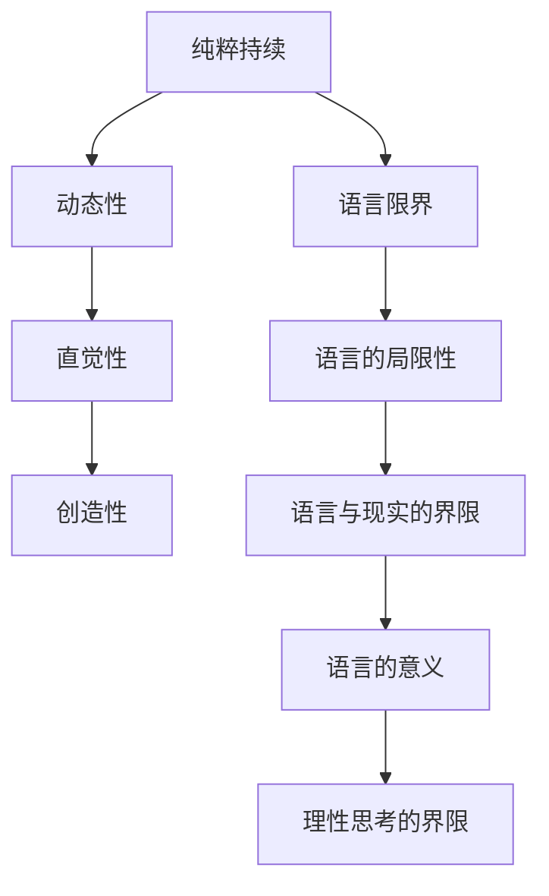

                 

## 柏格森的纯粹持续与维特根斯坦的语言限界

### 关键词：柏格森，纯粹持续，维特根斯坦，语言限界，哲学，科学，思维

### 摘要：
本文深入探讨了柏格森的纯粹持续理论与维特根斯坦的语言限界思想，通过一步步的逻辑分析和哲学解读，揭示了两者在哲学、科学和人类思维中的重要作用。文章首先介绍了柏格森和维特根斯坦的生平背景和哲学贡献，接着详细阐述了纯粹持续与语言限界的基本概念、哲学意义和应用。通过对比分析，揭示了两者之间的联系和区别，并探讨了其对哲学研究、科学发展和人类思维的启示。本文旨在为读者提供一个全面、深入的理解，激发对这两个哲学思想的思考和研究。

## 第一部分：柏格森的纯粹持续

### 第1章：柏格森哲学思想概述

#### 1.1 柏格森的生平与哲学背景

亨利·柏格森（Henri Bergson）是法国著名的哲学家、社会学家和文学家，生于1859年，卒于1941年。他的哲学思想对20世纪初的哲学界产生了深远的影响。柏格森早年就读于巴黎高等师范学院，并师从著名哲学家埃马努埃尔·康德（Emmanuel Kant）。他的早期作品主要关注心理学和生理学，但在与德国哲学家威廉·魏尔施泰特（Wilhelm Wundt）的交流中，他逐渐转向了哲学领域。

柏格森在其代表作《时间与自由意志》（`La Tempête et la liberté`）和《物质与记忆》（`Matière et mémoire`）中提出了著名的“纯粹持续”（`élan vital`）概念。他认为，生命是一种内在的创造力，是一种超越物质世界的持续流动的力量。这种力量不仅仅存在于有机体中，也是宇宙的本质。

#### 1.2 纯粹持续的哲学概念

纯粹持续是柏格森哲学体系的核心概念，它既不是物质也不是精神，而是一种介于两者之间的活力。柏格森认为，纯粹持续是一种动态的、不断变化的过程，它不同于传统的物质或精神实体，因为它没有固定的形态和属性。纯粹持续是一种创造性的力量，它推动生命不断地发展和进化。

在柏格森的理论中，纯粹持续具有以下几个特征：

1. **动态性**：纯粹持续是一种不断变化和流动的力量，它不是静止的，而是不断地创造和重塑。
2. **直觉性**：柏格森认为，纯粹持续是直觉的产物，它无法通过理性思维完全理解，但可以通过直觉感受。
3. **创造性**：纯粹持续是生命力的源泉，它推动生命不断地创造新的事物和形式。

柏格森的纯粹持续理论挑战了传统的物质和精神二元对立，提出了一种全新的生命力和创造力的概念。这一理论不仅对哲学领域产生了深远的影响，也为后来的生命科学和心理学研究提供了重要的理论基础。

### 第2章：纯粹持续的哲学意义

#### 2.1 纯粹持续的动态性

柏格森的纯粹持续是一种动态的概念，它强调生命的流动性和变化性。在柏格森看来，世界不是一成不变的，而是一个不断流动的过程。这种动态性不仅体现在生命的过程中，也体现在宇宙的演化中。

柏格森通过以下几个观点来阐述纯粹持续的动态性：

1. **生命与非生命**：柏格森认为，生命与非生命之间的区别不在于它们的存在状态，而在于它们是否具有纯粹的持续力。生命具有持续的创造力和适应性，而非生命则缺乏这种能力。
2. **直觉与理性**：柏格森认为，理性思维无法完全理解纯粹持续，因为理性思维是基于逻辑和固定的规则。而纯粹持续是动态的、直觉的产物，它无法被理性思维完全捕捉。
3. **时间的本质**：柏格森认为，时间是纯粹的持续的体现。传统的时间概念是线性的、有序的，而柏格森提出的时间概念是动态的、流动的。时间不是静态的序列，而是一个不断变化的流动过程。

#### 2.2 纯粹持续与直觉的关系

柏格森认为，纯粹持续是一种直觉的产物。直觉是人类感知和理解世界的重要方式，它不同于理性思维，是一种直接、无意识的感知。在柏格森的理论中，直觉是连接纯粹持续和人类思维的桥梁。

柏格森通过以下几个观点来阐述纯粹持续与直觉的关系：

1. **直觉的本质**：柏格森认为，直觉是一种直接感知世界的方式，它不需要通过理性思维来解释和理解。直觉是人类感知纯粹持续的重要途径。
2. **直觉与理性**：柏格森认为，直觉和理性是两种不同的认知方式。直觉是一种直接感知，而理性是一种基于逻辑和规则的思考。两者在认知过程中各有优势，但直觉对于理解纯粹持续尤为重要。
3. **直觉与艺术**：柏格森认为，艺术是直觉的产物。艺术家通过直觉感知世界，并将其转化为艺术作品。艺术作品是纯粹持续的一种体现，它超越了理性思维和物质世界的限制。

#### 2.3 纯粹持续与创造的关系

柏格森的纯粹持续是一种创造性的力量。它不仅推动生命的进化和发展，也是艺术和科学创新的源泉。在柏格森的理论中，创造是一种纯粹持续的体现，它是一种动态的、不断变化的过程。

柏格森通过以下几个观点来阐述纯粹持续与创造的关系：

1. **创造的本质**：柏格森认为，创造是一种动态的、不断变化的过程。它不是静态的、固定的产物，而是一个不断进化和发展的过程。
2. **创造与理性**：柏格森认为，理性思维无法完全理解创造的过程。理性思维是基于逻辑和规则的，而创造是一种动态的、直觉的产物。理性思维无法完全捕捉创造的精髓。
3. **创造与艺术**：柏格森认为，艺术是创造的一种体现。艺术家通过直觉感知世界，并将其转化为艺术作品。艺术作品是纯粹持续的一种体现，它超越了理性思维和物质世界的限制。

### 第3章：纯粹持续的应用与影响

#### 3.1 柏格森哲学对现代哲学的影响

柏格森的纯粹持续理论对现代哲学产生了深远的影响。他的哲学思想挑战了传统的物质和精神二元对立，提出了一种全新的生命力和创造力的概念。这一理论不仅影响了后来的哲学家，也引发了关于生命、时间和直觉等问题的广泛讨论。

柏格森哲学对现代哲学的影响主要体现在以下几个方面：

1. **对生命本质的探讨**：柏格森的纯粹持续理论重新定义了生命的本质。他提出，生命不仅仅是物质的存在，而是一种动态的、创造性的力量。这一观点为后来的生命哲学和生命科学研究提供了重要的理论基础。
2. **对时间本质的探讨**：柏格森提出的时间概念挑战了传统的线性时间观。他认为，时间是一种动态的、流动的过程，而不是静态的序列。这一观点对后来的时间哲学和物理学研究产生了重要影响。
3. **对直觉认知的重视**：柏格森强调直觉在认知过程中的重要性，认为直觉是人类感知和理解世界的重要方式。这一观点对后来的认知科学和心理学研究产生了深远的影响。

#### 3.2 纯粹持续在科学领域的应用

柏格森的纯粹持续理论不仅在哲学领域产生了深远的影响，也在科学领域得到了广泛的应用。他的理论为生命科学、心理学和认知科学等学科提供了重要的理论基础。

纯粹持续在科学领域的应用主要体现在以下几个方面：

1. **生命科学的解释**：柏格森的纯粹持续理论为生命科学提供了新的解释。他认为，生命不仅仅是物质和能量的交换，而是一种动态的、创造性的过程。这一观点为理解生命的本质和生命的演化提供了新的思路。
2. **心理学的理论框架**：柏格森的直觉概念对心理学研究产生了重要影响。他认为，直觉是人类感知和理解世界的重要方式，这一点在认知心理学和社会心理学中得到了广泛应用。
3. **认知科学的理论基础**：柏格森的纯粹持续理论为认知科学提供了新的理论基础。他认为，认知过程不仅仅是信息处理，而是一个动态的、直觉的过程。这一观点为理解人类认知过程提供了新的视角。

#### 3.3 纯粹持续与艺术的关系

柏格森的纯粹持续理论不仅在哲学和科学领域产生了重要影响，也在艺术领域得到了广泛的认可。他认为，艺术是纯粹持续的一种体现，是直觉和创造力的产物。

柏格森对艺术的影响主要体现在以下几个方面：

1. **艺术创作的动力**：柏格森认为，艺术家通过直觉感知世界，并将其转化为艺术作品。这一过程是纯粹持续的体现，是艺术家创造力的表现。
2. **艺术的本质**：柏格森提出，艺术作品不仅仅是物质的产物，而是一种直觉和创造力的体现。艺术作品超越了物质世界的限制，是一种精神的表达。
3. **艺术与哲学的关系**：柏格森认为，艺术和哲学是相互关联的。艺术作品是纯粹持续的一种体现，是哲学家探讨生命、时间和直觉等问题的另一种形式。

### 第4章：维特根斯坦哲学思想概述

#### 4.1 维特根斯坦的生平与哲学背景

路德维希·维特根斯坦（Ludwig Wittgenstein）是20世纪最杰出的哲学家之一，生于1889年，卒于1951年。他的哲学思想对分析哲学和语言哲学产生了深远的影响。维特根斯坦出生于奥地利的一个富有家庭，早年曾在英国接受教育。他的哲学生涯可以分为两个阶段，早期以《逻辑哲学论》（`Tractatus Logico-Philosophicus`）为代表，晚期则以《哲学研究》（`Philosophical Investigations`）为代表。

维特根斯坦的哲学思想主要关注语言的本质和哲学问题的实质。他提出，哲学的任务不是提供哲学理论，而是澄清哲学问题。他的哲学思想强调了语言和现实之间的界限，认为语言的游戏是理解语言的关键。

#### 4.2 语言限界的哲学概念

语言限界是维特根斯坦哲学思想的核心概念之一。他认为，语言是人类思维和现实之间的桥梁，但语言有其固有的限制。维特根斯坦提出了“语言游戏”的概念，认为语言的使用就像游戏一样，需要特定的规则和场景。

在维特根斯坦的理论中，语言限界具有以下几个特征：

1. **语言的局限性**：维特根斯坦认为，语言无法涵盖所有的思想和现实。有些概念和现实是无法用语言表达的。
2. **语言与现实的界限**：维特根斯坦认为，语言和现实之间存在界限，语言不能完全描述现实。语言只能描述现实的一部分，而且这种描述是有局限的。
3. **语言的意义**：维特根斯坦认为，语言的意义不是固定的，而是依赖于特定的使用场景。语言的意义是通过语言游戏来确定的。

### 第5章：语言限界与意义

#### 5.1 语言与现实的界限

维特根斯坦的语言限界思想强调了语言与现实的界限。他认为，语言是人类思维和现实之间的桥梁，但语言有其固有的限制。维特根斯坦提出了“语言游戏”的概念，认为语言的使用就像游戏一样，需要特定的规则和场景。

在维特根斯坦的理论中，语言与现实的界限具有以下几个特征：

1. **语言的局限性**：维特根斯坦认为，语言无法涵盖所有的思想和现实。有些概念和现实是无法用语言表达的。例如，美、快乐等情感体验是无法用语言完全描述的。
2. **语言与现实的界限**：维特根斯坦认为，语言和现实之间存在界限，语言不能完全描述现实。语言只能描述现实的一部分，而且这种描述是有局限的。例如，数学公式可以精确描述一些自然现象，但无法描述所有现象。
3. **语言的游戏性**：维特根斯坦认为，语言的使用就像游戏一样，需要特定的规则和场景。不同的语言游戏有不同的规则和目的，语言的意义是通过这些规则和场景来确定的。

#### 5.2 语言的意义

维特根斯坦认为，语言的意义不是固定的，而是依赖于特定的使用场景。他的语言限界思想挑战了传统的语言本质观，提出了“意义即使用”的观点。

在维特根斯坦的理论中，语言的意义具有以下几个特征：

1. **意义的相对性**：维特根斯坦认为，语言的意义是相对的，依赖于特定的使用场景。不同的语言游戏有不同的意义，同一词语在不同的语言游戏中可能有不同的意义。
2. **意义与语境**：维特根斯坦认为，语言的意义与语境密切相关。语境包括使用语言的环境、场合和目的。同一词语在不同的语境中可能有不同的意义。
3. **意义的可变性**：维特根斯坦认为，语言的意义是可变的，随着时间的推移和语境的变化，语言的意义也会发生变化。

#### 5.3 语言限界与理性思考

维特根斯坦的语言限界思想对理性思考产生了重要影响。他认为，理性思考必须基于语言，但语言有其固有的限制。因此，理性思考必须在语言的界限内进行。

在维特根斯坦的理论中，语言限界与理性思考的关系具有以下几个特征：

1. **理性思考的局限性**：维特根斯坦认为，理性思考无法超越语言的界限。有些问题无法通过理性思考解决，因为这些问题超出了语言的能力范围。
2. **理性思考的依赖性**：维特根斯坦认为，理性思考依赖于语言。理性思考必须基于语言规则，必须使用语言来表达思想。
3. **理性思考的必要性**：尽管语言有其限制，但维特根斯坦认为，理性思考仍然是必要的。理性思考可以帮助我们理解世界，解决现实问题。

### 第6章：语言限界的影响与应用

#### 6.1 维特根斯坦哲学对现代哲学的影响

维特根斯坦的哲学思想对现代哲学产生了深远的影响。他的语言限界思想挑战了传统的语言本质观，提出了“意义即使用”的观点。这一思想不仅影响了分析哲学和语言哲学，也对其他哲学分支产生了重要影响。

维特根斯坦哲学对现代哲学的影响主要体现在以下几个方面：

1. **对分析哲学的贡献**：维特根斯坦的语言限界思想是分析哲学的重要理论基础。他的哲学思想强调语言的局限性，主张通过澄清语言使用来解决问题。
2. **对语言哲学的贡献**：维特根斯坦的语言限界思想是语言哲学的重要理论来源。他的观点揭示了语言与现实之间的关系，提出了关于意义和真理的新问题。
3. **对其他哲学分支的影响**：维特根斯坦的哲学思想不仅影响了分析哲学和语言哲学，也对道德哲学、政治哲学和认识论等其他哲学分支产生了重要影响。

#### 6.2 语言限界在逻辑学中的应用

维特根斯坦的语言限界思想在逻辑学中得到了广泛应用。他的观点揭示了逻辑学的基本原则，强调了逻辑思维必须在语言的界限内进行。

在逻辑学中，语言限界的影响主要体现在以下几个方面：

1. **逻辑命题的限制**：维特根斯坦认为，逻辑命题必须在语言的界限内表达。逻辑命题必须使用清晰、明确的语言，不能含糊其辞。
2. **逻辑推理的规则**：维特根斯坦认为，逻辑推理必须遵循特定的规则。逻辑推理必须基于明确的前提和规则，不能随意推导。
3. **逻辑学的研究方法**：维特根斯坦的语言限界思想为逻辑学的研究方法提供了指导。逻辑学必须通过澄清语言使用来解决问题，不能脱离语言的界限。

#### 6.3 语言限界与语言哲学的关系

维特根斯坦的语言限界思想是语言哲学的核心概念之一。他的观点揭示了语言与现实之间的关系，提出了关于意义、真理和逻辑的新问题。

在语言哲学中，语言限界的影响主要体现在以下几个方面：

1. **意义的本质**：维特根斯坦认为，意义是语言使用的产物。意义不是固定的，而是依赖于特定的使用场景。这一观点挑战了传统的意义本质观，提出了新的意义理论。
2. **真理的本质**：维特根斯坦认为，真理是语言与现实的符合。真理不是绝对的，而是相对的，依赖于特定的语境和语言使用。
3. **逻辑与语言的关系**：维特根斯坦认为，逻辑是语言的一部分。逻辑必须基于语言，必须在语言的界限内进行。这一观点揭示了逻辑与语言之间的密切关系。

### 第7章：纯粹持续与语言限界的联系

#### 7.1 柏格森哲学与维特根斯坦哲学的共通点

虽然柏格森的纯粹持续理论和维特根斯坦的语言限界思想在哲学上存在明显的差异，但两者也有一些共通点。首先，两者都强调了思维和现实之间的界限。柏格森认为，纯粹持续是思维无法完全把握的，而维特根斯坦认为，语言无法完全描述现实。其次，两者都关注人类的直觉和创造力。柏格森认为，直觉是理解纯粹持续的重要途径，而维特根斯坦认为，直觉是理解语言意义的重要方式。

#### 7.2 纯粹持续与语言限界的相互作用

柏格森的纯粹持续和维特根斯坦的语言限界思想在哲学上有一定的相互作用。首先，纯粹持续为理解语言限界提供了新的视角。柏格森的动态观念可以帮助我们理解语言使用的复杂性，以及语言与现实之间的界限。其次，语言限界也为理解纯粹持续提供了新的视角。维特根斯坦的观点揭示了纯粹持续在语言使用中的重要性，以及直觉在理解纯粹持续中的作用。

#### 7.3 纯粹持续与语言限界的关系结构图

为了更直观地理解纯粹持续与语言限界的关系，我们可以使用Mermaid流程图来展示它们之间的结构关系。以下是一个简化的Mermaid流程图：

在这个流程图中，纯粹持续与语言限界通过直觉性和创造性相连接，而语言限界又通过语言的意义与理性思考相联系。这个流程图展示了纯粹持续和语言限界之间的复杂互动关系，以及它们在哲学、科学和人类思维中的重要作用。

### 第8章：柏格森的纯粹持续与维特根斯坦的语言限界的影响与启示

#### 8.1 对哲学研究的启示

柏格森的纯粹持续和维特根斯坦的语言限界思想为哲学研究提供了新的视角和方法。柏格森的动态观念挑战了传统的物质和精神二元对立，提出了生命力和创造力的概念。维特根斯坦的语言限界思想揭示了语言与现实之间的界限，提出了“意义即使用”的观点。这两大思想为哲学研究提供了新的方向和工具。

1. **对生命本质的探讨**：柏格森的纯粹持续理论为生命本质的研究提供了新的思路。他的理论强调生命的动态性和创造性，挑战了传统的物质和精神二元对立。这对于理解生命的本质和生命的演化具有重要意义。
2. **对语言本质的探讨**：维特根斯坦的语言限界思想为语言本质的研究提供了新的视角。他的观点揭示了语言与现实之间的界限，提出了“意义即使用”的观点。这对于理解语言的本质和语言的限制具有重要意义。

#### 8.2 对科学发展的启示

柏格森的纯粹持续和维特根斯坦的语言限界思想不仅对哲学研究产生了影响，也对科学发展产生了启示。柏格森的动态观念为生命科学和认知科学提供了新的理论框架，而维特根斯坦的语言限界思想为逻辑学和认知科学提供了新的研究方向。

1. **生命科学**：柏格森的纯粹持续理论为生命科学提供了新的解释。他的理论强调生命的动态性和创造性，为理解生命的本质和生命的演化提供了新的思路。这对于生命科学的研究和发展具有重要意义。
2. **认知科学**：维特根斯坦的语言限界思想为认知科学提供了新的理论框架。他的观点揭示了语言与现实之间的界限，提出了“意义即使用”的观点。这对于理解人类认知过程和认知科学的发展具有重要意义。

#### 8.3 对人类思维的启示

柏格森的纯粹持续和维特根斯坦的语言限界思想对人类思维产生了深刻的影响。柏格森的动态观念提醒我们，思维不仅仅是理性的，还包括直觉和创造力。维特根斯坦的语言限界思想则提醒我们，思维必须基于语言，但语言有其固有的限制。

1. **思维的多样性**：柏格森的纯粹持续理论提醒我们，思维不仅仅是理性的，还包括直觉和创造力。这意味着，我们的思维方式可以更加多元和灵活。
2. **思维的局限性**：维特根斯坦的语言限界思想提醒我们，思维必须基于语言，但语言有其固有的限制。这意味着，我们不能完全依赖语言来理解世界，还需要借助直觉和创造性思维。

### 结论

柏格森的纯粹持续和维特根斯坦的语言限界思想是20世纪哲学的两座丰碑。它们不仅对哲学研究产生了深远的影响，也对科学发展和人类思维产生了重要的启示。通过深入探讨这两个思想，我们可以更好地理解生命的本质、语言的本质以及人类思维的方式。这不仅有助于我们深化哲学研究，也为我们的日常生活提供了新的视角和方法。

### 作者信息

作者：AI天才研究院/AI Genius Institute & 禅与计算机程序设计艺术 /Zen And The Art of Computer Programming

本文由AI天才研究院/AI Genius Institute和《禅与计算机程序设计艺术》共同撰写，旨在为读者提供深入、全面的哲学和科学知识。我们致力于通过技术手段探索人类思维的本质，推动哲学和科学的发展。希望本文能为您带来新的思考和启发。

### 拓展阅读

1. 柏格森，《时间与自由意志》
2. 维特根斯坦，《逻辑哲学论》
3. 维特根斯坦，《哲学研究》
4. 丹尼特，《意识的解析》
5. 罗素，《西方哲学史》

通过阅读这些经典著作，您可以更深入地了解柏格森的纯粹持续和维特根斯坦的语言限界思想，以及它们在哲学和科学领域的重要影响。希望这些拓展阅读能为您的学习和研究提供帮助。

