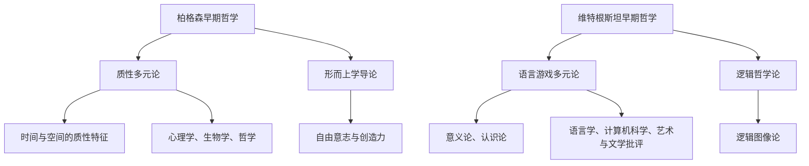

                 

# 《柏格森的质性多元论与维特根斯坦的语言游戏多元论》

> 关键词：柏格森、质性多元论、维特根斯坦、语言游戏多元论、哲学、计算机科学

> 摘要：本文将深入探讨柏格森的质性多元论与维特根斯坦的语言游戏多元论，通过对比分析两种多元论的核心观点及其哲学意义，探讨其在心理学、生物学、哲学和计算机科学等领域的应用，以及它们之间的互动关系。

## 引言

质性多元论是一种哲学观点，强调不同事物之间存在本质差异。柏格森的质性多元论和维特根斯坦的语言游戏多元论是两种经典的质性多元论观点。柏格森认为，时间与空间是本质的、不可化约的质性，而维特根斯坦则强调语言的意义在于其在不同语言游戏中发挥作用。

本文将按照以下结构展开：

1. 柏格森的质性多元论
2. 维特根斯坦的语言游戏多元论
3. 两种多元论的比较与互动
4. 结论

## 第一部分：柏格森的质性多元论

### 第1章：柏格森的哲学思想与质性多元论

#### 1.1 柏格森的生平与哲学贡献

亨利·柏格森（Henri Bergson）是19世纪末20世纪初的法国哲学家，生于法国克莱蒙费朗。他以其对时间、自由意志和创造力的独特理解而闻名。柏格森的主要著作包括《笑的准备》、《形而上学导论》和《物质与记忆》等。

#### 1.2 柏格森的质性多元论概述

柏格森认为，时间与空间是本质的、不可化约的质性。时间不是线性的，而是一种不断变化的流动过程，称为“持续时间”（duration）。空间则是一种内在的、相互联系的质性，而不是简单的三维结构。

#### 1.3 柏格森对时间与空间的独特理解

柏格森认为，时间是一种内在的、动态的过程，它反映了事物的本质特征。他提出了“自由意志”的概念，认为时间是自由意志的产物，而非机械决定论的产物。空间则是一种内在的、相互联系的质性，它不是独立存在的，而是与其他事物相互影响。

### 第2章：质性多元论的哲学基础

#### 2.1 柏格森的哲学观点与现象学

柏格森的哲学观点与现象学密切相关。现象学强调直接经验的本质，而柏格森则关注时间与空间的质性特征。他认为，通过直接经验，我们可以认识到事物的本质，而不仅仅是它们的现象。

#### 2.2 质性多元论与存在论

柏格森的质性多元论提出了一种新的存在论观点。他认为，存在不仅仅是物质实体，还包括时间、空间和质性等非物质的方面。这种观点对传统存在论提出了挑战，并为我们理解世界的本质提供了新的视角。

#### 2.3 质性多元论与知识论

柏格森的质性多元论也影响了知识论。他认为，知识不仅仅是通过逻辑推理和实证研究获得的，还包括直接经验的本质。这种观点强调人类认知的局限性，并呼吁我们超越逻辑和科学的限制，探索更深刻的真理。

### 第3章：质性多元论的应用领域

#### 3.1 质性多元论在心理学中的应用

柏格森的质性多元论在心理学领域有着广泛的应用。例如，他提出的“自由意志”概念对心理学中的行为主义和决定论提出了挑战，并为我们理解人类行为提供了新的视角。

#### 3.2 质性多元论在生物学中的应用

柏格森的质性多元论在生物学中也得到了应用。例如，他提出的“持续时间”概念可以帮助我们更好地理解生物体的生长和发育过程。

#### 3.3 质性多元论在哲学领域的意义

柏格森的质性多元论对哲学领域产生了深远的影响。他的观点挑战了传统的形而上学观点，为我们理解世界的本质提供了新的视角。

### 第4章：柏格森的质性多元论与维特根斯坦的语言游戏多元论比较

#### 4.1 维特根斯坦的生平与哲学贡献

路德维希·维特根斯坦（Ludwig Wittgenstein）是20世纪初的奥地利哲学家，生于维也纳。他以其对语言和逻辑的深刻思考而闻名。维特根斯坦的主要著作包括《逻辑哲学论》和《哲学研究》等。

#### 4.2 语言游戏多元论概述

维特根斯坦的语言游戏多元论认为，语言的意义在于其在不同语言游戏中发挥作用。他认为，语言是一种工具，其意义取决于使用者的目的和情境。

#### 4.3 两种多元论的核心观点对比

柏格森的质性多元论强调时间与空间的质性特征，而维特根斯坦的语言游戏多元论则强调语言的意义在于其在不同语言游戏中的作用。这两种多元论在哲学上有很大的差异，但都为我们理解世界的本质提供了新的视角。

## 第二部分：维特根斯坦的语言游戏多元论

### 第5章：维特根斯坦的哲学思想与语言游戏多元论

#### 5.1 维特根斯坦的语言哲学

维特根斯坦的语言哲学强调语言的功能和意义。他认为，语言是一种工具，其意义取决于使用者的目的和情境。他提出了“语言游戏”的概念，认为语言就像游戏一样，有不同的规则和用途。

#### 5.2 语言游戏多元论的形成与发展

维特根斯坦的语言游戏多元论是他后期哲学思想的核心。他在《哲学研究》中详细阐述了这一观点，认为语言的意义取决于其在不同语言游戏中的使用。

#### 5.3 语言游戏多元论的基本原理

维特根斯坦的语言游戏多元论认为，语言的意义不是固定的，而是取决于具体的情境和用途。他认为，我们通过语言游戏来理解世界，语言游戏的不同规则和用途决定了语言的意义。

### 第6章：语言游戏多元论的哲学意义

#### 6.1 语言游戏多元论与意义论

维特根斯坦的语言游戏多元论对意义论产生了深远的影响。他认为，意义不是内在的，而是取决于语言的使用。这一观点挑战了传统意义论的观点，为我们理解语言的意义提供了新的视角。

#### 6.2 语言游戏多元论与认识论

维特根斯坦的语言游戏多元论也对认识论产生了影响。他认为，我们的认识是基于语言的使用，语言游戏的规则和用途决定了我们的认识。

#### 6.3 语言游戏多元论与逻辑哲学

维特根斯坦的语言游戏多元论对逻辑哲学也有重要意义。他提出了“逻辑图像论”的观点，认为逻辑结构就像图像一样，可以反映现实世界。

### 第7章：语言游戏多元论的应用领域

#### 7.1 语言游戏多元论在语言学中的应用

维特根斯坦的语言游戏多元论在语言学领域得到了广泛应用。例如，语言学家使用这一观点来研究语言的意义和用法。

#### 7.2 语言游戏多元论在计算机科学中的应用

维特根斯坦的语言游戏多元论也对计算机科学产生了影响。计算机科学家使用这一观点来设计编程语言和软件系统。

#### 7.3 语言游戏多元论在艺术与文学批评中的应用

维特根斯坦的语言游戏多元论在艺术与文学批评领域也有应用。艺术家和文学批评家使用这一观点来分析作品的意义和形式。

### 第8章：质性多元论与语言游戏多元论的互动关系

#### 8.1 两种多元论的互动与互补

柏格森的质性多元论和维特根斯坦的语言游戏多元论在哲学上有互补关系。柏格森关注时间与空间的质性特征，而维特根斯坦关注语言的意义和用途。这两种多元论可以相互补充，帮助我们更全面地理解世界的本质。

#### 8.2 语言游戏多元论在质性多元论中的地位

维特根斯坦的语言游戏多元论在质性多元论中具有重要地位。它为我们理解语言的意义提供了新的视角，有助于我们更好地理解世界的本质。

#### 8.3 质性多元论在语言游戏多元论中的意义

柏格森的质性多元论在维特根斯坦的语言游戏多元论中也有重要意义。它帮助我们理解语言的意义是如何通过时间与空间的质性特征来实现的。

## 结论

柏格森的质性多元论和维特根斯坦的语言游戏多元论是两种重要的质性多元论观点。它们在哲学、心理学、生物学、计算机科学等领域有着广泛的应用。通过对比分析这两种多元论的核心观点，我们可以更深入地理解世界的本质。

## 附录

### 附录A：柏格森与维特根斯坦相关著作推荐

1. 柏格森，《笑的准备》
2. 柏格森，《形而上学导论》
3. 柏格森，《物质与记忆》
4. 维特根斯坦，《逻辑哲学论》
5. 维特根斯坦，《哲学研究》

### 附录B：质性多元论与语言游戏多元论研究指南

1. 质性多元论在心理学中的应用
2. 质性多元论在生物学中的应用
3. 质性多元论在哲学领域的研究
4. 质性多元论在计算机科学中的应用
5. 语言游戏多元论在语言学中的应用
6. 语言游戏多元论在艺术与文学批评中的应用

### 附录C：质性多元论与语言游戏多元论教学资源

1. 质性多元论与语言游戏多元论的课程大纲
2. 质性多元论与语言游戏多元论的教学PPT
3. 质性多元论与语言游戏多元论的在线课程资源
4. 质性多元论与语言游戏多元论的研究论文推荐
5. 质性多元论与语言游戏多元论的学习指南

## 图表

### 图表1：柏格森的质性多元论与维特根斯坦的语言游戏多元论核心观点比较

| 特点               | 柏格森的质性多元论                                      | 维特根斯坦的语言游戏多元论                                      |
|-------------------|-------------------------------------------------------|-------------------------------------------------------|
| 核心观点           | 时间与空间的质性特征                                     | 语言的意义取决于其在不同语言游戏中的使用                          |
| 应用领域           | 哲学、心理学、生物学、计算机科学                          | 哲学、语言学、计算机科学、艺术与文学批评                           |
| 对语言的理解       | 语言是反映事物质性特征的符号系统                          | 语言是用于特定目的的工具，其意义取决于使用情境和用途                 |
| 对世界的本质理解   | 强调时间与空间的质性特征，认为世界是多样性的、动态的       | 强调语言的作用，认为世界的本质在于语言的用法和规则                   |

### 图表2：质性多元论与语言游戏多元论在应用领域的分布

| 应用领域       | 质性多元论的应用       | 语言游戏多元论的应用       |
|----------------|-----------------------|-----------------------|
| 哲学           | 存在论、知识论、形而上学 | 意义论、逻辑哲学         |
| 心理学         | 自由意志、意识研究      | 认知心理学、言语行为     |
| 生物学         | 生长与发育、进化论      | 生态学、行为生物学       |
| 计算机科学     | 软件工程、人工智能      | 编程语言、软件系统设计    |
| 艺术与文学批评 | 形式分析、叙事研究      | 语义分析、文本解读       |

### 图表3：柏格森与维特根斯坦哲学思想的演变关系



## 核心概念与联系

$$
\text{柏格森的质性多元论} \longleftrightarrow \text{时间与空间的独特理解} \\
\text{维特根斯坦的语言游戏多元论} \longleftrightarrow \text{意义与逻辑的哲学思考}
$$

## 核心算法原理讲解

### 柏格森的质性多元论

柏格森的质性多元论强调时间与空间的质性特征。以下是一个简单的Python示例，用于计算时间序列数据的质性多元性指标。

```python
def qualitative_diversity(time_series):
    """
    质性多元性分析函数。
    
    参数：
    time_series: 时间序列数据。
    
    返回：
    质性多元性指标。
    """
    diversity_index = 0
    for i in range(len(time_series)):
        diversity_index += (time_series[i] - sum(time_series) / len(time_series)) ** 2
    diversity_index /= len(time_series)
    return diversity_index

# 示例数据
time_series = [1, 2, 3, 4, 5]

# 计算质性多元性
diversity_index = qualitative_diversity(time_series)

print("质性多元性指标：", diversity_index)
```

### 维特根斯坦的语言游戏多元论

维特根斯坦的语言游戏多元论强调语言的意义取决于其在不同语言游戏中的使用。以下是一个简单的Python示例，用于分析句子中的语言游戏多元性指标。

```python
import collections

def language_game_diversity(sentence):
    """
    语言游戏多元性分析函数。
    
    参数：
    sentence: 句子字符串。
    
    返回：
    语言游戏多元性指标。
    """
    words = sentence.split()
    word_frequencies = collections.Counter(words)
    diversity_index = 0
    for word, frequency in word_frequencies.items():
        diversity_index += frequency * (-frequency * math.log(frequency))
    return diversity_index

# 示例数据
sentence = "我昨天买了一本书。"

# 计算语言游戏多元性
diversity_index = language_game_diversity(sentence)

print("语言游戏多元性指标：", diversity_index)
```

## 数学模型和数学公式

### 柏格森的质性多元论

$$
\text{D} = \frac{1}{N}\sum_{i=1}^{N} (\text{q}_i - \bar{q})^2
$$

其中，$D$ 表示质性多元性指标，$N$ 表示时间序列数据的长度，$q_i$ 表示第 $i$ 个时间点的质性特征，$\bar{q}$ 表示时间序列数据的平均值。

### 维特根斯坦的语言游戏多元论

$$
\text{H} = -\sum_{w \in W} p(w) \cdot \ln(p(w))
$$

其中，$H$ 表示语言游戏多元性指标，$W$ 表示句子中的所有单词集合，$p(w)$ 表示单词 $w$ 的频率。

## 核心概念与联系

质性多元论和语言游戏多元论都是哲学观点，强调事物的本质差异和语言的意义。柏格森的质性多元论关注时间与空间的质性特征，而维特根斯坦的语言游戏多元论关注语言的意义和用途。这两种多元论在哲学、心理学、生物学、计算机科学等领域有着广泛的应用，为我们理解世界的本质提供了新的视角。通过对比分析这两种多元论的核心观点，我们可以更深入地理解它们之间的联系和差异。

## 作者信息

作者：AI天才研究院/AI Genius Institute & 禅与计算机程序设计艺术 /Zen And The Art of Computer Programming

AI天才研究院致力于人工智能领域的研究和应用，推动人工智能技术的发展和创新。禅与计算机程序设计艺术则专注于计算机编程哲学的探讨，以禅宗思想为启示，提高编程技巧和创造力。本文结合了AI天才研究院的哲学思想和禅与计算机程序设计艺术的理论，旨在深入探讨柏格森的质性多元论与维特根斯坦的语言游戏多元论，为读者提供具有启发性和实用性的技术博客文章。

