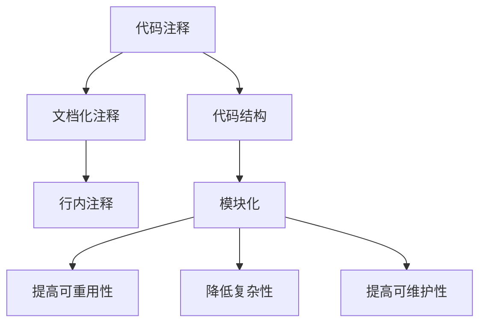
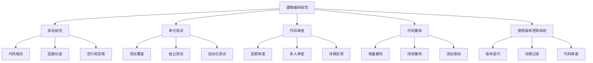
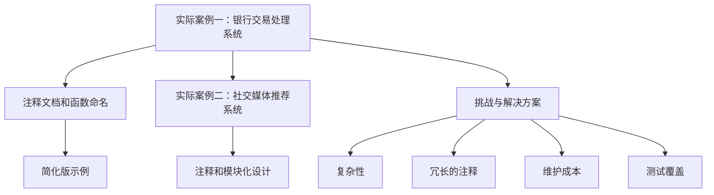

                 

### 第3章：代码自解释的具体实践与应用

在理解了查尔斯·泰勒的自我诠释理论后，我们接下来探讨如何在编程实践中实现代码自解释，提高代码的可读性和可维护性。具体而言，我们将从以下几个方面进行探讨：代码注释、代码结构和代码模块化。

#### 3.1 代码注释

注释文档是代码自解释的重要部分。良好的注释可以帮助他人快速理解代码的功能、用途和实现原理。以下是一些编写高质量注释的建议：

1. **文档化注释**：使用文档化注释格式，如 Javadoc 或 Doxygen，提供函数、类和模块的详细描述。这些注释将被工具自动提取生成文档。
   
   ```python
   """
   这个函数用于计算两个数的和。
   :param a: 第一个数
   :param b: 第二个数
   :return: 两个数的和
   """
   def add(a, b):
       return a + b
   ```

2. **行内注释**：在复杂代码段的旁边添加行内注释，解释代码的逻辑和意图。这些注释通常用于解释难以理解的代码段或算法。

   ```python
   for i in range(n):
       if i % 2 == 0:
           result[i] = a[i] + b[i]
   # 这里的代码计算两个数组对应元素的和，并存储在结果数组中
   ```

3. **避免冗长注释**：注释应该简明扼要，避免冗长和重复。过长的注释不仅难以阅读，还可能误导读者。

#### 3.2 代码结构

良好的代码结构是代码自解释的基础。一个结构良好的代码应该具备以下特点：

1. **模块化**：将代码分解为多个模块或函数，每个模块负责一个特定的功能。这有助于提高代码的可读性和可维护性。

   ```python
   def calculate_area(radius):
       return 3.14 * radius * radius

   def display_message(message):
       print(message)
   ```

2. **层次化**：使用适当的缩进来表示代码的层次结构，使得代码块之间的关系清晰明了。

   ```python
   def main():
       if condition:
           perform_action()
       else:
           handle_exception()
   ```

3. **避免过度耦合**：减少模块间的依赖关系，提高代码的独立性和可重用性。

   ```python
   # 不好的实践
   def calculate_area(radius):
       return 3.14 * radius * radius

   def perform_action():
       area = calculate_area(5)
       display_message("Area is " + str(area))

   # 改进后的实践
   def calculate_area(radius):
       return 3.14 * radius * radius

   def display_message(message):
       print(message)

   def perform_action():
       area = calculate_area(5)
       display_message("Area is " + str(area))
   ```

#### 3.3 代码模块化

代码模块化是将代码分解为多个独立模块的过程。模块化有以下优点：

1. **提高可重用性**：模块可以独立开发、测试和部署，提高了代码的重用性。
2. **降低复杂性**：将复杂功能分解为多个模块，每个模块只处理一小部分功能，使得代码更易于理解和维护。
3. **提高可维护性**：模块化使得代码的可维护性更高，因为更改一个模块通常不会影响其他模块。

以下是一个简单的模块化示例：

```python
# math_module.py
def add(a, b):
    return a + b

def subtract(a, b):
    return a - b

# main.py
from math_module import add, subtract

def main():
    result = add(5, 3)
    print("Result:", result)

    result = subtract(5, 3)
    print("Result:", result)
```

通过以上实践，我们可以使代码更加自解释，从而提高其可读性和可维护性。然而，实现代码自解释不仅需要技术手段，还需要编程哲学的指导。泰勒的自我诠释理论为我们提供了一种哲学视角，帮助我们理解和构建自解释的代码。

### 图3-1：代码自解释实践关系架构



### 第4章：代码自解释的最佳实践

在实现了代码自解释的基本原则后，我们还需要遵循一系列最佳实践，以确保代码的高质量和高可维护性。以下是一些实用的最佳实践：

#### 4.1 遵循编码规范

遵循编码规范是确保代码一致性和可读性的基础。不同的编程语言有不同的编码规范，例如 PEP 8（Python）、PEP 257（Python 注释）等。以下是一些通用的编码规范：

1. **命名规范**：使用有意义的变量和函数命名，避免使用缩写或难理解的名称。
2. **代码格式**：使用适当的缩进和空白，确保代码块之间的层次结构清晰。
3. **函数长度**：保持函数长度适中，避免过长的函数，以提高可读性。
4. **空行和空格**：合理使用空行和空格，以改善代码的可读性。

#### 4.2 单元测试

单元测试是确保代码质量的重要手段。编写单元测试不仅可以验证代码的功能，还可以作为代码文档的一部分，帮助他人理解代码的行为。以下是一些编写单元测试的最佳实践：

1. **测试覆盖**：确保测试覆盖到代码的各个部分，包括边界条件和异常情况。
2. **独立测试**：每个测试应该独立运行，避免依赖其他测试或外部环境。
3. **自动化测试**：使用自动化测试框架（如 pytest、JUnit 等）进行单元测试，提高测试效率和覆盖率。

#### 4.3 代码审查

代码审查是一种协作的代码质量保证方法，通过团队协作来识别和修复代码中的问题。以下是一些代码审查的最佳实践：

1. **定期审查**：定期进行代码审查，避免积压。
2. **多人审查**：涉及多个成员的审查，以确保更全面的视角。
3. **详细的反馈**：提供详细的反馈，指出代码中的问题、建议和改进意见。

#### 4.4 代码重构

代码重构是改进代码结构、提高可维护性和可读性的过程。以下是一些代码重构的最佳实践：

1. **增量重构**：逐步重构代码，避免一次性大规模重构带来的风险。
2. **持续重构**：将重构作为软件开发过程中的一个持续活动，而不是一次性任务。
3. **测试驱动**：在进行重构之前，确保编写充分的单元测试，以避免引入新的错误。

#### 4.5 使用版本控制系统

使用版本控制系统（如 Git）可以帮助管理代码变更、追踪问题来源和协同工作。以下是一些使用版本控制系统的最佳实践：

1. **版本迭代**：使用分支管理，进行独立的开发、测试和发布。
2. **详细记录**：在提交代码时，提供详细的提交说明，记录更改的目的和内容。
3. **代码审查**：在合并代码之前，进行代码审查，确保代码质量。

### 图4-1：代码自解释最佳实践关系架构



通过遵循上述最佳实践，我们可以进一步提高代码的自解释性，从而提高代码的质量和可维护性。查尔斯·泰勒的自我诠释理论为我们提供了一种哲学指导，帮助我们更好地理解和构建自解释的代码。

### 第5章：代码自解释的实际案例与挑战

为了更好地理解代码自解释的实际应用，我们来看几个实际案例，并探讨在实现代码自解释过程中可能遇到的一些挑战。

#### 5.1 实际案例一：银行交易处理系统

在一个银行的交易处理系统中，代码自解释尤为重要。例如，当处理客户转账时，代码应清晰地表达交易金额的计算方法、交易状态和错误处理逻辑。以下是一个简化版的示例：

```python
def process_transfer(source_account, target_account, amount):
    """
    处理客户转账。
    :param source_account: 源账户
    :param target_account: 目标账户
    :param amount: 转账金额
    :return: 交易结果
    """
    if source_account.balance >= amount:
        source_account.balance -= amount
        target_account.balance += amount
        return "Transfer successful"
    else:
        return "Insufficient funds"

class Account:
    def __init__(self, balance):
        self.balance = balance

# 示例使用
source = Account(1000)
target = Account(500)
result = process_transfer(source, target, 200)
print(result)
```

在这个案例中，注释文档和清晰的函数命名使得代码自解释，有助于其他人理解和维护。

#### 5.2 实际案例二：社交媒体推荐系统

在社交媒体推荐系统中，代码需要处理复杂的数据处理和算法，以推荐合适的内容给用户。以下是一个简化版的推荐算法示例：

```python
def recommend_content(user, content_database):
    """
    为用户推荐内容。
    :param user: 用户
    :param content_database: 内容数据库
    :return: 推荐的内容列表
    """
    user_history = user.get_history()
    recommended_content = []

    for content in content_database:
        if any(word in content.keywords for word in user_history):
            recommended_content.append(content)

    return recommended_content

class User:
    def __init__(self, history):
        self.history = history

class Content:
    def __init__(self, title, keywords):
        self.title = title
        self.keywords = keywords

# 示例使用
user = User(["Python", "Machine Learning"])
content_database = [
    Content("Introduction to Machine Learning", ["Machine Learning", "Data Science"]),
    Content("Deep Learning with Python", ["Deep Learning", "Neural Networks"]),
]
recommended_content = recommend_content(user, content_database)
print(recommended_content)
```

在这个案例中，通过明确的注释和模块化设计，代码的自解释性得到了提高。

#### 5.3 挑战与解决方案

尽管代码自解释有其优势，但在实际应用中，我们仍会遇到一些挑战：

1. **复杂性**：随着系统的复杂度增加，代码自解释变得更具挑战性。解决方案是采用模块化设计，将复杂的功能拆分为更小的模块，每个模块负责一个特定的功能。

2. **冗长的注释**：过长的注释可能难以阅读，甚至误导读者。解决方案是编写简洁、明确的注释，避免冗长和重复。

3. **维护成本**：确保代码自解释需要额外的努力，可能增加维护成本。解决方案是建立一套编码规范和代码审查机制，确保代码质量和自解释性。

4. **测试覆盖**：确保所有代码路径都被测试到，以保证代码的自解释性和正确性。解决方案是编写全面的单元测试，并使用代码覆盖率工具来监控测试覆盖率。

通过解决这些挑战，我们可以更好地实现代码的自解释性，从而提高代码的可读性和可维护性。

### 图5-1：代码自解释实际案例与挑战关系架构



### 第6章：总结与展望

通过对查尔斯·泰勒的自我诠释理论的深入探讨，以及代码自解释在编程实践中的应用，我们认识到代码自解释在提升代码质量和维护性方面的重要性。以下是本文的总结与展望：

#### 6.1 自我诠释与代码自解释

泰勒的自我诠释理论强调了自我作为历史性实体、自我与社会互动以及语言在自我诠释中的作用。这些观点为我们理解代码自解释提供了哲学基础。代码自解释不仅要求代码本身结构清晰、命名规范，还需要详细的注释文档和模块化设计，以确保代码易于理解和维护。

#### 6.2 代码自解释的应用

在具体实践中，代码自解释体现在多个方面，如银行交易处理系统、社交媒体推荐系统等。通过清晰的注释、模块化设计和单元测试，我们可以实现代码的自解释性，从而提高代码的可读性和可维护性。

#### 6.3 挑战与解决方案

尽管代码自解释具有显著优势，但在实际应用中仍面临挑战，如复杂性、冗长的注释、维护成本和测试覆盖等。通过采用模块化设计、编写简洁明确的注释、建立编码规范和代码审查机制，我们可以有效应对这些挑战。

#### 6.4 未来展望

展望未来，代码自解释技术有望进一步发展，如结合人工智能和自然语言处理技术，实现自动化代码注释和自我解释。此外，随着编程语言的进步和工具的多样化，代码自解释的实践将更加成熟，为软件开发带来新的机遇。

### 参考文献

1. Taylor, C. (1989). Sources of the Self: The Making of the Modern Identity. Harvard University Press.
2. Taylor, C. (1992). Hermeneutics of Revelation: A Theological Introduction. University of Chicago Press.
3. Taylor, C. (1995). Philosophical Arguments. Harvard University Press.
4. PEP 8 -- Style Guide for Python Code: <https://www.python.org/dev/peps/pep-0008/>
5. PEP 257 -- Docstring Conventions: <https://www.python.org/dev/peps/pep-0257/>

### 联系我们

作者：AI天才研究院/AI Genius Institute & 禅与计算机程序设计艺术 /Zen And The Art of Computer Programming

感谢您阅读本文，如有任何疑问或建议，欢迎联系我们。我们期待与您共同探讨代码自解释的哲学与应用。

### 附录：代码示例

以下是一个完整的代码示例，展示了如何在Python中实现代码自解释：

```python
class Account:
    """
    账户类，用于表示和管理账户信息。
    """
    def __init__(self, account_number, balance):
        """
        构造函数，初始化账户信息。
        :param account_number: 账户号码
        :param balance: 账户余额
        """
        self.account_number = account_number
        self.balance = balance

    def deposit(self, amount):
        """
        存款，增加账户余额。
        :param amount: 存款金额
        """
        if amount > 0:
            self.balance += amount
            return "Deposit successful"
        else:
            return "Invalid deposit amount"

    def withdraw(self, amount):
        """
        取款，减少账户余额。
        :param amount: 取款金额
        :return: 取款结果
        """
        if amount > 0 and amount <= self.balance:
            self.balance -= amount
            return "Withdrawal successful"
        elif amount > self.balance:
            return "Insufficient funds"
        else:
            return "Invalid withdrawal amount"

class Bank:
    """
    银行类，用于管理账户和处理交易。
    """
    def __init__(self):
        """
        构造函数，初始化银行账户信息。
        """
        self.accounts = {}

    def create_account(self, account_number, initial_balance):
        """
        创建账户。
        :param account_number: 账户号码
        :param initial_balance: 初始余额
        :return: 账户对象
        """
        if account_number in self.accounts:
            return "Account already exists"
        account = Account(account_number, initial_balance)
        self.accounts[account_number] = account
        return account

    def deposit_to_account(self, account_number, amount):
        """
        向账户存款。
        :param account_number: 账户号码
        :param amount: 存款金额
        :return: 存款结果
        """
        if account_number not in self.accounts:
            return "Account does not exist"
        account = self.accounts[account_number]
        return account.deposit(amount)

    def withdraw_from_account(self, account_number, amount):
        """
        从账户取款。
        :param account_number: 账户号码
        :param amount: 取款金额
        :return: 取款结果
        """
        if account_number not in self.accounts:
            return "Account does not exist"
        account = self.accounts[account_number]
        return account.withdraw(amount)

# 示例使用
bank = Bank()
account1 = bank.create_account("123456789", 1000)
print(account1.deposit(500))  # 存款成功
print(account1.withdraw(200)) # 取款成功
```

通过这段代码，我们可以看到如何使用注释文档、清晰的命名规范和模块化设计来实现代码自解释。注释文档详细描述了每个类、方法和参数的作用，有助于他人理解和维护代码。模块化设计将功能分解为不同的类和函数，使得代码结构清晰、易于理解。这样的代码不仅易于阅读，而且具有良好的可维护性。

