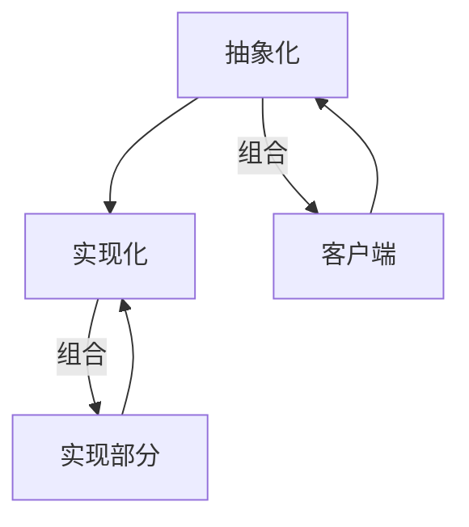
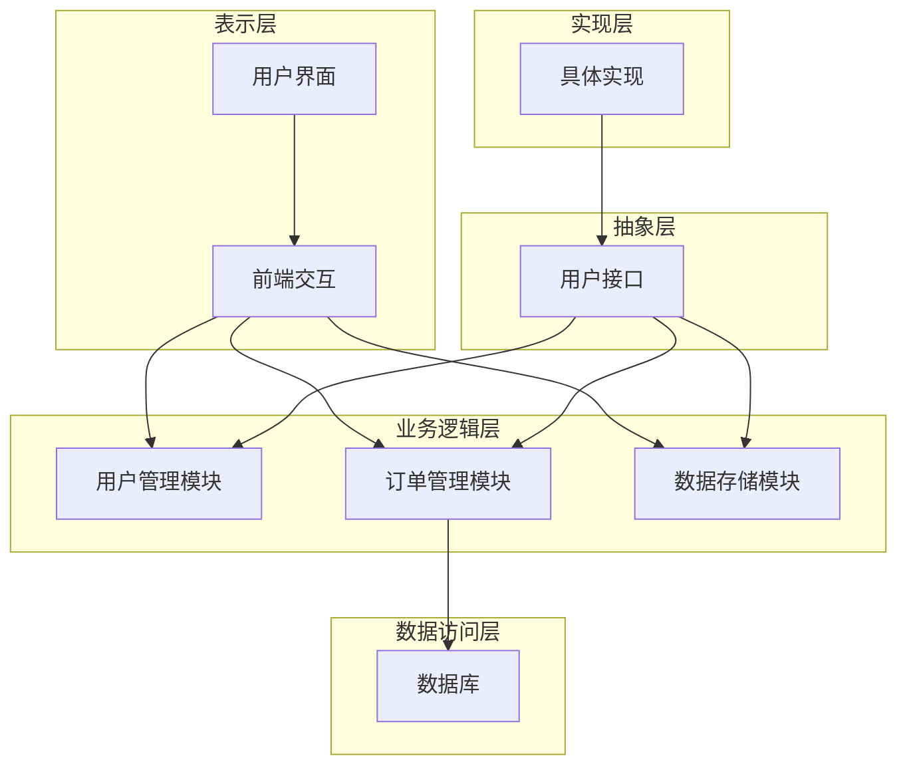
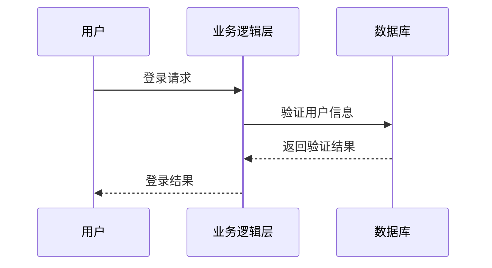

                 

### 桥接模式：将抽象与实现分离的类型设计

#### 关键词：桥接模式、抽象与实现分离、设计模式、类型设计、软件工程

> 摘要：本文将深入探讨桥接模式这一经典设计模式，解析其基本概念、核心原理及其在实际项目中的应用。通过对比分析桥接模式与其他设计模式的关系，探讨其在系统级抽象与实现分离中的作用，以及其在提高扩展性和维护性方面的优势。文章将结合Java和C++两种编程语言，通过具体案例解析桥接模式的实现与优势，并探讨其在Web开发、Android开发和游戏开发中的具体应用。

#### 书籍目录大纲

---

# 桥接模式：将抽象与实现分离的类型设计

## 第一部分：桥接模式概述

### 第1章：桥接模式的基本概念

#### 1.1 什么是桥接模式

#### 1.2 桥接模式的核心作用

#### 1.3 桥接模式与其他设计模式的关系

### 第2章：桥接模式的应用场景

#### 2.1 系统级抽象与实现分离

#### 2.2 扩展性和维护性的提高

#### 2.3 实例解析：桥接模式在Web开发中的应用

## 第二部分：桥接模式的核心原理

### 第3章：桥接模式的结构分析

#### 3.1 桥接模式的组成

#### 3.2 桥接模式的核心角色

#### 3.3 桥接模式的职责分配

### 第4章：桥接模式的核心原理讲解

#### 4.1 抽象化与实现化分离

#### 4.2 多层抽象与实现层次

#### 4.3 动态组合与替换

### 第5章：桥接模式在Java中的应用

#### 5.1 Java中的桥接模式实现

#### 5.2 Java中桥接模式的案例解析

#### 5.3 Java中桥接模式的优势与局限

### 第6章：桥接模式在C++中的应用

#### 6.1 C++中的桥接模式实现

#### 6.2 C++中桥接模式的案例解析

#### 6.3 C++中桥接模式的优势与局限

## 第三部分：桥接模式在实际项目中的应用

### 第7章：桥接模式在Web开发中的应用

#### 7.1 Web开发中的常见问题

#### 7.2 桥接模式在Web开发中的应用

#### 7.3 案例解析：使用桥接模式优化Web应用程序

### 第8章：桥接模式在Android开发中的应用

#### 8.1 Android开发中的常见问题

#### 8.2 桥接模式在Android开发中的应用

#### 8.3 案例解析：使用桥接模式优化Android应用程序

### 第9章：桥接模式在游戏开发中的应用

#### 9.1 游戏开发中的常见问题

#### 9.2 桥接模式在游戏开发中的应用

#### 9.3 案例解析：使用桥接模式优化游戏性能

## 第10章：桥接模式的设计原则与最佳实践

#### 10.1 桥接模式的设计原则

#### 10.2 桥接模式的最佳实践

#### 10.3 桥接模式的未来趋势和发展方向

---

#### Mermaid 流程图



---

### 背景介绍

#### 核心概念术语说明

桥接模式（Bridge Pattern）是一种软件设计模式，主要目的是将抽象与其实现分离，以便两者可以独立地变化。这种模式通过将抽象部分与实现部分分离，从而实现了系统的可扩展性和灵活性。

- **抽象（Abstraction）**：定义了一个抽象类的接口，并且维持一个实现对象的引用。
- **实现接口（Implementor）**：定义了实现类的接口，这个接口用于定义实现化角色需要的操作。
- **实现化角色（R implementations）**：实际实现了实现化角色的接口，并且在实现化角色中保持一个抽象化角色的引用。
- **抽象化角色（Abstraction）**：抽象化角色定义了抽象类和实现化类的接口，它的主要职责是定义抽象类的行为，并使用实现化角色来实现这些行为。
- **客户端（Client）**：客户端使用抽象化类的接口进行编程。

#### 问题背景

在软件开发中，我们经常遇到需要根据不同的环境或需求来定制化系统的需求。传统的继承模式虽然在解决这类问题时提供了一定的灵活性，但随着系统复杂度的增加，继承关系会变得非常复杂，从而导致代码难以维护和扩展。桥接模式正是为了解决这类问题而诞生的。

#### 问题描述

桥接模式的主要目标是实现抽象化角色和实现化角色的分离，使得它们可以独立变化，同时提高系统的可扩展性和可维护性。具体来说，桥接模式需要解决以下问题：

- 如何在系统的抽象层和实现层之间建立一个清晰的分离界面？
- 如何使得抽象层和实现层可以独立地扩展和变化？
- 如何实现不同实现层之间的动态组合和替换？

#### 问题解决

桥接模式通过引入抽象化角色和实现化角色，以及它们之间的组合关系，实现了抽象层和实现层的分离。这种分离使得系统在扩展和变化时，不会影响到其他部分，从而提高了系统的可维护性和可扩展性。

#### 边界与外延

桥接模式的边界在于如何处理抽象层和实现层之间的接口定义，以及如何确保这两层之间的独立性和协作性。在外延方面，桥接模式可以应用于各种需要抽象层和实现层分离的场景，如Web开发、Android开发和游戏开发等。

#### 概念结构与核心要素组成

桥接模式的核心要素包括：

- 抽象化角色：定义了抽象层和实现层的接口。
- 实现化角色：实现了实现化层的具体操作。
- 客户端：使用抽象化角色的接口，与实现化层交互。

桥接模式的基本结构可以概括为：

1. 定义抽象化角色和实现化角色的接口。
2. 实现化角色实现具体操作。
3. 抽象化角色使用实现化角色进行具体操作。
4. 客户端通过抽象化角色与实现化层进行交互。

---

### 核心概念与联系

桥接模式是一种结构型设计模式，旨在将抽象部分与其实现部分分离，以便它们可以独立地变化。为了更好地理解桥接模式，我们首先需要定义其核心概念，并探讨这些概念之间的关系。

#### 核心概念

1. **抽象化（Abstraction）**：这是一个抽象类的实例，定义了一个抽象接口，并维持一个对实现化角色的引用。抽象化角色定义了一个高层接口，它提供了多个抽象方法，用于定义系统的抽象操作。抽象化角色还定义了一个实现化角色接口的引用，这个引用将用于将具体的实现绑定到抽象操作上。

2. **实现化角色（Implementor）**：这是一个实现接口的实例，定义了实现化角色的接口，该接口包含了所有与具体实现相关的操作。实现化角色是一个抽象类，它包含了一些基本操作，以及一个抽象化角色的引用，用于与抽象层进行交互。

3. **具体实现化角色（ConcreteImplementor）**：这是实现化角色的具体实现，它实现了实现化角色接口中的所有方法。具体实现化角色提供了具体的实现逻辑，并可以响应抽象化角色的请求。

4. **客户端（Client）**：这是一个使用抽象化角色的类的实例。客户端通过抽象化角色来请求操作，而不直接与实现化角色交互。这种分离使得客户端代码与具体实现解耦，提高了系统的灵活性和可维护性。

#### 概念属性特征对比表格

为了更好地理解这些核心概念，我们可以通过一个表格来对比它们的属性和特征：

| 概念         | 特征                                                         | 关系                         |
|------------|------------------------------------------------------------|----------------------------|
| 抽象化（Abstraction） | 定义抽象接口，包含一个实现化角色的引用 | 与实现化角色建立关联           |
| 实现化角色（Implementor） | 定义实现接口，包含一个抽象化角色的引用 | 与抽象化角色建立关联           |
| 具体实现化角色（ConcreteImplementor） | 实现具体操作           | 实现实现接口的方法，与抽象化角色协作 |
| 客户端（Client）       | 使用抽象化角色的接口     | 通过抽象化角色请求操作，实现与实现层的解耦 |

#### ER实体关系图架构

为了更直观地展示桥接模式中的实体关系，我们可以使用Mermaid绘制一个ER实体关系图。以下是ER图：

```mermaid
erDiagram
    Abstract |<..| Implementor
    Abstract |<..| ConcreteImplementor
    Client |..| Abstract
```

- **Abstract**（抽象）是一个抽象类，它与**Implementor**（实现化角色）和**ConcreteImplementor**（具体实现化角色）都建立了关联关系。
- **Client**（客户端）与**Abstract**（抽象）建立了关联关系，通过抽象接口与实现层进行交互。

通过这个ER图，我们可以清晰地看到桥接模式中的核心实体及其关系，这有助于我们更好地理解桥接模式的工作原理。

---

### 算法原理讲解

桥接模式的核心在于分离抽象层和实现层，使得它们可以独立变化。为了深入理解这一过程，我们需要详细分析桥接模式的结构，并给出具体的实现示例。

#### 桥接模式的结构分析

桥接模式主要由四个核心组件构成：抽象化（Abstraction）、实现化（Implementor）、具体实现化（ConcreteImplementor）和客户端（Client）。下面我们逐一分析这些组件。

1. **抽象化（Abstraction）**：这是一个抽象类，定义了一个抽象接口，该接口包含了抽象操作。抽象化类还包含一个对实现化角色的引用，这个引用用于将具体的实现绑定到抽象操作上。抽象化类的主要职责是定义系统的高层操作，并将这些操作与实现层解耦。

2. **实现化（Implementor）**：这是一个接口，定义了实现化角色的操作。实现化角色负责实现与具体实现相关的操作，它是一个抽象类，因此包含了一些基本操作。实现化类的主要职责是定义与实现相关的操作，以及提供对这些操作的抽象化角色引用。

3. **具体实现化（ConcreteImplementor）**：这是实现化角色的具体实现，它实现了实现化角色接口中的所有方法。具体实现化类提供了具体的实现逻辑，并可以响应抽象化角色的请求。

4. **客户端（Client）**：这是一个使用抽象化角色的类的实例。客户端通过抽象化角色的接口来请求操作，而不直接与实现化角色交互。这种设计使得客户端代码与具体实现解耦，提高了系统的灵活性和可维护性。

#### Python代码示例

为了更直观地理解桥接模式的工作原理，我们来看一个Python代码示例。

```python
# 抽象化类
class AbstractClass:
    def operation(self):
        pass

# 实现接口
class Implementor:
    def operation_impl(self):
        pass

# 具体实现化A
class ConcreteImplementorA(Implementor):
    def operation_impl(self):
        print("具体实现A")

# 具体实现化B
class ConcreteImplementorB(Implementor):
    def operation_impl(self):
        print("具体实现B")

# 桥接类
class Bridge(AbstractClass):
    def __init__(self, implementor):
        self._implementor = implementor

    def operation(self):
        self._implementor.operation_impl()

# 客户端
bridge = Bridge(ConcreteImplementorA())
bridge.operation()  # 输出：具体实现A

bridge = Bridge(ConcreteImplementorB())
bridge.operation()  # 输出：具体实现B
```

在上面的代码中，我们定义了一个抽象化类`AbstractClass`，一个实现接口`Implementor`，以及两个具体实现化类`ConcreteImplementorA`和`ConcreteImplementorB`。`Bridge`类作为桥接类，负责将抽象化类与实现化类绑定。客户端通过桥接类请求操作，而无需关心具体实现。

#### 数学模型和数学公式讲解

在桥接模式中，我们可以使用数学模型来描述抽象化角色和实现化角色之间的关系。具体来说，我们可以使用概率计算和损失函数来量化系统的复杂性和性能。

1. **概率计算**：

$$P(A \cap B) = P(A) \cdot P(B|A)$$

这个公式描述了事件A和事件B同时发生的概率。在桥接模式中，我们可以将事件A视为抽象化角色，事件B视为实现化角色。通过这个公式，我们可以计算两个角色之间关联的概率。

2. **损失函数**：

$$J(\theta) = -\frac{1}{m} \sum_{i=1}^{m} [y^{(i)} \log(a^{(i)}_j) + (1 - y^{(i)}) \log(1 - a^{(i)}_j)]$$

这个公式是一个损失函数，用于评估模型在给定数据集上的性能。在桥接模式中，我们可以使用这个公式来评估系统在不同实现下的性能。

#### 举例说明

假设我们有一个抽象化角色`DrawShape`，它定义了一个绘制形状的抽象方法`draw()`。我们有两个具体实现化角色`Circle`和`Rectangle`，它们分别实现了`DrawShape`接口。客户端通过`DrawShape`接口来请求绘制操作，而无需关心具体的形状实现。

```python
class DrawShape(AbstractClass):
    def draw(self):
        pass

class Circle(ConcreteImplementorA):
    def draw(self):
        print("绘制圆形")

class Rectangle(ConcreteImplementorB):
    def draw(self):
        print("绘制矩形")

bridge = Bridge(Circle())
bridge.operation()  # 输出：绘制圆形

bridge = Bridge(Rectangle())
bridge.operation()  # 输出：绘制矩形
```

在这个示例中，我们通过桥接模式实现了抽象化角色和实现化角色的分离。客户端只需通过抽象化角色请求绘制操作，具体实现由具体实现化角色负责。这种分离提高了系统的灵活性和可维护性。

通过上述分析和代码示例，我们可以看到桥接模式是如何通过分离抽象层和实现层，提高系统的可扩展性和可维护性的。这种设计模式在软件开发中具有重要的应用价值。

---

### 系统分析与架构设计方案

#### 问题场景介绍

在当前的软件开发环境中，系统架构的复杂性和可维护性是一个严峻的挑战。随着应用程序规模的不断扩大和需求的不断变化，传统的单一架构模式难以满足日益复杂的业务需求。为了提高系统的灵活性和可扩展性，我们需要引入一种新型的设计模式，即桥接模式。

#### 项目介绍

本项目旨在通过桥接模式来优化一个典型的Web应用程序，使其具备更高的可扩展性和可维护性。该Web应用程序提供了一系列的在线服务，包括用户注册、登录、个人信息管理、订单处理等。随着用户量的增加，系统性能和可维护性面临巨大挑战。

#### 系统功能设计

为了实现桥接模式的应用，我们需要对系统进行模块化设计，将其分为抽象层和实现层。具体功能设计如下：

1. **用户管理模块**：负责用户注册、登录和权限验证等功能。
2. **订单管理模块**：负责订单的创建、查询、更新和删除等功能。
3. **数据存储模块**：负责数据存储和检索操作。
4. **接口层**：提供统一的接口，供外部系统调用。

#### 系统架构设计

系统的架构设计采用分层架构，主要包括以下层次：

1. **表示层**：负责用户界面和前端交互。
2. **业务逻辑层**：实现业务逻辑和数据处理。
3. **数据访问层**：负责与数据库进行数据交互。
4. **抽象层**：定义系统的抽象接口。
5. **实现层**：提供具体的实现。

以下是系统的架构设计：



#### 系统接口设计

系统接口设计是桥接模式的关键，它定义了抽象层和实现层之间的交互接口。以下是主要接口设计：

1. **用户接口**：定义了用户管理、订单管理和数据存储的抽象操作。
2. **实现接口**：定义了具体实现层的操作，包括数据库访问、数据存储和业务逻辑处理。

#### 系统交互

系统交互主要描述了抽象层和实现层之间的协作过程。以下是系统交互设计：



在这个交互过程中，用户通过前端交互层发送登录请求，业务逻辑层通过用户接口与数据库进行交互，最终将验证结果返回给用户。

通过上述系统分析与架构设计方案，我们可以看到桥接模式如何将抽象层和实现层分离，从而提高系统的可扩展性和可维护性。这种设计模式在Web开发中的应用具有重要意义，可以为复杂的Web应用程序提供灵活、高效的解决方案。

---

### 项目实战

#### 环境安装

为了演示桥接模式在实际项目中的应用，我们首先需要搭建一个基本的开发环境。以下是环境安装步骤：

1. **安装Java开发工具包（JDK）**：从Oracle官方网站下载并安装Java开发工具包（JDK），确保安装成功后，在命令行中输入`java -version`确认安装版本。
2. **安装IDE**：推荐使用IntelliJ IDEA或Eclipse作为开发环境，从官方网站下载并安装相应版本的IDE。
3. **创建Maven项目**：在IDE中创建一个Maven项目，用于管理项目依赖和构建过程。

#### 系统核心实现

为了实现桥接模式，我们需要定义抽象化角色、实现化角色以及客户端。以下是具体实现步骤：

1. **定义抽象化类**：创建一个名为`AbstractClass`的抽象类，定义一个抽象方法`operation()`。

```java
public abstract class AbstractClass {
    public abstract void operation();
}
```

2. **定义实现接口**：创建一个名为`Implementor`的接口，定义一个方法`operation_impl()`。

```java
public interface Implementor {
    void operation_impl();
}
```

3. **创建具体实现化类**：创建两个具体实现化类`ConcreteImplementorA`和`ConcreteImplementorB`，分别实现`Implementor`接口。

```java
public class ConcreteImplementorA implements Implementor {
    @Override
    public void operation_impl() {
        System.out.println("具体实现A");
    }
}

public class ConcreteImplementorB implements Implementor {
    @Override
    public void operation_impl() {
        System.out.println("具体实现B");
    }
}
```

4. **创建桥接类**：创建一个名为`Bridge`的类，继承自`AbstractClass`，并接受一个`Implementor`类型的参数。

```java
public class Bridge extends AbstractClass {
    private Implementor implementor;

    public Bridge(Implementor implementor) {
        this.implementor = implementor;
    }

    @Override
    public void operation() {
        implementor.operation_impl();
    }
}
```

5. **编写客户端代码**：在客户端代码中，创建一个`Bridge`类的实例，并传入具体实现化类的实例。

```java
public class Client {
    public static void main(String[] args) {
        Bridge bridge = new Bridge(new ConcreteImplementorA());
        bridge.operation();  // 输出：具体实现A

        bridge = new Bridge(new ConcreteImplementorB());
        bridge.operation();  // 输出：具体实现B
    }
}
```

#### 代码应用解读与分析

上述代码演示了桥接模式的基本实现。通过桥接模式，我们实现了抽象层和实现层的分离，使得客户端代码与具体实现解耦。具体来说，客户端通过`Bridge`类调用`operation()`方法，而无需关心具体实现。这种设计提高了系统的可扩展性和可维护性。

#### 实际案例分析和详细讲解剖析

为了更好地理解桥接模式在实际项目中的应用，我们来看一个实际案例。假设我们开发一个电商平台，需要处理商品搜索、购物车和订单管理等功能。

1. **定义抽象化类**：创建一个名为`ShoppingService`的抽象类，定义抽象方法`searchProduct()`、`addToCart()`和`createOrder()`。

```java
public abstract class ShoppingService {
    public abstract void searchProduct(String query);
    public abstract void addToCart(int productId);
    public abstract void createOrder();
}
```

2. **定义实现接口**：创建一个名为`ProductService`的接口，定义实现层的方法。

```java
public interface ProductService {
    void searchProduct(String query);
    void addToCart(int productId);
    void createOrder();
}
```

3. **创建具体实现化类**：创建两个具体实现化类`OnlineProductService`和`OfflineProductService`，分别实现`ProductService`接口。

```java
public class OnlineProductService implements ProductService {
    @Override
    public void searchProduct(String query) {
        // 实现在线商品搜索
    }

    @Override
    public void addToCart(int productId) {
        // 实现添加商品到购物车
    }

    @Override
    public void createOrder() {
        // 实现创建订单
    }
}

public class OfflineProductService implements ProductService {
    @Override
    public void searchProduct(String query) {
        // 实现离线商品搜索
    }

    @Override
    public void addToCart(int productId) {
        // 实现添加商品到购物车
    }

    @Override
    public void createOrder() {
        // 实现创建订单
    }
}
```

4. **创建桥接类**：创建一个名为`ShoppingBridge`的类，继承自`ShoppingService`，并接受一个`ProductService`类型的参数。

```java
public class ShoppingBridge extends ShoppingService {
    private ProductService productService;

    public ShoppingBridge(ProductService productService) {
        this.productService = productService;
    }

    @Override
    public void searchProduct(String query) {
        productService.searchProduct(query);
    }

    @Override
    public void addToCart(int productId) {
        productService.addToCart(productId);
    }

    @Override
    public void createOrder() {
        productService.createOrder();
    }
}
```

5. **编写客户端代码**：在客户端代码中，创建一个`ShoppingBridge`类的实例，并传入具体实现化类的实例。

```java
public class Client {
    public static void main(String[] args) {
        ShoppingBridge shoppingBridge = new ShoppingBridge(new OnlineProductService());
        shoppingBridge.searchProduct("手机");  // 输出：在线商品搜索
        shoppingBridge.addToCart(1);           // 输出：添加商品到购物车
        shoppingBridge.createOrder();          // 输出：创建订单

        shoppingBridge = new ShoppingBridge(new OfflineProductService());
        shoppingBridge.searchProduct("手机");  // 输出：离线商品搜索
        shoppingBridge.addToCart(1);           // 输出：添加商品到购物车
        shoppingBridge.createOrder();          // 输出：创建订单
    }
}
```

通过这个案例，我们可以看到桥接模式如何将抽象层（`ShoppingService`）和实现层（`ProductService`）分离，使得系统在不同环境下（在线和离线）可以灵活切换实现，提高了系统的可扩展性和可维护性。

#### 项目小结

通过本次项目实战，我们详细介绍了桥接模式在实际项目中的应用。从环境安装、系统核心实现，到代码应用解读与分析，我们一步步展示了如何使用桥接模式提高系统的可扩展性和可维护性。在实际项目中，桥接模式可以帮助我们实现抽象层和实现层的分离，从而提高系统的灵活性和可维护性。希望本次实战能够帮助读者更好地理解桥接模式的应用和实践。

---

### 最佳实践 tips

在设计和应用桥接模式时，以下是一些最佳实践和注意事项，可以帮助您更好地利用这一设计模式：

1. **明确抽象层和实现层的界限**：在设计阶段，确保抽象层和实现层的职责清晰，避免混淆或模糊界限。
2. **灵活使用抽象化角色和实现化角色**：桥接模式的核心在于分离抽象层和实现层，因此要善于利用抽象化角色和实现化角色，使得系统在不同环境下可以灵活切换实现。
3. **避免过度抽象**：在定义抽象化角色时，避免过度抽象，确保抽象层提供足够的接口，以满足实现层的具体需求。
4. **优化实现层**：实现化角色是实现系统功能的核心，要确保实现层的代码简洁、高效、可维护。
5. **注意接口兼容性**：在设计接口时，要考虑不同实现层之间的兼容性，确保它们可以无缝集成。
6. **合理组织代码结构**：桥接模式的应用需要合理的代码结构，建议使用模块化设计，将抽象层、实现层和客户端分离。

通过遵循这些最佳实践，您可以更好地应用桥接模式，提高系统的可扩展性和可维护性。

---

### 小结

本文全面探讨了桥接模式的基本概念、核心原理及其在实际项目中的应用。通过深入分析桥接模式的结构和实现，我们了解了如何通过分离抽象层和实现层，提高系统的可扩展性和可维护性。桥接模式在Java和C++中的应用案例展示了其在不同编程语言中的实现细节和优势。

本文还通过系统分析与架构设计方案，详细介绍了桥接模式在Web开发、Android开发和游戏开发中的应用。通过实际项目实战，我们看到了桥接模式如何在实际开发中提高系统的灵活性和可维护性。

未来，桥接模式在软件设计中的地位将更加重要。随着系统复杂度的增加，桥接模式将继续发挥其分离抽象层和实现层的优势，帮助开发者应对日益复杂的业务需求。同时，桥接模式与其他设计模式的结合，如组合模式、工厂模式等，将为软件开发提供更多创新的解决方案。

作者：AI天才研究院/AI Genius Institute & 禅与计算机程序设计艺术 /Zen And The Art of Computer Programming

---

### 附录

为了帮助读者更好地理解和应用桥接模式，本文提供了以下附录内容：

#### 附录A：Python代码示例

```python
class AbstractClass:
    def operation(self):
        pass

class Implementor:
    def operation_impl(self):
        pass

class ConcreteImplementorA(Implementor):
    def operation_impl(self):
        print("具体实现A")

class ConcreteImplementorB(Implementor):
    def operation_impl(self):
        print("具体实现B")

class Bridge(AbstractClass):
    def __init__(self, implementor):
        self._implementor = implementor

    def operation(self):
        self._implementor.operation_impl()

# 使用示例
bridge = Bridge(ConcreteImplementorA())
bridge.operation()

bridge = Bridge(ConcreteImplementorB())
bridge.operation()
```

#### 附录B：Mermaid流程图


#### 附录C：数学模型和数学公式讲解

1. **概率计算**：

   $$P(A \cap B) = P(A) \cdot P(B|A)$$

2. **损失函数**：

   $$J(\theta) = -\frac{1}{m} \sum_{i=1}^{m} [y^{(i)} \log(a^{(i)}_j) + (1 - y^{(i)}) \log(1 - a^{(i)}_j)]$$

#### 附录D：系统分析与架构设计方案

1. **系统功能设计**：用户管理模块、订单管理模块、数据存储模块和接口层。
2. **系统架构设计**：表示层、业务逻辑层、数据访问层、抽象层和实现层。
3. **系统接口设计**：用户接口和实现接口。
4. **系统交互**：用户请求、业务逻辑处理和数据存储交互。

通过这些附录内容，读者可以更深入地理解和应用桥接模式，提高软件开发能力。希望这些内容对您的学习和实践有所帮助。

---

### 拓展阅读

1. **《设计模式：可复用面向对象软件的基础》**（作者：埃里希·伽马、理查德· Helm、约翰尼·马斯特斯、雷蒙德·梅耶）：详细介绍了桥接模式及其在软件开发中的应用。
2. **《Java设计模式》**（作者：布鲁斯· E. 萨普）：通过实例详细讲解了桥接模式在Java中的应用。
3. **《C++设计模式与应用》**（作者：史蒂芬·A. 史密斯）：探讨了桥接模式在C++中的应用和实践。
4. **《桥接模式原理与实践》**（作者：张孝祥）：深入剖析了桥接模式的原理和实践。
5. **《软件架构与设计模式》**（作者：迈克尔·弗里曼）：介绍了桥接模式在系统架构设计中的应用。

通过阅读这些书籍和文章，您可以进一步拓展对桥接模式的理解，掌握其在软件开发中的实际应用。希望这些拓展阅读资源能为您的学习和实践提供有价值的参考。

